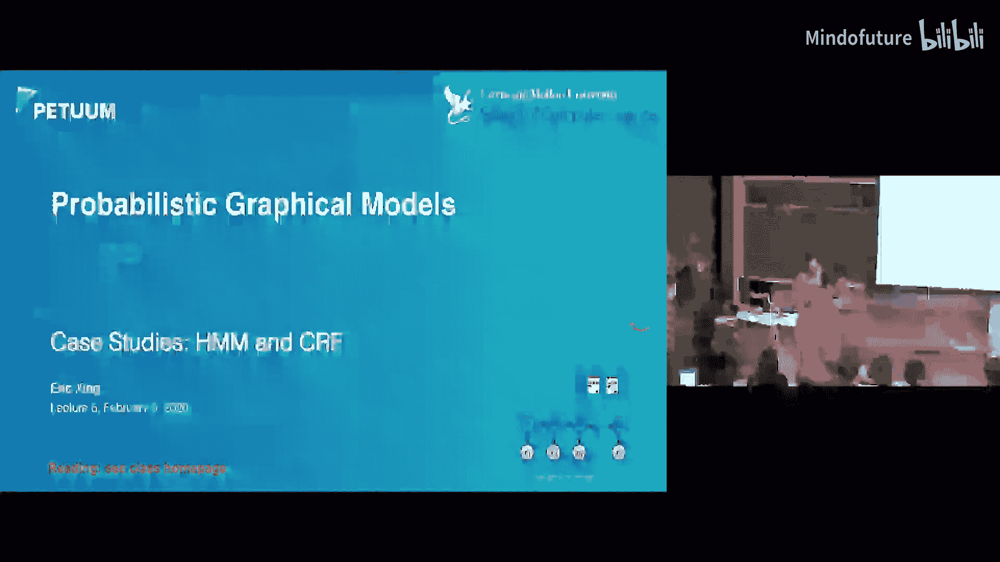
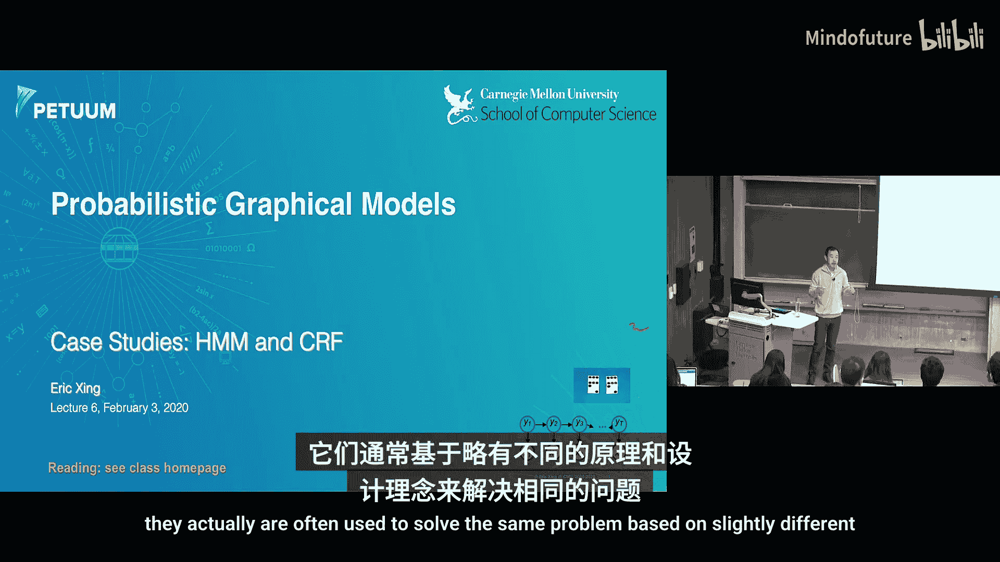
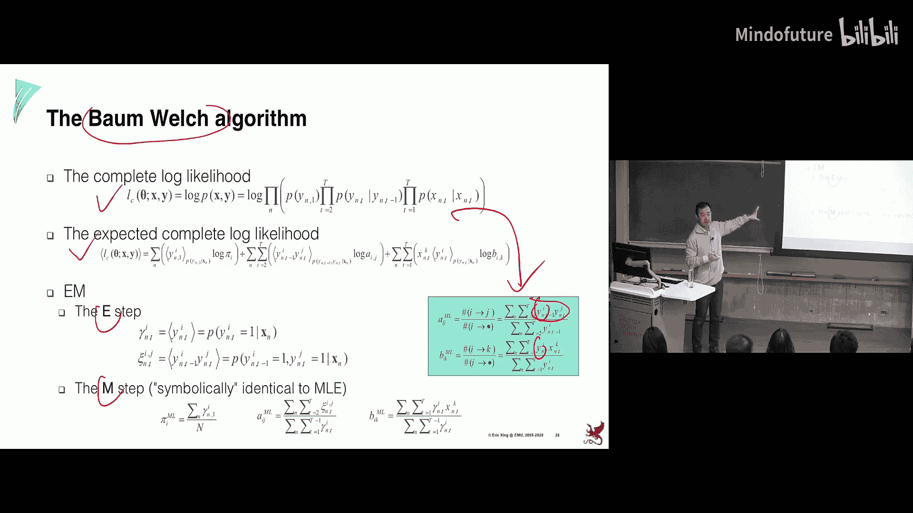
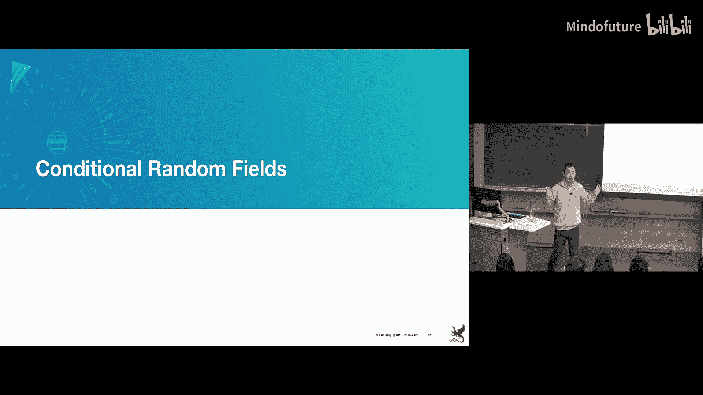
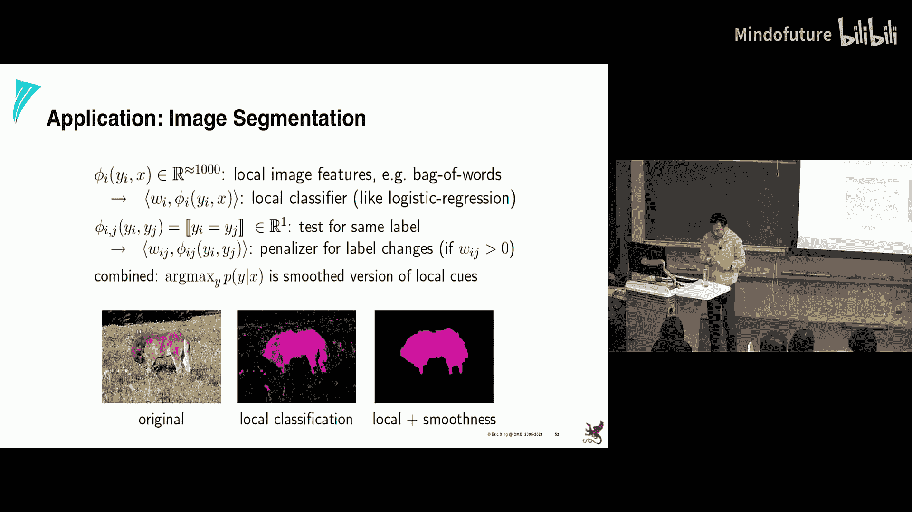

# 006：案例研究-隐马尔可夫模型和条件随机场 🧠

在本节课中，我们将学习两个经典的序列建模工具：隐马尔可夫模型和条件随机场。我们将回顾它们的基本形式、推理算法和学习方法，并探讨它们各自的优缺点。

## 概述

我们已经学习了有向和无向图模型的基本形式，以及如何进行精确推理和最大似然学习。本节课我们将聚焦于具体的应用案例，从最基础、最著名的模型开始，逐步深入到一些现代案例。我们将看到之前学过的所有知识如何在一个具体问题中汇聚。

## 隐马尔可夫模型

上一节我们介绍了图模型的基础，本节中我们来看看一个经典的序列模型——隐马尔可夫模型。

HMM可以被视为对独立数据点堆栈的时间展开。数据点通过隐藏变量Y连接起来。例如，在语音识别中，我们的发音具有时间依赖性；在生物信息学中，人类基因组序列的解码也使用了HMM，其状态可以代表基因内、基因外或其他功能元件。

### HMM的基本构成

一个HMM包含以下几个基本要素：

*   **观测序列**：一个序列，其值域可以是离散的类别空间或连续的实数空间。
*   **隐藏状态**：通常是离散的索引集 {1, 2, ..., M}，每个索引可以赋予不同的属性（如聚类名称、位置、基因功能等）。
*   **转移概率**：定义从状态i到状态j的转移概率 `a_{ij}`。通常假设其具有平稳性，即对所有时间步t使用相同的转移矩阵。
*   **初始概率**：定义第一个隐藏状态Y1的分布，类似于图模型中的根节点边际分布。
*   **发射概率**：定义给定隐藏状态下观测变量的条件概率 `P(X_t | Y_t = i)`。对于聚类问题，这可以是一个以状态i为索引的高斯分布。

整个模型的联合概率可以依据图模型分解定理写出：
`P(X, Y) = P(Y_1) * ∏_{t=2}^{T} P(Y_t | Y_{t-1}) * ∏_{t=1}^{T} P(X_t | Y_t)`

### HMM的推理：前向-后向算法

推理任务之一是计算给定整个观测序列下，某个隐藏状态的后验概率 `P(Y_t = i | X_{1:T})`。

这可以通过消元法实现，从前向后或从后向前消除不关心的变量。前向算法是一种从左到右的消息传递算法。

以下是前向算法的核心递归公式，用于计算前向消息 `α_t(i)`：
`α_t(i) = P(X_{1:t}, Y_t = i)`
`α_t(i) = [∑_{j} α_{t-1}(j) * a_{ji}] * P(X_t | Y_t = i)`

类似地，后向算法计算后向消息 `β_t(i)`：
`β_t(i) = P(X_{t+1:T} | Y_t = i)`
`β_t(i) = ∑_{j} [a_{ij} * P(X_{t+1} | Y_{t+1}=j) * β_{t+1}(j)]`

得到前向和后向消息后，单个状态的后验概率可以方便地计算：
`P(Y_t = i | X_{1:T}) ∝ α_t(i) * β_t(i)`

前向-后向算法本质上是和积算法在HMM这个树状图上的具体应用。

### 维特比算法：最可能状态序列解码

如果我们想找到最可能的整个隐藏状态序列 `argmax_Y P(Y | X)`，直接计算联合后验并存储所有可能序列的代价是指数级的。

维特比算法通过动态规划巧妙地解决了这个问题。它定义了一个量 `δ_t(i)`，表示到时间t为止，以状态i结尾的最可能路径的概率。
其递归公式为：
`δ_t(i) = max_{j} [δ_{t-1}(j) * a_{ji}] * P(X_t | Y_t = i)`
与和积算法（前向算法）的关键区别在于，求和符号 `∑` 被最大化操作 `max` 所取代。

在实现时，需要注意数值下溢问题，通常通过对数域操作将乘积转换为求和来解决。

### HMM的学习

HMM的学习分为有监督和无监督两种情况。

**有监督学习**：当隐藏状态序列Y和观测序列X都已知时，学习非常简单。以下是参数估计公式（使用参数共享和平稳性假设）：
*   转移概率 `a_{ij}` 的估计：从状态i转移到状态j的次数，除以从状态i出发的总转移次数。
*   发射概率的估计：在状态i下观测到符号x的次数，除以处于状态i的总次数。

为了避免零计数导致的过拟合，可以使用加平滑（伪计数）技术，这可以从贝叶斯角度用先验分布来合理化。

**无监督学习**：当隐藏状态序列Y未知时，需要使用EM算法（在HMM中特称为Baum-Welch算法）。
*   **E步**：利用当前模型参数，运行前向-后向算法，计算所有单状态后验 `γ_t(i) = P(Y_t=i|X)` 和相邻状态对的后验 `ξ_t(i,j) = P(Y_t=i, Y_{t+1}=j|X)`。
*   **M步**：将有监督学习MLE公式中的计数（如从i到j的转移次数 `N_{ij}`），替换为它们在当前后验分布下的期望值 `E[N_{ij}] = ∑_t ξ_t(i,j)`。然后像有监督情况一样更新参数。

## 从HMM到条件随机场

尽管HMM非常成功，但它存在一些局限性，这促使了条件随机场的发展。

### HMM的局限性

HMM主要有两个短板：
1.  **难以系统性地捕获非局部知识**：HMM的转移和发射概率都是局部定义的。例如，预测下一个词可能只依赖于前一个词，而无法方便地利用整个句子的语境、格式（如斜体、括号）等信息。
2.  **学习目标与预测目标不匹配**：HMM的学习目标是最大化联合概率 `P(X, Y)` 或边际概率 `P(X)`，但我们的最终任务通常是给定X预测Y，即最大化条件概率 `P(Y|X)`。这就像为了去华盛顿DC，先坐火车到纽约再折返。

一个经典的“标注偏置问题”揭示了局部归一化带来的弊端。在一个状态转移选项中，如果一个“孤僻”的状态只有少数几个转移方向，那么即使它对某个目标的“倾向”绝对值不高，其转移概率也可能显得比一个“社交”状态对其“最好朋友”的转移概率还要高，因为后者的概率被众多选项稀释了。这种局部比较可能产生违反直觉的全局最优路径。

### 条件随机场的定义

CRF直接对条件分布 `P(Y|X)` 建模，绕过了对 `P(X)` 的建模。它使用全局归一化的势函数，而非局部归一化的条件概率。

CRF的条件概率定义如下：
`P(Y|X) = (1/Z(X)) * exp( ∑_{t} ∑_{k} λ_k f_k(Y_t, X) + ∑_{t} ∑_{l} μ_l g_l(Y_t, Y_{t+1}, X) )`
其中：
*   `f_k` 是状态特征函数，依赖于当前状态 `Y_t` 和整个观测序列 `X`。
*   `g_l` 是转移特征函数，依赖于相邻状态对和整个观测序列 `X`。
*   `λ_k` 和 `μ_l` 是待学习的权重参数。
*   `Z(X)` 是配分函数，用于全局归一化。

关键优势在于，特征函数 `f` 和 `g` 可以灵活地访问整个观测序列 `X`，从而能够融入非局部特征。同时，势函数 `exp(...)` 本身不需要局部归一化，归一化由全局的 `Z(X)` 完成，避免了标注偏置问题。

### CRF的推理与学习

**推理**：在链式CRF上，计算条件概率 `P(Y|X)` 或寻找最可能序列 `argmax_Y P(Y|X)` 的算法，与HMM中的前向-后向算法和维特比算法在形式上几乎完全相同，只是将局部概率替换为相应的势函数。消息传递（和积算法或最大和算法）依然适用且高效。

**学习**：在完全观测（给定X和Y）的情况下，CRF的学习目标是最大化条件似然 `P(Y|X)`。与有监督HMM的简单计数不同，CRF的梯度计算涉及配分函数 `Z(X)`。

损失函数 `L = -log P(Y|X)` 关于参数 `λ_k` 的梯度具有如下形式：
`∂L/∂λ_k = E_{P(Y|X)}[f_k(Y, X)] - f_k(Y_{true}, X)`
即，特征函数在当前模型条件分布 `P(Y|X)` 下的期望值，减去在真实标注 `Y_{true}` 下的观测值。

因此，**即使是在有监督学习中，CRF的参数更新也需要进行推理**（计算期望 `E[f_k]`），这通常通过运行前向-后向算法来计算所需的后验边际概率。学习过程通常使用基于梯度的优化算法（如梯度下降、L-BFGS）进行迭代，直到收敛。

## 总结

本节课中我们一起学习了两个核心的序列模型。我们回顾了隐马尔可夫模型的基本构成、高效的前向-后向推理算法、维特比解码算法以及有监督和无监督学习策略。接着，我们探讨了HMM的局限性，并引出了条件随机场模型。CRF通过直接对条件概率建模并使用全局归一化的势函数，提供了融入丰富非局部特征的灵活性，并避免了标注偏置问题。虽然CRF的学习因涉及推理而比有监督HMM更复杂，但其表达能力和理论上的优势使其在许多序列标注任务中成为强大的工具。理解这两个模型的联系与区别，对于在具体问题中选择和设计合适的模型至关重要。