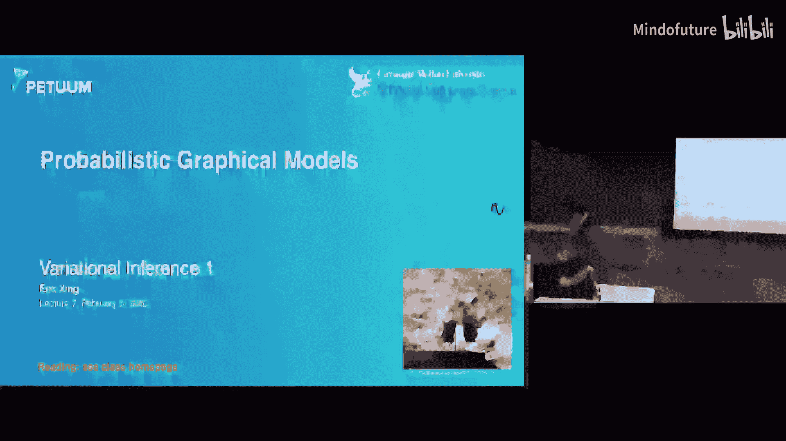
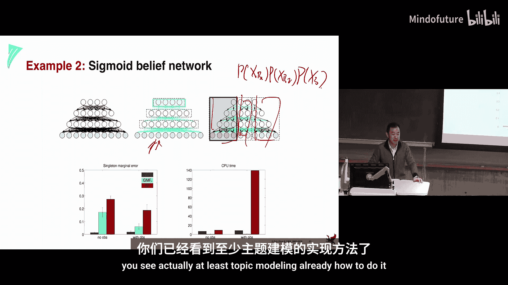

# 007：变分推断 1 🧠

在本节课中，我们将学习一种强大的近似推断方法——变分推断。我们将从回顾精确推断的局限性开始，引出变分法的核心思想，并通过一个具体的主题模型（LDA）案例，详细讲解如何应用平均场近似进行变分推断。

## 精确推断的挑战

上一节我们介绍了精确推断，它要求图结构是树状的，并且变量范围是有限、离散的，或者有已知的积分方法（如高斯分布）。然而，在实际应用中，我们常常会遇到不满足这些条件的情况。

例如，图模型可能过于复杂，导致团的大小过大，使得精确求和或积分在计算上不可行。这时，我们就需要借助近似推断的方法。

## 近似推断概览

近似推断主要有两大技术路线：变分法和采样法。本节课我们聚焦于变分法。

变分法的核心思想是，用一个简单的、易于处理的分布 **Q** 来近似复杂的真实后验分布 **P**。我们通过优化一个距离度量（通常是KL散度）来找到最佳的 **Q**。从图的角度看，这相当于将原始复杂的图结构简化为一个更简单的子图结构。

以下是变分法中的一些主要技术：
*   **平均场**：将图简化为完全独立的节点，即 **Q** 是所有单变量边际分布的乘积。
*   **环状信念传播**：忽略图中的环状结构，直接在所有边上迭代传递消息。
*   **结构平均场**：将图简化为一些独立的簇（子图），而非完全独立的节点。
*   **期望传播**：通过改变损失函数来进行近似。

## 变分法原理

变分技术历史悠久，其本质是将一个数学问题重新表述为一个优化问题。例如，矩阵的特征值可以表示为某个优化问题的解。

在我们的场景中，查询目标（如计算边际分布）通常通过解析的求和或积分来完成。变分法告诉我们，这也可以通过解决一个使用梯度下降的优化问题来实现。

具体步骤如下：
1.  从一个复杂、难以处理的原始分布 **P** 开始。
2.  将其投影到一个由参数 **α** 定义的、简单的分布族 **Q** 中。
3.  通过最小化 **Q** 和 **P** 之间的距离（如KL散度），找到最优的参数 **α***，从而得到最佳近似 **Q***。
4.  在 **Q*** 上执行查询（如计算边际分布）会变得非常容易。

对于平均场近似，我们通常定义 **Q** 为所有单变量边际分布的乘积。最小化 KL散度 **KL(Q||P)** 等价于最大化一个被称为**变分下界**或**自由能**的目标函数，其形式为 **Q** 的熵加上 **P** 的“能量”在 **Q** 下的期望。

## 案例研究：主题模型与LDA

为了具体说明变分推断，我们以潜在狄利克雷分配模型为例。主题模型的设计源于处理海量文本的实际需求，其目标是从文档集合中自动发现隐含的“主题”，并将每篇文档表示为这些主题上的混合比例，从而实现降维和语义理解。

LDA是一个典型的贝叶斯层次模型：
*   每篇文档有一个主题比例 **θ**，服从狄利克雷先验。
*   对于文档中的每个词，根据 **θ** 选择一个主题 **z**。
*   根据该主题对应的词分布 **β** 生成观测到的词 **w**。

推理任务是计算所有隐藏变量（**z**, **θ**, **β**）的后验分布。由于需要耦合地积分或求和所有连续和离散变量，精确计算是难解的。

## 应用于LDA的变分推断

我们引入一个完全分解的变分分布 **Q** 来近似真实后验：
`Q(θ, z, β) = q(θ|γ) * ∏_n q(z_n|φ_n) * ∏_k q(β_k|λ_k)`
这里，**γ**, **φ**, **λ** 是变分参数，分别对应主题比例、主题分配和主题词分布的近似。

通过将 **Q** 代入并优化变分下界，我们可以推导出更新这些变分参数的坐标上升方程。例如，**λ_{k,j}**（主题k中词j的频率参数）的更新依赖于所有文档中词j的出现次数，并按该词被分配到主题k的变分概率 **φ** 进行加权。

这些更新方程构成了变分E步：固定原始模型参数，迭代更新变分参数直至收敛。如果需要，还可以在此基础上设计M步来点估计原始模型参数（如 **β**），或者直接使用变分参数提供的充分统计量。

## 模型评估的思考

评估主题模型颇具挑战性，因为“主题”本身具有一定主观性。客观的评估方法包括：
*   **模拟研究**：从已知参数的LDA模型生成合成数据，然后运行推断算法并比较恢复的参数与真实值之间的误差。
*   **经验评估**：在带有类别标签的文档集上，使用推断出的主题向量进行分类，以准确率作为间接评估指标。
*   **计算困惑度**：衡量模型对未见文档的预测能力。

然而，评估常常与模型设计、推断近似质量等因素交织在一起，需要谨慎对待。

## 总结

本节课我们一起学习了变分推断的核心思想。我们了解到，当精确推断不可行时，可以通过引入一个参数化的简单分布族 **Q** 来近似复杂后验 **P**，并通过优化KL散度来寻找最佳近似。平均场近似是其中一种强大而直接的方法，它假设所有变量独立。

我们以LDA主题模型为例，详细展示了如何构建完全分解的变分分布，并推导出变分参数的更新方程。变分推断不仅提供了后验的近似，其变分参数本身也包含了估计模型原始参数所需的信息。尽管评估存在挑战，但变分推断为处理复杂的概率图模型推理问题提供了一个坚实而灵活的框架。