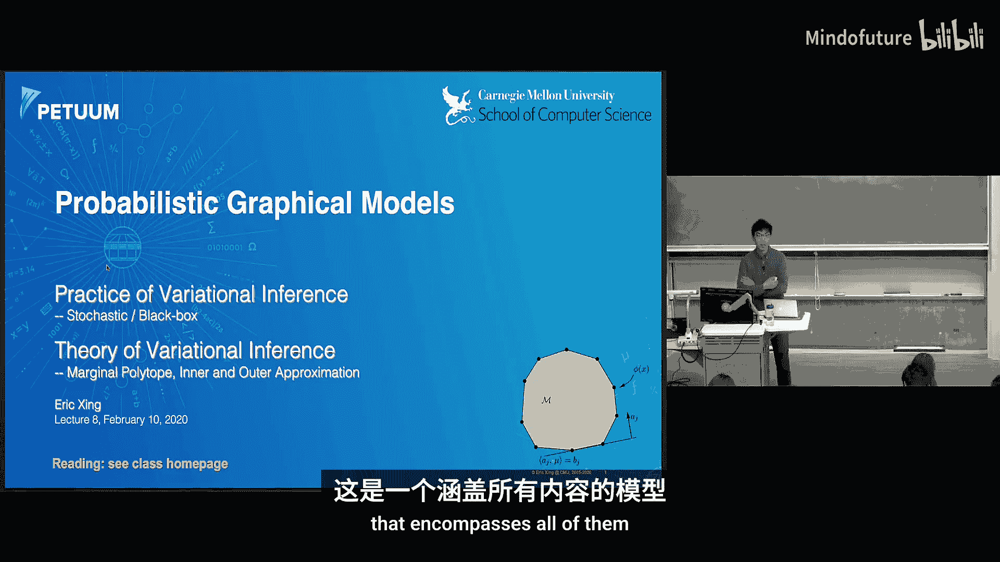
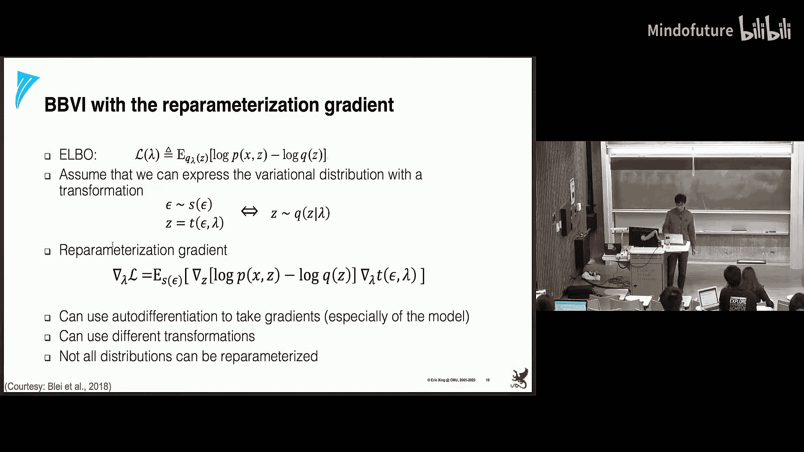
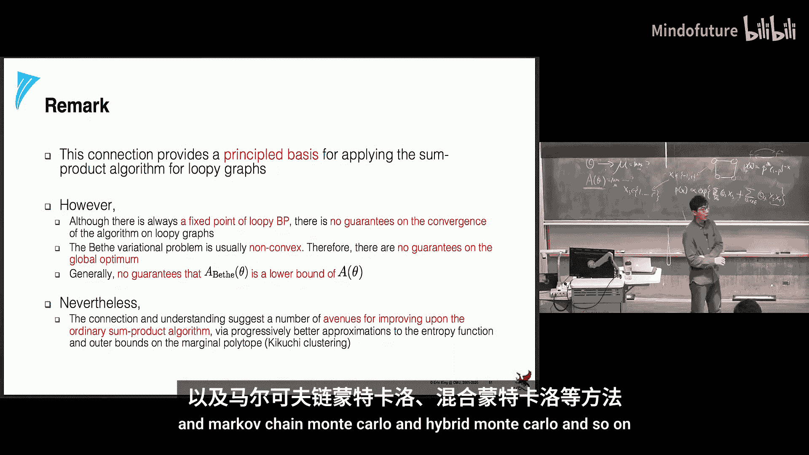

# 008：变分推断（二）🎓

在本节课中，我们将继续学习变分推断。上一节我们介绍了变分推断的基础及其在主题模型中的应用。本节中，我们将探讨更高级的变分推断技术，包括随机变分推断和黑盒变分推断。最后，我们将从更高层次讨论均值场和信念传播等方法背后的统一理论。

## 回顾：主题模型与均值场推断

上次我们讨论了主题模型，这是一种忽略词序信息、对文档集合进行建模的混合模型。该模型的推断过程通常很困难，因此我们采用了近似推断方法，具体来说是变分推断，更具体地说是均值场变分推断。

均值场变分推断对应于将复杂的后验分布近似为一系列独立因子的乘积。通过优化证据下界，我们可以对变分近似参数进行坐标下降法优化。

在主题模型等隐变量模型中，通常存在两类参数：影响所有数据的全局参数（如主题参数 `β`）和仅与单个数据点相关的局部参数（如文档主题分布 `θ` 及其变分参数）。标准的变分推断需要遍历所有数据点更新局部参数后，再更新全局参数，这在数据量巨大时效率低下。

## 随机变分推断 🔄

为了解决大数据场景下的效率问题，我们可以借鉴随机梯度下降的思想，发展出随机变分推断。

其核心思想是将目标函数（证据下界）分解为全局参数部分和局部参数部分之和。由于全局部分不依赖于单个数据点，我们可以先对局部参数进行优化（这通常有闭式解且计算廉价），然后利用局部优化结果，对全局参数的梯度进行随机近似估计。这样，我们可以在处理每个或每小批数据后立即更新全局模型，实现更频繁的模型更新和更快的收敛。这种方法也被称为在线变分推断。

## 自然梯度 🌿

在优化与分布相关的目标函数时，我们需要注意到参数空间的距离与分布空间的距离是不同的。例如，两个高斯分布的均值参数相差相同，但若方差不同，它们之间的KL散度可能差异巨大。即使参数代表相同的分布，不同的参数化方式（如方差 vs. 精度）也对应着不同的距离尺度。

因此，在优化分布参数时，使用朴素的欧几里得几何可能不是最佳选择。自然梯度方法通过使用费雪信息矩阵（对数似然的负海森矩阵期望）作为二阶近似，来考虑参数空间的曲率信息。其更新规则类似于牛顿法，但使用了反映分布空间几何特性的度量。

将自然梯度融入随机变分推断，可以得到性能更优的算法。

## 黑盒变分推断 📦

传统的变分推断严重依赖于似然函数与先验分布的共轭性，以简化计算。然而，很多时候我们希望使用非共轭的先验，这时传统方法就失效了。黑盒变分推断旨在解决这个问题。

其核心思想是使用一个灵活的模型（如神经网络）作为变分分布 `q(z; λ)` 的近似，从而能够处理任意的生成模型 `p(x, z)`。我们主要介绍两种梯度估计方法：得分函数梯度和重参数化梯度。

我们的目标是优化证据下界 `ELBO(λ)`，这需要计算其对变分参数 `λ` 的梯度。

**得分函数梯度** 通过一系列推导（利用对数导数的链式法则和得分函数的期望为零的性质），可以将梯度表达为关于变分分布 `q` 的期望形式：
`∇_λ ELBO = E_{z∼q} [ (log p(x,z) - log q(z; λ)) ∇_λ log q(z; λ) ]`
这个期望可以用蒙特卡洛采样来近似。这种方法也被称为强化梯度估计，但其方差通常较高。

**重参数化梯度** 是另一种方法，它将变分分布 `q` 表示为某个简单随机变量（如标准高斯）的可微变换。通过这种重参数化，可以将梯度“移入”期望内部，从而得到方差更低的梯度估计。这是变分自编码器（VAE）的核心思想。

## 变分推断的统一视角 🔗

接下来，我们从更高层次探讨均值场和信念传播等变分推断方法的统一理论。我们将看到，精确推断问题可以表述为一个变分优化问题。

我们考虑无向图模型（马尔可夫随机场）。推断任务中常关注的是单变量或变量对的边际分布，以及归一化常数（配分函数）`Z`。为了将这些查询表示为变分问题，我们需要指数族和凸分析作为工具。

指数族分布的概率密度函数可以写为：
`p(x; θ) = exp(θ^T φ(x) - A(θ))`
其中 `θ` 是自然参数，`φ(x)` 是充分统计量，`A(θ)` 是对数配分函数，它是一个凸函数。

许多马尔可夫随机场（如高斯MRF、伊辛模型）都可以写成指数族形式。在指数族中，边际参数（即充分统计量的期望 `μ = E[φ(x)]`）与自然参数 `θ` 是对偶的。计算 `μ` 或 `A(θ)` 本质上就是在进行边际推断。

利用凸共轭函数的概念，我们可以将对数配分函数 `A(θ)` 表示为关于边际参数 `μ` 的变分问题：
`A(θ) = sup_{μ∈M} {θ^T μ - A*(μ)}`
其中 `A*(μ)` 是 `A(θ)` 的凸共轭，在指数族中恰好等于分布 `p(x; θ(μ))` 的负熵 `-H(p)`。集合 `M` 是所有可实现的边际参数 `μ` 构成的集合，称为边际多面体。

因此，精确推断问题等价于在边际多面体 `M` 上求解一个优化问题。然而，对于一般图结构，边际多面体 `M` 由指数级数量的线性不等式定义，使得该优化问题难以求解。

**均值场方法** 对应于用一個更简单的内近似集合 `M_F ⊂ M` 来替换原始的边际多面体 `M`。这通常通过考虑一个简化图模型（如完全断开连接或树结构图）来实现，该模型的推断是容易的。由于约束更紧，由此得到的 `A(θ)` 的变分下界是真实值的下界。

**环状信念传播** 则对应于用一個更简单的外近似集合 `M^+ ⊃ M` 来替换 `M`，并配合一个近似的熵项 `B*(μ)`。由此推导出的消息更新规则恰好是该外近似优化问题的拉格朗日乘子。

## 总结 📝

本节课我们一起学习了变分推断的进阶内容。
*   我们首先介绍了**随机变分推断**，它通过随机梯度估计实现大规模数据下的高效在线学习。
*   接着探讨了**自然梯度**，它考虑了参数空间的几何结构，能提供更合理的优化方向。
*   然后，我们了解了**黑盒变分推断**，它利用得分函数梯度或重参数化梯度，使得变分推断能够应用于非共轭模型。
*   最后，我们从统一视角回顾了变分推断，将精确推断表述为在边际多面体上的优化问题，并解释了**均值场**（内近似）和**环状信念传播**（外近似）作为解决该难解问题的两种近似策略的本质。

下节课，我们将进入采样方法的学习，如蒙特卡洛、重要性采样和马尔可夫链蒙特卡洛等。