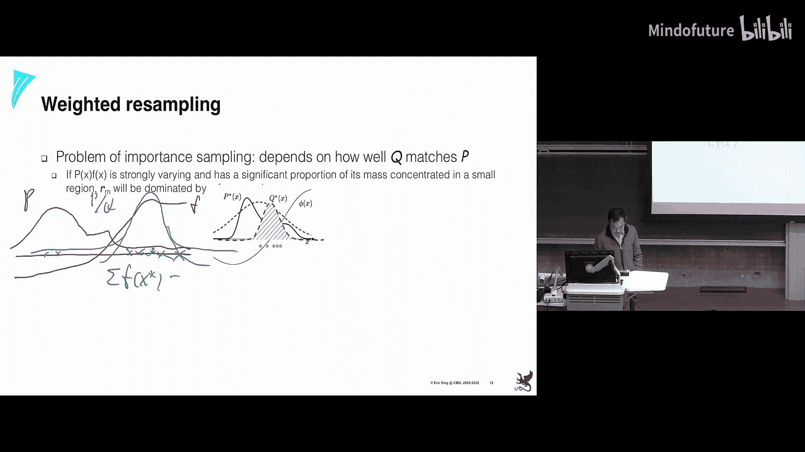
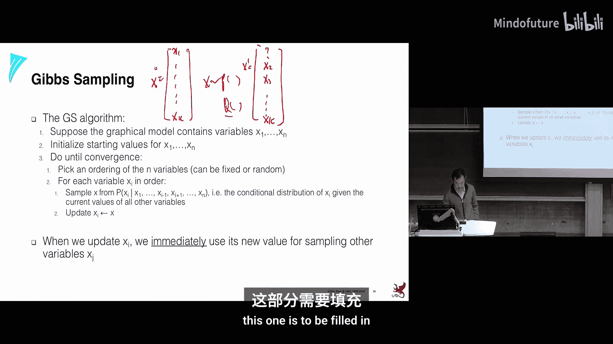
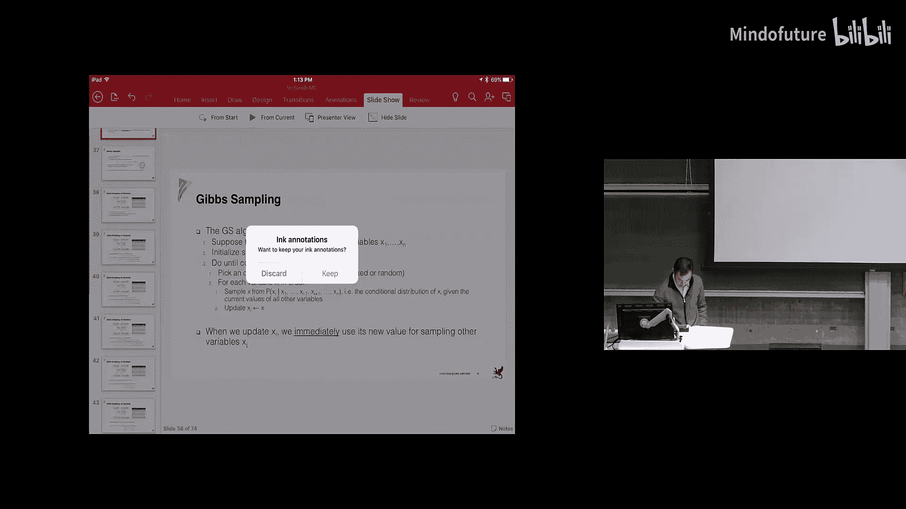

# 009：蒙特卡洛方法

在本节课中，我们将要学习蒙特卡洛方法。这是一种基于采样的推断方法，用于处理复杂概率分布下的积分或期望计算问题。我们将从简单的朴素采样开始，逐步探讨拒绝采样、重要性采样，并最终深入到马尔可夫链蒙特卡洛方法的核心思想。

## 背景与动机

上一节我们介绍了变分推断方法，如平均场和环状信念传播。这些方法将推断问题转化为优化问题。然而，它们需要一定的数学技巧和推导。

本节中，我们来看看另一种强大的推断范式：基于采样的方法。其核心思想是，与其直接处理复杂的概率分布 \( P(x) \)，不如从该分布中抽取一系列样本 \( \{x^{(1)}, x^{(2)}, ..., x^{(N)}\} \)，然后用这些样本来近似计算我们感兴趣的统计量，例如期望值：

\[
\mathbb{E}_{P(x)}[f(x)] \approx \frac{1}{N} \sum_{i=1}^{N} f(x^{(i)})
\]

这种表示是隐式的，没有解析形式，但非常灵活。

## 朴素采样与挑战

在概率图模型中，若图结构简单（如树结构或可管理的联结树），我们可以进行精确推断。对于更复杂的图，我们之前学习了变分推断方法。

基于采样的方法从一个简单的想法开始：从联合分布中生成样本。例如，在一个贝叶斯网络中，我们可以按照拓扑顺序，根据每个节点的条件概率分布进行采样。

然而，朴素采样面临几个主要挑战：
1.  **如何从复杂分布中采样**：许多分布没有现成的采样方法。
2.  **样本利用效率**：许多样本可能对估计目标量贡献很小，尤其是在估计罕见事件的条件概率时。
3.  **需要大量样本**：为了获得稳定的估计，尤其是对尾部概率，需要非常多的样本。

蒙特卡洛方法这门学科正是研究如何解决这些问题。

## 拒绝采样

为了解决从复杂分布 \( \pi(x) \) 中采样困难的问题，拒绝采样引入了一个易于采样的提议分布 \( Q(x) \)。

**算法步骤如下：**
1.  从提议分布 \( Q(x) \) 中抽取一个样本 \( x^* \)。
2.  计算接受概率 \( A = \frac{\pi'(x^*)}{K \cdot Q(x^*)} \)，其中 \( \pi'(x) \) 是目标分布未归一化的部分（处理难以计算归一化常数的问题），\( K \) 是一个常数，确保对于所有 \( x \)，有 \( K \cdot Q(x) \geq \pi'(x) \)。
3.  以概率 \( A \) 接受样本 \( x^* \)，否则拒绝并回到步骤1。

可以证明，被接受的样本服从目标分布 \( \pi(x) \)。

**拒绝采样的缺陷**：其效率高度依赖于提议分布 \( Q(x) \) 与目标分布 \( \pi(x) \) 的匹配程度。如果 \( Q(x) \) 覆盖 \( \pi(x) \) 的区域很小（即 \( K \) 很大），那么绝大多数样本都会被拒绝，效率极低，在高维空间中这一问题尤为严重。

## 重要性采样

重要性采样不再拒绝样本，而是为每个样本赋予一个权重，从而更有效地利用所有样本。

**基本重要性采样**：假设可以从提议分布 \( Q(x) \) 中采样，且 \( Q(x) > 0 \)  whenever \( P(x) > 0 \)。我们计算每个样本的权重 \( w = P(x)/Q(x) \)。期望的估计为：

\[
\mathbb{E}_{P(x)}[f(x)] \approx \frac{1}{N} \sum_{i=1}^{N} w^{(i)} f(x^{(i)})
\]

**归一化重要性采样**：当目标分布 \( P(x) = P'(x)/Z \) 的归一化常数 \( Z \) 未知时，我们可以进行如下估计：
1.  从 \( Q(x) \) 中抽取样本 \( \{x^{(1)}, ..., x^{(N)}\} \)。
2.  计算未归一化权重 \( r^{(i)} = P'(x^{(i)})/Q(x^{(i)}) \)。
3.  估计归一化常数 \( Z \approx \hat{Z} = \frac{1}{N} \sum_{i=1}^{N} r^{(i)} \)。
4.  计算归一化权重 \( \tilde{w}^{(i)} = r^{(i)} / \hat{Z} \)。
5.  期望估计为 \( \sum_{i=1}^{N} \tilde{w}^{(i)} f(x^{(i)}) \)。

重要性采样的问题在于，如果提议分布 \( Q(x) \) 与目标分布 \( P(x) \) 差异很大，权重值可能非常不平衡（少数样本权重极高，多数样本权重极低）。这会导致估计的方差很大，并且可能陷入对某个局部区域的高估，而错过分布的其他重要部分（如另一个峰值）。

## 加权重采样

为了解决重要性采样中权重不平衡的问题，加权重采样（或称重采样）在获得一批带权重的样本后，根据这些权重的大小，重新从中抽取新的样本。

**过程如下：**
1.  通过重要性采样获得样本集 \( \{x^{(i)}\} \) 及其对应权重 \( \{w^{(i)}\} \)。
2.  将权重归一化为概率。
3.  根据这个概率分布，从原有样本集中进行有放回地抽样，生成新的样本集。

这样，高权重的样本被复制的机会更大，低权重的样本被复制的机会更小。新的样本集可以近似看作来自目标分布，然后可以直接用于计算等。但这是一个批处理算法，需要存储所有样本。

## 马尔可夫链蒙特卡洛

MCMC的核心思想是构建一个马尔可夫链，其平稳分布恰好就是我们想要采样的目标分布 \( P(x) \)。这样，当链运行足够长时间后，其状态就可以作为来自 \( P(x) \) 的样本。

### Metropolis-Hastings 算法

MH算法是MCMC的一个经典实现。它使用一个任意的提议分布 \( Q(x' | x) \) 来建议下一个状态，然后通过一个接受概率来决定是否转移到该状态。

**算法步骤如下：**
1.  初始化状态 \( x^{(0)} \)。
2.  对于 \( t = 0, 1, 2, ... \)：
    *   从提议分布 \( Q(x' | x^{(t)}) \) 中生成候选状态 \( x^* \)。
    *   计算接受概率：
        \[
        A = \min \left( 1, \frac{P(x^*)}{P(x^{(t)})} \cdot \frac{Q(x^{(t)} | x^*)}{Q(x^* | x^{(t)})} \right)
        \]
    *   以概率 \( A \) 接受候选状态，令 \( x^{(t+1)} = x^* \)；否则拒绝，令 \( x^{(t+1)} = x^{(t)} \)。

可以证明，在满足一定条件（不可约性、非周期性）下，该马尔可夫链的平稳分布就是 \( P(x) \)。初始的一段样本可能不服从平稳分布，通常会被丢弃，这段时期称为“预烧期”。

### Gibbs 采样

Gibbs采样是MH算法的一个特例，特别适用于概率图模型。它每次只更新随机变量向量的一个维度。

**算法步骤如下：**
1.  初始化所有变量 \( \mathbf{x}^{(0)} = (x_1^{(0)}, ..., x_K^{(0)}) \)。
2.  对于 \( t = 0, 1, 2, ... \)：
    *   对于每个变量维度 \( k = 1, ..., K \)：
        *   从条件分布 \( P(x_k | x_1^{(t+1)}, ..., x_{k-1}^{(t+1)}, x_{k+1}^{(t)}, ..., x_K^{(t)}) \) 中采样得到 \( x_k^{(t+1)} \)。在概率图模型中，这个条件分布通常只依赖于马尔可夫毯内的变量，易于计算。
    *   完成对所有维度的更新后，得到新样本 \( \mathbf{x}^{(t+1)} \)。

Gibbs采样可以看作是MH算法中，提议分布取为精确条件分布 \( P(x_k | \mathbf{x}_{-k}) \) 的特例。在这种情况下，接受概率 \( A \) 恒为1，即所有提议都被接受，效率很高。

### 理论保证：马尔可夫链

为了理解MCMC的收敛性，我们需要一些马尔可夫链的基本概念：
*   **转移核** \( T(x' | x) \)：给定当前状态 \( x \)，下一时刻状态为 \( x' \) 的概率。
*   **平稳分布** \( \pi(x) \)：满足 \( \pi(x') = \sum_x \pi(x) T(x' | x) \) 的分布。一旦链达到平稳分布，后续的状态都将服从该分布。
*   **不可约性**：从任何状态出发，经过有限步都能以正概率到达任何其他状态。
*   **非周期性**：链返回任何状态的时刻没有固定的周期。
*   **细致平衡条件**：如果转移核满足 \( \pi(x) T(x' | x) = \pi(x') T(x | x') \)，则 \( \pi(x) \) 是该链的平稳分布。MH算法和Gibbs采样都构造了满足以 \( P(x) \) 为平稳分布的细致平衡条件的转移核。

## 总结

本节课中我们一起学习了蒙特卡洛方法的核心思想与主要算法。我们从最简单的基于采样的期望估计出发，指出了朴素采样的不足。接着，我们学习了拒绝采样和重要性采样，它们通过引入提议分布来从复杂分布中获取样本，但分别存在效率低下和权重失衡的问题。随后，我们进入了马尔可夫链蒙特卡洛的领域，Metropolis-Hastings算法通过构建一个以目标分布为平稳分布的马尔可夫链来生成样本。最后，我们探讨了特别适用于概率图模型的Gibbs采样，它通过迭代地从每个变量的条件分布中采样，高效地实现了MCMC。这些方法为在复杂概率模型中进行近似推断提供了强大而实用的工具。