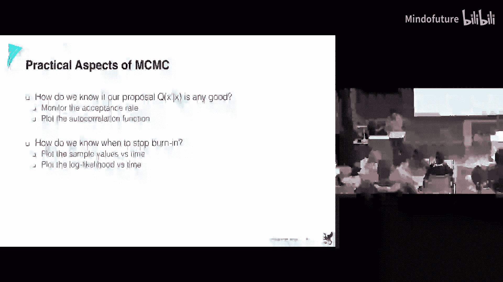
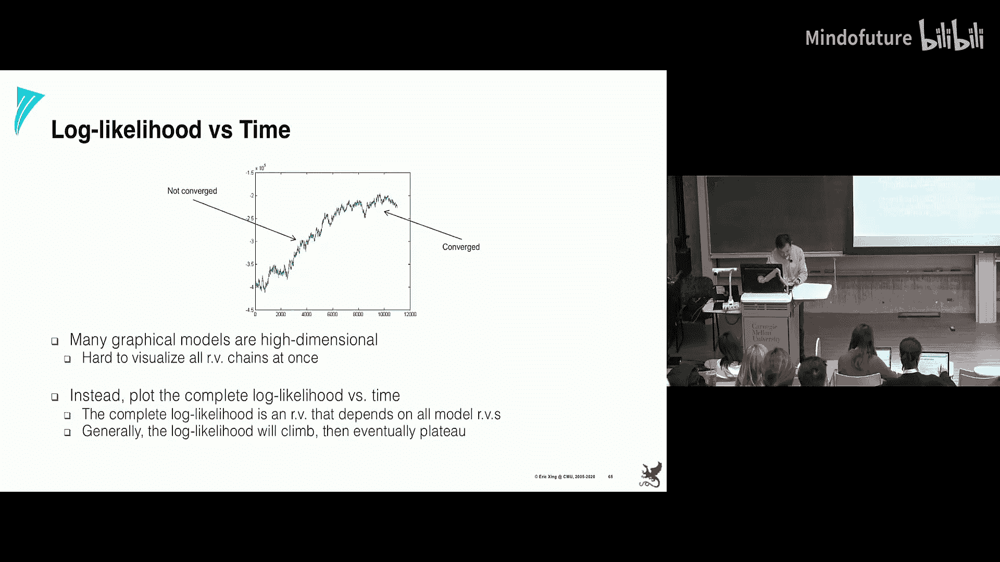
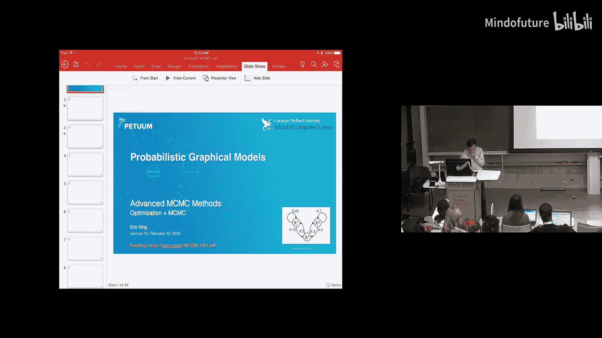
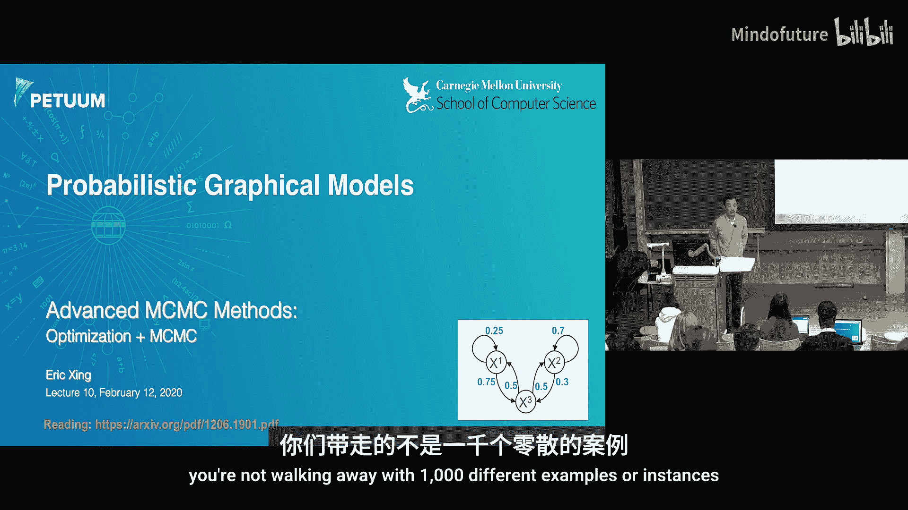
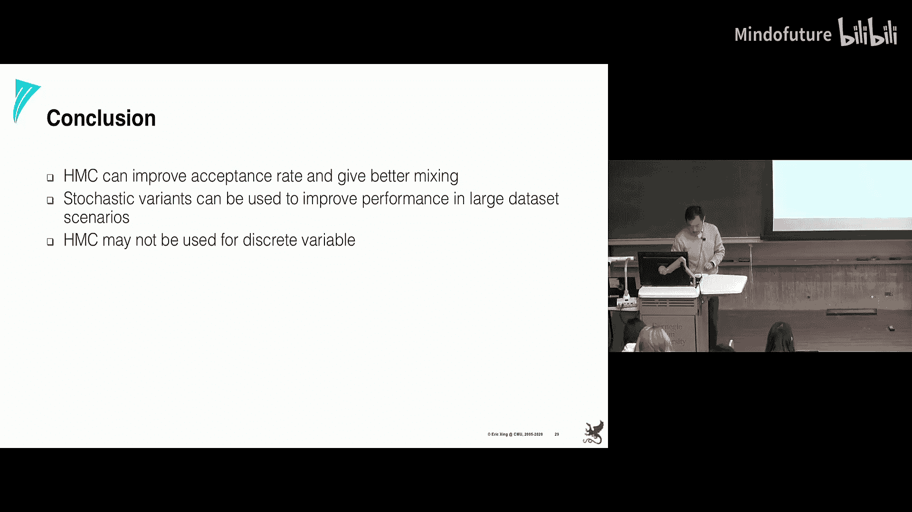
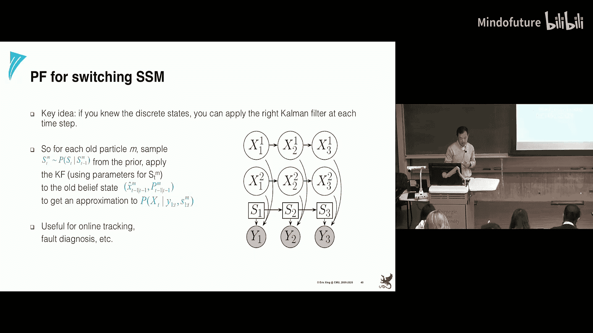

# 010：高级MCMC方法 🚀

在本节课中，我们将学习高级马尔可夫链蒙特卡洛方法。我们将首先回顾并完成上次课程遗留的内容，然后探讨如何将梯度信息等优化技术融入采样过程，以提升采样效率。最后，我们会介绍一些结合变分推断与MCMC的混合方法。

## 回顾与问题诊断 🔍

上一节我们介绍了蒙特卡洛和MCMC方法。其核心思想是使用一个易于采样的**提议分布**来绕过难以直接采样的**目标分布**。MCMC通过一个随时间变化的提议分布（基于前一个样本）来生成序列，并最终收敛到目标分布。

然而，即使MCMC方法也可能遇到问题。在实践中，我们需要监控两个关键指标来判断采样过程是否有效。

以下是评估采样质量的两个核心指标：

1.  **接受率**：如果提议分布与目标分布不匹配，可能导致大量样本被拒绝。例如，在目标分布概率密度变化剧烈的区域（如“悬崖”边缘），一个对称的高斯提议可能有一半的样本会落入极低概率区域而被拒绝。通常，50%左右的接受率被认为是良好的。
2.  **自相关性**：MCMC样本序列通常是相关的，而许多估计方法假设样本是独立同分布的。高自相关性会降低样本的有效性。我们可以计算相隔 `k` 步的样本之间的自相关函数来评估。有效样本大小的计算公式为：`ESS = N / (1 + 2 * Σ ρ(k))`，其中 `N` 是总样本数，`ρ(k)` 是滞后 `k` 的自相关系数。

此外，还有其他诊断技巧，例如运行多个独立的马尔可夫链并观察它们是否**混合良好**——即不同链的样本轨迹是否收敛到相似的分布。另一种方法是监控基于样本计算的某个统计量（如数据的似然）是否稳定。

总而言之，蒙特卡洛方法是对我们之前学习的优化技术（如梯度下降）的补充。优化是确定性地沿着梯度方向更新参数，而采样则是以随机的方式抽取样本，并希望它们收敛到平衡分布。

接下来，我们将看到这两种看似迥异的技术如何被结合起来，产生更好的结果。

## 哈密顿蒙特卡洛 ⚛️

即使接受率为1的MCMC方法也可能不够理想。一个常见问题是**随机游走行为**可能导致低接受率或高自相关性。理想的提议应该能引导样本朝向高概率区域移动，而梯度信息正好能提供这种方向指引。

这就引出了**哈密顿蒙特卡洛**方法。它借鉴了物理学中的哈密顿动力学，通过引入辅助的**动量变量**，使我们能够在提议中利用目标分布对数概率的梯度。

在HMC中，我们定义了一个扩展的联合分布，它包含我们感兴趣的位置参数 `q`（对应目标分布）和辅助的动量参数 `p`。哈密顿量 `H(q, p)` 定义为势能 `U(q)`（即目标分布的负对数概率）与动能 `K(p)`（通常取简单的二次形式 `p^T p / 2`）之和。

哈密顿动力学由以下方程描述：
`dq/dt = ∂H/∂p`
`dp/dt = -∂H/∂q`

如果我们直接使用欧拉方法离散化这些方程来更新 `q` 和 `p`，序列可能会发散。因此，HMC采用了一种称为**蛙跳法**的数值积分方法，它能保持相空间体积，从而产生稳定的轨迹。

HMC的采样步骤如下：

1.  从标准正态分布中抽取动量 `p`。
2.  使用蛙跳法，从当前状态 `(q, p)` 出发，沿哈密顿轨迹模拟 `L` 步，得到提议状态 `(q*, p*)`。在模拟过程中，我们需要计算梯度 `∇U(q) = -∇ log π(q)`。
3.  以概率 `min(1, exp(-H(q*, p*) + H(q, p)))` 接受提议状态 `(q*, p*)`，否则保留原状态。

由于梯度信息引导了提议方向，HMC能更有效地探索高概率区域，并产生相关性更低的样本，尤其在处理高维分布时优势明显。

沿着利用梯度的思路，还有更进一步的变体，例如**朗之万动力学MCMC**。它本质上是只进行一步蛙跳积分的HMC，更新公式更紧凑。为了处理大数据集，还可以使用**随机梯度朗之万动力学**，即用小批量数据来近似计算梯度。

从提案发展的角度看，我们经历了从固定简单提议（MC），到基于前一样本的移动提议（MCMC），再到利用梯度信息构造智能提议（HMC）的过程。HMC巧妙地将优化中的梯度信息与MCMC的采样框架结合了起来。

> **注意**：HMC通常适用于连续变量，因为离散变量的梯度难以定义。

## 与变分推断的结合 🤝

我们还可以从另一个维度改进提议分布：利用对目标分布本身的近似知识。

回顾**变分推断**，其核心是找到一个易于处理的分布 `q(x)` 来近似复杂的目标后验分布 `p(x)`，通常通过最小化KL散度 `KL(q||p)` 来实现。

一个自然的想法是：**将变分推断得到的近似分布 `q(x)` 作为MCMC的提议分布**。这样做的 rationale 在于：
*   在变分推断中，我们通过优化得到一个接近目标分布的 `q(x)`。
*   将这个 `q(x)` 作为MCMC的提议，由于两者相近，有望获得更高的接受率。
*   MCMC采样步骤可以进一步修正变分近似的偏差，推动样本更接近真实目标分布 `p(x)`。

这个过程甚至可以迭代进行：用MCMC采样得到的样本信息来重新优化变分近似 `q(x)`，然后用更新后的 `q(x)` 作为新的提议，如此循环。这种**自适应提议**方法结合了变分推断（优化）和MCMC（采样）的优势，可以提高混合速率。

在实际解决大规模复杂模型（如深度生成模型）的推断问题时，我们往往需要这种**组合性**思维。模型的不同部分可能适合不同的推断技术：有些子问题可以用变分近似简化结构，有些连续参数的采样可以用HMC加速，而整体框架则用MCMC来协调。多种方法可以灵活组合，以应对不同层面的挑战。

## 序列蒙特卡洛与粒子滤波 🔄

最后，我们简要介绍一种重要的序列化采样技术：**粒子滤波**，它基于**序列蒙特卡洛**和**重加权采样**的思想。

考虑一个状态空间模型（如隐马尔可夫模型），其中转移概率或观测概率非常复杂，难以进行精确推断。粒子滤波的目标是**在线地**维护当前隐藏状态 `p(x_t | y_{1:t})` 的分布。

其核心步骤是：
1.  **预测**：根据上一时刻的样本集和状态转移模型，预测当前时刻的先验状态分布。
2.  **更新**：当获得新的观测 `y_t` 后，为每个预测样本计算一个权重，权重正比于观测似然 `p(y_t | x_t)`。
3.  **重采样**：根据权重对样本进行重采样，淘汰低权重的粒子，复制高权重的粒子。这解决了样本退化问题——即大量粒子聚集在低概率区域。

通过不断重复“预测-加权-重采样”的循环，粒子滤波可以仅用一组样本（粒子）来近似表示随时间演变的复杂后验分布。这种方法在目标跟踪、机器人定位等在线时序推理问题中非常有效。

## 总结 📚

本节课我们一起学习了多种高级MCMC方法：
*   我们首先学习了如何诊断MCMC的问题，如接受率和自相关性。
*   然后，我们深入探讨了**哈密顿蒙特卡洛**，它通过引入物理动力学和梯度信息，能更高效地探索目标分布，尤其适用于高维连续空间。
*   接着，我们看到了如何将**变分推断**与MCMC结合，使用变分近似作为智能提议分布，形成混合推断策略。
*   最后，我们了解了**序列蒙特卡洛**和**粒子滤波**，这是一种处理序列模型的在线采样方法，通过重加权与重采样来维持对时变后验分布的近似。

这些技术展示了如何将优化（梯度、变分下界）与采样（MCMC）的思想融合，为解决复杂的概率推断问题提供了更强大、更灵活的工具箱。从下节课开始，我们将进入深度学习与图模型交叉的领域，探索如变分自编码器等现代生成模型。