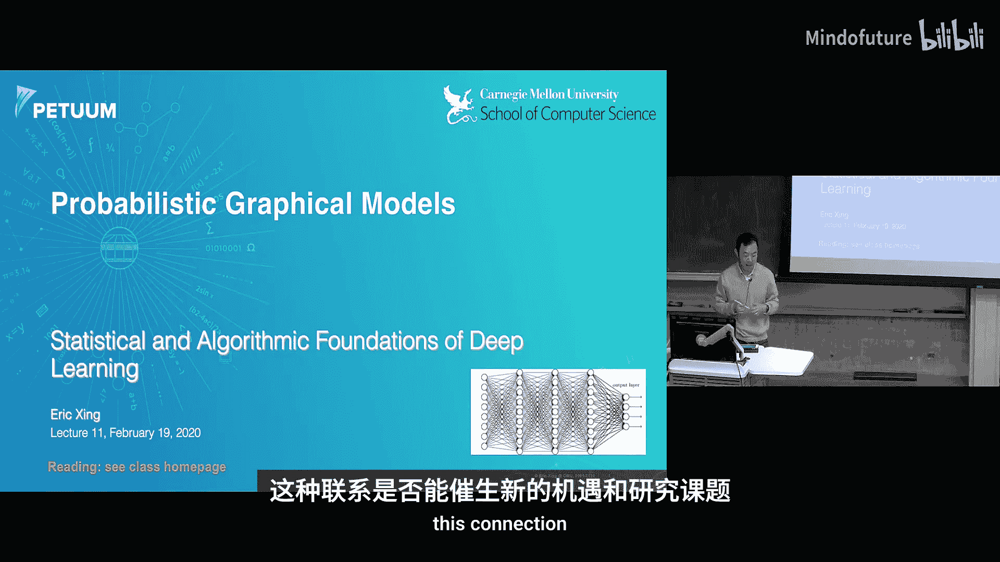
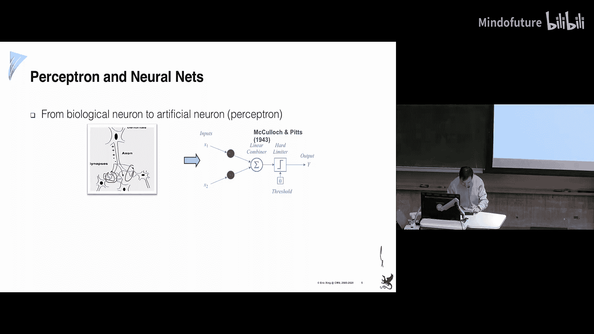
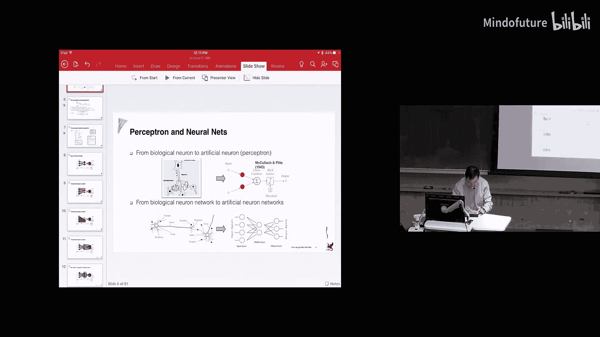
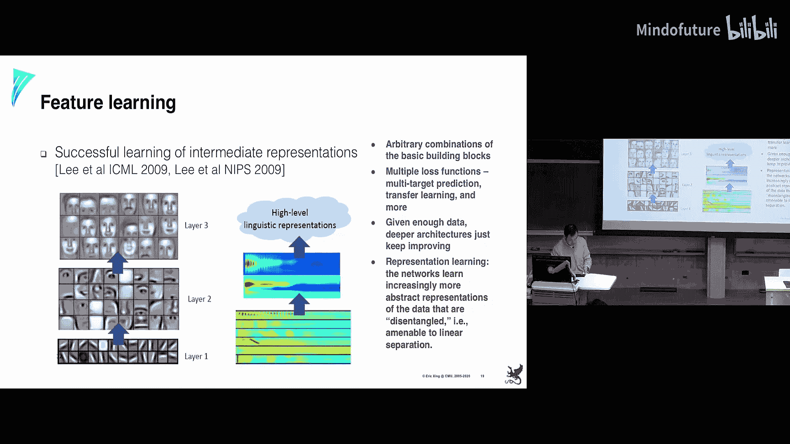
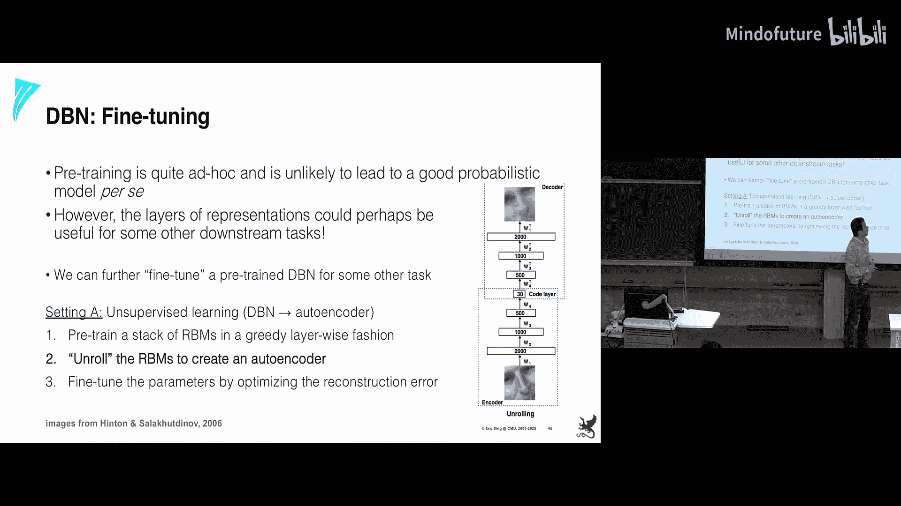
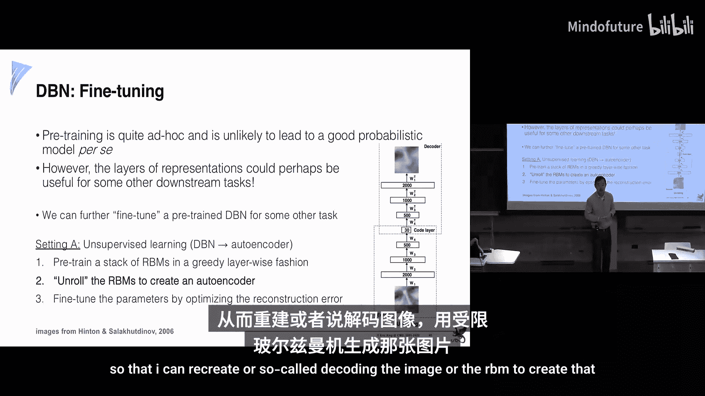
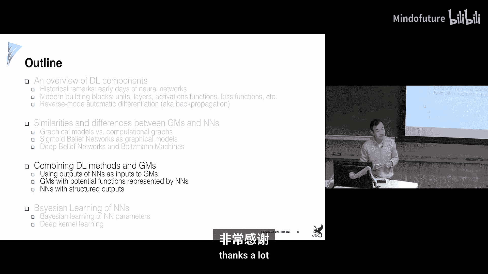

# 011：深度学习的统计与算法基础 🧠

在本节课中，我们将开始一个新的章节，探讨深度学习。深度学习是一个庞大的领域，但本课程将聚焦于其基础性问题，并建立其与机器学习其他领域（如图形模型）之间的联系，以探索潜在的交叉研究机会。

## 深度学习概述 📈

上一节我们介绍了图形模型，本节中我们来看看深度学习。从许多人的视角来看，早期的机器学习与深度学习有些相似：输入数据，调整参数，然后得到输出。随着领域发展，我们掌握了更多理论和内在机制。深度学习虽然历史悠久，但当前的理解是构建具有任意层数、宽度和连接性的庞大网络，然后进行训练。

那么，深度学习等同于机器学习吗？它们有何异同？为了回答这个问题，我们将从深度学习的历史和基础概念开始。

## 历史与基础：从生物神经元到人工神经元 🧬

神经科学家对人脑工作原理有长期研究。他们发现人脑约有100亿个神经元。每个神经元有细胞体、轴突（发出信号）和树突（接收信号），信号在突触处聚合。

受此启发，人们希望人工模拟这种结构。1943年，McCulloch和Pitts首次提出了**人工神经元**或**感知机**的概念。其图形表示与生物神经元相似：有输入、一个线性组合器、一个门限（激活函数），然后产生输出。

他们希望用此模拟大脑活动。当然，模拟大脑活动需要多个这样的神经元连接成网络。

### 感知机的数学描述

以下是感知机的基本数学描述：
*   **输入**：`x1, x2, ..., xn`
*   **线性组合**：`z = Σ (wi * xi) + b`，其中 `wi` 是权重，`b` 是偏置。
*   **激活函数**：`a = σ(z)`，其中 `σ` 是一个非线性函数，如Sigmoid函数：`σ(z) = 1 / (1 + e^(-z))`。
*   **输出**：`y = a`

模型中未知的是权重 `wi`。我们可以通过最大化某个目标函数来学习权重。这类似于我们学过的逻辑回归，其输出似然函数是逻辑函数。在感知机中，有时会使用不同的方法，例如关心输出的大小而引入**平方残差损失**。

然后，我们可以使用**梯度下降**算法：写出损失函数，求导并更新权重。Sigmoid函数的一个优良特性是其导数形式简洁：`σ'(z) = σ(z) * (1 - σ(z))`。由此得到感知机学习算法，它本质上是梯度下降。

当数据集很大时，计算整个数据集的梯度会很繁琐，因此有**随机版本**，每次使用一个样本进行更新。

## 从单层到多层：反向传播算法 🔄

将单个感知机扩展到神经网络。一个简单的网络可能包含多个感知机层。

现在的问题是：能否用同样的梯度下降思想来学习网络中所有权重？这里出现了新问题：中间层的节点没有可观察的输出用于比较。这引出了著名的**反向传播**算法。

从数学上看，我们有一系列输入变量，通过中间层生成输出。每个连接都有权重。我们需要计算输出相对于每个权重的导数。这可以通过链式法则实现。

这个过程可以看作是在一个**计算图**上操作。计算图记录了从输入到输出的每一步计算，也定义了计算梯度所需的反向步骤。这与图形模型不同，图形模型的节点和边是为了表示条件独立性而精心设计的，而这里的图主要是计算载体。

反向传播算法如今已被自动化，例如在TensorFlow等框架中。

## 深度网络的构建模块 🧱

现在，让我们从更高视角看看构建深度网络需要哪些基本模块。

*   **激活函数**：如线性组合、ReLU、Sigmoid、Tanh等。
*   **网络结构/层**：
    *   全连接层
    *   卷积层（连接下一层节点与上一层节点的子集）
    *   循环连接（可展开为水平节点层）
    *   带有捷径或旁路的块结构（如残差网络）
*   **损失函数**：用于衡量输出好坏，如交叉熵损失、均方误差损失。

这些模块可以任意组合，形成高度可组合的架构，并能同时容纳多个损失函数以完成多任务预测，甚至进行迁移学习。

人们通常相信，只要有足够的数据，深度架构就能不断学习并取得良好效果。这背后的一种观点是，深度神经网络在进行**表示学习**——网络能够从数据中逐步学习到越来越抽象的表示，并将它们“解耦”。例如，在训练人脸数据的深度网络时，人们发现底层权重像边缘检测器，中层权重像面部部件，高层权重则像完整的人脸。在语言处理中也有类似发现。因此，深度网络可以被视为表示学习。

## 深度学习与图形模型的哲学对比 🤔

到目前为止，我们所看到的深度学习与之前所学的图形模型有何根本不同？

在图形模型中，节点和边的设计非常严谨，每个节点都有明确含义（观测数据或隐藏原因），每条边也旨在反映特定的依赖关系。学习与推断是基于对结构的深入理解，并使用EM、消息传递、变分推断、MCMC等丰富工具。评估算法时，我们关心其能否准确恢复这些隐藏变量的真实值。

在深度学习中，表示主要是为了**计算**。它们是组织从输入到输出（或反向）计算的载体。节点的含义是事后发现的副产品，即使没有明确含义也无妨。人们不太担心学习算法本身（例如，直接调用TensorFlow库），而更关注设计惊人的网络架构。评估时，我们关心的是最终任务（如预测准确率、BLEU分数）的表现，而不是中间表示的恢复精度。

可以说，图形模型更偏向于严谨的数学实践，而深度学习更偏向于一种“艺术”，但它非常有效。早期这引起了很多争论，但现在人们更愿意调和，因为深度学习确实有效。这就像教学：我们不知道学生大脑中哪个神经元被激活，但我们相信通过教学，他们能神奇地学会知识。

## 历史交汇：作为图形模型的早期深度学习 🤝

实际上，回顾30或40年前，这两个领域是深度重叠的。许多早期的深度学习模型在数学形式上就是图形模型。

### 示例1：受限玻尔兹曼机

RBM是一个两层无向图模型（马尔可夫随机场）。其联合分布可以写成单点势函数和成对势函数的形式。

学习RBM的权重需要求导，其梯度公式包含两项期望：一项是关于给定观测下隐藏变量的后验分布（“正相”），另一项是关于可见层和隐藏层的联合分布（“负相”）。正相采样相对容易，因为给定观测后，隐藏变量相互独立。负相采样则较难。

有趣的是，Hinton等人给这两个采样步骤起了生动的名字：正相被称为“醒”或“ clamped wake phase”，负相被称为“睡”或“sleep phase”。这些思想后来启发了变分自编码器和生成对抗网络。

### 示例2：Sigmoid信念网络

这是早期用于决策（如医疗诊断专家系统）的流行模型。它使用Sigmoid函数作为激活函数。通过引入隐藏变量作为中继，网络可以产生复杂的非线性效应，而无需显式写出非线性函数。

然而，由于“解释远离”效应，精确推断变得困难。学习Sigmoid信念网络需要从给定可见变量下的隐藏变量分布中采样，而这个分布由于耦合而难以处理。

### 计算图与模型的等价性

如果我们观察RBM的吉布斯采样过程：从可见层开始，采样隐藏层，再采样可见层，如此反复。如果我们不是水平展开这个过程，而是垂直堆叠这些采样步骤，会得到什么？这看起来就像一个**无限深的Sigmoid网络**。

因此，一个浅层但紧凑的图形模型（RBM）在计算上等价于一个深度网络模型。但有一个关键点：在这个展开中，每一层的权重是**绑定**的，即所有权重相同。只有当权重绑定时，这种等价性才成立。

这带来了训练网络的分层思想：你可以从训练一个RBM开始，然后在其上堆叠新的层，进行贪婪的逐层预训练。这就是**分层预训练**算法的思想基础。

在深度信念网络等混合模型中，人们正是这样做的：先无监督地逐层预训练一堆RBM，然后将网络上下翻转进行“解码”训练，最后用反向传播微调所有权重。这个过程变得非常机械化，其背后的数学等价性已不那么重要。

## 深层洞察：优化中的优化 🚀

图形模型（如RBM）可以展开为无限序列的有向模型。在这个展开中，每一步都是推断算法中的一个特定步骤。理论上，如果执行无限步梯度下降，就会达到最优解。

但在深度学习的实践中，人们做的是：在展开的**有限步**内，在每一步都进行多次优化来重新估计权重，然后才进入下一步。这就像在优化**优化算法本身**。

一个比喻是：从罗马到北京修铁路。理论上应该一鼓作气修到底。但实际上，人们可能先完美地修建罗马到佛罗伦萨的段，再完美地修建佛罗伦萨到威尼斯的段。每一段都变得完善和现代化，服务于当地需求。最终是否能到北京可能已不是唯一目标。深度学习也是如此，它更关注在有限深度内完善每一层的表示和计算。

这是一个非常有趣的观点，将深度网络视为对优化过程本身的有限步近似。这也引出了开放问题：如果我们将所有图形模型的推断步骤展开，并在每一步内部重新进行优化迭代，会得到什么？这可能催生新的方法。

## 总结 📚

本节课中，我们一起学习了深度学习的基础，并将其与图形模型进行了对比。
*   我们回顾了深度学习从生物灵感、感知机到反向传播和现代网络架构的发展。
*   我们探讨了深度学习与图形模型在哲学和实用上的核心差异：前者侧重作为计算载体的表示和最终任务性能，后者侧重具有明确语义的表示和精确推断。
*   我们揭示了两者在历史上的深刻联系，例如RBM和Sigmoid信念网络如何与深度网络在计算上等价。
*   最后，我们提出了一个深刻见解：深度网络可以视为对传统优化过程的有限步展开和再优化。

两个社区虽有差异，但赢家通常通晓两者，并能从中汲取经验，创造出更有趣和强大的方法。从下节课开始，我们将更深入地探讨深度学习的前沿，如VAE和GAN，并分析它们与图形模型的数学渊源。