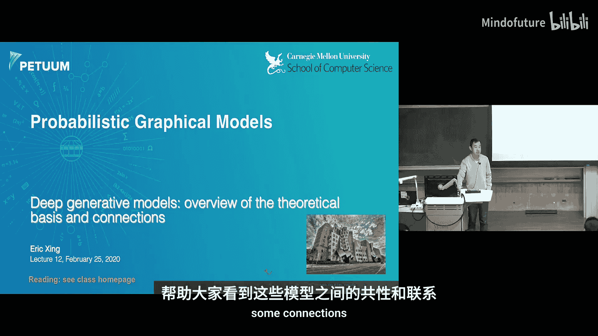
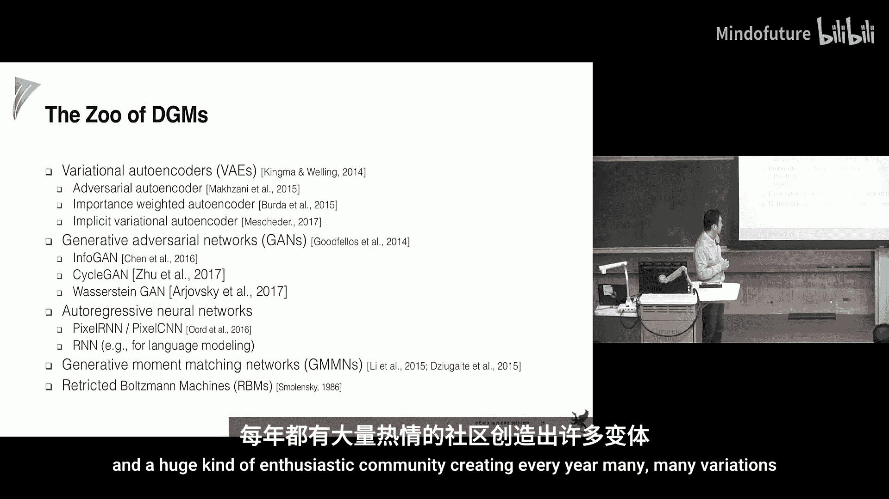
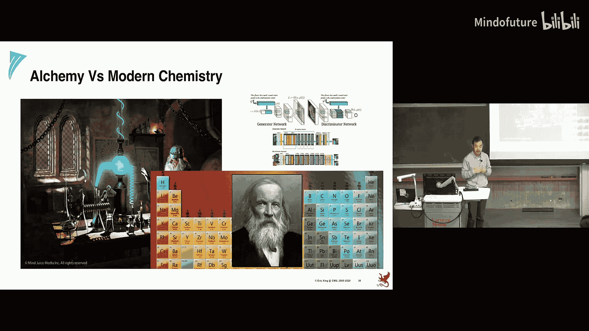
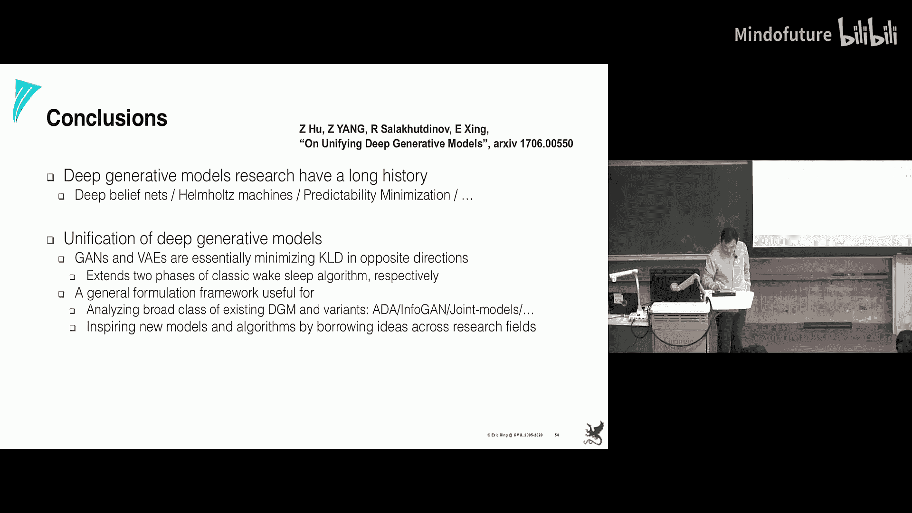

# 012：深度生成模型（一）

在本节课中，我们将要学习深度生成模型的基本概念、发展历程及其背后的核心理论。我们将从早期的模型开始，逐步过渡到现代流行的变分自编码器和生成对抗网络，并探讨它们之间的内在联系与统一视角。

---

## 概述

深度生成模型旨在通过多层隐藏变量来建模复杂数据的概率分布，并能够从中采样生成新的数据实例。近年来，以变分自编码器和生成对抗网络为代表的模型在图像、文本等领域取得了显著成果。本节课将梳理这些模型的理论基础，揭示它们之间的共性与差异。

---

## 早期深度生成模型

上一节我们介绍了深度生成模型的基本目标。本节中，我们来看看其早期的一些形式。

深度生成模型本质上是随机变量的概率分布，其“深度”体现在它包含多层隐藏随机变量。例如，我们之前学过的Sigmoid信念网络，其底层通过Sigmoid函数连接到上层，以此定义条件概率分布。其联合分布可以分解为：
\[
P(X) = \prod_i P(X_i | X_{\pi(i)})
\]
可见层（如图像）的分布可以通过对隐藏变量进行边缘化得到，即 \( P(X_{\text{visible}}) = \sum_{Z} P(X, Z) \)。这是一个原理清晰、基于贝叶斯规则的深度生成模型。

然而，早期模型很快出现了概念上的“扭曲”。例如，玻尔兹曼机在计算图层面被用来组织计算过程，而不仅仅表示一个唯一的概率分布。它包含一个由参数 \(\theta\) 控制的生成过程 \(P_\theta(X|Z)\) 和一个由参数 \(\phi\) 控制的推断过程 \(Q_\phi(Z|X)\)。这两个过程通过交替的推断和学习步骤联系在一起，模型本身由这个计算过程定义，而非一个全局的数学表达式。

另一种早期思路是“可预测性最小化”，这是一种训练过程而非明确的模型。其目标是学习观测数据的潜在表示，并确保这些表示之间具有最小的可预测性。具体来说，模型学习一组潜在变量 \(Z\) 和另一组镜像变量 \(\hat{Z}\)，然后训练一个预测器根据 \(\hat{Z}\) 来预测 \(Z\)。目标函数包含两个对抗的部分：一是最小化预测的准确性（使潜在变量难以预测），二是最大化预测器本身的能力。这种对抗训练的思想与后来的生成对抗网络有相似之处。

这些早期模型表明，“模型”的定义已经不再局限于严格的概率表达式，而是与训练过程紧密交织。

---

## 深度生成模型的学习方法

上一节我们回顾了早期模型的多种形式。本节中，我们来看看伴随这些模型发展的几种核心学习方法。

以下是几种主要的学习方法：

1.  **直接采样与数据增强**：这种方法直接根据当前模型参数推断隐藏变量（即计算后验 \(P(Z|X)\)），然后将其视为“已观测”数据来学习生成模型的参数。这类似于EM算法的思想，在渐近意义上是精确的。

2.  **变分推断**：为了解决精确后验难以计算的问题，我们引入一个由参数 \(\phi\) 控制的变分分布 \(Q_\phi(Z|X)\) 来近似真实后验 \(P_\theta(Z|X)\)。目标是最大化证据下界：
    \[
    \mathcal{L}(\theta, \phi; X) = \mathbb{E}_{Q_\phi}[\log P_\theta(X, Z) - \log Q_\phi(Z|X)]
    \]
    这为似然函数提供了一个下界。学习过程交替优化 \(\phi\)（固定 \(\theta\)）和 \(\theta\)（固定 \(\phi\)）。

3.  **Wake-Sleep算法**：该算法也交替学习生成模型和推断模型，但使用了不同的目标函数。在“Wake”阶段，它使用观测数据 \(X\) 来优化推断模型 \(Q_\phi\)，目标类似于变分推断。在“Sleep”阶段，它改为从当前生成模型 \(P_\theta\) 中采样“假想”数据 \(\tilde{X}\)，并用这些数据来优化生成模型参数 \(\theta\)。这相当于改变了优化目标，虽然降低了计算方差，但失去了理论收敛保证。

直观上，变分推断好比直接攀岩，而Wake-Sleep算法则像利用岩缝来回借力攀登。后者可能更省力，但路径不一定最优。

---

## 现代深度生成模型：VAE与GAN

上一节我们介绍了包括Wake-Sleep在内的几种学习范式。本节中，我们来看看两种主导现代研究的深度生成模型：变分自编码器和生成对抗网络。

### 变分自编码器

VAE的核心思想是**重参数化技巧**。在标准变分推断中，对变分参数 \(\phi\) 求梯度会遇到高方差问题，因为梯度表达式中包含 \(\log Q_\phi(Z|X)\) 项，当概率值很小时，对数项会变得非常大。

VAE的解决方案是：不从 \(Q_\phi(Z|X)\) 直接采样 \(Z\)，而是假设 \(Z\) 由一个简单的噪声变量 \(\epsilon\)（如标准高斯分布）经过一个由 \(\phi\) 参数化的确定性变换得到：
\[
Z = g_\phi(\epsilon, X), \quad \epsilon \sim p(\epsilon)
\]
这样，关于 \(\phi\) 的梯度就可以通过 \(\epsilon\) 的路径进行反向传播，避免了直接处理概率对数，从而得到了一个更低方差的梯度估计。VAE的损失函数就是变分下界：
\[
\mathcal{L}_{\text{VAE}} = \mathbb{E}_{Q_\phi}[\log P_\theta(X|Z)] - D_{KL}[Q_\phi(Z|X) || P(Z)]
\]
其中第一项是重构损失，第二项是KL散度，鼓励变分分布接近先验 \(P(Z)\)。

### 生成对抗网络

GAN采用了截然不同的思路。它没有显式的推断模型。其核心包括两部分：
*   **生成器 \(G_\theta\)**：将一个从简单先验（如均匀分布）中采样的噪声 \(Z\) 映射到数据空间，生成假样本 \(X_{fake} = G_\theta(Z)\)。
*   **判别器 \(D_\phi\)**：试图区分输入样本是来自真实数据分布 \(P_{data}(X)\) 还是生成器分布 \(P_\theta(X)\)。

两者通过一个极小极大博弈进行训练：
\[
\min_\theta \max_\phi \mathbb{E}_{X \sim P_{data}}[\log D_\phi(X)] + \mathbb{E}_{Z \sim P(Z)}[\log(1 - D_\phi(G_\theta(Z)))]
\]
生成器的目标是生成以假乱真的样本来“欺骗”判别器，而判别器的目标是尽可能准确地区分真假。理想情况下，当生成器分布完全匹配真实数据分布时，达到纳什均衡。

---

## 模型对比与统一视角

上一节我们分别介绍了VAE和GAN。本节中，我们尝试建立一个统一的视角来理解它们。

### 差异观察
*   **VAE**：生成的图像往往比较**模糊**，但能覆盖数据分布的多种模式。
*   **GAN**：生成的图像通常更**清晰、锐利**，但可能只捕捉到数据分布中的少数主要模式，存在“模式坍塌”问题。

### 理论联系
通过引入辅助变量和改写目标函数，可以将GAN和VAE（乃至Wake-Sleep算法）纳入同一个分析框架。研究发现，它们都可以被表述为最小化两个分布之间的KL散度，但**散度的方向不同**。

*   **GAN的优化** 本质上等价于最小化 **前向KL散度** \(D_{KL}[P_{data} || P_\theta]\) 的一个变体。前向KL散度倾向于让生成分布 \(P_\theta\) 去覆盖真实分布 \(P_{data}\) 的所有模式，但如果容量不足，它可能会选择忽略一些低概率区域，从而导致模式缺失。这解释了GAN为何可能只生成少数几种“典型”样本。
*   **VAE的优化**（其重构项）则与最小化 **反向KL散度** \(D_{KL}[P_\theta || P_{data}]\) 有关。反向KL散度要求生成分布 \(P_\theta\) 必须将其概率质量放在真实分布 \(P_{data}\) 概率高的地方，但可以忽略真实分布中概率为零的区域。为了满足这点，模型往往会生成一个“平均化”、“模糊”的结果来确保在所有高概率区域都有覆盖。

### 统一公式
更形式化地，通过定义生成分布 \(P_\theta(X|Y)\)（其中 \(Y\) 是指示变量，标记数据真假）和判别分布 \(Q_\phi(Y|X)\)，可以将GAN的目标重新表述为交替优化两个KL散度项。同样，VAE的目标也可以被重新解释。在这个框架下：
*   **Wake-Sleep算法** 的Wake步和Sleep步分别对应了优化两个不同方向的KL散度。
*   **VAE** 主要执行了Wake步（优化推断模型），并在生成模型学习中加入了先验匹配项。
*   **GAN** 主要执行了Sleep步（优化生成模型以匹配“梦想”数据），并使用了对抗性的判别器作为学习信号。

这种统一视角表明，这些看似不同的模型共享着相似的理论根基，其差异主要源于优化目标中KL散度的方向以及是否引入对抗性训练。

---

## 总结

本节课我们一起学习了深度生成模型的演进历程。我们从基于贝叶斯网络的早期模型出发，探讨了变分推断、Wake-Sleep算法等核心学习范式。接着，我们深入分析了两种现代主流模型——变分自编码器和生成对抗网络的工作原理与特点。最后，我们通过一个统一的数学框架，揭示了VAE、GAN以及早期算法之间的内在联系，理解了它们在行为上（如模糊vs清晰，模式覆盖vs模式坍塌）产生差异的理论根源。这种统一视角有助于我们更好地理解、设计乃至改进新的深度生成模型。