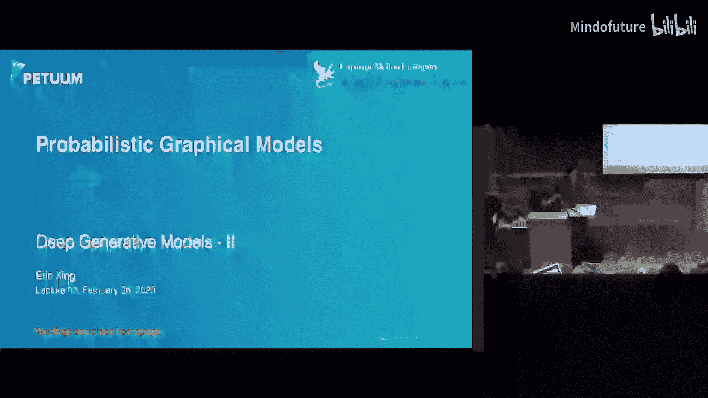
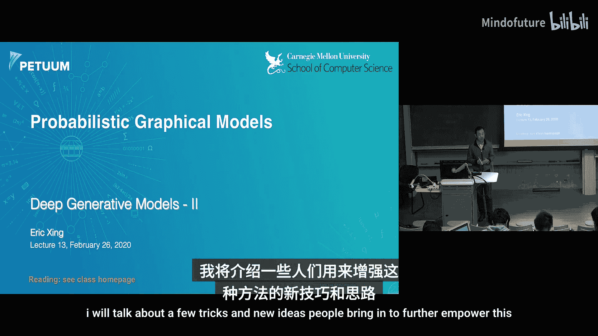
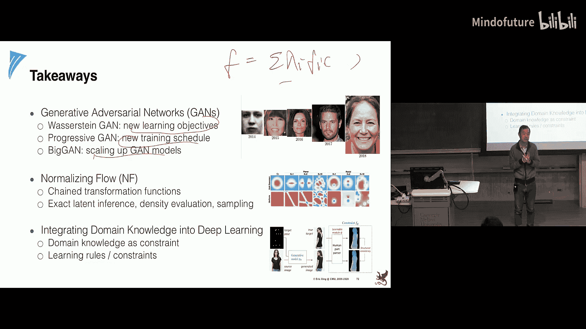

# 013：深度生成模型（第二部分）

在本节课中，我们将继续探讨深度生成模型。上一讲我们概述了几种深度生成模型的统计与数学基础，特别是它们在概率图模型和变分推断历史中的位置。本节课将更加务实，介绍一些使这些方法变得更实用、更强大的技巧和新思想。

以下是本讲的大致计划，我们将介绍4到5种不同的模型。虽然内容会有些浅显，但我会提供相关论文供你深入阅读，同时为你讲解其核心思想。

## 深度生成模型的演进

在过去的几年里，自从生成对抗网络（GAN）模型发明以来，生成图像的质量每年都有显著、可见的提升。从最初模糊的图像，到如今细节丰富、有时甚至难以分辨真伪的人脸图像，其进步令人瞩目。人们发现，有时需要观察非常细微的地方，比如耳朵的自然对称性或牙齿的真实感，才能发现合成的痕迹。那么，如何实现这种质量的飞跃呢？

## 生成对抗网络（GAN）回顾

首先，我们来回顾一下生成对抗网络模型。称之为“网络”，是因为其每个组件，无论是生成器还是判别器，都不再是简单的函数（如逻辑回归），而是一个包含许多层和参数的大型网络。

在GAN中，生成器从一个简单的先验分布（如标准正态分布）中采样一个隐变量 **z**，然后通过一个多阶段的非线性变换过程生成图像。理论上，即使是单层或两层的网络函数，只要隐藏层足够宽，也能模拟任意复杂的函数。因此，生成器可以生成非常丰富的分布。

然而，在原始的GAN设计中存在一个奇特之处：我们无法对 **z** 进行推断，因为给定观测数据 **y** 时，其后验分布 **p(z|y)** 是隐式的，没有解析形式。虽然 **z** 本身可能没有具体语义，但原则上我们是可以推断它的，上节课提到的一些模型就允许这样做。

GAN的训练机制是同时学习两组参数：生成器参数 **θ** 和判别器参数 **φ**。判别器的训练目标是优化其预测的交叉熵，使其越来越擅长区分真假。生成器的训练目标则是最小化一个等效的对数损失，以最大限度地“欺骗”判别器。

分析表明，原始GAN的损失函数可以表述为经验数据分布与生成分布之间的**詹森-香农散度**。虽然这个分布无法显式表达，但它从概念上说明了学习的目标。后续更深入的分析（如上节课提到的）表明，学习生成模型的过程实际上是在最小化推断模型与真实后验分布变分近似之间的**KL散度**。

## 改进一：使用更优的距离度量

了解上述理论有助于解释为什么有时训练效果不佳。例如，假设训练数据分布位于一个高维空间中的低维流形上（例如，一个三维空间中的平面）。当我们想用一个定义在全空间的三维分布 **Q** 去近似这个低维流形上的分布 **P** 时，像KL散度或詹森-香农散度这样的度量可能会失效。

原因在于，这些散度度量要求两个分布有足够的重叠区域，积分才有意义。如果两个分布初始时几乎没有重叠，那么散度值可能会是未定义的或无穷大，导致损失函数无法有效地驱动 **Q** 向 **P** 学习。这就像导弹制导：如果一开始完全捕捉不到目标信号，就无法进行后续的精确追踪。

因此，改进GAN的一个关键思路是重新定义距离度量。人们发现，**瓦瑟斯坦距离**（也称为**推土机距离**）是一个更好的选择。这个距离度量对分布的形状更敏感，即使两个分布没有重叠，也能有效地衡量它们之间的差异。直观上，它将两个分布看作两堆土，计算将一堆土移动成另一堆土所需的最小“工作量”。

其数学形式要求判别器函数 **D** 是**利普希茨连续**的，以确保在计算上确界时可以求导。然而，直接优化可能遇到梯度爆炸或消失的问题。一个常见的工程技巧是**梯度裁剪**，即计算所有梯度的范数，然后根据一个阈值重新缩放梯度，使其保持在可控范围内。

结合瓦瑟斯坦距离和梯度裁剪等技术，我们得到了**Wasserstein GAN**，其训练过程比原始GAN稳定得多，生成的图像质量也显著提升。

## 改进二：渐进式生成

第二个想法是**渐进式GAN**。当需要训练非常高分辨率的图像时，直接训练一个庞大复杂的模型可能非常困难。渐进式GAN采取了一种迂回策略：它从低分辨率图像和浅层网络开始训练。一旦这个基础模型训练好，就在其上添加新的层，逐步提高生成图像的分辨率。这个过程不断重复，直到得到最终的高分辨率模型。这种方法避免了直接训练巨型模型的困难，使优化路径更加平缓，就像盘山公路让汽车更容易上山一样。

## 改进三：直接规模化与架构简化

第三个思路是正面应对规模问题。我们直接构建一个大型GAN模型，并通过一些技巧使其可行：
*   **增加参数**：使用更强大的GPU来训练更大的模型。
*   **增大批次大小**：以防止过拟合，但这会增加GPU内存消耗。
*   **简化架构**：通过减少不必要的连接或结构来提高可扩展性。

这些直接规模化的方法也带来了越来越好的生成质量。

## 改进四：标准化流

接下来介绍一个将简单分布转化为复杂分布的有力工具：**标准化流**。其核心思想非常简单：目标是通过一系列可逆变换，将一个简单分布（如均匀分布或单位高斯分布）逐步转化为一个任意复杂的分布。

数学上，我们从源分布中采样 **z**，然后应用一个可逆变换函数 **f** 得到 **x**。为了能够进行推断和反向传播，变换必须是可逆的。变换后的分布密度可以通过变量变换定理来计算，其中需要计算变换函数雅可比矩阵的行列式。为了使行列式计算简便，一个技巧是约束雅可比矩阵为三角矩阵。

通过将多个这样的可逆变换串联起来，我们可以构建非常复杂的分布。这体现了深度学习社区倡导的**组合性**理念：用具有良好数学性质的小模块构建出强大而复杂的模型。标准化流模型生成图像的质量可能暂时不如最先进的GAN，但它非常易于计算。

## 改进五：融入领域知识——师生模型

最后，我们探讨一个更深刻、更通用的思想：如何将领域知识整合到深度生成模型中。在传统机器学习中，我们通过贝叶斯先验或正则化来融入知识。但在深度学习中，由于参数众多且模型复杂，直接指定权重值并不够。

人类知识通常表现为规则，例如英语中“将动词变为过去式通常加‘ed’”，或者在情感分析中“句子中的‘but’之后的内容往往主导整体情感”。如何将这些规则融入语言或图像生成模型呢？

一个通用的想法是引入一个**约束函数**，用来衡量生成结果是否符合某条规则。我们可以将这个约束函数的期望值作为一个新的损失项，与原始的数据驱动损失（如交叉熵）结合起来。然而，直接优化这个包含期望的项可能遇到梯度方差过高的问题，这与我们在变分推断中遇到的困难类似。

解决方案是引入一个**变分近似分布 Q**（通常被称为“教师”模型），而我们要学习的目标分布 **P** 被称为“学生”模型。我们构建一个新的目标函数，一方面希望学生模型在教师模型的指导下（通过KL散度）尊重规则，另一方面也希望学生模型能拟合原始数据。通过引入权重参数（如 **λ**, **α**），我们可以平衡数据损失和知识约束损失。

这形成了一个**师生交替优化**框架：
1.  **E步**：固定学生模型，优化教师模型，使其在结合了规则知识后逼近当前的学生。
2.  **M步**：固定教师模型，优化学生模型，使其同时拟合数据和来自教师的“软”指导。

这个框架非常强大，可以同时利用**有标签数据**、**无标签数据**和**逻辑规则**。它甚至可以推广，将强化学习中的奖励函数也视为一种特殊的“教学”函数，从而用统一的视角看待监督、无监督和强化学习。

在实践中，将规则编码为可微的函数需要技巧。此外，教师和学生模型的架构设计也是一个活跃的研究领域。实验表明，这种能够学习规则权重（即规则重要性）的模型，在图像生成和自然语言处理任务中，都能在客观指标和主观人工评估上取得更好的效果。

## 总结

本节课我们一起学习了深度生成模型，特别是生成对抗网络的一系列改进方法：
*   使用**瓦瑟斯坦距离**替代传统散度，以提供更稳定的训练信号。
*   采用**渐进式生成**策略，逐步构建高分辨率生成模型。
*   通过**直接规模化**和**架构简化**来训练大型GAN。
*   利用**标准化流**，通过一系列可逆变换从简单分布生成复杂分布。
*   引入**师生模型**框架，将领域知识（规则）以可学习的方式整合到深度生成模型中。

这些创新从损失函数、训练过程、模型结构和知识融合等多个方面，不断推动着深度生成模型向前发展，使其变得更强大、更实用。