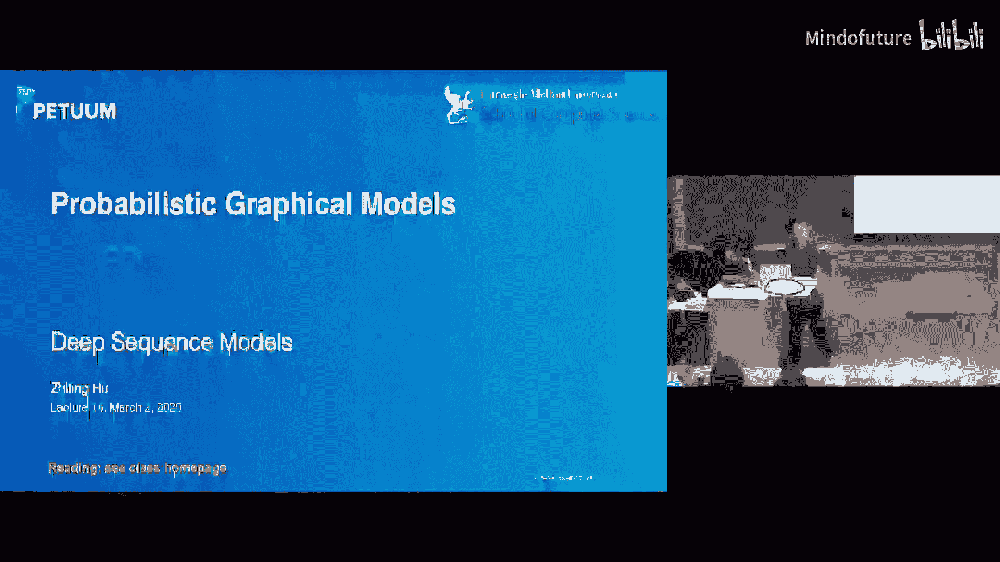
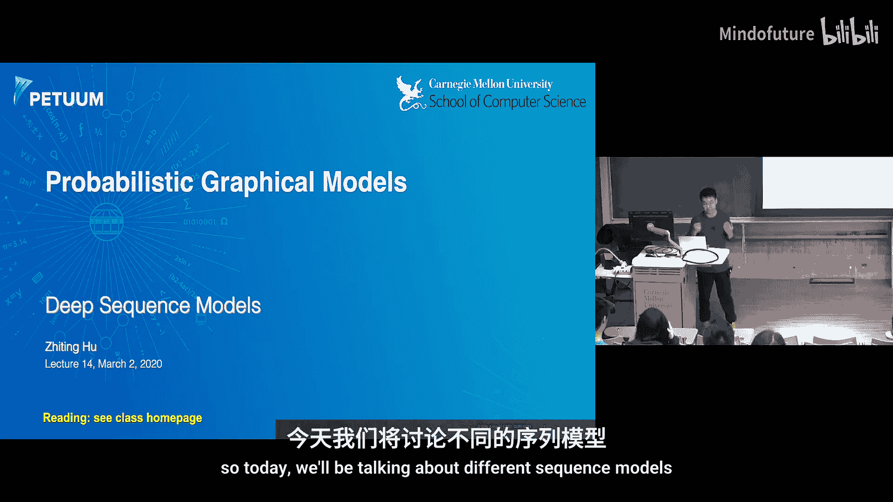
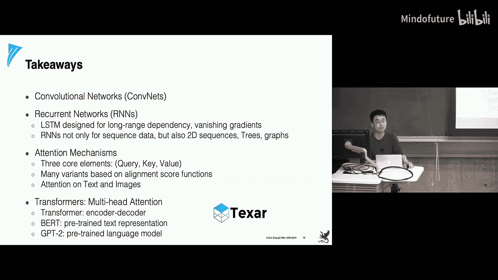

# 014：深度序列模型 🧠

在本节课中，我们将学习四种在深度学习中非常流行且基础的模型架构。我们将从用于空间建模的卷积网络开始，接着探讨用于序列建模的循环网络，然后介绍用于解决长程依赖问题并增强模型可解释性的注意力机制，最后学习作为注意力机制特殊形式的Transformer架构。

---

## 卷积神经网络 🖼️

上一节我们介绍了深度模型的基础，本节中我们来看看卷积神经网络。卷积神经网络是一种受生物学启发的多层感知机变体。

在标准的全连接神经网络中，给定一个输入（如图像），每个神经元都会连接到输入图像中的每一个像素。而在卷积网络中，我们引入了**感受野**的概念。每个神经元只连接到输入图像的一个局部区域，这些神经元被称为局部滤波器。这些局部子区域平铺开来，以覆盖整个视觉输入区域。

卷积网络具有三个基本属性：
*   **稀疏连接**：每个神经元仅连接到前一层神经元的一个子集。
*   **权重共享**：用于扫描整个图像的滤波器（即连接权重）在不同位置是共享的。
*   **层级化感受野**：随着网络层数加深，神经元能接收到来自更广阔输入区域的信息，从而获得越来越全局的感受野。

基于这种层级化的生物结构，我们实现了**层级化表征学习**。从原始像素开始，底层网络学习到边缘、角落等基础特征；随着网络加深，学习到的特征变得更加抽象和高级，例如复杂的形状和纹理；继续深入，则能获得更高层次的特征。

利用卷积层这一基本构建块，衍生出了许多卷积网络的变体。例如，2012年首次在ImageNet图像分类竞赛中获胜的AlexNet，以及更深的VGG网络、22层的GoogleNet。目前，最先进的技术通常是拥有数百层卷积层的ResNet。

---

## 循环神经网络 🔄

上一节我们介绍了用于空间建模的卷积网络，本节中我们来看看用于序列建模的循环神经网络。

卷积网络用于空间建模，给定输入（如图像），我们通过前向计算逐层获取特征，输出仅依赖于当前输入。而对于序列建模，隐藏层和输出不仅依赖于当前输入，还依赖于隐藏层之前的状态。

如果将这个循环展开，我们可以看到输入是一个序列（例如一个句子，`x0, x1, x2`是其中的词元）。我们逐个输入这些词元，并逐步计算隐藏状态。每一步的隐藏状态不仅依赖于句子中的当前词元，还依赖于前一步的隐藏状态。这与具有固定计算步数的空间建模不同。

循环网络可以有不同的形式：
*   **一对一**：如图像分类，可视为序列建模的特例，仅包含单步建模。
*   **一对多**：如图像描述生成，输入是单张图像，输出是词元序列。
*   **多对一**：如句子情感分类，输入是词元序列，输出是单个标签（如情感标签）。视频识别也属此类，输入是视频帧序列，输出是活动类别。
*   **多对多（序列到序列）**：如机器翻译，输入是源语言句子，输出是目标语言句子。
*   **多对多（序列标注）**：如命名实体识别，输入是句子，为其中每个词元预测一个标签。此类任务中，输入与输出序列长度相同。

循环网络在每个时间步的计算可以表示为一个单元。给定输入和上一步的隐藏状态，通过权重矩阵 `W` 等进行计算。标准循环网络的核心问题是**梯度消失和梯度爆炸**。

问题根源在于，当计算某个早期隐藏状态（如 `h0`）的梯度时，梯度会涉及权重矩阵 `W` 的多次连乘。如果 `W` 的最大奇异值大于1，梯度会爆炸；如果小于1，梯度会消失。梯度爆炸可以通过梯度裁剪等简单方法缓解，但梯度消失问题则更难以有效解决。

由于梯度问题，如果序列很长，模型将难以有效学习**长程依赖关系**。例如，在预测句子中的下一个词时，如果相关词元距离很远，预测会变得非常困难。

为了缓解长程依赖和梯度问题，长短期记忆网络被提出。LSTM在每一步使用了更复杂的单元结构，核心是引入了三个门控函数来控制信息的读写：
*   **遗忘门**：决定从细胞状态中丢弃多少信息。
*   **输入门**：决定向细胞状态中写入多少新信息。
*   **输出门**：决定从细胞状态中输出多少信息。

通过这种结构，在反向传播时，梯度路径上不再是与同一个矩阵 `W` 反复相乘，而是乘以不同的门控值，这降低了梯度消失或爆炸的风险。

基于基本的循环单元或LSTM单元，我们可以组合出更复杂的架构来建模不同类型的数据：
*   **双向循环网络**：用于建模双向依赖，如语音识别。
*   **树结构循环网络**：用于建模树状结构数据，如句法分析。
*   **用于二维序列的循环网络**：可按特定顺序（如逐行、逐列或对角线）扫描图像像素进行建模。
*   **图循环网络**：用于图结构数据，如图像分割，每个节点的特征依赖于其所有邻居的特征。

核心思想是，可以根据数据类型和建模需求，设计任意的网络架构。

---

## 注意力机制 👁️

上一节我们介绍了循环网络及其变体，本节中我们来看看注意力机制。注意力机制让模型在预测或生成时，能够选择关注哪些特征。

例如，在图像描述生成任务中，当模型生成“frisbee”这个词时，其注意力会集中在输入图像中飞盘出现的区域。在机器翻译任务中，当输出某个词时，其注意力会集中在源句子中与之对应的词上。

使用注意力机制主要有三个优势：
1.  **缩短路径，缓解长程依赖**：在标准循环网络中，输出词元与远处相关输入词元之间的梯度路径很长。而注意力机制建立了直接的连接，缩短了路径。
2.  **获得细粒度表征**：在没有注意力的情况下，编码器通常将整个输入序列压缩为一个单一的全局向量，解码器所有输出都依赖于此。而有了注意力，每个输出词元可以基于不同的、更细粒度的上下文向量。
3.  **提高可解释性**：可以通过可视化注意力分布来理解模型的决策依据。

注意力机制的计算涉及三个核心组件：**查询**、**键**和**值**。计算过程如下：
1.  将输入序列编码为一系列向量，作为**键**和**值**。
2.  在解码时，当前解码器状态作为**查询**。
3.  计算查询与所有键的相似度（对齐分数）。
4.  将对齐分数通过softmax归一化，得到**注意力权重**（分布）。
5.  根据注意力权重，对值向量进行加权求和，得到上下文向量，用于当前步的解码。

相似度计算有多种方式，如余弦相似度、点积、缩放点积等。聚合值向量的方式也有软注意力（加权求和）和硬注意力（选择权重最大的值）之分。

注意力机制可以应用于复杂任务，如图像段落生成。该任务需要生成一个完整段落来描述图像的细节，涉及长期的视觉和语言推理。一种方法是先检测图像中的语义区域并为每个区域生成描述短语，然后使用注意力机制聚合所有区域和短语的信息，最后通过一个分层文本生成器生成连贯的段落。

---

## Transformer 架构 ⚡

上一节我们介绍了注意力机制，本节中我们来看看其一种特殊形式——Transformer架构，它采用了**多头注意力**机制。

Transformer架构在机器翻译等任务上取得了最先进的结果，也是BERT、GPT-2等强大文本表示模型和语言模型的基础。

其核心是缩放点积注意力机制。给定查询、键、值，计算过程可概括为：
`注意力(Q, K, V) = softmax(QK^T / sqrt(d_k)) V`
其中 `d_k` 是键向量的维度，缩放因子用于稳定梯度。

多头注意力则是将这个过程重复多次（每个称为一个“头”），然后将所有头的输出拼接起来，再通过一个线性变换。这使得模型可以同时关注来自不同表示子空间的信息。

在Transformer中，多头注意力是核心构建块。编码器由多个相同的层堆叠而成，每层包含一个多头自注意力子层和一个前馈网络子层，并使用了残差连接和层归一化。解码器结构类似，但包含两个注意力子层：一个是掩码多头自注意力（确保当前位置只能关注之前的位置），另一个是编码器-解码器注意力层（其中查询来自解码器，键和值来自编码器）。

基于Transformer架构，BERT模型被提出用于生成上下文相关的词嵌入。与传统的静态词嵌入（如Word2Vec）不同，BERT为每个词元生成的嵌入向量依赖于其所在的上下文。BERT本质上是一个多层的Transformer编码器，通过在大规模语料上使用掩码语言模型和下一句预测两个任务进行预训练，从而学习到强大的语言表示。

---

本节课中我们一起学习了四种基础的深度模型架构：用于空间建模的卷积网络、用于序列建模的循环网络、用于解决长程依赖和增强可解释性的注意力机制（及其核心组件查询、键、值），以及作为注意力特殊形式的Transformer架构（及其在机器翻译和BERT预训练文本表示中的应用）。