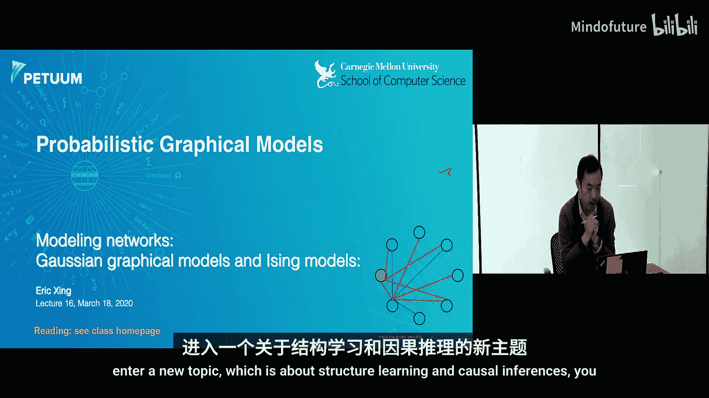
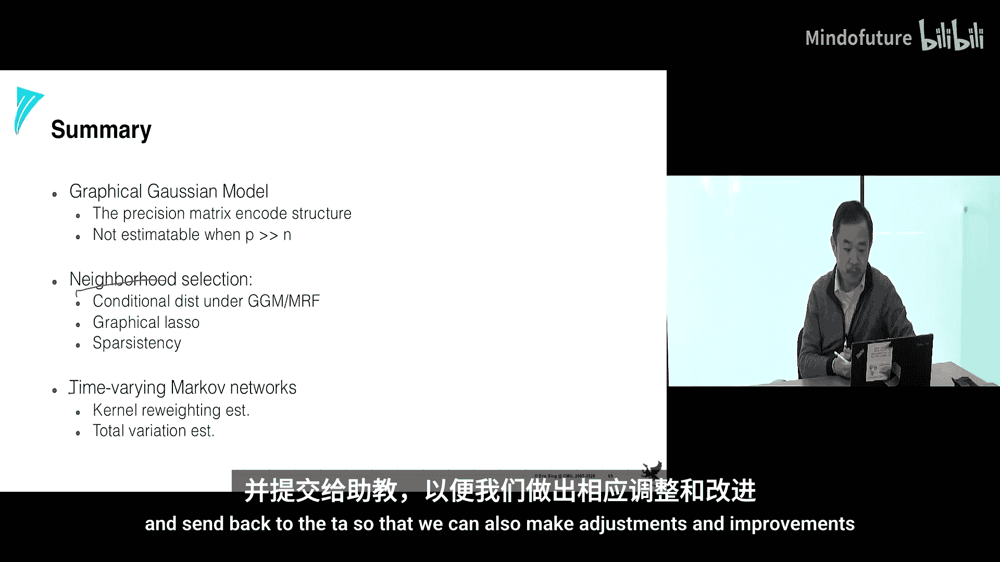

# 016：结构学习 🧠

在本节课中，我们将要学习如何从数据中推断出概率图形模型的结构，特别是无向图（马尔可夫网络）的结构。我们将探讨如何将复杂的结构搜索问题转化为更易于处理的参数学习问题，并介绍一些具有理论保证的算法。

---

## 概述

到目前为止，我们通常假设对领域有足够的先验知识，并利用这些知识来设计模型结构，例如混合模型或隐马尔可夫模型。另一种方法是利用领域知识设计专家系统或知识图谱。

然而，今天我们将从另一个方向出发：假设我们只有数据，希望从数据中学习实体之间的依赖关系、相关性或因果结构。这就是结构学习的主题。我们将重点讨论在特定约束下（例如树结构或无向图）进行结构学习的数学上更清晰、更优雅的方法。

上一节我们回顾了利用互信息和最大生成树算法学习树结构的方法（Chow-Liu算法）。本节中，我们来看看如何学习更一般的无向图结构。

---

## 从结构学习到参数学习

结构学习的一个核心思想是，将离散的组合结构搜索问题，转化为在连续参数空间中优化模型参数的问题。这样我们可以计算梯度，并更容易地设计迭代收敛算法。

考虑一个社交网络片段，每个节点上我们观测到数据（例如投票的“是/否”）。我们如何对离散或连续的节点值数据集进行建模？一种方法是使用马尔可夫随机场。

在马尔可夫随机场中，我们定义团上的势函数。一种常见的表示是只定义单节点和相连节点对上的势函数及其权重。在这个数学模型里，参数化与模型结构之间存在隐含的联系：每一对节点之间的权重对应于连接这两个随机变量的边。如果该权重的值变为0，直观上就可以认为这两个变量之间没有边。

因此，如果我们能从数据中学习到这些参数的值，通过观察每一对势函数权重大小，实际上就可以推导出图的结构。这样，我们就在结构学习和参数学习之间建立了联系。

更具体地说，如果我们能学习到成对势函数的权重，并将它们组织成一个矩阵，那么这个矩阵的零元素与非零元素就与图的结构存在一一对应的关系。

---

## 高斯图模型

让我们看一个具体的马尔可夫随机场模型：多元高斯分布。这看起来不太像典型的马尔可夫场，因为标准形式是用均值向量和协方差矩阵来定义联合分布的。

不失一般性，我们假设均值为0（数据可以中心化处理）。然后引入一个新的矩阵，即协方差矩阵的逆矩阵（精度矩阵）。这样，我们可以将多元高斯分布的联合分布重写，从而更明确地揭示它是一个马尔可夫随机场。

精度矩阵 **Q** 中的元素，对应于这个连续值马尔可夫场中单节点和节点对势函数的权重。对角线上的 **Q_ii** 对应于单节点势函数，非对角线上的 **Q_ij** 对应于连接节点 i 和 j 的边上的势函数权重。因此，高斯图模型是一个成对马尔可夫随机场。协方差矩阵间接地携带了图的结构信息，只有将其求逆得到精度矩阵 **Q**，才能读出连接所有变量的图结构。

这听起来问题已经解决了：要学习图，只需计算样本协方差矩阵，然后求逆得到 **Q**。然而，直接求逆在实践中存在困难：
1.  计算复杂度高（O(n³)），对于大规模网络（如数千节点）非常昂贵。
2.  当样本量不足时，协方差矩阵可能是退化的，无法求逆。

因此，我们需要绕过求逆步骤，直接学习精度矩阵 **Q**。此外，真实的网络（如基因或社交网络）通常是稀疏的，这意味着 **Q** 中应该有很多零元素。这种稀疏性不仅符合实际意义，也使得从高维数据中学习成为可能。

---

## 基于回归的方法：图Lasso算法

接下来介绍一种基于Lasso回归的启发式算法，它能直接学习图结构。

Lasso算法的数学形式是解决带有约束的线性回归问题，其思想是对回归系数施加L1范数约束，这倾向于产生稀疏解。

将这个思想应用到图学习上：假设我们关注其中一个目标节点，其他所有节点作为输入，我们建立目标节点对其他节点的线性回归。通过执行稀疏回归（Lasso），我们可以估计出其他节点到该目标节点的权重。回归后，只有少数权重非零，这便定义了该目标节点的稀疏邻域。

对图中的每一个节点重复此过程，我们就能为每个节点估计出其邻居集合，最终组合起来得到整个图。需要注意的是，当分别对两个相连的节点做回归时，同一条边可能会得到两个不同的权重估计。我们需要通过某种规则（如取阈值、或选择其中一个）来确定边的存在与否。

这种对每个节点依次进行邻域选择的方法，被称为“图Lasso”算法。有理论证明，在满足一定条件下，该程序能以高概率恢复出真实的图结构。

你可能会好奇，为什么在高斯图模型中，这种线性回归的方法能等价地恢复图结构？这需要深入理解高斯图模型中的代数关系。

---

## 算法背后的理论联系

在高斯图模型中，一个关键性质是：给定其他所有变量，某一个变量 **X_i** 的条件分布仍然是一个高斯分布。这个条件分布的均值，是其他变量的线性组合。具体推导表明，这个线性组合的系数向量，与精度矩阵 **Q** 的第 **i** 列（或行）直接相关。

因此，为节点 **X_i** 估计其条件分布均值的回归系数（即Lasso求解的 **β**），其非零模式与精度矩阵 **Q** 第 **i** 列的非零模式是一致的。通过对图中每个节点 **i** 执行这样的稀疏回归，我们就能逐步学习到整个精度矩阵 **Q** 的稀疏结构。

简而言之，我们通过将学习精度矩阵 **Q** 的问题，分解为一系列针对每个节点的稀疏线性回归问题，从而避免了直接求逆协方差矩阵，并能直接恢复出图的结构（即边的存在与否）。

---

## 离散图与扩展

我们讨论的方法主要针对连续值的高斯图模型。如果节点值是离散的（例如社交网络中的投票记录），情况类似，但回归形式需要改变。

此时，一个节点给定其他节点的条件分布不再是高斯分布，而是逻辑斯蒂分布。因此，我们需要将线性回归替换为逻辑斯蒂回归。算法流程依然类似，并且也有理论保证能一致地估计出图结构。

对于更复杂的情况，例如每个节点本身是一个向量（多属性节点），也有相应的方法（如基于偏相关计算的技术）来估计图结构。这类基于回归或偏相关的邻域选择方法，形成了一个具有良好统计保证的结构学习算法家族。

---

## 应用于时变网络

基本的图学习技术可以扩展到更有挑战性的场景，例如学习随时间演化的网络结构。这在社交网络、生物网络中非常常见。

主要挑战在于，每个时间点可能只有很少甚至一个数据样本，直接用传统方法估计每个时刻的图是不可靠的。关键洞察是：时间上相邻的网络并不是独立的，它们通常只发生微小变化。

以下是两种解决思路：

1.  **核加权L1正则回归**：当估计特定时刻 **t** 的网络时，不仅使用 **t** 时刻的数据，也使用所有时刻的数据，但根据时间距离进行加权。距离 **t** 越近的时刻，其数据权重越大。这相当于利用所有样本通过核加权来“增强”当前时刻的样本量。

2.  **时间平滑L1回归**：同时估计所有时间点的网络。在目标函数中，除了要求每个时刻的网络稀疏外，还额外施加一个约束，要求相邻时间点网络之间的差异（例如对应边权重的变化）也尽可能稀疏。这强制了网络随时间平滑演化。

这两种方法都有相应的理论保证，能够在样本量有限的情况下，有效估计出演化网络的结构。它们已成功应用于分析美国参议院的投票网络演化、以及癌症细胞基因表达网络的动态变化等实际问题。

---

## 总结

本节课中，我们一起学习了一系列用于估计马尔可夫随机场（无向图模型）连接拓扑结构的算法。

这些算法的核心是**邻域选择**，它将组合结构搜索或矩阵求逆估计问题，转化为一系列顺序的、回归风格的问题，从而提供更高效且具有一致性保证的解决方案。

我们首先看到了如何将结构学习转化为参数学习，并深入探讨了高斯图模型中精度矩阵与条件回归的深刻联系。接着，我们介绍了基于Lasso的图学习算法及其理论依据。最后，我们将这些基础技术扩展到更复杂的场景，特别是**时变网络**的估计，使得能够基于少量样本集同时估计多个相关图的结构。

通过这些方法，我们可以从数据中自动发现并刻画复杂的依赖关系网络。