# 017：因果关系（第一部分） 🧠

在本节课中，我们将学习因果关系的基本概念。我们将探讨为什么需要因果关系、因果模型与图形模型的关系、如何从数据中发现因果信息、如何在给定因果结构和观测数据的情况下推断因果效应，以及为什么反事实推理至关重要。

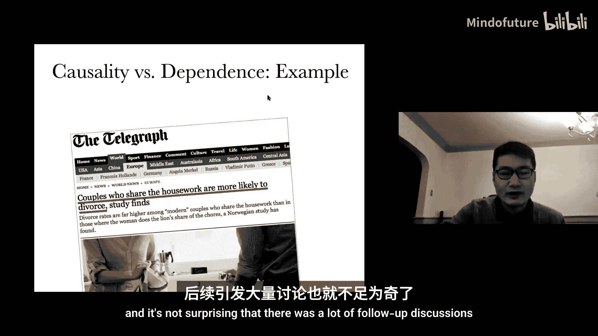

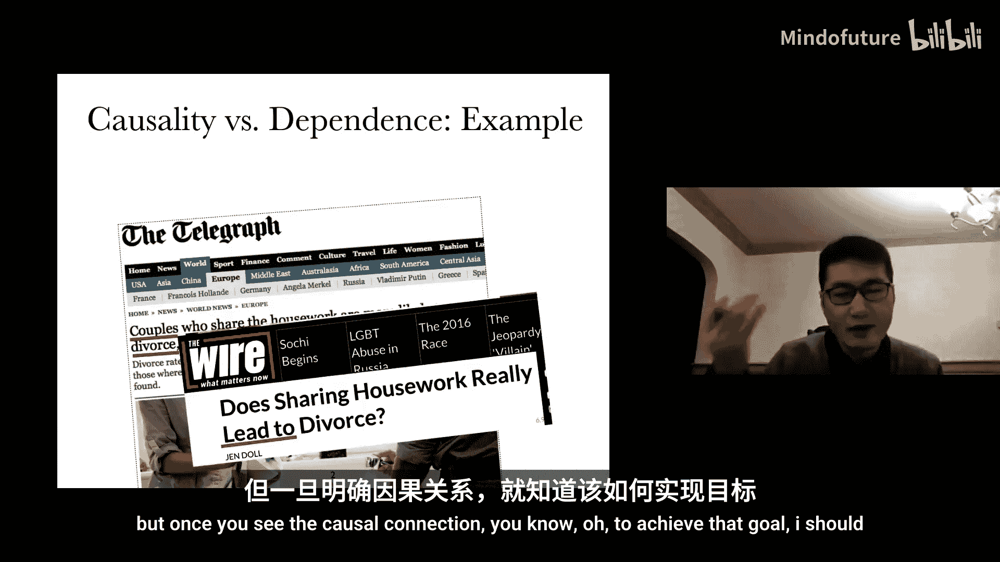

---

## 为什么需要因果关系？ 🤔

在日常生活中和科学发现中，我们必须区分因果关系和关联关系。例如，有报道称“分担家务的夫妻更可能离婚”。这听起来令人惊讶。当我们看到这类信息时，我们希望进一步探究，以获取有用且有益的洞见。仅仅看到关联关系，我们不知道该如何行动。但一旦理解了因果关系，我们就知道为了达成某个目标，应该采取什么行动。

---

## 关联与因果：基本区别 🔗

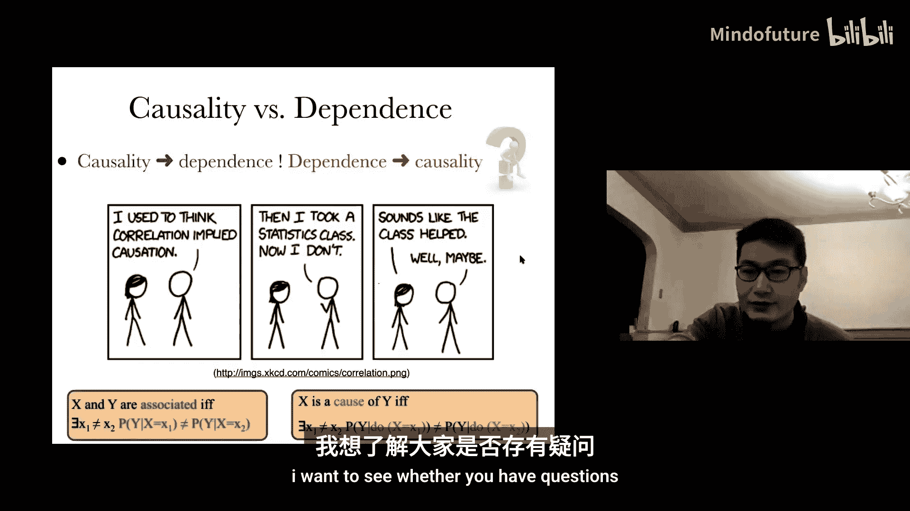

关联意味着两个变量不独立。如果一个变量对预测另一个变量有用，那么它们就是关联的。

当我们说 X 是 Y 的**原因**时，我们必须进入另一个层面，不能仅仅使用关联，因为因果关系是底层过程的属性。我们基于**干预**的概念来定义因果关系。

**因果关系的定义**如下：如果你对变量 X 进行干预，并赋予 X 两个不同的值（例如 X1 和 X2），然后发现对应的 Y 的分布可能不同，那么我们就说 X 导致了 Y。

**干预的定义**是：如果你想干预变量 X，你只能改变变量 X 本身，而不能改变系统中的任何其他变量。这个行动确保不会改变任何其他变量。

因此，这个定义很自然：在系统中，这个行动只改变了 X 的值，然后你看到了 Y 分布的变化。由于所有其他变量都保持不变，Y 分布的变化必然是由 X 值的变化引起的，所以可以说 X 导致了 Y。

---

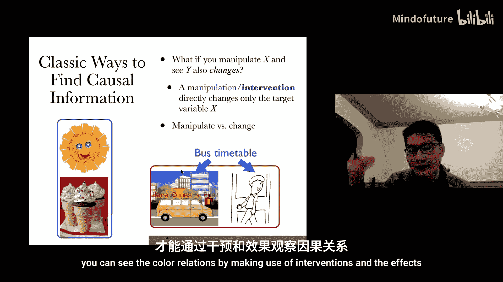

## 通过干预理解现象 🧪

让我们通过干预的概念来看几个例子。

**例子1：炎热天气与冰淇淋高销量**
*   问题：炎热天气和高冰淇淋销量有因果关系吗？
*   分析：如果我们能找到方法干预天气，使其变得非常炎热，那么很可能会看到冰淇淋销量上升。然而，如果我们干预冰淇淋销量（例如雇人大量购买），这并不会导致天气变热。因此，我们可以说炎热天气是冰淇淋高销量的原因。

**例子2：离家时间与公交车到站**
*   问题：一个人早上离家去上班的时间，与公交车到站的时间高度相关。它们有直接的因果关系吗？
*   分析：直觉上似乎没有，因为这个人看不到公交车来。让我们进行干预思考：
    *   干预公交车到站（例如迫使公交车停下），这个人仍会像往常一样离家。
    *   干预这个人离家（例如锁上门），公交车仍会像往常一样到站。
*   结论：它们之间没有因果关系。那么如何解释这种依赖关系呢？通常是因为存在一个**共同原因**，比如公交时刻表。两者都根据公交时刻表运作。

理解干预的定义至关重要。例如，如果我通过改变公交时刻表来改变公交车到站时间，这个行动也会直接影响这个人离家的时间，因此这不是一个有效的干预。有效的干预必须只改变目标变量本身。

---

## 因果图表示法 📊

我们通常使用**有向无环图**来表示因果关系。如果图中有一条从 A 指向 B 的有向边，就意味着 A 是 B 的直接原因（相对于图中的变量集）。

在本课程中，我们将讨论：
1.  基于干预的因果关系定义。
2.  因果思维的好处。
3.  因果图模型与普通图模型的区别（需要额外的约束或假设）。
4.  因果效应识别的基本思想。
5.  反事实推理的原因和方法。

在下一讲中，我们将看到如何进行因果发现，以及因果关系在机器学习中的意义。

---

## 依赖与因果：为何区分至关重要 🎯

如果你只想根据数据进行被动预测，那么依赖关系可能就足够了。但如果你想改变某些东西，或者想改变系统以实现目标，就必须关心因果关系。

一个经典的例子是：如果你想降低咳嗽的发病率，你不能针对与之高度相关的变量（比如黄手指），而必须找到原因（比如吸烟）。你必须深入到因果层面才能实现目标。

---

## 辛普森悖论：关联与因果的冲突 ⚖️

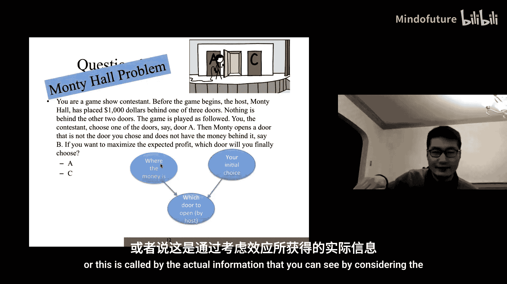

考虑一个真实数据集：医院有两组肾结石患者，一组结石较小，另一组结石较大。有两种治疗方法 A 和 B。
*   对于**小结石组**，治疗 A 的康复率（93%）高于 B（87%）。
*   对于**大结石组**，治疗 A 的康复率（73%）也高于 B（69%）。
*   然而，如果**合并两组数据**，治疗 B 的总康复率却显得更高。

**问题**：作为医生，如果你想最大化康复几率，你会推荐治疗 A 还是 B？

**分析**：这个悖论之所以发生，是因为**结石大小**这个变量同时影响了**治疗选择**和**康复结果**。当我们只看治疗与康复的关联（相关性）时，会受到这个共同原因的干扰，无法清晰看到治疗对康复的**因果影响**。要识别因果效应，我们需要“控制”或“调整”结石大小这个变量。

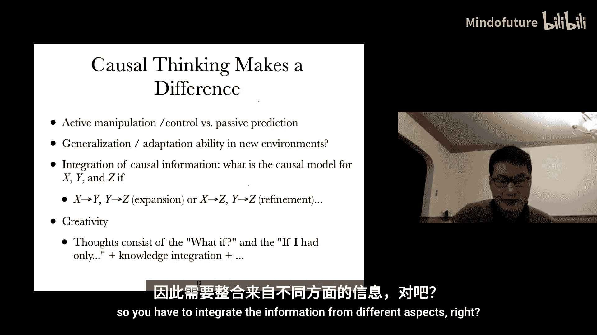

---

## 更多例子：选择偏倚与生存偏倚 🎲

**例子1：大学录取中的性别与智商**
*   在整个人群中，性别和智商可能是独立的。
*   但是，**成为大学生**是性别和智商的共同结果。
*   一旦我们只观察被录取的学生（即给定这个共同结果），性别和智商就会变得相关（出现选择偏倚）。
*   如果我们想基于样本推断总体情况，就必须注意并校正这种选择偏倚。

**例子2：幸存者偏倚（二战飞机装甲）**
*   军方检查返航飞机上的弹孔分布，发现某些区域弹孔多，某些区域少。
*   问题：应该在哪里加强装甲？
*   关键：我们看到的只是**幸存下来**的飞机的数据。我们真正需要推断的是那些**未能返航**的飞机被击中的模式。这需要因果思维：弹孔位置和是否幸存都是被击中事件的结果。我们需要利用返航飞机的数据，在一定的过程假设下，推断出未返航飞机的受损模式。

**例子3：蒙提霍尔问题**
*   在这个游戏中，参赛者初始选择一扇门，主持人打开一扇没有奖品的门后，参赛者是否应该换门？
*   解释：初始选择与奖品位置最初是独立的。但当主持人打开一扇门（一个共同结果）后，这两个变量变得相关。你的初始选择包含了关于奖品位置的新信息，计算表明换门会增加获胜概率。

---

## 因果思维的优势 💪

从这些例子可以看出，因果思维至关重要。虽然我们经常将因果信息作为背景知识使用，但明确理解因果关系能带来以下优势：
1.  **主动干预**：我们可以改变系统以实现目标，而不仅仅是进行被动预测。
2.  **泛化与适应**：我们可以将知识推广或适应到新环境。
3.  **信息整合**：我们可以将小部分世界的知识组合成更大的图景。

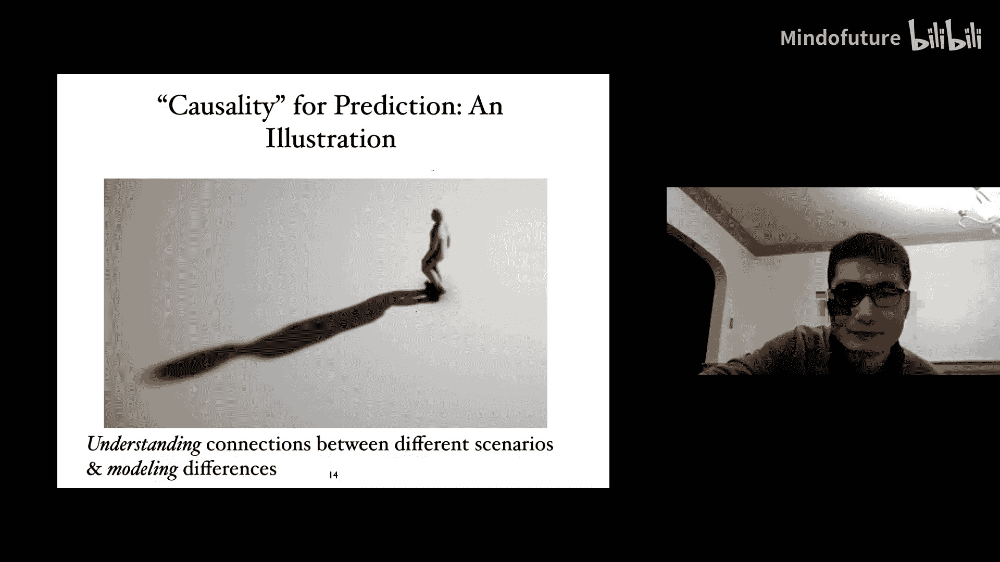

例如，如果知道 `X -> Y -> Z` 这个因果链，即使没有 `X` 到 `Z` 的直接连接，我们也知道 `X` 通过 `Y` 导致 `Z`。然而，如果只知道 `X` 和 `Y` 相关，`Y` 和 `Z` 相关，我们完全无法确定 `X` 和 `Z` 的关系（可能独立，也可能相关）。因此，因果理解使我们能够从系统的局部走向整体。

创造力本质上也是一个因果问题：提出“如果……会怎样”的问题，并整合不同方面的信息来回答它。

---

## 稳定性与领域适应 🌉

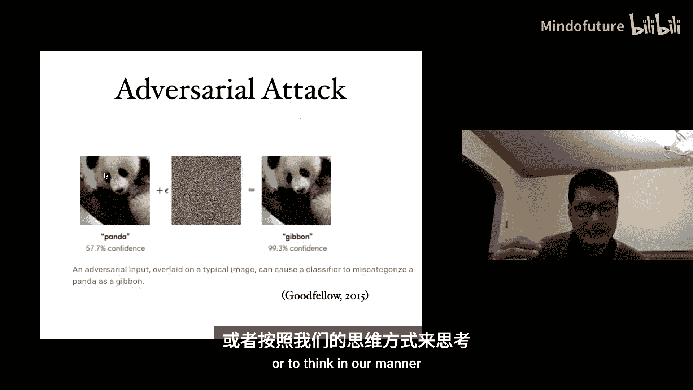

因果信息有助于提升在复杂情境下的预测性能。

**例子：人影预测**
*   **场景1**：你只看到我的影子，能预测我的身形吗？相对容易，因为身形是影子的原因，从结果推断原因通常更稳定。
*   **场景2**：你只看到我的身形（在一个新环境，不知道光源），能预测我的影子吗？非常困难，因为影子不仅取决于身形，还取决于未知的环境（光源）。
*   **分析**：因果方向（身形 -> 影子）是稳定的映射。从果（影子）推因（身形），可以部分忽略环境变化的影响。但从因（身形）推果（影子），则严重依赖于易变的环境因素。

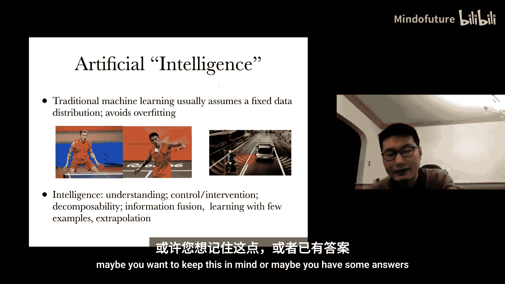

这与**领域适应**问题相关：我们拥有一个分布（领域）的数据，但需要在另一个不同分布的新领域进行预测。因果方向通常能提供更稳定的关系，帮助我们识别变化的来源并做出更好的预测。

---

## 机器学习中的因果问题 🤖

**问题1：偏见与公平性**
*   例如，谷歌照片在2015年曾将非裔美国人错误分类为“大猩猩”。简单地移除“大猩猩”标签并非根本解决之道。
*   需要思考：是什么**导致**了分类差异？如何从因果层面理解和解决数据或模型中的偏见？

**问题2：对抗性攻击**
*   对图像添加微小扰动，就能使机器学习模型做出完全错误的分类，而人类不受影响。
*   原因：人类的决策过程（基于高层次特征和因果理解）与机器的决策过程（通常直接基于像素的统计模式）不同。
*   解决方案：让机器学会**因果思维**或**生成式思维**，像人类一样理解世界，可能提升其鲁棒性。

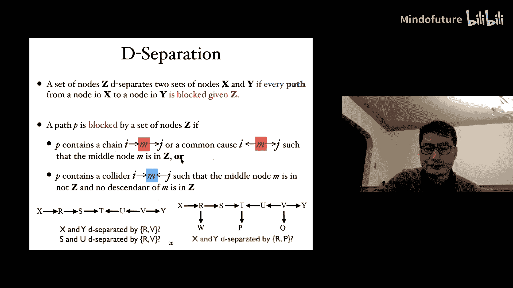

**问题3：分布外泛化**
*   传统机器学习常假设训练和测试数据分布相同。现实中往往并非如此。
*   人类可以轻松地将技能（如打羽毛球）迁移到新任务（如打乒乓球），或在全新驾驶场景中做出正确决策。机器则很难做到。
*   智能的关键可能在于拥有一个**紧凑的、因果的世界表示**，使我们能够解释所见、连接不同场景、分解复杂任务，并进行外推而不仅仅是内插。

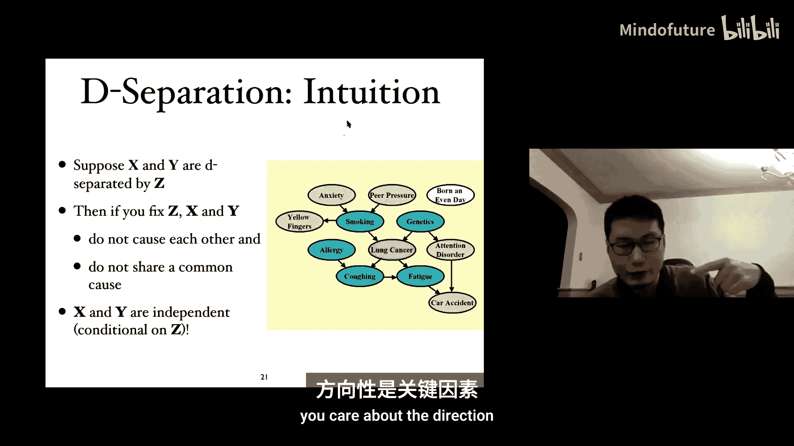

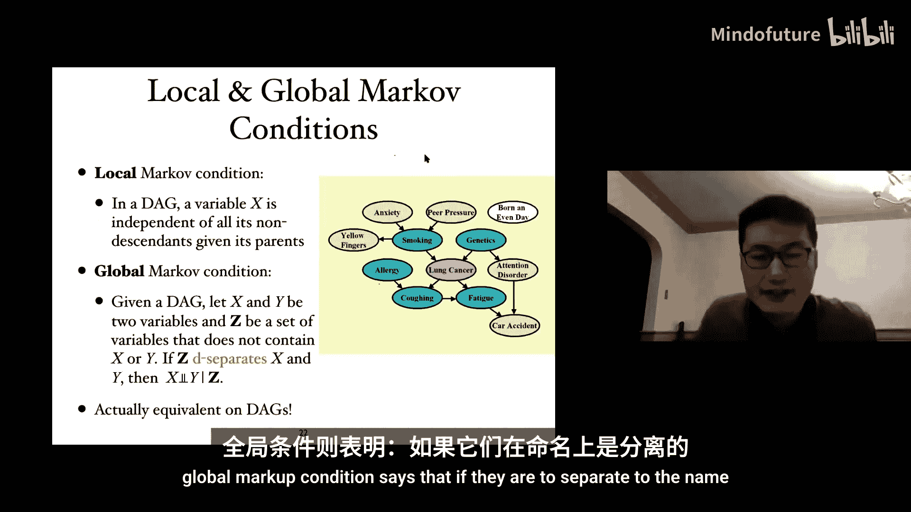

---

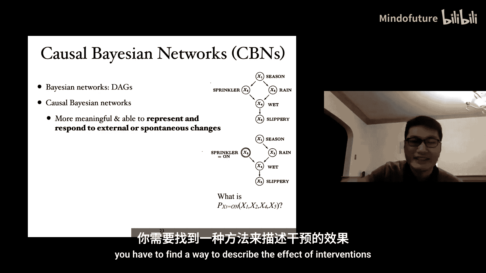

## 从图模型到因果图模型 🕸️

我们学过图模型（如贝叶斯网络）用有向无环图紧凑地表示分布的因子分解和条件独立关系。

**关键问题**：如何确保这样的图模型表示的是**因果关系**？

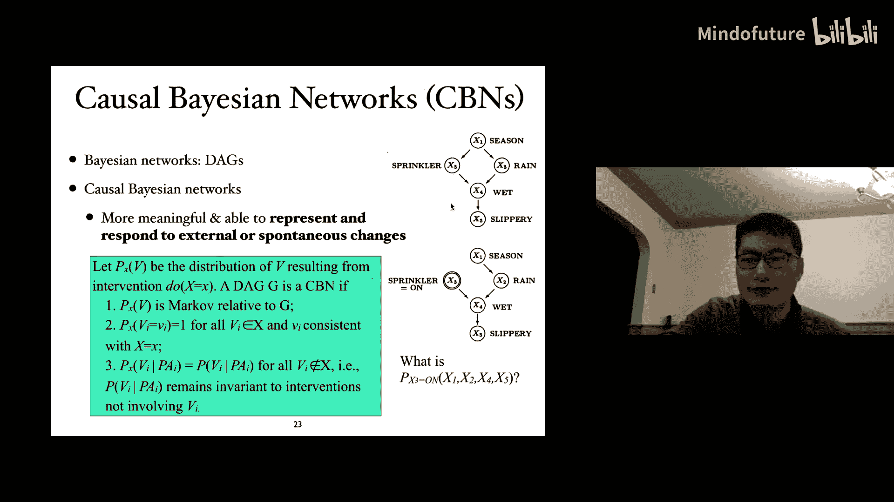

由于因果关系和关联处于不同层面，我们需要一种方法来描述**干预的效果**。为确保一个有向图 `G` 是因果的，需要满足三个条件（因果马尔可夫条件）：

1.  **不变性**：干预后的新分布仍然相对于原图是马尔可夫的（不会产生新的边）。
2.  **确定性**：如果我们干预将变量 `Xi` 设为值 `xi`，那么 `P(xi | do(xi)) = 1`。
3.  **模块性/自主性**：干预 `Xi` 时，其他变量 `Xj (j ≠ i)` 的条件概率分布 `P(xj | pa_j)` 保持不变。

这意味着，对 `Xi` 进行干预，我们只是**切断所有指向 `Xi` 的边**，并将 `Xi` 设为固定值，图中其他部分保持不变。

---

## 结构因果模型 ⚙️

另一种表示因果关系的等价方式是**结构因果模型**（一组结构方程）：
`Xi = fi(PAi, Ei)`
其中 `PAi` 是 `Xi` 的父变量（直接原因），`Ei` 是外生变量（噪声或未观测因素）。

在因果系统中，每个方程代表一个**自主的机制**。这些方程本身是模块化的、互不干扰的。这是因果系统最重要的属性，也是我们关心因果理解的核心原因：即使不想干预，模块性也意味着当系统某部分发生变化时，我们可以定位变化点，并利用对其他部分的理解进行预测。

---

## 三类基本问题 🎯

在人工智能中，通常有三类基本问题：

1.  **预测问题**：给定一些变量的观测值，预测其他变量。例如 `P(X3 | X1, X2)`。这不需要因果模型，只需条件分布。
2.  **干预问题**：预测对变量进行干预后的结果。例如 `P(X3 | do(X2=1))`。这需要因果模型，因为干预会改变数据生成过程。
3.  **反事实问题**：在已观察到某些事实的情况下，问“如果当时做了不同的干预，结果会怎样？”。例如，已知乔治没有黄手指（`X2=0`）且咳嗽（`X3=1`），那么“如果当时我们确保他有黄手指（`do(X2=1)`），他会咳嗽吗？”。这需要最详细的因果信息。

---

## 因果效应的识别 🎯

识别因果效应的黄金标准是**随机对照实验**：将受试者随机分到处理组和对照组，确保其他变量在组间平衡，那么结果差异就可归因于处理。

然而，随机实验通常成本高昂或不可行。因此，我们需要利用**观测数据**和**因果结构知识**来识别因果效应。这被称为**因果推断**。

**核心挑战**：控制**混杂偏倚**。在辛普森悖论中，结石大小就是一个混杂因子。

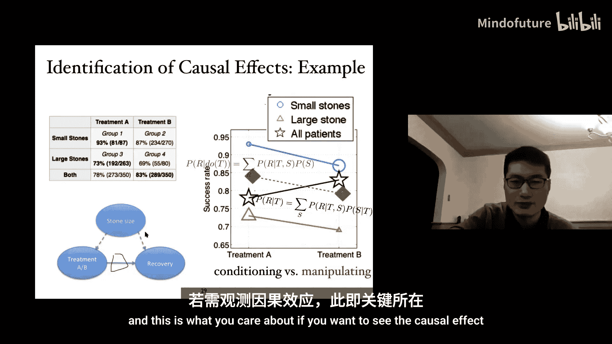

**因果效应的定义**：`P(Y | do(X=x))`，即对 `X` 干预设置为 `x` 后，`Y` 的分布。

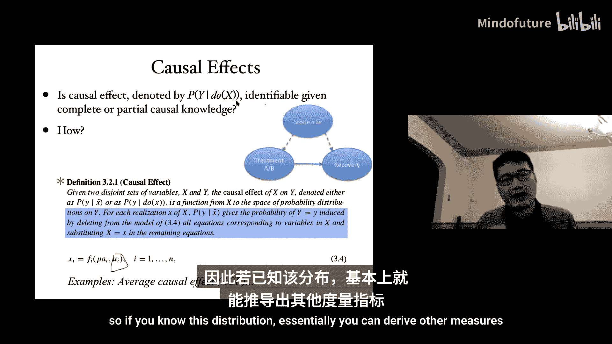

**可识别性**：给定因果图 `G` 和观测变量的数据，能否从数据中唯一确定 `P(Y | do(X=x))`？如果可以，则称该因果效应是可识别的。

---

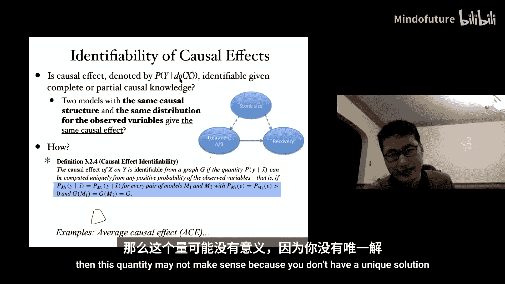

## 识别准则：后门准则与前门准则 🚪

**后门准则**：对于有序变量对 `(X, Y)`，一组变量 `Z` 满足后门准则，如果：
1.  `Z` 中不包含 `X` 的后代节点。
2.  `Z` 阻断了所有 `X` 和 `Y` 之间指向 `X` 的路径（即后门路径）。

如果 `Z` 满足后门准则，则因果效应可识别为：
`P(Y | do(X=x)) = Σz P(Y | X=x, Z=z) P(Z=z)`
注意，这里 `P(Z=z)` 是边缘分布，而不是条件分布 `P(Z=z | X=x)`。这正是与普通条件概率 `P(Y | X=x)` 的关键区别。

**前门准则**：如果存在一组变量 `Z` 满足：
1.  `Z` 截断了所有从 `X` 到 `Y` 的有向路径。
2.  没有从 `X` 到 `Z` 的后门路径。
3.  所有从 `Z` 到 `Y` 的后门路径都被 `X` 阻断。

那么，因果效应也可通过 `Z` 识别，公式略复杂，但提供了另一种在无法直接测量混杂因子时进行识别的方法。

这些图准则与潜在结果框架中的**可忽略性**条件是等价的。可忽略性条件为：给定 `Z`，潜在结果 `Y(x)` 与处理分配 `X` 独立。这为因果效应的识别提供了另一种表述。

---

## 总结 📝

本节课我们一起学习了：
*   **因果关系**是基于**干预**来定义的，与关联有本质区别。
*   因果思维对于**主动改变系统**、**泛化到新环境**和**信息整合**至关重要。
*   辛普森悖论等例子揭示了依赖关联进行决策的风险。
*   我们使用**因果图模型**或**结构因果模型**来表示因果关系，其核心属性是**模块性**。
*   人工智能涉及三类问题：预测、干预和反事实推理。
*   从观测数据中识别因果效应的核心是控制混杂偏倚，**后门准则**和**前门准则**提供了可识别性的图论判断方法。

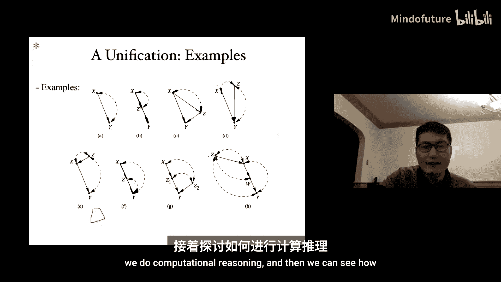

在下一讲中，我们将继续探讨因果效应的识别准则的统一，并深入介绍反事实推理以及如何从观测数据中发现因果结构（因果发现）。