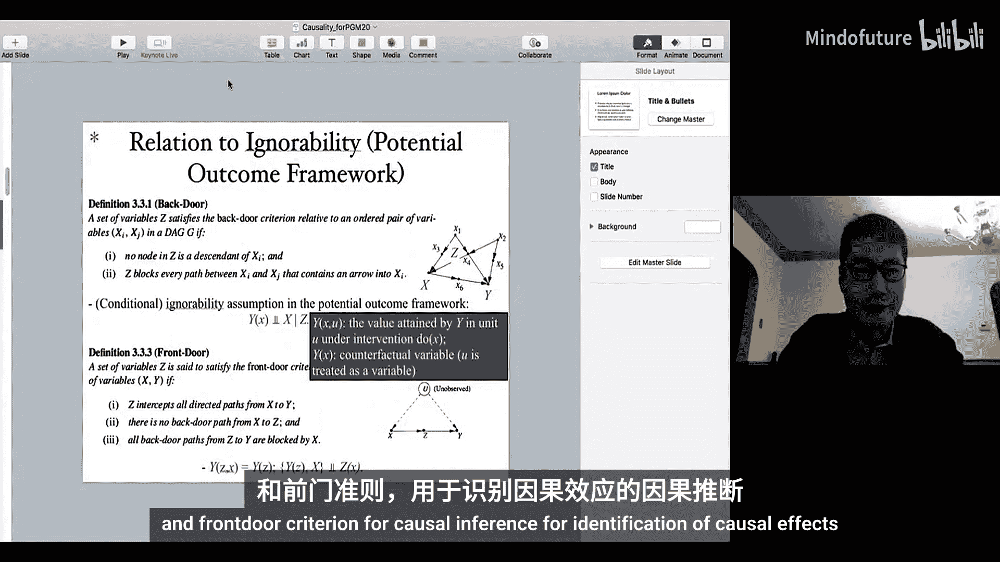
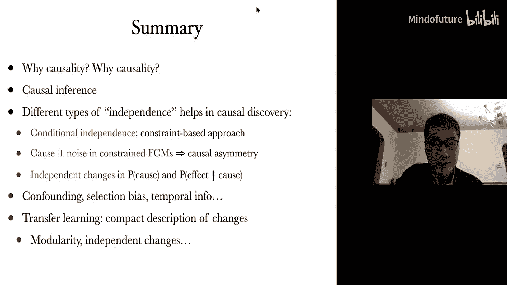

# 018：因果关系（第二部分）

在本节课中，我们将学习因果推断与反事实推理，并探讨如何从观测数据中发现因果关系。我们将介绍后门准则、前门准则等图形化标准，以及如何利用这些标准识别因果效应。接着，我们会讨论反事实推理，并了解如何利用特定个体的信息进行更精确的因果分析。最后，我们将介绍因果发现的基本方法，包括基于约束的方法和基于分数的方法。

## 因果推断的识别准则

上一节我们介绍了因果推断的基本概念，本节中我们来看看用于识别因果效应的图形化标准，即后门准则和前门准则。这些标准可以直接通过因果过程的图形表示来验证。

### 后门准则与潜在结果框架

后门准则与潜在结果框架中的“条件可忽略性”相关。在潜在结果框架中，`Y(x)` 表示在干预 `X` 使其取值 `x` 后 `Y` 的随机变量，它代表了从 `X` 到 `Y` 的结构方程模型或因果机制的性质。

后门准则的图形条件，在潜在结果框架中等价于要求 `Y(x)` 与 `X` 在给定一组协变量 `Z` 的条件下独立。这确保了在控制 `Z` 后，`X` 对 `Y` 的因果效应可以被无偏地估计。

### 前门准则与潜在结果框架

前门准则要求变量 `Z` 截断所有从 `X` 到 `Y` 的直接有向路径。在潜在结果框架下，这对应两个条件：
1.  给定 `Z` 时，`Y(x)` 与 `X` 独立。这意味着在给定 `Z` 后，`X` 不会通过因果机制直接影响 `Y`。
2.  与 `Z` 到 `Y` 的因果机制以及 `X` 的生成过程相关的变量，需要与从 `X` 到 `Z` 的因果机制独立。

图形化标准与潜在结果框架的标准紧密相关，在大多数情况下是等价的。

## 因果效应可识别性的充分条件

现在，我们来看一个用于识别 `X` 对 `Y` 的因果效应 `P(y | do(x))` 的图形化充分条件。该条件比后门/前门准则更通用。

该充分条件陈述如下：如果 `X` 与其任何子节点之间不存在双向路径（即仅由双向边构成的路径），那么 `X` 对 `Y` 的因果效应是可识别的。

以下是该条件成立的几个图结构示例：
*   `X -> Y`
*   `X -> Z <- U -> Y` （`X` 与 `Z` 之间无双向路径）
*   `X -> Z1 <- U -> Z2 -> Y` （`X` 与其子节点 `Z1` 之间无双向路径）

以下是该条件不成立（因果效应通常不可识别）的图结构示例：
*   `X <-> Y` （存在双向路径）
*   `X -> Z <-> Y`
*   `X <-> Z -> Y`

在某些情况下，如果对因果机制施加额外约束（例如假设系统是线性的），即使存在双向路径，因果效应也可能变得可识别。一个著名的例子是工具变量法。

## 倾向得分及其应用

当存在多个协变量时，直接匹配高维协变量 `C` 的分布很困难。倾向得分提供了一种简化方法。

倾向得分 `e(C)` 是一个随机变量，定义为 `X=1` 给定协变量 `C` 的条件概率：`e(C) = P(X=1 | C)`。

关键性质是：给定倾向得分 `e(C)`，处理变量 `X` 与协变量 `C` 条件独立。这意味着在因果效应识别中，我们可以用一维的倾向得分 `e(C)` 来代替高维的协变量 `C` 进行匹配或调整。

因此，`X` 对 `Y` 的平均因果效应可以估计为：
`E[Y | do(X=x)] = E_{e(C)} [ E[Y | X=x, e(C)] ]`
这比直接基于 `C` 进行计算要简单得多。

## 反事实推理

之前我们讨论了预测和干预问题。反事实推理则关注更具体的问题：对于一个已知特定情况的个体（单元），如果当时的情况发生改变，结果会怎样？

反事实问题的典型形式是：“给定我观测到个体 `i` 具有特征 `X=x` 和结果 `Y=y`，如果当时对 `X` 进行干预使其取值为 `x'`，那么 `Y` 会是多少？”

这与一般的干预效应不同，因为它利用了关于该特定个体的观测信息。

### 反事实推理的框架

解决反事实问题的通用框架如下：
1.  从观测证据 `(X=x, Y=y)` 中，推断出代表该个体特定属性的外生噪声变量 `U` 的取值或分布。
2.  保持推断出的 `U` 不变，将 `X` 的值改为反事实值 `x'`。
3.  根据结构方程模型 `Y = f(x', U)`，计算新的 `Y` 值。

例如，在一个简单的因果模型 `Y = f(X, E)`，`E` 独立于 `X` 的情况下：
1.  从观测值 `(x, y)` 可解出 `e = y - f(x)`（假设函数形式已知）。
2.  反事实结果 `y'` 即为 `f(x', e)`。

这使得反事实推理能给出比基于总体条件分布 `P(Y | X=x')` 的预测更个性化、更精确的答案。反事实推理可用于归因分析，识别导致特定结果的关键原因。

## 因果发现简介

在许多实际问题中，进行干预实验是不切实际或不可能的。因果发现旨在从纯粹的观测数据中推断出因果关系。

### 基本假设：因果充分性与忠实性

进行因果发现需要一些基本假设：
*   **因果充分性**：所观测的变量集合 `V` 中，任意两个变量的所有直接共同原因也包含在 `V` 中。否则，就存在未观测的混杂因子。
*   **忠实性**：数据中表现出的所有（条件）独立关系，都完全由因果图结构通过d-分离准则所蕴含。这意味着没有意外的、（由于参数巧合导致的）条件独立关系。

基于模块性假设， faithfulness 通常被认为在一般情形下成立（参数巧合的概率测度为0）。

### 基于约束的因果发现方法

基于约束的方法（如PC算法）的核心是利用数据中的条件独立关系来推断因果图的骨架和部分方向。

其基本逻辑基于以下两个发现：
1.  **骨架发现**：在忠实性假设下，两个变量 `X` 和 `Y` 在因果图中相邻（有直接边相连），当且仅当它们在任何其他变量的子集条件下都不独立。
2.  **方向发现（V-结构）**：对于三个变量 `X, Y, Z`，如果 `X` 和 `Y` 不相邻，`Y` 和 `Z` 不相邻，但 `X` 和 `Z` 相邻，且 `X` 和 `Z` 在给定空集时独立，但在给定 `Y` 时不独立，那么可以推断出 `X -> Y <- Z` 的V-结构。

PC算法步骤：
1.  从完全无向图开始。
2.  逐步增加条件集的大小，进行条件独立性检验，移除那些在给定某个条件集下独立的变量之间的边，最终得到骨架。
3.  识别所有V-结构。
4.  基于避免产生额外V-结构和循环的规则，进行方向传播，尽可能多地确定边的方向。

最终输出通常是一个**部分有向无环图**，它表示一个马尔可夫等价类。有向边表示在该等价类中所有图的方向都一致；无向边表示方向不确定。

### 基于分数的因果发现方法

基于分数的方法（如GES算法）为每个候选的因果图（或等价类）计算一个分数（如BIC分数），该分数衡量图对数据的拟合优度与复杂度之间的平衡。然后通过搜索（如贪婪搜索）寻找分数最高的图。

这类方法通常假设分数具有**分解性**、**分数等价性**（马尔可夫等价的图分数相同）和**局部一致性**等性质。

### 函数因果模型与因果方向发现

传统方法在只有两个变量 `X, Y` 时无法区分 `X->Y` 还是 `Y->X`。函数因果模型通过假设因果机制具有特定形式来解决这个问题。

考虑模型 `Y = f(X, E)`，其中噪声 `E` 独立于原因 `X`。如果反过来用 `X = g(Y, E')` 建模，通常无法使 `E'` 独立于 `Y`。利用这种不对称性可以推断因果方向。

例如，在**线性非高斯模型**中，即使 `X` 和 `E` 都是非高斯的，也只能在一个方向上满足噪声与原因的独立性。这构成了**线性非高斯无环模型**识别的基础，并与**独立成分分析** 相联系。

在实践中，因果发现需要处理非线性、混合变量类型、隐变量、选择偏差、缺失值、非平稳性等诸多挑战。

## 总结

本节课中我们一起学习了因果推断的核心内容。我们首先回顾了用于识别因果效应的后门准则和前门准则，并将其与潜在结果框架联系起来。接着，我们探讨了利用倾向得分简化因果效应估计的方法。然后，我们深入研究了反事实推理，了解了如何利用个体特定信息进行更精细的因果分析。最后，我们介绍了因果发现的基本思想，包括基于约束的方法（如PC算法）和基于分数的方法（如GES算法），并简要说明了如何利用函数因果模型中的噪声独立性假设来发现两个变量间的因果方向。因果观点为我们理解数据分布的变化、解决迁移学习等复杂机器学习问题提供了有力的指导。