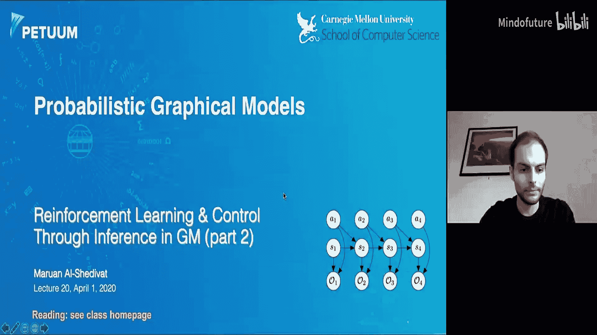
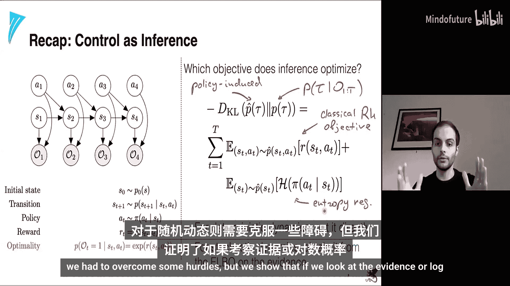
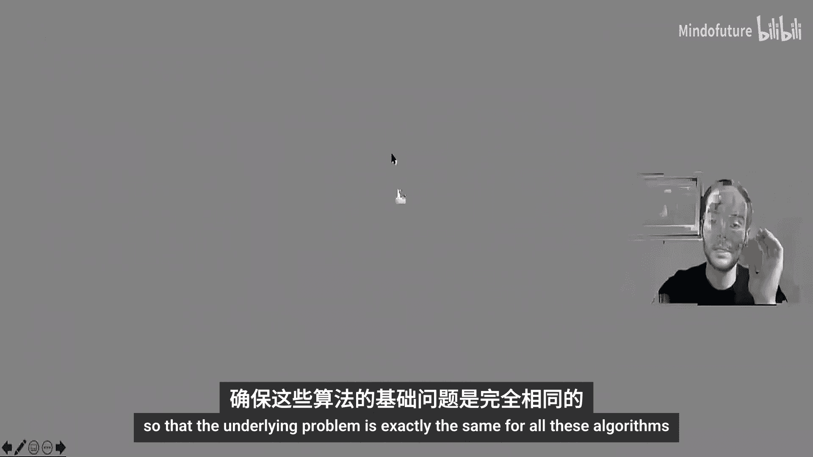
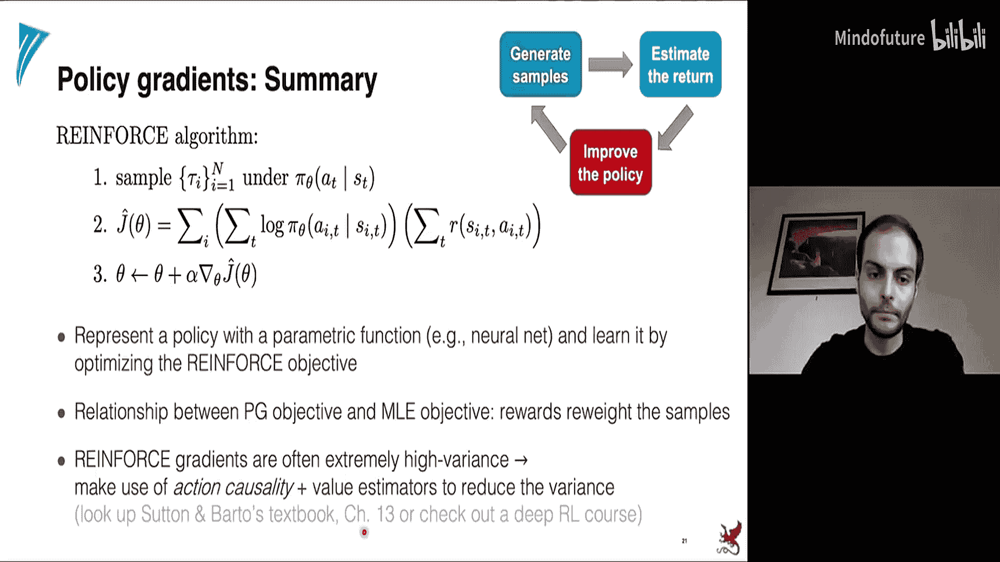
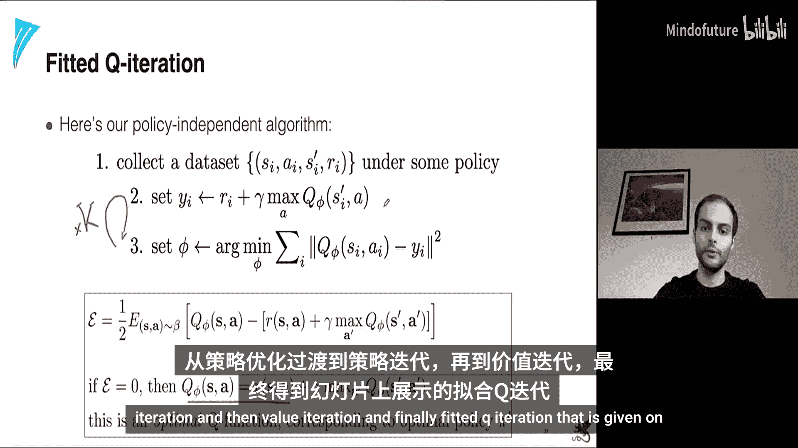
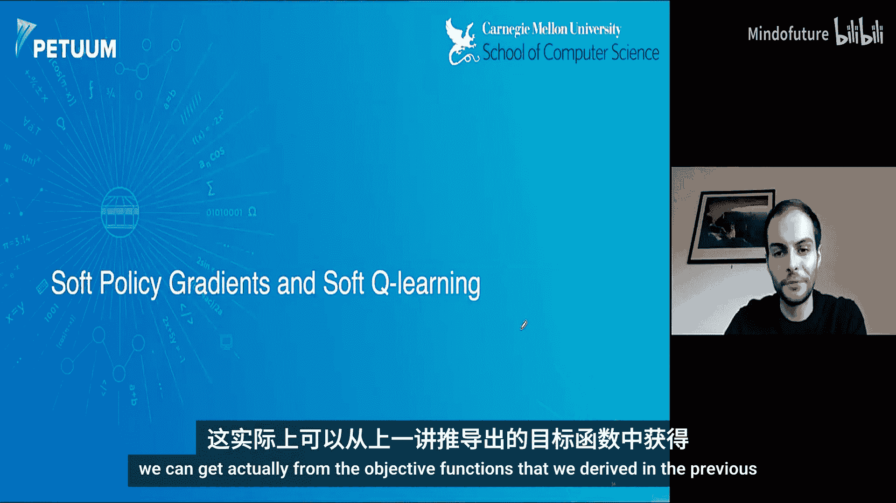
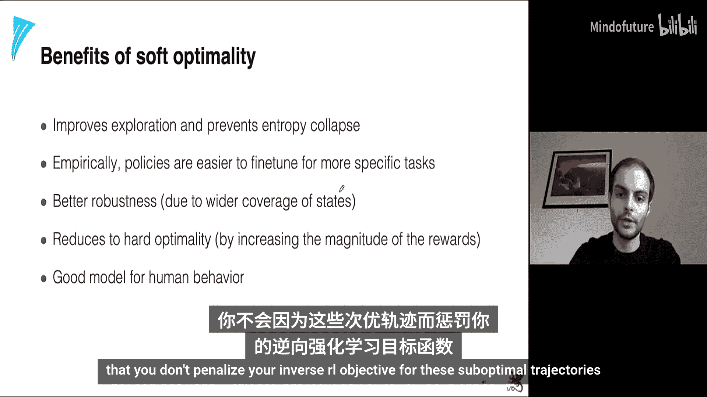
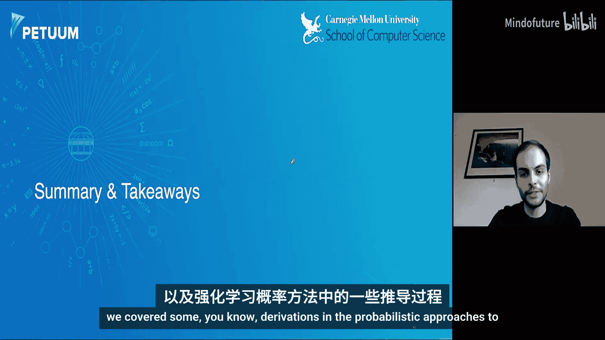
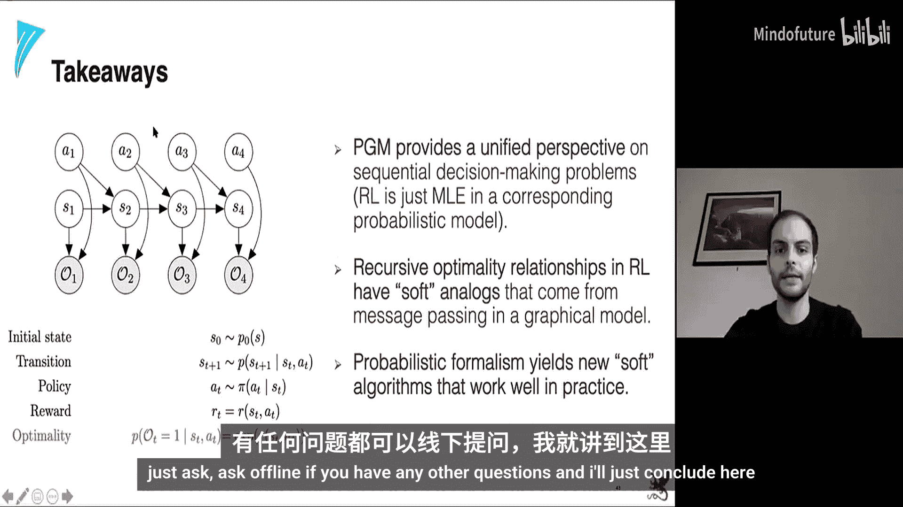

# 019：作为推断的强化学习（第二部分）🎯

在本节课中，我们将继续学习从概率图形模型视角看待强化学习。我们将首先回顾上一讲的核心概念，然后深入探讨最大熵强化学习算法，包括策略梯度和经典的Q学习，并在此基础上构建出从“控制即推断”框架中衍生出的软Q学习和软策略梯度。

## 快速回顾 🔄

上一讲我们介绍了大量材料，建立了强化学习的概率视角。我们首先介绍了强化学习和马尔可夫决策过程的基础知识。

在上一部分，我们涵盖了MDP的基础。现在，我们将快速回顾已学内容和得到的主要方程与结果，然后进入第二部分，探讨最大熵强化学习算法。我们将首先介绍策略梯度和标准的经典Q学习算法，然后在此基础上构建软Q学习和软策略梯度，这些方法都源自我们的“控制即推断”框架。

### 马尔可夫决策过程与图形模型

首先，我们回顾两个核心概念。在幻灯片左侧是马尔可夫决策过程。我们有一个环境，一个智能体与环境交互。环境向智能体发送状态和奖励，智能体感知它们并采取行动。我们将MDP定义为初始状态的分布、转移算子的分布（即给定前一状态和动作的后继状态分布），以及一个通常是未知的奖励函数。策略在整个模块中都是概率性的。

在右侧是这个过程的图形模型表示，它是一个带有辅助可观测变量的标准隐马尔可夫模型。我们所做的唯一事情是，通过添加一个额外的条件概率分布来增广这个图形模型，该分布表示在给定时间步T最优的概率与在该时间点的指数化奖励成正比（或相等）。为了使数学上一致，奖励必须被缩放或平移，使其为负值，以避免概率大于一。除此之外，它基本上就是我们的标准隐马尔可夫链模型。

### 经典框架中的价值函数

在经典设置中，我们引入了价值函数的概念。我们从奖励开始，然后沿着轨迹对奖励求和，称之为回报。接着我们说，给定当前状态的期望回报是状态价值，给定当前状态和当前动作的期望回报是状态-动作对价值。这些期望是针对动态环境和策略计算的，因此这些价值函数依赖于策略。

我们引入了一些递归关系，称之为这些价值函数的贝尔曼最优性方程。这些方程基本上是说，如果我们有最优函数（最优Q和最优V），它们通过最大化算子相互关联。一旦我们获得了最优价值函数，就可以通过沿动作对Q函数进行argmax来推导出相应的最优策略。

### 推断框架中的对应概念

另一方面，在“控制即推断”这边，我们也推导出了与经典设置非常相似的表达式。首先，我们引入了轨迹的概率。给定这个图形模型，我们可以以“我们希望在整个轨迹上都是最优的”为条件。那么，如果我们知道我们正在最优地行动，轨迹的概率是多少？这基本上正比于轨迹的概率乘以指数化的奖励总和。

现在，我们引入了几个称为V(ST)和Q(ST, AT)的量。这些是某些量的对数，这些量被称为后向消息（我们稍微滥用了符号）。这个后向消息等于从时间点T到结束时最优的概率，给定我们从状态ST采取了动作A。我们特意将它们命名为V和Q，因为它们之间的关系与贝尔曼最优性关系非常相似。具体来说，V是Q的指数和对数，加上给定状态ST的动作先验概率的对数。这个对数积分指数基本上是一个softmax（对数求和指数），这对我们来说非常熟悉。因此，这个框架有时被称为“软”框架，这个方程是软最优性条件。

最后，我们得到了最优策略的表达式，即在给定我们希望在整个轨迹上最优的条件下，在时间T采取动作AT给定ST的条件分布。它非常方便地变成了Q函数和V函数之差，这个差通常被称为优势，即在状态ST采取动作AT相对于遵循策略继续前进的优势。

### 推断策略优化的目标

接着我们提出了一个问题：我们从图形模型中的推断开始，能够使用贝叶斯规则和图形模型的结构推导出这些条件分布。但问题是，这个推断策略优化了哪个目标？结果证明，如果我们计算由策略诱导的轨迹分布与已知奖励下图形模型中实际最优的轨迹分布之间的KL散度，我们实际上可以计算出幻灯片上给出的目标：期望累积奖励加上策略熵的某种熵奖励。目标的第一部分与经典强化学习目标相同，第二部分只是一个正则化项。对于确定性动态，我们可以直接通过查看KL散度得到这个结果；对于随机动态，我们必须克服一些障碍，但如果我们查看证据或对数概率，也可以得到。

## 强化学习算法概览 📊

在深入细节之前，我们先快速浏览一下强化学习中的主要算法类别。所有算法的底层问题是相同的。

第一类算法称为**策略梯度**，它试图直接针对策略的参数优化这个随机目标，因为我们直接搜索能够最大化该目标的策略。

第二类是**基于价值的方法**，它试图摆脱策略，转而使用价值函数V或Q函数（或两者）的某种表示，并直接从这些Q函数推导出策略。我们知道，如果我们能获得最优Q函数，就可以通过argmax Q函数轻松推导出策略。

第三类方法实际上同时表示V函数、Q函数和策略。这可以稍微稳定学习过程，并降低目标及其梯度的方差。基本上，你为V和Q函数以及策略分别设置参数集，然后在优化V、Q和策略之间迭代。

最后，还有一类方法称为**基于模型的方法**，除了估计策略或价值函数外，它们还尝试对环境的状态转移动态进行建模。一旦你对环境内的转移动态有了良好的估计，就可以将其用于规划。规划基本上是：与其在环境中进行实际探索，不如尝试根据你的模型预测环境的行为，然后尝试解决从当前状态寻找最优轨迹的问题。一旦找到最优轨迹，就可以尝试选择沿着这个最优轨迹的第一个动作。这就是基于规划的策略。通常这非常昂贵，所以在实践中，你会将规划与策略学习结合使用。例如，AlphaGo就是这样做的，它使用蒙特卡洛树搜索进行规划，然后将MCTS提炼成一个可以直接调用的策略。

在本讲中，我们不会深入所有这些方法。为了简单起见，我们将只关注策略梯度和基于价值的方法。我鼓励你自己去查阅其他方法。

## 策略梯度算法详解 📈

第一个方法是**策略梯度**。让我们更详细地看看它是如何工作的，以及我们究竟将如何优化这个随机目标。

我们将J(θ)称为依赖于θ的目标函数。我们面临的第一个问题是如何估计这个期望。为了估计这个期望，我们应该能够从中采样轨迹。通常，当你能够访问环境时，你可以遵循学生代码来采样轨迹：你从某个初始状态开始，环境给你这个初始状态，然后你从时间1迭代到时间T，在每个时间点，你根据当前策略选择一个动作，然后从环境中选择下一个状态和相应的奖励。因此，只要你有一个策略并能访问模拟器，只需将你的策略插入模拟器，就可以生成一堆这样的轨迹。因此，在生成一堆轨迹后，你可以得到目标函数的蒙特卡洛估计。它基本上是你使用在环境中运行的策略生成的轨迹上的奖励总和。

现在，一旦我们知道如何计算目标函数的估计，我们如何改进策略呢？答案很简单：我们应该计算目标函数相对于策略参数的梯度。注意，在这个目标中，我们完全没有提到策略的参数。如果你天真地计算梯度，基本上会得到零。但实际上，所有这些样本、奖励、状态和动作都依赖于策略。为了做到这一点，我们需要以某种方式保留对参数的依赖。为此，我们可以稍微重写目标函数：我们可以用积分形式重写期望，因为微分算子是线性的，我们可以将其推入积分内部，得到右侧的目标。然后，我们可以用以下形式重写这个概率分布的梯度，这被称为**得分函数梯度技巧**。

我们如何得到这个？很简单，依赖于θ的概率的梯度等于该概率乘以（并除以）该概率，然后我们将分母和梯度这两项结合起来，这实际上等于对数的梯度。这只是一个等价关系。它给了我们积分下的概率分布，这样我们又可以把这个积分目标转换成一个期望。一旦我们有了期望，我们就能够再次从轨迹分布中采样轨迹，现在使用这个带有梯度的不同目标函数来估计J(θ)的梯度。

所以，这种从基本目标函数到另一个代理目标函数的转换，使我们能够保留目标对参数的依赖性，这样我们在微分时就不会只得到零。文献中有更通用的方法，例如查看梯度估计和随机计算图，我强烈推荐John Schulman的这篇论文。我们还研究了估计不同高阶梯度，如果可能的话。每当你计算这个目标的高阶梯度时，都必须对相应的目标函数进行一些繁琐的操作，你会得到另一个代理目标函数，它会保留允许你计算高阶梯度的某些项。代数上可能很繁琐，但有一种方法可以使用自动微分来实现。

最后，如果你对这个主题感兴趣，最近有一篇非常全面的综述，名为《蒙特卡洛梯度估计与机器学习》，它涵盖了许多不同的估计器。这个估计器只是其中一种方法，称为得分函数估计器，有时也称为REINFORCE估计器，因为我们将会看到REINFORCE算法使用了这个估计器。它有优点也有缺点，我们稍后会讨论。

现在我们知道如何计算相对于策略参数的梯度了。但请记住，这个P_θ(τ)实际上是整个轨迹的分布，也就是动态环境和策略的分布。让我们更明确地写出来，在这种情况下，我们得到的是这三个项梯度的和。注意，这两项并不真正依赖于参数，所以我们很幸运，与环境相关的一切都不在目标中，这意味着我们实际上不需要知道动态环境来计算这些梯度，这非常方便。最终，我们得到的是：J(θ)的梯度等于在我们策略下采样的轨迹的期望，然后我们计算在当前策略下给定状态的动作对数概率的梯度之和，这个和再乘以奖励总和进行加权。

这让我们想起了什么？基本上，发生的情况是：我们在策略下采样一堆轨迹，得到一堆轨迹，然后我们尝试最大化或鼓励策略去模仿或拟合那些具有较高奖励的轨迹，同时降低那些具有较低或负奖励的轨迹的权重。这就是算法直观上所做的。

有趣的是，如果你看一下模仿学习或行为克隆，那里已经给了你一堆轨迹，唯一的目标是模仿专家。目标函数看起来就像幻灯片底部给出的那个，基本上是说我们想要最大化给定策略下轨迹的似然，所以我们试图尽可能好地模仿专家。因此，这个策略梯度（REINFORCE目标）和这个模仿学习目标之间的唯一区别是，如果我们没有来自专家的轨迹，但我们可以访问某些奖励，我们基本上是根据相应的奖励重新加权似然。在某种意义上，这是一个由奖励加权的加权似然目标。

一旦我们有了这个加权目标，我们就可以直接插入我们最喜欢的优化算法，比如随机梯度下降，来优化这些参数。这里的一切基本上都给出了，唯一的要点是，为了近似期望，我们可以简单地通过在环境中根据给定策略采样轨迹来获得梯度的无偏估计。

所以，重点是这些方法有时也被称为**同策略策略优化**或**同策略学习**，因为你需要在策略上，即你需要从当前策略采样轨迹，以获得这个目标的修正估计。你不能只是从某个其他任意策略采样，然后计算这个目标，因为那样会产生一些偏差，偏差的大小与用于采样轨迹的策略和当前正在优化的策略之间的差异成正比。

这只是为了提醒你我们将贯穿本讲使用的循环：通常采样以估计回报（在这种情况下，我们拟合的模型非常简单，只是这个回报的估计），然后我们改进策略，比如通过梯度步进。

REINFORCE算法超级简单，只有两个步骤：采样、计算目标，然后改进策略。

关于我们刚刚推导出的这个简单算法，有几个快速说明。首先，我们可以用不同的方式表示策略，通常你会用一些参数化函数来表示，例如神经网络，你可以使用梯度下降来学习函数的参数。我提到了策略梯度和行为克隆中最大似然目标之间的关系：在策略梯度中，你根据奖励按比例上调样本的权重；而在行为克隆中，你假设轨迹已经是最优的，所以你得到的任何样本都已经有高奖励，你甚至不需要为它们烦恼。

最后，这个算法虽然简单，但有一些显著的问题。其中之一是梯度或目标函数的估计可能噪声很大。根据环境的随机性和初始策略的好坏，方差可能非常高，这可能会大大减慢学习速度。当噪声很多而信号不足时，学习可能会大大减慢。此外，当奖励非常稀疏时，在某些环境中，你可能只在轨迹末尾的非常罕见的情况下获得正奖励。在这种情况下，最初的大多数轨迹只会得到零奖励。所以当你得到零时，基本上你的整个目标将乘以零，所以你将没有足够的信号来学习，因此你需要尽可能多地随机探索轨迹，并希望在某些时候命中一些非零奖励，这将给你足够的学习信号。

有一种方法可以改进这个目标，即使用动作因果性：你尝试根据该动作实际影响的累积回报来按比例更新动作，或者基本上稍微不同地重构这两项以考虑这种因果性。我不会在本讲中涵盖这一点，但你可以在Sutton和Barto书的第13章中查阅。

## Q学习算法详解 🤖

接下来，我将介绍Q学习。到目前为止有问题吗？没有问题？好的，很好。请随时在聊天中输入问题或举手，我会尽量关注。

那么，Q学习是一种我们试图摆脱策略并直接处理价值函数的方法。我们如何做到这一点呢？如果我们再次查看我们刚刚推导出的目标梯度，它实际上依赖于策略的参数。我们如何摆脱对策略的直接依赖呢？一种看待它的方式是：记住，如果我们有一个最优Q函数，我们知道可以通过简单的argmax从这个最优Q函数诱导或推导出策略。这很好，但我们需要能够访问一个最优Q函数。如果我们没有，我们该怎么办？如果我们无法访问最优Q函数，我们可以做的是：从一个对应于某个策略的Q函数开始。给定一个策略，我们总是可以得到相应的Q函数。如果你还记得我们是如何做到的，我们可以简单地计算在策略下以状态和行动为条件的期望回报。然后，如果我们愿意，我们可以从这个Q函数推导出一个策略。让我们尝试使用这个技巧，并将其插入我们在这里的目标函数中，尝试消除表达式中的策略。

那么，我们能否通过与环境的交互来学习Q函数？答案是尝试这样做。假设我们有一个对应于某个策略的Q函数。现在，如果我们对这个Q函数进行argmax并设计一个新策略（在这种情况下将是一个确定性策略π'），结果证明π'将优于原始π。“更好”是在上一讲中介绍的意义上：如果一个策略对于每个状态，其相应的价值都优于或等于另一个策略，那么这个策略就更好。我们将尝试使用这个不等式，在给定Q函数的情况下改进策略。

所以，再次说明，假设我们从某个策略开始，我们可以生成一堆样本，然后我们可以将模型拟合到回报上。在这种情况下，我们将直接拟合Q函数，然后我们将改进策略。策略改进基本上由幻灯片上给出：你将使用这个argmax算子来获得一个比原始策略更好的策略π'，然后你将再次生成样本，拟合模型，并在这三个步骤之间迭代。

这里的算法称为**策略迭代**。它从评估Q开始，一旦我们在某个策略下评估了Q，我们就可以更新策略，然后在步骤之间迭代。

让我们更仔细地看一下。Q函数根据定义满足这个递归关系：我们有一个给定状态和动作的奖励，加上下一个状态的伽马折扣期望值，其中期望是针对环境中的转移动态计算的。一旦我们这样写出来，我们需要做的就是能够估计给定策略下的Q函数。假设我们有一个策略，我们如何在这种情况下估计Q函数？我们可以使用我们在上一讲中介绍的标准备份图。从状态S开始，我们将根据策略行动，得到不同的状态-动作对，然后从那里根据转移动态进行转移，最终得到一些S'。对于这些节点中的每一个，假设我们知道V，我们可以直接通过它们进行备份，并重新计算原始状态下的V值。给定一个状态，我们将稍微扩展一下，或者可能一直扩展到树的底部，然后一旦我们在树的底部，我们就可以一直备份到树顶，并计算这个状态下的V值。这些转移是根据我们这里的动态发生的，并且是针对策略的。

这是我们到目前为止推导出的算法：给定原始的V函数（假设我们从某个V开始），我们可以计算Q；计算Q之后，我们可以计算更新后的策略π'；一旦我们有了π'，我们将不得不重新评估V函数。所以我们将取π'，将其代入这个表达式，并为π'重新计算新的价值函数；一旦我们再次有了新的价值函数，我们将重新计算Q函数，并在这些步骤之间迭代。所以一步一步地，我们慢慢地消除对π的依赖。我们在这个更新规则中仍然有π。但在我从这些方程中消除π之前，让我们看看这个图。

为了建立一些直觉，再次说明，我们在这里处理的两个实体是V函数和π函数。我们从对应于某个随机π的某个随机V开始。我们将从某个策略π开始，评估V，得到对应于当前策略的某个V。然后我们去贪婪地（相对于当前V）找到策略，我们知道它会比之前的原始随机策略稍微好一些。现在，对于这个新策略，我们将再次重新评估V函数，然后我们将迭代。最终，这个迭代过程收敛到V*和π*。在某些条件下，你可以证明这个迭代过程实际上收敛到最优V*和π*，但我不打算在讲座中深入这些细节。

现在，让我们尝试最终从算法和表达式中消除所有策略表达式。我们如何做到这一点？记住，我们通过Q函数推导出这个贪婪策略。事实上，如果我们有Q函数的参数化表示（比如表格表示），我实际上不需要表示策略，因为它可以直接从Q诱导出来。这正是我们要在这里做的：我们将使用策略的表达式，然后写下第二步：我们将直接从Q函数转到V函数，而不是尝试从π策略推导π'。

这个表达式从何而来？它来自于最优V*和Q*之间的关系。记住，如果我们有最优V函数和最优Q函数，它们之间的关系基本上是V等于对a取max的Q(S, a)。所以，与其通过Q函数表示策略，我们将直接处理V函数和Q函数，并使用那个关系作为下一步。

我们可能还想摆脱V函数，因为基本上V和Q现在在某种程度上是可以互换的，因为一个可以在最优性条件下从另一个推导出来。我们可以利用这一点。但到目前为止，我讨论的是表格情况。在高维环境或高维观测甚至动作的情况下，我们该怎么办？在这种情况下，我们可以参数化地表示Q函数，并说它由参数φ参数化。与其直接以表格形式表示Q函数（在第一步中，我们必须遍历所有状态和所有动作，并更新Q的表格表示），我们必须做其他事情，因为现在我们通常无法遍历所有状态和所有动作，我们必须做一些聪明的事情来更新Q的参数。我们如何做到这一点？我们仍然假设我们有一些状态和动作对以及后继状态。因此，只要我们有一些S_i和相应的动作A_i，我们就可以计算这个Y_i，它等于当前状态和动作的奖励加上下一个状态的伽马折扣期望值。

假设我们可以计算这些Y_i，我们可以将它们代回这个方程，并解决关于Q函数参数的回归问题。所以，如果我们没有表格表示，我们可以通过解决这个回归问题来克服，而不是将这些Y_i直接写入Q表。

注意，我刚才提到的Q函数和V函数之间的关系是通过对动作取最大值来实现的。所以，我们现在可以用对当前参数φ下的Q函数估计取最大值来替代这个。

一旦我们这样做了，我们就得到了最终的算法。首先，我们将在某个策略下收集一个数据集，包含状态、动作、后继状态和相应的奖励。我们需要这些S_i和A_i来计算这些Y_i值，这些Y_i值是对应状态价值的估计。一旦我们有了这个数据集，我们可以使用当前参数下的当前Q的关系来计算这些Y_i。然后，我们可以解决Q函数参数的回归问题。事实上，我们可以在根据某个策略收集的数据集上重复这个步骤任意多次，然后在我们根据某个策略刷新数据集或获取更多数据之后，继续重复这个过程。我们什么时候停止？我们知道，当幻灯片上给出的Q函数的误差等于零时，我们是最优的。如果Q函数是最优的，那么这个关系应该得到满足。所以，只要这个误差足够小，我们就应该能够停止。当我们停止时，我们有一个接近最优的Q函数，然后我们可以通过对Q函数取argmax来推导出相应的接近最优的策略。

这就是**拟合Q迭代算法**。到目前为止有任何问题吗？

## 软策略梯度与软Q学习 🧠

好的，快速回顾一下：我们从策略梯度开始，展示了如何通过直接优化随机目标来优化策略的参数。然后我们问了一个问题：如果我们只对学习价值函数感兴趣，能否摆脱策略？在某些情况下，我们可以在表格设置中表示这些价值函数；在某些情况下，我们必须用一些连续函数来近似它们。因此，我们迭代地消除了对策略的依赖，从策略优化到策略迭代，再到价值迭代，最后是幻灯片上给出的拟合迭代。

这些是两种经典算法：基于价值的学习和基于策略的学习，它们适用于任意的MDP。现在，我们可以看看软策略梯度和软Q学习，这些实际上可以从我们在上一讲推导出的目标函数中得到。我们如何做到这一点？再次记住我们拥有的图形模型以及对应于推断的相应优化问题。在上一讲中，我们展示了通过优化这个目标，等价地，我们再次得到了这个图形模型的最优推断策略。

那么，我们能否直接取那个目标，将其插入我们的强化学习框架并进行优化，从而得到一些不同的策略学习或Q学习算法？答案是肯定的，这正是我们要做的。让我们尝试再次针对策略优化随机目标，但现在这个目标函数将被我们从软强化学习框架中得到的不同目标函数所取代。

首先，让我们稍微扩展一下这个目标函数。在幻灯片上，我现在写下了KL散度的近似，其中我们有仅依赖于奖励的原始项和仅依赖于熵的另一项。这是两个不同的期望，我们实际上可以将它们合并成一个单一的期望，其中我们针对从策略诱导分布中采样的状态-动作对取期望。

这个目标和非常经典的策略梯度目标之间的唯一区别是，我们有了我们试图优化的策略下的对数概率。

我们现在可以做的就是计算这个目标相对于策略参数的梯度，这里没有什么困难或复杂的地方，它与我为原始强化学习目标推导的策略梯度方法完全相同，但现在你将有一个额外的项在里面。

所以，软策略梯度基本上就是相同的策略梯度，但你做的唯一事情是你有这个熵正则化项，推导过程将完全相同，你将得到的REINFORCE算法也将完全相同，只是里面多了一个额外的项。

但有趣的是软策略梯度与Q学习的关系。问题是：我们能否以相同的方式，或者甚至比我们从策略梯度目标转向基于价值的目标时更有效的方式，摆脱策略？再次说明，这是我们随机目标的梯度。我们将在这里使用几个技巧：首先，我们扩展期望，并用一堆N条轨迹来近似它。我们将关于参数θ的梯度推过期望，得到在我们策略下给定状态的动作对数概率的梯度。然后，我们将在目标中引入并扩展这一项。记住，我们上次推导出的最优推断策略等于最优Q函数和最优价值函数之差的指数。

那么，现在为了摆脱策略或其参数化表示，我们可以做的是：我们可以使用这个关系。现在直接用一些参数θ参数化Q函数和V函数，并将它们插入这个目标函数。我们不需要逐步消除策略，然后慢慢地使用最优性条件、Q、V和π'之间的递归最优性关系。在这里，我们可以直接使用这个最优推断策略的表达式，并将其插入我们的目标函数。当我们这样做时，现在我们可以直接将V表示为关于动作的Q的对数求和指数。我们最终将得到一个仅依赖于Q函数的目标。首先，中间这个附加项大约等于给定你采取动作A_{t+1}时，状态S_{t+1}的Q。然后，在重新排列项的几个步骤之后，我们基本上得到了Q相对于Q参数的梯度（我稍微滥用了符号，因为这里我们用θ表示的π的参数可能与Q的参数不完全相同，但假设你重新参数化一切），你将得到Q函数的梯度乘以这个奖励加上下一个状态下Q_θ的softmax（关于下一个动作），然后减去当前状态和当前动作的当前Q估计。所以，这个新目标是软Q学习的目标，然后我们直接从软策略梯度的目标中得到了它，只需使用在最优性条件下应该成立的关系来替换策略。

要获得软策略梯度，我们只需在目标函数中添加一个小项。

## 软Q学习的工作原理 🛠️

那么软Q学习如何工作？现在我们可以用一个神经网络来参数化我们的Q函数，该网络接收动作和状态并输出Q值的某些估计。记住，在原始Q学习或拟合Q学习中，我们有这三个步骤：我们在某个策略下收集数据集，然后使用当前策略下的关系计算这些Y_i，然后我们重新拟合Q函数以更好地近似这些价值估计Y_i。

在Q学习中，我们的参数更新由幻灯片上给出：原始参数加上α乘以这个目标函数的梯度。如果你只是展开关于φ的参数，并用θ替换φ，这就是你将得到的梯度。你试图估计的目标价值函数将通过max算子计算。现在，软Q学习和Q学习在算法上的唯一区别是，更新操作将完全相同，但代替max，你将使用softmax。所以你将使用softmax算子来计算目标价值，将其代回这里，现在你可以计算整个表达式相对于Q函数参数的梯度，然后在这两个步骤之间继续迭代。算法将与原始Q学习相同，我们在步骤之间收集一些数据，然后可能再次重新收集数据。

这只是来自介绍软Q学习和软策略梯度的论文的插图。他们表明，即使你拥有相当复杂的多模态奖励分布（在这种情况下是一个二维环境，智能体必须移动到更高奖励的区域），当你学习软Q函数或软策略，使用软策略梯度时，智能体会探索整个空间，并最终命中环境中所有的高奖励区域。

那么这种软最优性的好处是什么？在众多好处中，我们可以强调几个具体的。首先，它改进了探索并防止策略的熵崩溃。通过“熵崩溃”，我的意思是，有时当你进行策略梯度或Q学习时，你可能会找到奖励分布的一个模式，并且可能一直只去那个模式，最终你的策略随着时间的推移通过优化会变得越来越不具熵，意味着它越来越不随机，越来越确定性。在某些存在不同模式的情况下，这可能并不理想，因为其中一些模式可能比其他模式具有更高的奖励，如果你发现了一个模式，你的策略可能会崩溃。软最优性允许你改进探索并防止这种熵崩溃。

经验表明，这些策略更容易微调到更具体的任务。假设你在一个任务上预训练了软策略（软策略梯度），那么将这个更具熵的策略微调到其他任务会容易得多。由于对状态的覆盖更广，策略最终可能更稳健。将策略简化为硬最优性也相当容易：如果你想的话，可以增加（或减少）温度参数，策略基本上会减少到不那么随机的策略。有时，当你将这个框架用于逆强化学习时（你试图推断专家或人类试图优化的奖励，或者你相信人类试图优化的奖励），使用这种随机或概率框架通常能更好地近似人类行为，因为人类行为可能容易出错，有时人类可能会采取一些在人类试图优化的目标函数下等价的随机轨迹，所以你希望你的框架确保你不会因为这些次优轨迹而惩罚你的逆强化学习目标。

## 总结与关键要点 📝

好的，总结一下这个模块的关键要点。

我们所做的是：我们首先涵盖了经典强化学习的一些基础知识，以及强化学习概率方法的一些推导。我们引入了这个带有辅助变量的图形模型，一切基本上都源于试图解决这个图形模型。我认为这里有几个重要的要点需要强调。

首先，概率图形模型为一系列序列决策问题提供了统一的视角，这也许是这个框架从PGM角度来看最有趣的原因之一。它允许我们将强化学习中的递归最优性关系与图形模型中消息传递产生的软类比联系起来，这是非常美妙的。最后，这种形式主义引导我们发现了某些算法的软版本，这些算法之间具有有趣的关系，而且这些算法在实践中也表现得相当好。

我们在这两讲中都没有过多涉及实际实现，但我鼓励你尝试实现其中一些算法，也许在你的项目中，或者希望你在下一次作业中能接触到其中一些内容，并亲自看看它效果如何。

好了，这个模块的内容就到这里。有什么问题吗？我们这次有充足的时间提问。