# 020：作为推断的强化学习（第一部分）

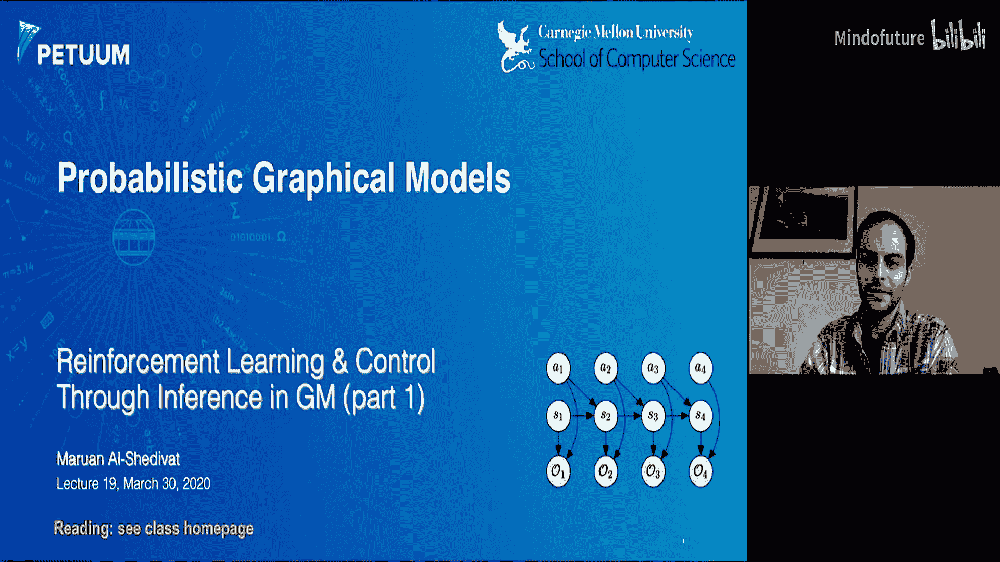

在本节课中，我们将学习强化学习的基本概念，并探索如何通过概率推断的视角来重新审视和控制问题。我们将介绍马尔可夫决策过程，并构建一个特殊的概率图模型，将最优行为建模为推断问题。

---

## 概述

强化学习是机器学习的一个重要范式，它关注智能体如何通过与环境的交互来学习最优策略以最大化累积奖励。与监督学习和无监督学习不同，强化学习直接面向决策问题。本节课将首先介绍强化学习的基础，包括马尔可夫决策过程、价值函数和贝尔曼方程。随后，我们将展示如何构建一个包含“最优性”变量的概率图模型，从而将寻找最优策略的问题转化为一个概率推断问题。这种视角不仅提供了新的理论见解，也为推导新的算法奠定了基础。

---

## 强化学习基础概念

上一节我们概述了本课程的目标。本节中，我们来看看强化学习的核心框架——马尔可夫决策过程。

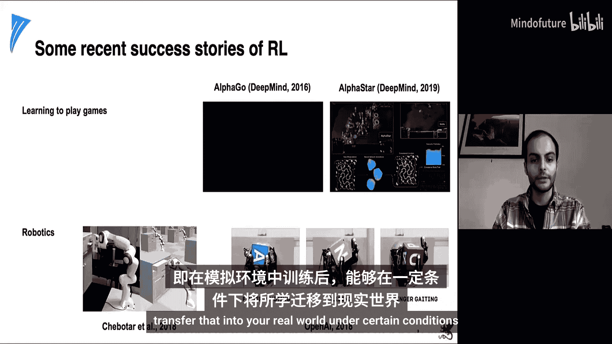

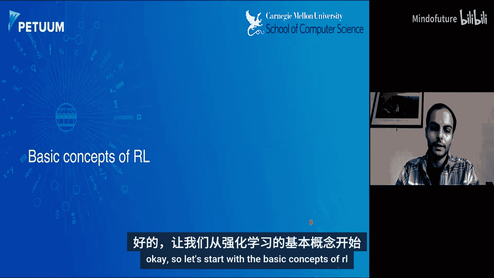

### 马尔可夫决策过程

一个马尔可夫决策过程 定义了智能体与环境交互的框架。它包含以下元素：
*   **状态集合 **：环境所有可能状态的集合。
*   **动作集合 **：智能体所有可能动作的集合。
*   **状态转移概率 **：在状态  执行动作  后，环境转移到状态  的概率。该概率满足马尔可夫性，即只依赖于当前状态和动作。
*   **奖励函数 **：在状态  执行动作  后，智能体获得的期望奖励。奖励可以是确定性的，也可以是随机的。
*   **折扣因子 **：用于计算未来奖励的现值，确保无限时域下的回报是有限的。

智能体与环境的交互产生一个**轨迹** ：。

### 策略与回报

智能体的行为由**策略**  决定。策略可以是确定性的（），也可以是随机的，即从条件分布  中采样动作。

为了评估策略的优劣，我们定义**回报** 。对于有限时域  ，回报是未来奖励的和：。对于无限时域，我们引入折扣因子  ：。回报可以递归地定义为：。

### 价值函数与贝尔曼方程

**状态价值函数**  衡量了从状态  开始，遵循策略  所能获得的期望回报：。

**状态-动作价值函数** （或称Q函数）  衡量了在状态  执行动作  后，再遵循策略  所能获得的期望回报：。

价值函数满足重要的**贝尔曼方程**，它建立了当前价值与下一时刻价值之间的联系：

对于  ：
对于  ：

这些方程是动态规划方法的基础。

### 最优性与贝尔曼最优方程

强化学习的目标是找到**最优策略**  ，使得从任何状态开始都能获得最大的期望回报。我们定义**最优状态价值函数**  和**最优状态-动作价值函数**  ：

它们满足**贝尔曼最优方程**：

与策略评估的贝尔曼方程不同，最优方程中使用了 `max` 操作符，代表了在每一步都选择最优动作。

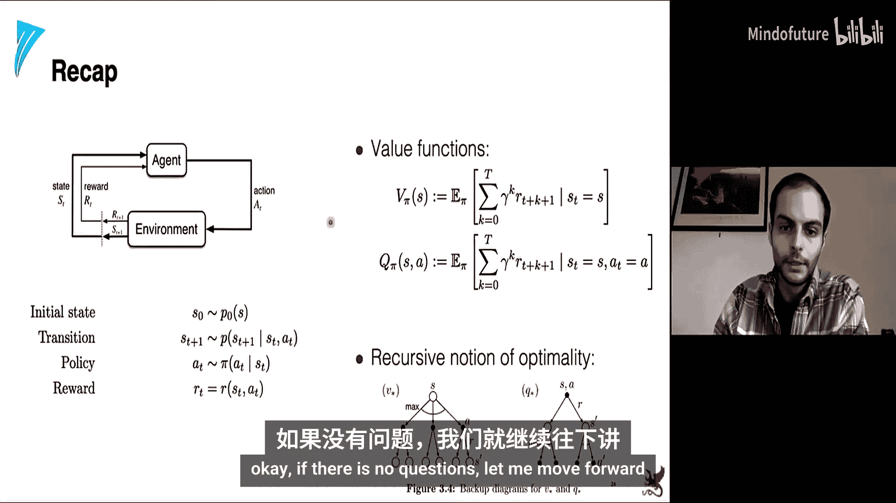

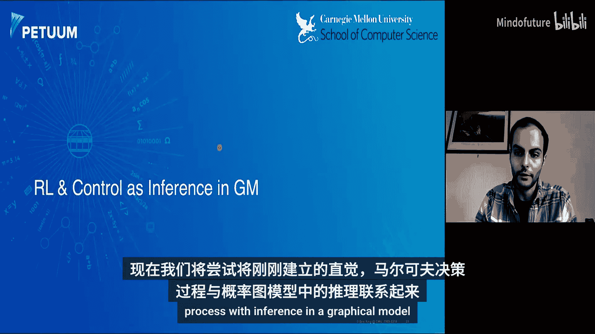

如果已知  和模型（即  和 ），最优确定性策略可以通过贪心方式得到：。最优轨迹可以通过从初始状态开始，每一步都遵循该策略来获得。

---

## 作为推断的强化学习

上一节我们介绍了经典强化学习中的最优控制问题。本节中，我们将通过构建一个概率图模型，将控制问题重新表述为一个概率推断问题。

### 构建概率图模型

我们从一个标准的MDP开始，但为其添加一系列二元**最优性变量**  。这些变量被定义为可观测的，并且其条件分布与奖励函数相关联：

其中  是一个归一化常数。这个定义意味着，在状态  下采取动作  获得的奖励越高，在该时间步被标记为“最优”的概率就越大。

现在，我们得到了一个特殊的**隐马尔可夫模型**：状态  和动作  是隐变量，最优性变量  是观测变量。模型完全由初始状态分布  、动作先验  、状态转移动态  以及上述的  定义。

### 模型能回答的问题

这个图模型框架允许我们以概率的方式提出并回答几个关键问题：
1.  **策略搜索（控制）**：给定奖励函数  ，最优策略是什么？即计算  。
2.  **逆强化学习**：给定一组观测到的最优轨迹  ，背后的奖励函数  是什么？
3.  **轨迹最优性**：计算一条轨迹  在所有时间步都被认为最优的概率  。

### 通过推断求解最优策略

我们重点关注第一个问题：如何通过推断得到最优策略。在图模型中，这对应于计算后验概率  。

通过应用贝叶斯规则和模型的因子分解，我们可以推导出这个后验分布。有趣的是，我们可以定义**后向消息**  ，它表示从时间  的状态-动作对  开始，未来一直保持最优的概率。

这些后向消息可以通过类似于HMM中的后向算法递归计算：

其中  。递归的起点是  。

类似地，可以定义只关于状态的后向消息：。

### 与经典RL价值的联系

现在，我们建立推断框架与经典RL价值函数的关键联系。定义：
*   `V*(s_t) = log β_t(s_t)`
*   `Q*(s_t, a_t) = log β_t(s_t, a_t)`

将这些定义代入上述递归关系，对于**确定性动态**环境，我们可以得到熟悉的贝尔曼最优方程：`Q*(s_t, a_t) = r(s_t, a_t) + V*(s_{t+1})`，而  和  之间的关系由 `log-sum-exp` 操作给出：`V*(s_t) = log ∑_a exp(Q*(s_t, a_t))`。这可以看作 `max` 操作的平滑版本。

然而，在**随机性动态**环境中，直接推导会得到一个“乐观”的转移模型：`Q*(s_t, a_t) = r(s_t, a_t) + log E_{s_{t+1}~p} [exp(V*(s_{t+1}))]`。这里对  取指数后再求期望，会倾向于选择那些有很小概率到达极高价值状态的“高风险”动作，这可能不是我们期望的行为。

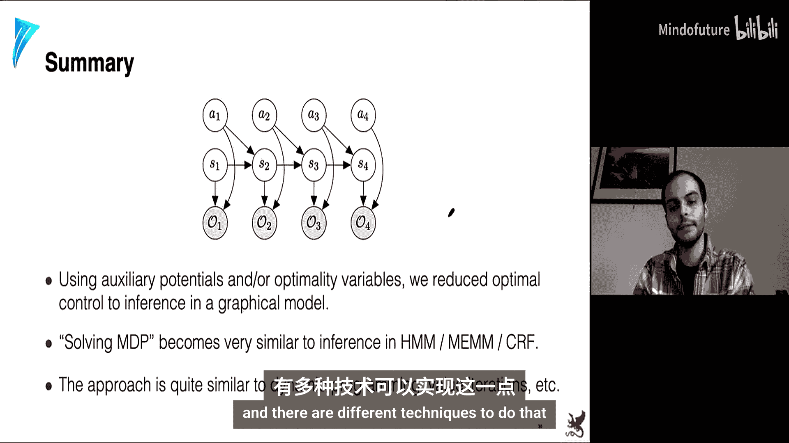

最终，最优策略可以通过后验推断得到：。这表示策略正比于 `exp(Q*(s_t, a_t) - V*(s_t))`，即 `exp(优势函数)`。这提供了一个比纯粹贪心策略更平滑、更具探索性的策略。

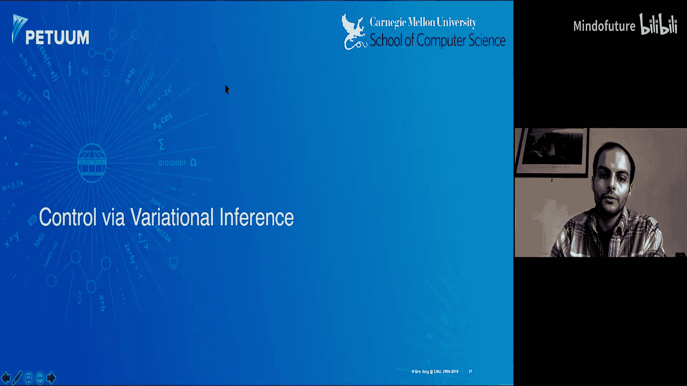

---

## 变分推断视角

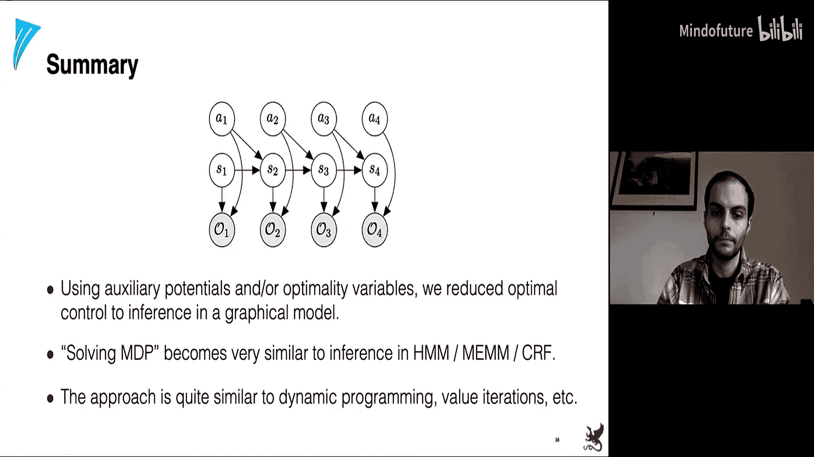

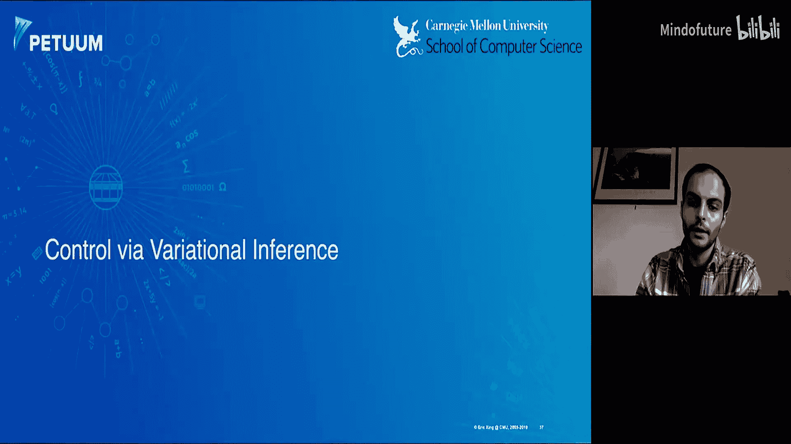

上一节我们展示了如何通过精确推断在图模型中求解策略。本节中，我们从变分推断的视角来重新审视这个问题，这将帮助我们处理随机动态环境中的“乐观”问题，并导出可优化的目标函数。

### 问题：匹配轨迹分布

我们的目标仍然是让智能体策略产生的轨迹分布  尽可能接近最优轨迹的后验分布  。在随机动态下，我们需要确保在匹配过程中，环境的真实动态  保持不变，只有策略  是可优化的。

因此，我们定义由策略  诱导的轨迹分布为：，其中  是我们要学习的策略。

### 证据下界

我们希望通过最大化观测到最优性（即整个轨迹最优）的**对数证据**  来学习策略。直接优化是困难的，因此我们引入变分分布  来近似真实后验  ，并构建**证据下界** ：

将轨迹分布代入并化简，ELBO可以展开为：

其中  表示由策略  采样的轨迹上的期望。

### 最终目标函数

经过化简和近似（忽略常数项），我们得到最终要**最大化**的目标函数 ：

这个目标函数具有清晰的解释：
*   **第一项**：标准的强化学习目标，即期望累积奖励。
*   **第二项**：策略  的熵的期望。它鼓励策略保持随机性，从而促进探索。

这个目标被称为**最大熵强化学习**目标。优化这个目标，我们得到的策略不仅追求高奖励，还希望尽可能保持随机（高熵）。

### 求解最优策略

通过固定环境动态  ，并优化上述最大熵目标函数，我们可以推导出最优策略的形式。结果表明，最优策略  恰好就是我们之前从精确推断中得到的策略形式：。

更重要的是，在这种情况下，对应的  和  函数满足的贝尔曼方程**不再**是乐观的。对于随机动态，新的贝尔曼方程为：

`Q*(s_t, a_t) = r(s_t, a_t) + γ E_{s_{t+1}~p}[V*(s_{t+1})]`
`V*(s_t) = log ∑_a exp(Q*(s_t, a_t))` （假设动作先验均匀）

这里，  的更新中使用了标准的期望 `E`，而不是 `log E exp`，从而避免了过度乐观的风险寻求行为。

---

## 总结

本节课我们一起学习了强化学习与概率推断之间的深刻联系。
1.  我们首先回顾了强化学习的基本概念，包括马尔可夫决策过程、价值函数、贝尔曼方程以及最优控制的目标。
2.  接着，我们通过引入“最优性”观测变量，构建了一个特殊的概率图模型（一个隐马尔可夫模型），从而将“寻找最优策略”的问题形式化为“计算给定最优观测下动作的后验分布”的推断问题。
3.  我们展示了如何通过后向消息传递算法在该模型中进行推断，并建立了推断结果（后向消息）与经典RL价值函数之间的对数关系。
4.  最后，我们从变分推断的视角出发，通过最大化一个证据下界，导出了**最大熵强化学习**的目标函数。这个目标不仅最大化累积奖励，还最大化策略的熵。优化该目标得到的最优策略，与推断得到的结果一致，并且在随机动态环境下避免了经典推断方法可能产生的过度乐观问题。

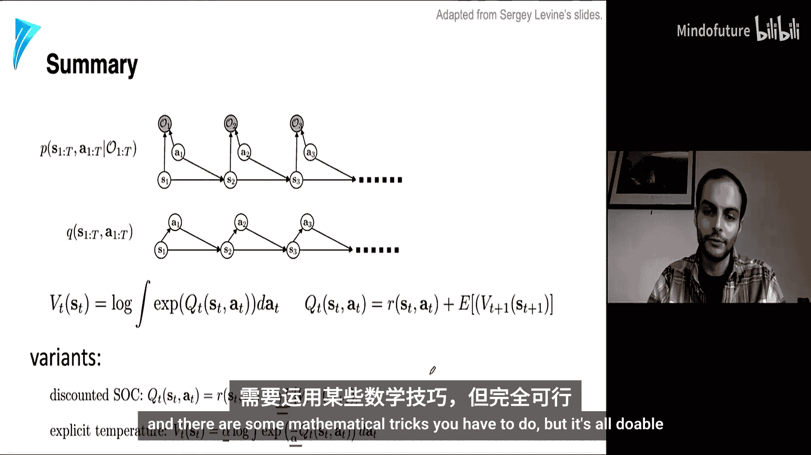

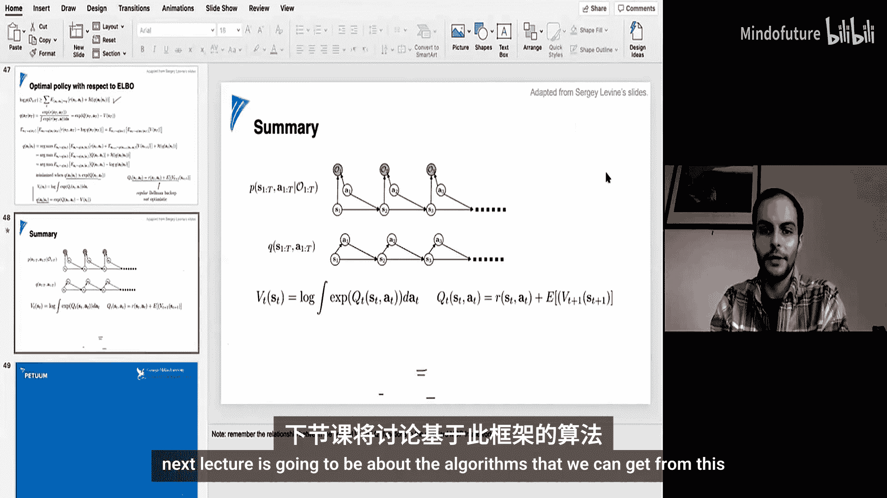

这种将控制视为推断的框架，为理解和发展强化学习算法提供了统一而强大的视角。在下一讲中，我们将基于此框架，推导出具体的强化学习算法，如软Q学习和软策略梯度方法。