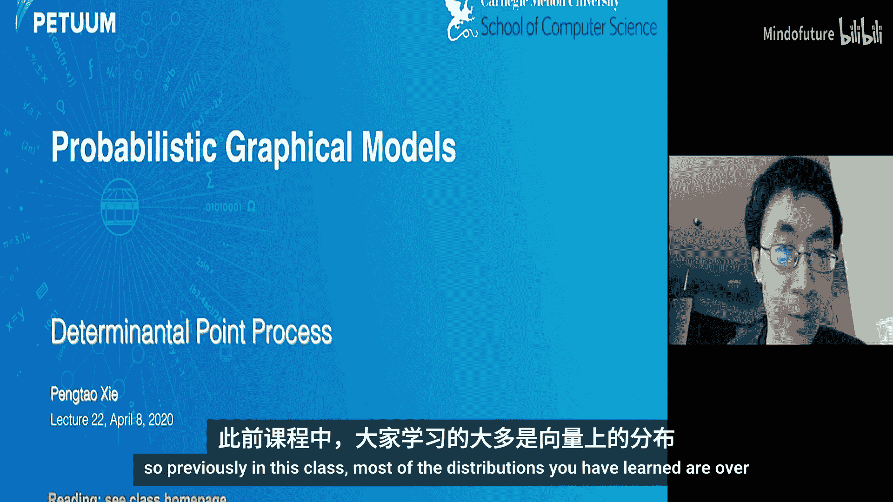
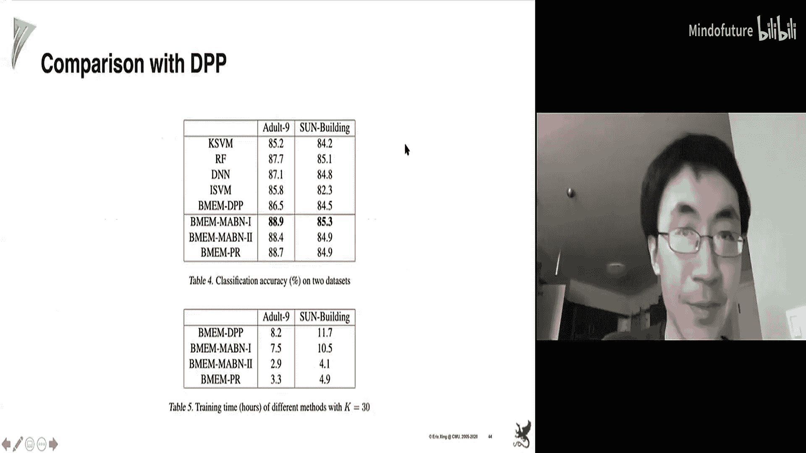

# 022：行列式点过程

在本节课中，我们将要学习一种用于建模集合形式数据的分布，即行列式点过程。这是一种定义在集合上的概率分布，它天然地倾向于选择多样化的子集。我们将介绍其基本概念、采样方法、寻找分布众数、参数学习，并扩展到条件DPP和K-DPP。

---

## 概述

在之前的课程中，我们学习了定义在向量上的分布。上一讲我们学习了定义在函数上的高斯过程。本节课我们将讨论一种定义在新对象类型——集合——上的分布，即行列式点过程。

DPP是一种定义在子集上的概率分布，它天然地倾向于选择多样化的子集。给定一个包含K个项目的全集，每个项目有其特征表示，DPP可以为我们提供一个选择多样化子集的概率框架。

---

## 子集选择问题

子集选择是机器学习中广泛存在的问题。其设定是：给定一组关键项目，我们希望从中选择一个子集。

以下是该问题的一些应用实例：
*   **抽取式文档摘要**：给定一个包含多个句子的文档，目标是选择一个句子子集来概括该文档。
*   **特征选择**：给定一组特征，目标是选择一个特征子集以加速计算或简化模型分析。
*   **产品推荐**：给定一组产品，目标是选择一个产品子集推荐给用户。

在进行子集选择时，我们通常希望追求**多样性**，即希望所选项目彼此之间尽可能不相似。

在上述应用中，我们确实有实现多样性的需求：
*   在文档摘要中，我们希望选择能代表文档且不冗余的句子。
*   在特征选择中，我们希望所选特征不冗余。
*   在产品推荐中，我们希望向用户推荐多样化的产品，而非同一类别的产品。

本节课我们将重点介绍行列式点过程，它有两个作用：一是为子集选择定义了一个优雅的概率模型；二是DPP天然地倾向于多样性。

---

## 行列式点过程基础

DPP是一种定义在子集上的分布，它倾向于多样化的子集。

给定一个包含K个项目的全集 `Y = {1, 2, ..., K}`，其中项目 `i` 的特征表示为 `a_i`。我们首先计算一个 `K x K` 的格拉姆矩阵 `L`，其中 `L_{ij}` 是项目 `i` 和项目 `j` 特征向量的内积，用于衡量两个项目之间的相关性或相似性。

对于一个子集 `Y`（`Y ⊆ Y`），DPP定义其概率为：
`P(Y) = det(L_Y) / det(L + I)`
其中，`L_Y` 是矩阵 `L` 中由子集 `Y` 索引的行和列构成的子矩阵，`det` 表示行列式，`I` 是单位矩阵。

**示例**：假设全集有四个项目 `{1, 2, 3, 4}`，我们计算得到格拉姆矩阵 `L`。现在考虑子集 `Y = {2, 3}`。其概率的分子是子矩阵 `[[L_22, L_23], [L_32, L_33]]` 的行列式，分母是矩阵 `(L + I)` 的行列式。

---

## 为何DPP倾向多样性？

从几何角度可以直观理解DPP为何倾向多样性。子矩阵 `L_Y` 的行列式值，等于由子集 `Y` 中项目对应的特征向量所张成的平行多面体的体积。

该体积取决于两点：
1.  向量的模长：模长越大，体积越大。
2.  向量的夹角：向量越不相似（夹角越大，内积越小），平行多面体的体积就越大。

由于概率与体积成正比，因此项目特征向量越不相似，其对应子集的概率就越大。所以DPP具有倾向于多样化子集的归纳偏置。

---

## 配分函数与证明

在概率图模型中，配分函数确保概率归一化为1。对于DPP，其配分函数 `Z` 为：
`Z = det(L + I)`
这是一个闭式解，计算高效（多项式时间），而非指数时间。

**证明概要**：证明基于一个定理：对于任意子集 `A ⊆ Y`，有 `∑_{Y: A ⊆ Y ⊆ Y} det(L_Y) = det(L + I_{Ā})`，其中 `I_{Ā}` 是一个对角矩阵，当索引属于 `A` 的补集 `Ā` 时对角元为1，否则为0。通过数学归纳法证明该定理后，令 `A` 为空集，即可得到配分函数 `Z = det(L + I)`。

---

## DPP的扩展

上一节我们介绍了基础DPP，本节我们来看看它的几种扩展形式。

**核化DPP**：在原始定义中，格拉姆矩阵的元素是内积。我们可以将其替换为核函数 `K(a_i, a_j)`，从而得到核化DPP。定义形式不变，只是 `L` 变为核矩阵。

**深度DPP**：我们可以使用深度神经网络将项目特征 `a_i` 映射到非线性隐空间，然后在该空间计算内积来构建 `L` 矩阵。这相当于使用了一个由神经网络参数化的深度核。

---

## 从DPP中采样

给定DPP分布后，我们需要能够从中抽取样本（即子集）。采样算法分为两部分：

1.  **第一阶段**：对矩阵 `L` 进行特征分解，得到特征值 `{λ_n}` 和特征向量 `{v_n}`。对于每个特征索引 `n`，以概率 `λ_n / (λ_n + 1)` 将其纳入一个中间集合 `J`。
2.  **第二阶段**：初始化最终子集 `Y` 为空。当 `J` 非空时：
    *   根据概率 `P(i) = (1/|J|) ∑_{v∈V_J} (e_i^T v)^2` 从全集中选择一个项目 `i` 加入 `Y`。其中 `V_J` 是 `J` 中索引对应的特征向量组成的矩阵，`e_i` 是标准基向量。
    *   将 `V_J` 投影到与 `e_i` 正交的子空间，并更新 `V_J` 为该子空间的一组标准正交基。
    *   从 `J` 中移除对应的索引。
    *   重复直到 `J` 为空。

该算法能确保采样结果服从DPP分布。其促进多样性的直观原因在于：每当选择一个项目后，算法会在与已选项目正交的子空间中继续选择，这鼓励了后续项目与已选项目的差异性。

---

## 寻找DPP的众数

除了采样，另一个重要任务是寻找分布的众数，即概率最大的子集。例如，在文档摘要中，我们希望找到概率最高的句子子集作为摘要。

寻找众数等价于最大化 `log det(L_Y)`。精确求解是NP难的。一种近似方法是使用连续松弛：

1.  将离散的 `0/1` 选择变量 `y_i` 松弛为 `[0, 1]` 区间内的连续变量。
2.  优化连续目标函数：`F(y) = log det(diag(y) L diag(y) + I - diag(y))`，其中 `diag(y)` 是以 `y` 为对角元的对角矩阵。
3.  得到最优解 `y*` 后，进行舍入：若 `y_i* > 0.5` 则选择项目 `i`，否则不选。

---

## 学习DPP的参数

在DPP中，`L` 矩阵可能包含需要学习的参数，例如核函数的超参数或深度神经网络的权重。

假设我们拥有训练数据，每个样本包含一个全集和其中被选中的子集（真实标注）。例如，在摘要任务中，每个文档的所有句子及其人工标注的摘要句子。

我们可以通过最大似然估计来学习参数：
`max_θ ∑_{n=1}^N log P_θ(Y_n | Y_n)`
其中 `θ` 是模型参数。我们可以使用梯度下降等优化方法最大化该对数似然函数。

---

## 条件行列式点过程

到目前为止，我们讨论的DPP选择子集仅依赖于全集中项目之间的关系。但在许多应用中，选择还依赖于项目与某些外部信息的关系。

例如，在个性化产品推荐中，我们有一个用户 `x` 和一组产品。我们不仅希望推荐多样化的产品，还希望产品与用户的兴趣高度相关。

这时可以使用**条件DPP**。关键在于定义一个条件核函数，它在计算两个项目 `a_i` 和 `a_j` 的相似度时，同时考虑它们与条件变量 `x` 的相关性。例如：
`L_{ij}^x = s(a_i, a_j) * g(a_i, x) * g(a_j, x)`
其中 `s` 衡量项目间相似性，`g` 衡量项目与用户 `x` 的相关性。

基于此条件核矩阵，可以定义条件概率 `P(Y | x)`，其形式与基础DPP相同。

**案例研究：深度条件DPP用于多标签分类**
在多标签分类中，给定一张图像 `x`，我们需要为其分配一个标签子集 `S`。我们可以构建一个深度条件DPP：
1.  使用神经网络获取图像嵌入和标签词嵌入。
2.  用一个网络计算标签与图像的相关性得分 `g`。
3.  用另一个网络计算两个标签之间的相似性得分 `s`。
4.  条件核定义为 `L_{ij}^x = s(a_i, a_j) * g(a_i, x) * g(a_j, x)`。
5.  基于此定义 `P(S | x)`，并使用带标注（图像，标签集）的数据进行最大似然训练。

**融入先验知识**：我们可以通过调整核矩阵来融入“必须链接”（鼓励共现）和“不能链接”（抑制共现）的先验知识。根据几何解释，若要抑制两个标签共现，就增加它们在核矩阵中的相似性值（从而降低其共现概率）；若要鼓励共现，则降低它们的相似性值。

---

## K-DPP：固定大小的子集

基础DPP定义的子集大小是可变的。但在很多应用中，我们需要选择固定大小 `K` 的子集。

K-DPP 的定义很直接：将概率质量只分配给那些恰好包含 `K` 个项目的子集。其概率为：
`P(Y) = det(L_Y) / ∑_{Y‘ ⊆ Y, |Y’| = K} det(L_{Y‘})`
然而，直接计算分母的求和是不可行的，因为组合数量巨大。

**从K-DPP中采样**：采样算法与基础DPP类似，主要区别在于第一阶段选择中间集合 `J` 的规则不同。它涉及一个基于特征值的量 `E_k(λ1, ..., λN)`，其定义与所有 `K` 元子集的特征值乘积之和有关。具体算法和证明可参考相关教程。

---

## 连续K-DPP

之前讨论的DPP定义在离散项目集合上。当“项目”本身是连续向量时（例如，主题模型中的每个主题向量），我们需要**连续K-DPP**。

假设我们有 `K` 个连续向量 `{a_1, ..., a_K}`。连续K-DPP定义在这些向量上的概率密度为：
`p(A) = (1/Z) * det(L_A)`
其中 `L_A` 是由这 `K` 个向量通过核函数计算的 `K x K` 矩阵。配分函数 `Z` 涉及该核函数对应算子的所有特征值，理论存在但通常无法显式计算。

**应用**：连续K-DPP可作为先验来鼓励学习到的表示具有多样性。例如，在主题模型（LDA）中，我们可以将 `det(L_A)` 作为正则化项加入目标函数（频率学派），或将其作为 `K` 个主题向量上的先验分布（贝叶斯学派），以鼓励主题的多样性。

---

## DPP的局限与相关改进

使用连续K-DPP作为先验存在一些局限：
1.  **不利于变分推断**：由于概率密度中包含行列式，在变分推断中计算关于该先验的期望较为困难。
2.  **无法直接应用于非参数模型**：在非参数贝叶斯模型中，潜在变量的数量可能是无限的，而DPP需要计算有限大小矩阵的行列式。

一些研究工作（如互角过程）试图解决这些局限，设计出更适合变分推断且能扩展到非参数设置的多样性促进先验。

---

## 总结

本节课我们一起学习了行列式点过程。我们从子集选择问题引入，介绍了DPP如何作为一种定义在集合上且倾向于多样性的概率分布。我们探讨了其几何直观、配分函数、采样算法、寻找众数的方法以及参数学习。接着，我们扩展到了条件DPP，使其能够结合外部信息进行选择，并介绍了固定子集大小的K-DPP。最后，我们简要讨论了连续K-DPP及其应用，以及DPP的一些局限性和改进方向。DPP为需要在不确定性下进行多样化选择的诸多机器学习任务提供了一个强大的建模工具。