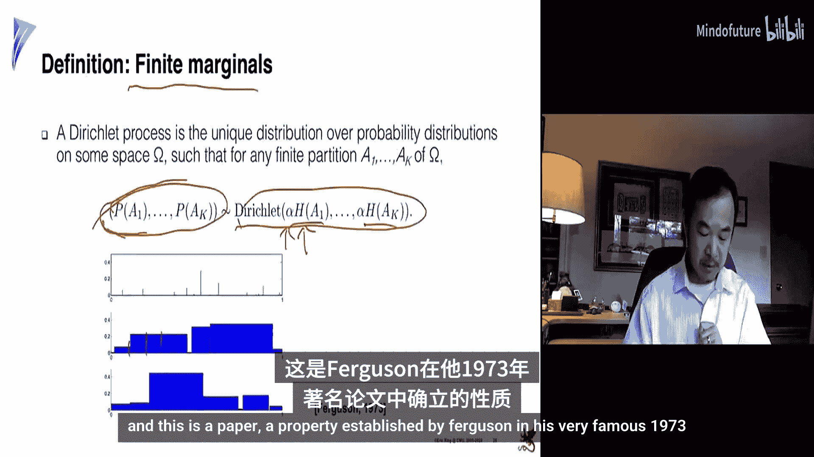
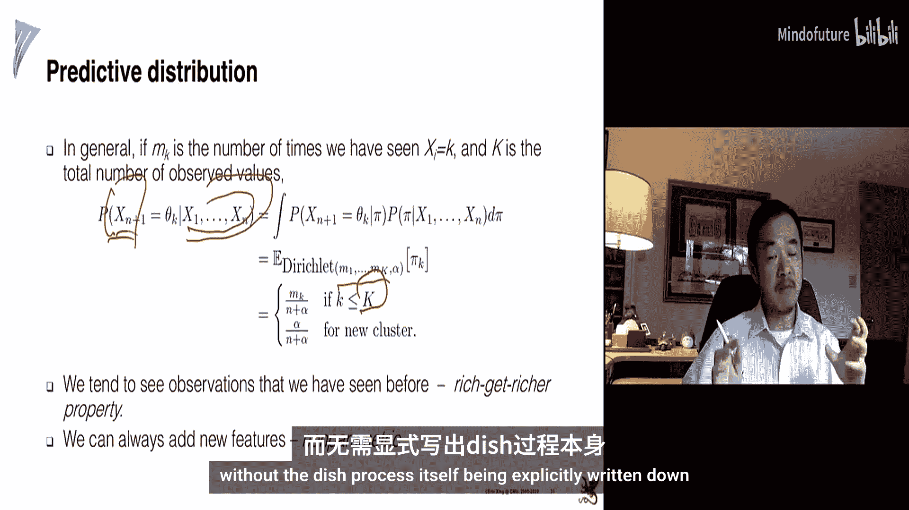
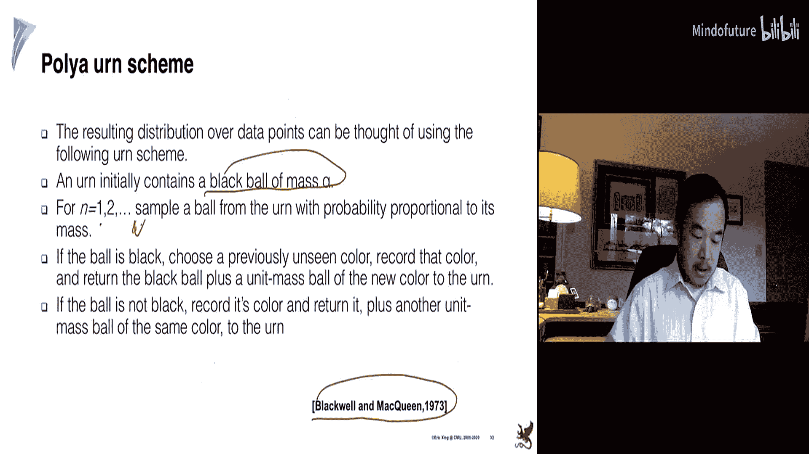
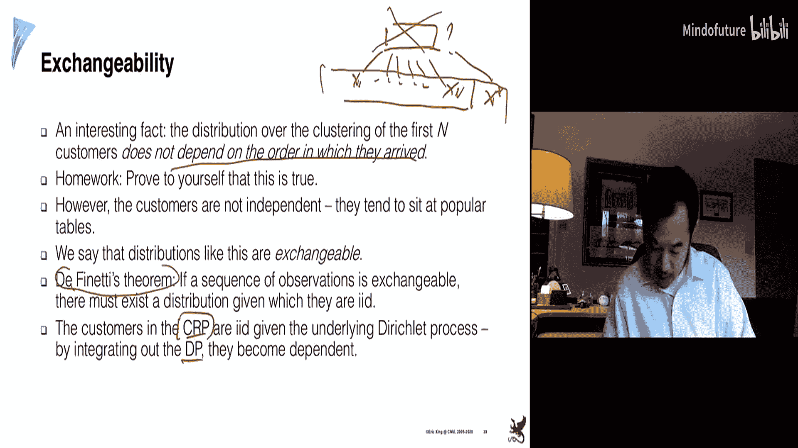
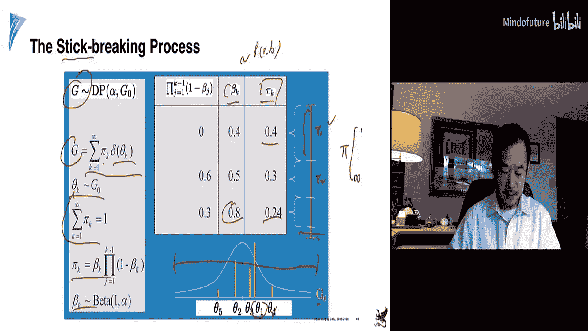
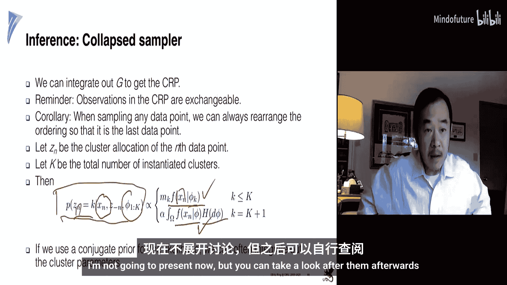
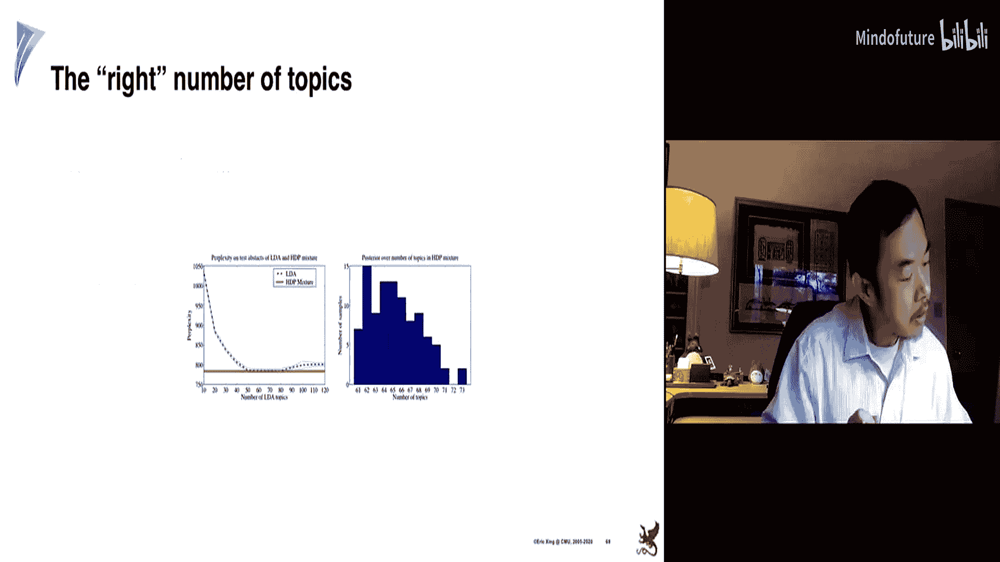
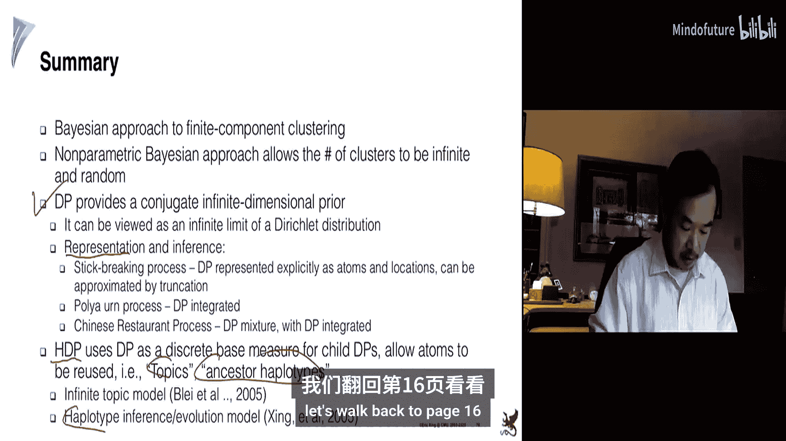
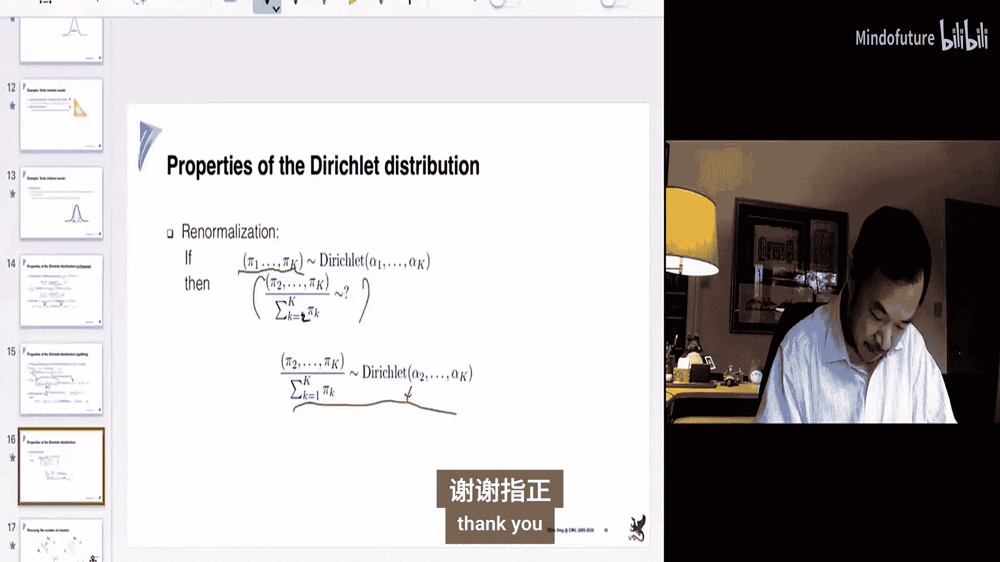
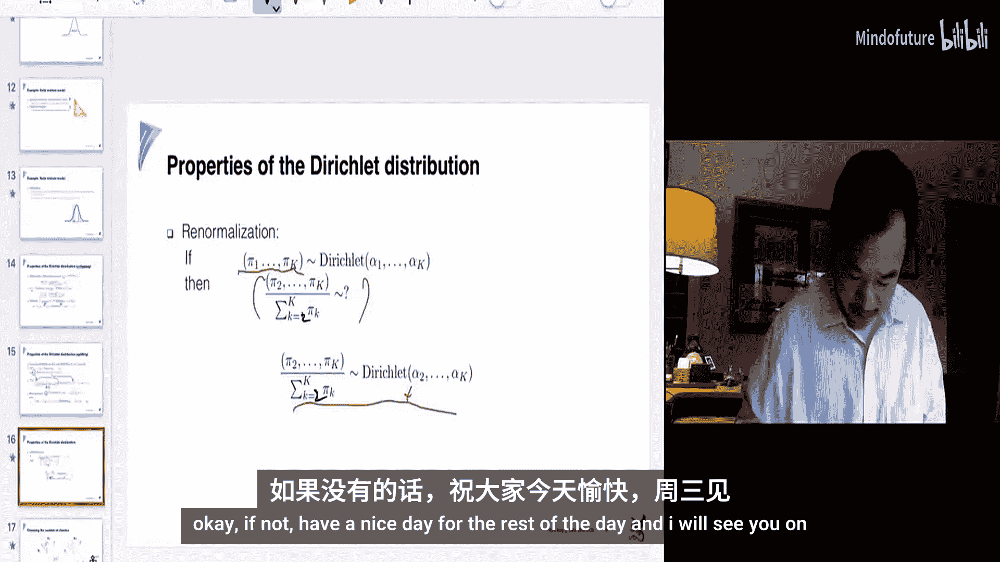

# 023：狄利克雷过程 🎲

在本节课中，我们将学习一种强大的非参数贝叶斯工具——狄利克雷过程。它是一种定义在分布之上的分布，能够让我们在建模时无需预先指定参数的数量（例如聚类数量），从而构建出更加灵活的模型。

上一节我们介绍了定义在集合上的行列式点过程。本节中，我们将探讨如何定义在分布之上的分布。

## 动机：聚类问题

考虑一个经典的聚类问题。数据点分布在二维空间中，我们希望将其分组。

通常的算法包括K均值或使用EM算法的高斯混合模型。然而，一个常见的问题是：如何设置正确的聚类数量K？对于高维数据或数据流，预先确定K值非常困难。

常见的启发式方法包括使用惩罚函数（如BIC）或交叉验证来评估不同K值的效果，但这些方法需要尝试多个K值，计算成本高昂。

## 参数化混合模型

让我们使用老朋友——高斯混合模型来建模。其似然函数如下，其中我们预设了K个分量：

$$
p(x) = \sum_{k=1}^{K} \pi_k \mathcal{N}(x | \mu_k, \Sigma_k)
$$

这是一个参数化模型，假设参数数量有限。我们可以采用贝叶斯方法，为参数定义先验分布：
*   $\pi$：每个聚类的权重，服从狄利克雷分布。
*   $\theta_k = (\mu_k, \Sigma_k)$：每个高斯分量的均值和协方差，服从高斯分布和逆Wishart分布。

这种共轭先验的设计是为了简化计算。但问题依然存在：我们仍需预先指定K。

## 狄利克雷分布

狄利克雷分布是定义在单纯形上的分布，其概率密度函数为：

$$
\text{Dir}(\pi | \alpha) = \frac{1}{B(\alpha)} \prod_{k=1}^{K} \pi_k^{\alpha_k - 1}
$$

其中，$\alpha$ 是超参数向量，$\pi$ 是一个随机向量，其分量和为1。$\alpha$ 的值影响分布的形态，可以控制权重是均匀分布还是集中在某些分量上。

狄利克雷分布是多项分布的共轭先验。这意味着，当观测到来自多项分布的数据后，参数 $\pi$ 的后验分布仍然是狄利克雷分布，其超参数更新为 $\alpha + \text{计数}$。

## 从分布到分布的分布

狄利克雷分布定义了混合模型权重参数 $\pi$ 的分布。而混合模型本身就是一个分布。因此，**狄利克雷分布实际上定义了一个“分布的分布”**。

当我们从狄利克雷分布中采样一个权重向量 $\pi$，并用它来参数化一个高斯混合模型时，我们就得到了一个具体的混合分布。狄利克雷先验则定义了所有可能混合分布的分布。

## 迈向无限：狄利克雷过程

为了摆脱对固定聚类数K的依赖，我们需要一个能定义无限维权重向量的先验。狄利克雷过程就是狄利克雷分布在无限维情况下的推广。

狄利克雷过程由两个参数定义：
1.  集中参数 $\alpha$：控制新类簇产生的倾向。
2.  基分布 $H$：一个连续分布（如高斯分布），定义了每个“原子”（可视为类簇中心）可能的位置。

**关键区别**：基分布 $H$ 是连续的，从中采样重复值的概率为零。而狄利克雷过程 $DP(\alpha, H)$ 是**离散的**，它生成的是一个带有权重的原子集合，因此采样到重复原子的概率不为零。这使得数据点能够共享相同的类簇。

狄利克雷过程有多种等价的构造或理解方式，以下是三种常见的隐喻：

### 1. 折棍构造法
想象一根长度为1的棍子。
1.  从Beta分布 $Beta(1, \alpha)$ 采样一个比例 $v_1$。
2.  折断棍子，第一段的长度 $\pi_1 = v_1$ 就是第一个原子的权重。从基分布 $H$ 采样得到该原子的位置 $\theta_1$。
3.  对剩下的棍子（长度 $1-\pi_1$）重复步骤1和2，得到 $(\pi_2, \theta_2), (\pi_3, \theta_3), ...$。
这个过程产生一个无限长的、权重之和为1的序列 $\{(\pi_k, \theta_k)\}_{k=1}^{\infty}$，它服从狄利克雷过程。

### 2. 中国餐馆过程
想象一个有无穷多张桌子的中国餐馆。
1.  第一位顾客进入，随机选择一张桌子坐下。
2.  第 $n+1$ 位顾客进入时：
    *   他以概率 $\frac{n_k}{n + \alpha}$ 选择已有 $n_k$ 位顾客的桌子 $k$。
    *   他以概率 $\frac{\alpha}{n + \alpha}$ 选择一张全新的空桌子。
这个过程定义了顾客到桌子的分配，其结果与顾客进入的顺序无关（称为可交换性），且对应的分配分布正是一个狄利克雷过程。

### 3. 波利亚坛子过程
想象一个坛子，开始时里面只有一个黑色的“创新球”。
1.  从坛中均匀抽取一个球。
2.  如果抽到的是彩球，则放回该彩球，并额外放入一个同颜色的彩球。
3.  如果抽到的是黑球，则从基分布 $H$ 中采样一个新颜色，制作一个该颜色的彩球放入坛中，同时将黑球也放回。
重复此过程，坛中彩球颜色的分布收敛于一个狄利克雷过程。

## 预测分布与聚类应用

在实际的聚类任务中，我们更关心给定已有数据后，新数据点的预测分布。通过将狄利克雷过程先验积分掉（即边缘化），我们可以得到直接的条件概率：

对于第 $n+1$ 个数据点 $x_{n+1}$，给定前 $n$ 个数据点及其所属类簇（共 $K$ 个类簇，第 $k$ 个类簇有 $n_k$ 个点）：
*   它以概率 $\frac{n_k}{n + \alpha}$ 属于现有的第 $k$ 个类簇。
*   它以概率 $\frac{\alpha}{n + \alpha}$ 属于一个全新的类簇（其参数从基分布 $H$ 中采样）。

这个公式完美体现了“富者愈富”的聚集效应，同时保留了开辟新类簇的可能性。我们无需预设K，模型能根据数据自动调整类簇数量。

## 扩展：层次狄利克雷过程

基本的狄利克雷过程有时在共享全局结构方面不够灵活。例如，在构建无限主题模型时，我们希望不同文档能共享同一个潜在的主题池。

层次狄利克雷过程通过引入另一层狄利克雷过程来解决这个问题：
*   全局层：一个狄利克雷过程 $DP(\gamma, H)$ 生成一个全局的、离散的“主题”原子库。
*   局部层：每个文档 $j$ 有自己的狄利克雷过程 $DP(\alpha, G_0)$，但其基分布 $G_0$ 正是全局的狄利克雷过程 $DP(\gamma, H)$。

由于全局DP是离散的，不同文档的局部DP会从中抽取原子，从而自然地共享相同的主题。这对应着“中国餐馆特许经营”的隐喻，使得不同“餐馆”（文档）可以共享“菜品”（主题）。

## 总结

本节课中我们一起学习了狄利克雷过程这一核心的非参数贝叶斯模型。
*   **动机**：为了解决参数化模型（如混合模型）中需要预先设定参数数量（如聚类数K）的问题。
*   **核心**：狄利克雷过程是一种定义在分布之上的分布，它是一个离散的随机测度，能够产生无限多个带权重的原子。
*   **关键性质**：具有“富者愈富”的聚集效应，同时允许创新（产生新原子）。
*   **等价表示**：我们学习了折棍构造法、中国餐馆过程和波利亚坛子过程这三种理解方式。
*   **应用**：可直接用于无限混合模型聚类，其预测分布给出了数据点归属的简洁公式。
*   **扩展**：层次狄利克雷过程通过引入层次结构，允许不同组的数据共享同一个底层原子库，广泛应用于如无限主题模型等场景。

狄利克雷过程为我们提供了一种强大而优雅的框架，用于构建灵活的、数据驱动的模型，是概率图形模型工具箱中的重要组成部分。