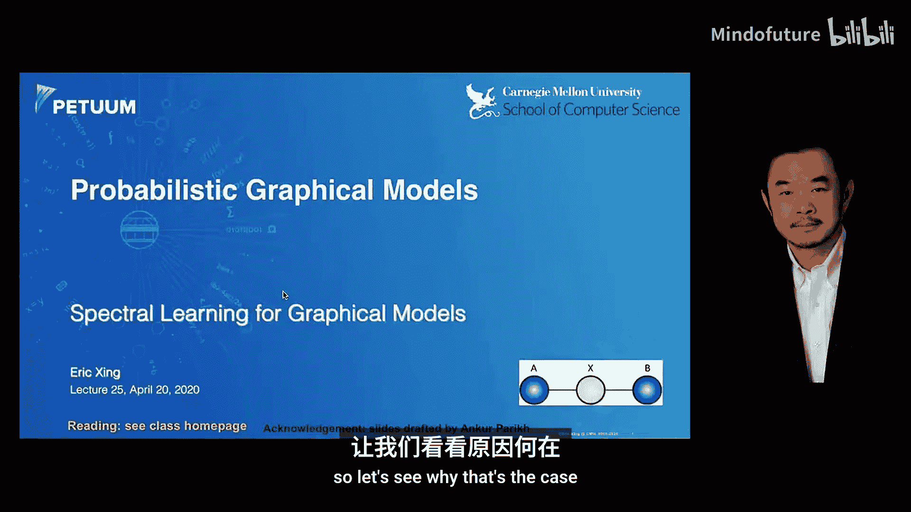
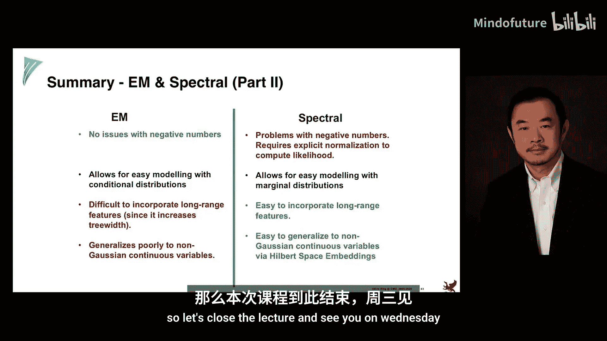

# 025：图模型的谱学习 🧮

在本节课中，我们将学习一种用于学习图模型的新方法——谱学习。这种方法绕过了传统的期望最大化算法，通过直接处理观测变量的统计量来学习模型，具有理论性质好、计算速度快且无局部最优解等优点。

## 概述

到目前为止，我们已经学习了许多潜变量模型，例如隐马尔可夫模型、潜在树模型和主题模型。学习这些模型通常使用期望最大化算法，但该算法存在收敛慢、易陷入局部最优等问题。谱学习提供了一种替代方案，它利用线性代数工具，通过观测变量的低秩矩阵分解来学习模型，无需显式估计潜变量。

## 潜变量模型与预测目标

首先，我们思考一个问题：为什么需要潜变量模型？在许多应用中，例如预测未来观测值，潜变量本身可能并非最终目标，而只是实现准确预测的工具。如果我们只关心预测，那么是否必须通过期望最大化算法来学习潜变量参数呢？

在非参数贝叶斯方法中，我们通过积分掉生成模型中的隐藏分布，直接对新标签进行预测。这种思想可以应用于任何潜变量模型。例如，在隐马尔可夫模型中，如果我们将所有潜变量积分掉，会发生什么？

积分掉潜变量后，所有观测变量之间将变得相互依赖，模型的拓扑结构会变成一个“全连接”的团。虽然对于简单的分类任务可行，但对于更复杂的任务，使用团来建模会非常低效，因为需要巨大的联合概率表。数学上，这是因为对潜变量求和后，联合概率无法再被分解。

## 图的谱视角：矩阵秩与潜变量

那么，一个团和一个结构化的图模型（如隐马尔可夫模型）在代数或计算上的根本区别是什么？这可以通过矩阵的秩来理解。

考虑一个简单的图模型：三个观测变量 `X1, X2, X3` 连接到一个潜变量 `H`。假设观测变量有 `M` 个状态，潜变量有 `K` 个状态。
*   如果 `K = 1`，潜变量对观测变量没有影响，三个观测变量相互独立。对应的联合概率矩阵 `P(X1, X2, X3)` 的秩为1。
*   如果 `K = M^3`，潜变量可以编码所有可能的观测组合，观测变量完全依赖，形成一个团。对应的联合概率矩阵是满秩的（秩为 `M^3`）。
*   如果 `K` 介于 `1` 和 `M^3` 之间，联合概率矩阵的秩为 `K`。这对应了一个具有 `K` 个状态的潜变量模型，它捕捉了观测变量之间中等强度的依赖关系。

**核心概念**：潜变量的基数 `K` 直接决定了观测变量联合概率矩阵的秩。低秩矩阵意味着存在一个潜变量结构。因此，我们可以不显式引入潜变量，而是直接使用一个低秩的观测变量联合概率矩阵，这等价于容纳了一个潜变量的存在。这就是图模型的谱视角，它利用线性代数中的秩、特征值、奇异值分解等工具来揭示模型结构。

## 可观测因子分解

谱学习的核心技巧是“可观测因子分解”。它允许我们将一个大的联合概率矩阵分解为仅涉及少量观测变量的较小矩阵的乘积，从而在学习和预测时完全避开潜变量。

以下是如何对一个四变量序列 `X1, X2, X3, X4` 进行因子分解的示例。通过巧妙地选择“枢纽”（例如 `X2`），我们可以得到如下分解：

**公式**：
`P(X1, X2, X3, X4) ≈ P(X1, X2, X3) * [P(X2, X3)]^{-1} * P(X2, X3, X4)`

这个分解非常神奇，因为等式右边所有的矩阵都只涉及观测变量（`P(X1,X2,X3)`, `P(X2,X3)`, `P(X2,X3,X4)`），不再需要潜变量 `H`。在训练时，我们只需从数据中收集这些较小矩阵的统计量（计数）。在测试时，对于任何观测序列，我们只需查找并乘上相应的矩阵块即可计算其概率，这只是一系列张量乘法。

这种分解可以递归地应用于更长的序列，最终将大型联合概率表表示为多个易于管理的、规模较小的观测矩阵的乘积。

## 应用示例与优势

这种技术可以应用于许多模型。例如，在无监督句法分析中，传统方法需要标注好的句法树来训练概率上下文无关文法。而潜变量模型（潜在变量概率上下文无关文法）只需句子和词性标签，但需用期望最大化算法学习，计算复杂。

使用谱方法，我们可以为句子推导出类似的可观测因子分解，用一系列基于观测词和词性的矩阵乘积来表示整个句子的概率。训练时直接估计这些矩阵，测试时进行矩阵乘法查询，无需迭代学习潜变量。

谱学习方法具有显著优势：
*   **速度快**：非迭代算法，复杂度远低于期望最大化算法。
*   **无局部最优**：目标函数是凸的。
*   **理论保证**：具有一致性等良好理论性质。
*   **灵活**：可通过技巧处理连续变量和长程依赖。

## 挑战与扩展

当然，谱学习方法也面临一些挑战：
1.  **因子分解的设计**：为新的模型图结构找到正确的矩阵因子分解需要技巧和线性代数洞察力。
2.  **矩阵求逆问题**：分解中常涉及矩阵求逆（如 `[P(X2, X3)]^{-1}`）。如果该矩阵是低秩或奇异的，则求逆不可行或数值不稳定。
3.  **处理高基数潜变量**：当潜变量基数 `K` 大于观测变量基数 `M` 时（例如需要建模长程依赖），观测矩阵的秩可能不足。

对于后两个挑战，有以下扩展技术：
*   **特征化**：不使用简单的指示向量，而是为观测变量设计丰富的特征向量 `φ`。这样，矩阵 `P` 被替换为特征协方差矩阵 `E[φ_left * φ_right^T]`，其特征空间维度可以远高于 `M`，从而匹配更高的潜变量基数 `K`。
*   **核嵌入**：将特征化推向极致，使用再生核希尔伯特空间技术。通过核函数，我们可以隐式地在高维甚至无限维特征空间中工作，从而无缝地处理连续随机变量，并避免显式设计特征。

## 总结

本节课我们一起学习了图模型的谱学习方法。作为传统期望最大化算法的一种替代，谱学习通过线性代数工具直接对观测变量的统计量进行操作。其核心在于建立联合概率矩阵的低秩性与潜变量模型之间的对应关系，并利用可观测因子分解绕过对潜变量的显式估计。

这种方法在速度、避免局部最优和理论性质上具有优势，但其应用依赖于为特定模型找到合适的矩阵分解形式，并需处理矩阵求逆等数值问题。通过特征化和核方法，谱学习可以进一步扩展到处理复杂依赖和连续数据。尽管在当前深度学习盛行的时代，谱学习受到的关注有所减少，但它仍是一个强大且具有启发性的工具框架，为图模型的学习提供了独特的视角。