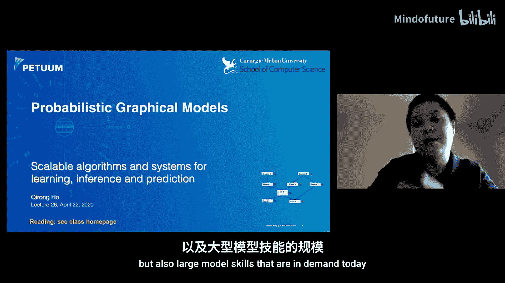
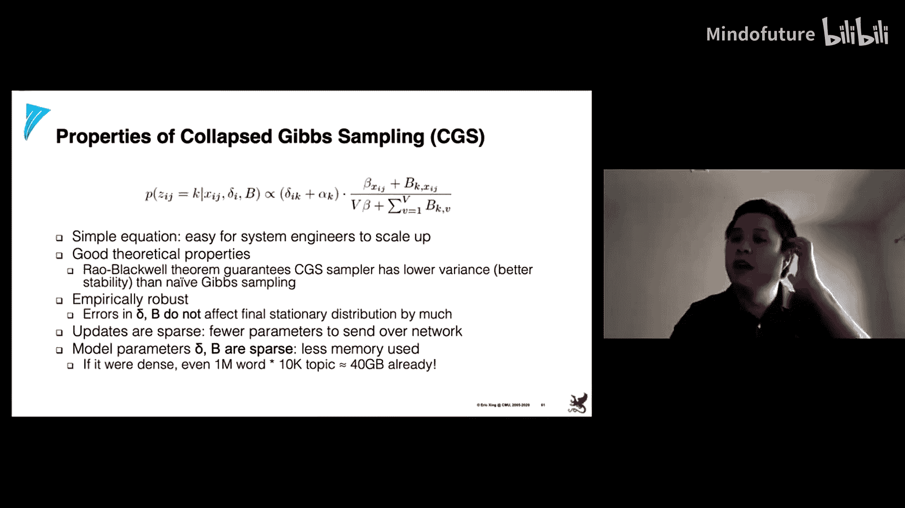
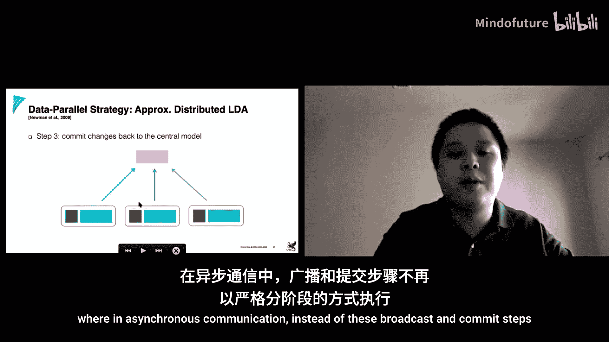
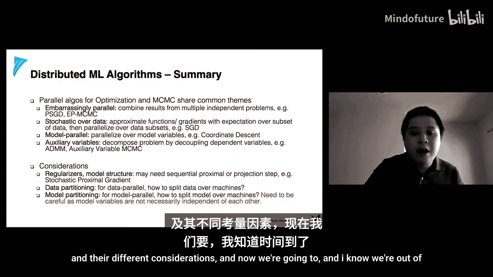
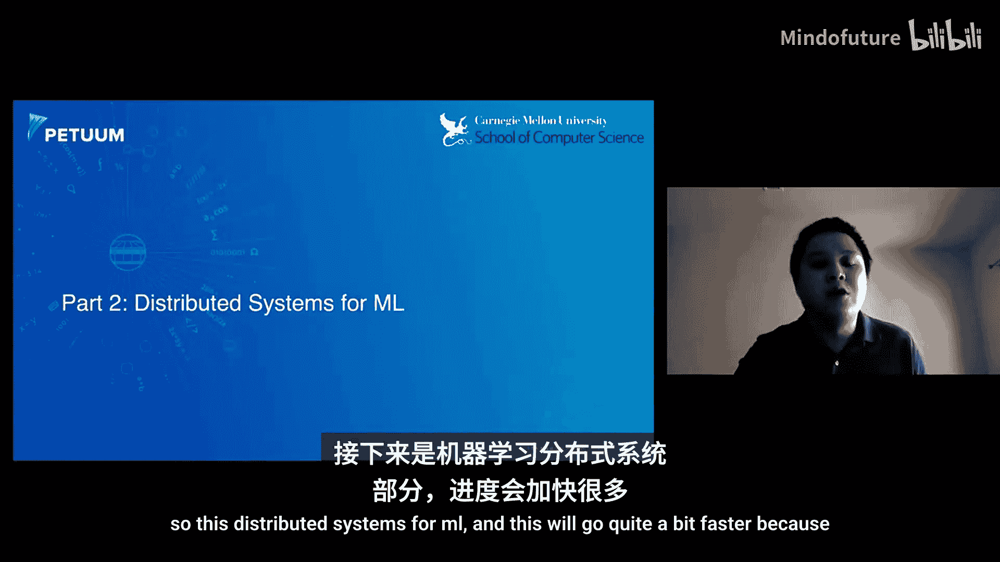
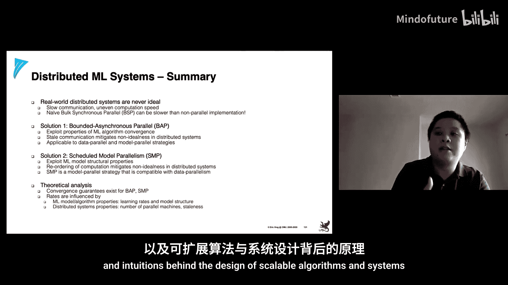

# 026：大规模算法和系统 🚀

在本节课中，我们将要学习如何处理大规模数据和模型。我们将探讨可扩展的算法，以及支持这些算法的软件系统及其设计原则。这些知识将帮助机器学习研究者和实践者将他们的应用扩展到当今所需的大数据和大模型规模。

---

## 概述

我们生活在一个数据爆炸的时代，互联网和物联网设备产生了海量数据。同时，机器学习模型的规模也在持续增长，参数数量常常达到数十亿甚至万亿级别。这带来了巨大的计算和存储挑战。为了应对这些挑战，我们需要设计可扩展的并行和分布式机器学习算法与系统。

---

## 大规模数据与模型的挑战 📊

首先，我们来看看当前面临的挑战。最大的网站每天产生海量数据，分析这些数据所需的计算资源远超学生项目的规模。同时，现代机器学习模型的参数数量常常超过百亿。一个参数通常是一个浮点数（4字节），因此一个百亿参数的模型大小约为40GB。这通常超出了单台机器的内存容量。

此外，还存在**可扩展性挑战**。当我们进行并行或分布式编程时，通常期望使用N台机器能使任务快N倍。然而，由于通信开销的存在，我们往往无法达到理想的线性加速。我们的目标是尽可能接近线性加速。

---

## 机器学习程序的统一视图 🔄

为了应对大数据、大模型和可扩展性挑战，我们需要一些预备知识。我们将从数学角度，以高层次视角来看待机器学习模型和算法。

机器学习程序主要分为两大类：
1.  **概率程序**：例如主题模型和各种贝叶斯图模型，通常通过马尔可夫链蒙特卡洛方法或变分优化/推断方法求解。
2.  **优化程序**：例如经典的回归、分类应用，以及深度学习架构（如卷积神经网络、循环神经网络、Transformer），通常被表述为一个优化问题。

这两类程序之间的界限是模糊的。大多数现代概率程序都包含了复杂的优化函数元素，而任何优化程序都可以通过在某些参数或函数变量上设置先验，轻松地转换为概率程序。

为了以统一的方式思考概率程序和优化程序，我们将它们视为一个**主方程**的一部分，即**迭代收敛**的机器学习算法视图。这意味着算法通过迭代逼近一个解，并且有理论保证它会收敛到某个固定点或最优解。

在这个视图中，我们用 `θ` 表示所有模型参数，用上标 `t` 表示迭代索引。核心更新方程是：
`θ^(t+1) = θ^(t) + ΔF(θ^(t), D)`
其中 `ΔF` 是基于数据 `D` 的参数更新函数。

机器学习程序的一个关键特性是**误差容忍**或**自愈能力**。与传统计算机科学程序不同，机器学习算法在迭代过程中即使引入了一些噪声或错误，通常也能自我纠正，因为它们始终朝着局部最优解的方向收敛。这个特性是许多可扩展机器学习技术的关键基础。

---

## 并行化策略：数据并行与模型并行 ⚙️

有两种通用的策略可以并行化机器学习程序：**数据并行**和**模型并行**。

*   **数据并行**：将数据分割成多个子集，分配给不同的计算设备（如CPU、GPU或机器）。每个设备基于自己分配到的数据子集计算参数更新，然后以某种方式聚合这些更新。
*   **模型并行**：将完整的模型参数分割成多个部分，分配给不同的计算设备。每个设备负责计算分配给它的那部分参数的更新。

选择哪种策略通常很直观，但具体实现时需要考虑很多细节。

---

## 优化算法及其并行化

### 随机梯度下降

许多优化问题可以写成最小化一个期望的形式。在经典的**梯度下降**中，我们计算整个数据集的损失函数梯度，然后更新参数。

**随机梯度下降** 对此进行了修改：我们不是在整个数据集上求和，而是随机选取一个**小批量**样本来计算梯度的经验期望，并用它来更新参数。

使用小批量的好处是：
1.  降低梯度估计的方差，从而可能加快收敛速度。
2.  将多个样本的计算打包成向量操作，在现代CPU/GPU硬件上效率更高，带来**吞吐量加速**。

#### 并行随机梯度下降

最早的并行SGD实现是一种**数据并行**方案：将数据分割给K个工作节点，每个节点在自己的数据子集上独立运行SGD直到收敛，最后将所有节点的参数取平均。这种方法只在开始时和结束时进行通信。

**问题**：不同工作节点可能收敛到基于其数据子集的不同局部最优解。简单地平均这些解并不能保证平均值本身是一个最优解。

#### 改进一：利用稀疏性的Hogwild!算法

许多问题具有**稀疏结构**，即目标函数可以分解为多个子目标，每个子目标只涉及一小部分参数。这在自然稀疏的数据（如用户画像的高维one-hot编码）中很常见。

**Hogwild!算法** 的思路是：每个并行工作节点随机采样一小部分参数，然后只对其中的一个参数执行梯度下降。由于数据稀疏且并行节点不多，不同节点采样的参数发生冲突的概率很低。因此，无需复杂的同步机制（如变量锁）。

**局限性**：在真正的**分布式设置**（多台机器通过网络通信）中，网络延迟比机器内内存访问慢几个数量级。理论分析表明，延迟会增加算法收敛时间的上界，并导致参数估计的方差增大，使结果更不稳定。

#### 改进二：使用参数服务器和有界异步并行

另一种不依赖于目标函数稀疏性的策略是使用**参数服务器**（或键值存储）。你可以将其视为一个中心化的内存库，所有工作节点都可以与之通信。它负责确保所有工作节点对参数有一致的视图，并整合所有更新消息。

参数服务器可以使用几种同步方案：
*   **整体同步并行**：所有工作节点同步进行迭代（如Hadoop/Spark风格）。
*   **完全异步并行**：工作节点无需等待，随时读写参数。
*   **有界异步并行**：这是前两者的折中。它设定一个**停滞界限**（例如3次迭代），规定最快和最慢的工作节点之间的迭代次数不能超过这个界限。最快的节点会被强制等待，直到最慢的节点赶上来。

这种方案结合了整体同步并行的安全性和完全异步并行的效率，通常能获得更好的性能，同时避免算法发散或收敛失控的风险。

---

### 坐标下降法

**坐标下降法** 天然适合**模型并行**实现，因为它将参数空间划分为不同的子集进行优化。其优点是不需要指定学习率，因为每个坐标的优化问题通常可以解析求解。然而，如果数据样本量非常大，每次迭代的时间会很长。

在坐标下降中，我们不是对所有参数求梯度，而是通过将目标函数对单个坐标（或坐标块）的次梯度设为零，来解析地求解该坐标的最优值，然后按顺序（如轮询）更新所有坐标或坐标块。

#### 并行坐标下降法

*   **Shotgun算法**：每个并行工作节点随机选择一组参数进行更新，然后迭代直到收敛。这类似于坐标下降版的Hogwild!。
    *   **保证**：当特征接近独立时，该算法能很好地扩展。可扩展性受限于一个与数据矩阵谱半径相关的公式。如果特征完全相关，则无法获得任何并行加速。
    *   **原因**：当特征相关时，在每个坐标轴上的更新步长会变得很大，容易越过最优点，导致收敛不稳定。

*   **分块坐标下降法**：改进在于不是随机选择坐标，而是对数据矩阵进行**预分区**。将参数划分为多个块，每个工作节点负责一个块内的坐标优化。这保证了不同工作节点处理的参数不会重叠。
    *   **关键**：分区算法应尽量将不相关的参数分到同一个块，以减少块间相关性。
    *   **缺点**：预处理数据（如计算大规模协方差矩阵）的成本可能非常高昂，对于超大数据集不实用。

*   **动态调度的坐标下降法**：系统（如`STRADS`）动态地、实时地决定将哪些参数分配给哪个工作节点。它避免了计算整个协方差矩阵的立方复杂度，只需检查少量参数之间的相关性。此外，它还可以实现**基于优先级的更新**，优先更新对目标函数下降贡献最大的参数，从而获得更陡峭的收敛曲线。

---

### 高级优化技术概览

除了SGD和坐标下降，还有更高级的优化算法，如包含**动量**、**平滑**和**近端更新**的算法，它们能显著提高收敛速度。将这些算法并行化的挑战在于，需要将单机实现的步骤分解为多机环境中可并行和不可并行的部分。

以**近端梯度法**为例，它适用于包含不可微正则化项（如L1惩罚项）的问题。其直观理解是梯度下降的扩展：先对可微部分`F`进行梯度步，然后对不可微的正则化部分`G`应用一个**近端算子**进行“投影”。

在并行化时，工作节点负责计算梯度，服务器负责聚合梯度并执行近端算子和动量更新。这种方法的优劣取决于参数规模，因为近端操作可能计算成本较高。

---

## 马尔可夫链蒙特卡洛算法的并行化

MCMC是另一大类机器学习算法，常用于概率图模型的推断。

### 传统并行MCMC方法

*   **独立运行多条链**：在不同工作节点上独立运行多个MCMC链，最后对样本取平均。如果链的收敛速度慢或未收敛，各链的样本分布可能不重叠，导致平均结果不佳。
*   **序贯重要性采样**：将复杂分布分解为一系列更简单的分布进行采样。但序列越长，样本的方差和不稳定性越大。

### 现代并行MCMC方法

*   **辅助变量法**：通过引入新的辅助变量来重写模型，将复杂的采样过程分解为多个更简单的步骤。虽然模型变得更复杂，但每个步骤更容易采样，从而可以用统计效率换取计算效率，实现并行化。
*   **易并行MCMC**：构造一系列特殊的**子后验分布**，可以在不同机器上独立并行采样。最后通过非参数估计方法（如核密度估计）将这些子后验的样本组合起来，以逼近全后验分布。这种方法比简单平均子后验样本效果更好。
*   **并行吉布斯采样**：对于像主题模型这样的潜变量模型，**折叠吉布斯采样**是一种高效的方法。它通过积分掉一些变量，减少了需要采样的变量数量，从而降低了方差。
    *   **并行化挑战**：直接并行化会导致工作节点读取过时的参数值（**陈旧性**问题），可能影响收敛甚至导致发散。
    *   **解决方案**：
        1.  **异步通信**：减少陈旧性，但可能引入不一致性。
        2.  **智能分区**：将文档-主题矩阵和主题-词矩阵进行分区，确保不同工作节点处理的参数子集不重叠（类似于Hogwild!的思想）。这可以通过图划分或**非重叠矩阵分块**技术实现。后者（如`LightLDA`采用的方法）能保证在采样过程中参数不会冲突，从而实现安全高效的并行化。

---

## 分布式机器学习系统 🖥️

设计算法是一方面，将其部署在真实的分布式系统上又是另一回事。真实的机器并不完美，我们需要了解并围绕这些系统特性进行设计。

### 系统面临的现实挑战

1.  **网络速度慢**：网络通信（微秒/毫秒级）比CPU/GPU内存访问（纳秒级）慢几个数量级。
2.  **机器性能不均**：由于操作系统后台任务、资源共享（如云虚拟机）等原因，相同的机器很少表现出完全相同的性能。

这些因素会极大地影响并行机器学习实现的效果：
*   **最慢工作节点的诅咒**：在整体同步并行中，整个程序的速度会被最慢的节点拖累。
*   **带宽限制**：传输大型模型（如数十亿参数）的更新会消耗大量网络带宽。
*   **内存限制**：数据和模型分区必须适应单机的内存或本地存储容量。
*   **调度影响**：任务调度方式会影响收敛速度和通信量。

### 数据并行与模型并行的系统设计

*   **数据并行**：当数据是独立同分布时效果较好。挑战在于现有方案要么安全但慢（整体同步并行），要么快但有风险（完全异步并行）。**有界异步并行**（SSP）是一个很好的折中，它通过限制最大陈旧性，在保持效率的同时提供了安全保证，并且具有自平衡特性，有助于慢节点追赶。
*   **模型并行**：不能简单地将参数分割。必须精心设计调度方案，以尽可能恢复串行执行的性能。关键挑战包括：
    *   **结构依赖性**：参数之间的相关性（如Lasso回归中特征列的内积）会影响并行化。
    *   **非均匀收敛**：不同参数以不同速度收敛，长尾参数决定了总体收敛时间。
*   **解决方案**：
    *   **结构感知的并行化**：系统动态地、自适应地选择参数进行更新，并基于优先级（如参数变化幅度）进行调度。
    *   **分块调度**：使用非重叠矩阵分块等技术对参数进行分区，确保不同工作节点处理的块不重叠。这样，不同节点的快慢不会相互干扰。
    *   **结合方案**：将分块调度、优先级调度和有界异步并行结合起来，可以创建一个高效、平衡且能克服诸多系统挑战的机器学习系统。

---

## 理论基础与收敛性分析 📐

了解这些分布式机器学习系统在什么条件下收敛，以及收敛速度如何受系统因素影响，是非常重要的。

### 收敛性保证的类型

1.  **期望界**：最弱的保证，表明参数期望值接近最优值。
2.  **概率高置信界**：更强的保证，表明参数以高概率接近最优值。
3.  **方差界**：衡量收敛的稳定性，方差越低，收敛越稳定。

### 有界异步并行的收敛直觉

有界异步并行之所以能收敛，关键直觉在于它**近似于串行执行**。由于设定了停滞界限，在任何时刻，由并行执行可能引入的“错误窗口”大小是有限的（与停滞界限和节点数相关）。随着迭代次数增加，这个有限错误窗口的影响相对于已完成的总工作量变得越来越小。这是一种**部分但有界的串行性损失**。而完全异步并行则无法保证这个窗口的大小，因此在存在慢节点时可能发散。

理论分析给出了具体的收敛界，其中包含了模型性质（如Lipschitz常数）和系统性质（如并行节点数、平均停滞时间、停滞时间方差）。这些公式清晰地展示了系统和算法参数之间的相互作用。

类似的理论分析也可以扩展到模型并行、基于优先级的调度和分块调度等策略，证明它们在合理条件下是收敛的，并且能接近理想模型并行的性能。

---

## 总结 🎯

本节课我们一起学习了大规模机器学习算法与系统的核心内容。我们首先了解了处理大数据和大模型所面临的挑战，并建立了迭代收敛的机器学习算法统一视图。

我们深入探讨了两种主要的并行化策略：
*   **数据并行**：重点学习了随机梯度下降及其并行化方案，从朴素平均到利用稀疏性的Hogwild!，再到基于参数服务器和有界异步并行的稳健方案。
*   **模型并行**：重点学习了坐标下降法及其并行化，从随机选择的Shotgun算法到需要预分区的分块坐标下降，再到更实用的动态优先级调度系统。

接着，我们探讨了另一大类算法——马尔可夫链蒙特卡洛方法的并行化，涵盖了从传统方法到现代辅助变量法、易并行MCMC和并行吉布斯采样（如LightLDA）等技术。

然后，我们将视角转向真实的**分布式系统**，认识到网络延迟和机器性能不均等现实约束如何影响算法设计。我们讨论了数据并行和模型并行在系统层面上的挑战与解决方案，特别强调了有界异步并行、智能调度和分块技术的重要性。

最后，我们简要介绍了支撑这些系统设计的**理论基础**，了解了收敛性分析的不同类型，以及有界异步并行等工作机制背后的理论直觉。

通过本课程，希望你能够掌握设计可扩展机器学习算法与系统的关键概念和直觉，为应对现实世界中的大规模机器学习挑战做好准备。