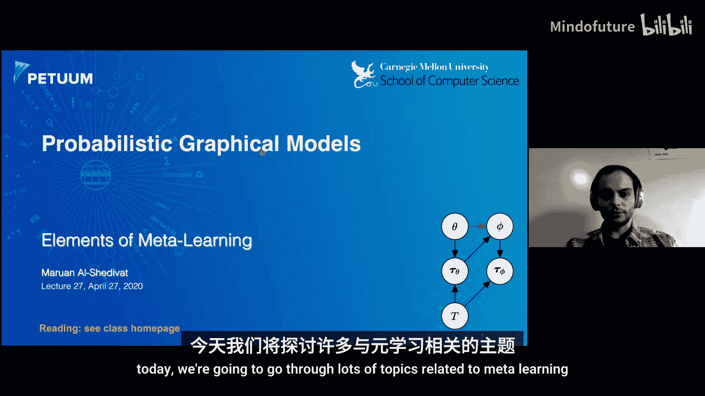
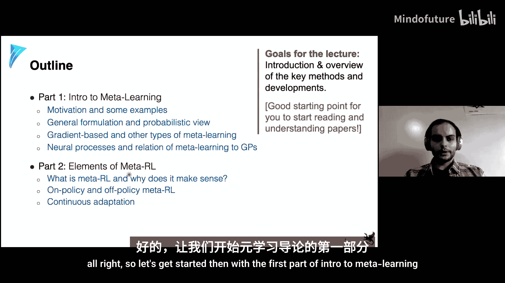
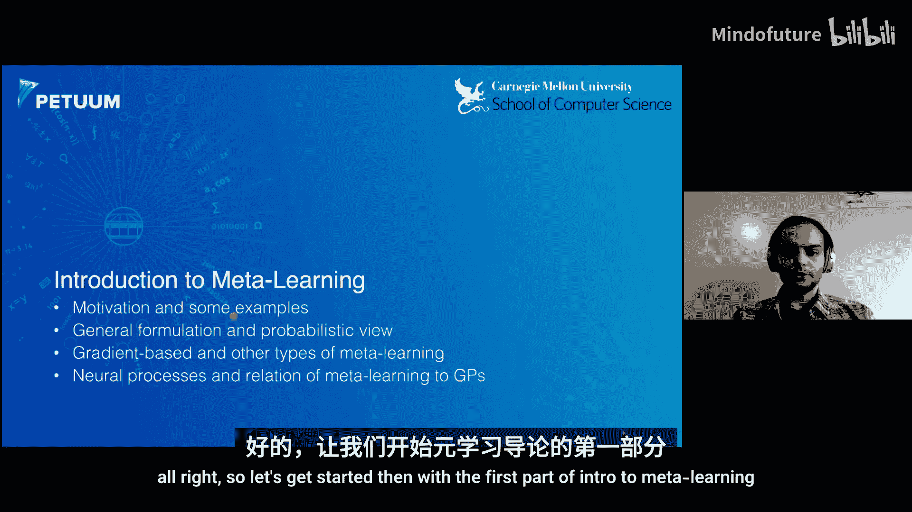
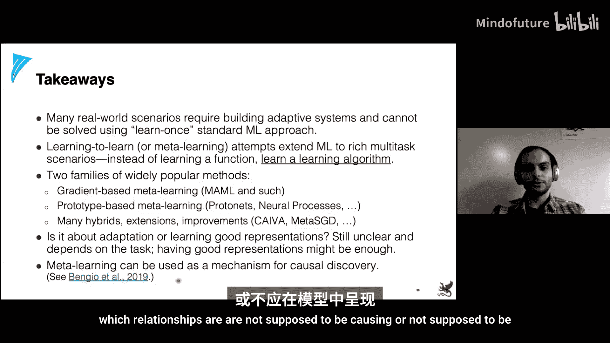
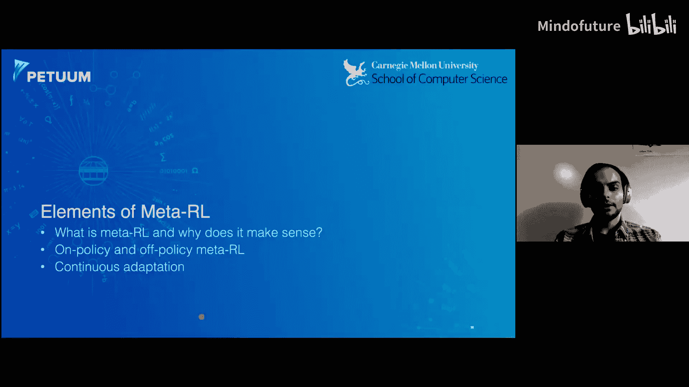
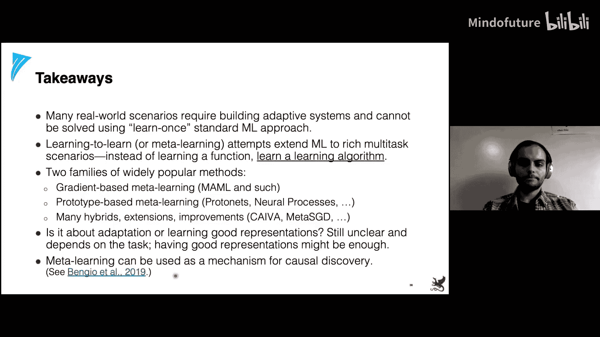
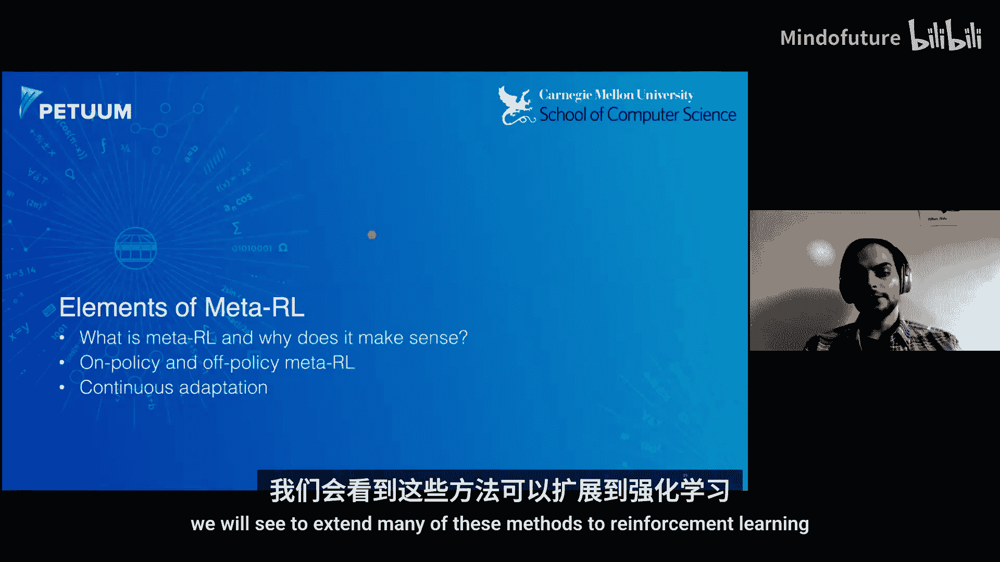
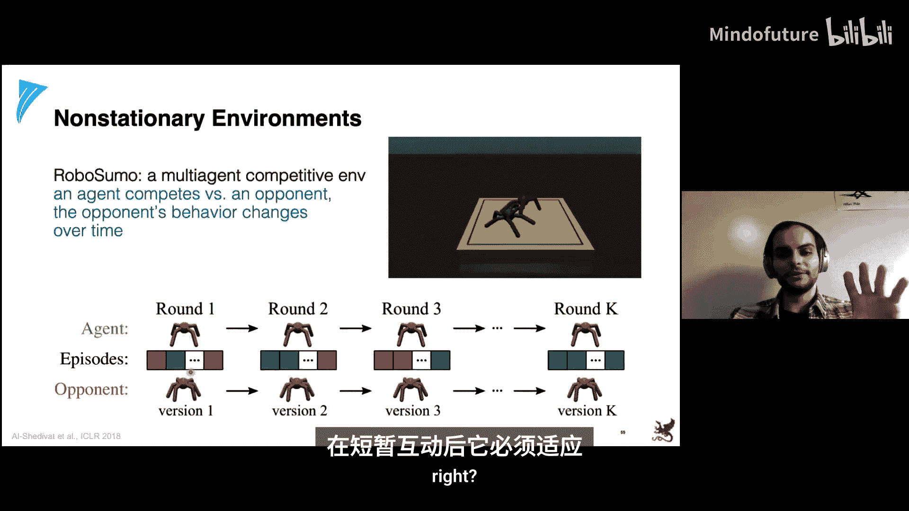
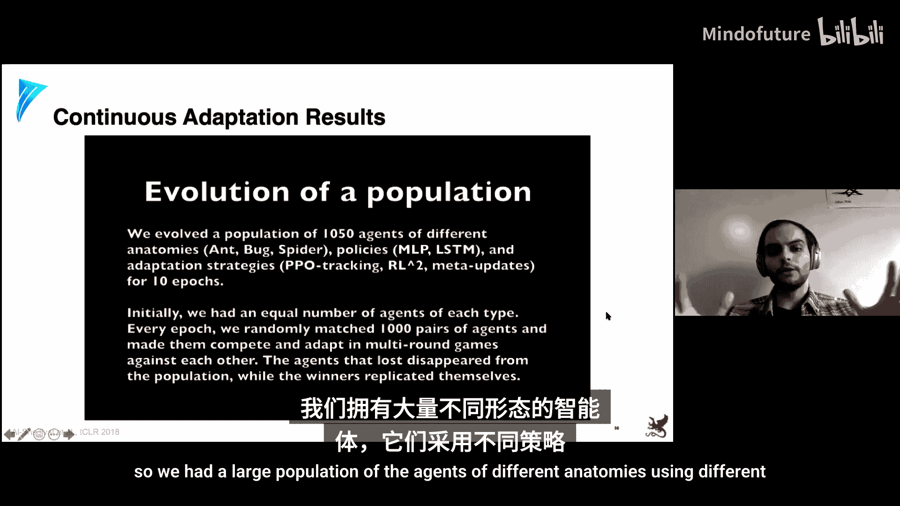
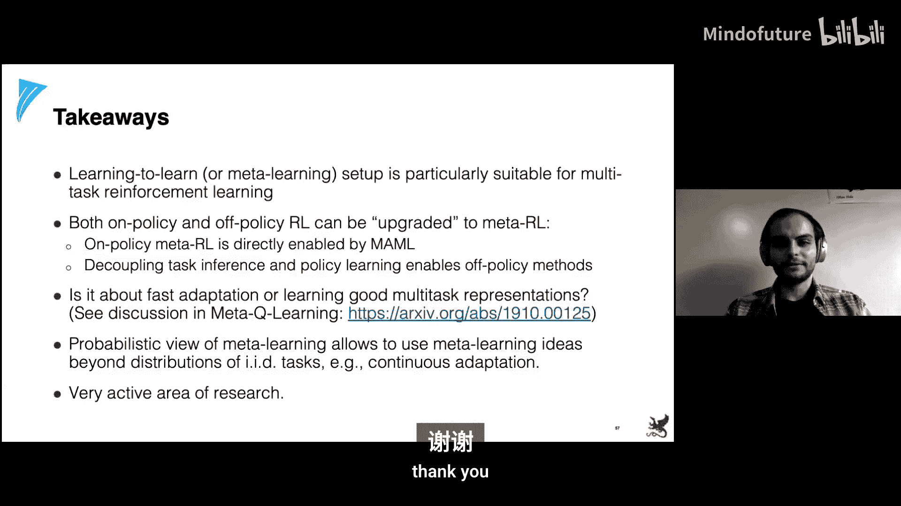

# 027：元学习入门与元强化学习 🧠







在本节课中，我们将要学习元学习的基本概念、核心方法及其在强化学习中的应用。元学习，即“学会学习”，旨在让模型能够快速适应新任务，这对于处理动态、非平稳或数据稀缺的现实世界问题至关重要。

## 第一部分：元学习导论

上一节我们介绍了课程背景，本节中我们来看看元学习的正式定义和动机。

### 什么是元学习？

在标准机器学习中，我们通常从一个数据集中学习一个单一的模型。然而，在许多现实场景中，任务本身是动态变化的，或者我们只有少量数据来学习新任务。元学习通过“学习如何学习”来解决这个问题，其核心思想是学习一个能够快速适应新任务的算法或“适应规则”。

更形式化地说，标准学习的目标是学习一个函数 **f**，以最小化在某个任务数据分布上的期望损失。而在元学习中，我们考虑一个任务分布 **p(T)**，每个任务 **T_i** 本身又是一个数据分布 **p_i(x, y)**。我们的目标是学习一个适应规则 **G**，它能够根据新任务的少量描述（例如，几个样本）生成一个适用于该任务的函数 **f_i**。

元学习的优化目标可以表述为一个双层优化问题：
```
min_θ E_{T_i ~ p(T)} [ L_{test}( f_i = G(θ, D_i^{train}) ) ]
```
其中，内层优化是适应过程（例如，在训练数据 **D_i^{train}** 上微调），外层优化是寻找最优的元参数 **θ**，使得在所有任务上的测试损失 **L_test** 最小。

### 为何需要元学习？

标准机器学习在静态、定义明确的任务上取得了巨大成功，例如ImageNet图像分类或围棋游戏。然而，在复杂动态的世界中（如自动驾驶、个性化推荐系统、交互式机器人），环境和任务本身可能不断变化，或者每个用户/任务只有极少量的数据。元学习为解决这类问题提供了一个框架，旨在让智能体能够持续学习和适应。

### 小样本分类：一个经典示例

小样本分类是理解元学习的经典测试平台。在这个设置中，每个任务（例如，一个分类数据集）只有极少的标记样本（如每个类别1或5个样本），称为“支持集”。模型需要利用这些少量样本快速学习，并对新的查询集样本做出准确预测。元学习的目标是学习一个模型，使其在大量此类任务上平均表现良好。

以下是元学习的一些实际应用场景：
*   **推荐系统冷启动**：为新用户提供个性化推荐，但只有该用户的少量历史数据。
*   **低资源机器翻译**：在平行语料稀缺的语言对之间进行翻译。
*   **小样本视频到视频翻译**：根据一个短片段，将一个人的面部动作迁移到目标图像（如蒙娜丽莎）上。
*   **模仿学习**：让机器人通过观看单次演示就能学会新技能。

## 第二部分：基于梯度的元学习方法

上一节我们定义了元学习问题，本节中我们来看看第一类主流方法：基于梯度的元学习，其代表是模型无关元学习。

### MAML：模型无关元学习

MAML的核心思想非常简单：学习一个良好的模型参数初始化点 **θ**，使得对于任何新任务，从这个初始化点出发，只需经过少量梯度更新步骤，就能达到对该任务较好的性能。

具体算法如下：
1.  **元训练**：从任务分布中采样一批任务。
2.  **内层循环（适应）**：对于每个任务 **T_i**，用其支持集数据计算损失，并对初始化参数 **θ** 执行一步（或多步）梯度下降，得到任务特定参数 **φ_i**：
    `φ_i = θ - α * ∇_θ L_{T_i}^{train}(f_θ)`
3.  **外层循环（元更新）**：使用每个任务对应的查询集数据，计算任务特定参数 **φ_i** 的损失。然后，通过梯度下降更新元参数 **θ**，目标是最小化所有任务上查询集损失的平均值：
    `θ ← θ - β * ∇_θ Σ_i L_{T_i}^{test}(f_{φ_i})`
    由于 **φ_i** 是 **θ** 的函数，此更新涉及二阶梯度计算。

**直觉**：MAML寻找的初始化点 **θ**，是一个能够通过梯度更新快速抵达各个任务最优解附近的“枢纽”。

### MAML的概率视角

MAML可以自然地解释为一个层次贝叶斯模型：
*   **外层**：元参数 **θ** 作为所有任务共享的先验。
*   **内层**：对于每个任务 **T_i**，其特定参数 **φ_i** 是从以 **θ** 为条件的分布中生成的。在MAML中，这个条件分布被具体化为一个梯度步骤。
*   **预测**：数据由任务特定参数 **φ_i** 生成的模型产生。

因此，元学习（学习 **θ**）对应于学习一个先验，而适应（计算 **φ_i**）对应于在该先验下进行后验推断。

### 性能与讨论

MAML在Omniglot和MiniImageNet等小样本分类基准上取得了显著提升，相比简单的预训练-微调基线有巨大优势。然而，后续研究（如ANIL论文）发现，在许多基准任务上，模型性能的提升主要来自于在元训练阶段学到的**通用特征表示**，而内层循环的**梯度适应**对最终性能的贡献可能比预期要小。这表明表示学习在元学习中可能扮演着至关重要的角色。

## 第三部分：基于度量/原型的元学习方法

上一节我们介绍了基于梯度的方法，本节中我们来看看另一类直观且强大的方法：基于度量或原型的方法。

### 原型网络

原型网络的核心思想是：为每个类别学习一个原型向量（prototype），分类时只需计算查询样本与各个原型之间的距离。

算法步骤如下：
1.  **嵌入**：使用一个嵌入函数（如神经网络）将每个支持集样本映射到一个嵌入空间。
2.  **计算原型**：对每个类别，计算其所有支持集样本嵌入的均值，作为该类别的原型向量 **c_k**：
    `c_k = (1/|S_k|) Σ_{x_i ∈ S_k} f_φ(x_i)`
3.  **分类**：对于一个查询样本 **x**，计算其嵌入与每个原型之间的负欧氏距离（或其它距离），然后通过softmax产生分类分布：
    `p(y=k | x) = exp(-d(f_φ(x), c_k)) / Σ_{k'} exp(-d(f_φ(x), c_k'))`









**元训练**：通过优化嵌入函数 **f_φ** 的参数 **φ**，使得在所有元训练任务上，查询集的分类损失最小。

### 为何有效？

原型网络非常简单，但它通常能取得与MAML相媲美甚至更好的性能。这再次强调了学习一个**良好的嵌入空间**对于快速适应的重要性。在这个空间中，同类样本聚集，异类样本分离，因此即使只有少量样本，也能通过最近邻或原型比较进行可靠分类。

### 与高斯过程的关系

元学习（学习函数分布）的思想与高斯过程有深刻的联系。高斯过程通过核函数定义函数空间上的先验，给定观测数据后，可以推断出后验预测分布。类似地，元学习旨在从数据中学习一个“先验”（或适应规则），使其能够快速推断出新任务对应的函数。一些方法（如条件神经过程）显式地借鉴了这种思想，用神经网络替代核函数，以更灵活地建模复杂函数分布。

## 第四部分：元强化学习

上一节我们探讨了监督学习中的元学习，本节中我们将其扩展到序列决策问题，即元强化学习。

### 元强化学习问题设定

在元强化学习中，任务分布 **p(T)** 对应于环境分布。每个环境 **T_i** 可能在动力学模型、奖励函数或二者上有所不同。目标是学习一个**元策略**或**策略更新规则**，使得智能体在面对新环境时，仅需少量交互轨迹就能快速调整其策略，获得高回报。

### 基于MAML的元强化学习

将MAML直接应用于RL是直观的：
1.  用元参数 **θ** 初始化策略。
2.  **内层适应**：在新环境 **T_i** 中，用当前策略收集轨迹，计算策略梯度，更新得到任务特定策略参数 **φ_i**。
3.  **外层元更新**：用适应后的策略 **φ_i** 在环境中收集新轨迹，计算回报，并以此损失通过梯度下降更新元参数 **θ**。

这保持了MAML的“通过梯度更新进行适应”的核心思想，但样本效率可能较低，因为需要在线收集两轮轨迹（适应前和适应后）。

### 基于隐变量推断的元强化学习：PEARL

PEARL是一种更高效的非策略元强化学习方法。其关键思想是显式地学习一个**任务推断网络**，将智能体与环境交互的历史（上下文）编码为一个隐任务表征 **z**。

主要组件：
1.  **任务推断网络 q_Φ(z | c)**：将上下文 **c**（如过去的(state, action, reward)序列）编码为隐变量 **z**，近似任务的后验分布。
2.  **策略 π_θ(a | s, z) 和 Q函数 Q_θ(s, a, z)**：策略和Q函数都以外在的隐任务表征 **z** 为条件。
3.  **非策略训练**：数据被存储于经验回放池中。训练过程交替进行：
    *   优化策略和Q函数，以最大化依赖于 **z** 的RL目标（如SAC的目标）。
    *   优化任务推断网络，以最大化证据下界，其重构项与Q函数的贝尔曼误差相关联。

**优势**：PEARL实现了非策略学习，可以重复利用所有收集到的经验，样本效率远高于基于MAML的在线方法。它明确地将“任务识别”（通过 **z**）与“策略学习”分离开来。

### 处理非平稳环境与持续适应



现实世界常常是非平稳的，任务会随时间连续变化（例如，对手在不断学习）。我们可以将这种连续的任务序列建模为图模型，其中任务 **T_t**、策略参数 **φ_t**、轨迹 **τ_t** 随时间相互依赖。



在这种情况下，元学习的目标变为学习一个**持续适应规则**，使得策略能够从一个任务快速适应到下一个相关的任务。这可以通过修改MAML类算法的目标来实现，使其不仅适应当前任务，还要为下一个可能到来的任务做好准备。这种方法在竞争性多智能体环境（如机器人足球）中显示出优势，智能体需要适应能力不断进化的对手。

## 总结与要点 🎯

本节课中我们一起学习了元学习的核心思想与方法。

*   **元学习框架**：通过双层优化，学习一个可快速适应新任务的“学习算法”。
*   **两类核心方法**：
    *   **基于梯度的方法（如MAML）**：学习良好的参数初始化。
    *   **基于度量/原型的方法（如原型网络）**：学习良好的特征嵌入空间。
    *   研究表明，学习强大的**共享表示**往往是性能提升的关键。
*   **元强化学习**：将元学习应用于RL，让智能体快速适应新环境。
    *   **在策略方法**：可基于MAML，但样本效率低。
    *   **非策略方法（如PEARL）**：结合任务推断与RL，样本效率高，性能出色。
*   **持续元学习**：将任务视为时间相关的序列，学习在非平稳环境中持续适应的能力。
*   **概率视角**：元学习可以统一理解为层次贝叶斯推断，这为扩展和设计新算法提供了强大的框架。




元学习是一个快速发展的领域，它为构建能够持续学习、适应复杂动态世界的智能系统迈出了重要一步。