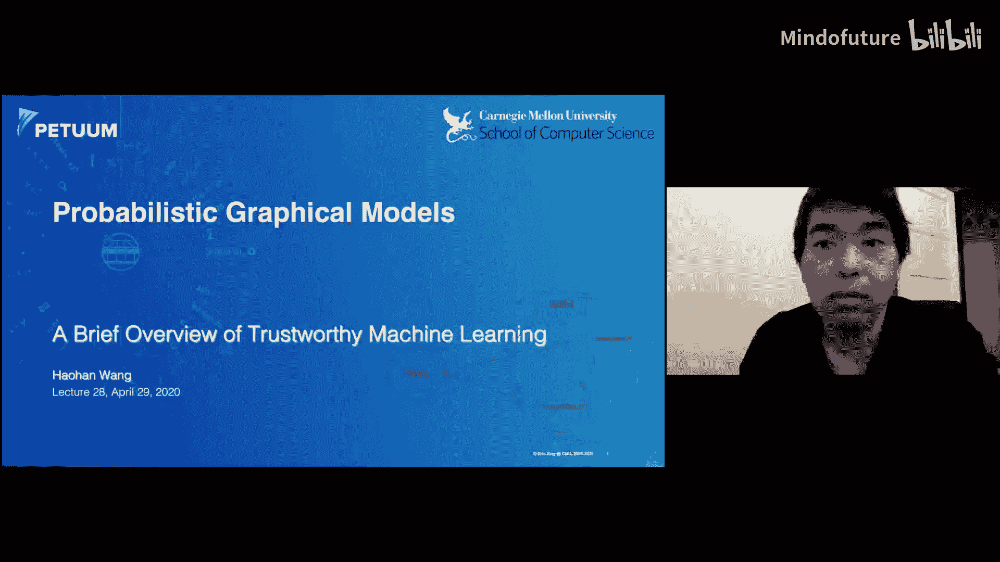
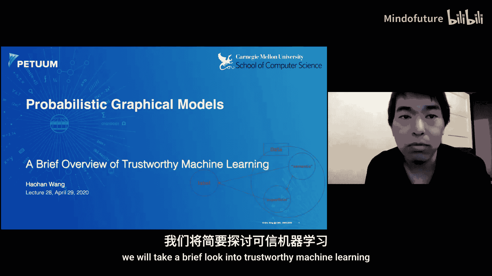
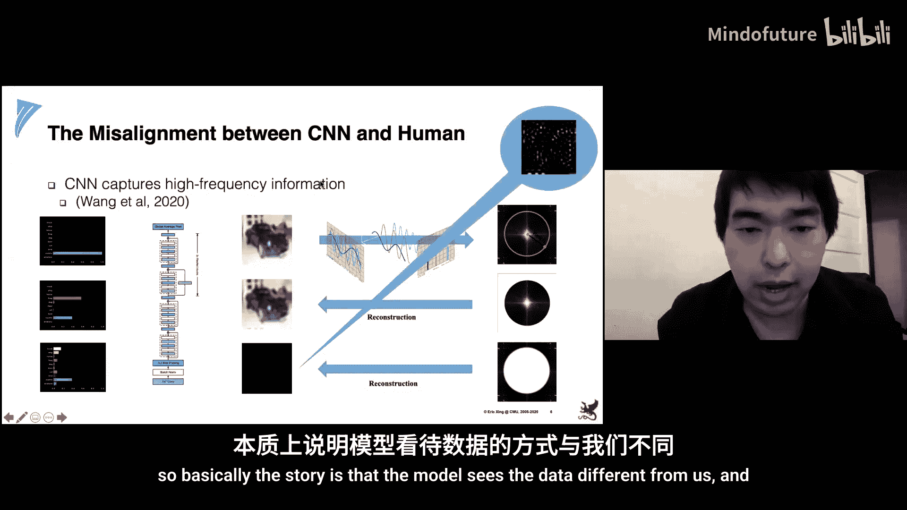
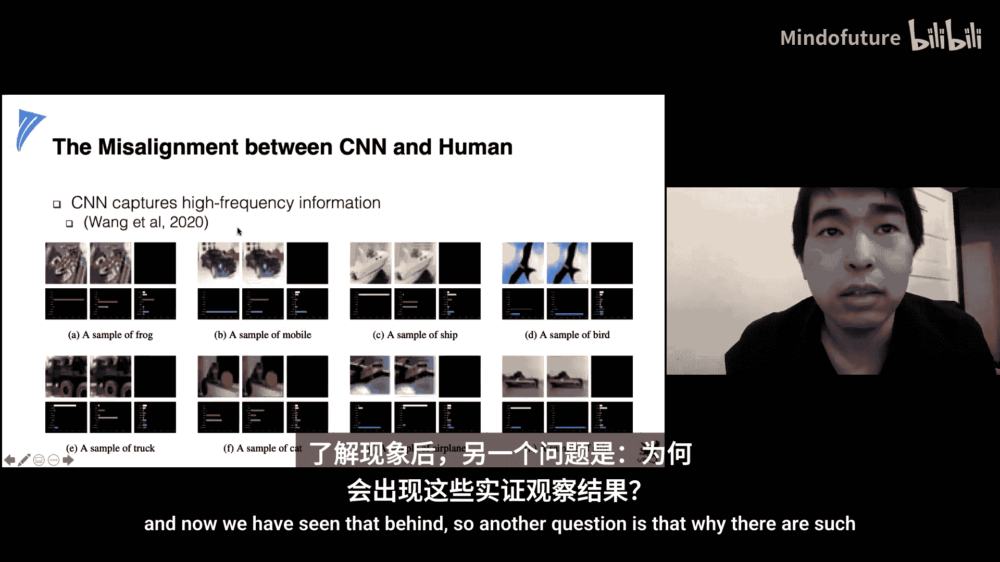
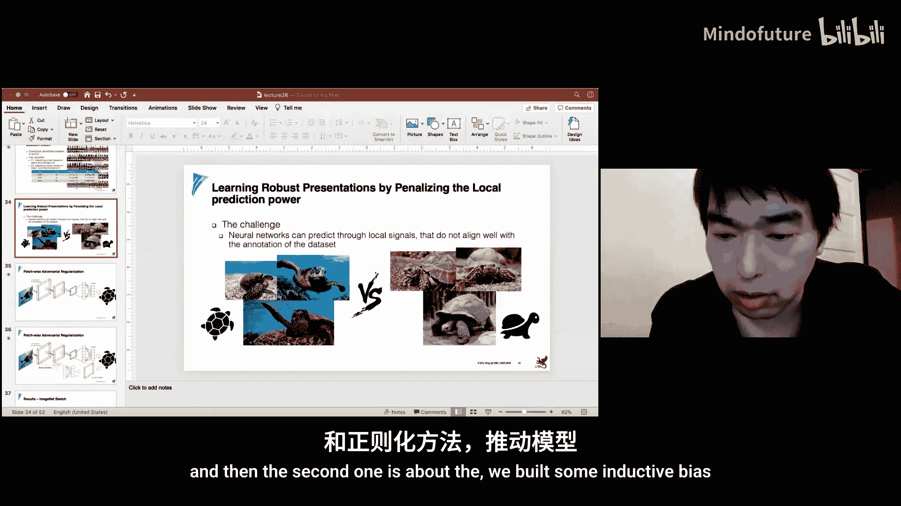
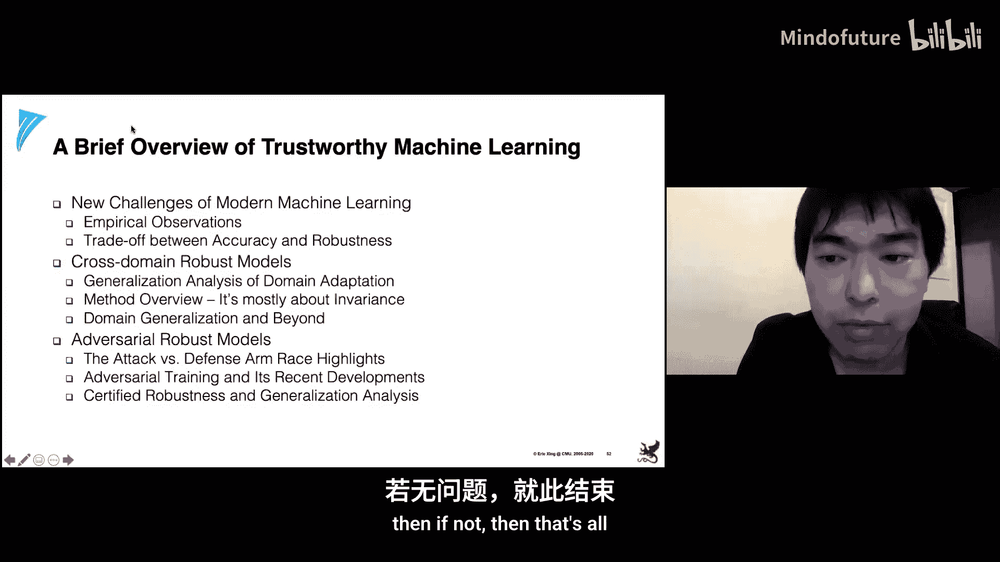

# 028：可信机器学习 🛡️

在本节课中，我们将学习可信机器学习这一重要且前沿的研究主题。我们将探讨现代机器学习模型面临的新挑战，理解模型准确性与鲁棒性之间的权衡，并深入分析两个关键领域：跨域鲁棒性（领域自适应）和对抗鲁棒性。课程最后将对所学内容进行总结。

---

## 概述

大家好，我是Hao Han。在本次课程中，我们将简要探讨可信机器学习。作为本学期的最后一讲，我们将了解为什么可信机器学习是当今最重要的研究课题之一，并回顾一些相关的实证观察。我们还将涉及准确性与鲁棒性之间的权衡问题。

随后，我们将深入探讨两个与可信性相关但历史上被分开研究的主题：跨域鲁棒模型（通常称为领域自适应）和对抗鲁棒模型。我们会介绍一些看起来非常神奇的研究结果。

---

## 现代机器学习的新挑战

首先，让我们思考一个问题：如果我说我们可以从你的基因组中预测你是否使用筷子，你会怎么想？

虽然出于显而易见的原因，这个研究课题并不被推荐，但如果有人真的去调查数据，他们很可能会发现一个名为HLA-A1的基因与是否使用筷子的行为高度相关。然而，这种基因与使用筷子行为之间的关联，仅仅是因为该基因在东亚血统的人群中出现频率更高。

类似地，在另一项讨论中，人们表明，如果我们不能正确处理数据的本质，我们也可能识别出一些与英语技能相关的基因。这听起来同样不正确。

这些问题也可以归入可信机器学习的范畴。我们需要确保从统计模型中学到的东西与现实世界场景良好对齐，而不是仅仅因为数据本质而存在的虚假信号。

可信机器学习的问题甚至可以追溯到更早。这里我只列出了我非常熟悉的参考文献。正如你所见，即使是我熟悉的参考文献，也已经是20年前的了。因此，虽然可信机器学习是当今的热门话题，但它已经被研究了数十年。

我还想评论一下这种差异：为什么可信机器学习如今如此受重视？它是一个已经存在了数十年的主题。以前，它是在“发表偏倚”和“误用”等术语下讨论的，即使用简单的统计工具来识别与人类某些特征（如疾病）相关的基因。大约二三十年前，当社区意识到这些简单模型实际上可以通过识别候选基因来加速生物学研究时，我们进入了这个领域。很快，人们发现这些模型的一个局限性是它们可能会识别出虚假信号。在我看来，正是这些方法的现实世界需求，驱使我们研究这些模型的可信度。

但是，在那个时候，虽然我们也有关于机器学习的可信性研究，但机器学习仍然主要处理数百个带有提取特征的样本。因此，如果你想在现实世界场景中应用这些机器学习模型来真正改善人们的生活，仍然相当困难。

然而，现在深度学习将我们带入了一个非常不同的时代。几乎任何看过一些教程的人都可以开始构建深度学习模型，用大量数据训练它，并使用该模型进行预测。这些预测在不同的应用场景中正在改变我们的世界。因此，在我看来，这些模型的现实世界需求再次驱使我们研究它们的可信度。这就是为什么可信性是当今最有趣的研究课题之一的原因。

现在，让我们深入探讨这个时代的问题。深度学习在准确性方面取得了非常令人印象深刻的实证结果，但我们也看到了一些挑战。

最突出的模型可信度例子可能就是下面这个。我相信这个图非常流行，以至于每个相关主题的介绍都可能需要使用它作为例子。但以防你不清楚背后的故事，这个图基本上说明：对于一个训练有素、能给出相当高准确率的神经网络（例如，它以大约60%的置信度预测这张图片为熊猫），如果我们向图像添加一些人眼几乎无法察觉的噪声，我们就可以显著地改变模型的预测。现在，对于人眼看起来几乎相同的图像，模型预测它是别的东西。

这是另一个例子。这个例子相对较新。它基本上讲述了一个故事：如果我们结合图像的两个元素，比如生成一个具有大象纹理和猫形状的图像，神经网络很可能偏向于根据图像的纹理进行预测，而人类则主要根据形状来判断图像。

这里还有我们最近观察到的一项实证结果。首先，我们在CIFAR-10数据集上训练一个ResNet网络，然后取一张图像，将其输入模型，并生成置信度分布（这是来自测试集的）。然后，我们将该图像映射到其频域（通过傅里叶变换）。我们选择一个半径，将频域切割成高频部分和低频部分。然后，用这两个频率分量，我们重建那些图像。正如我们所见，从低频分量重建的图像在人眼看来仍然与原始图像相似，而从高频重建的图像基本上是噪声。

如果我们将这两张图像放回模型，会发生以下情况：模型将低频图像预测为与原始标签不同的东西，但模型仍然将高频重建图像预测为与原始标签相同。如果你有兴趣看看高频重建图像中有什么，这里有一个红色版本的高频重建图像。我们可以看到它基本上是噪声，但模型仍然能够识别它。

所以，基本上，这个故事是：模型看待数据的方式与我们不同。这不仅仅是10,000张CIFAR-10测试图像中的一张，我们识别出了其中的几百张。因此，虽然这种情况不会发生在所有测试图像上，但我认为几百张是一个相当大的数字，应该引起警惕。

现在，我们已经看到了这些实证观察。另一个问题是：为什么会出现这些实证观察？

我们认为，现代机器学习的核心问题之一是模型与人类看待数据的方式不一致。让我们考虑机器学习的场景：我们使用一些带有标签的数据来训练模型。在数据中，我们有一些我们称之为“语义”的信号，以及剩余的那些我们称之为“表面”的信号。语义信号描述了人类或自然界如何理解标签、如何定义标签。这是我们希望模型学习的信号。

然而，在有限的数据收集中，很可能存在语义信号和表面信号之间特定于分布的关联。这种关联导致表面信号和标签之间存在一些相关性。然后，当我们用一些数据训练模型时，模型基本上被要求优化损失函数，以利用任何它可以利用的信号来减少训练误差。模型并不真正区分这两种信号，导致它会利用任何它能利用的东西，而它从表面信号源获取的任何信号都会导致我们稍后将看到的鲁棒性问题。

因此，我们认为这是核心问题。这张图将作为我们今天讲座的一个非常基础的图示。

到目前为止有任何问题吗？

---

## 准确性与鲁棒性的权衡

有了那张图，让我们看看如何理解准确性和鲁棒性之间的权衡。首先，任何关于准确性和鲁棒性之间权衡的讨论都取决于鲁棒性的定义。但大致上，我们可以从这张图来理解：模型将利用任何它可以利用的信号来减少训练误差。因此，直观上，我们所能理解的报告准确性，来自于模型获取的两种信号。

然而，鲁棒性能（虽然此刻尚未定义）很可能主要依赖于这种语义信号。例如，在大多数讨论鲁棒性的文献中，基本上谈论的是在数据发生微小变化时，模型的预测不会改变。而“微小”变化通常是指扰动后的数据仍然能被人类识别，这意味着如果模型与人类的识别良好对齐，通常就被认为是鲁棒的。

那么，如果鲁棒性依赖于这个信号源，就留给我们这个信号源作为权衡点。例如，在定义范围内，捕获表面信号通常比捕获鲁棒信号容易得多。因此，如果我们想达到最先进的准确率，一个直接的方法就是尽可能多地利用这些信号。这导致了一种情况：如果我们想获得高准确性，我们可能必须捕获大量这些信号。然后，这导致模型自然就不那么鲁棒。

如果你对正式的讨论感兴趣，我这里引用了一些。它们通常是在一些鲁棒性定义下，将我们刚刚讨论的故事形式化。

现在我们说准确性和鲁棒性之间存在权衡。那么，当我们已经拥有准确性时，为什么还必须重视鲁棒性呢？

这里我想通过学术界和工业界之间的差异来说服你。当前学术界在机器学习方面擅长的是：我们通常在一个充满某个任务数据的世界中，当我们尝试进行一些实验时，我们通常收集数据并将其分成训练集和测试集，然后在训练数据集上构建模型，并在测试集上测试，如果效果良好，那么我们基本上可以得出结论：我们有一个表现良好的模型。

然而，现实世界需要的是：在这个世界中，我们收集一个数据集，在上面训练一个模型，证明它在这里效果良好，我们还需要证明它在任何其他地方对于相同的任务都效果良好，这样我们才能安全地将其部署到现实世界。

---

## 解决方案的高层抽象概念

现在，为了结束概述部分，让我们讨论一个关于解决方案的非常高层抽象的概念。

再次强调，由于模型获取表面信号是今天我们要处理的核心问题，那么核心解决方案应该由此启发。既然主要问题是模型获取了表面信号，那么主要解决方案就是我们需要切断这一点。

作为一个非常高层的解决方案，我们需要在非常高的层次上总结机器学习。机器学习基本上都是关于泛化的。如果你回忆一下机器学习的介绍，一个假设的期望风险通常由该假设的经验风险以及假设空间复杂度和样本数量的某个函数来界定。

通常，为了控制泛化，一方面我们需要控制经验风险，另一方面是关于假设空间复杂度和我们使用的样本数量。

正如我们稍后将在这些讨论的两个独立分支中看到的那样，跨域鲁棒性完全是关于新的假设空间，或者换句话说，完全是关于新的归纳偏置，或者你可以利用什么样的正则化。

而在对抗鲁棒性领域，虽然有各种各样的解决方案，但当今主导的、效果非常好的解决方案，通常是关于增加样本数量。在今天的讲座中，我们只会讨论遵循这一趋势的解决方案，但它们无论如何都是最好的。

这就是概述部分。我有任何问题吗？如果你们有任何反馈想提的话。

---

## 跨域鲁棒性：领域自适应与泛化

现在，让我们深入第一个主题：模型的跨域鲁棒性，我们将讨论领域自适应、领域泛化等。

首先，我们来谈谈领域自适应。它通常用这句话来介绍：它研究模型在一个分布或领域上训练，但在另一个分布或领域上测试的问题。通常，这另一个分布或领域的特点是“相似但不同”。大部分工作是关于实证研究的，所以我们并没有真正定义这个“相似但不同”，但我希望它应该能直观地理解。

在领域自适应的范畴内，我们主要有两个不同的类别：有监督领域自适应和无监督领域自适应。

有监督领域自适应研究的问题是：测试分布中的带标签样本在训练期间也可用。例如，如果我们想构建一个狗与猫的分类器，我们有这些照片，我们尝试将模型适应到这些草图结果，并尝试评估这个模型是否真正理解了狗和猫的概念。有监督领域自适应通常遵循这样的设置：我们有这些狗和猫的照片集合，我们也有一些这些狗和猫草图的小集合。

然后，很自然地会有一个后续：无监督领域自适应。在无监督领域自适中，只有测试分布中的无标签样本在训练期间可用。我认为当我们谈论领域自适应时，这更常是我们谈论的场景。所以，如今大多数领域自适应工作都在谈论无监督领域自适应，尤其是在计算机视觉领域。

既然我们现在看到问题出现在一些新的机制中，即存在分布差异，那么这些模型的泛化行为可能已经改变。首先，由于我们现在有两个分布，例如，非常直观地，我们可以看到在前一张幻灯片的例子中，如果我们想构建一个关于股票与现金的分类器，并希望泛化到草图。相当直观的是，如果模型真的学到了概念，它就能做得很好，对吧？从某种意义上说，照片和草图之间的分布仍然彼此接近。

但这可能并不总是正确的。例如，如果我们想在地球上的狗和猫上构建一个模型，然后尝试泛化到某个外星世界，那里也许所有的动物都有六条腿呢？

首先，我们需要有一个好的度量来衡量两个分布之间的差异。这里我们介绍这种H散度。它是给定一个假设类下两个分布的度量，它依赖于我们需要首先介绍的这个项I_H。它是那些对于领域是特征函数的假设集合，这意味着对于任何样本，如果它来自感兴趣的领域，假设返回1。

然后，H散度在数学上定义如下：它是这个假设类中，在这些特征函数下样本最大差异的假设。这可能会引起一些困惑。但我们可以直观地理解：H散度是假设空间内的假设所能识别的最大差异。或者为了帮助理解这个术语，假设我们的假设类限制性很强，所有假设都返回某个常数给定数据，那么这个散度将是0，因为它们总是返回相同的东西。所以，对于一个非常有限的假设，我们无法真正区分这两个分布。

如果假设表达能力很强，那么它应该能很好地描述这两个分布。那么这个散度项可能很大。但即使假设空间很大，如果这两个分布是相同的，那么结果仍然是一个小项。

因此，综合上述讨论的场景，我们可以说这个散度既是假设空间的属性，也是源分布和目标分布的属性。

这里是关于这两个分布的描述，然后他们还表明，它可以从有限样本中估计，并带有相应的界。其中，这是这两个分布正确样本的散度，它界定了带有一些集中项的散度。

然后，这个来自有限样本的散度可以用一个领域分类器来估计。我希望这对我们大多数人来说看起来很熟悉。虽然这项工作是在2010年提出的，但由于GAN的流行，这类事情现在对我们来说应该相当熟悉了。它基本上是说：为了估计两个分布的经验散度，我们可以简单地构建一个分类器，并让分类器对来自两个领域的样本进行分类。

然后，有了这些结果，再加上一些更技术性的术语，我们可以得到这个非常流行的领域自适应泛化界。

它来自2010年的这篇论文，基本上说：这里的等式表明，目标分布的期望风险受限于源分布的期望风险，加上这两个分布的散度项，以及这个λ。其中，λ表示在源分布和目标分布上最优假设的误差。

我们需要注意，这也是期望风险，所以不同于我们看到的大多数泛化界。然而，用经验风险加上另一个集中项来重写这个应该相当简单。

那么，基本上，这个项告诉我们，如果我们想在目标领域上获得较小的误差，我们需要做什么。这里的散度项告诉我们，我们需要一个足够小的假设空间，使得模型无法区分源分布和目标分布。然后这两项告诉我们，我们需要一个足够大的假设空间，以便我们能够找到一个能给我们带来小误差的假设。

有了这个背景，让我们看看今天要讨论的第一个方法，它叫做领域对抗神经网络。它可能是深度学习时代最流行的领域自适应方法之一。

为了更好地理解，我们首先把这个等式放在这里。它完全是关于我们需要找到无法区分这两个分布，同时又有小误差的假设。这个想法建立在这样一个事实上：我们需要训练一个在源分布上误差小，同时无法区分源分布和目标分布的分类器。然后，在那时，他们引入了这个叫做领域对抗神经网络的想法。

它基本上是一个标准的神经网络结构，带有这个绿色的和蓝色的部分，以及一个新的组件：这个领域分类器。我们将这些蓝色的部分视为特征提取器或一些用于学习嵌入的组件。然后，这个领域分类器建立在这些特征或证据之上，用于分类这些图像是来自源分布还是目标分布。同时，这个类别标签，这些实际的预测器或实际的分类器，用于基于这些嵌入进行预测。

那时，他们引入了这个梯度反转层。但现在，由于博弈论的普及，我们可以将其理解为一个博弈。基本上，领域分类器被优化以尽可能好地对领域信息进行分类，而这个分类器被优化以尽可能好地进行预测，而这个特征提取器被优化以尽可能多地帮助这个分类器，同时尽可能多地欺骗这个领域分类器。因此，作为这种方法的结果，在这些中间层学到的表示将非常具有标签分类的代表性，并且对于领域分类器来说信息量非常少。

到目前为止有任何问题吗？你们还在听吗？还是我讲得太快或太慢了？

为什么我们希望模型无法区分这两个分布？这是来自我们幻灯片上论文中界的直接结果。目标分布上的泛化误差受限于模型区分这两个分布的能力。我认为好的一点是，这是来自数学结果。另一方面，我们也可以尝试直观地理解。例如，如果我们真的能学习一个好的分类器，比如在狗与猫的例子中，真正学到狗和猫概念的模型应该能够应用于多个分布，比如照片、草图或其他任何图像质量。如果模型真正理解了猫与狗的概念，那么模型应该对环境分布不敏感。所以，我希望这个直观的回答有所帮助。

这个界也适用于有监督领域自适应吗？我相信是的，因为有监督领域自适应可能是无监督领域自适应的子集。你只需要忽略标签，你仍然可以得到这个界，但可能通过有监督领域自适应，你可以得到一个更紧的界。

实际上，我希望我们在这里能有一些问题。例如，正如我们在上一张幻灯片中看到的，这个界实际上依赖于在源分布和目标分布上都有小误差。现在，尽管这个方法可能是这个领域最流行的方法，但人们认为这给出了一些误导性的信息。例如，在这篇论文中，他们认为环境表示和小的源误差（这是领域对抗神经网络所促进的两个要素）并不足以构成一个好的领域自适应方法。例如，他们展示了一个例子，其中有两个不同的领域。在这个例子中，我们可以看到存在一个最优分类器，它可以区分这两个标签。但如果我们追求环境不变性，我们会说，一旦模型无法区分这两个领域，我们就无法找到一个简单且好的分类边界。

再次遵循原始界，它应该是在源分布和目标分布上都有小的风险，但优化目标分布上的风险可能太难了。在这项工作中，他们认为标记函数也很重要。所以这个界应该包括这一项。为了直观地理解，假设现在用我们的狗与猫分类器，我们尝试将其适应到所有动物都有六条腿的外星世界。如果我们不想区分它们，那么基本上我们需要做的就是忽略这些动物的腿。那么模型也应该表现良好。但是，外星人可能不把他们的狗叫狗或猫叫猫，他们可能完全反过来，那么我们的分类边界将面临非常显著的失败。这就是这项工作的直观解释。

尽管领域对抗神经网络在性能方面存在争议，但它被认为是深度学习时代最流行的领域自适应方法之一，并且它启发了大量的后续工作。这些工作中的大多数都遵循DANN（领域对抗神经网络）的非常高层概念，本质上是设计一个归纳偏置，以学习源分布和目标分布之间的环境不变表示。

所以，基本上，如果我们想设计一个新的、强大的领域自适应神经网络，我们需要考虑的第一个问题就是：我们如何强制表示是环境不变的？

实际上，我想把这个问题抛给课堂。有没有人能尝试给出一些有助于强制表示环境不变性的度量方法？我想我们应该已经见过不少方法了。例如，至少我们可以说，我们可以在这些表示的顶部使用一个对抗分类器，然后，非常直观地，我们可以设计一些距离度量并尝试最小化距离。

首先，可能有一个巨大的差距。在非常早期的阶段，有大量方法试图最小化这种距离度量来强制环境不变性。然后人们尝试设计这些对抗分类器来引导环境不变性。还有一些其他趋势，例如，他们构建模型来重建来自源分布和目标分布的图像，并希望成功的重建能够导致良好的环境不变学习。

所以，基本上，在我看来，领域自适应主要是关于学习环境不变表示。因此，对于我们有多少种引入环境不变性的方法，我们可能就有多少种领域自适应方法。所以这里我只介绍了其中的三种，但对于理解大多数现有工作来说应该足够了。

除此之外，我还想讨论一个相当新的方法，正如你所见，它来自2020年。与之前的趋势不同，它并没有真正显著利用归纳偏置，而是试图利用样本或换句话说，试图在其他无标签样本的帮助下进行领域自适应。他们引入了这个想法，称为领域自适应的自训练，其中自训练是半监督学习中的一个概念。

首先，使用一些带标签的样本，我们可以训练一个分类器。然后，使用该分类器，我们可以用分类器来预测那些无标签样本。然后，结合这些无标签样本，我们可以更新一个新模型。

他们证明，通过这种数据（我们有从20世纪初到20世纪末的照片，其中人类的实际外观可能变化很大），如果我们想在这个非常早期的阶段构建一个分类器，并直接将其应用或适应到后期阶段，我们可能会得到一些非常不理想的结果。

他们的方法是逐步使用自训练，利用这些中间分布来更新模型。例如，这个图来自他们的论文。它描述了这种渐进式自训练机制如何帮助。例如，我们有这些用绿点和红点标记的样本。如果我们的最终分布在这里，直接适应它们可能会导致一些非常糟糕的结果。但是，我们可以假设靠近原始分布的分布，在某种意义上与原始分布相似。因此，我们可以基本上逐步执行这种自训练。正如你所见，更新过程更符合直觉。

这主要是一篇理论论文，自训练不是他们发明的，但他们提供了一些很好的理解。同时，他们也提供了一些实用的见解来总结：模型必须有某种激励来更新自己。对于这种激励，他们认为正则化是必要的，还有这个称为“标签锐化”的项也是必要的。标签锐化意味着，虽然模型做出了概率性预测，例如，这个图可能是一个很好的说明：浅蓝色表示模型认为这个点是蓝色，但置信度不那么高。如果你有这个，模型可能实际上不会更新自己。所以你必须把它变成固定的0和1。

这就结束了领域自适应部分。

那么，我们有一个问题：用领域自适应训练的模型对于一般的现实世界部署来说足够好吗？答案可能是否定的，否则我就不会把这个词放在这里了。但具体为什么？我希望这也能足够直观：因为在训练期间可能还有其他未被考虑为目标分布的分布。这不是我们想要的。为了解决这个问题，我们引入了这个领域，称为领域泛化。它基本上讨论的是：我们可以用来自不同领域的样本训练一个模型，然后用一个新的分布进行测试。因此，良好的测试准确率可能表明模型真正学到了概念，并且可以应用于任何其他足够接近的分布。

这里是一个想法的图示。现在我们有了不同的集合，比如瓶子、卡通、绘画。然后我们训练模型并将其应用于草图。

顺便说一下，最近有一篇论文获得了一定的知名度，叫做“不变风险最小化”，它本质上讨论了这个已经存在15年的领域泛化思想。

在过去的15年里，或者主要是在深度学习时代，这里有一些关于深度学习时代领域泛化方法的亮点。既然我们现在没有任何关于目标分布的信息，我们需要利用我们所拥有的一切，即领域标识。然后核心假设是：能够在不同训练分布上相似且足够好地泛化的模型，很可能也能很好地泛化到任意目标分布。

对于方法开发部分，首先是再次强制某种跨不同分布的环境不变性。对于我们见过的任何领域自适应方法，我们都可以借鉴并应用到这里。然后，我这里列举了一些相当独特的方法，这些方法不能应用于领域自适应领域。

第一个是我们可以为每个领域构建一些分类器示例。另一个，我认为是一个相当聪明的想法，我们可以应用元学习。例如，在训练阶段，我们可以迭代地将那些训练领域分成虚拟训练集和虚拟测试集，然后在此基础上构建分类器。

这里是关于领域泛化的简要介绍，主要是关于不变性。所以，我希望只要你真正理解了环境不变性有助于泛化这一事实（至少直观上），那么将来当你看到类似的论文，或者将来你需要开发自己的方法来发表论文时，你应该很容易跟上这个领域的大部分内容。

那么，让我们再次问这个问题：用领域泛化训练的模型对于一般的现实世界部署来说足够好吗？同样，既然我把它放在这里，你可能预期答案是否定的。那么为什么不是呢？

我们认为，领域的划分在现实世界中可能并不总是可用的。例如，在机器学习入门课程中，我们可能都问过并回答过这个问题：当我们看到一个聚类结果，当我们看到一个聚类方法或一个数据集合，并且被要求做一些聚类工作时，第一个问题就是我们期望有多少个聚类。

我认为这是一个很好的现实世界例子，说明了理解现实世界中领域划分的困难。当我们有一个数据集合时，我们几乎不了解这些数据来自多少个分布，更不用说回答哪个样本来自哪个分布的问题了。

现在，这个新问题研究的是：我们用一个可能来自不同领域的样本集合训练模型，但我们并不真正知道，然后用一个全新的分布进行测试。这里的区别在于，在训练中，我们没有这些样本的明确划分。我们认为这可能是一个足够真实的问题。

那么，如何解决它呢？现在我们没有任何可以借用的额外信息。这导致了我们今天讨论过的核心问题。本质上，它是关于我们如何控制模型捕获表面信号的能力。因此，它导致我们需要找到一个捕获较少表面信号的假设空间。

由于这个场景实际上是我在这里倡导的，我计划介绍我之前的两项结果作为案例研究或示例，以展示当我们控制这一点时，如何在跨域泛化方面获得更好的性能。但可能我只有时间介绍其中一个。所以让我们跳过其中一个。

第一个是关于我们如何构建归纳偏置，以确保模型不学习数据的纹理。第二个是关于我们构建了一些归纳偏置和正则化，以确保模型学习数据的全局表示。

我们想说，挑战在于神经网络可以通过一些局部信号进行预测，而这些信号并不总是与数据集的标注良好对齐。例如，如果我们想构建一个海龟与蟾蜍的分类器，我们首先通过简单的谷歌搜索收集这些图像，那么这些就是谷歌返回的结果。正如我们所见，所有海龟的背景都是蓝色的，而蟾蜍的背景很可能是绿色的。当我们构建分类器时，分类器很可能具有非常高的性能，并且应该很容易构建，因为它需要做的就是查看背景，找到蓝色。

但是，尽管它可以有很高的准确率，这并不是我们想要的，对吧？我们希望模型真正理解概念。为此，我们引入了这些逐块的正则化。我们从一个简单的神经网络开始，一个卷积神经网络，其中第一个卷积层有C个通道，然后它有M x N个块，每个块汇总图像的一个局部块。我们希望确保它们不会汇总那些相当……的表示。

为此，对于每个有C个通道的块，我们认为这些来自C个通道的表示是C个特征。然后我们构建一个简单的C x L分类器，其中L是最终的标签数量（在我们的例子中，L是2，代表海龟与蟾蜍）。然后我们构建这个分类器来利用这些特征并进行预测。由于我们有M x N个块，最终输出将是M x N个预测。然后，借鉴对抗训练或博弈论的思想，我们可以推动这些表示进行预测，因此顶层被迫学习模型的一些全局概念。

同时，为了帮助评估这种跨域泛化，我们引入了迄今为止可能最大的领域自适应数据集。我们引入了一个新的ImageNet测试数据集副本，其中包含50,000张图像，每个ImageNet类别有500张图像。然后，如果模型真正理解了数据的语义概念，那么它应该能很好地理解概念，并且应该能直接很好地泛化到这些草图。

这里有一些例子，第三个是我最喜欢的。正如我们所见，通过正则化，我们的模型能够理解这是一只狗，而原始模型认为这是一个拖把。这只狗的皮毛在某种程度上确实看起来像拖把。

同时请记住，这是100类分类，所以所有这些竞争都相当激烈。

这就是我们对跨域鲁棒性的讨论。我有任何问题吗？如果没有，我们开始对抗鲁棒性部分，我猜这可能更符合你们的预期。

---

## 对抗鲁棒性

现在，让我们开始关于对抗鲁棒性的新旅程。

首先，我们需要回答一个问题：什么是对抗样本？我们可以用这个非常流行的例子非常简要地回顾一下。对抗样本基本上是添加到原始样本上的、经过精心设计的模式。然后，这些新样本在人眼看来与原始样本相同，但模型预测的结果与原始样本显著不同。

这听起来确实很神奇，但可能不够严谨，所以让我们严谨地定义它。

对于一个样本X和模型θ，对抗样本X'是一个优化问题的结果，我们希望优化这个新样本与原始样本之间的距离，同时确保这个新样本的预测与原始样本不同。

我希望这听起来不再那么神奇了，因为它应该是一个定义良好的数学问题。但是，它对人眼看起来有多神奇，取决于这个距离度量的选择。例如，在大多数流行的例子中，这个D是一个L_p范数距离，人眼很难区分差异。但如果我们考虑这个D为某种旋转对抗样本，它可能不那么流行，不那么神奇。

同样，为了使这更严谨，这是一个通用公式。但在实践中，我们还需要添加另一个约束：我们需要确保这个新生成的样本是一个有效的样本。例如，在图像领域，这些新样本的像素值必须在0到255之间（或0到1之间，取决于你的输入格式）。它必须是一张图像。

现在，我们回答了“什么是对抗样本”的问题，那么下一个问题是“为什么存在对抗样本”？既然我们已经讨论到这里，我希望这是预料之中的。对抗样本是模型捕获表面信号这一事实的直接结果。我们花了一些时间才认识到这一点，但现在这应该非常直接了。

为什么对抗鲁棒性如此受欢迎？我认为，首先，我们需要承认一个事实：它看起来很神奇。另一个原因是我们在这节课中反复强调的：人类与模型之间的一致性可能在机器学习模型的现实世界部署中扮演重要角色。

由于其受欢迎程度，人们投入了大量努力来防御模型免受这些对抗样本的攻击。但不幸的是，甚至有更多的努力被投入到生成新的对抗样本上。

所以，这里我收集了一组攻击与防御方法，这些方法至今仍然相关。我们有很多方法，但由于时间限制，我只介绍两种攻击方法和两种防御方法。

第一种是快速梯度符号方法。它可能是最早的方法之一，我认为由于它的简单性，它今天仍然相关。在给出实际的数学定义之前，我想介绍一下对这个方法的直观理解。直观上，我认为这个方法基本上是训练的反向。在训练期间，对于每个epoch，我们的目标是根据梯度更新参数以减少损失。而FGSM是反向的：根据梯度的符号更新数据以增加损失。

将其形式化，它看起来像这样。基本上，这个新样本将是原始样本的一个扰动，取决于步长和相对于样本的梯度的符号。当然，为了使其有效，我们需要一个约束来确保它仍然是一个有效的数据点。

这个流行的例子实际上是由FGSM生成的。正如你所见，差异对人眼来说几乎无法察觉。

另一种非常流行的方法是PGD，它代表投影梯度下降攻击。一个小趣闻：它实际上以前以BIM（基本迭代方法）的名字被发明，也是一种对抗攻击方法，但在这篇神奇的论文中变得非常流行。可能是因为他们证明了PGD是最强大的攻击方法之一。

算法也非常简单，它基本上是用较小的步长多次执行FGSM。为了提供更多细节，算法是：我们从L_p范数球内的随机扰动开始。例如，这里我们考虑L_infinity范数，这是原始样本。然后我们从随机扰动开始，例如这里。然后我们直观地为每一步执行FGSM。我们计算梯度，梯度的符号，然后稍微更新新样本。我们重复多次迭代。每当这些例子超出这个球时，我们只需将其投影回这个函数。

尽管它很简单，但它可能是最强大的攻击方法。如今，如果我们谈论L_p范数距离的话。

有了这些攻击方法，我们想介绍两种防御方法的亮点。第一种来自我们的实验室。它利用了最坏情况样本。如果你还记得概述幻灯片，领域自适应工作通常利用假设空间，而这些对抗防御方法通常利用样本。最成功的方法通常利用样本。

既然我们需要利用最坏情况样本，我们首先需要识别它。有了对抗攻击方法的集合，这应该相当简单。然后，这种防御方法本质上是关于正则化：我们需要正则化原始样本和新扰动样本之间嵌入的距离。在这篇论文中，实际实现是软掩码上的KL散度正则化。但由于我们已经讨论过几种正则化，应该很容易理解，还有其他不同形式的相同方法。

例如，如果你正则化逻辑值的L2距离，那么你就会得到另一种称为对抗逻辑配对的方法，这也是一种流行的方法。

这里是这种方法有效性的简要说明。这些点是实际样本，这些方块是围绕这些样本的L_p范数球，对抗样本被允许存在。这是普通训练。正如我们所见，我们并没有真正控制决策边界。这是用TRADES思想训练的结果。我认为应该非常直观，我们期望边界包围这个对抗样本。

这种方法进入了NIPS 2018竞赛，并在2000多份提交中获得了第一名，超过第二名超过11%。所以，这只是对性能的简要总结。

那个方法已经相当不错了，这里还有一个更流行的：对抗训练作为防御。它也来自这篇神奇的论文。用一句话总结这个想法，本质上是关于在训练期间用生成的对抗样本来增强训练数据。所以它确实像听起来那么简单，但它非常强大。当它与PGD（最强大的攻击方法）结合时，它可能是最流行的防御方法。

它也具有非常令人印象深刻的实证性能，而且相当简单。我们很快就会看到它令人印象深刻的实证性能。至于简单性部分，我没有把它放在这组幻灯片中，但我们并不满足于它的简单性，社区正试图让它更容易。例如，比PGD更快地生成这些对抗样本的方法将非常相关。如果你有兴趣，可能可以在课后查阅一些论文。

现在，让我们回过头来看看实证性能。这里来自这篇论文。他们谈到，当我们用对抗训练和PGD训练一个模型时，对抗样本不再那么神奇了。所以模型在此时相当鲁棒。例如，如果我们得到一个用对抗训练和PGD训练的模型，用这三个样本完成，我们对这三个样本执行目标攻击。我认为这些攻击在图像足够好以欺骗原始模型时不会终止，而是试图最大化可能性。

这里我们可以看到，它实际上可以显示出至少比之前的例子更好地与人类对齐的模式。另一个非常有趣的点，我认为，是模型可以自动识别图像的哪一部分可能变成另一个标签。例如，他们发现，将这条鱼或类似的东西的这部分变成一只狗可能更有意义。对于不同的标签，他们可能选择扰动不同的部分。

同样，在那张图中，他们展示了用PGD进行对抗训练可以在多个不同的任务中工作得相当好。例如，同一个模型可能能够完成生成、修复、超分辨率等任务。从这张图得出的对抗结果非常好。但我认为在他们的论文中，他们也承认，如果你随机挑选一张图像，它们看起来并不那么好，但也相当不错。而且，由于这是关于一旦模型能与人类合理地对齐，那么模型就能自动执行多个任务的想法，我认为结果仍然足够显著。但另一方面，这些结果可能不如专门为其中一项任务训练的单一模型那样好。

这就是对抗训练与PGD想法的威力。然后，随着对抗训练与PGD令人印象深刻的性能，防御方法的发展似乎告一段落。

不，它很简单，但可能不够简单，正如我们之前所见。另一个更重要的原因是，可能还有其他尚未发明的攻击方法，可以穿透防御模型。

那么，这是否意味着这个研究领域是无穷无尽的？幸运的是，社区现在转向了可证明的鲁棒模型。基本上，现在如果你想发明一种防御方法，真正证明我们的模型对某些攻击是鲁棒的，社区可能不会像以前那样重视这种方法。所以现在，如果你想推广你自己的防御方法，你可能必须证明它在数学上不会被对抗攻击约束内的任何方法穿透。

为了展示一点可证明防御方法的例子，这里我只包含了一个例子，叫做通过随机平滑获得可证明的鲁棒性。我选择它主要是因为它简单直观，并且作为一种可证明的防御方法，它可能涉及最少的数学。

这个想法很简单。它基本上是说，对于一个模型F(x)，我们生成另一个模型，其输出是当x被一系列噪声扰动时，x的多数预测。可能这张图是一个很好的说明：对于预测为蓝色的x，我们希望通过扰动并采样x周围的所有扰动样本来生成这个树，然后这个树的最终预测将是这个预测的投票结果。

我认为这个想法不是他们发明的，但他们是第一个证明这种方法可以提供可证明的鲁棒性的人。这意味着，在他们的方法中，在L2范数距离内，模型不会被任何其他现有的L2距离攻击方法穿透。

有了这个，就结束了对对抗鲁棒性的讨论，虽然有点仓促，但我希望没问题。

展望未来，我认为再次强调，这一切都关于这张图：我们需要控制模型获取什么。一旦模型真正获取了语义信息，我们就可以放心地说模型足够鲁棒了。

---

## 总结

大致到了总结这节课的时间了。我们在这里讨论了机器学习的新挑战，我们更多地讨论了跨域鲁棒模型，因为它有超过20年的历史。对于一个只有大约五六年历史的新主题——对抗鲁棒模型，我们花了相对较短的时间讨论它。

我们有任何一般性问题吗？如果没有，那么也许我可以结束这节课了。另外，由于这是本学期的最后一节课，我谨代表PGM教学团队，感谢大家这学期与我们在一起。我希望你们在学习这些新技术的过程中度过了一段非常美好的时光。我希望我们做得还算不错。同时，感谢大家在我们犯了一些错误时的理解。也感谢John在Zoom技术问题上的支持。总之，祝大家好运。祝你们作业顺利，项目顺利。总的来说，祝你们学业顺利。如果你对可信机器学习感兴趣，并想参与研究或类似的事情，欢迎随时联系我。另外，也许保持健康，待在家里，让我们一起对抗COVID-19。

大概就是这样。另外，如果你们需要，我想Piazza上的信息已经有了。作业四和项目的截止日期，包括报告和最终演示的提交，都是5月6日。我想大概是那个时候。请务必在Piazza上再次确认。

最终项目的提交将包括一份报告和一个10分钟的预录视频。请确保你的团队成员平均分配时间，并确保在演示过程中你的脸出现在视频中。

我还有其他的问题吗？如果没有，那就到此结束，谢谢大家。