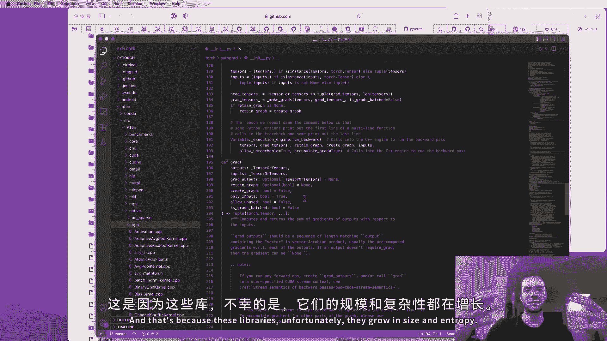

# P1：p1 神经网络和反向传播的详细介绍：bu - 加加 zero - BV11yHXeuE9d

嗨，我的名字是安德烈，我已经训练深度神经网络超过十年，在这次讲座中，我想向你展示神经网络训练的内部机制。因此，特别地，我们将从一个空白的 Jupyter 笔记本开始，到这次讲座结束时，我们将定义并训练你自己的网络。你会看到在这个过程中发生的所有事情。

关于它的工作原理和直观层面。现在我特别想带你通过构建 micrograd。micrograd 是我大约两年前在 GitHub 上发布的这个库，但当时我只上传了源代码，你需要自己去弄清楚它是如何工作的。因此，在这次讲座中，我会一步一步带你了解它，并对它的所有部分进行评论。

那么什么是 micrograd，为什么它有趣？好吧，micrograd 基本上是一个自动梯度引擎。自动梯度是 automatic gradient 的缩写，实际上它实现了反向传播。反向传播是一种算法，允许你有效地评估某种损失函数相对于神经网络权重的梯度，这使我们能够进行更进一步的操作。

微调神经网络的权重以最小化损失函数，从而提高网络的准确性。因此，反向传播将是任何现代深度神经网络库的数学核心，例如 PyTorch 或 Jax。

micrograd 的功能我认为最好通过一个例子来说明。因此，如果我们向下滚动，你会看到 micrograd 基本上允许你构建数学表达式。在这里，我们有一个正在构建的表达式，其中有两个输入 A 和 B，你会看到 A 和 B 分别是负四和二，但我们将这些值封装到 micrograd 的一部分中。

我们将构建一个数学表达式，在这个表达式中，A 和 B 被转换为 C、D，并最终变为 E、F 和 G，我在展示 micrograd 的一些功能和它所支持的操作。所以你可以将两个值对象相加，可以将它们相乘，可以将它们提升到常数的幂。

你可以通过偏移、取反、在零点压缩、平方、常数相除等方式进行操作。因此，我们正在用这两个输入 A 和 B 构建一个表达式图，并创建一个输出值 G，micrograd 将在后台构建整个数学表达式。因此，它会知道 C 也是一个值，C 是一个加法操作的结果。

C 的子节点是 A 和 B，因为它们都保持指向 A 和 B 值对象的指针。因此，我们将基本上确切知道这一切是如何布局的。然后，我们不仅可以进行所谓的前向传递，实际上查看 G 的值。当然，这非常简单。我们将使用 dot data 属性访问它，因此前向传递的输出 G 的值是。

结果是 0.7，但重要的是我们还可以调用这个 G 值对象的 dot backward，这基本上会在节点 G 处初始化反向传播。反向传播将从 G 开始，向后遍历那个表达式图，并递归应用微积分中的链式法则。

这使我们能够基本上评估 G 相对于所有内部节点（如 E、D 和 C）以及输入 A 和 B 的导数。然后，我们实际上可以查询 G 关于 A 的导数，例如 A dot grad。在这种情况下，它恰好是 一百三十八，而 G 关于 B 的导数也恰好在这里。

六百四十五及其导数，我们很快会看到，这非常重要，因为它告诉我们 A 和 B 如何通过这个数学表达式影响 B。特别地，A 的梯度是一百三十八。因此，如果我们稍微调整 A 使其稍微增大，一百三十八告诉我们 G 将增长，而这个增长的斜率将是 一百三十八。

B 的增长斜率将是六百四十五。这将告诉我们，如果 A 和 B 轻微向正方向调整，G 将如何响应。好吧，现在你可能对我们这里构建的这个表达式感到困惑，顺便说一下，这个表达式是完全没有意义的。我只是随便编的。我只是展示微分梯度所支持的操作类型。

我们真正关心的是神经网络。但事实证明，神经网络就像这个数学表达式一样。实际上，神经网络稍微不那么疯狂。神经网络仅仅是一个数学表达式。它们将输入数据作为输入，并获取神经网络的权重。

网络作为输入，以及一些数学表达式，输出则是你的神经网络预测值或损失函数。我们稍后会看到这一点。基本上，神经网络只是一类特定的数学表达式。但反向传播实际上要普遍得多，它根本不关心神经网络。

它仅仅讲述任意的数学表达式。然后我们恰好使用这一机制来训练神经网络。现在我想在这个阶段再提一点，正如你在这里看到的，micrograd 是一个标量值的自动求导引擎。所以它是在单个标量的层面上工作的，比如负四和二。

我们将神经网络分解到这些单个标量的原子和所有的小加法和乘法。其实这太过繁琐了。因此，显然你在生产环境中绝不会这样做。这纯粹是出于教学目的，因为它让我们不必处理这些现代深度神经网络库中会用到的多维张量。

这样做是为了让你理解并重构反向传播和链式法则以及对训练的理解。如果你确实想训练更大的网络，你必须使用这些张量。但数学没有任何变化。这完全是出于效率。我们基本上将所有标量值打包成张量，这些张量就是这些标量的数组。

然后因为我们有了这些大数组，我们对这些大数组进行操作，使我们能够利用计算机的并行性。所有这些操作都可以并行进行，然后整体运行得更快。但实际上，数学没有任何变化，这纯粹是为了效率。

因此，我认为从零开始处理张量在教学上并没有什么用。这就是我根本上编写 micrograd 的原因，因为你可以在基础层面理解事物是如何运作的。然后你可以再加速。好了，接下来是有趣的部分。我的主张是，micrograd 就是你训练神经网络所需的，其他的只是效率。

你会认为 micrograd 会是一段非常复杂的代码，但事实并非如此。所以如果我们去看看 micrograd，你会发现这里只有两个文件。这是实际的引擎。它对神经网络一无所知。这是整个基于 micrograd 的神经网络库。所以引擎和和和.dot pi。

所以实际的反向传播自动求导引擎，赋予你神经网络的能力，实际上就是一百行简单的 Python 代码。我们将在本讲座结束时理解这一点。然后，那个派。这种建立在自动求导引擎之上的神经网络库简直就像一个笑话。

就像我们必须定义什么是神经元，然后定义什么是神经元层。接着我们定义什么是多层感知器，它仅仅是神经元层的一个序列。所以这简直是个笑话。基本上，仅仅一百五十行代码就蕴含了巨大的能力。而这只是理解神经网络训练所需的，其他的都是效率问题。

当然，效率上还有很多内容，但从根本上来说，这就是所有发生的事情。好的，那么现在让我们一步一步深入实施微观梯度。首先，我想确保你对导数有非常好的直观理解，以及它究竟给你提供了什么信息。

所以让我们从一些基本的导入开始，我在每个 Jupyter Notebook 中都会复制这些。让我们定义标量值函数 f(x)如下。我随便编造的，只想要一个接受单个标量 x 并返回单个标量 y 的标值函数。当然我们可以调用这个函数，比如传入 3.0，得到 20 的返回值。

现在我们可以绘制这个函数，以便了解它的形状。你可以从数学表达式中看出，这很可能是一个抛物线。它是一个二次函数。因此，如果我们创建一组标量值，比如使用从负五到五的范围，步长为点二五。那么 x 的范围就是从负五到五，但不包括五，步长为点二五。

我们实际上也可以在这个非数组上调用这个函数。所以如果我们在 x 上调用 f，就会得到一组 y。这些 y 基本上也是对每一个元素独立应用函数。我们可以使用 matplotlib 绘制这个图。如果你看到那个图，x 在 y 中，我们得到一个漂亮的抛物线。因此之前我们在这里输入 3.0，得到了 20 的返回值，这里的 y 坐标就是。

现在我想思考一下这个函数在任意输入点 x 的导数是什么。对吧，那么这个函数在不同点 x 的导数是什么？如果你还记得你的微积分课，你可能已经推导过导数。所以我们拿这个数学表达式 3x² - 4x + 5，你会在一张纸上写出来。

你会应用乘积法则和其他所有法则，推导出原始函数的伟大导数的数学表达式。然后你可以代入不同的值，看看导数是什么。我们并不打算真正这样做，因为在神经网络中没有人会写出神经网络的表达式。那会是一个庞大的表达式。

你知道成千上万的项，实际上没有人推导导数。因此，我们不会采取这种符号方法。相反，我想做的是看看导数的定义，确保我们真正理解导数在测量什么，它告诉你关于这个函数的什么。

因此，如果我们只看导数，我们会发现，这不是一个很好的导数定义。这是一个关于可微性的定义。但是如果你还记得微积分，它是 h 趋近于零时 f 的 x 加 h 减去 f 的 x 除以 h 的极限。所以基本上它在说的是如果你。

轻微增加，你在某个你感兴趣的点 x 或 a，如果你稍微增加一点，你知道你稍微增加了一个小数 h。这个函数如何响应？它的敏感度是什么？在那个点的斜率在哪里？这个函数是上升还是下降？下降多少？这就是这个函数的斜率，响应的斜率在那一点。

点。因此，我们基本上可以通过取一个非常小的 h 来数值评估导数。定义当然要求我们将 h 取到零。我们只是选择一个非常小的 h，0.001。假设我们对 0.3 感兴趣。所以我们可以把 f 的 x 看作是 20。现在 f 的 x 加 h。如果我们稍微将 x 向正方向推动，函数会怎样。

它会如何响应？仅仅看看这个，你期望 f 的 x 加上 h 稍微大于 20 吗？

或者你期望略低于 20？既然这里有 3，而这里是 20，如果我们稍微正向移动，函数会正向响应。因此你会期望这个值稍微大于 20。而这个值告诉你斜率的强度，对吧？

斜率的大小。所以 f 的 x 加 h 与 f 的 x 之差，这是函数在正方向响应的程度。我们必须通过运行来归一化。所以我们有 rise over run 来得到斜率。因此，这当然只是斜率的数值近似，因为我们必须让 h 非常非常小，以便收敛到确切的值。

现在如果我在做太多零，某个时候，我会得到一个不正确的答案，因为我们使用的是浮点算术，而计算机内存中所有这些数字的表示是有限的。在某个时候，我们会遇到麻烦。因此，我们可以通过这种方法收敛到正确答案。但基本上，在 3 时，斜率是 14。你可以通过计算 3x 平方减去 4x 加 5 来看到这一点。

并在脑海中进行微分。因此 3x 平方的导数是 6x 减去 4。然后我们代入 x 等于 3。所以是 18 减去 4 等于 14。所以这是在 3 时的情况。那么在负 3 时的斜率如何？你会期待什么？

现在确切的值很难确定，但那个斜率的符号是什么呢？所以在负 3 时，如果我们稍微在正方向上移动 x，函数实际上会下降。这告诉你斜率是负的。所以我们将得到一个略低于 20 的数字。因此如果我们取斜率，我们期望得到负值，负 22。好的。

在某个时刻，当然，斜率会是 0。现在对于这个特定的函数，我之前查过，它在 2/3 点。所以大约在 2/3，那里这个导数会是 0。因此，基本上在那个精确点，是的，在那个精确点，如果我们朝正方向轻推，函数不会响应。这几乎保持不变。

所以这就是斜率为 0 的原因。好的。现在让我们看看一个更复杂的案例。所以我们将开始，你知道，稍微复杂化一下。所以现在我们有一个函数。这里输出变量 D 是三个标量输入 A、B 和 C 的函数。因此 A、B 和 C 是一些特定值，三输入到我们的表达式图中，以及单一输出 D。

所以，如果我们打印 D，我们得到四。现在我必须做的是，我想再次查看 D 对 A、B 和 C 的导数。并再次思考这个导数告诉我们的直觉。因此，为了评估这个导数，我们将有点小技巧。我们将再次有一个非常小的 H 值。然后我们将固定我们感兴趣的输入一个微小的量。这是通过 H 来归一化以获得斜率。

所以这些是，点 A、B、C。在这些点上，我们将评估 D 对所有 A、B 和 C 的导数。因此，输入就是这些。现在 D1 是那个表达式。然后我们将，举个例子，查看 D 对 A 的导数。

所以我们将取 A，并将其增加 H。然后，我们将使 D 二与之完全相同。现在我们要打印，你知道，F1 D1 是 D1，D2 是 D2 并打印斜率。所以这里的导数或斜率当然是 D2 减去 D1 再除以 H。D2 减去 D1 就是当我们增加特定值时，函数增加了多少。

所以，是的。所以我从中打印 D1，我们知道是四。现在 D2 将是 A 增加 H。让我们稍微想一下 D2 在这里将打印出什么。特别是 D1 将是四，D2 是一个略大于四的数字，还是。

略低于四。这将告诉我们导数的符号。所以，我们将 A 增加 H。B 是负三，CS10。所以你可以直观地思考一下这个导数及其作用。A 会稍微更正，但 B 是一个负数。因此，如果 A 稍微更正，由于 B 是负三，我们实际上会在某些值上增加输入，这些值是我们感兴趣的。

对 D 减少。因此你会期望函数的值会下降。让我们看看这个。是的。所以我们从 4 变成了 3.9996。这告诉你斜率将是负的。然后将是一个负数，因为我们下降了。然后斜率的确切数值将是。

斜率的确切数值是负三。你也可以通过数学和分析来确认负三是正确的答案，因为如果你有 A 乘以 B 加上 C。你知道，你有微积分，然后对 A 的 A 乘以 B 加 C 求导，仅仅得到 B。确实，B 的值是负三，这是我们得到的导数。

有。所以你可以判断这是正确的。那么现在如果我们对 B 这样做，所以如果我们稍微向正方向增加 B，我们会得到不同的斜率。那么 B 对输出 D 的影响是什么？所以如果我们在正方向上稍微增加 B。那么因为 A 是正的，我们将会向 D 添加更多，对吧。所以，现在。

敏感性是什么？那个加法的斜率是什么？

这可能并不让你感到惊讶，这应该是二。为什么是二？因为 D 关于 B 的导数，关于 B 的分数会给我们 A，而 A 的值是二。所以这也是正常工作的。如果 C 在 H 上稍微增加了一点，那么当然。H 乘以 B 不受影响。现在 C 稍微高了一点。这对函数有什么影响？

这使得它稍微高了一点，因为我们只是简单地添加了 C。并且它使得它稍微高了与我们添加到 C 的量完全相同。因此，这告诉你斜率是 1。这将是 D 随着 C 的缩放而增加的速率。好的，所以我们现在对这个有一些直观的理解。

这个导数告诉你关于这个函数的什么。我们想转向神经网络。正如我提到的，神经网络将是相当庞大的表达式，数学表达式。因此我们需要一些数据结构来维护这些表达式。这就是我们现在要开始构建的内容。所以我们要构建我展示的这个值对象。

你在 micro grad 的自述页面上。所以让我复制粘贴第一个非常简单的值对象的框架。所以类值接受一个单一的标量值，它包装并跟踪它。就这样。所以我们可以，例如，做值为 2.0，然后我们可以查看它的内容。Python 将在内部使用包装函数返回这个字符串。

这是一个数据等于 2 的值对象，我们在这里创建。现在我们想要做的是，不仅仅有两个值，而是想做一个块状的，对吧？我们想把它们加起来。因此，目前你会得到一个错误，因为 Python 不知道如何添加两个值对象。所以我们必须告诉它。

所以这里是加法。你基本上必须在 Python 中使用这些特殊的双下划线方法为这些对象定义这些运算符。所以如果我们调用，如果我们使用这个加法运算符，Python 将在内部调用 B 的 dot add。这就是内部会发生的事情。因此，B 将是另一个，而 self 将是一个。

我们看到我们要返回的是一个新的值对象。它将只是包装它们数据的加法。但是请记住，现在，因为数据实际上是像数字的 Python 数字。因此，这里的运算符只是典型的浮点加法，现在不是值对象的加法。我们将返回一个新的值。

现在 a 加 B 应该能工作。它应该打印出负一的值，因为这是二加负三。好了，现在让我们实现乘法，以便重现这个表达式。所以乘法，我想你不会惊讶，它将是相当相似的。因此，我们将使用 mall 代替 at。在这里，当然我们想做很多。

现在我们可以创建一个 C 值对象，它将是 10.0。现在我们应该能够执行 a 乘以 B。好吧，我们先来做 a 乘以 B。这现在的值是负六。顺便提一下，我略过了这一点。假设我这里没有包装函数，那么你只会得到某种结果。

一个丑陋的表达式。所以 rep 的作用是提供一种在 Python 中打印出更美观表达式的方式。这样我们就不仅仅是得到一些神秘的东西，而是得到了负六的值。所以这给了我们一个乘法。然后我们现在应该能够将 C 添加到其中，因为我们已经定义并告诉 Python 如何执行 mall 和 add。

所以这将调用，这基本上相当于 B 的 dot mall。然后这个新值对象将是 dot add C。让我们看看是否有效。是的。这有效。好吧，那给了我们四，这是我们之前预期的结果。我相信我们也可以手动调用它们。好了。

现在我们缺少的是这个表达式的连接部分。正如我提到的，我们希望保留这些表达式图。所以我们需要了解并保持指向哪些值产生其他值的指针。例如，在这里，我们将引入一个新变量，称为 children。默认情况下，它将是一个空元组。然后我们实际上将会。

在类中保持一个略微不同的变量，称为 _ 私有，它将是 children 的集合。这是我在原始微型梯度中做到的，查看我的代码，我不记得确切的原因，我相信这是出于效率。但是这个 _ children 将是一个元组以方便起见。但当我们在类中实际维护它时，它将是。

就是这个集合。我相信这是为了效率。所以现在当我们用构造函数创建一个值时，children 将是空的，private 将是空集合。但是当我们通过加法或乘法创建一个值时，我们将传入这个值的 children。在这种情况下是 self 另一个。所以这些就是这里的 children。现在我们可以做`d dot prep`。

我们会看到，children 现在知道的是这个值，**负六**和**十**。当然，这是由`a times b`得到的值，C 值是 10。现在我们不知道的最后一块信息是，我们知道每个值的 children，但不知道是什么操作创建了这个值。所以我们需要一个。

这里有更多的元素，我们称之为**下划线弹出**。默认情况下，这是叶子的钩子集合。然后我们将把它保持在这里。现在的操作将是一个简单的字符串。在加法的情况下，是加，在乘法的情况下，是乘。所以现在我们不仅有`d dot prep`，还有`d dot op`。我们知道 D 是由一个产生的。

这两个值的相加。所以现在我们有了完整的数学表达式。我们正在构建这个数据结构。我们确切知道每个值是如何通过字面表达式以及从其他值而来的。现在，由于这些表达式即将变得相当复杂，我们希望找到一种方式。

好好地可视化我们正在构建的这些表达式。为此，我将复制粘贴一些稍微吓人的代码，用于可视化这些表达式图。这里是代码，我稍后会解释。但是首先，让我给你展示一下这段代码的作用。基本上，它创建了一个新的函数`draw dot`，我们可以在某个根节点上调用它。

然后它将进行可视化。所以如果我们在 D 上调用`draw dot`，这是这个最终值，**八乘 B 加 C**。它会生成类似这样的东西。所以这是 D。你看到的是，这个是`a times B`，生成一个属性值，加上 C 给我们输出节点 D。所以这就是 D 的绘制。我不会详细讲解这一部分。

你可以看看图表，以及它的 API。图是一种开源图形可视化软件。我们在这里做的是在图的 API 中构建这个图。你基本上可以看到，跟踪是这个帮助函数，它枚举图中的所有节点和边。所以这只构建了一个包含所有节点和边的集合。

然后我们遍历所有节点，并使用`dot node`为它们创建特殊的节点对象。然后我们还使用`dot dot edge`创建边。唯一稍微复杂的地方是，你会注意到我基本上添加了这些假节点，这些是操作节点。例如，这个节点就像一个加号。

节点。我在这里创建这些特殊的操作节点，并相应地连接它们。因此，这些节点当然不是原始图中的实际节点。它们实际上不是值对象。这里唯一的值对象是方框中的内容。那些才是真正的值对象或其表示。

这些操作节点只是为了让它看起来美观而在这个绘图例程中创建的。我们还要给这些图添加标签，以便知道变量的位置。因此，让我们创建一个特殊的下划线标签。或者我们默认让标签为空，并将其保存在每个节点中。在这里，我们将标签设置为 C。

然后让我们创建一个特殊的等于 A 乘以 B。标签将是，它有点不。然后它将是 A 加 C，而 D 的标签将是，好吧。因此，没有什么真正改变。我只是添加了这个新函数、新变量。然后在打印时，我将在这里打印标签。所以这将是一个百分比 S 条。这将最终成为标签。

现在我们在左侧有了标签。因此它显示，A 创造了我。然后 E 加 C 创造了 D。就像我们这里写的那样。最后，让我们将这个表达式的层次加深一层。因此，D 将不再是最终输出节点。相反，在 D 之后，我们将创建一个新的值对象 F。我们将开始。

变量很快就用完了。F 的值将是负 2.0。它的标签当然是 D F。然后大写的 L 将是我们图的输出。L 将是 T 乘以 F。因此，L 的值为负 8，是输出。现在我们不仅要画 D，还要画 L。好吧。L 的标签在某种情况下是未定义的。哎呀。所有标签必须明确。

被提供给它的。好了。所以 L 是输出。让我们快速回顾一下到目前为止所做的工作。我们能够仅使用加法和乘法构建数学表达式。它们沿途都是标量值。我们可以执行正向传播并构建数学表达式。因此，我们在这里有多个输入，A、B、C 和 F 进入一个产生。

一个单一输出 L。这里我们观察正向传播。因此，正向传播的输出是负 8。这是值。接下来，我们想做的是运行反向传播。在反向传播中，我们将从末尾开始。然后，我们将反向计算沿着所有这些中间值的梯度。

我们在这里计算的每一个值，实际上是计算该节点相对于 L 的导数。因此，L 对 L 的导数就是 1。接下来，我们将推导 L 相对于 F、D、C、E、B 和 A 的导数。在神经网络中。

设置时，你会非常感兴趣于这个损失函数 L 相对于神经网络权重的导数。当然，在这里我们仅有这些变量 A、B、C 和 F。但是其中一些最终将代表神经网络的权重。因此我们需要知道这些权重如何影响损失函数。

我们基本上会对输出相对于其某些叶节点的导数感兴趣。而这些叶节点将是神经网络的权重。其他叶节点当然将是数据本身。但是通常，我们不希望或使用损失函数相对于数据的导数，因为数据。

是固定的。但是权重将基于梯度信息进行迭代。因此接下来，我们将创建一个变量在值类中，用于维护相对于该值的 L 的导数。我们将把这个变量称为 grad。所以这里有数据，还有一个 self，grad。最初，它将为零。请记住，零基本上意味着没有影响。因此在。

初始化时，我们假设每个值不会影响输出。对，因为如果梯度为零，那意味着更改此变量并不会改变损失函数。因此默认情况下，我们假设梯度为零。现在既然我们有了 grad，并且它是 0.0，我们将在数据之后能够可视化它。因此这里 grad 是 0.4。

这将体现在 grad 中。现在我们将展示数据和 grad，并将其初始化为零。我们即将准备计算反向传播。当然，这个 grad 再次，如我所提到的，代表输出的导数。在这种情况下，L 相对于这个值的导数。因此相对于。

这就是 L 相对于 F、D 等的导数。现在让我们填入这些梯度，实际上手动进行反向传播。正如我提到的，从末尾开始填充这些梯度。首先，我们关注填入这里的这个梯度。那么 L 的导数是什么。

相对于 L 呢？换句话说，如果我将 L 更改一个微小的量 H，L 会改变多少？

它随着 H 变化。因此它是成比例的，因此永远会有一个。我们当然可以测量这些，或者像我们之前看到的那样数值估计这些数值梯度。因此，如果我采用这个表达式并在这里创建一个 def LLL 函数。现在，我创建这个门控函数 LLL 的原因是因为我不想污染或混淆。

全局作用域在这里。这就像一个小的暂存区。正如你所知道的，在 Python 中，所有这些都是此函数的局部变量。因此，我并没有更改任何全局作用域。在这里，L1 将是 L，然后复制此表达式，我们将增加一个小量 H，在。

例如，A，对吧？这将测量 L 关于 A 的导数。因此这里，这将是 L2。然后我们想要打印这个导数。所以打印 L2 减去 L1，这就是 L 变化的多少，然后用 H 标准化。所以这是升高与运行。我们必须小心，因为 L 是一个值节点。因此我们实际上想要它的数据。所以这些是浮点数。

除以 H。这应该打印 L 关于 A 的导数，因为 A 是我们用 H 稍微改变的。那么 L 关于 A 的导数是什么？是六。好的。显然，如果我们将 L 改变 H，那么这里实际上就是。这看起来真的很尴尬，但改变 L 以 H，你会看到这里的导数是 1。

这就像我们在这里做的基本情况。因此，基本上。我们不能复制这里，我们可以手动将 L 点梯度设为一。这是我们的手动反向传播。L 点梯度是 1。让我们重新绘制。我们看到我们为 L 填充的梯度是 1。我们现在将继续反向传播。因此让我们在这里查看 L 的导数。

关于 D 和 F。我们先做 D。那么我们感兴趣的是，如果我在这里创建一个 markdown，我们想知道基本上我们有 L 是 D 乘以 F。我们想知道 D L 对 D D 是什么？那是什么？如果你知道你在学习微积分，L 是 D 乘以 F。那么 D L 对 D D 就是 F。如果你不相信我。

我们也可以直接推导，因为证明相对来说是相当简单的。我们去看导数的定义，即 F 的 x 加 H 减去 F 的 x，除以 H，作为 H 趋近于零时这种表达式的极限。因此，当 L 等于 D 乘以 F 时，增加 D 的 H 会给我们 D 加 H 乘以 F 的输出。基本上就是 F 的 x 加 H。

对吧？减去 D 乘以 F 然后除以 H。象征性地展开，我们会得到。基本上是 D 乘以 F 加 H 乘以 F 减去 D 乘以 F 除以 H。然后你会看到 D F 减去 D F 消去。因此你留下的是 H 乘以 F 除以 H，这就是 F。因此在极限中，当 H 趋近于零时，你知道，导数的定义，我们只得到 F 在 D 乘以 F 的情况下。

所以对称地，D L 对 D F 将只是 D。因此我们得到的 F 点梯度现在就是 D 的值，即四。我们看到 D 点梯度就是 F 的值。因此 F 的值是负二。我们将手动设置这些。让我擦掉这个 markdown 节点，然后让我们重新绘制我们拥有的内容。好的，让我们确保这些是正确的。

所以我们似乎认为 D L 对 D D 是负二。因此让我们再检查一次。让我擦掉之前的加 H。现在我们想要关于 F 的导数。所以让我们来这里创建 F，然后在这里加一个 H。这应该打印 L 关于 F 的导数。所以我们期待看到四。对。

这是四个关于浮点计算的问题。然后 D L 对 D D 应该等于 F。其值为负二。梯度是负二。所以如果我们再次来到这里并改变 D。D dot data 加上 H 在这里。所以我们期望，我们添加了一个小 H，然后看到 L 的变化。我们期望打印负二。就是这样。我们已经在数值上验证了。

我们在这里做的就像是一个内联梯度检查。梯度检查是当我们推导出反向传播并获得所有中间结果的导数时。而数值梯度就是，估计它，使用小步长。现在我们要进入反向传播的关键部分。

所以这是最重要的节点，因为如果你理解这个节点的梯度，你就理解了所有反向传播和神经网络的训练。因此，我们需要推导 D L 对 B C 的导数。换句话说，L 关于 C 的导数，因为我们。

我们已经计算了所有其他梯度。现在我们来这里手动继续反向传播。所以我们想要 D L 对 C 的导数，然后我们也会推导 D L 对 E 的导数。现在问题来了。我们如何推导 D L 对 C 的导数？我们实际上知道 L 关于 D 的导数。因此，我们知道 L 对 D 的敏感度。但是 L 对 C 的敏感度如何？所以如果我们微调 C，如何影响 L 通过 D？

所以我们知道 D L 对 C 的导数。我们也知道 C 如何影响 D。因此，直观地说，如果你知道 C 对 D 的影响，以及 D 对 L 的影响，那么你应该能够以某种方式将这些信息结合起来，弄清楚 C 如何影响 L。事实上，这正是我们可以做到的。特别地。

我们先专注于 D。让我们看看 D 对 C 的导数基本上是什么。所以换句话说，D D 对 D C 是什么？在这里，我们知道 D 是 C 乘以 C 加 E。这就是我们所知道的。现在我们对 D D 对 D C 感兴趣。如果你再回想一下微积分。

对 C 加 E 进行微分，你知道那给你 1 到 0。我们也可以回到基础知识并推导这个。因为我们可以使用 f 的 x 加 H 减去 f 的 x，由 h 导出的，这是导数的定义，h 趋近于 0。因此，专注于 C 及其对 D 的影响，我们基本上可以得到 f 的 x 加 h 将是 C 增加 h 加 E。

这是我们函数的第一次评估，减去 C 加 E。然后除以 h。那么这是什么？展开来看，这将是 C 加 H 加 E 减去 C 减去 E 除以 h。然后你会看到 C 减去 E 取消了 E 减去 E 取消了，剩下的就是 h 除以 h，即 1。0。因此，通过对称性，D D 对 D，E 也将是 1。0。因此，基本上一个和的导数。

表达式非常简单。这是局部导数。所以我称之为局部导数，因为我们在这个图的最末端有最终输出值。而我们现在像是这里的一个小节点。这是一个小加号节点。这个小加号节点对它所嵌入的图的其余部分一无所知。

它只知道我做了加法。它取了 C 和 E，进行了相加，得到了 D。而这个加号节点也知道 C 对 D 的局部影响，而不是 D 相对于 C 的导数。它还知道 D 相对于 E 的导数。但这不是我们想要的。

这只是局部导数。我们实际想要的是 D L by D C。而 L 可以在这里仅一步之遥。但在一般情况下，这个小加号节点可能嵌入在一个庞大的图中。所以再一次，我们知道 L 如何影响 D。而现在我们知道 C 和 E 如何影响 D。我们如何将这些信息结合起来以写出 D L by D C？

答案当然就是微积分中的链式法则。所以我从维基百科中拉出了链式法则。我将非常简要地介绍一下。所以维基百科中的链式法则有时会让人非常困惑，而微积分也会非常混乱。就像，这是我学习链式法则的方式，真的是非常混乱。到底发生了什么？

这就是复杂之处。所以我更喜欢这个表达式。如果变量 Z 依赖于变量 Y，而 Y 又依赖于变量 X。那么显然，Z 也依赖于 X，通过中间变量 Y。在这种情况下，链式法则表述为如果你想要 D Z by DX，那么你就取 D Z by D Y 并将其相乘。

D Y by DX。所以链式法则基本上是告诉你如何正确地将这些导数连接在一起。因此，要通过函数复合体进行微分，我们必须对这些导数进行相乘。所以这正是链式法则告诉我们的。这里有一个很好的直观解释，我认为也挺可爱的。

链式法则表明，知道 Z 相对于 Y 的瞬时变化率和 Y 相对于 X 的变化率，可以计算 Z 相对于 X 的瞬时变化率。作为这两种变化率的乘积，简单地说就是这两者的乘积。所以这里有一个好的例子。如果汽车的速度是自行车的两倍，而自行车的速度是步行人的四倍。

然后汽车的速度是人的两倍，四倍于人。因此这非常明确，正确的做法是相乘。所以汽车的速度是自行车的两倍，而自行车的速度是人的四倍。所以汽车的速度将是人的八倍。所以我们可以将这些中间变化率相乘。

这从直观上证明了链规则。因此看看链规则，但在这里，实际上对我们意味着有一个非常简单的公式来推导我们想要的，即 D L 和 D C。到目前为止，我们知道一，并且知道 D 对 L 的影响。因此我们知道 D L 和 D D，关于 D D 的 L 的导数。我们知道这是负二。现在因为。

在这里我们做的局部推理中，我们知道 D D 和 D C。那么 C 如何影响 D？特别是，这是一个加节点。所以局部导数简单地是 1.0。这非常简单。因此链规则告诉我们，D L 和 D C，通过这个中间变量，只是 D L 和 D D 乘以 D D 和 D C。这是链规则。所以这与。

这里发生的情况是，Z 是 R L，Y 是 R D，而 X 是 R C。所以我们实际上只需将这些相乘。因为这些局部导数，比如 D D 和 D C，都是一，所以我们基本上只是复制 D L 和 D D，因为这只是乘以一。那么是什么呢？因为 D L 和 D D 是负二。

D L 和 D C 是什么？嗯，这是局部梯度 1.0 乘以 D L 和 D D，即负二。所以字面上，加节点的作用可以这样看：它实际上只是路由梯度，因为加节点的局部导数都是一。因此在链规则中，一乘以 D L 和 D D 就是 D L 和 D D。所以那个导数。

就这样被路由到 C 和 E 的滑板中。所以基本上，我们有 E.dot.grad，或者从 C 开始，因为这是我们查看的那个，是负二乘以一，负二。以同样的方式，我的对称性，E.dot.grad 将是负二。这就是我们的主张。所以我们可以设置这些。我们可以重新绘制。你会看到我们只是分配负二负二。

所以这个反向传播信号携带着有关 L 关于所有中间节点的导数的信息。我们几乎可以想象它像是向后流动，通过图。而加节点将简单地将导数分配给所有叶子节点，抱歉，是它的所有子节点。这就是我们的主张。现在让我们来验证一下。

所以让我把这里的加 H 去掉。现在，我们要做的是引入 C。所以 C.dot.data 将增加 H。当我运行这个时，我们期望看到负二，然后当然是 E。所以 E.dot.data 加上 H，我们期望看到负值。简单。

所以这些是这些内部节点的导数。现在我们将再次递归回去。我们将再次应用链规则。所以这里我们来了。我们第二次应用链规则。我们将其应用到整个图中，而这个图恰好只剩下一个节点。我们有 D L 和 E，如我们所知。

刚计算出的结果是负二。所以我们知道了。因此我们知道 L 关于 E 的导数。现在我们想求 dL 对 dA，对吧？链式法则告诉我们这就是 dL 对 dE，负二乘以局部梯度。那么局部梯度是什么呢？基本上是 dE 对 dA。我们得看看这个。所以我在一个庞大的图中的一个节点里。

而且我只知道我做了 A 乘以 B，产生了 E。那么 dE 对 dA 和 dE 对 dB 是多少呢？

这是我唯一知道的事情。这就是我的局部梯度。因为我们知道 E 是 A 乘以 B，所以我们在问 dE 对 dA。我们刚刚做了这个乘法，所以我不打算重新推导。但如果你想对 A 求导，你会得到 B，对吧？B 的值。

在这种情况下是负 3.0。所以基本上我们有 dL 对 dA。让我就在这里做。我们有 A 点 grad，并且我们在应用链式法则，这里是 dL 对 dE。我们看到是负二乘以 dE 对 dA，结果是 B 的值，负 3。这就是了。然后我们有 B 点 grad，再次是 dL 对 dE，结果是负二。

以相同的方式，dE 对 dB 的值就是 A，结果是 2.0。这就是 A 的值。所以这是我们声称的导数。让我们重新绘制一下。我们看到 A 点 grad 的结果是 6，因为那是负二乘以负三。而 B 点 grad 是负四，抱歉，是负二乘以二，结果是负四。这就是我们的声明。

让我们删除这些，来验证它们。我们这里有 A，A 点数据加上 H。因此，声明是 A 点 grad 是 6。让我们验证一下 6。我们有 B 点数据加上 H。所以通过 H 轻推 B，看看发生了什么，我们声称是负四，确实是负四，再加上浮点数的奇异性。就这样。这是手动的反向传播。

传播从这里到所有叶节点。我是逐步完成的。实际上，我们所做的就是，正如你所见，我们一个接一个地迭代所有节点，局部应用链式法则。我们始终知道 L 关于这个小输出的导数是什么。然后我们查看这个输出是如何产生的。这个输出是这样产生的。

通过一些操作。我们有这个操作的子节点指针。在这个小操作中，我们知道局部导数是什么。我们只需将它们乘到导数上。因此，我们就这样递归地乘以局部导数。这就是反向传播，就是向后递归应用链式法则。

通过计算图。让我们简要看看这个力量在运作，我们将要做的是轻推我们的输入，以尝试让 L 上升。因此，特别是，我们想要一个数据，我们要改变它。如果我们希望 L 上升，那就意味着我们必须朝着梯度的方向前进。

因此，a 应该朝着梯度的方向增加，像是一些小的步长。这是步长。我们不仅希望这适用于 B，还希望它也适用于 C。同样适用于 F，那些是我们通常控制的叶子节点。如果我们朝梯度的方向轻微调整，我们期待对 L 产生积极影响。所以我们希望 L 上升。

积极的。所以它应该变得不那么消极。它应该上升到负六之类的。具体来说很难判断。我们需要重新运行前向传播。那么让我在这里做一下。这就是前向传播。F 将保持不变。这实际上是前向传播。如果我们打印 L 的数值，我们期待，因为我们轻微调整了所有的。

值，所有输入的合理梯度，我们预计 L 会变得不那么消极。我们预计会向上移动。所以也许是负六左右。让我们看看会发生什么。好的，负七。这基本上是一次优化步骤的结果，并且这梯度实际上给了我们一些力量，因为我们知道如何影响最终结果。

这对于训练是非常有用的，你知道的，这同样适用于 COC。因此现在我想做一个手动反向传播的例子，使用一个更复杂和有用的例子。我们将通过一个神经元进行反向传播。所以我们最终想要构建神经网络。在最简单的情况下，这些被称为多层感知器。

这是一种双层神经网络。它有这些由神经元组成的隐藏层。这些神经元彼此完全连接。现在生物学上，神经元是非常复杂的设备，但我们有它们的非常简单的数学模型。所以这是一个非常简单的神经元数学模型。你有一些输入，Xs，然后你有这些带权重的突触。所以 Ws 是权重。然后突触与这个神经元的输入以乘法方式相互作用。所以流向这个神经元细胞体的是 W 乘以 X。但输入是多个。

所以有很多 W 乘以 Xs 流向细胞体。细胞体也有一些偏置。因此这有点像这个神经元的内在触发快乐程度。这个偏置可以使其更容易触发或更不容易触发，无论输入如何。但基本上我们正在处理所有输入的 W 乘以 X。

添加偏置。然后我们通过一个激活函数来处理它。这个激活函数通常是某种类型的压缩函数，比如 sigmoid 或 10H 或其他的。因此作为例子，我们将在这个例子中使用 10H。NumPy 有 np。10H。所以我们可以在一个范围内调用它，并进行绘制。这些就是 10H 函数。

你会看到输入在这里进入时被压缩到白色坐标。因此在零点时，我们会得到确切的零。然后随着输入变得越来越正，你会看到函数仅会上升到一，然后趋于平稳。因此如果你输入非常正的值，我们将平滑地限制在一。

在负侧，我们将平滑地限制为负一。所以这是 10H。这就是压缩函数或激活函数。这个神经元输出的就是激活函数应用于权重和输入的点积。因此我们来写一个。我要复制粘贴，因为我不想打太多。但好吧。

这里我们有输入，x1，x2。这是一个二维神经元。所以两个输入会进来。这些被视为这个神经元的权重，权重 w1，w2。这些权重再次是每个输入的突触强度。这是神经元的偏置 B。现在我们想做的是根据这个模型。

我们需要将 x1 乘以 w1 和 x2 乘以 w2。然后我们需要在其上加上偏置。这里会有点复杂，但我们所要做的就是 x1，w1 加上 x2，w2 加上 B。这里都是乘在一起的。只是我在分小步骤进行，以便我们实际有指向所有这些中间节点的指针。因此我们有 x1，w1 变量。

x 乘以 x2，w2 变量，我也在标记它们。因此 n 现在是细胞体的原始激活，没有激活函数。从现在开始，这应该足够基本上绘制它。因此 n 的点给我们 x1 乘以 w1，x2 乘以 w2 的和。然后偏置被加在这个基础上。这个 n 就是这个和。

所以我们现在要通过激活函数。假设我们使用 10H 来产生输出。所以我们希望在这里做的是输出。我会称它为 O 是 n 点 10H。好的，但我们还没有写 10H。我们需要在这里实现另一个 10H 函数的原因是，10H 是一个双曲函数。

我们到目前为止只实现了加法和乘法。你不能仅通过加法和乘法生成 10H。你还需要指数运算。所以 10H 是这样的一个公式。你可以使用这两个中的任何一个。你会看到涉及到指数运算，而这在我们这里的低值节点中尚未实现。

所以我们还不能产生 10H。我们必须回去实现类似的东西。这里一个选项是我们可以实际实现指数运算，对吗？我们可以返回一个值的 x，而不是值的 10H。因为如果我们有 X，那么我们就有了所需的一切。因此因为我们知道如何加法和。

我们知道如何加法，也知道如何乘法。因此，如果我们知道如何进行 X，我们就能创建 10H。但为了这个例子的目的，我特别想告诉你，我们不一定需要在这个值对象中拥有最原子化的部分。我们实际上可以在任意抽象点创建函数。它们可以是复杂的函数，但它们也可以是。

也有非常非常简单的函数，比如加法。完全由我们决定。唯一重要的是，我们知道如何对任意一个函数进行微分。因此，我们输入一些值，输出一个结果。唯一重要的事情可以是任意复杂的函数。只要你知道如何创建局部导数。

如果你知道局部导数是如何影响输出的输入，那么这就是你所需要的全部。所以我们将把所有这些表达式聚集起来，而不打散到它的原子部分。我们将直接实现 10H。让我们来做这个。死亡 10H。然后它将是一个值。

而且我们需要这个表达式。所以让我复制粘贴一下。我们来抓取 N，它是一个单元数据。然后这个，我相信是 10H。Math.x 的，两个，不，和我的。还有减去二分之一和加一。也许我可以叫它 x。就这样，它完全匹配。好的。现在这将是 t。这个节点的子节点只有一个孩子。

我将它包装在一个元组中。所以这是一个包含一个对象的元组，仅仅是自我。在这里，这个操作的名称将是 10H。我们将返回这个。好的。现在值应该实现 10H。现在我们可以一直向下滚动。实际上我们可以做 n.dot 10H。那将返回 N 的 10H 输出。

现在我们应该能够绘制那个，而不是 N。让我们看看这是如何运作的。好了。N 通过 10H 产生了这个输出。所以现在 10H 是我们这个操作的小微梯度支持节点。只要我们知道 10H 的导数，我们就能通过它进行反向传播。现在让我们看看 10H 的实际效果。目前。

由于输入相对较低，所以并没有过多地压缩。因此，偏差增加到了 8。然后我们会看到流入 10H 的值现在是 2。而 10H 将其压缩到 0.96。因此，我们已经触及到 10H 的尾部。它将平滑地上升到 1，然后在那里达到平稳。好的。

现在我将做一些稍微奇怪的事情。我将把这个偏差从 8 改为这个数字，6.88，等等。我这样做是有特定原因的，因为我们即将开始反向传播。我想确保我们的数字看起来不错，不会是很疯狂的数字。

这些是我们能在脑海中理解的不错的数字。让我也加上 O 的标签。O 在这里是输出的缩写。所以，好的，0.8 流入 10H 变为 0.7。现在我们要进行反向传播，并填入所有梯度。那么 O 对所有输入的导数是什么？当然。

在典型的神经网络设置中，我们最关心的是这些神经元对权重的导数，特别是 W2 和 W1。因为这些是我们要改变的权重，部分是优化。而我们必须记住的是，这里只有单个神经元，但神经网络中通常有。

有许多神经元，它们是相互连接的。所以这只是一个小神经元，是一个更大拼图的一部分。最终有一个损失函数，用来测量神经网络的准确性。我们正在针对该准确性进行反向传播并试图提高它。那么让我们从这里开始反向传播，O 关于 O 的导数是什么。

基本情况我们知道梯度总是 1.0。所以让我填入，然后让我分开这个绘图函数。然后在这里清除这个输出。好的。现在当我们绘制 O 时，会看到 O 和梯度是 1。所以现在我们将通过 10H 进行反向传播。为了通过 10H 进行反向传播。

我们需要知道 10H 的局部导数。因此，如果 O 是 N 的 10H，那么 D O 对 D N 是什么？你可以过来，用这个表达式进行微积分导数运算。这是可行的。但我们也可以向下滚动，看看 PDI 这里的一个部分， hopefully 能够告诉我们 10H 对 X 的导数 D 对 D X 是。

这些中的任何一个。我喜欢这个 1 减去 10H 平方的 X。所以这是 1 减去 10H 的 X 平方。基本上这表明 D O 对 D N 是 1 减去 10H 的 N 平方。我们已经有了 10H 的 N。这就是 O。所以是 1 减去 O 平方。O 是这里的输出。因此，输出就是这个数字。O 点数据是这个数字。

然后这表明 D O 对 D N 是 1 减去这个平方。所以 1 减去 O 点数据平方是 0.5，恰好。所以这个 10H 操作的局部导数是 0.5。因此，D O 对 D N 是 0.5。我们可以填入，N 点梯度是 0.5。我们就填上去。这正好是 0.5。

现在我们将继续反向传播。这是 0.5。这是一个加法节点。那么反向传播将会怎么做？反向传播会在这里做什么？

如果你还记得我们之前的例子，加法只是梯度的分发器。因此，这个梯度将简单地平均流向这两个。这是因为这个操作的局部导数对于每个节点都是 1。因此 1 乘以 0。5 是 0。5。因此我们知道这个节点，这个 grad 只是 0。5。而我们知道 B 点 grad 也是 0。

5。所以让我们设定这些并绘制图形。所以这些是 0。5。继续，我们还有另一个加 0。5。再次，我们只需分配。所以 0。5 将流向这两个。因此，我们也可以设置 X2W2。grad 是 0。5。让我们重新绘制。加上这是我最喜欢的反向传播操作，因为它非常简单。所以现在流入这些表达式的是 0。5。实际上。

再次，请记住导数在这里每个时间点告诉我们的是什么。这表示如果我们希望这个神经元的输出增加，那么对这些表达式的影响是正向的。两者都对输出有正贡献。所以现在首先反向传播到 X2 和 W2。这是一个乘法节点。所以我们知道局部。

导数是另一个项。因此，如果我们想计算 X2 点 grad，那么你能想一下它将是什么吗？所以 X2 点 grad 将是 W2 点 data 乘以这个 X2W2 点 grad。对吧？

而 W2 点 grad 将是 X2 点 data 乘以 X2W2 点 grad。对吗？

所以这是链式法则的局部部分。让我们设定它们并重新绘制。所以在这里我们看到我们的权重 2 的梯度是 0，因为 X2 的数据是 0。对吗？

但 X2 将具有梯度 0。5，因为这里的数据是 1。所以有趣的是，因为输入 X2 是 0，所以由于乘法的方式，这个梯度当然会是 0。想想为什么直观上是这样的。导数总是告诉我们这个对最终输出的影响。如果我 wiggle W2，输出是如何变化的？

它没有变化，因为我们乘以 0。因此，因为没有变化，所以没有导数。而 0 是正确的答案，因为我们与 0 相乘。让我们在这里做。0。5 应该放在这里，并流过这个乘法。所以我们将有 X1 点 grad，你能稍微想一下是什么吗？

这应该是什么？关于 X1 的乘法的局部导数将是 w1。因此 w1 的数据乘以 X1 w1 点 grad。而 w1 点 grad 将是 X1 点 data 乘以 X1 w2 w1 点 grad。让我们看看它们的结果是什么。因此这是 0。5。所以这将是负 1。5，而这将是 1。我们通过这个表达式反向传播。

这些是实际的最终导数。因此，如果我们希望这个神经元的输出增加，我们知道所需的是 w2，我们没有梯度。w2 对这个神经元现在并不重要。但这个神经元，这个权重应该增加。所以如果这个权重增加，那么这个神经元的输出就会相应增加。

因为梯度是 1。好吧，所以手动执行反向传播显然是荒谬的。因此我们现在要结束这种痛苦。我们将看看如何更自动地实现反向传播。我们不会在这里手动做所有的事情。通过示例现在对我们来说非常明显，这些加法和乘法是如何迅速影响梯度的。

所以让我们去看看值对象，并开始对我们所看到的进行编码。在下面的示例中。我们将通过存储一个特殊的自我反向（self dot backward）和下划线反向（underscore backward）来做到这一点。这个将是一个函数，它将在每一个小节点上执行链式法则的小部分，输入并产生输出。

我们将存储如何将输出的梯度链接到输入的梯度。因此默认情况下，这将是一个什么都不做的函数。并且你也可以在值中看到这一点，在`micro grad`中。所以默认情况下，这个反向函数什么都不做。这是一个空函数。这大致就是情况。

例如，对于叶节点，没什么可做的。但是现在当我们创建这些输出值时，这些输出值是`self`和`other`的和。因此我们将把`outs backward`设置为传播梯度的函数。所以让我们定义应该发生的事情。我们将把它存储在一个闭包中。

让我们定义调用`outscrad`时应该发生的事情。对于加法，我们的任务是将`outscrad`传播到`self-scrad`和其他的`grad`。所以基本上我们想要将`self-grad`解决为某个值。并且我们想要将其他的`grad`设为某个值。好吧。我们在下面看到链式法则是如何工作的。

我们想要取局部导数，乘以某种全局导数，我应该称之为。这是表达式最终输出相对于`outs data`的导数。相对于`out`。因此在加法中，`self`的局部导数是 1.0。所以就是 1.0 乘以`outs grad`。这就是链式法则。而其他的`grad`将是 1.0 乘以`outscrad`。

基本上你在这里看到的是，`outs grad`将简单地被复制到`self-scrad`和其他的`grad`中。正如我们在加法操作中看到的那样。因此，我们稍后将调用这个函数来传播梯度，完成加法后。

现在让我们进行乘法。我们也将定义反向。并且我们将把它的反向设为反向。我们想要将`out grad`链接到`self-that grad`和其他的`that grad`。这将是乘法的一个小链式法则。因此，我们将有。那么应该是什么呢？你能思考一下吗？局部导数是什么？这里。

局部导数是其他数据。然后是其他数据。然后乘以输出梯度。那就是链式法则。在这里我们有自我数据乘以输出梯度。这就是我们一直在做的。最后，在这里对于 10H，进行反向传播。然后我们想将输出反向传播设置为仅仅是反向传播。在这里我们需要反向传播。

我们已经找到了梯度，并希望将其链接到自我梯度。自我梯度将是我们在这里进行的这个操作的局部导数，也就是 10H。因此，我们看到局部梯度是 1 减去 x 平方的 10H，这里的 t 就是这个局部导数，因为 t 是这个 10H 的输出。

所以 1 减去 t 平方就是局部导数。然后梯度需要因为链式法则而相乘。因此，输出梯度通过局部梯度链接到自我梯度。这基本上就是了。所以我们将重新定义我们的值节点。我们将一直向下移动，并重新定义我们的表达式。

确保所有的梯度都是零。好的。但是现在我们不再需要手动执行这个了。我们基本上会按正确的顺序调用 dot 反向传播。所以首先我们想调用 o 的 dot 反向传播。o 是 10H 的结果。对。调用 o 的反向传播将会是这个函数。这就是它要做的。

现在我们必须小心，因为有一个乘法。输出梯度，记住初始化为零。因此我们在这里看到梯度为零。所以作为基本情况，我们需要将两个梯度都设置为 1.0，以用 1 来初始化它。一旦这个是 1，我们就可以调用 o 点反向传播。

而这应该做的是将这个梯度传播通过 10H。因此，局部导数乘以全局导数，而全局导数初始化为 1。所以这应该是这样。我考虑重新做一遍，但我想我应该把错误留在这里，因为……这很搞笑。为什么 non-tia 对象不可调用？因为我搞砸了。

我们正在尝试保存这些函数。所以这是正确的。这里。我们不想调用这个函数，因为那样会返回 None。这些函数返回 None。我们只想存储这个函数。所以让我重新定义这个值对象。然后我们将回来重新定义表达式 draw dot。一切都很好。

O 点梯度是 1。O 点梯度是 1。现在，这应该可以正常工作。好的。所有的反向传播应该使这个梯度现在为 0.5，如果我们重新绘制的话。如果一切都正确，那么就是 0.5。太好了。现在我们需要调用 n-stat-梯度，n-stat-反向传播，抱歉，n-stat-反向传播。看起来这应该是有效的。

所以 n-stat-反向传播将梯度包裹到这两个中。这看起来很好。现在我们当然可以调用 v-stat-梯度。v-stat-反向传播，抱歉。接下来会发生什么？

好吧，b 没有反向。b 是反向的，因为 b 是一个叶节点。b 的反向是通过初始化 dm t 函数。因此不会发生任何事情，但我们可以在其上调用它。但当我们调用这个反向时，我们希望这个 0.5 进一步围绕它。因此，0.5。最后，我们想在 x2w2 和 x1w1 上调用它。

让我们同时做这两件事。好了，我们得到了 0.5，负 1.5，和 1，正如我们之前所做的。但现在我们是通过手动调用反向排序来完成的。所以我们还有最后一个要处理的部分，就是手动调用下划线反向。让我们想一想，我们实际上在做什么。

我们已经列出了一个数学表达式，现在我们试图逆向通过这个表达式。逆向通过表达式意味着，我们在对任何节点调用点之前，必须先完成它后面的所有内容。因此，在对任何节点调用点之前，我们必须完成所有后面的内容。

我们必须获取它的所有完整依赖关系。它所依赖的所有内容必须在我们继续反向传播之前传播到它。因此，这种图的排序可以通过一种称为拓扑排序的方式实现。拓扑排序基本上是图的排列，使得所有的边只从左到右走。

一个有向无环图（DAG）。我相信这是它的两种不同的拓扑顺序。基本上，你会看到它是一个节点的排列，使得所有的边仅向一个方向从左到右走。实施拓扑排序，你可以查阅维基百科等。我不会详细讲解。但基本上，这就是构建拓扑图的过程。

我们维护一个已访问节点的集合。然后我们从某个根节点开始，对于我们来说，这是哦，我想开始一个拓扑排序。从哦开始，我们遍历它的所有子节点，需要将它们从左到右排列。基本上，如果它没有被访问，那么就将其标记为已访问。

然后它遍历所有的子节点，并对它们调用构建拓扑函数。在遍历完所有子节点后，它会添加自己。因此，基本上，我们要调用的这个节点，比如说哦，只有在所有子节点都被处理后，才会将自己添加到拓扑列表中。这就是这个函数的工作原理。

保证你只会在列表中出现一次，所有子节点也在列表中。这就是保持的不可变性。所以如果我们在哦的基础上构建，然后检查这个列表，我们会看到它对我们的值对象进行了排序。最后一个是 0.7 的值，这是输出。因此这是哦，然后这是 n，接下来是所有其他的节点排列。

在它之前。所以构建了拓扑图。现在，我们所做的就是在所有节点上以拓扑顺序调用下划线反向传播。如果我们重置梯度，它们都是零。我们做了什么？我们首先将 o dot grad 设置为一。这是基本情况。然后我们构建了拓扑顺序。

然后我们对 topo 的反向节点进行迭代。现在，按反向顺序，因为这个列表是从……我们需要按反向顺序处理它。所以从 Oh，节点反向开始。就这样。这些是正确的导数。最后，我们将隐藏这个功能。

所以我将复制这个。我们会把它隐藏在值类中。因为我们不想让所有代码都暴露在外。所以我们将定义一个实际的反向传播，而不是下划线反向传播。这个没有下划线的反向传播将处理我们刚刚到达的所有内容。

所以让我稍微整理一下。我们首先将从 self 开始构建拓扑图。所以构建 self 的拓扑将把拓扑顺序填充到 topo 列表中，这是一个局部变量。然后我们将 self 的梯度设置为一。然后对于逆向列表中的每个节点，从我们开始，走向所有子节点。

下划线反向传播。这就是了。保存。到这里重新定义。好的，所有的梯度都是零。现在我们可以在没有下划线的情况下进行反向传播。就这样。这是反向传播。对于一个神经元，我们其实不应该太自满，因为我们有一个严重的 bug。

我们没有显现出这个 bug，因为有一些特定条件我们需要考虑。现在。这是显示 bug 的最简单情况。假设我创建一个单节点 a。然后我创建一个 B，它是 a 加 a。然后我调用反向传播。发生的事情是 a 是三。然后 a 是 a 加 a。所以这里有两个箭头重叠在一起。

我们可以看到 B 当然是前向传播有效。B 只是 a 加 a，这就是六。但这里的梯度实际上不是我们自动计算的正确值。这是因为，仅仅在脑海中进行微积分。B 关于 a 的导数应该是二。一个加一个。不是一。从直觉上看。

这里发生了什么，对吧？所以 B 是 a 加 a 的结果。然后我们在它上面调用反向传播。让我们上去看看那会发生什么。B 是加法的结果。所以输出是 B。然后当我们调用反向传播时，self 的梯度被设置为一。然后其他的梯度也被设置为一。但因为我们做的是 a，加 a。

自我和他人实际上是同一个对象。因此我们正在覆盖梯度。我们是。将其设置为一。然后我们再次将其设置为一。这就是它保持为一的原因。因此这是个问题。还有另一种方法可以通过稍微复杂的表达来看待这一点。所以这里我们有 A 和 B。然后 D 将是这两者的乘积，而 E 将是。

这两个的相加。然后我们乘以得到 F。然后我们调用 F 的向后传播。如果你检查这些梯度，将是错误的。因此，根本上，发生的事情是，每次我们多次使用一个变量时，我们会看到问题。到现在为止，在上述表达式中，每个变量仅使用一次。因此我们没有看到问题。

但是这里，如果一个变量被多次使用，向后传播期间会发生什么。我们正在从 F 反向传播到 E 到 D。到目前为止一切都很好。但是现在 E 调用向后传播。并将其梯度存储到 A 和 B。但是然后我们回到 D 并调用向后传播。它覆盖了 A 和 B 的那些梯度。因此这显然是个问题。而这里的解决方案。

如果你看多变量链式法则及其推广，那里的解决方案基本上是我们必须累积这些梯度，这些梯度相加。因此，我们可以简单地使用加等于，而不是设置那些梯度。我们需要累积。那些梯度加等于加等于加等于加等于。这将没问题，请记住。

因为我们将它们初始化为零。所以它们从零开始。然后任何向后流动的贡献，我们将简单地相加。因此现在如果我们重新定义这个。因为加等于现在可以正常工作。因为 A 的梯度从零开始，我们调用 beta 向后传播，我们存储一个，然后再次存储一个。现在这是二，这就是正确的。

这里这也将有效。我们将获得正确的梯度。因为当我们调用 eta 向后传播时，我们将从这个分支存储梯度。然后我们回到数据向后传播。它将存储自己的梯度。然后这些梯度只是叠加在一起。因此我们只是累积那些梯度，这解决了问题。好了，现在，在我们继续之前。

让我实际上清理一下，删除一些这些中间工作。所以现在我们不需要这些，因为我们已经推导出所有内容。我们将保留这个，因为我想回到它。删除 10H，删除我们的远程再次，示例，并需要这一步。删除这个，保留绘制的代码，然后删除。

这个例子只留下值的定义。现在让我们回到这个非线性，这里我们实现了 10H。现在我告诉你，如果我们有 exp 函数，我们可以将 10H 分解为其显式原子。如果你记得。

10H 定义如下，我们选择将 10H 作为单一函数来开发，我们可以这样做。因为我们知道它的导数，我们可以通过它反向传播。但我们也可以将 10H 分解为 exp 的表达函数。我现在想这样做，因为我想证明给你看，你会得到所有相同的结果和所有相同的梯度。但也是因为这强迫。

我们实现更多的表达式。这强迫我们进行指数运算、加法、减法、除法等。我认为这是一种很好的练习，去处理更多这些内容。好的，那么让我们向上滚动到值的定义。在这里，我们目前无法做到的一件事是，我们可以做像 2.0 这样的值。但我们不能这样做，你知道，这里，例如，我们想要添加。

常数一，我们不能做这样的事情。我们不能这样做，因为它表示对象没有属性数据。这是因为一加一恰好在这里添加。而其他是整数一。在这里，Python 尝试访问 one dot data。而那并不存在。这是因为。

基本上，一不是一个值对象。我们只拥有加法形式的值对象。因此，为了方便起见，以便我们可以创建像这样的表达式并使其合理，我们可以简单地这样做。基本上，如果其他是值的实例，我们就让其他保持不变，但如果它不是值的实例，我们将假设它是一个数字，比如整数或浮点数。

我们将简单地将其包裹在值中。然后其他将变成其他的值。然后，其他将拥有数据属性。这应该可以工作。所以如果我只是说读取一个外部值，那么这应该可以工作。就这样。好的，现在让我们对乘法做完全相同的事情，因为我们不能做这样的事情。再一次。

基于完全相同的原因。因此，我们只需去 mall。如果其他不是一个值，那么我们就把它包裹在值中。让我们读取该值。现在这可以工作。现在有一个有些不幸且不明显的部分。八乘以二可以工作，我们看到了。但二乘以 a 会工作吗？你会期望它能够运行，但实际上不会。

不这样做的原因是因为 Python 不知道。就像你做两倍一样，基本上。也就是说，a 乘以二，Python 会去执行类似 dot mall of two 的操作。这就是我们所称的基本内容。但对它而言，二乘以 a 和二 dot mall of a 是一样的。它无法乘以值。因此，它对此感到非常困惑。那么，接下来会发生什么。

在 Python 中，这种方式的工作是你可以自由定义一个叫做 armal 的东西。我们的 mall 有点像一个回退。因此，如果 Python 无法执行二乘以 a，它会检查是否有机会 a 知道如何乘以二，这将被调用到我们的 mall 中。所以因为 Python 无法做二乘以 a，它会检查值中是否存在 armal。

因为这样，它将现在调用这个。我们将在这里交换操作数的顺序。因此，基本上，2 乘以 a 将重定向到我们的 mall，而我们的 mall 基本上会调用 a 乘以 2。这就是它的工作方式。因此，使用我们的 mall 重新定义，2 乘以 a 变成 4。好的，现在看看我们仍然需要的其他元素。

我们需要知道如何进行指数运算和如何进行除法。因此，让我们首先解释指数部分，我们将在这里引入一个单一的函数 X。X 将在某种程度上反映 10H，因为它是一个简单的函数，转换单一的值尺度并输出单一的值尺度。因此我们弹出 Python 数字。

我们使用方法 X 进行指数运算，创建一个新的值对象，所有我们之前看到的内容。当然，棘手的部分是我们如何通过 e 的 X 进行反向传播。因此在这里，你可以潜在地暂停视频，思考这里应该是什么。好的。所以基本上，我需要知道 e 的 X 的局部导数是什么。

所以 e 的 X 对 x 的导数著名地就是 e 的 X。我们已经计算过 e 的 X，并且它在里面的数据。因此，我们可以将外面的数据与外面的梯度相乘，这是一个链式法则。因此我们只是将其链接到当前的运行梯度。这就是表达式的样子。它看起来有点困惑，但这就是它的样子。这就是解释。所以重新定义。

我们不应该称之为 dot X。希望反向传播也能正常工作。好的，最后一件我们希望做的事情，当然是我们希望能够进行除法。现在，我实际上会实现一些比除法稍微强大的东西，因为除法只是更强大的一种特殊情况。因此，特别是。

通过重新排列，如果我们有某种形式的 a 除以 b 等于 4.0，我们希望基本上能够进行 a 除以 b，并且希望这个结果能够给我们 0.5。现在，除法实际上可以重新排列如下。如果我们有 a 除以 b，那实际上就是 a 乘以 b 的倒数，这和 a 乘以 b 的负一次方是一样的。

所以我想要做的是基本上实现 X 的 k 次方的操作，其中 k 是某个常数。所以它可以是整数或浮点数。我们希望能够对其进行微分。作为一个特例，负一次方将是除法。因此，我这样做是因为这更通用，是的。

你不妨这样做。因此，基本上我所说的是我们可以重新定义除法。我们会在这里的某个地方放置这个。是的，我们可以在这里的某个地方放这个。我所说的是，我们可以重新定义除法。所以 self 除以 other 实际上可以重写为自身乘以 other 的负一次方。现在，值的负一次方。

我们现在已经定义了这个。所以在这里，我们需要实现幂函数。我将把幂函数放在哪里，也许在这里的某个地方？我们就叫它这个吧。因此，当我们试图将一个值提高到某个幂时，这个函数将被调用。其他将是那个幂。现在我想确保其他仅仅是一个整数或浮点数。

通常，其他的值是某种不同的值对象。但在这里，其他必须被强制转换为一个整数或浮点数。否则，数学计算将无法在特定情况下实现。如果我们希望其他是一个值，那么这将是一个不同的导数表达式。因此，在这里我们创建输出值，这就是你知道的数据提高到其他的幂。

而这里的其他可以是负一。这就是我们希望实现的目标。这是反向推导的部分。这是有趣的部分，链式法则在这里的表达是什么，用于通过幂函数的反向传播，其中幂是某种常数的幂。

这是练习，也许在这里暂停视频，看看你是否能自己找出我们应该放什么。好的，你可以在这里查看导数规则作为一个例子。我们看到很多你希望从微积分中知道的导数。特别是，我们要找的是幂法则。

因为这告诉我们，如果我们试图对 x 的 n 次方进行 d by dx 的求导，这是我们在这里所做的，那么这就是 n 乘以 x 的 n 减一，对吧？好的。这告诉我们这个幂运算的局部导数。因此我们想要的基本上是 n 现在是其他，而 self.dot.data 是 x。因此，这现在变成了其他。

这是 n 乘以 self.dot.data，现在是一个 Python 整数或浮点数。这不是一个有效对象。我们正在访问数据属性，提升到其他减一或 n 减一的幂。我可以在这周围加上括号，但这并不重要，因为幂运算优先于乘法。所以这样是可以的。这只是局部导数。但现在我们。

必须进行链式操作。我们通过乘以一个顶部梯度来简单地改变它，这就是链式法则。这应该在技术上有效。我们很快会发现。但是现在如果我们这样做，这应该现在有效。我们得到 0.5。因此，前向传播有效，但反向传播也有效吗？我意识到我们实际上也需要知道如何减法。因此，目前 a 减 b 将无法工作。

为了使其有效，我们需要在这里添加一段代码。基本上，这就是减法。我们实现减法的方法是通过加上一个负数。然后为了实现负数，我们将乘以负一。因此，再次使用我们已经构建的东西，只是以我们已有的形式表达出来。

而且 a 减 b 是不可行的。好的，那么现在让我们再次滚动到这个神经元的表达式这里。让我们在定义 O 后计算反向传递，并绘制它。所以这是我们之前看到的这个二维神经元的所有叶节点的梯度，其中包含 10 H。因此我想做的是将这个 10 H 分解为这个。

这里的表达式。所以让我复制粘贴到这里。现在代替，我们将保留标签。我们将改变定义 O 的方式。特别是，我们要实现这个公式。因此我们需要 e 的 2x 减去一除以 e 的 x 加一。所以 e 的 2x，我们需要取 2 乘 m，然后我们需要将其指数化。这是 e 的 2x。然后因为我们使用了两次。

让我们创建一个中间变量 e，然后定义 O 为 e 加一除以 e 减一再除以 e 加一，e 减一再除以 e 加一。这就应该这样了。然后我们应该能够绘制上面的内容。那么在我运行这个之前，我们预期会看到什么？首先，我们期待看到一个更长的图，因为我们将 10 H 拆分成了一堆其他操作。但这些。

操作在数学上是等价的。所以我们期待看到的是，第一，结果应该是相同的。因此正向传递有效。第二，由于这种数学等价性，我们期望在这些叶节点上看到相同的反向传递和相同的梯度。因此这些梯度应该是相同的。让我们运行这个。所以首先，让我们验证一下。

对于单个 10 H 节点，我们现在有了 exp，有加法，还有负一乘法。这是除法。我们在这里得到了相同的正向传递。然后梯度方面，我们必须小心，因为它们的顺序可能稍有不同。w2 和 x2 的梯度应该是零和 0.5，而 w2 和 x2 都是零和 0.5。w1 和 x1 是 1。

和负 1.5，1 和负 1.5。这意味着我们的正向传递和反向传递都是正确的，因为这结果与之前的 10 H 是等价的。因此，我想进行这个练习的原因是，第一，我们需要练习更多的操作和编写更多的反向传递；第二。

我想说明的观点是，你实施操作的级别完全取决于你自己。你可以为像单个加法或单个乘法这样的微小表达式实施反向传递，或者你可以为例如 10 H 实施，因为这可以被视为一种复合操作，因为它由所有这些更原子的操作组成。但实际上，这一切有点像是一个虚假的概念。

重要的是我们有某种输入和某种输出，而这个输出在某种程度上是输入的函数。只要你能够进行前向传播和后向传播，无论这个操作是什么以及它有多复杂都无所谓。如果你可以写出局部梯度，你就可以改变梯度，并且可以继续反向传播。

应用程序。因此，这些函数的设计完全取决于你。所以现在我想向你展示如何通过使用现代深度神经网络库来做完全相同的事情，例如 PyTorch，我大致根据它建模了 micro grad。因此，PyTorch 是你在生产中会使用的东西。我将向你展示如何做到完全相同的事情。

但在 PyTorch API 中。所以我只需将其复制粘贴，并带你了解一下。这就是它的样子。所以我们将导入 PyTorch。然后我们需要定义这些值对象，就像我们这里所做的那样。现在 micro grad 是一个标量值引擎。所以我们只有像 2.0 这样的标量值。但在 PyTorch 中，一切都围绕张量进行。正如我提到的张量。

只是标量的 n 维数组。所以这就是为什么事情在这里变得有点复杂。我只需要一个标量值来张量，一个只有单个元素的张量。但是默认情况下，当你使用 PyTorch 时，你会使用更复杂的张量。所以如果我导入 PyTorch，那么我可以像这样创建张量。比如说这个张量。

是一个 2x3 的标量数组，以单一紧凑的表示方式呈现。所以我们可以检查它的形状。我们看到它是一个 2x3 的数组。所以这通常是你在实际库中会处理的内容。在这里，我创建了一个只有单个元素 2.0 的张量。然后我将其转换为双精度。因为 Python。

默认情况下，它使用双精度浮点数。所以我希望一切都是一致的。默认情况下，这些张量的数据类型是 float 32。所以它只使用单精度浮点数。所以我将其转换为双精度，以便我们有 float 64，就像在 Python 中一样。所以我将其转换为双精度。然后我们得到类似于值 2 的东西。

接下来我必须做的是，因为这些是叶节点，默认情况下 PyTorch 假设它们不需要梯度。所以我需要明确表示所有这些节点都需要梯度。好的，这将构建标量值的单元素张量。确保 PyTorch 知道它们需要。

梯度。现在默认情况下，这些是设置为 false 的，出于效率考虑。因为通常你不希望叶节点，如网络的输入，具有梯度。这只是为了在最常见的情况下尽量提高效率。因此，一旦我们在 PyTorch 中定义了所有值，我们就可以像在 micrograd 中那样进行算术运算。

所以这个可以正常工作。然后还有一个 torch dot 10 H，我们得到的结果也是一个张量。就像在 micrograd 中一样，它具有 data 属性和 grad 属性。因此，这些张量对象就像在 micrograd 中一样，有 dot data 和 dot grad。唯一的区别是。

这里的区别在于我们需要调用 dot item，因为否则 PyTorch 的 dot item 基本上会取一个单元素的张量，并返回那个元素，同时去掉张量。因此，让我运行一下，希望我们能得到这个将打印前向传递，结果是 0.707。而这将是梯度，希望是 0.50、-1.5 和 1。

所以如果我们运行这个，就这样。0.7。因此前向传递一致，然后 0.50、1.5 和 1。所以 PyTorch 与我们一致。为了向你展示，基本上，这里是一个单元素的张量，它是一个双精度浮点数。我们可以在其上调用 item，只获取单个数字。这就是它的作用。而 O 是一个张量对象，正如我提到的。

它具有一个向后函数，就像我们实现的那样。然后所有这些也都有一个 dot grad。例如，X2 作为一个 grad，它是一个张量，我们可以通过 dot item 弹出单个数字。因此，基本上，tortuous，tort 可以做到我们在 micrograd 中所做的作为特例，当你的张量都是单元素张量时。但 PyTorch 的大问题是。

一切都显著更高效，因为我们在处理这些张量对象。我们可以在所有这些张量上进行大量并行操作。但否则，我们所构建的非常符合 PyTorch 的 API。好吧，现在我们有一些构建复杂数学表达式的机制，我们也可以开始构建神经网络。正如我所说。

提到，神经网络只是特定类别的数学表达式。因此我们将开始逐步构建一个神经网络，最终我们将构建一个两层的多层感知机（multi-layer perceptron），我将向你展示这究竟意味着什么。让我们从一个单独的神经元开始。我们在这里实现了一个，但这里我要实现一个也有。

订阅 PyTorch API 以及它如何设计神经网络模块。所以就像我们看到的那样，我们可以在 autograd 方面匹配 PyTorch 的 API，我们将尝试在神经网络模块上做到这一点。所以这里是类 neuron。为了效率，我将复制粘贴一些相对简单的部分。

构造函数将接受该神经元的输入数量，即有多少输入传入神经元。因此这个，举个例子，有三个输入。然后它会为每个输入创建一个在负一和一之间的随机权重，以及一个控制整体的偏置。

触发这个神经元的幸福感。然后我们将实现一个 def_call，包含 self 和 x，即一些输入 x。我们在这里真正要做的就是 w 乘以 x 加上 b，或者说 w 乘以 x，这里是点积。现在如果你还没有看到调用，让我这里返回 0。0。现在它的工作方式是我们可以有一个 x，例如 2。0，3。0。

然后我们可以初始化一个二维神经元，因为这些是两个数字。然后我们可以将这两个数字输入到神经元中以获取输出。所以当你使用这种表示法，n of x 时，Python 会使用调用。现在调用只返回 0。0。现在我们实际上想进行这个神经元的前向传播。

所以我们在这里要做的第一件事是，基本上将 w 的所有元素与 x 的所有元素成对相乘。我们需要逐对相乘。所以我们要做的第一件事是 zip 上 salta w 和 x。在 Python 中，zip 接收两个迭代器，并创建一个新的迭代器，迭代它们对应条目的元组。例如，只是为了展示我们可以。

打印这个列表并仍然返回 0。0。抱歉，我在我的。所以我们看到这些 w 与 x 配对。w 与 x。现在我们要做的是，对于 wixi，我们希望将 wi 乘以 xi。然后我们希望将所有这些加在一起以得到一个激活值。并且还要加上 salta b。所以这就是原始激活值。当然我们还需要传递。

通过一个空的少数群体。所以我们将返回的是 act。10h。这里就是输出。所以现在，我们看到我们获得了一些输出，并且每次从神经元得到不同的输出，因为我们初始化了不同的权重和偏差。而且为了更高效一点，实际上，sum 顺便需要一个第二个可选参数，即起始值。默认情况下，起始值是。

0。这个和的元素将首先加到零上。但是实际上，我们可以。直接从 salta b 开始。然后我们就有了这样的一个表达式。然后这里的生成器表达式必须被括起来。好了。现在我们可以前向传播一个单独的神经元。接下来，我们将定义一层神经元。所以这里我们有一个多层感知器（MLP）的示意图。

所以我们看到这些 MLP 的每一层，这是一层，实际上有多个神经元。它们彼此之间没有连接。但是它们都与输入完全连接。那么神经元的一层是什么？它只是独立评估的一组神经元。为了节省时间，我将在这里做一些相当简单的事情。

它实际上是一层神经元的列表。那么我们有多少个神经元呢？

我们在这里将其作为输入参数。你希望在这一层中有多少个神经元和输出？因此，我们完全独立地用这个给定的维度初始化神经元。当我们调用它时，我们独立地评估它们。所以现在，我们不再是一个神经元，而是可以制作一个神经元层。这里有两个维度的神经元，让我们有三个。

现在我们看到我们有三个不同神经元的独立评估。好的，最后。让我们完善这个图像，定义一个完整的多层感知器或 MLP。正如我们在 MLP 中看到的，这些层依次互相输入。因此，让我们过来，我只是为了节省时间复制代码。

所以，MLP 非常相似。我们依然使用之前的输入数量，但现在不是取单一的神经元数量，而是要取一系列的输出。这份列表定义了我们在 MLP 中希望的所有层的大小。我们将它们全部放在一起，然后对这些大小的连续对进行迭代。

为它们创建层对象。然后在调用函数中，我们只是依次调用它们。所以这真的就是一个 MLP。让我们实际重新实现这个图像。因此，我们希望有三个输入神经元，然后是两个四个神经元的层和一个输出单元。因此我们希望有三个维度的输入，假设这是一个示例输入，我们希望有三个输入到两个四个神经元的层和一个输出。这。

当然，这是一个 MLP。好了。这就是 MLP 中的前向传递。为了让这一切看起来更好，你会看到我们只有一个单一元素，但它被包装在一个列表中，因为层始终返回列表。为了方便，返回 outs 的零索引。如果输出正好是单一元素，则返回单一元素，否则返回完整列表。这将允许我们获取一个输出。

在最后一层只有一个神经元的情况下，最终我们应该能够从 N 的 X 中获得输出。正如你所想象的，这些表达式现在变得相对复杂。所以这是我们现在定义的整个 MLP，直到得到单一输出。好吧，因此显然你不会在纸上对这些表达式进行微分。

但是通过微型梯度，我们将能够完全向后传播。这一切，并向这些神经元的权重进行反向传播。那么让我们看看这是如何工作的。好的，因此让我们创建一个非常简单的示例数据集。这个数据集有四个示例。因此，我们有四个可能的输入到神经网络中。我们有四个期望的目标。

因此，我们希望神经网络在输入这个示例时输出 1，1，0，在输入这些示例时输出负一，在输入这个示例时输出一。因此，这基本上是一个非常简单的二元分类器神经网络。现在让我们想想神经网络目前对这四个示例的看法。

我们可以直接获得它们的预测。基本上，我们可以对每个 `X` 在 `Xs` 中调用 `N of X`。然后我们可以打印出来。这些是神经网络在这四个例子上的输出。第一个是 0.91，但我们希望它为 1。所以我们应该把这个值提高。这个我们希望更高。这个是 0.88，我们希望它为负一。这个是 0.88，我们希望它为负一。

这个是 0.88，我们希望它为 1。那么我们该如何让神经网络更好地预测期望的目标呢？深度学习中实现这一点的技巧是计算一个单一数字，这个数字以某种方式衡量神经网络的整体表现。我们将这个单一数字称为损失。因此，损失首先是一个我们要计算的单一数字。

这个定义基本上衡量了神经网络的表现。目前我们直观上感觉它的表现并不好，因为我们离目标值还很远。因此损失会很高，我们希望最小化损失。在这种情况下，我们将实现均方误差损失。

这项工作的基本内容是，我们将对 `y ground truth` 和 `y output` 在 `y` 和 `y-thread` 的 zip 中进行迭代。我们将把真实值与预测值配对，这个 zip 会遍历它们的元组。对于每个 `y ground truth` 和 `y output`，我们将它们相减并平方。所以让我们先看看这些损失是什么。这些是单个损失组件。

因此，对于这四个中的每一个，我们都在取预测和真实值。我们相减并平方它们。因为这个值与目标非常接近，0.91 几乎是 1，减去后会得到一个非常小的数字。所以在这里，我们会得到大约 -0.1，然后平方它确保不论我们是更接近还是更远。

不管是负数还是正数，我们总是得到一个正数。与其平方，我们应该希望能够取绝对值。例如，我们需要舍弃符号。因此你会看到这个表达式的排列方式是，当 `y out` 等于 `y ground truth` 时，只有在那时你才能准确得到 0。当这两个相等时，你的预测正好是目标值。

如果你的预测是目标，你会得到 0。如果你的预测不是目标，你会得到其他某个数字。例如，在这里，我们偏差很大。这就是为什么损失很高。我们偏差越大，损失就越大。因此我们不希望高损失，而希望低损失。所以最终的损失将是所有这些数字的总和。你会看到这一点。

因为如果损失低，那么每一个预测都等于它的目标。损失最低可以为 0，越高则神经网络的预测越糟糕。所以现在当然，如果我们进行损失反向传播。

当我按下回车时发生了一些神奇的事情。发生的神奇事情是，我们可以查看并添加层，这个神经元和这个层，比如说第一层。这个神经元在零的位置。因为记住，MLP 有层，这是一种列表。每一层都有神经元，这也是一个列表。这样我们就得到了单个神经元。然后它有。

一些权重。所以我们可以，比如说，看一下零处的权重。哦，不是叫权重，是叫 W。这是一个值。但现在这个值也有一个图，因为反向传播。所以我们看到这个特定神经元的这个特定权重的梯度应该大约是 0，基本上是 0，但加上 7。因此，这里的损失应该是大约 7。现在我们想要最小化损失。我们希望损失低。

如果这个特定层的值是负的，我们会发现它对损失的影响也是负的。所以，稍微增加这个层的神经元的特定权重会使损失降低。实际上，我们对每一个神经元及其所有参数都有这样的信息。顺便说一句，查看绘制的点损失也是值得的。

之前，我们看过一个单一神经网络的前向传播的绘制点。那已经是一个庞大的表达式了。但是，这个表达式是什么呢？我们实际上对那四个例子进行了前向传播。然后在它们上面加上了均方误差的损失。所以这是一个非常庞大的图。因为我们现在构建的这个图，哦我的天，这个图是如此庞大。

这有点过于复杂。它之所以复杂，是因为每一个例子都有四次神经网络的前向传播。然后它还有损失在上面。最后是损失的值，约为七点一二。这个损失将反向传播通过所有的前向传播，直到神经网络的每一个中间值。

回到当然是权重的参数，这些是输入。因此，这些权重参数是神经网络的输入。这些数字，这些标量是神经网络的输入。所以如果我们在这里转一圈，可能会发现一些这样的例子，可能是这个 1.0，或者其他的。

你会看到它们都有梯度。问题是，这些输入数据的梯度对我们并不太有用。这是因为输入数据似乎是不可改变的。它是问题所给定的。因此，它是一个固定的输入。我们不会改变或干扰它，尽管我们确实有它的梯度。

但这些梯度中有一些将是神经网络参数，Ws 和 Bs。当然，我们想要更改这些。好吧，现在我们希望一些方便的代码来收集神经网络的所有参数，以便我们可以同时操作它们。每一个参数，我们将根据梯度信息微调一点。

所以让我们把神经网络的参数全部收集到一个数组中。我们创建 self 的参数，返回 self 的 W，这是一个列表，与 self 的 B 列表连接。因此，这将只返回一个列表，列表加列表只给你一个列表。这就是神经元的参数。我这样称呼是因为 PyTorch 在每个神经元中都有参数。

模块。它正好做我们在这里做的事情。它只会为我们返回参数张量，即参数标量。现在 layer 也是一个模块。所以它将拥有 self 的参数。基本上我们想在这里做的事情是 params 在这里，然后对于 self.that 中的每个神经元。

神经元，我们想要获取神经元参数。我们希望 params.extend。这些是这个神经元的参数。然后我们想把它们添加到 params 上。所以 params.extend 这个片段。然后，我们想返回 params。这段代码太多了。其实有办法简化，就是返回 P，对于 self.that.neurons 中的每个神经元，对于 P 在 neuron.dot.parameters 中。

所以在 Python 中，这是一个单一的列表推导。你可以像这样嵌套它们。然后你可以创建所需的数组。这些是相同的。我们可以把这个拿掉。然后我们在这里做同样的事情。死亡参数，self。并返回一个参数，对每一层在 self.dot.layers 中，对于 P 在 layer.dot.parameters 中。

这样应该可以。现在让我把这个弹出，以免我们重新初始化网络，因为我们需要重新初始化它。好吧，不幸的是，我们可能需要重新初始化网络，因为我们刚刚有了功能。因为这个类，我想获取所有的最终参数。这将不起作用，因为这是旧的类。

好吧。不幸的是，我们必须重新初始化网络，这将改变一些数字。但让我来做这个，以便我们能获取新的 API。现在我们可以处理所有参数。这些都是整个神经网络内部的权重和偏置。因此，总共有 41 个参数。现在我们将能够更改它们。

如果我们在这里重新计算损失，我们会发现不幸的是，我们的预测和损失略有不同。但这没关系。好吧，所以我们看到这个神经元的梯度稍微是负的。我们现在也可以查看它的数据，当前值是 0.85。这是这个神经元的当前值，也是它在损失上的梯度。

所以我们现在想要做的是对每个 p 和这些参数进行迭代。因此，对于这个神经网络的所有 41 个参数，我们实际上想要根据梯度信息稍微改变 p 数据。好的，所以这里还有更多要做的。但这基本上是在这个梯度下降方案中的一个微小更新。梯度下降。

我们将梯度视为一个指向损失增加方向的向量。因此，在梯度下降中，我们通过一个小步长来调整 p 数据，方向是梯度。举个例子，步长可以是一个非常小的数字，0.01 就是步长。乘以 d dot grad，对吧。但我们必须考虑这里的一些符号。

因此，特别是针对这个特定示例，我们看到如果我们就这样保持它，那么这个神经元的值将因梯度的微小量而增加。梯度是负的。因此，这个神经元的值会略微降低。它将变成大约 0.84 之类的。但是如果这个神经元的值变得更低。

这实际上会增加损失。这是因为这个神经元的导数是负的。因此，增加这个值会使损失降低。因此，增加它是我们想要做的，而不是减少它。因此，基本上我们在这里缺少的是一个负号。还有另一种解释，这就是我们想要的。

目的是最小化损失。我们不想最大化损失。我们想要减少它。另一种解释，正如我提到的，你可以将梯度向量视为指向损失增加方向的向量。但我们想要减少它。因此，我们实际上想朝相反的方向前进。

所以你可以说服自己，这种做法是正确的，因为我们想要最小化损失。所以如果我们将所有参数稍微调整一下，那么我们会看到这些数据会有所改变。因此，现在这个神经元的值稍微增加了。所以 0.854 当它是 0.857 时。这是件好事，因为稍微增加这个神经元的数据会使损失降低。

根据梯度。因此，修正是按符号发生的。因此，现在我们当然期望，因为我们已经改变了所有这些参数，我们希望损失应该略微下降。所以我们想重新评估损失。基本上，这是一个没有变化的数据定义。但网络的前向传递在这里。

我们可以重新计算。实际上，让我在这里外部进行计算，以便我们可以比较两个损失值。因此在这里，如果我重新计算损失，我们预期新的损失现在会稍微低于这个数字。因此，希望我们现在得到的结果会稍微低于 4.84，4.36。好的。请记住，我们安排这个的方式是低损失意味着我们的预测。

预测现在与目标匹配。所以我们的预测现在可能稍微接近目标。现在我们需要做的就是迭代这个过程。所以我们再次进行了前向传播，这是损失。现在我们可以向后推。让我把这些去掉。我们可以做一个步长。现在损失应该稍微降低，从 4.36 降到 3.9。好的。

所以我们完成了前向传播，接下来是反向传播，轻推一下。现在损失是 3.66，3.47。你明白这个意思了吧。我们只需继续这样做。这就是梯度下降。我们只是反复进行前向传播、反向传播更新、前向传播、反向传播更新。神经网络在改善其预测。

所以这里如果我们看看 y-pred，现在 y-pred 的值应该更接近于一。这个值应该变得更积极。这些值应该变得更消极。这个值也应该变得更积极。所以如果我们再迭代几次，实际上我们可以加快一点速度。让我们尝试一个稍高的学习率。

哎呀。好的，现在我们在 0.31。如果你走得太快，顺便说一下，如果你试图一步走得太大，你可能会过于自信地超步。因为记住，我们实际上并不知道损失函数的确切情况。损失函数有各种结构，而我们只知道这些参数对损失的非常局部依赖。

但是如果我们走得太远，可能会进入一个完全不同的损失区域。这可能会破坏训练，甚至让损失飙升。所以损失现在是 0.04。实际上，预测应该非常接近。我们来看一下。你会看到这几乎是一个，几乎是负一，几乎是一个。我们可以继续进行。所以，是的。

反向更新。哎呀，走得太快了。我们实际上超步了。所以我们有点急。我们现在在哪里？哎呀。好的，7e 负 9。这是非常非常低的损失，预测基本上是完美的。所以不知怎么的，我们实际上进行了过快的更新，瞬间爆炸了。

但不知怎么的，我们最终进入了一个非常好的状态。所以通常来说，这个学习率及其调节是一门微妙的艺术。你想设置你的学习率。如果它太低，你会花太长时间收敛。但如果太高，整个过程会变得不稳定，你甚至可能会使损失爆炸。

这取决于你的损失函数。所以找到合适的步长有时是一门相当微妙的艺术，尤其是在使用常规的梯度下降时。但我们恰好进入了一个不错的状态。我们可以看看最终的参数。这是设置权重和偏置，使我们的网络预测到期望的目标非常接近。基本上，我们已经成功训练。

一个神经网络的坚果。好的，让我们稍微严肃一点，实施一个实际的训练循环，以及它的样子。这是保持不变的数据定义。这是前向传播。对于 K 在范围内，我们将进行一系列步骤。首先，进行前向传播。我们评估损失。让我们从头开始重新初始化神经线。这里是数据。

我们首先进行前向传播，然后进行反向传播。接着我们进行更新。这是在下降中很好的。然后我们应该能够迭代这个，并能够打印当前步骤和当前损失。让我们只打印损失的数字。应该就是这样。然后学习率 0.01 有点太小，0.1。

我们看到有点危险，涉及到用户界面。让我们选择一个中间值，我们将优化这个，不是 10 步，而是 20 步。让我擦掉所有这些垃圾。让我们运行优化。你会看到我们实际上以更慢的、更可控的方式收敛，并达到了一个非常低的损失值。所以我期待白面包会很好。好了，就这样。

有点尴尬，但这里面实际上有一个非常糟糕的错误。这是一个微妙的错误，也是一个非常常见的错误。我无法相信我这一生中已经犯了 20 次这个错误，尤其是在镜头前。我本可以重新拍摄整个过程，但我觉得这很有趣。而且你也能稍微体会到有时与神经网络合作的感觉。我们是。

犯了一个常见错误。我实际上很久以前就发过关于最常见神经网络错误的推文。我不会详细解释这些，除了我们在第三个错误上有过失。你在进行反向传播之前忘记了归零梯度。这是什么呢？基本上发生的事情是，这些权重都有一个。

dot.data 和 dot.grad。dot.grad 从零开始。然后我们进行反向传播，填充梯度。接着我们对数据进行更新，但不清空梯度。它保持在那里。所以当我们进行第二次前向传播并再次进行反向传播时，记住所有的反向操作在梯度上执行加法赋值。因此，这些梯度只是累加，从未被。

重置为零。所以基本上我们没有将梯度归零。那么，在反向传播之前我们是如何归零梯度的呢？我们需要遍历所有参数。我们需要确保 p.dot.grad 被设置为零。我们需要像构造函数中那样将其重置为零。所以记住，所有这些值节点的梯度都被重置为零。然后所有这些反向传播都执行加法赋值。

不是梯度。但是我们需要确保将这些梯度重置为零，这样当我们进行反向传播时，所有的梯度都从零开始，实际的反向传递将损失导数累积到梯度中。这在 PyTorch 中是零梯度。我们将得到稍微不同的优化。让我们重置神经网络。数据是相同的。这现在，我认为是正确的。

我们得到一个更加缓慢的下降。我们最终仍然会得到相当不错的结果。我们可以继续这样做，让损失进一步降低。是的。因此，前面那个有效的唯一原因是，它极其不稳定。它有效的唯一原因是，这是一个非常非常简单的问题。

这个神经网络很容易适应这些数据。因此，梯度最终积累起来，有效地给了我们一个巨大的步长。它让我们收敛得极快。但基本上，现在我们必须进行更多的步骤，以达到非常低的损失值，并使预测的 Y 变得很好。

我们可以尝试更进一步。是的，我们会越来越接近一减一。所以我们有时会做这些事情，这很棘手，因为代码中可能会有很多错误，而你的网络实际上可能会工作。就像我们的网络一样。但如果我们有一个更复杂的问题，实际上这个错误会使我们无法很好地优化损失。

能够做到这一点，因为这个问题非常简单。现在让我们把所有内容结合起来，总结我们学到的。什么是神经网络？神经网络是这些数学表达式。在多层感知器的情况下，这些相对简单的数学表达式将数据作为输入，并接收神经网络的权重和参数作为输入。数学表达式。

对于前向传递，后面跟着一个损失函数。损失函数试图衡量预测的准确性。通常当你的预测与目标匹配时，损失会较低。或者新的网络基本上表现良好。所以我们操控损失函数，以便。

当损失低时，网络在你的问题上做了你希望它做的事情。然后我们进行反向传播，使用反向传播获取梯度。然后我们知道如何调整所有参数，以局部减少损失。但接着我们必须在所谓的梯度下降中多次迭代这个过程。

所以我们只是遵循梯度信息来最小化损失，并且损失排列成这样：当损失被最小化时，网络正按照你希望的方式工作。是的。所以我们只需有一堆神经元的东西，我们可以让它做任意的事情。这就是。

神经网络的力量来源于此。你知道，这只是一个拥有 41 个参数的非常小的网络。但你可以构建更复杂的神经网络，目前几乎有数十亿、甚至万亿个参数。这是一团巨大的神经组织，模拟的神经组织。粗略来说。你可以让它解决极其复杂的问题。然后这些神经网络。

当你试图让它们解决显著困难的问题时，它们会表现出各种非常迷人的涌现特性。以 GPT 为例，我们从互联网获取了大量文本。我们试图让神经网络预测，从几个单词开始，预测序列中的下一个单词。这就是学习问题。结果发现。

当你在整个互联网中训练时，神经网络实际上具有非常显著的涌现特性。但这个神经网络会有数百亿个参数。但它基本上是基于这些基本原则工作的。神经网络当然会复杂一些。但否则，梯度中的值仍然存在并且是相同的。

梯度下降在这里是基本相同的。但人们通常使用略微不同的更新。这是一个非常简单的随机梯度下降更新。损失函数不会是最小平方误差。他们会使用一种称为交叉熵损失的函数来进行预测。

下一个词。因此还有一些细节，但从根本上说，神经网络的设置和训练是相同且普遍的。现在你直观地理解了它在后台如何工作。在这个视频的开头，我告诉你到最后你会理解微梯度中的一切，并且这会慢慢地建立起来。

让我简单证明一下这一点。因此，我将逐步展示截至今天在微梯度中的所有代码。实际上，等你观看这个视频时，某些代码可能会有所变化，因为我打算继续开发微梯度。但让我们看看目前为止的内容。在`__init__.py`中是空的。当你去`engine.py`时，它包含值。

这里的一切你应该大致上都能认出来。因此，我们有带有向后函数的梯度属性的数据数据。我们有先前的一组子项和产生该值的操作。我们有加法、乘法和提升到标量幂。我们有 ReLU 非线性函数，这是一种与我们在本视频中使用的 10H 稍有不同的非线性函数。

这两个都是非线性函数。值得注意的是，10H 实际上目前并不在微梯度中，但我打算稍后添加。与向后传播相同。然后所有这些其他操作都是基于这里的操作构建的。因此，值应该是非常可识别的，除了本视频中使用的非线性函数。

ReLU 和 tanh、sigmoid 及其他非线性函数之间没有太大区别。它们在多层感知器中都大致等效。因此，我使用 tanh，因为它稍微平滑一点，并且比 ReLU 稍微复杂一些。因此，它在处理局部梯度和导数时更加突出。

我认为这会很有用。在图中是神经网络库，正如我提到的。所以你应该能识别出它们自己的层和多层感知器的相同实现。值得注意的是，我们这里有一个类模块。所有这些模块的父类。我这样做是因为在 PyTorch 中有一个结束模块类。

因此，这完全匹配 PyTorch 中的 API，并且结束模块在 PyTorch 中还有一个零梯度的功能。我在这里进行了重构。因此，这就是微型梯度的结束。然后有一个测试，基本上创建了两段代码，一段在微型梯度中，另一段在 PyTorch 中。我们将确保前向和后向路径完全一致。

更简单的表达式和稍微复杂的表达式，一切都一致。因此，我们与 PyTorch 及所有这些操作达成一致。最后，有一个演示，我在这里用 Y 和 B 制作的。这是一个比我在这次讲座中讲解的更复杂的二元分类演示。因此，我们只有一个包含四个示例的小数据集。这里我们有一个稍微复杂一些的示例。

有很多蓝点和很多红点。我们再次尝试建立一个二元分类器，以区分红色或蓝色的二维点。这里比多层感知器稍微复杂，因为它是一个更大的多层感知器。损失函数也更复杂一些，因为它支持批处理。因此，由于我们的数据太小了。

我们总是在四个示例的数据集上进行前向传播。但当你的数据集有一百万个示例时，我们在实践中通常做的就是挑选一些随机子集，我们称之为批量，然后我们只处理这一批的前向、后向和更新。因此我们不需要前向整个训练集。因此，这支持批处理。

这里有更多的示例。我们进行一次前向传播。损失略有不同。这是我在这里实现的最大边际损失。我们使用的是均方误差损失，因为它是最简单的一个。还有二元交叉熵损失。所有这些都可以用于二元分类，对于我们查看的简单示例，它们之间没有太大差别。

到目前为止，有一种叫做 L2 正则化的东西被使用。这与神经网络的泛化有关，并控制机器学习中的过拟合。但我在这个视频中没有涵盖这些概念，可能稍后会提到。你应该能识别训练循环。因此，前向、后向、零梯度和更新。

等等。你会注意到在这里的更新中，学习率被作为迭代次数的函数进行缩放，并且会减少。这被称为学习率衰减。所以一开始，你有一个较高的学习率，当网络在最后趋于稳定时，你会降低学习率，以获取最终的一些细节。最终。

我们看到神经网络的决策面，并且看到它学会根据数据点将红色和蓝色区域分开。这是我通过 Y 和 B 演示的稍微复杂一点的例子，你可以自由查看。但截至今天，这就是 micro grad。我还想给你展示一点真实的东西，让你看到它是如何在像 PyTorch 这样的生产级库中实现的。

特别是，我想展示和查找 10H 在 PyTorch 中的反向传播。所以在 micro grad 中，我们看到 10H 的反向传播是 1 减去 T 平方，其中 T 是 10H 的输出，X 乘以该 grad，这就是链式法则。所以我们在寻找看起来像这样的东西。现在，我去查阅 PyTorch。

它有一个开源的 GitHub 代码库，我浏览了很多代码。老实说，我花了大约 15 分钟，还是找不到 10H。

不幸的是，这些库的规模和复杂性不断增加。如果你仅仅。

搜索 10H，你会发现明显有 2800 个结果和 400 和 406 个文件。所以我不知道这些文件在做什么，老实说。而且为什么会有这么多提及 10H。但不幸的是，这些库相当复杂。它们的设计目的是使用，而不是检查。最后，我确实偶然发现有人尝试修改 10H 的反向代码出于某种原因。

这里有人提到了 CPU 核心和 10H 的 CUDA 核心。所以这基本上取决于你是使用 CPU 设备还是 GPU，而这两者是不同的设备，我还没有涉及到。但这是 CPU 的 10H 反向核心。之所以如此庞大，首先是因为。

如果你使用的是复杂类型，我们甚至还没有讨论过。如果你使用的是 B float 16 的特定数据类型，我们也还没有讨论过。如果没有，这就是内核，深入看，我们看到一些类似于我们的反向传播的内容。所以它们有八倍的 1 减去 B 平方。因此，这里的 B，必须是输出。

10H 的输出。这是帮助 grad。所以在这里我们在 PyTorch 的这个位置深处找到了它，出于某种原因，在二元运算内核中，当 10H 实际上并不是一个二元运算时。然后这是 GPU 核心。我们并不复杂。我们在这里。然后我们在线。所以我们确实找到了它，但不幸的是，这些代码库非常庞大，而 micrograd 非常非常简单。

但我们实际上想使用真实的东西，找到它的代码。你会发现这很困难。我还想在这里给你展示一个小例子，PyTorch 向你展示如何注册你想添加到 PyTorch 的新类型函数，作为一个乐高积木。因此在这里，如果你。

比如说，我想添加一个像性别多项式三。以下是你可以做到的方法。你需要将它注册为一个类，子类是 torch。org，那个函数。然后你必须告诉 PyTorch 如何前向你的新函数，以及如何通过它反向传播。因此，只要你能做到这个小函数的前向传递。

只要你知道局部导数和局部梯度，它们是在反向传播中实现的，PyTorch 就能够通过你的函数进行反向传播。然后你可以把它当作一个乐高块，在更大的乐高城堡中，与所有 PyTorch 已经拥有的不同乐高块结合。因此这就是你需要告诉的唯一内容。

PyTorch 和所有内容将正常工作。你可以通过这种方式注册新类型的函数，遵循这个例子。这就是我想在这次讲座中涵盖的所有内容。因此我希望你享受与我一起构建我的程序。我希望你觉得它有趣、富有启发性。是的。我会在视频描述中发布许多与此视频相关的链接。

我也可能会发布一个讨论论坛或讨论组的链接，你可以在那儿提问与这个视频相关的问题。然后我可以回答或者其他人可以回答你的问题。我可能还会制作一个后续视频，回答一些最常见的问题。但目前为止，就到这里。我希望你喜欢它。如果你喜欢，请点赞和订阅。

YouTube 知道要向更多人推荐这个视频。现在就到这里，我稍后再见。

现在问题来了。我们知道 dl 是通过。等一下，这个问题是什么？

这就是我想在这次讲座中涵盖的所有内容。因此我希望你喜欢我们构建的微抓取微抓取。好吧，现在我们为乘法做完全相同的事情，因为我们不能做类似八乘以二的事情。哦，糟糕。我知道发生了什么。

