# P8：p8 State of GPT ｜ BRK216HFS - 加加 zero - BV11yHXeuE9d

请欢迎人工智能研究者和 OpenAI 的创始成员安德烈·卡帕蒂，大家好，我很高兴来到这里，告诉你们 GPT 的现状，更广泛地说，关于正在迅速增长的大型语言模型生态系统，所以我想把演讲分成两部分，在第一部分。我想告诉你们我们如何训练 GPT 助手，然后在第二部分，我们将看看如何有效地使用这些助手为您的应用程序，所以首先让我们看看正在出现的食谱，关于如何训练这些助手，请记住，这一切都非常新，还在快速演变中。但到目前为止，配方大致是这样的，现在，这是一种比较复杂的幻灯片，所以我将逐个解释它，总的来说，我们共有四个主要阶段，免费训练，监督，微调，奖励，建模，强化学习，学习，它们依次跟随，现在。在每个阶段我们都有一个数据集，那就是力量，那个阶段我们有一个算法，对于我们的目的来说，它将是一个目标和用于训练神经网络的训练数据，然后，我们有一个结果模型，然后，底部有一些节点，所以。

我们将从预训练阶段开始第一个阶段，现在，这个阶段在这个图中有点特殊，而且，这个图不是按比例缩放的，因为，这个阶段是大部分计算工作基本上发生的地方，这是训练计算时间的 99％，也包括浮点运算，所以。我们在这里处理互联网规模的数据集，在超级计算机中有数千个 GPU，也包括几个月的训练，有可能，其他三个阶段都是好的，调优阶段，这些阶段更多地类似于使用少数几颗 GPU 和几小时或几天。所以让我们来看看预训练阶段，以获得基础模型。

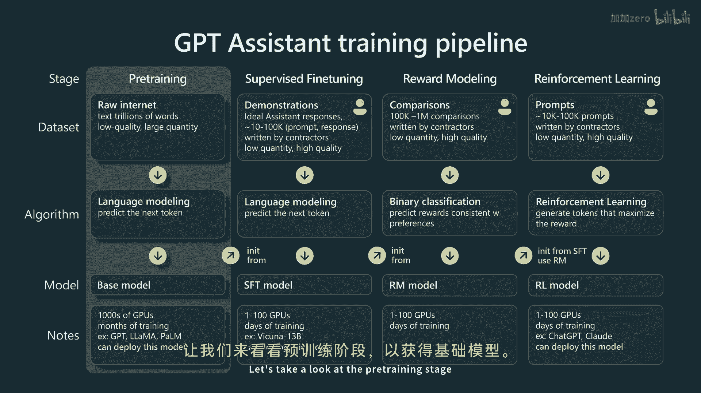

首先，我们将收集大量的数据，这里是我们称为的数据混合物，来自这篇论文，由 meta 发布，他们在那里发布了基于 llama 的模型，你现在可以看到大致进入这些收集的数据集种类。所以我们有 common crawl，这只是一个网络爬虫，来自四，这也是一种常见的爬虫，然后还有一些高质量的数据集，所以例如，GitHub，Wikipedia，书籍，档案，Stack，交易所，等等。这些都是混合在一起的，然后它们根据给定的比例进行采样。

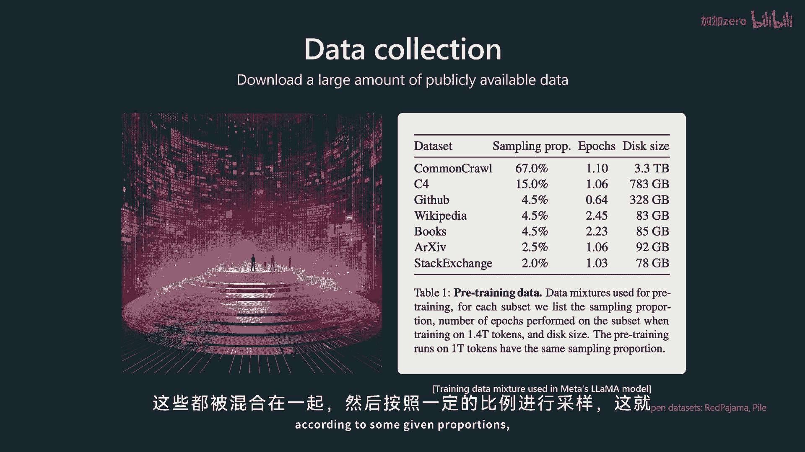

这就是神经网络和 GBT 的训练集，现在，在我们实际上可以训练这个数据之前，我们需要通过一个额外的预处理步骤，那就是分词，这基本上就是对原始文本的翻译，我们从互联网上抓取的文本被翻译成整数序列。因为那是 GBT 的 native 代表形式，现在这是一种无损的文本片段到标记和整数的翻译，在这个阶段有许多算法，通常，例如，你可以使用像字节对编码这样的东西，它迭代地将小文本片段合并并分组为标记。所以这里我展示了一些这些标记的例子，然后这是实际将输入到变压器的整数序列。

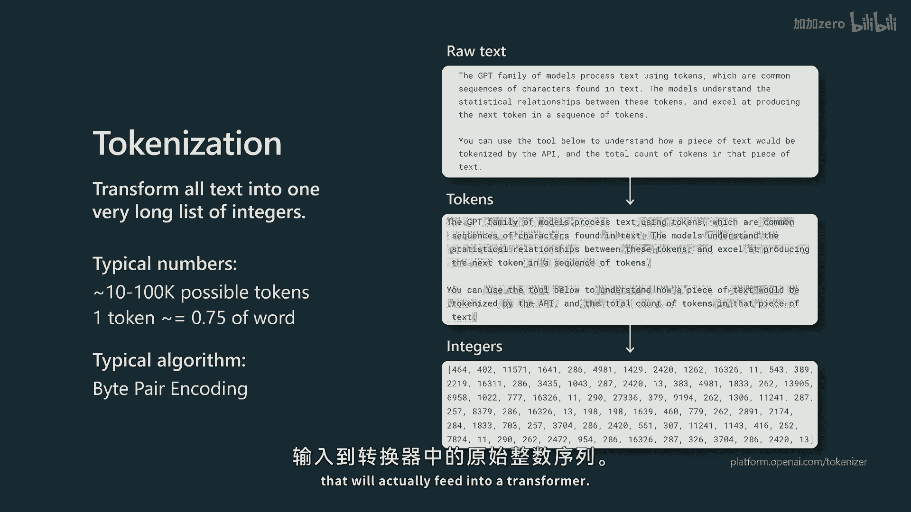

现在我在这里展示了两种像超参数一样治理这个阶段的例子，所以 gp four，我们没有发布太多关于它如何训练的信息等等，所以我在使用 gpt three s 的数字，但 gpt three 当然现在已经有点老了。大约三年前，但 llama 是元学习相当新的模式，所以这些是大约我们处理的数量级，当我们进行预训练时，词汇大小通常为数千个标记，上下文长度通常像两千，四千，甚至现在甚至一百万。这决定了 GBT 最多可以查看多少个整数，当它试图预测序列中的下一个整数时，你可以看到，大约 llama 现在有 65 亿个参数，尽管 llama 只有 65b 参数，与 gpt three 的 175 亿个参数相比。llama 是一个显著更强大的模式，直觉上，这是因为模型被训练了更长的时间，在这种情况下，一点，而不是仅仅 300 亿个标记，而是 4 万亿个标记，所以你不应该仅仅根据模型包含的参数来评估其力量，下面。

我正在展示一些关于粗糙超参数数量的表格，这些通常用于指定变换器神经网络，所以头的数量，维度大小，层数等，在底部我展示了一些训练超参数，例如，要训练六十五 b 模型，我使用了两千个 GPU。大约需要二十一天的训练时间，并且大约花费了几百万美元，所以，你应该记住这些大致的量级。

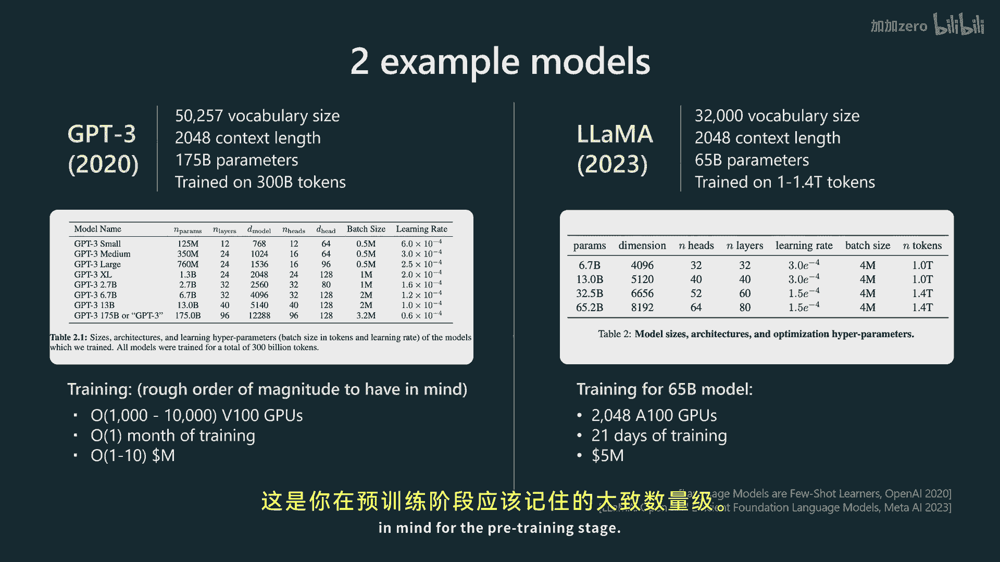

对于预训练阶段，现在当我们实际预训练时发生了什么，大致来说，我们将我们的标记符提取出来，并将它们布局成数据批次，所以我们有这些数组，它将输入到变换器，这些数组是 b，批次大小，这些是所有独立的示例。堆叠在行中，并且 b 由 t 组成，t 是最大的上下文长度，在我的图中我只有十个，上下文长度，这可能是两千，四千，等，这些是非常长的行，我们取这些文档，并将它们打包成行，我们使用这些特殊的结束标记符来分隔它们。基于变换器，当一个新文档开始时，所以我这里有一些文档的例子，然后我将它们拉伸成输入。

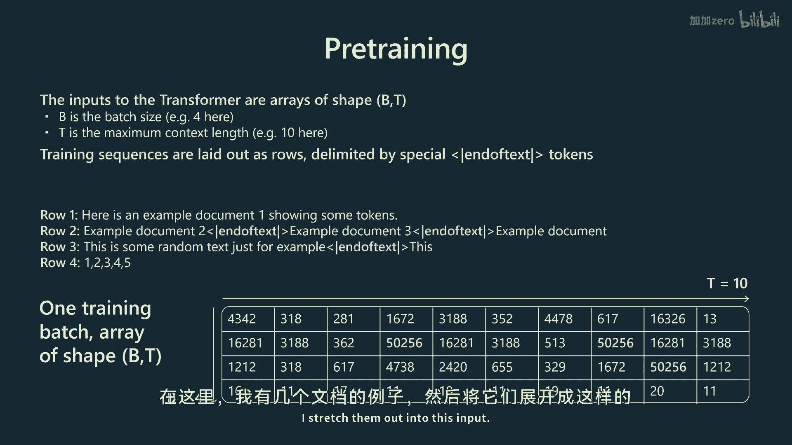

现在我们将所有这些数字输入到变换器，让我来专注于一个特定的单元格，但在这个图中的每个单元格都会这样做，让我们看绿色单元格，绿色单元格将查看它前面的所有标记符，所以所有黄色的标记符。我们将整个上下文输入到变换器神经网络，变换器将尝试预测序列中的下一个标记符，在这种情况下，红色，由于时间限制，我无法深入解释这个神经网络架构，不幸的是，不能详细解释这个巨大的神经网络结构。对于我们的目的，它是一个由许多神经网络组成的大块，通常包含数十亿个参数或类似的东西，当然，当你调整这些参数时，你会为每个单元格得到稍微不同的分布预测，例如。如果我们的词汇大小是五十万二千五百七十个标记符，那么我们将有那么多数字，因为我们需要指定下一个标记符的概率分布，所以基本上我们现在有一个对于接下来可能发生的任何事情的概率，在这个具体例子中。

对于这个特定的细胞，五百一十三将会接下来，所以我们可以使用这个作为监督的来源来更新我们的变压器权重，所以基本上我们应用这个在每个并行的单元格上，我们保持交换，交换批次，我们试图让变压器做出正确的预测。对于序列中下一个标记是什么。

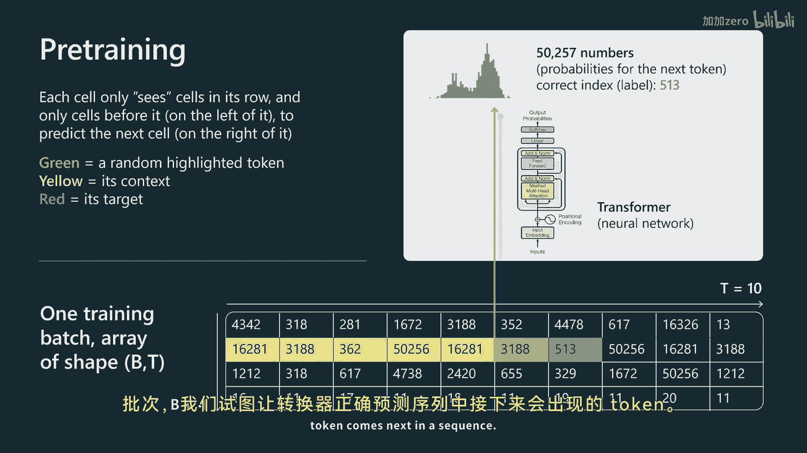

那么让我来更具体地展示这看起来什么样子，当你训练这些模型时，这实际上是来自纽约时报的，他们训练了一个小型的 gpt 在莎士比亚上，所以这里是莎士比亚的一小段，他们训练了 gpt 在它上，现在，开始时在初始化。gpt 开始时具有完全随机的权重，所以你也会得到完全随机的输出，但随着时间的推移，当你训练 gpt 越来越长时，你正从模型中获取越来越连贯和一致的样本，我们如何从它采样，当然，是你预测接下来会发生什么。你从那个分布中采样，并将那个反馈回到这个过程中，所以你基本上可以采样长序列，因此，到最后你看到变压器已经学习了单词，以及在哪里放置空格，在哪里放置逗号和如此等等，因此，随着时间的推移。我们正在做出越来越一致的预测。

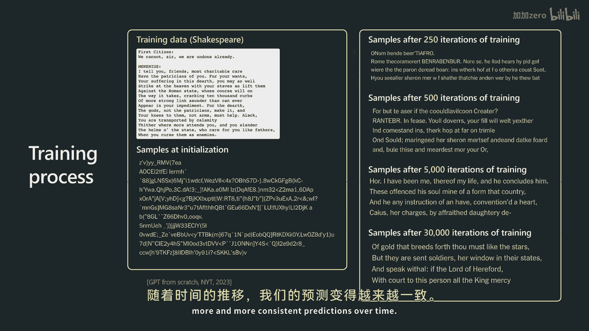

这些是你正在考虑的图表类型，当你有效地进行模型预训练时，我们正在查看训练过程中损失函数的变化，并且低损失意味着我们的变压器正在预测正确的，是给予序列中正确下一个整数更高的概率。现在我们将如何使用这个模型，一旦我们训练了一个月后。

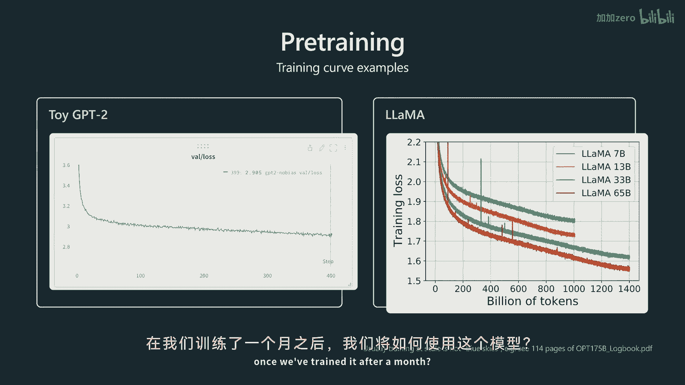

嗯，我们注意到领域内的第一个事情是这些模型，基本上在语言建模的过程中，学习非常强大的通用表示，而且你可以非常高效地微调它们，对于你可能感兴趣的任何下游任务，所以作为示例，如果你对情感分类感兴趣。以前使用的方法是收集大量的正面和负面样本，然后训练一种 NLP 模型来处理那个，但是新的方法是忽略情感分类，去干一个大型语言模型，预训练，训练一个大型变压器，然后你可能只有少数的例子。你可以非常高效地微调你的模式以完成那个任务。

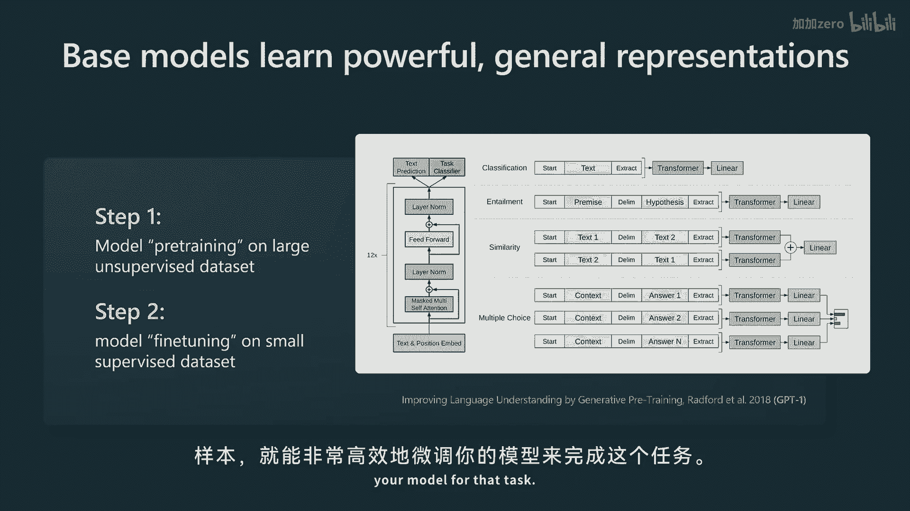

因此这在实践中工作得非常好，这是由于，基本上，变压器在语言模型任务中被迫承担大量的多任务，因为仅仅在预测下一个标记方面，它被迫理解很多关于文本结构的信息，以及其中的不同概念，这就是 gpt1。在 gpt2 的时间周围，人们注意到实际上比微调更好，你可以非常有效地提示这些模型，这些是语言模型，他们想要完成文档，所以你可以通过安排这些假文档来欺骗他们执行任务，例如，例如，我们有一些段落。然后我们像 q a q a q a 这样排序，这被称为少数示例提示，然后我们做 q，当变压器试图完成文档时，它实际上是在回答我们的问题，这就是提示工程的一个例子，基础模型，使它相信它正在模仿文档。并使它执行任务，因此，这抓住了，我认为是，提示超过微调，并看到这实际上可以在许多问题上工作得非常好，微调或如此。

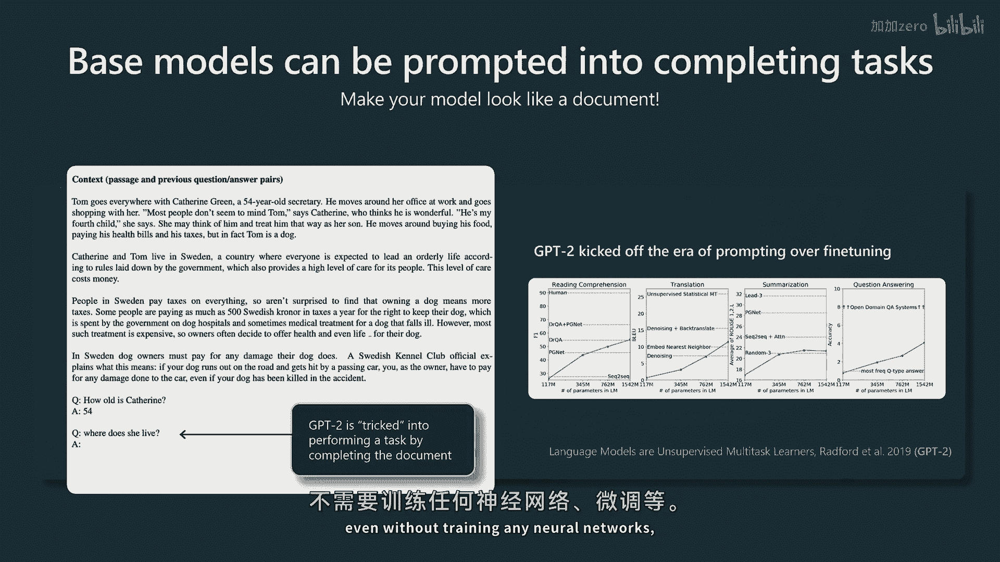

自从那时以来，我们已经看到了一个基于模型的整个进化树，每个人都训练过，不是所有这些模型都可用，例如，gpt4 的基础模型从未发布，你可能通过 api 交互的 gpt4 模型不是一个基础模型，它是一个助手模型。我们将在下一部分覆盖如何获取这些，基于 gpt3 的模型可以通过 api 以 da vinci 的名字获取，基于 gpt2 的模型甚至可用作我们 github 仓库中的权重。但目前可能最好的可用基础模型是 meta 的 llama 系列，尽管它未获得商业许可。

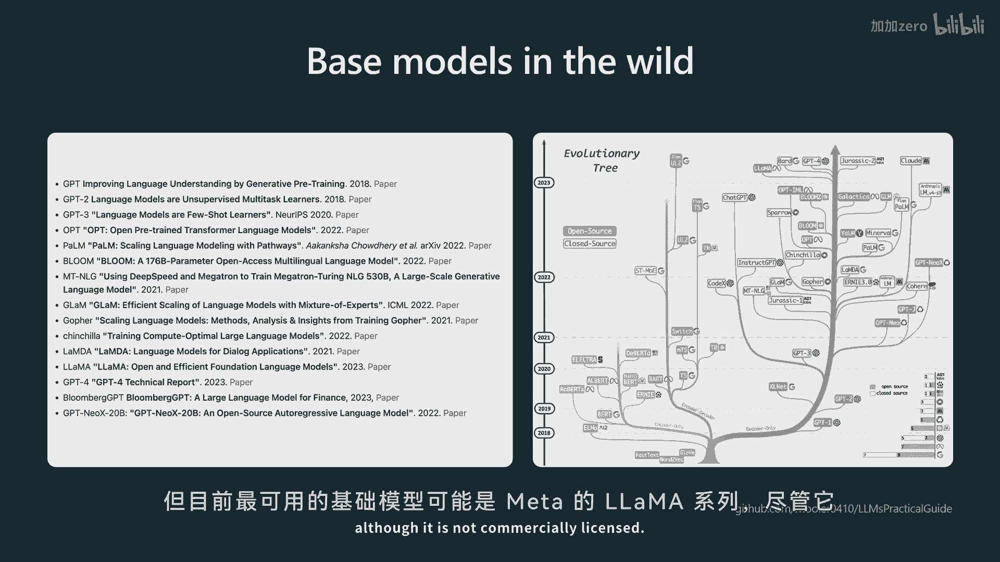

需要注意的是，棒球不是系统，他们不想回答你，他们不想回答你的问题，他们只是想完成文档，所以如果你告诉他们写一首关于面包和奶酪的诗，它将只会知道它会以更多的问题来回答，它只是在完成它认为的文档，但是。你可以以特定的方式提示它们，以使基于模型的工作更有可能成功，所以，例如，这里有一首关于面包和奶酪的诗，在这种情况下，它将能够自动完成。

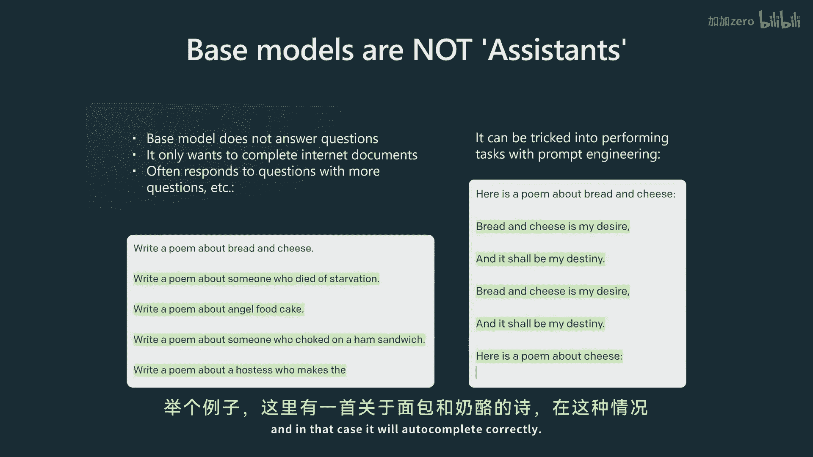

甚至你可以欺骗基于模型成为助手，你这样做的方法是，你会创建像几个短语的特定集，提示，使它看起来像人类和助手之间有一种文档，他们正在交换一些信息，然后在底部，你将你的查询放在末尾，基于模型将条件自己成为。像有帮助的助手并回答，但这并不可靠，在实践中并不工作得很好，尽管可以这样做，所以我们有另一种路径来创建真正的 GBT 助手，不仅仅是基于模型的文档完成者。

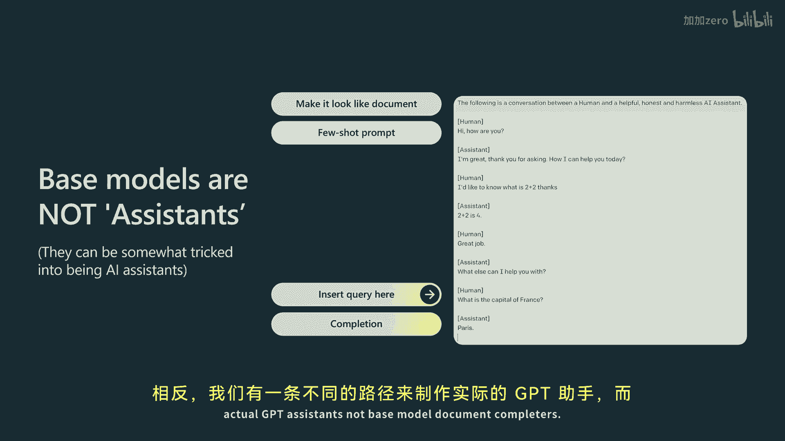

因此，我们将进入监督微调，所以在监督微调阶段，我们将收集小但高质量的数据集，在这种情况下，我们将要求人类承包商收集数据的格式，提示和理想响应，我们将收集很多这些，通常数十万或类似的数量，然后。我们将仍然在这个数据上进行语言建模，所以算法没有改变，我们只是更换了训练集，以前是互联网文档，这是一个高量的本地四，基本上 QA 提示响应类型的数据，这是低量的，高质量的，所以我们仍然进行语言建模，然后。训练后我们将得到 fd 模型，你可以实际部署这些模型，它们是真正的助手，它们工作到一定程度，让我展示一个可能的演示示例，所以这里是一个人类承包商可能提出的，这里是一个随机提示。你能写一篇关于术语垄断或类似的短介绍吗，然后，承包商也写出理想的响应，当他们写出这些响应时，他们正在遵循详细的标记文档，他们被要求有帮助的，真实的和无害的，在这里的标记指示你可能无法阅读它，我也不能。

但它们很长，这就是人们在遵循指示并试图完成这些提示的样子，这就是数据集的样子，你可以训练这些模型，并且这在一定程度上起作用，现在，你可以从这里继续管道，并进入 rhf 强化学习。来自包含奖励建模和强化学习的人类反馈，所以让我来覆盖那个，然后我会回来谈谈你可能想要经过额外步骤的原因，以及这与仅使用 fd 模型的比较。

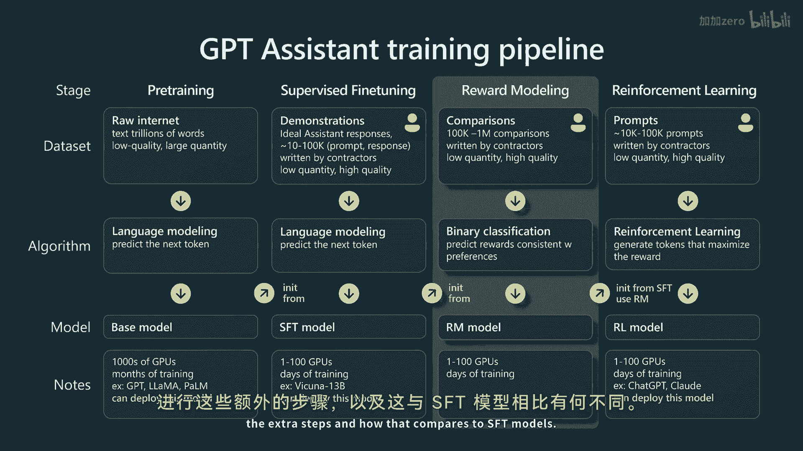

所以在奖励建模步骤中，我们将要做的是，我们现在将改变我们的数据收集形式为比较形式，所以这是我们的数据集将看起来的样子我有相同的提示，顶部有相同的提示，它要求助手编写一个程序或函数来检查。给定的字符串是否是回文，然后我们做的是，我们取我们已经训练好的 ft 模型，并创建多个完成，在这种情况下，我们模型创建了三个完成，然后我们问人们对这些完成的排名，所以如果你看一会儿，顺便说一句。这些是非常困难的事情来比较一些预测，这可能需要人们甚至几个小时来完成一个提示的完成对，但如果我们决定其中一个比其余的好得多，等等。

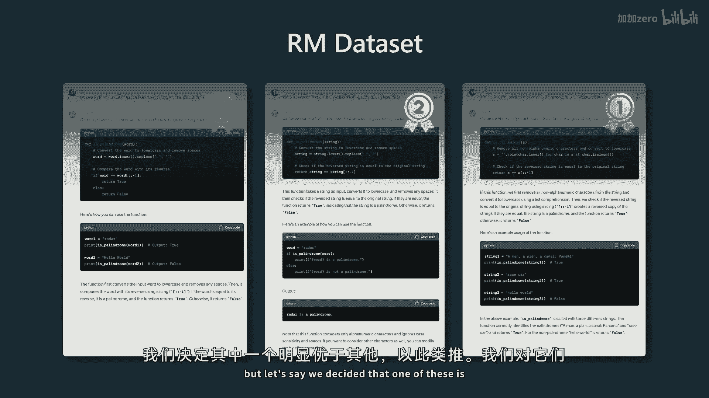

所以我们排了他们，然后我们可以跟随一些看起来非常像二进制分类的东西，在所有这些完成对之间，所以现在我们做的是，我们排列提示行，在这里，提示在所有三行中都是相同的，所以它是相同的提示，但完成的方式不同。所以黄色标记来自 smt 模型，然后我们做的是，我们附加一个特殊的奖励读出标记在末尾，我们基本上只监督变压器在这个单一的绿色标记上。

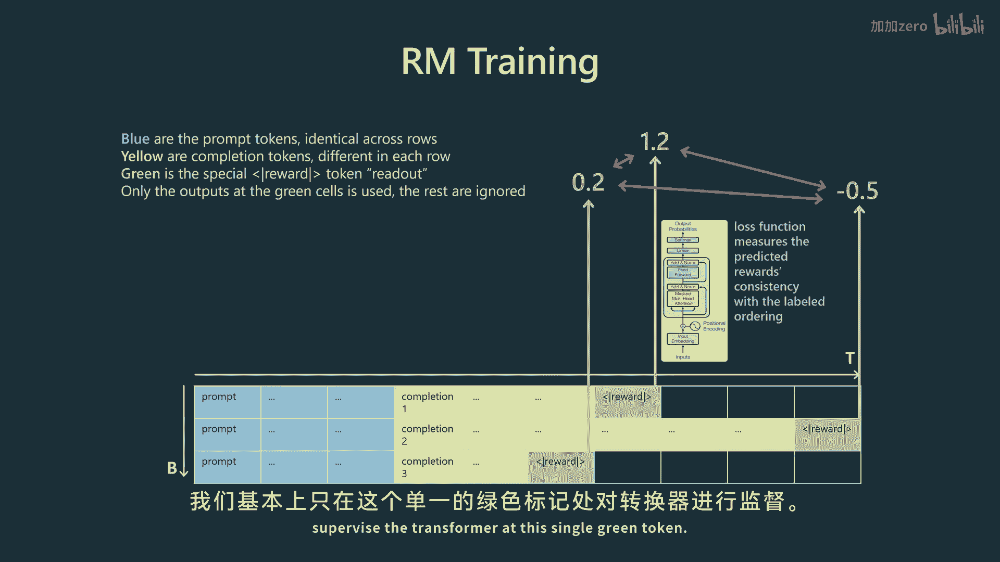

变压器将预测一个奖励，表示该完成对于提示的质量如何，所以基本上它猜测每个完成的质量，然后一旦它为所有它们做出了猜测，我们也有真实值，告诉我们它们的排名。所以我们实际上可以强制一些数字应该比其他数字高得多，等等，我们将这个形式化为损失函数，我们训练我们的模型，使奖励预测与真实值一致，来自所有这些承包商的比较，这就是我们如何训练我们的奖励模型。这允许我们评估一个完成对于提示的质量，一旦我们有了奖励模型，我们不能部署这个，因为这个对助手本身并不很有用，但它对于现在跟随的强化学习阶段非常有用，因为我们有奖励模型。我们可以评估任意完成对于任何给定提示的质量，在强化学习中，我们基本上再次获得一大集合提示，现在，我们将根据奖励模型进行强化学习，我们基本上再次获得一大集合提示。

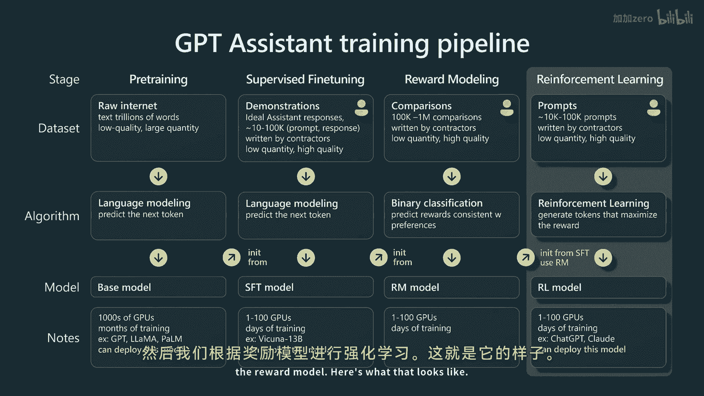

所以这就是它看起来的样子，我们接受一个提示，我们将其排列成行，现在，我们使用，我们基本上使用我们希望训练的模型，该模型在**sfmodel**中初始化，以创建一些黄色的完成，然后，我们再次附上奖励标记。我们根据奖励模型读取奖励，该模型现在保持固定。

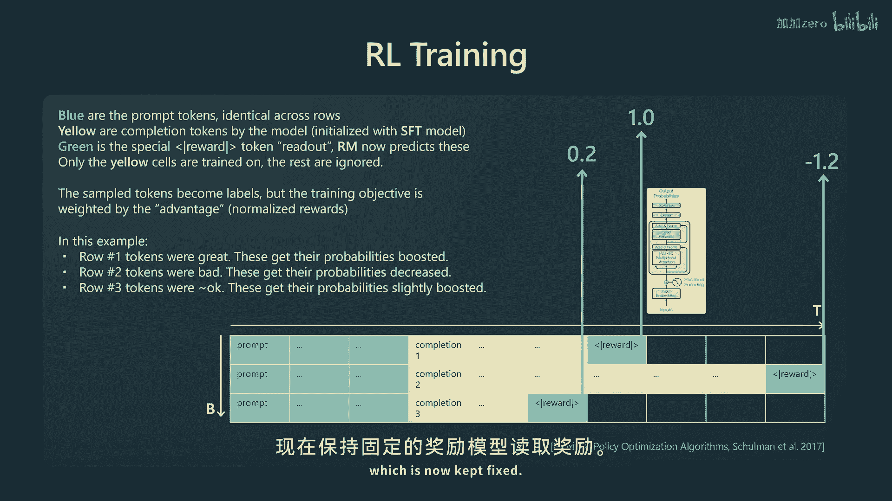

它不再改变，现在，奖励模型告诉我们每项完成的质量，对于这些提示，我们可以为每个提示执行，因此，我们可以做的事情是，我们现在可以基本上应用相同的语言模型损失函数，但我们目前正在训练在黄色标记的标记上。我们正在通过奖励模型指示的奖励来加权语言模型目标，例如，在第一行，奖励模型说这是一项相对高分的完成，因此，我们在第一行偶然采样的所有标记都将得到强化，而且他们对未来的概率将会更高，相反，在第二行。奖励模型确实不喜欢这个完成，负一点二，所以，因此，我们在第二行采样的每一个标记，都将会获得一点点更高的未来概率，我们这样做一遍又一遍，在许多提示上，在许多批次中。基本上我们得到一个在这里创建黄色标记的政策，基本上所有这些，这里的所有完成都将得分高，根据我们在前一个阶段训练的奖励模型，这就是我们如何训练的，这就是**rhf**管道现在的样子。

然后最后你将得到一个你可以部署的模型，所以以为例子，**Chachi pt**是**rh 模型**，但是，你可能遇到的一些其他模型，如，例如，**kua 十三 b**等，这些是**fd 模型**，所以我们有基础模型，模型和我们的模型。

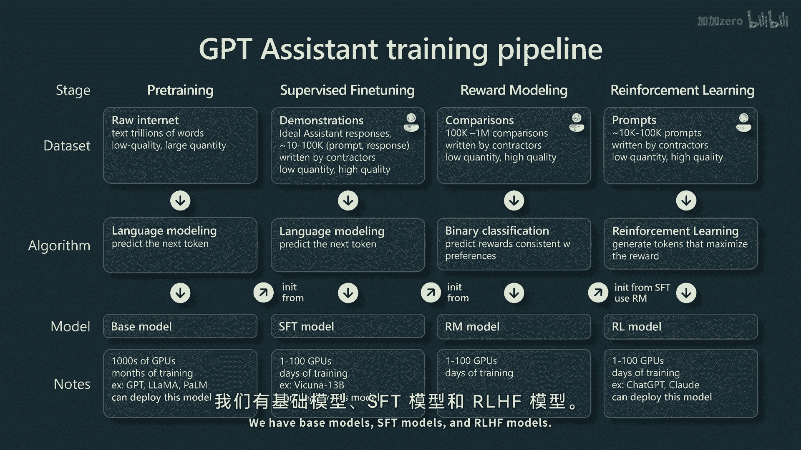

这就是现在那边的情况，你为什么想要做**rhf**，所以有一种答案并不是那么激动人心，是它工作得更好，这来自**instruct gbt paper**，根据这些以前的实验。

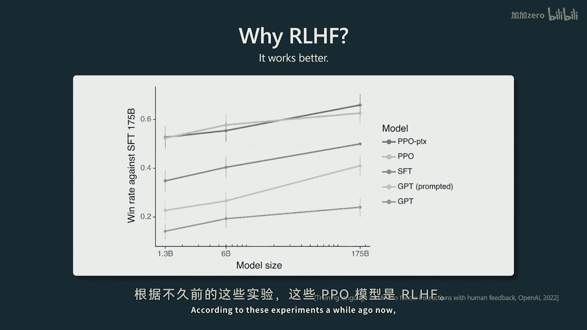

现在这些**ppo 模型**是**rhf**，我们看到它们在许多比较中基本上被偏好，当我们把它们给人类，所以人类基本上更喜欢来自我们模型知识的标记，与**ft 模型**相比，与基础模型相比，这是被提示作为助手的，因此它工作得更好。但你可能会问为什么，为什么它工作更好，我认为没有像样的答案，社区真正一致同意的，但我会提出一个可能的原因，这与生成与比较的计算复杂性有关，所以让我们以生成俳句为例，假设我让模型写一首关于**订书机**的俳句。如果你是一个承包商，试图提供训练数据，那么想象你是一个承包商，收集基本数据用于阶段，你如何为订书机创建一首美丽的俳句，你可能不会很擅长那个。

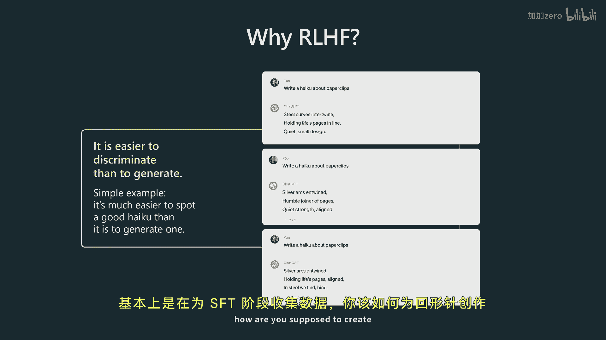

但如果我给你一些**俳句**的例子，你可能能欣赏这些俳句中的一些比其他的更多，因此判断这些哪一个是好的是一项更容易的任务，因此，这种不对称使得，所以比较可能是一种更有效的方式，可能利用您作为人类的判断力。来创建一个稍微更好的模型，我们的模型知识并不总是对基础模型的改进，在某些情况下，它们并不严格优于基础模型，特别是在我们注意到，例如，它们失去了一些熵，这意味着它们给出了更多的**pt**结果。他们可以输出更低的变化，例如，他们可以输出样本，与基础模型相比，变化更小，基础模型有很多熵，并将产生许多多样的输出，例如，我还是更喜欢在设置中使用基础模型。

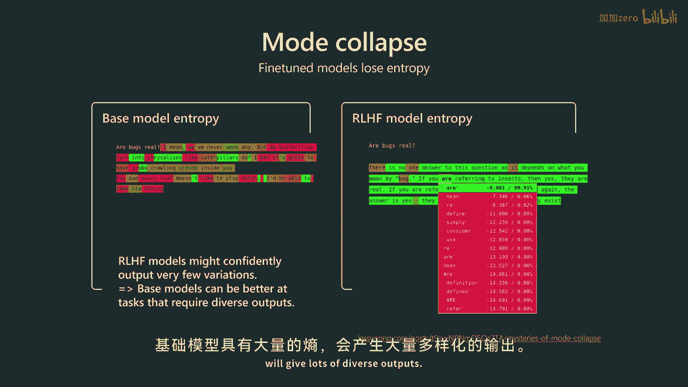

在那里你基本上有 n 件事。

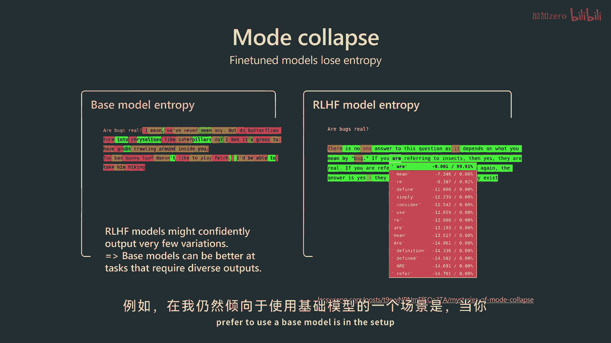

你想要生成更多的类似事物，这里是我随便烹饪的一个例子，我想生成酷的**宝可梦**名字，我给了它七个宝可梦名字，我问基础模型完成文档，它给了我很多宝可梦名字，这些都是虚构的，我试图锁定它们。我不相信它们是真正的宝可梦，我认为基础模型在这种任务中会很好。

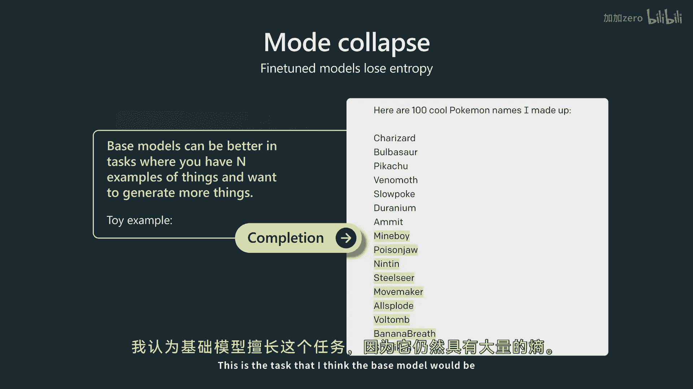

因为它仍然有很多熵，它会给你很多不同且酷炫的东西，有点像各种各样的东西，你在给之前，所以这就是这个数字所说的所有，这些有点像可能可用的助手模型，到现在，**伯克利**有一个团队排名了很多可用的助手模型，并给他们基本上给了语言表达能力评分，所以目前一些最好的模型，当然是**gpt 四**远远领先，我会说，接着是**克劳德**，**GBT 三点五**，然后一个数量模型，其中一些可能会作为权重提供，如**库纳**，**考拉**，等，并且这里的前三行。它们全都是相关的，**厨师模型**，根据我所知，其他的所有模型都是**fd 模型**。

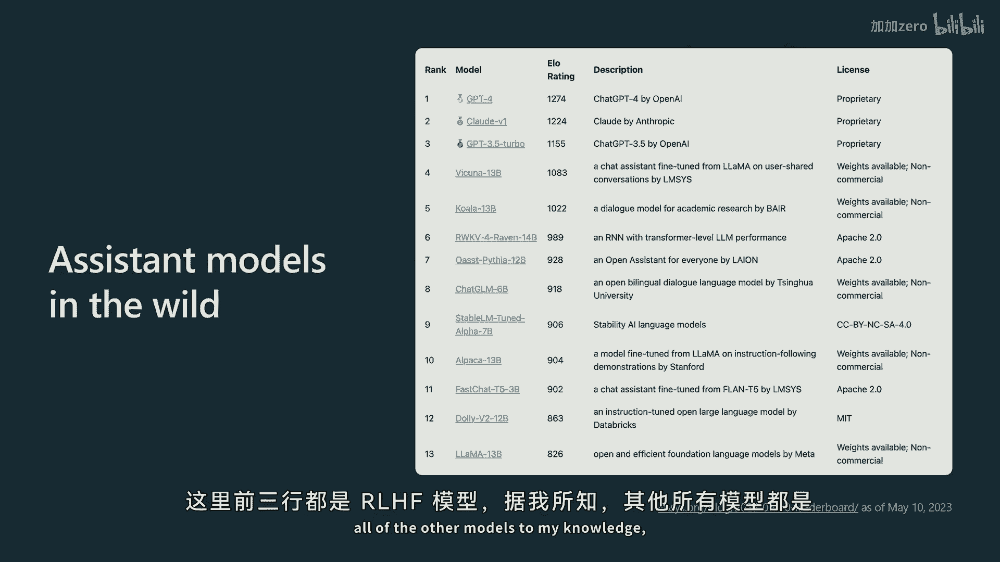

我相信，好的，这就是我们如何在高层次上训练这些模型的方式，现在我要转换话题，让我们看看如何最好地将**gpt t 助手模型**应用到您的问题中，现在我希望工作在一个具体的例子中。所以让我们让我们在这里工作一个具体的例子，假设您正在写一篇文章或博客帖子，并且您要在最后写这句话，加利福尼亚的人口是阿拉斯加的五三倍，所以，出于某种原因，你想要比较这两个州的人口。思考一下丰富的内心独白和工具使用，以及你的大脑中实际计算的工作量，来生成这个最后的句子，所以，这可能在你的大脑中看起来像这样，好的，对于这个下一步，让我来写我的博客，让我来比较这两个人口，好的，首先。我显然需要现在获取这两个人口，我知道我可能对这些人口没有从脑海中立即想起，所以我对所知道的有些了解。

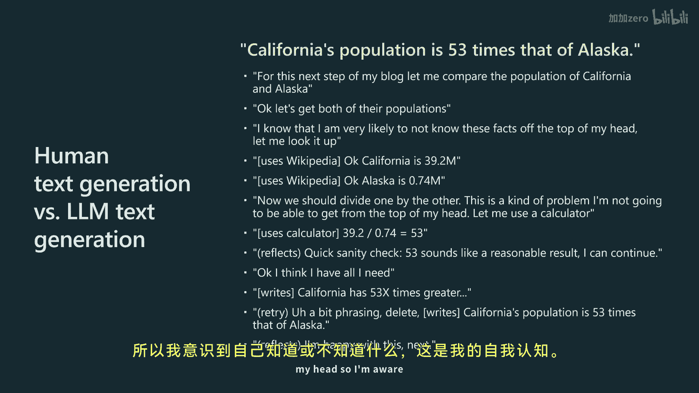

或者对自己的知识并不了解，所以，我进行一些工具使用，我去了**维基百科**，我查看了加利福尼亚的人口和阿拉斯加的人口，现在我知道我应该将两者相除，但是，我又知道将 3.92 除以 0.074 是非常不可能成功的。这不是我能在脑海中做的事情，因此，我将依赖计算器，所以我将使用计算器，输入后，输出大约为五十三，然后，我可能会在大脑中进行一些反思和理智检查，那么，五十三是否合理，这是一个相当大的比例，但是，加利福尼亚州是人口最多的州，所以这可能看起来不错，然后，我有可能需要的所有信息，现在，我来到写作的创造性部分，我可能开始写一些像加利福尼亚州有五十三倍于的，然后我想到自己实际上这是非常尴尬的表达。所以让我实际上删除它，让我再试一次，当我在写作时，我有一个单独的过程，几乎检查我正在写的内容并判断，它是否看起来好，然后，我可能删除并重新框架它，然后，我可能对结果满意，所以，总的来说。

在你创建这样的句子时，许多事情在你的内心独白中发生，但从 GPT 的角度看，这样的句子是什么样的。当我们训练 GPT 时，从 GPT 的视角来看，这只是一个标记序列。当它阅读或生成这些标记时，它只是咔嚓咔嚓咔嚓咔嚓，每个片段对每个标记进行相同的计算工作。这些变换器并不是很浅的网络，它们有约八十层的推理，但八十仍然不像太多。因此，这个变换器将尽力模仿，当然。这里的过程与您的过程看起来非常不同，特别是在我们的最终产品中，在我们创建的数据集中，然后最终喂给`LMS`，所有的内部对话都被完全剥离。与您不同，GPT 将查看每个标记，并花费相同的计算资源在每个标记上。因此，你不能期望它做得很好，不能期望它做太多的工作，对于每个标记。因此，基本上这些变换器就像标记模拟器，它们不知道它们不知道什么，就像它们只是模仿下一个标记。

他们并不知道自己擅长什么或不擅长什么，只是在尽力模仿下一个标记，他们在循环中不反思，没有理智，检查任何事情。在过程中不纠正错误，默认情况下，他们只是采样标记序列。他们的头脑中没有单独的内在独白流，对，他们正在评估当前的情况。

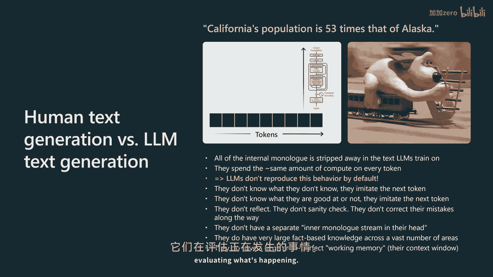

他们确实具有一些认知优势，我认为，那就是他们实际上在广泛的领域拥有大量的事实知识，因为他们有数十亿个参数，这是一种对大量事实的许多存储。但是，我认为他们也有一个相对较大且完美的工作记忆。无论固定在什么上下文中，都是立即可用给变压器的，通过其内部的自我注意力机制，因此，它像完美的记忆一样，然而，它有一个有限的大小，但变压器可以直接访问它。因此它可以像无损地记住任何在其上下文中的东西，这就是我比较这两者的方式。我认为提示在很大程度上只是弥补这两种架构之间的认知差异，像我们的大脑和`llm`的大脑。你可以这样看，几乎在这里是有一件事人们发现例如在实践中工作得很好，尤其是如果你的任务需要推理。你不能期望变换器对每个标记进行太多的推理，因此，你必须真正地将推理分散到更多的标记上，例如。

你不能给变换器一个非常复杂的问题，并期望它能在一个标记中得到答案，它没有时间。这些变换器需要标记来思考，引号，我喜欢说有时候。因此，这就是一些工作良好的事情，你可能，例如。有一些展示**Transformer**的短语提示，它应该像展示其工作一样，当它回答一个问题时。如果你给出一些例子，变换器将模仿那个模板，并将在评估方面工作得更好。

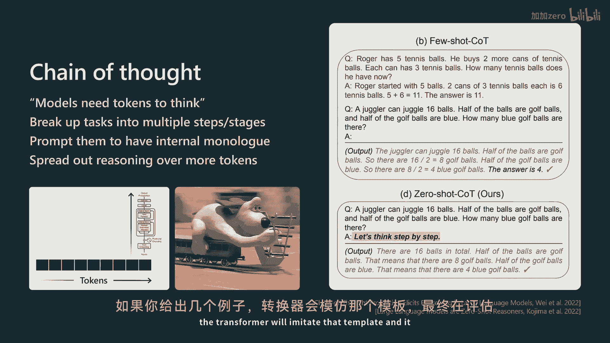

此外，你可以通过这种方式从变压器中提取这种行为，让我们一步一步来思考。这使得变压器条件化为一种展示其工作的方式，并且因为它似乎进入了一种展示其工作的模式，它每处理一个标记将做更少的计算工作，因此更有可能成功。因为它的推理速度随着时间的推移越来越慢，这是另一个例子，被称为**自我一致性**。我们看到我们有能力开始写作，如果它不起作用，我可以再试一次，我可以尝试多次，也许选择最好的一个。在这些方法中，你不仅仅采样一次，你可能多次采样，然后我有一些过程来找到好样本，并只保留这些样本，或进行多数投票，或类似的事情。因此，基本上这些变压器在过程中，当他们预测下一个标记时，就像你。他们可以运气不好，可能采样到一个不好的标记。

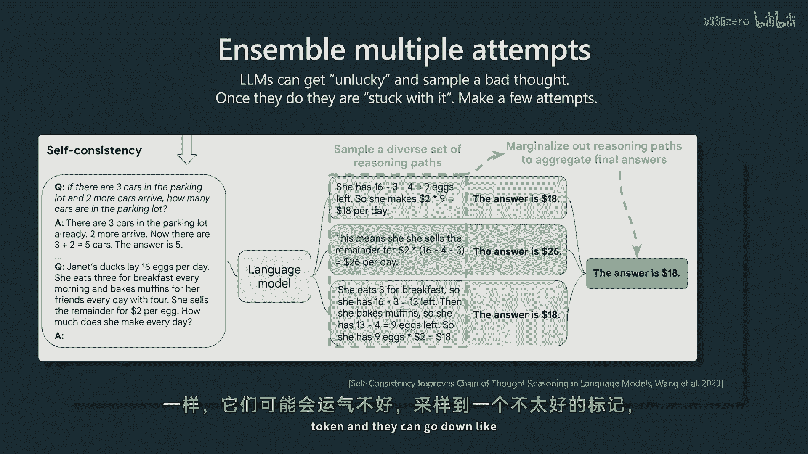

他们可以陷入一种像盲巷的推理，和你不同，他们无法从那里恢复，被困于他们采样的每个标记中，所以他们将继续序列，即使他们知道这个序列不会成功。因此，给他们看回的能力，检查或尝试基本上采样周围。这里有一种技术，此外，你可以让`llm`这样的模型知道他们何时犯错误。例如，你问模型生成一首诗，这首诗不押韵，它可能会给你一首诗，但实际上它押韵。但对于更大的模型，像**gpt-4**，你可以问它是否完成了任务。实际上，gpt-4 非常清楚它没有完成任务，只是在采样时运气不好。它会告诉你“不，我在这里没有完成任务，让我再试一次”，但是，如果没有你提示它，它甚至不喜欢，不知道如何重新访问。因此，你必须为此做出补偿，在你的提示中，让它检查。如果你不要求它检查，它不会自己检查，这只是一个令牌模拟器。

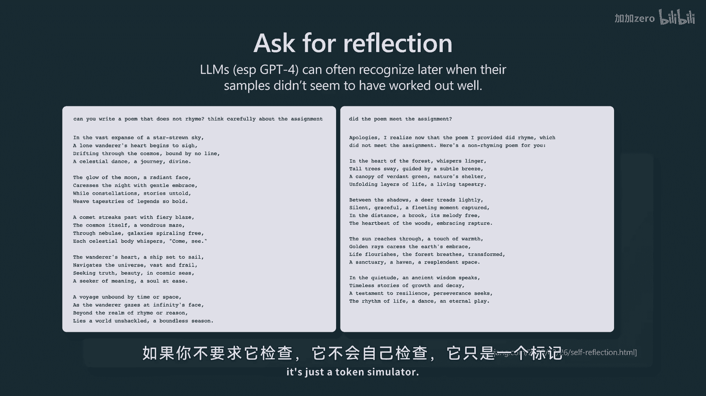

我认为更广泛地说，许多这些技术都落入我所说的类别中，并重新创建我们的系统。你可能熟悉**系统一**和**系统二**的思考方式，系统一是一个快速的自动过程，大致对应于像`llm`一样的采样令牌。而系统二是较慢的深思熟虑的规划，某种程度上是你大脑的一部分。这实际上是上周的一篇论文，因为这个空间正在迅速发展，被称为**思想树**，在思想树中，这篇论文的作者提出了，为任何给定的提示保持多个完成。他们在途中评分，并保留表现良好的那些。如果这有意义，很多人都在玩一种叫做**提示工程**的东西，基本上恢复我们大脑中似乎拥有的一些能力，以供`llms`使用。我在这里要指出的是，这不仅仅是一个提示。这实际上是一些一起使用 Python 胶水代码的提示，因为你需要维护多个提示，在这里，你需要进行一些树搜索算法，找出哪些提示需要扩展，等等。

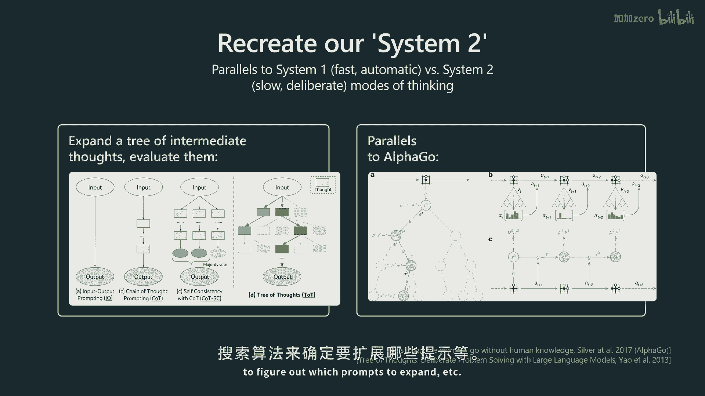

所以它是 Python 胶水代码和个别提示的共生，这些提示在`while`循环或更大算法中被调用。我认为这里有一个非常酷的平行之处，与**阿尔法狗**相似，阿尔法狗在玩围棋时，有放置下一颗石的策略。这一战略最初是通过模仿人类来训练的，除了这一战略，它还做蒙特卡洛树搜索，基本上，它会在头脑中玩出许多可能性，并评估所有这些可能性，并只保留那些效果好的可能性。因此，我认为这相当于阿尔法狗。对于文本，如果这有意义，像思维树一样，我认为人们开始更广泛地探索更一般的技术，不仅仅是简单的问题答案提示，而是看起来更像 Python 胶水代码的东西，将许多提示串在一起。所以右边，我有一个来自这篇论文的例子叫做**React**，他们结构化对提示的答案，作为动作观察序列，思考动作观察，并且这是一个完整的部署，一种回答查询的思考过程，在这些行动中，模型也被允许在左侧使用工具。

我有一个**AutoGPT**的例子，并且现在 AutoGPT，顺便说一句，AutoGPT 是一个我认为最近得到了很多关注的项目。但我仍然认为它以一种启发性的方式很有趣。它是一个允许`LLM`保持任务列表的项目，并继续递归分解任务，我认为这目前并不工作得很好。我也不建议人们在实际应用中使用它，只是认为它从何处去可以提供一些一般性的灵感，随着时间的推移。

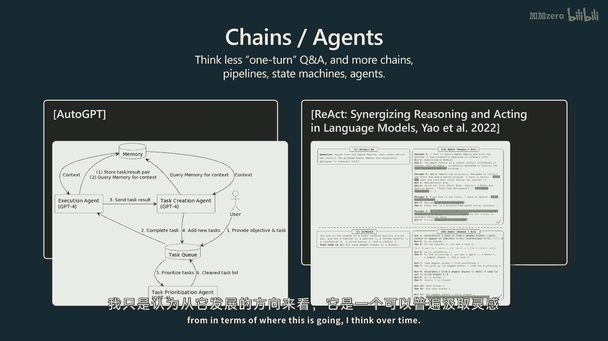

所以这就像我们的系统让模型思考一样，下一个我找到的挺有趣的事情，是遵循生存可能会说几乎心理的 LMS 的怪癖，那就是 LMS 不想成功，他们想要模仿，你想要成功，你应该要求它，所以这意味着。当 Transformer 被训练时，他们有训练集，并且可以在他们的训练数据中存在性能质量的整个谱系，例如，可能会有一个关于物理问题的提示，或者是像这样的，并且可能有一个完全错误的学生解决方案。但也可能有一个专家答案，非常正确，Transformer 无法区分，比如，你看，我的意思是，他们知道他们知道关于低质量的解决方案和高质量的解决方案，但他们默认想要模仿所有的它。因为他们只是训练在语言模型上，所以在测试时，实际上你需要要求好的性能，所以在这个例子中，在这个论文中，他们尝试了各种提示，让我们一步一步来，这种方法非常强大，因为它就像是将推理分散在许多标记上，所以。

在这个例子中，他们尝试了各种提示，因为就像是将推理分散在许多标记上，但是，效果更好的是，让我们一步一步来确保我们有正确的答案。

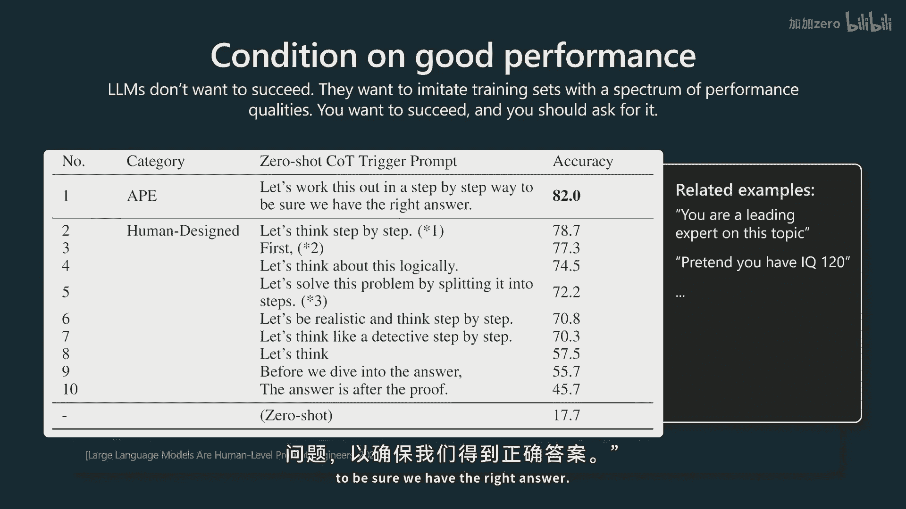

所以，这就有点像在得到正确答案后的条件化，而且，这实际上使变压器工作更好，因为变压器不再需要现在分散其概率质量，在听起来如此荒谬的低质量解决方案上，所以，基本上不要害怕要求强解决方案。可以说你是这个主题的领先专家，假装你有 iq120 等，但不要尝试要太多，iq，因为如果你问 iq 像 400 这样，你可能超出数据分布，甚至更糟，你可能在科幻数据分布中，并且它会开始像，删除一些科幻或角色扮演。或类似的东西，所以你必须找到正确的 iq 量，我认为它有一个 U 形的曲线在那里，接下来，当我们试图解决问题时，我们看到，我们知道我们擅长什么和不擅长什么，我们依赖工具，从计算上看。你可能也想对你的 llms 这样做，因此，特别是在特定情况下，我们可能想要给他们计算器、代码解释器和如此等等，搜索的能力，有很多技术可以做到这一点，记住一件事，这些变压器默认可能不知道它们不知道什么。

所以你甚至可能想在提示中告诉变压器，你对心算不是很擅长，每当你需要做非常大的数字加法、乘法或其他计算时。

相反，使用此计算器，这里是如何使用计算器的，使用此标记组合等，所以你必须实际说出来，因为模型默认不知道它擅长或不擅长什么，必然地，就像你和我和我可能接下来，我认为一个非常有趣的事情是。我们从一个只检索的世界转向了另一个极端，摆锤已经从一个极端摇摆到另一个极端，在所有地方都是记忆，但实际上，在这两个检索和记忆之间的整个空间中，有增强模型，这在实践中工作得非常好，如我所说。一个变压器的工作记忆是其上下文窗口，如果你可以将与任务相关的任何信息加载到工作记忆中，模型将工作得非常出色，因为它可以立即访问所有那内存，因此我认为很多人对基本检索非常感兴趣，增强生成。在底部我有像 llama index 的例子，这是一种与许多不同类型数据连接的数据连接器，你可以做任何事情，你可以索引所有数据，你可以使这些数据对 lms 和新兴的食谱可访问。

你取相关的文档，你将它们分割成块，你将所有它们嵌入，你基本上得到表示数据的嵌入向量，你将其存储在向量存储中，然后在测试时间，你对向量存储进行某种查询，你检索可能与你的任务相关的块，你将它们填充到提示中。然后你生成，因此这在实践中可以工作得很好，所以我认为这与，当你和我解决问题时，你可以从记忆中做任何事情，transformers 有大量的和广泛的记忆，但也确实帮助参考一些主要文档。所以每当你发现自己需要回到教科书中查找某事，或每当你发现自己需要回到库的文档中查找某事，transformers，当我这样做时，我也有，你也有一些关于库文档记忆，但它更好去看，所以这里也适用。接下来我想简要谈谈约束，提示我也发现这非常有趣，这基本上是技术，用于，迫使 llms 的输出遵循特定模板，指导是微软实际上的一个例子，在这里我们强制 llm 的输出将是 json。

这将实际上保证输出将采取这种形式，因为他们输入，并且，他们操纵、变换器可能产生的所有不同标记的概率，他们压缩这些标记，然后变换器只在这里填充空白，并且你可以对可能填充在这些空白处的内容施加额外的限制。这可能非常有用，我认为这种约束采样也非常有趣，我还想谈谈微调。

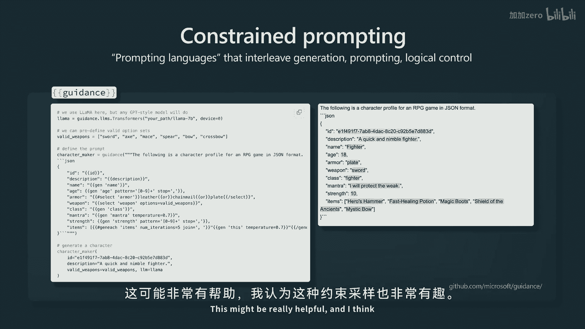

确实，你可以通过提示工程走得很远，它是这样，你可以通过微调得到非常出色的结果，但是，你现在也可以考虑微调你的模型，微调模型意味着你真的要去改变模型的权重，在实际操作中，这样做变得越来越容易。这是因为最近开发了一系列技术，并有相应的库，所以，例如，像 laura 这样参数高效的微调技术，确保你只训练，你只训练模型的小部分，稀疏的部分，所以，模型的大部分都被固定在基础模型上。并且其中一些部分是可以改变的，而且这种方法在实践中仍然效果良好，使得调整变得更加便宜，只有你模型的小部分。

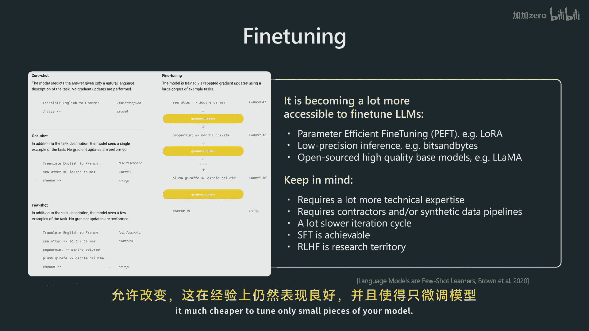

此外，这也意味着因为你的大部分模型都被固定，你可以使用非常低的精度进行推理来计算这些部分，因为它们不会被梯度下降更新，因此这也使得一切都变得更加高效，此外。我们还目前有一系列开源的高质量基于模型的当前版本，如我所说，我认为羊驼相当不错，尽管它没有商业许可证，我相信现在，需要注意的是，基本上的微调技术上涉及很多，它需要很多，我认为需要技术专业知识来做对。它需要数据集和人工数据合同者，或者合成数据管道，这些可能会很复杂，这将肯定会大大减缓您的迭代周期，总的来说，Sf 是可实现的，因为它只是您继续语言模型任务的问题，它相对直接，但我们的厨师。我认为是非常研究领域的，甚至更难以开始工作，所以我可能不建议某人只是尝试自己实现 rh，这些事情都很不稳定，非常难以训练，我认为这不是目前对初学者非常友好的事情，并且也有可能在未来仍然迅速变化。

所以我认为这些现在是我推荐的默认设置，我会将你的任务分解为两个主要部分，一部分是达到最佳性能，另一部分是在那个顺序中优化性能，一部分是目前来自 gt four 模型的最佳性能，它是最强大的模型。使用非常详细的提示，它们有很多任务内容、相关信息和指示，以你会告诉任务承包商的方式思考，如果他们无法通过电子邮件回复你，但也要记住，任务承包商是人类，他们有内心的独白，他们非常聪明等等。llms 不具备这些特性，所以请确保考虑到 llms 的心理学，几乎和针对这些检索的定制提示，并向这些提示添加任何相关的上下文和信息，基本上指的是许多提示工程技术，其中一些在上述幻灯片中被突出显示。但这是一个非常大的空间，我建议你网上查找提示工程技术，那儿有很多内容可以覆盖，尝试一些短示例，这意味着你不仅想告诉他们你想要展示的内容，每当可能的时候，所以给它们提供所有帮助它真正理解你的意思的例子。

如果你可以尝试使用工具和插件，来卸载对于 llms 原生来说困难的任务，然后考虑不仅仅是一个提示和一个答案，考虑潜在的链和反思，以及你如何将它们粘合在一起，以及你可能制作多个样本等，最后。如果你认为已经榨干了提示工程，我认为你应该坚持一段时间，看看是否有可能微调模型以适应你的应用程序，但预期这将需要更多的时间和参与，在这里有一个专家脆弱的研究区，我称之为 rhf，目前比 ft 工作得更好。如果你能成功，但这需要相当大的参与，我的意思是。

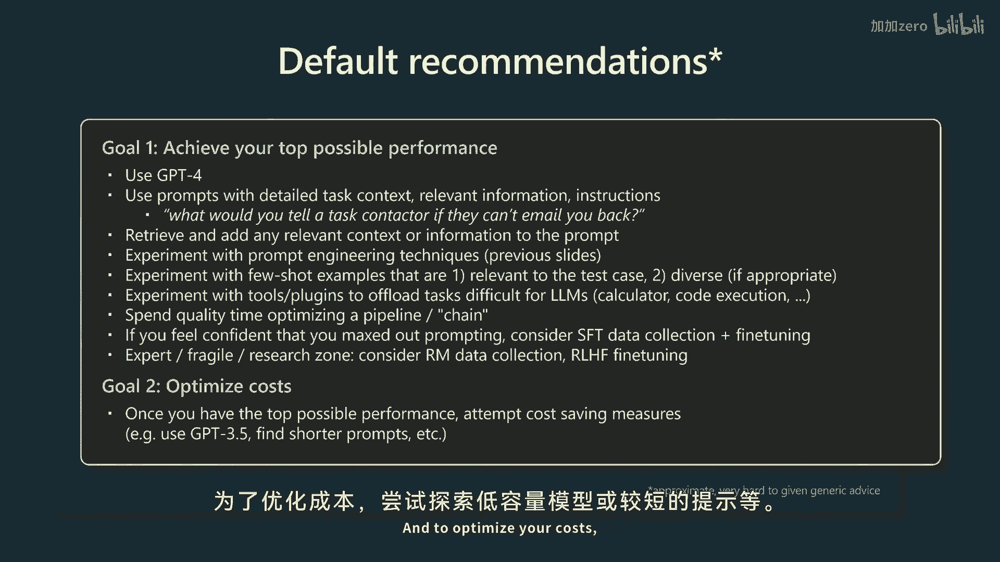

为了优化成本，尝试探索容量较低的模型或更短的提示等，我还想谈谈使用案例，我认为 llms 目前非常适合的领域，所以请注意，llms 今天有许多限制，所以我将始终记住这一点，适用于所有你的应用程序和模型。顺便说一句，这可能是一个完整的演讲，所以我没有时间详细覆盖它，模型可能存在偏见，它们可能制造幻觉信息，它们可能存在推理错误，它们可能在整个应用类别中挣扎，它们有知识截止点。所以它们可能不知道任何信息超过，例如，2021 年 9 月 20 日，它们容易受到一系列攻击，这些攻击就像是每天在推特上发布，包括提示注入、越狱攻击、数据污染攻击等。所以我现在的建议是在使用低风险的应用中使用 lms。

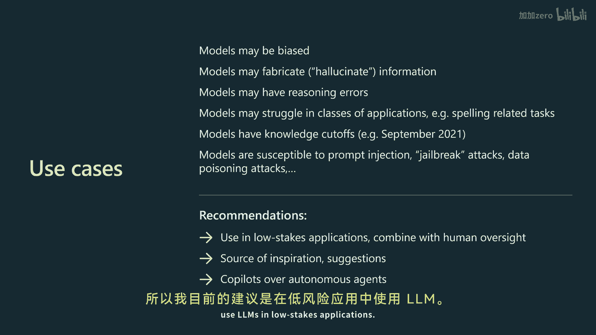

总是与他们结合，并有人类监督，将他们用作灵感和建议的来源，并思考副驾驶而不是完全自主的代理，它们就像在某处执行任务一样，但现在不清楚模型是否在那里，所以我想以这种方式结束，gpt 四是一个惊人的艺术品。我非常感谢它的存在，而且它非常美丽，它包含了如此多的知识，覆盖了这么多领域，它可以做数学、代码等等。此外，还有这繁荣的生态系统，正在被构建并融入到这个生态系统中，我之前提到的一些事情，以及所有这些力量都触手可及。

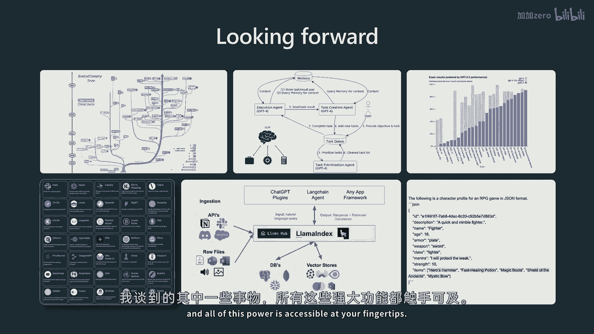

所以，这就是在代码方面所需的一切，询问，向 gpt 提问，引发它并获取响应，在这种情况下，我说，你能说一些激励微软构建 2023 年观众群的话吗，然后我在 Python 中输入并逐字复制。

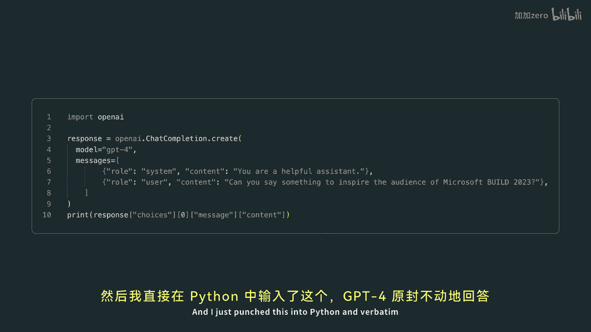

gpt 四说以下内容，顺便说一句，我不知道他们在关键演讲中使用了这个技巧，所以我认为我很聪明，但是，它在这方面真的很擅长，它说，女士们、创新者和推广者，微软构建 2023 年。欢迎来到才智卓越的人们的聚会，无与伦比，你们是未来的建筑师，塑造人类繁荣的数字领域的愿景家，拥抱科技的无限可能，让你们的想法像想象力一样高飞，让我们一起创造一个更加连接、令人惊叹和包容的未来世界。准备好释放你们的创造力，画布，未知，并将梦想变为现实。

