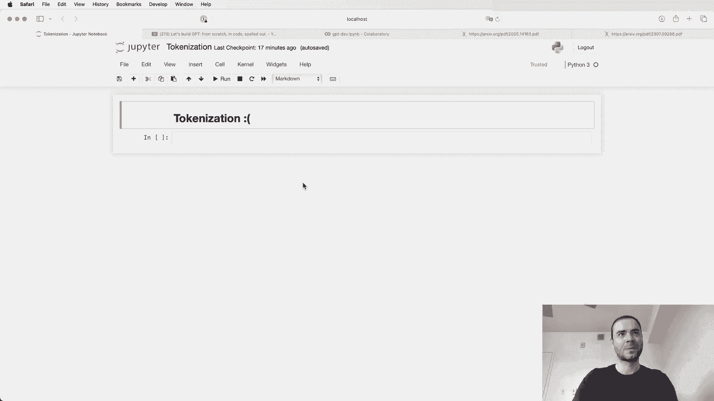
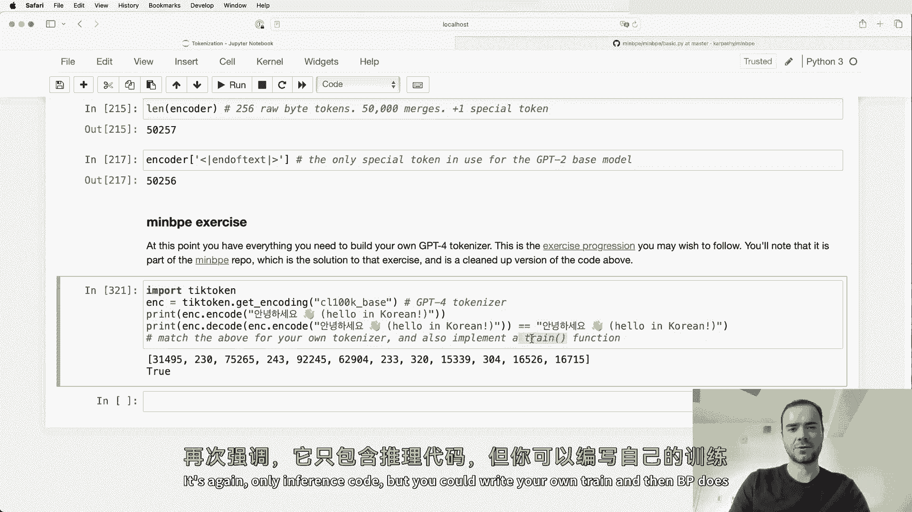
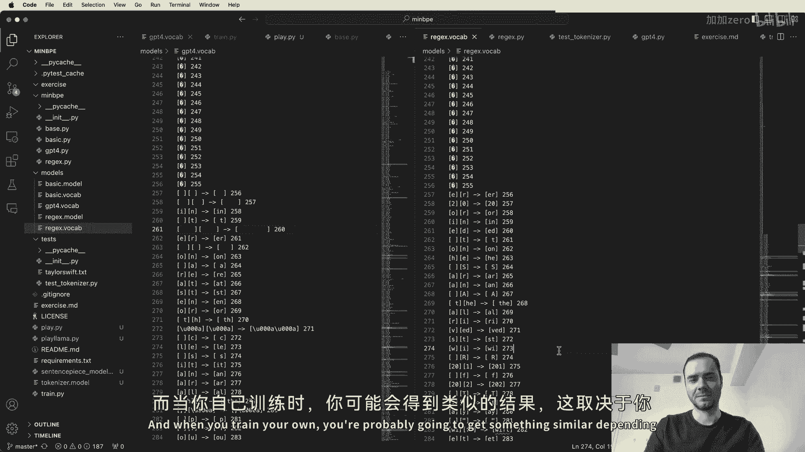
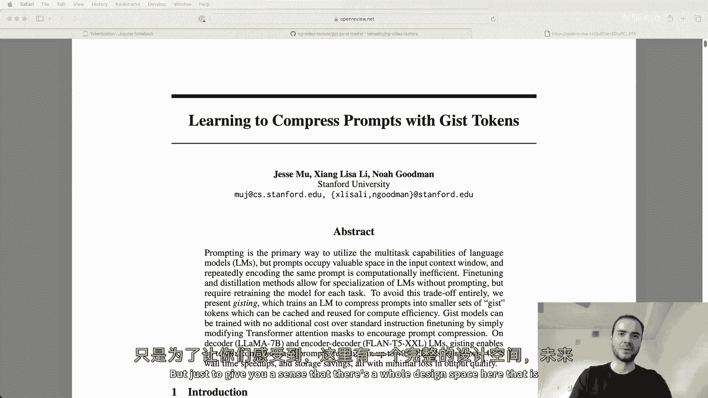
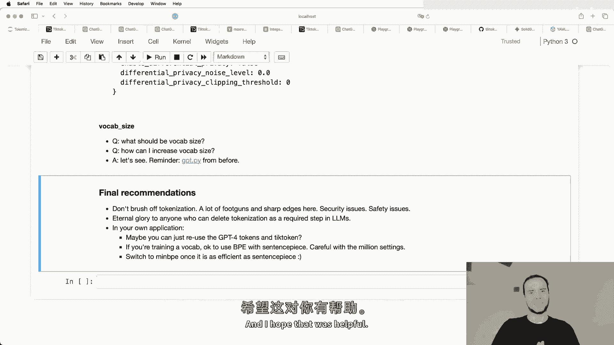
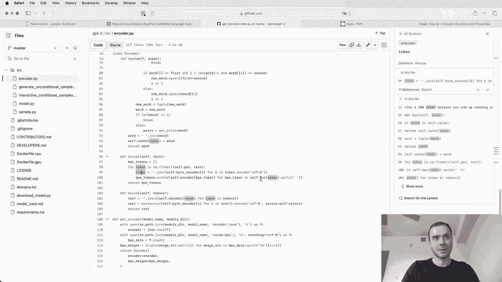

# P9：p9 让我们构建GPT Tokenizer - 加加zero - BV11yHXeuE9d

大家好。在这个视频中，我想讨论一下大型语言模型中的分词过程。现在，你可以看到我面带困惑，因为分词是我在处理大型语言模型时最不喜欢的部分，但不幸的是，这一部分是相当复杂且需要详细理解的，因为它非常棘手，里面有很多隐藏的陷阱。

需要注意的是，大型语言模型的许多奇怪之处通常可以追溯到分词。

那么，什么是分词？在我之前的视频《从头开始构建GPT》中，我们实际上已经进行了分词，但我们做的是一个非常简单、天真的版本。所以当你去查看时。

这是那个视频的Google Colab，你可以看到我们加载了我们的训练集。我们的训练集是这个莎士比亚数据集。最开始，莎士比亚数据集只是一个大的字符串，在Python中。它只是文本。那么问题是，我们如何将文本输入到大型语言模型中？在这个案例中。

我们创建了一个包含65个可能字符的词汇表，这些字符在这个字符串中出现。这些是可能的字符。我们看到它们一共有65个。然后我们创建了一个查找表，用于将每个可能的字符的小字符串片段转换为一个词元和整数。所以这里，例如，我们对字符串“high there”进行了分词。

我们得到了这一系列的词元。在这里，我们取了数据集的前1000个字符，并将其编码为词元。因为这是字符级别的，我们得到了1000个词元的序列。所以词元1847等。后来，我们看到将这些词元插入语言模型的方法是使用一个嵌入表。

基本上，如果我们有65个可能的词元，那么这个嵌入表将会有65行。大致来说，我们会取每个词元相关联的整数。我们使用这个整数作为查找这个表的依据，并提取出相应的行。这个行是可训练的参数，我们将使用反向传播进行训练。

这是然后输入到变换器的向量。变换器就是这样感知每一个词元的。因此，我们有一个非常简单的分词过程，这是一个字符级分词器。但在实际操作中，与大型语言模型相关的人们通常会使用更复杂的方案，不幸的是。

用于构建这些词元词汇表。因此，我们不是在字符级别上进行处理，而是在块级别上进行处理。这些字符块的构建方式是使用算法，例如字节对编码算法，我们将在此详细介绍。在本视频中，我想简要介绍一下这篇论文。

在大型语言模型的上下文中，引入了一种字节级编码作为标记化的机制。我会说，这可能是GPT-2论文。如果你向下滚动到输入表示部分，这里讨论了标记化，以及你希望标记化具备的属性。最后他们得出结论，决定将会有。

一个标记器，你有50,257个可能的标记的词汇量。上下文大小将是1024个标记。因此，在变压器神经网络的注意力层中，每一个标记都与序列中的前一个标记进行交互。它将看到最多1024个标记。因此，标记是大型语言模型的基本单位，类似于原子。

如果你愿意的话。一切都是以标记为单位，一切都与标记有关。标记化是将字符串或文本转换为标记序列及其逆过程。当你查看Llama 2论文时，我可以告诉你，当你搜索标记时，你会发现63个相关结果。这是因为标记再次无处不在。

在这里，他们提到他们在两万亿个标记的数据上进行了训练等等。因此，我们将建立自己的标记器。幸运的是，字节承载编码算法并不是特别复杂。我们可以从零开始构建它，我们将确切看到它是如何工作的。在我们深入代码之前，我想给你一个。

这是对标记化复杂性的一次简要体验。因为我想确保我们充分阐明为什么我们要做这一切，以及为什么这如此糟糕。因此，标记化是大型语言模型中许多奇怪现象的核心。我建议你不要轻视它。许多看似仅仅是神经网络问题的事情。

大型语言模型本身的架构实际上是标记化的问题，根本上可以追溯到它。因此，如果你注意到大型语言模型的任何问题，比如拼写任务无法轻松完成，这通常是由于标记化。简单的字符串处理对大型语言模型来说可能很难以本地方式执行。

非英语语言的效果可能差得多，在很大程度上是由于标记化。有时，LLM在简单的算术上表现不佳。这也可以追溯到标记化。GPT-2特别在处理Python时会比后续版本面临更多问题，都是由于标记化。还有很多其他问题。也许你见过一些奇怪的警告。

尾随空格。这是一个标记化问题。如果你早些时候询问GPT关于固体黄金魔法竖琴及其是什么，你会看到LLM完全失控，开始谈论与此完全无关的话题。也许你被告知要使用ML而不是JSON和结构化数据。所有这些都与标记化有关。

所以，基本上分词是在许多问题的核心。我会在视频结束时回过头来看这些，但现在让我稍微跳过它，咱们去这个网页应用程序ticktokinizer.versal.app。我已经在这里加载了它，我喜欢这个网页应用的原因是分词正在运行。

这段代码是在浏览器中以JavaScript运行的。所以你可以在这里输入一些内容，比如“hello world”，整个字符串会重新分词。因此，在左侧我们看到的是你输入的字符串。在右侧，我们当前使用的是GPT2分词器。我们看到我粘贴的这个字符串目前正在被分词为300个标记，这些标记被明确地以不同颜色显示。

例如，这个词“tokenization”变成了两个标记。标记30,642和1,634。标记空间是标记318。因此，请注意底部可以显示空格，并且请记住，这里有空格、斜杠和换行符，但你可以隐藏它们以便于理解。标记空间为标记379。标记空间“the”是262等。

所以你注意到，这里的空格是这个标记块的一部分。这就像我们的英语句子如何拆分，似乎一切都很好。现在我放入了一些算术表达式。所以我们看到标记127，加上标记6，空格6，后面跟着77。那么这里发生的事情是127正在输入。

作为一个单一的标记输入到大型语言模型中，但数字677实际上会作为两个独立的标记输入。因此，大型语言模型必须考虑这一点并在其网络中正确处理它。而这里的800和4将被拆分为两个标记，这完全是任意的。这里我有另一个四位数字的例子，它们的拆分方式也是完全任意的。

有时你会有多个数字作为一个标记，有时你会有单个数字作为多个标记，这一切都相当任意，来自分词器的输出。这是另一个例子。我们有字符串“egg”，你会看到它变成了两个标记，但当我说“我有一个egg”时，情况又不同了。

你会看到，当它是“space egg”时是两个标记。抱歉，它是一个单一标记。因此，在句子的开头，仅仅是“egg”本身是两个标记，但在这里作为“space egg”时突然变成了一个单一标记，尽管字符串完全相同。好的，这里的小写“egg”结果是一个单一标记，特别注意颜色不同。因此这是一个不同的标记。这是区分大小写的。

当然，大写的“egg”也会是不同的标记。而且，这将再次是两个任意的标记。因此，对于同一个概念“egg”，根据它是在句子的开头、句子的结尾、小写、大写或混合，所有这些基本上会是非常不同的标记和不同的ID。

语言模型必须从互联网上的原始数据中学习，实际上这些都是同一个概念。它需要对这些数据进行归类，以便在神经网络的参数中理解这些数据模式，它们都非常相似，但可能并不完全相同。

在这里每个演示之后，我有一段来自OpenAI的Cha-Chi-Bt的介绍，内容是韩语。所以“Man-Naso”，“Pangavoya”等等。放这里的原因是，你会注意到非英语语言在Cha-Chi-Bt中的效果稍微差一些。这部分是因为Cha-Chi-Bt的训练数据集在英语方面大得多。

这一点不仅适用于大型语言模型本身，也适用于标记器。当我们训练标记器时，会发现有一个训练集，而其中英语的比例远大于非英语的比例。最终的结果是，英语的标记通常会更长。那么，我该怎么说呢？从变换器的角度来看，如果你有一句话。

如果你对这句话进行标记，你可能会看到它是10个标记左右。但如果你将这句话翻译成韩语或日语等其他语言，通常会发现使用的标记数量要大得多。这是因为这些内容被更细致地拆分。所以我们对相同内容使用了更多的标记。

这会导致所有文档的序列长度被拉长。因此，你使用的标记会更多，而在变换器的注意力机制中，当这些标记尝试互相关注时，你会在该变换器的最大上下文长度中耗尽上下文。因此，所有非英语文本相对于英语文本被拉伸。

这与用于标记器的训练和标记化本身有关。因此，它会在英语中创建更大的标记和更大的组，而对于所有其他非英语文本，则会有更多的小界限。所以如果我们把这翻译成英语，标记的数量会显著减少。

我这里的最后一个例子是一小段用于实现FizzBuzz的Python代码。我想让你注意的是，所有这些独立的空格都是单独的标记。它们都是标记220。所以220，220，220，220，然后空格是一个单独的标记。因此，当变换器要处理或尝试创建这些文本时，发生了什么情况。

它需要单独处理所有这些空格。这些空格会一个接一个地输入整个变换器的序列。因此，以这种方式进行标记化是极其浪费的。因此，结果是，GPT2在处理Python时表现不佳，这与编码或语言模型本身无关。

只是如果你在 Python 中使用很多空格缩进，像我们通常那样，你最终会让所有文本膨胀，并且在序列中分散得太多。我们正在耗尽序列中的上下文长度。大致上，这就是正在发生的情况。我们过于浪费，占用了太多的令牌空间。现在我们可以。

还可以向上滚动并更改令牌器。所以请注意，GPT2 令牌器为这个字符串创建了 300 的令牌计数。我们可以将其更改为 CL100K base，这是 GPT4 令牌器。我们看到令牌计数降至 185。所以对于完全相同的字符串，我们现在大致。

拥有令牌的数量。大致来说，这是因为 GPT4 的令牌器中的令牌数量大约是 GPT2 的两倍。因此我们从大约 50K 增加到大约 100K。现在你可以想象这是一个好事，因为相同的文本现在被压缩成一半的令牌。

所以这是对变压器输入的一个更密集的处理。在变压器中，每个单独的令牌之前有有限数量的令牌需要关注。因此，这样做的结果是我们大致能够看到两倍的文本作为预测下一个令牌的上下文，因为这个变化。但当然，仅仅增加数量并不够。

令牌的数量并不严格来说是无限更好的，因为随着令牌数量的增加，你的嵌入表会变得更大。而且在输出时，我们正在尝试预测下一个令牌。软最大值也随之增长。我们稍后会更详细地讨论这个问题。但总有一个甜蜜点，在那里你会有一个。

适当的词汇中令牌的数量，使一切都保持适当的密度并且仍然相当高效。现在，我特别想让你注意 GPT4 令牌器的一点，就是 Python 的空白处理有了很大改进。你在这里看到，这四个空格被表示为一个单独的令牌，而这里的三个空格和令牌空间。

七个空格都被分组为一个令牌。因此，在表示 Python 的方式上我们变得更加高效。这是 Hopen AI 在设计 GPT4 令牌器时做出的一个 deliberate 选择。他们将更多的空白分组为单个字符。这使得 Python 更加紧凑。因此，当我们尝试预测时，我们可以关注更多的代码。

序列中的下一个令牌。因此，从 GPT2 到 GPT4 的 Python 编码能力的提升，不仅仅是语言模型、架构和优化细节的问题，很多改进也来自于令牌器的设计以及它如何将字符分组为令牌。好的，现在我们开始写一些代码。记住我们要做的事情。

我们想将字符串输入到语言模型中。为此，我们需要以某种方式将字符串分词。将其转换为一些固定词汇表中的整数。然后我们将使用这些整数进行查找，查找向量表，并将这些向量作为输入传递给变换器。现在，这变得有点棘手，当然，是因为我们不仅想支持。

简单的英语字母表。我们想支持不同种类的语言。例如，这就是安雅的问候。用韩语说“你好”。我们还想支持许多种特殊字符，比如我们在互联网上可能会遇到的表情符号。那么我们如何将这些文本输入到变换器中呢？

那么，这段文本在Python中是什么呢？如果你查看Python中字符串的文档，可以看到字符串是不可变的Unicode编码点序列。好的，Unicode编码点是什么呢？我们可以去维基百科查阅。因此，Unicode编码点被Unicode联盟定义为Unicode标准的一部分。实际上，这就是。

大约定义了150,000个字符。目前大致来看，它们是什么样的，哪些整数代表这些字符。所以它表示150,000个字符，涵盖161种书写系统。截至目前。如果你向下滚动，可以看到这个标准非常活跃。最新标准15.1是2023年9月。基本上，这只是定义的一种方式。

各种类型的字符。例如，所有这些不同书写系统中的字符。所以，我们可以通过在Python中使用ord函数来访问给定单个字符的Unicode编码点。例如，我可以传入字符H。我可以看到单个字符H的Unicode编码点是104。好的。但是这可能会变得相当复杂。因此，我们可以使用。

例如，我们的表情符号，这个的编码点是128,000。或者我们可以拿这个。这是50,000。现在请记住，你不能在这里插入字符串，因为它没有单一的编码点。它只接受单个Unicode编码点字符并告诉你它的整数。因此，通过这种方式，我们可以查找。

这个特定字符串的所有字符及其编码点。所以在这个字符串中，对X的顺序。我们在这里得到了这种编码。现在，看看这里，我们已经将原始编码点转换。已经得到了整数。那么我们为什么不能简单地使用这些整数，而根本不进行任何分词呢？为什么我们不能直接使用这些编码点呢？嗯，原因之一是。

当然，在这种情况下，词汇表会相当长。所以在这种情况下，对于Unicode，这是一个包含150,000个不同编码点的词汇表。但更令人担忧的是，我认为Unicode标准仍然非常活跃，并且不断变化。所以这不是我们可能想直接使用的稳定表示。

所以出于这些原因，我们需要一些更好的东西。为了找到更好的东西，我们转向编码。如果我们访问这个维基百科页面，我们会看到Unicode联盟定义了三种编码类型，UTF-8、UTF-16和UTF-32。这些编码是我们处理Unicode文本的方式。

并将其转换为二进制数据或字节流。UTF-8无疑是最常见的。这是UTF-8页面。现在，这个维基百科页面实际上相当长，但对我们来说重要的是UTF-8将每个代码点转换为一个字节流，这个字节流是从一到四个字节。因此，它是一种可变长度编码。

根据Unicode点，按照方案，你将会得到每个代码点之间的一到四个字节。除此之外，还有UTF-8、UTF-16和UTF-32。UTF-32很好，因为它是固定长度而不是可变长度，但它也有很多其他缺点。因此，这三种不同编码的优缺点的全貌。

超出了本视频的范围。我只想指出我喜欢这篇博客文章。并且这篇博客文章的末尾还有许多引用，相当有用。其中之一是UTF-8无处不在的宣言，这个宣言描述了为什么UTF-8被显著偏好，并且比其他编码更好，以及为什么它被广泛使用。

在互联网上显著存在。一个主要的优点就是UTF-8是唯一一个与简单的ASCII文本编码向后兼容的编码，但我在本视频中不会详细讨论。因此只需说我们喜欢UTF-8编码，让我们试着将这个字符串编码为UTF-8，看看结果。

Python中的字符串类实际上有一个encode方法，你可以给它指定编码，例如UTF-8。现在我们得到的这个结果并不太好，因为这些字节是一个字节对象，而且打印出来的方式并不友好，所以我个人喜欢通过列表处理它，这样我们就能实际获得这种编码的原始字节。

所以这是表示该字符串的原始字节，根据UTF-8编码。我们也可以查看UTF-16，得到一个稍微不同的字节流。这里我们开始看到UTF-16的一个缺点。你会看到有零，零，零，我们开始有了一些感觉。

这是一种有些浪费的编码，确实对于简单的ASCII字符或英语字符来说，我们只有零，零的结构，这并不是很好。同样对于UTF-32，当我们展开时，可以开始感受到这种编码的浪费。对于我们的目的，你会看到很多零后面跟着一些东西，这并不可取。

所以可以简单地说，我们希望在我们的目的上坚持使用UTF-8。然而，如果我们只是天真地使用UTF-8，这将是字节流，这意味着词汇长度仅为256个可能的标记。但这个词汇量实在太小。如果我们天真地使用它，我们的文本将被拉伸成非常非常长的序列。

字节序列。因此，这样做的结果是，嵌入表会非常小，而最终层顶部的预测也会非常小，但我们的序列非常长。请记住，由于计算原因，我们在变压器中支持的上下文长度是有限的。因此，我们的上下文长度有限，但。

现在我们有非常非常长的序列，这样是低效的，并且无法让我们在进行下一个标记预测任务时关注足够长的文本。因此，我们不想使用原始的UTF-8编码字节。我们希望能够支持更大的词汇量，可以将其调节为一个高参数，但我们希望保持使用。

这些字符串的UTF-8编码。那么我们该怎么办呢？答案当然是转向字节对编码算法。这将允许我们将这些字节序列压缩为可变量。所以我们稍后会讨论这个，但我想简要提到，我希望能够直接将其。

只是为了能够将原始字节序列输入到语言模型中。事实上，有一篇关于如何可能实现这一点的论文，来自去年的夏天。现在，问题是你必须进入并修改变压器架构，因为正如我提到的，你会遇到一个问题，即注意力将变得极其昂贵，因为。

序列太长。因此在这篇论文中，他们提出了一种层次化的变压器结构，允许你直接输入原始字节。因此，在最后，他们说，这些结果共同证明了无标记化自回归序列建模在大规模下的可行性。因此，无标记化确实会很棒。我们只需输入字节流。

输入到我们的模型中。但不幸的是，我不知道这是否已经被足够多的团队和其高效规模所证明。但类似的事情在某个时刻将会是。令人惊叹的。我希望有人能想出这个方法。但目前，我们必须回过头来，无法将其直接输入到语言模型中。

我们必须使用字节对编码算法进行压缩。那么让我们看看这是如何工作的。正如我提到的，字节对编码算法并不是特别复杂。维基百科页面在基本思路上实际上相当有启发性。我们正在处理某种输入序列。比如说。

在这里，我们的词汇中只有四个元素，A、B、C 和 D，并且我们有它们的一个序列。因此，我们不说字节，而是说我们只有四个，容量大小为四。这个序列太长了。我们希望对其进行压缩。因此，我们会逐步找到最频繁出现的标记对。然后，一旦识别出这个对，我们就将该对替换为一个新的标记。

我们将其添加到我们的词汇中。因此，例如，在这里，字节对 a a 出现得最频繁。所以我们。生成一个新标记，称之为大写 Z。我们将每一个 a 替换为 Z。因此现在我们这里有两个 Z。所以在这里，我们用了一个 11 个字符的序列，词汇量为四。我们将其转换为仅包含九个标记的序列，但现在词汇量变为五。

因为我们刚刚创建了一个第五个词汇元素，它是 Z，代表 A。我们可以再次重复这个过程。因此，我们再次查看序列，并识别出现频率最高的标记对。假设现在是 AB。好吧。我们将用一个我们生成的新标记来替换 AB，称之为 Y。因此 Y 成为 AB。

然后每一个 AB 的出现都被替换为 Y。因此我们最终得到了这个。现在我们序列中只有一、二、三、四、五、六、七个字符。但我们不仅有四个词汇元素或五个，而是现在有六个。在最后一轮中，我们再次查看这个序列。

我们发现短语 Z Y 或者说对 Z Y 是最常见的，然后再用另一个字符替换它，比如说 X。因此 X 就是 Z Y，我们将所有 Z Y 的出现都替换掉。我们得到了以下序列。因此，基本上，在经过这个过程之后，我们不再拥有一个由 11 个标记组成的序列，词汇长度为四。

现在我们有一个由一、二、三、四、五个标记组成的序列。但我们的词汇长度现在是七。因此通过这种方式，我们可以逐步压缩我们的序列，随着我们生成新标记。以完全相同的方式开始，我们从字节序列开始。因此，我们有 256 的词汇量。我们现在将对这些进行处理，找到。

出现频率最高的字节对。我们将开始逐步生成新标记，将其添加到我们的词汇中，并进行替换。通过这种方式，我们将得到一个压缩的训练数据集，以及一个将任何任意序列编码为该词汇的算法，同时也能将其解码回字符串。

现在让我们实现这一切。这是我所做的。我去了一篇我喜欢的博客文章，并将第一段复制粘贴到这里。这是一条非常长的行。现在，为了获取标记，正如我提到的。我们将文本编码为 UTF-8。

此时的标记将是原始字节，单个字节流。为了让工作更容易，而不仅仅是字节对象。我将把所有字节转换为整数。然后创建一个列表，以便更方便我们在Python中操作和可视化。

这里我打印了所有内容。这是原始的，这是原始段落。它的长度是533个码点。然后这里是以UTF-8编码的字节。我们看到此时的长度是616个字节，或616个标记。原因是因为很多这些简单的ASCII字符，或简单字符。

它们就变成了单字节。但是很多这些单位码，更复杂的字符变成了多字节，最多可达四个字节。因此，我们正在扩大那个大小。那么，我们想要做的作为算法的第一步是，我们想在这里迭代，找到最频繁出现的字节对，因为我们接下来要合并它。

如果你在旁边的笔记本上工作，那么我鼓励你基本上点击链接，找到这个笔记本，尝试自己编写那个函数。否则，我将来到这里，首先实现找到最常见对的函数。好的，这就是我想出来的。实现这个有很多不同的方法。

但我调用的函数是gets stats。它期望一个整数列表。我使用字典来基本跟踪计数。然后这是一个Pythonic的方式来迭代该列表的连续元素，我们在之前的视频中讨论过。然后在这里，我只是跟踪，将所有对的计数加一。因此，如果我称之为较旧的标记。

然后统计结果在这里出现。这是字典。键是这些连续元素的元组。这是计数。为了以稍微更好的方式打印它，这是我喜欢做的一个方法，虽然有点复杂。如果你愿意，可以暂停，但我们遍历所有项目，调用这些项目。

字典返回键值对。相反，我在这里创建了一个值键的列表，因为如果是值键列表，我就可以在上面调用sort。默认情况下，Python将使用第一个元素，在这种情况下将以值进行排序，如果给定的是元组。然后反转。因此，它是降序的，并打印出来。因此，基本上，`one on one, 32`是最常见的。

常见的连续对出现了20次，我们可以再次确认这合理。因此，如果我只搜索`one on one 32`，你会看到这20次出现的那对。如果我们想看看那对究竟是什么，我们可以使用char，这是Python中org的对立面。所以我们给它一个Unicode码点，也就是`one on one`。

和32。我们看到这是e和空格。所以基本上，这里有很多e空格。意味着这些单词似乎大多以e结尾。所以这里以e空格为例。这里有很多这样的情况。这是最常见的对。所以现在我们已经确定了最常见的对，我们希望遍历这个序列。我们将要生成。

一个ID为256的新标记，对吗？因为这些标记当前的范围是从零到255。所以当我们创建一个新标记时，它将有256的ID。我们将遍历这个整个列表。每当我们看到一个逗号32时，我们将把它替换为256。所以现在让我们实现这一点，您也可以随意尝试。

首先，我注释掉这个，以免污染笔记本太多。这是在Python中获取最高排名对的好方法。所以我们基本上在这个字典统计上调用max。这将返回最大键。然后问题是如何对键进行排名？所以你可以提供。

一个对键进行排名的函数。这个函数就是返回值的统计。因此，我们是通过值进行排名，并获得最大键。所以这是我们看到的一个逗号32。现在要实际合并一个逗号32，这是我写的函数。但同样，它有许多不同的版本。

我们将获取一个ID列表和我们想替换的对。这个对将被替换为新的索引ID X。因此，在遍历ID时，如果我们找到这个对，就将其替换为ID X。我们创建这个新列表，然后从零开始。然后我们从左到右完全顺序地进行。

在这里，我们检查当前位于对的相等性。我们在这里检查这个对是否匹配。现在有一个有点棘手的条件，如果你想小心，你必须附加。那就是当你在这个列表的最右边元素时，你不希望这个在最后位置超出范围。否则。

这将给你一个自动的禁止者。所以我们必须确保我们不是在最后一个元素。所以对于这个来说将是假的。如果我们找到匹配，我们将附加到这个新列表。那个替换索引。我们将位置加二。这样我们就跳过了整个对。但如果我们没有找到匹配的对，我们就简单地复制过来。

该位置的元素并加一，然后返回这个。所以这是一个非常小的玩具示例。如果我们有一个列表566791，并且我们想用99替换67的出现次数，那么在上面调用这个将得到我们所要求的结果。所以这里的67被替换为99。现在我将为我们的实际用例取消注释，因为我们想处理我们的标记。

我们想在这里取出顶部的对并用256替换它，以获取令牌。如果我们运行这个，我们会得到以下结果。所以回想一下，之前这个列表的长度是616。现在我们得到了596，对吧？所以这减少了20，这很合理，因为出现了20次。此外，我们可以在这里尝试找到256，并且我们看到它的出现次数很多。而且。

只是再次确认，应该没有10132的出现。因此，这是原始数组，里面有很多，而在第二个数组中，没有10132的出现。所以我们成功地合并了这个单一的对。现在我们只需迭代这个。所以我们将再次遍历序列，找到最常见的对并进行替换。

让我现在写一个使用这些函数的循环，以便进行迭代。那么我们要做多少次呢？这完全取决于我们作为超参数。我们采取的步骤越多，我们的词汇量就越大，序列就越短。而且通常有一个最佳点在实践中效果最好。

所以这是一种超参数，我们进行调优以找到合适的词汇大小。例如，GPT4目前大约使用100,000个令牌。这些数字目前是合理的，而不是许多更强的数字。因此，让我现在将所有内容放在一起，并迭代这些步骤。好的。

现在在我们深入while循环之前，我想在这里添加一个单元格。我访问了博客文章，而不是只抓取前一两个段落。我将整个博客文章拉伸成一行。基本上，使用更长的文本将使我们能够获得更具代表性的字节对统计数据。

我们会得到一个更合理的结果，因为它是更长的文本。所以这里我们有原始文本，我们使用UTF-8编码将其编码为字节。然后在这里，和之前一样，我们只是将其转换为Python中的整数列表，这样更便于操作，而不是原始字节对象。

然后这是我想出来的实际合并循环的代码。这两个函数与我们之前的相同。我只是在这里包含它们，以便你有参考点。所以这两个是相同的。然后这是我添加的新代码。我们要做的第一件事是决定最终的词汇大小。

我们希望我们的分词器具备。而且正如我提到的，这是一个超参数，你以某种方式设置它，取决于你的最佳性能。那么假设我们将使用276。因为这样我们将进行恰好20次合并。而20次合并，因为我们已经有256个原始字节的令牌。要达到276，我们必须进行20次合并以添加20个新令牌。在这里。

这是在Python中创建列表副本的一种方法。所以我正在获取标记列表，通过将其包装在列表中，Python将构建一个包含所有单个元素的新列表。这只是复制操作。然后在这里，我正在创建一个合并字典。这个合并字典将基本上维护父节点到新标记的映射。

我们要构建的是一个合并的二叉树。但实际上，这并不完全是一个树，因为一棵树会有一个单一的根节点和一堆叶子。对于我们来说，我们从底部的叶子开始，即单个字节。这是最初的256个标记。然后，我们开始一次合并两个标记。

所以这不是一棵树，而更像是一个森林，因为我们合并这些元素。因此对于20次合并，我们将找到最常出现的对。我们将为它生成一个新的标记整数。因此，我将从零开始。所以我们将从256开始。我们将打印出我们正在合并。

我们将用新的新生成标记替换该对的所有出现。并且我们会记录这对整数合并成这个新的整数。因此运行此操作会给我们以下输出。所以我们进行了20次合并。例如，第一次合并与之前完全相同，标记131和32合并为新的标记256。

请记住，单个标记101和32在合并后仍然可以在序列中出现。只有当它们完全连续出现时，才会变成256。此外，另一个要注意的事情是，标记256，即新生成的标记，也是可以进行合并的。因此在底部。

第20次合并是256和259合并成275。因此，每次我们替换这些标记时，它们在下一轮迭代中会变得可合并。这就是为什么我们构建的是一个小型的二叉森林，而不是单独的一棵树。我们还可以查看我们实现的压缩比。

特别是，我们从这个标记列表开始。我们从24,000个字节开始。经过20次合并后，我们现在只有19,000个标记。因此，压缩比就是将两者相除，约为1.27。这就是我们通过仅进行20次合并实现的文本压缩量。

当然，你添加的词汇元素越多，这里的压缩比就越大。最后，这就像是分词器的训练。如果你愿意。现在，我想指出的一点是，也许这个图可以帮助说明的是，分词器是与大型语言模型完全独立的对象。

在本讲座中，我们并没有真正触及大型语言模型本身。我们只是在训练标记器。这通常是一个完全独立的预处理阶段。因此，标记器将有自己的训练集，就像大型语言模型有可能不同的训练集一样。标记器有一个文档训练集，你将用来训练标记器。

然后，我们执行如上所示的字节对编码算法来训练该标记器的词汇。因此，它有自己的训练集。这是一个你将在开始时运行一次的预处理阶段。标记器是使用字节对编码算法进行训练的。一旦你有了标记器，训练完成，词汇建立并且合并完成。

我们可以同时进行编码和解码。这两个箭头在这里。因此，标记器是原始文本之间的翻译层，正如我们看到的，是Unicode代码点的序列。它可以将原始文本转换为标记序列，反之亦然，它可以将标记序列转换回原始文本。现在我们已经训练了标记器。

有了这些合并后，我们将讨论如何进行编码和解码步骤。如果你给我文本，这里是标记，反之亦然，如果你给我标记，这里是文本。一旦我们拥有这些，我们就能在这两个领域之间进行转换。然后语言模型将在之后的第二步进行训练。通常来说。

在一种先进的应用中，你可能会将所有训练数据应用于语言模型，并将其通过标记器转化为一个庞大的标记序列。然后你可以丢弃原始文本，只留下标记本身。这些标记存储在磁盘上，而这就是大型语言模型在训练时实际读取的内容。

这是一种可以作为单个大规模预处理阶段的方法。所以，是的，基本上我想强调的最重要的事情是，这是一个完全独立的阶段。它通常有自己完整的训练集。你可能想要让这些训练集在标记器和大型语言模型之间有所不同。因此。

例如，当你训练标记器时，正如我提到的，我们不仅关心英文文本的性能。我们关心多种不同的语言，我们还关心代码与否。因此，你可能想要关注不同类型语言和不同数量代码的混合，因为各种语言和代码的数量是不同的。

您在分词器训练集中的语言将决定会有多少合并。因此，这决定了这种类型的数据在标记空间中的密度。粗略而言，如果您添加一些数据，比如说您在分词器训练集中有大量的日语数据，那么这意味着。

更多的日语标记将被合并。因此，日语将有更短的序列。这对具有有限上下文长度的启动语言模型是有利的，它可以在标记空间中工作。因此，希望这有意义。现在我们将转向。

编码和解码现在我们已经训练了一个分词器。所以我们有我们的合并。现在我们如何进行编码和解码？好的，让我们先从解码开始，这是这条箭头所指的。所以给定一个标记序列，让我们通过分词器来获得一个 Python 字符串对象。原始文本。因此，这是我们想要实现的功能。我们给定了一个整数列表。

我们想要返回一个 Python 字符串。如果您愿意，可以尝试自己实现这个功能。这是一个有趣的练习。否则，我将开始粘贴我自己的解决方案。有很多不同的方法可以做到这一点。这是其中一种方法。我将创建一个我称之为 vocab 的预处理变量。vocab 是一个将标记 ID 映射到字节对象的字典。

对于该标记。所以我们从 0 到 255 的标记的原始字节开始。然后我们按照所有合并的顺序进行操作。我们通过在这里进行加法来填充这个词汇表列表。所以这基本上是第一个子项的字节表示，后面跟着第二个。请记住，这些是字节对象。因此，这里的加法是两个字节对象的加法。

只是连接。所以我们在这里得到的就是这个。顺便说一句，有一件棘手的事需要注意，我正在使用点项目迭代一个字典。在 Python 中，这样的顺序很重要，因为我们将项目插入合并字典的顺序，幸运的是，从 Python 3.7 开始，这一点是有保障的。但是在 Python 3.7 之前，这种迭代可能会。

在我们插入元素到合并中的顺序上可能是错的。这可能无法正常工作。但我们正在使用现代 Python，所以没问题。在这里，给定 ID，我们要做的第一件事是获取标记。所以我在这里实现的方法是我正在迭代所有 ID。

我正在使用词汇表来查找它们的字节。然后，这里有一种在 Python 中将所有这些字节连接在一起以创建我们的标记的方法。此时，这些标记是原始字节。因此，我必须使用 UTF-8 解码，将其转换回 Python 字符串。所以之前，我们在字符串对象上调用了点编码以获取字节。现在我们正在做相反的操作。

我们正在取字节并在字节对象上调用解码以获得 Python 中的字符串。然后我们可以返回文本。这就是我们如何做到的。实际上，我实现的方式有一个问题。这可能会抛出一个错误。所以请尝试思考，弄清楚为什么这段代码可能会导致。

如果我们插入一些不幸的 ID 序列，可能会出现错误。让我演示一下这个问题。当我尝试解码像 97 这样的内容时，我会得到字母 A。所以没什么太疯狂的事情发生。但当我尝试将 128 作为单个元素解码时，标记 128 在字符串或 Python 对象中是 Unicode 解码器。UTF-8 无法解码字节 0x AD，这就是 X 中的内容。

在位置零无效的起始字节。这是什么意思呢？要理解这是什么意思，我们需要回到我之前简要展示过的 UTF-8 页面。这是维基百科上的 UTF-8。基本上，UTF-8 字节有一个特定的模式。因此，如果你有一个多字节对象用于某些 Unicode 字符。

它们必须有这种特殊的封装，以符合编码的工作方式。在这里发生的事情是，在值的起始字节，这是因为 128。它的二进制表示是一个后面跟着全零的数字。因此我们有一个，然后是全零。我们看到这不符合格式，因为一个后面跟着。

全零根本不符合这些规则。因此这是一个无效的起始字节，即字节一。这个字节后面必须跟着一个一，然后跟着一个零，然后你的 Unicode 内容在 X 中。这基本上是说，我们并没有完全遵循 UTF-8 标准，因此无法解码。因此，修复这个问题的方法是使用错误等于在 bytes.decode 中。

Python 的函数。默认情况下，错误是严格的。因此，如果它不是有效的 UTF-8 字节编码，我们将抛出错误。但在错误处理方面你可以放入许多不同的内容。这是你可以使用的所有错误的完整列表。特别是，可以使用其他方式来代替严格模式。

让我们将其更改为替换。这将用这个特殊标记替换，即替换字符。因此错误等于替换。现在我们只是得到了那个字符。所以基本上，并不是每个字节序列都是有效的 UTF-8。如果你的大型语言模型，例如，预测你的标记时出现错误，它们可能不符合有效的 UTF-8。

然后，我们将无法解码它们。所以标准做法基本上是使用错误等于替换。这也是你在他们发布的开放 AI 代码中会发现的内容。但基本上，每当你在输出中看到这种字符时，在这种情况下，就意味着出了问题，LM 输出不是有效的标记序列。好的，现在我们要继续。

另外一种方法。因此，我们将在这里实现这个错误，我们将获得一个字符串，并希望将其编码为令牌。所以这是我们感兴趣的函数的签名。基本上，这应该打印出一个整数列表，表示这些令牌。所以，再次。如果你想要一个有趣的练习，可以尝试自己实现一下，然后暂停在这里。否则。

我将开始放入我的解决方案。所以，当然，有很多方法可以做到这一点。这是我想出来的其中一种方法。因此，我们要做的第一件事是将我们的文本编码为UTF-8，以获取原始字节。然后，像以前一样，我们将对字节对象调用`list`以获取这些字节的整数列表。这些是开始。

令牌，它们是我们序列的原始字节。但现在，当然。根据上面的`merges`字典，并且回想一下，这就是合并的结果。一些字节可能会根据这个查找合并。此外，记住`merges`是从上到下构建的。这有点像。

我们插入内容到`merges`中的顺序。因此，我们更愿意在开始时完成所有这些合并，然后再进行这些合并，因为，例如，这个合并依赖于这里合并的256。因此，我们必须按从上到下的顺序进行。如果我们要合并任何内容，现在我们期望进行一些合并。

所以我们会做得很好，真实的。现在我们想要找到一对连续的字节，根据这个我们可以合并。为了重用我们已经编写的一些功能，我将重用`gets`函数。所以回想一下，`gets`函数将给我们统计每一对在我们的令牌序列中出现多少次，并返回。

作为一个字典。这个字典是从所有不同的字节对映射到它们出现的次数，对吗？此时，我们实际上并不关心它们在序列中出现了多少次，我们只关心序列中的原始对。因此，我只会使用这个字典的键，我只关心可能的。

合并候选项，如果这样做有意义。那么我们想要识别要合并的对。在循环的这个阶段。所以我们想要什么？我们想找到在`merges`字典中具有最低索引的键或对，因为我们希望在处理晚期合并之前，先进行所有早期合并。所以，再次。

有很多不同的方法来实现这个，但我会在这里做一些稍微复杂的事情。因此，我将使用`min`函数在一个迭代器上。在Python中，当你在一个迭代器上调用`min`时，而`stats`在这里是一个字典，我们将遍历这个字典的键。因此，我们在查看`stats`中的所有对。

这些都是所有连续的对。我们将从 tokens 中获取具有最小值的连续对，min 需要一个键，这样我们就可以得到一个返回值的函数，以便我们进行 min。而我们关心的是获取 merges，并基本上获取该对的索引。因此，对于 stats 中的任何对。

我们将查看 merges 的索引。我们想要获取具有最小数字的对。因此作为一个例子，如果有一对 one on one 和 32。我们一定想要得到那一对。我们想要在这里识别它并返回它。如果它出现，pair 将变为 one on one 32。而我在这里放入 float in 作为后备的原因是，在 get 函数中。

当我们调用时，基本上考虑一个不在 merges 中的对。然后这个对就不符合合并的资格。对。如果在 token 序列中，有某个对不是合并对，则它无法被合并。那么它实际上并不存在于这里。它没有索引，并且，无法合并。

我们将其表示为 float in。之所以选择 infinity 是因为，我们可以确保它在我们进行合并时不会参与候选列表。因此，这是一种方法。基本上，简而言之，这会返回在 tokens 中出现的最符合条件的合并候选对。现在。

这里要小心的一点是，这个函数可能会以以下方式失败。如果没有可以合并的内容，那么，在 merges 中就没有满足的内容了。没有可以合并的，所有的内容只会返回 float inves。然后这个对，我认为将只是 stats 的第一个元素。

但这个对实际上并不是一个可以合并的对，它仅仅是 arbitrarily 地成为 stats 中的第一个对，因为所有这些对在合并标准下都评估为 float in。因此，基本上，这可能不会成功，因为没有更多的可合并对。所以，如果这个返回的对不在 merges 中，那么这对我们来说是一个信号，实际上。

没有什么可以合并的。再也没有任何单独的对可以被合并。在这种情况下，我们将退出。没有其他可以合并的。顺便说一句，你可能会想出不同的实现。这有点像在 Python 中非常努力地尝试。但实际上，我们只是想找到一个可以在这里与最低索引合并的对。现在。

如果我们找到了一个在 merges 中的对，并且是具有最低索引的，那么我们就可以合并它。因此，我们将查看 merges 字典以查找该对的索引。我们现在将其合并到该索引中。所以我们将做 tokens 等于，并且我们将替换原始的 tokens，我们将替换这个对，pair。

我们将用索引IDX替换它。这返回一个新的标记列表，其中每个出现的对都被替换为IDX。因此，我们正在进行合并。我们将继续这样做，直到最终没有任何东西可以合并，我们将出来并结束。然后这里我们只返回标记。这是我认为的实现。所以希望这能运行。

好的，酷。这看起来合理。所以例如，32在ASCII中是一个空格。所以这里是。所以看起来这是有效的。太好了。好的，那么我们至少先结束这一部分的视频。我想指出，这还不是完全正确的实现，因为我们遗漏了一个特殊情况。所以特别是，如果我们尝试这样做，这会给我们一个错误。

问题是，如果我们只有一个单字符或一个空字符串，那么统计信息就是空的，这会导致内部最小值的问题。所以解决这个问题的一种方法是确保标记行至少有两个。因为如果少于两个，那就是一个单独的标记或没有标记，那么就没有东西可以合并。因此我们只需返回。这将解决那个情况。好的，然后第二。

我这里也有一些测试用例。首先，让我们确保，或者说注意以下几点。如果我们取一个字符串并尝试对其进行编码，然后再解码回来，你会期望得到同样的字符串，对吗？对于所有字符串，这是真的吗？我认为，确实如此。在一般情况下，这可能也是事实。但注意，向后过程并不是，总是有效。

你不会有一个向后的身份，因为正如我提到的，并不是所有的标记序列都是有效的UTF-8字节流。因此，其中一些甚至不能被解码。所以这只能朝一个方向进行。但对于那个方向，我们可以在这里检查，如果我们取训练文本，即我们训练以分词的文本。

我们可以确保在编码和解码时，我们得到的是同样的东西，这是真的。在这里，我取了一些验证数据。我去过这个网页，抓取了一些文本。这是分词器未见过的文本。我们可以确保这也能正常工作。好的。这给了我们一些信心，表明这是正确实现的。

所以，这就是字节对编码算法的基础。我们看到如何取一些训练集，训练一个分词器。分词器的参数实际上就是这个合并字典。这基本上在原始字节之上创建了一个小的二叉森林。一旦我们有了这个合并表，我们就可以进行编码和解码。

在原始文本和标记序列之间。所以这就是分词器最简单的设置。不过我们现在要做的是，看看一些最先进的语言模型及其使用的分词器类型。我们会看到，这幅图很快就变得复杂。

所以我们将逐个详细了解这一复杂化过程。让我们从查看 GPT 系列开始。特别是，我在这里有 GPT-2 的论文。这篇论文大约是 2019 年的，五年前。让我们滚动到输入表示部分。这是他们谈论所使用的分词器的地方。

对于 GPT-2 来说，这一切都相当可读。所以我鼓励你暂停一下自己阅读。但这就是他们在 UTF-8 编码的字节级表示上激励使用字节对编码算法的地方。他们在这里谈论词汇表、大小以及所有内容。

这里的一切正如你所覆盖的那样，但事情从这里开始出现分歧。他们提到，他们并不仅仅应用我们所做的简单算法。特别是，这里有一个激励性的例子。假设你有像 dog 这样的常见词汇。实际上，dog 在文本中非常频繁地出现。

这就发生在所有种类的标点符号旁边，作为一个例子。所以 dog. dog! dog? 等等。天真地说，你可能想象 BP 算法可以将这些合并为单个标记。结果你得到的就是很多稍有不同标点的 dog 标记。因此，这就感觉像是在聚合不该聚合的东西。

你将某种语义与标点符号结合在一起，这感觉不太理想。实际上，他们也表示，根据一些实验，这确实是不理想的。所以他们想要以手动的方式自上而下地强制执行某些类型的字符永远不应该合并在一起。

所以他们想在自行车承载编码算法之上强制执行这些合并规则。让我们看看他们的代码，看看他们是如何实际执行这些规则的，以及他们究竟执行了哪些类型的合并。我这里打开的是 GitHub 上 Open AI 的 GPT-2 的顶级标签，当我们查看源代码时，有一个 encoder.py。现在，我个人不喜欢他们这样命名。

encoder.py 因为这是分词器。分词器既可以编码也可以解码。所以我觉得称之为 encoder 有点尴尬，但这就是分词器。这里有很多事情发生，我们将在某个时刻详细讲解。现在，我只想关注这一部分。他们在这里创建了一个看起来非常复杂的正则表达式模式。

我们稍后会详细讨论，但这是允许他们强制规则的核心部分，确保文本的某些部分绝对不会被合并。现在，请注意我们的 compile 有点误导，因为我们不仅仅是导入 re，这是 Python 的 re 模块。我们是导入 regex 作为 re，而 rex 是一个可以安装的 Python 包。

使用 `pip install regex`。这基本上是 re 的扩展，因此比 re 更强大。那么让我们看看这个模式，它在做什么，为什么它实际上在进行这样的分离。好的，所以我已经将模式复制粘贴到我们的 Jupyter notebook 中，我们之前停下的地方。让我们对这个模式进行测试。

所以以与他们的代码完全相同的方式，我们将调用一个 `re.find all`，对我们感兴趣的任意字符串应用这个模式。这是我们想要编码成令牌以输入 LLM（例如 GPT）的字符串。那么这到底在做什么呢？好吧，`re.find all` 将使用这个模式尝试与这个字符串进行匹配。

这个工作的方式是，你从字符串的左侧到右侧，尝试匹配模式，而我们的默认 find all 将获取所有出现并将其整理成一个列表。现在，当你查看这个模式时，首先注意这是一个原始字符串。然后这三个双引号只是为了开始字符串。因此实际上。

字符串本身，就是这个模式，对吧？并注意它由许多的 ores 组成。所以看到这些竖线了吗？那些是在正则表达式中的 ores。因此你从左到右在这个模式中，尝试将其与字符串进行匹配，无论你在哪里。因此我们有 hello，我们将尝试匹配它。好吧，它不是 apostrophe S，也不是 apostrophe T 或这些。但它是。

可选的空格后面跟着 -p，类似于 /p of L，一次或多次。那么 /p of L 是什么呢？这是我找到的一些文档。可能还有其他来源。/p of L 是一个字母，来自任何语言的任何字母。而 hello 是由字母组成的。H-E-L-L-O，等等。因此可选的空格后面跟着一堆字母，至少一个字母。

这将匹配 hello。但是匹配结束，因为空格不是字母。因此，从这里开始，又开始尝试匹配字符串。从这里开始，我们将再次跳过所有这些，直到再次到达同一个点。我们看到有一个可选的空格。这就是可选的空格。

后面跟着一堆字母，一个或多个。所以这匹配。因此，当我们运行这个时，我们得到一个包含两个元素的列表 - hello 和 space world。那么如果我们添加更多字母会怎么样？

我们就是这样获取它们的。现在这有什么作用，为什么这很重要？我们正在处理我们的`string`，而不是直接将其编码以进行标记化，我们首先将其拆分开。实际上，当你逐步执行代码时，我们稍后会更详细地讨论，这在高层次上做的是，它首先将你的文本拆分为一个文本列表，就像这个。

该列表中的所有元素都是由分词器独立处理的。所有的处理结果都是简单地连接在一起。因此，hello world。哦，我错过了如何。Hello world。你好吗？我们有五个元素的列表。所有这些都会独立地从文本转换为令牌序列。然后，这个令牌序列将被连接在一起。它们将全部连接起来。

大致来说，这样做是你只会在这个列表的元素之间找到合并。因此你只能考虑每一个元素内部的合并。在你为所有这些元素单独完成所有可能的合并后，所有结果将通过连接来结合。因此，基本上你在做的就是。

实际上，你永远不会将这个 E 和这个空格合并。因为它们现在是该列表的独立元素的一部分。因此，你是在说我们永远不会合并 E 空格。因为我们是这样将它们分开的。因此，基本上使用这个正则表达式模式来分块。

文本只是强制某些合并不发生的一种方式。我们将更深入地探讨这些文本，我们会看到，从高层次来看，这个目标是尽量不在字母、数字和标点之间进行合并等。让我们更详细地看看，这样是如何工作的。接下来继续吧。我们有 `/p` 的 `n`。

如果你查看文档，`/p` 的 `n` 是任何脚本中的数字字符。因此，它是数字。我们有一个可选的空格，后面跟着数字。这些将被分开。所以字母和数字是分开的。如果我输入 hello world 123，你好吗？那么 world 在这里将停止匹配，因为 1 不是一个。

不能再是字母了。但 1 是一个数字。因此，这个组将匹配它。我们将其作为一个独立的实体。让我们看看这些撇号是如何工作的。因此，如果我们有 `/v` 或者我指的是撇号 `v` 作为例子。那么撇号在这里既不是字母也不是数字。因此 hello 将停止匹配。然后。

我们将完全匹配这个和那个。因此它将成为一个独立的东西。那么他们在这里做撇号的原因是什么？老实说，我认为这些只是非常常见的撇号，通常会被使用。我不喜欢他们这样做，因为让我给你展示当你有一些 Unicode 撇号时会发生什么。例如，如果你有 house。

然后由于这个匹配，它将被分开。但是如果你使用 Unicode 撇号，那么突然之间这就不起作用。因此，撇号实际上会成为它自己的东西。现在，因此它基本上是硬编码的，用于这种特定类型的撇号。除此之外，它们将完全成为独立的令牌。此外，你可以去。

GPT两个文档在定义模式时，他们说应该添加`re.ignore case`。所以BP，合并可以发生在缩写的大写版本中。所以他们指出的是，你看到这个是撇号，然后是小写字母。嗯，因为他们没有做`re.ignore case`，所以这些规则不会将撇号分开，如果它是大写。

所以“house”会是这样的。但如果我输入“house”，如果我是大写字母，那么注意一下。撇号单独出现。所以标记化在大写和小写中工作会有所不同，不一致地分离这些撇号。这感觉非常复杂且略显恶心。但就是这样工作。好吧，所以让我们回来，尝试匹配一堆撇号。

表达式。但这里的另一个问题是这些可能是相当语言特定的。因此。我不知道所有语言是否使用或不使用撇号，但这会导致不一致的标记化。然后我们尝试匹配字母，然后尝试匹配数字。如果那不行，我们回到这里。它所说的是可选的。

空格后跟不是字母、数字或空格的东西，并且有一个或多个这样的东西。所以这实际上是在尝试匹配标点，粗略来说，不是字母和数字。所以这个组将尝试触发这个。所以如果我做这样的事情，那么这些部分不是字母或数字，但它们实际上会在这里被捕获。

因此它们成为自己的组。因此我们已经分离了标点符号。最后，这个。这也是有点混乱。所以这是匹配空白，但这是在正则表达式中使用负向前瞻断言。所以它做的是匹配空白，直到但不包括最后一个空白字符。为什么这很重要？这非常微妙。

我认为。所以你看到空白总是包含在单词的开头。所以“空格r”，“空格u”等等。假设我们这里有很多空格。这里发生的事情是，这些空格直到最后一个字符，不包括最后一个字符，会被捕获。

这样做的效果是，它会将空格分开，直到最后一个字符，但不包括最后一个字符，以便最后一个字符可以在这里与空格连接。而之所以这样做是因为“空格你”是一个常见的标记。所以如果我没有这些额外的空格，你只会得到“空格你”。如果我添加标记。如果我添加空格，我们仍然有“空格你”。但现在我们有了所有这些额外的空白。

所以基本上，GPT去污剂真的喜欢有一个空格字母或数字。而且它会在这些空格前面添加。这只是它的一种一致性。所以这就是它的用途。最后，我们还有最后的后备是空白字符。所以那将是仅仅。如果没有被捕获。

然后这个东西会捕获任何尾随空格等等。我想在这里展示一个真实世界的例子。所以如果我们有这个字符串，它是一段Python代码。然后我们尝试将其分割，这样我们得到的就是这种情况。所以你会注意到列表中有许多元素，这因为我们相对频繁地进行分割。

类别变化。因此，这些元素之间将永远不会有任何合并。这就是你在这里看到的。现在你可能会认为，为了训练分词器，OpenAI使用这个将文本拆分成块，然后在所有块内运行BP算法。但事情并不是这样。原因如下。注意到我们有来自OpenAI的分词库。所以这是tick token，BPE安装tick token。然后你可以进行分词推断。这同样不是训练代码，这仅仅是。

这里的空格。那些空格最终成为完整的元素。但这些空格实际上从未被OpenAI合并。你可以通过以下方式判断：如果你将完全相同的块复制粘贴到tick token、tick分词器中，你会发现所有空格都保持独立，并且它们都被标记为20。因此，我认为OpenAI在某个时候为这些空格制定了一些规则。

永远不会合并。因此，除了简单的分块和BPE之外，还有一些附加规则，而OpenAI对此并不明确。现在，GPT二的分词器训练代码从未发布。所以我们所有的只有我已经向你展示的代码。但他们发布的这段代码仅仅是令牌的推断代码。所以这不是训练代码。你不能给它一个。

文本片段和训练分词器。这只是推断代码，它将我们上面提到的合并应用于一段新文本。因此，我们不确切知道OpenAI是如何训练分词器的，但这并不是简单的分块和BP每次出现的时候。接下来，我想向你介绍OpenAI的tick token库，这是官方的。

分词的推断代码。我想展示给你看，使用起来非常简单。运行这个只会给我们GPT二的令牌或GPT四的令牌。所以这是使用的分词器。

来自GPT的内容。因此，我们特别看到，GPT二中的空格仍然未合并，而在GPT四中，这些空格合并了，正如我们在这里看到的那样，它们都是未合并的。但是如果我们下滑到GPT四，它们就会被合并。现在，在GPT四的分词器中，他们改变了用于分块文本的正则表达式。所以，看到这一点的方法是，如果你来到你的。

tick token 库，然后你进入这个文件 tick token，X，open AI public。这是 OpenAI 维护的所有不同分词器的定义所在。因此，进行推理时，他们必须公布一些关于字符串的细节。这是我们之前看到的 GPT-2 的字符串。它略有不同。

但它实际上等同于我们在这里讨论的内容。所以我们讨论的这个模式等同于这个模式。这个只是执行得稍微快一点。所以在这里你看到稍微不同的定义，但其他方面是相同的。我们将进入特殊。

tokens 再说一下。如果你向下滚动到 CL 100k，这就是 GPT-4 的分词器。你会看到模式已经改变。这是主要的、重大的变化，还有许多其他特殊 tokens，我们稍后会再讨论。现在有些，我并不打算详细讲解模式变化，因为老实说。

这不是我说的麻烦事。我只建议你查看 Chat GPT 和正则表达式文档，然后逐步研究。但实际上，主要的变化是第一，你看到这个 i，这意味着大小写敏感，这是一种不区分大小写的匹配。因此，我们之前看到的评论，哦，我们应该使用 re.upper。基本上，我们现在将匹配这些撇号。

作为撇号 D、撇号 m 等等。我们将同时匹配小写和大写字母。所以这是固定的。有很多不同的空白处理方式，我就不详细讲解了。还有一点你会注意到，当它们匹配数字时，只匹配一到三个数字。因此，它们永远不会合并数字。

任何超过三位数字的数字，只会合并最多三位数字的数字。这也是他们做出的一个更改，以防止非常长的数字序列。但是，关于他们为什么要做这些事情，我们实际上并不知道，因为这些都没有文档记录。我们只知道模式。所以，是的，事情就是这样。这就是其中一些。

GPT-4 做出的更改。当然，词汇量从大约 50,000 增加到大约 100,000。我接下来想简单带你了解一下 Upanina 发布的 GPT-2 encoder.py。这是我之前简单提到过的文件。现在这个文件相对较短，应该对你来说比较易懂。

从底部开始，它们加载了两个文件，encoder.json 和 vocab.bpe。并且对其进行了一些简单的处理。然后它们调用这个 encoder 对象，即分词器。如果你想检查这两个文件，它们共同构成了它们保存的分词器，那么你可以用这样的代码来做到。这里是你可以下载这两个文件的地方。

文件，如果你想的话可以检查它们。你会发现这个编码器，正如他们在代码中所称的，与我们的词汇完全等价。所以记住这里，我们有这个词汇对象，它使我们能够非常高效地解码。基本上，它将我们从整数转换为该整数的字节。因此，我们的词汇正是他们的编码器。

然后他们的词汇，bpe，令人困惑的是，实际上是我们的合并。因此，他们的BPE合并，基于词汇中的数据，最终与我们的合并相等。因此，基本上，他们在保存和加载这两个变量，对于我们来说也是关键的，即合并变量和词汇变量。仅使用这两个变量，你就可以表示一个分词器。

一旦你训练了这个分词器，它们都可以进行编码和解码。现在，OpenAI在这里做的唯一稍微让人困惑的事情是，除了这个编码器和解码器之外，他们还有一个称为字节编码器和字节解码器的东西。而这实际上只是一种虚假的实现细节。

这实际上并不深刻或有趣。因此我将跳过对它的讨论。但OpenAI在这里做的，出于我不完全理解的原因，不仅有这个可以编码和解码的分词器，还有一个单独的层，与分词器串行使用。因此你首先进行字节编码，然后编码，然后你进行。

解码然后字节解码。因此这是循环。他们只是串行叠加在一起。这并不有趣，所以我不会详细讲解。如果你想的话，可以逐步查看。否则，如果你忽略字节编码器和字节解码器，这个文件在算法上会让你感到非常熟悉。这里的核心内容是他们所称的BPE函数。你应该。

识别这个循环，这与我们自己的while循环非常相似，他们试图识别下一个应该合并的字节对。然后这里，就像我们有的那样，他们有一个for循环试图合并这个对。因此，他们会遍历整个序列，发现时就合并这个对。他们会不断重复，直到用完。

文本中可能存在合并。因此，这个文件的核心内容就是这些。而且这里有一个编码和解码函数，就像我们实现的一样。总之，我希望你理解的是，不幸的是，他们的代码有点杂乱。但在算法上，它与我们上面构建的完全相同。我们上面构建的内容。

如果你理解了，这在算法上就是构建BPE标记器所需的内容。训练它，然后进行编码和解码。我接下来想讨论的主题是特殊的标记。所以，除了来自原始字节和BPE合并的标记外，我们可以插入各种标记，以用于区分数据的不同部分或引入创建。

标记流的特殊结构。所以，如果你查看OpenAI的GPT-2的这个编码器对象，我们提到这与我们的词汇表非常相似。你会注意到它的长度是520057。正如我提到的，它是映射的，并且与我们词汇的映射是反向的。我们的词汇从整数到字符串。

反过来又没有什么惊人的原因。但这里需要注意的是，这个映射表的数字是520057。这个数字来自哪里？

哪里？标记在哪里？正如我提到的，有256个原始字节标记。然后，OpenAI实际上进行了50,000次合并。因此，这些成为其他标记。但这本应是50,256。那么第57个标记是什么？基本上有一个特殊标记。那个特殊标记你可以看到被称为结束文本。所以这是一个特殊标记。

最后一个标记。这个标记用于区分训练集中的文档。因此，当我们创建训练数据时，我们有所有这些文档，我们对它们进行标记化并得到一个标记流。这些标记的范围仅从零到50,256。在这些文档之间，我们放入特殊的结束文本标记。我们在文档之间插入那个标记。

我们将其作为信号，告诉语言模型文档已经结束，接下来的内容将与之前的文档无关。也就是说，语言模型必须从数据中学习这一点。它需要学习这个标记通常意味着它应该清除之前内容的记忆。而在这个标记之前的内容实际上对接下来的内容并没有信息价值。

我们希望语言模型学习这一点。但我们给它的这些文档的特殊分隔符。我们可以去这里的标记化器。这是GPT-2标记器，我们之前使用的代码。所以我们可以在这里添加，对吧？你好，世界，你好吗？

我们获得了不同的标记。但现在你可以看到如果我放入结束文本会发生什么。你会看到，直到我完成之前，这些都是不同的标记。结束文本，仍然适合标记。当我完成时，突然我们得到了标记5256。之所以这样有效，是因为这并没有经过BPE合并。相反，实际上输出标记的代码。

对于处理特殊令牌，tiktoken库有特殊的案例指令。我们在encoder.py中没有看到这些处理特殊令牌的特别指令。它在那里缺失。但如果你去tiktoken库，那个用Rust实现的库，你会发现各种特殊情况处理这些可以注册、创建、添加到词汇表的特殊令牌。然后它看起来。

每当它看到这些特殊令牌时，它实际上会来替换成那个特殊令牌。因此，这些内容超出了字节对编码的典型算法。这些特殊令牌被广泛使用，不仅在基本的语言建模中预测序列中的下一个令牌，尤其是在后面。

精细调优阶段以及所有聊天GBT的相关方面。因为我们不仅想限制文档，还想限制助手和用户之间的整个对话。所以如果我刷新这个tiktokenizer页面，他们这里的默认示例并不是使用基本模型编码器，而是使用精细调优模型的分词器。例如，使用GPT 3.5 turbo方案。

这些都是特殊令牌，IMStart，IMEnd等。这是“想象我的日志”的缩写。不过你可以看到这里每个消息都有一种开始和结束。还有很多其他令牌，可以用来限制这些对话并跟踪消息的流动。现在我们可以回到tiktoken库。

当你向下滚动到页面底部时，他们谈到如何扩展tiktoken。你可以基本上在K-base分词器上使用GPT4来创建或分叉CL。例如，你可以通过添加更多特殊令牌来扩展它。这些完全由你决定。你可以想出任何任意令牌，并在之后用新的ID添加它们。

当tiktoken库在字符串中看到这些内容时，会正确地替换它们。现在我们还可以回到之前查看过的文件。我提到过tiktoken中打开的GPT 2公共.py，我们有词汇表，我们有拆分模式。在这里，我们为GPT2注册了单个特殊令牌。

这就是文本结束令牌。当我们看到它在GPT4中的ID时，你会发现模式发生了变化，但特殊令牌也在这个分词器中发生了变化。当然，我们有文本结束，就像在GPT2中一样。但我们还看到这里有三个，抱歉，是四个额外的令牌，thin前缀中间和后缀。thin是短语的缩写。

填入中间。如果你想了解更多关于这个想法的信息，它来自这篇论文。我不会在这个视频中详细讲解，这超出了本视频的范围。然后，还有一个额外的标记。因此，这也是编码。因此，基本上训练语言模型是非常常见的。如果你愿意，可以添加特殊标记。

现在，当你添加特殊标记时，你当然需要对变压器进行一些模型手术，以及涉及该变压器的所有参数，因为你基本上是在添加一个整数。而且，你要确保，例如，你的词汇标记的嵌入矩阵必须通过添加一行来扩展。通常，这一行会用小的随机数初始化。

这需要一些数字，因为我们需要有一个向量现在代表那个标记。此外，你必须前往变压器的最后一层，并确保在分类器的最后投影也扩展了一个。因此，基本上，有一些模型手术涉及到，你必须与标记化的变化结合。

如果你打算添加特殊标记，但这是一种人们常做的操作，特别是他们想微调模型，例如，从基础模型转换为聊天模型，如ChatchyPT。好的，此时，你应该具备构建自己的GPT所需的一切，以用于标记器。在开发这次讲座的过程中，我也这样做了。

我在这个仓库下发布了一个代码，minBPE。因此，minBPE目前看起来是这样的，当我录制时，但minBPE仓库可能会有很大变化，因为我打算继续进行这个项目。除了minBPE仓库，我还发布了这个练习进度，你可以跟随。因此，如果你访问这里的exercise.md。

这是我将你面前的任务分解为四个步骤，这些步骤构成了一个可以作为标记器的GPT。因此，欢迎你严格按照这些步骤进行，并遵循我在这里概述的一些指导。每当你感到困惑时，只需参考这里的minBPE仓库。因此，测试可能会有用，或者minBPE仓库本身。

我努力保持代码相对干净和易于理解，因此每当你遇到困难时，可以随时参考它。此外，基本上，一旦你写完，你应该能够重现技术标记的行为。因此，获取GPT作为标记器时，你可以编码字符串，并应该得到这些标记。

然后你可以对同一个字符串进行编码和解码以恢复它。此外，你应该能够实现自己的训练函数，而技术标记库并未提供。这再次只是推理代码，但你应该自己编写训练，然后BP也这样做。这将允许你训练自己的标记。

词汇。因此这是 minBPE 内部的一些代码，minBPE 显示了你可能获得的标记词汇。在左侧，我们有 GPT 的合并。前 256 个是原始单个字节。然后我在这里可视化了 GPT 在训练期间执行的合并。因此，GPT 首次合并的是将两个空格合并为一个标记。

这是标记 256。这是 GPT 训练期间合并的顺序。这是我们通过训练标记器在 minBPE 中获得的合并顺序。在这个例子中，我在泰勒·斯威夫特的维基百科页面上训练它，并不是因为我是她的粉丝，而是因为这是可用的最长的维基百科页面之一。

但这很酷。我本来想说什么？是的，你可以比较这两种词汇。因此作为一个例子，这里 GPT 将 IN 合并为 in。我们在最佳标记到 59 上做了完全相同的事情。在这里，空格 T 变成了空格 T。这对于我们来说稍后也发生了一点。因此这里的区别，再次是根据我的理解，仅是。

训练集。因此作为一个例子，因为我看到很多空白，我预计 GPT 的训练集中可能有很多 Python 代码，我不确定标记器的情况。在这里我们看到，当然在维基百科页面上要少得多。因此大致而言，它们看起来相同。它们看起来相同是因为它们运行相同的算法。当你训练自己的。

根据你训练的内容，你可能会得到类似的结果。好的，那么我们。

现在我们将从 tik token 及 OpenAI 如何对其字符串进行标记化的方式转移开。我们将讨论另一个非常常用的库，用于在所有 lumps 中处理标记化。那就是句子片段。因此句子片段在语言模型中非常常用。因为与 tik token 不同，它可以同时进行训练和推理，并且在两者上都非常高效。

它支持多种算法用于训练词汇。不过其中之一是我们一直关注的自行车轴承编码算法。因此它是支持的。现在句子片段被 llama 和 mrol 系列以及其他许多模型使用。它在 GitHub 上以 Google slash sentence piece 存在。与句子片段的主要区别是，我们将查看示例。

因为这有点难以细致解释，他们在操作顺序的思考上是不同的。在 tik token 的情况下，我们首先获取字符串中的代码点。我们使用 UTF-8 将它们编码为字节，然后合并字节。这相对直接。对于句子片段，它直接在代码点本身的层面上工作。所以它查看的是。

无论你的训练集中有哪些代码点。然后开始合并这些代码点。BPE在代码点的层面运行。如果你恰好用完了代码点，可能会有一些稀有的代码点不会经常出现。稀有程度由一个参数的字符覆盖率决定。

然后这些代码点要么映射到一个特殊的未知标记，例如onk。或者如果你开启了字节回退选项，那么它们将使用UTF-8编码这些稀有代码点，然后该编码的每个字节将被转换为标记。而这些特殊的字节标记基本上会被添加到词汇表中。

所以它在代码点上使用BP，然后对于稀有代码点回退到字节。因此这就是一种差异。就个人而言，我发现tic-toc的方式显著更简洁。但这在他们的标记化方法中是一个微妙但相当重要的差异。让我们用一个具体的例子来工作，因为否则，这有点难以掌握。

让我们用一个具体的例子来工作。这就是我们如何导入句子片段。然后在这里我们将使用，我想我拿了句子片段的描述。我只创建了一个小的玩具数据集。它真的喜欢有一个文件。因此，我创建了一个内容为这个的toy.txt文件。现在，句子片段有点疯狂的地方在于。

句子片段的一个疯狂之处在于有大量的选项和配置。这是因为句子片段已经存在了一段时间，并且确实努力处理大量的多样性。由于它存在的时间较长，我认为它也有相当多的历史包袱。因此，特别是。

有大量的配置参数。这甚至还不是全部。你可以访问这里查看所有训练选项。此外，当你查看用于表示训练器规格的原始protobuf时，还有相当有用的文档。许多这些选项与我们无关。因此，也许指出一个例子。- 缩小因子。

这个缩小因子在自行车轴承编码算法中未使用。因此，这只是一个与我们无关的论点。它适用于不同的训练算法。现在，我尝试在句子片段中设置一种非常、非常相似的方式，就我所能判断的，也许是完全相同的，希望能与llama2的训练方式一致。

所以他们训练自己的Tocaser的方式。而我做到这一点的方式基本上是可以使用meta发布的tokenizer.model文件。你可以使用生成的protobuf文件打开它。然后你可以检查所有选项，我尽量复制所有看起来相关的选项。所以在这里我们设置输入。这是这个文件中的原始文本。接下来是输出。

所以这将是phototalk 400。模型和。ocap。我们说我们将使用Bp算法，并希望词汇大小为400。然后这里有很多配置，基本上是预处理和规范化规则，如它们所称。规范化在我看来在大型语言模型之前的自然语言处理领域非常普遍。

因此，在机器翻译、文本分类等领域。你想要规范化和简化文本，想把所有文本转换为小写，去掉所有双空格等等。而在语言模型中。我们更倾向于不做任何这些，或者至少这是我作为深度学习研究者的偏好。

你想尽量不触碰你的数据。你希望尽可能保持原始数据的原始形式。因此，你基本上是在尝试关闭许多这些功能。句子切分的另一个概念是**句子和平**。它回来了。我想这是在早期开发的。

一个想法是你在一堆独立句子上训练一个分词器。因此，它有很多你要训练的句子的数量。最大句子长度是多少？

句子的洗牌。因此，对于它来说，句子就像是单独的训练示例。但在大型语言模型的背景下，我发现这是一个非常虚幻和奇怪的区别。就像句子就是不要触碰原始数据。句子恰好存在。但是在原始数据集中，有很多中间状态。什么确切是一个句子？什么不是句子？

所以我认为如果你真的深入研究，定义什么是真正的句子是非常困难的。在不同语言中可能有不同的概念。所以，为什么要引入这个概念呢？老实说，这对我来说没有意义。我更愿意把一个文件视为一个巨大的字节流。它有很多关于单词字符的处理。以及何时处理。

我说词时，我指的是码点。我们稍后会再回到这个问题。它还有很多其他规则，基本上是拆分数字、拆分空白和数字以及如何处理这些内容。因此，这些是一些合并规则。我认为这有点类似于tiktokan使用正则表达式来拆分类别。这有一种等价性。

如果你在句子和平中眯着眼看，它也可以，比如说，拆分数字等等。这里还有一些我稍后会再提到的内容。然后有一些特殊的标记可以指示。它硬编码了onc标记、句子的开始、句子的结束和填充标记。根据我的理解，onc标记必须存在。

然后是一些系统内容。因此我们可以训练。当我按下训练时，它将创建这个文件，talk for 100 dot model 和 talk for 100 dot vocab。我可以加载模型文件，然后检查它的词汇。因此我们在这里训练了 400 的词汇大小。这些是句子片段将创建的个体部分，个体 tokens。所以在开始时。

我们看到 ID 为零的 onc token，然后是序列的开始、结束、序列一和二。我们说 pad ID 是负一，所以我们选择不使用它。因此这里没有 pad ID。然后这些是单独的字节 tokens。在这里我们看到，llama 中的字节回退已启用。因此它为真。接下来是 256 字节。

tokens。然后是它们的 ID。在底部，字节 tokens 之后是 merges。这些是 merges 中的父节点。所以我们只看到父节点及其 ID，而不是子节点。然后，在 merges 之后，最终是单独的 tokens 及其 ID。这些是单独的 tokens，尽管这些是个体。

如果你愿意，可以称为代码点 tokens，它们在最后出现。这就是排序方式。句子片段的黑色代表它的词汇。它以特殊 tokens 开始，然后是字节 tokens，然后是 merge tokens，最后是单独的代码点 tokens。所有这些原始代码点 tokens 都是在训练集中遇到的。

这些单独的代码点是这里出现的所有代码点的完整集合。因此它们都被放在那里面。然后这些根据字符覆盖率被认为是极其稀有的。如果一个代码点在大约一百万句子中出现一次，那么它将被忽略，不会被添加到我们的词汇中。一旦我们有了词汇。

我们可以编码成 ID，然后可以得到一个列表。在这里，我也在将单独的 tokens 解码回小块，正如他们所称的那样。让我们看看这里发生了什么。你好，杨哈瑟的空间。这些是我们得到的 token IDs。当我们看这里时，有几件事浮现在脑海中。

首先，看看这些字符，当然，韩文字符不是训练集的一部分。所以句子片段在训练时遇到的代码点是它没有见过的。这些代码点没有与之关联的 token。因此，这些突然成为未知 tokens。但由于字节回退为真，所以句子片段。

回退到字节。因此，它采用这些，将其用 UTF-8 编码，然后使用这些 tokens 来表示这些字节。这就是我们在这里得到的。这是 UTF-8 编码，因为这些特殊 tokens 在早期有 ID，所以它偏移了三。这就是发生的事情。还有一件事，嗯，在我继续之前。

关于字节回退，让我移除字节回退。如果这个设置为 false，会发生什么？让我们重新训练。所以发生的第一件事是所有的字节令牌消失了，对吧？

现在我们有了合并，而且现在有了更多的合并，因为我们有了更多的空间，因为我们不再占用词汇大小的空间来存储所有的字节。现在如果我们对其进行编码，我们会得到一个零。所以这里的整个字符串突然之间，没有字节回退。因此，这个是未知的。而未知就是 unk。因此这个是零，因为 unk 令牌是令牌零。

你必须记住，这将被输入到你的语言模型中。那么，当所有种类不同的未识别事物，因为它们稀少，最终都映射到 unk 时，语言模型应该怎么做呢？这并不是你想要的特性。所以这就是我认为 llama 正确使用回退为 true 的原因，因为我们绝对希望将这些输入。

将未知或稀有的代码点以某种方式输入到模型中。接下来我想给你展示的是以下内容。当我们解码所有单个令牌时，注意这里的空格。这里的空格最终变成了这个粗体下划线。顺便说一下，我不是 100% 确定，为什么句子片段将空白字符转换为这些粗体下划线字符，也许是为了可视化。

我不完全确定为什么会发生这种情况。但注意这一点，为什么我们在 hello 的前面有一个额外的空格？这是从哪里来的？好吧，这是来自这个选项。添加虚拟前缀为 true。当你查看文档时，添加虚拟空格在文本的开头，以便将世界视为世界。

hello world 以完全相同的方式。因此，它试图做的是以下内容。如果我们回到令牌器的世界，作为令牌本身的 ID 与空格世界的 ID 是不同的。因此，我们有这个是 1917，但这个是 14，等等。所以这些是语言模型的两个不同令牌。

语言模型必须从数据中学习，它们实际上有点像非常相似的概念。因此，在令牌世界中，对于语言模型来说，句首的单词和句中单词实际上看起来完全不同。它已经学习到它们大致是相同的。因此，这个添加虚拟前缀的选项是试图对抗这一点。

有一点。这项工作的方式是，它基本上添加了虚拟前缀。因此，作为预处理的一部分，它会将字符串添加一个空格，它会这样做。这是为了使这个世界和那个世界保持一致。它们都会是空格世界。因此，这是另一种开启的预处理选项，llama 也在使用。

这个选项。我认为这是我想从句子片段的预览中说的所有内容，以及它的不同之处。也许在这里，我所做的只是放入原始的协议缓冲区表示，基本上是训练的令牌器。因此，请随意逐步浏览。如果你希望你的令牌化看起来与元模型的令牌化完全相同，那么你会。

在这些设置中基于复制的内容，就像我上面尝试的那样。是的，我认为这就是本节的全部内容。我对句子片段的总结是，首先，我认为句子片段有很多历史包袱，很多概念稍显混乱。

我认为它可能包含像句子及其最大长度这样的陷阱概念，其他类似的东西。否则，它在行业中相对常用，因为它是高效的，能够进行训练和推理。它有一些小怪癖，比如令牌必须存在，以及字节回退的方式等等。我并不特别觉得这些。

优雅。不幸的是，我必须说这方面的文档并不是很好。因此我花了很多时间自己处理这些内容，进行可视化并尝试真正理解这里发生的事情，因为文档在我看来并不是特别出色。但如果你现在想训练自己的令牌器，这里有一个非常不错的代码库供你使用。

好的，让我现在再切换一下话题，因为我们开始慢慢结束。我想更详细地回顾一下我们应该如何设置词汇大小，以及与之相关的一些考虑。因此，我想回到我们在上一个视频中开发的模型架构，当时我们从零开始构建GPT。这里是该文件。

我们在上一个视频中构建了变换器模型，让我们特别看看词汇大小以及它在这个文件中出现的位置。因此，在这里我们定义了词汇大小。当时是65，或者类似的非常小的数字。所以这将大大增加。你会看到在大多数层中，词汇大小并没有出现太多。

唯一涉及到的地方，就是这两个地方。因此当我们定义语言模型时，存在令牌、嵌入表，这是一个二维数组，其中词汇大小基本上是行数的数量。每个词汇元素，每个令牌都有一个向量，我们将使用反向传播进行训练。

传播。该向量的大小是嵌入的大小，即变换器中的通道数。基本上，随着词汇大小的增加，正如我之前提到的，嵌入表也会增长。我们将添加行。此外，在变换器的末尾，还有一个Lmhead层，这是一个线性层。

你会注意到，这一层在最后被用来生成 logits，这些 logits 会变成序列中下一个标记的概率。因此，从直观上看，我们试图在变换器的每一个时间点为可能出现的每个标记生成一个概率。如果我们有越来越多的标记，我们需要生成更多的概率。

概率。因此，每个单独的标记将在这个变换器的最终线性层中引入额外的点积计算。那么，为什么词汇大小不能是无限的呢？为什么我们不能无限增长呢？首先，你的标记嵌入表将会增长。你的线性层也会增长。所以我们将会在这里进行更多的计算。

因为这个 Lmhead 层会变得更计算昂贵。其次，因为我们有更多的参数，我们可能会担心一些参数会训练不足。因此，从直观上看，如果你有一个非常大的词汇大小，比如说有一百万个标记，那么这些标记在训练数据中出现的频率将会越来越低。

因为会有更多其他的标记被传递到位置上。所以我们会看到每个单独标记的例子越来越少。你可能会担心，基本上与每个标记相关的向量会因此而训练不足，因为它们出现的频率实在太低，而且它们不参与前向和反向传递。

除此之外，随着词汇大小的增长，你将开始大幅缩减序列，对吧？这很好，因为这意味着我们将能够关注更多的文本。这很不错。但是你也可能会担心，过大的块被压缩成单个标记。因此，模型在每个标记上思考的时间就会减少。

文本中有一些字符数量，或者你可以这样考虑，对吧？所以基本上，我们将过多的信息压缩到单个标记中。因此，变换器的前向传递不足以适当地处理这些信息。这些都是在设计词汇大小时需要考虑的一些因素。正如我提到的。

这主要是一个经验性的超参数。在今天的最先进架构中，这个值通常在高10,000s或者大约100,000的范围内。接下来，我想简要谈谈如果我们想要获取一个预训练模型并扩展词汇大小该怎么办。这实际上是相当常见的。

对于聊天 GPT，很多特殊令牌是在基础模型之上引入的，以维护用户和助手之间对话对象的元数据和所有结构。因此，这需要很多特殊令牌。你也可以尝试引入更多特殊令牌，例如用于浏览器或任何其他工具。所以，添加大量令牌是非常诱人的。

这些特殊功能的种类。如果你想添加一个令牌，那完全是可能的，对吧？

我们需要做的就是调整模拟投注的大小。所以我们需要添加行，初始化这些参数，从零开始，这些参数将是小的随机数。然后我们需要扩展这个线性中的权重。因此，我们需要开始与相关参数进行点积，以基本计算这些新令牌的概率。所以，两者都是。

这些只是调整大小的操作。这是一种非常轻微的模型手术，可以相当容易地完成。而且基本上很常见的是，你会冻结基础模型，介绍这些新参数，然后只训练这些新参数以将新令牌引入架构。因此，你可以冻结任意部分，或者可以训练任意部分。

这完全取决于你。但基本上，如果你想引入新的令牌，则需要进行一些小手术。最后，我想提到的是，实际上存在一个完整的设计空间，涉及将新令牌引入词汇，远远超过仅仅添加特殊令牌和特殊新功能。因此，仅供你了解设计空间，但这可能是一个。

整个视频本身就是一个主题。这是一篇关于学习压缩提示的论文，他们称之为“仅仅是令牌”。粗略的想法是，你在需要非常长提示的情况下使用语言模型。这些长提示会减缓一切，因为你必须对它们进行编码，然后使用它们，接着在它们上面进行注意力处理，这真的是，嗯。

大提示非常重。因此，反而在这篇论文中，他们引入了新令牌，并设想基本上有几个新令牌，你将它们放在一个序列中，然后通过蒸馏训练模型。因此，你保持整个模型不变，仅训练新令牌的表示。

他们的嵌入，你正在优化新令牌，使得语言模型的行为与一个非常长的提示相同，这个长提示对你有效。因此，这是一种压缩技术，将非常长的提示压缩成这几个新的要点令牌。因此，你可以训练这个，然后此时你可以丢弃旧的提示，直接替换成那些令牌，它们就像是代替那样。

非常长的提示几乎可以获得相同的性能。这是一种参数高效微调技术的技巧，其中大部分模型基本上是固定的，没有模型权重的训练，也没有像劳拉或内森那样的新参数训练。你正在训练的参数现在只是标记嵌入。因此，这只是一个例子。

但这可能再次成为一个完整的视频。只是想让你知道，这里有一个整体。

这里的设计空间可能值得未来探索。接下来我想简要谈谈，最近关于如何构建变换器以同时处理不仅是文本作为输入模态，还有许多其他模态的势头，比如图像、视频、音频等。

你如何将所有这些模态输入，并可能从变换器中预测这些模态？

你是否需要在某种根本上改变架构？

我认为很多人开始趋向于，你并没有改变架构，而是保持变换器，你只是对输入域进行标记，然后就当做文本标记处理，其他一切保持一致。例如，在这里。

有一篇早期的论文，有一个不错的图形。

关于如何将图像转换为整数。这些有时会成为图像的标记。例如，这些标记可以是强制转换为整数的硬标记。也可以是软标记，其中不要求它们是离散的，但你确实强制这些表示通过瓶颈，比如在。

自编码器。在这篇来自OpenAI Sora的论文中，我认为真的让许多人大吃一惊，并激励了很多人思考可能性。他们有一个图形，简要讨论了如何将元素视为文本标记，而Sora则使用视觉补丁。所以，他们想出了一种截断的方式。

视频基本上转换为词汇时的标记。然后你可以处理离散标记，比如使用自回归模型，甚至是通过融合模型处理软标记。所有这些正积极研究、设计中，并超出了本视频的范围，但我想简单提一下。好了，现在我们已经深入探讨了。

标记化算法让我们更好地理解其工作原理，现在回顾一下本视频的开头，看看这些关键点，真正理解它们发生的原因。首先，为什么我的LLM拼写单词的能力不佳或无法完成其他拼写相关任务？

所以从根本上讲，这就是因为正如我们所看到的，这些字符被分成了标记，其中一些标记实际上相当长。因此作为一个例子，我查看了GPT-4的词汇表。并且我看到了一个较长的标记。所以那个默认样式原来是一个单独的标记。所以这对于单个标记来说是很多字符。因此我怀疑有。

只是太多东西挤进了这个单一的标记中。我的怀疑是模型在与这个单一标记的拼写相关的任务上应该表现得不好。所以我问“dot default style”这个词中有多少个字母L。当然，我的提示故意是那样做的。你会看到完整样式将是一个单一的标记。这就是模型所看到的。所以我的怀疑是。

它在这方面不会表现得很好。事实上，它并不知道里面有多少个。它认为有三个，而实际上有四个，如果我没有搞错的话。所以这并没有进行得非常顺利。让我们看看另一种字符级任务。例如，这里我要求GPT-4反转字符串“default style”。我尝试使用代码。

解释器，我停止了它，并说，去做吧，试试看。然后它给了我一堆混乱。因此它实际上并不知道如何从右到左反转这个字符串。所以它给出了错误的结果。因此，再次像使用这个工作假设，也许这是由于标记化的原因。我尝试了不同的方法，我说，好吧，让我们反转完全相同的字符串。

但采取以下方法。第一步，逐个打印出每个字符，并用空格分隔。然后第二步，反转该列表。它再次尝试使用工具，但当我停止时。它首先生成了所有字符，而这实际上是正确的。然后它反转了这些字符，一旦得到了这个结果，那也是正确的。

所以不知为何，它不能直接反转。但是当你先进行操作时，你知道的。按顺序列出，它可以以某种方式做到这一点。然后一旦它以这种方式被拆分，这就变成了所有这些独立的字符。所以现在它更容易看到这些独立的标记并反转它们并将其打印出来。这是相当有趣的。

那么我们现在继续。为什么LLM在非英语语言方面表现更差？我已经简要讨论过这个问题，但基本上，不仅是因为语言模型在模型参数训练期间看到的非英语数据较少，而且标记器对非英语数据的训练也不够充分。因此这里，例如，“hello, how are you”是五个标记。

它的翻译是15个标记。所以这是一种三倍的膨胀。举个例子，洋葱在韩语中基本上就是“你好”。结果是三个标记。我实际上对此感到有些惊讶，因为这是一个非常常见的短语。就像“你好”的典型问候。结果是三个标记，而我们的“你好”是一个单一的标记。

所以基本上，所有东西都更加膨胀和分散。我认为这部分是模型在其他语言上表现不佳的原因。回到为什么LLM在简单算术方面表现不好？这与数字的标记化有关。所以你会注意到，例如，加法非常类似于字符级别的算法。

进行加法。因此，例如，在这里，我们首先加个位数，然后加十位数，然后加百位数，你必须引用这些数字的特定部分。但这些数字是完全任意地表示的，基于在标记化过程中发生的合并或不合并。关于这一点有一篇完整的博客文章，我认为它相当不错。整数标记化是疯狂的。

这个人基本上系统地探讨了数字的标记化，我相信这是GPT-2。因此，他们注意到，例如，对于四位数字，你可以看看它是一个单一的标记，还是两个标记，像是一个三或两个二或一个三一组合。

所以所有不同的数字都是所有不同的组合。并且，你可以想象这完全是任意的。因此，这个模型，不幸的是，有时会看到四，作为四个数字的同步标记，有时是三个，有时是两个，有时是一个。这是一种任意的方式。因此，这绝对是逆风，如果你愿意的话。

对于语言模型来说。这有点不可思议，它能做到并处理它。但这也有点不理想。因此，这就是为什么，例如，我们看到当他们训练Llama算法时，当你发送一个演讲时，他们确保将所有数字分开作为Llama的一个例子。

这部分是为了提高简单算术的性能。最后，为什么GPT-2在Python中不如人意？再一次，这部分是架构和数据集以及模型强度的建模问题。但这也部分是标记化。因为我们在这里看到，简单的Python示例中的编码效率。

在Python中，处理空格的标记器非常糟糕。每个空格都是一个单独的标记。这大大减少了模型可以关注的上下文长度。所以，这几乎就像是GPT-2的一个标记化错误。后来在GPT-4中修复了。好吧，这里还有另一个有趣的事情。当我的LLM看到文本字符串时，它会突然停止。所以这里是。

这里有一种非常奇怪的行为。我告诉 GPT-4 的字符串和文本。它说，令人毛骨悚然地指定字符串。我告诉你给我文本结束。它似乎有一个问题。它没有看到文本结束。然后我给它的字符串是文本结束。然后。这是一个字符串。然后它就是不打印。所以显然，在这里出现了某种故障。

关于特殊标记的处理，我实际上并不知道 OpenAI 在这里做了什么。在后台，它是否可能将其解析为一个实际的标记，而不仅仅是文本的结束，就像是没有特殊标记处理逻辑的独立片段。所以，当某人调用 `dot encode` 时，可能会出现这样的情况。

传入允许的特殊标记。他们在用户提示中允许文本结束作为特殊字符。但用户提示当然是某种攻击者控制的文本。所以你希望他们不会解析或使用特殊标记，或者从那种输入中使用。但似乎在这里确实有些事情出错了。所以你对这些特殊标记的了解。

最终可能在一个税收表面中。如果你想让 LLM 感到困惑，那么就尝试给他们一些特殊标记，看看你是否偶然打破了什么。好的，所以下一个是一个非常有趣的。尾随空格问题。所以如果你来到 playground，并来到这里的 GPT-3.5 turbo instruct，这不是一个聊天模型。

这是一个完成模型。所以想想它更像是接近基础模型。它会进行补全。它将继续标记序列。所以这是一个冰淇淋店的标语。我们想继续这个序列。所以我们可以提交并得到一堆标记。好的，没问题。但现在，假设我这样做，而不是在这里按提交。

这是我为冰淇淋店空间准备的标语。在我点击提交之前，有一个空间。在这里我们得到了一个警告。你的文本以尾随空格结束。这会导致由于 API 将文本分割成标记而造成更差的性能。那么，这里到底发生了什么？

它仍然给了我们某种补全，但让我们看看发生了什么。所以这是一个冰淇淋店的标语。那么这在实际的训练数据中看起来如何？假设你在互联网上的某个地方找到了训练文档中的补全，而 LMM 以这些数据进行了训练。所以也许它的标语是，哦，是的，也许这就是标语。

这是一个糟糕的标语。但注意，当我创建时，哦，你看到没有，因为在 GPT 中，空格字符总是这些标记的前缀。所以这不是 O 标记。这是一个空格 O 标记。空格是 O 的一部分。它们合在一起，构成标记 8，8，4，0。这是空格 O。所以在我仅仅这样设置时，发生了什么。

如果我让它完成下一个标记，它可以抽样空格 O 标记。但是相反，如果我有这个并添加我的空格，那么当我编码这个字符串时，我基本上有。这里是一个冰淇淋店的标语。最后这个空格变成了标记 220。因此，我们添加了标记 220。否则，这个标记将是标语的一部分。

因为如果这里确实有一个标记，那么空格 O 就是那个标记。因此，这对模型来说突然超出了分布，因为这个空格是下一个标记的一部分。但是我们将它放在这里，就像这样。模型见过非常非常少的数据，实际的空格本身。我们在。

要求它完成序列，就像添加更多标记。但是问题是，我们已经开始了第一个标记。现在它被拆分了。现在我们超出了分布。现在任意的坏事情就会发生。这是它看到这样的事情的非常罕见的例子。因此，这就是我们发出警告的原因。所以这里的根本问题当然是。

LLM 是在这些标记之上的。这些标记是文本块。它们并不是以你我想象的那种方式的字符。它们是 LLM 所看到的原子。有许多奇怪的东西从中产生。让我们回到我们的默认单元样式。我敢打赌。

模型在训练集中从未见过没有 le 的默认单元星。它总是把它视为一个整体。因为这是一种函数，我猜我实际上不知道，这属于某种 API。但我敢打赌，它从未见过这种标记组合在其训练数据中。

因为我或者我认为这种情况极为罕见。所以我拿着这个，我不能在这里做基础。我尝试从中完成它。结果它立即给了我一个大错误。它说模型预测的完成以停止序列开始，导致没有输出，考虑调整提示或停止序列。

所以我点击提交时发生的情况是，模型立即发出了一个类似于结束文本的标记。我想或者类似的东西，基本上是立即预测了停止序列。所以没有完成。因此，这就是我再次收到警告的原因，因为我们偏离了数据分布，模型只是。

预测完全任意的东西。它基本上只是非常困惑。这是给它的脑损伤，从未见过这样的东西。它感到震惊。它正在预测结束文本或某些东西。我在这里再试了一次。在这种情况下，它完成了。但是出于某种原因，这个请求可能违反我们的使用政策。这被标记了。基本上，类似的东西。

这是错误的。你可以感受到一些卡顿，因为模型对此非常不满意。它不知道如何完成，因为在训练集中从未出现过这样的情况。在训练集中，它总是以这样的形式出现并成为一个单一的标记。所以这些标记的问题是，你有点像是完成下一个标记的第一个字符。

或者说你有一些很长的标记，然后只有一些字符被截断。这些都可以算作部分标记的问题，我会这样描述它。如果你开始查看标记库，去找Rust代码并搜索不稳定的内容。你会看到代码中有不稳定的原生不稳定标记，以及许多特殊情况的处理。

关于不稳定标记的这些内容没有任何文档记录，但有大量代码在处理不稳定标记。而不稳定标记正是我在这里描述的内容。你希望从完成API中得到的东西要复杂得多。如果我们输入的是默认的cell star，如果我们请求下一个标记序列，我们实际上并不想。

在这个列表之后精确添加下一个标记。我们实际上是试图添加。我们在考虑许多标记，如果我们进行重新标记，将会有很高的概率，如果这样理解的话。这样我们就可以真正添加上。

单个字符，而不是像这样添加下一个完整的标记，它在这个部分标记列表之后。所以这很难描述。我邀请你可能去看看这个，这最终成为一个非常复杂和棘手的话题。这基本上源于标记化。所以我甚至可以花整个视频来讲不稳定标记。

将来做某些事情。好的，我真的把最精彩的留到最后。到目前为止我最喜欢的是这个纯金魔法竖琴。好吧，这来自于一篇博客文章，纯金魔法竖琴。现在对于我们这些在LMS中的人来说，这个已经在网络上非常出名。基本上，我建议你去读一读这个。

这篇博客文章的全文。但基本上，这个人所做的是，去标记嵌入表，并根据它们的嵌入表示对标记进行了聚类。这个人注意到有一簇看起来非常奇怪的标记。所以这里有一个聚类，涉及到Rot、极端名声、纯金魔法竖琴、注册消息，真的很奇怪。

标记基本上在这个嵌入集群中。那么这些标记在哪里，它们又是从哪里来的？比如，什么是“纯金魔法竖琴”？这完全没有意义。然后他们发现了一堆这样的标记。接着他们注意到情况变得复杂，因为如果你询问模型关于这些标记的事情，问它一些非常无害的问题，比如，请你。

请你重复一下字符串“纯金魔法竖琴”？

然后你会得到各种基本上完全崩溃的LLM行为。所以要么你会得到逃避，抱歉，我听不见你，要么你会得到一堆幻觉作为回应。你甚至可能会得到侮辱的回复。所以你问它关于流媒体机器人的事，它实际上只会给你起名字。或者它会冒出奇怪的幽默。

就像你实际上通过询问这些非常简单的字符串，比如“Rot”和出售黄金魔竖琴，破坏了模型。那么，究竟发生了什么呢？而且有很多已记录的行为。不仅仅是出售黄金魔竖琴，还有很多标记都有那种行为。因此，基本上，有很多触发词。如果你询问。

关于这些触发词的模型，或者你只是将它们包含在提示中。模型失控了，出现各种非常奇怪的行为，包括违反典型安全准则和模型对齐的行为，比如它会对你咒骂。那么这里到底发生了什么，这怎么可能是真的呢？好吧。

这又归结于标记化。所以这里发生的是，出售黄金魔竖琴。如果你真的开始关注它，是一个Reddit用户。所以这里有一个用途，出售黄金魔竖琴。可能发生的事情是，尽管我不知道这是否真的被明确探索过，但人们认为发生了什么。

标记化数据集与实际语言模型的训练数据集非常不同。因此，在标记化数据集中，有大量Reddit数据，用户出售黄金魔竖琴在文本中被提到。因为出售黄金魔竖琴是一个非常常见的人，发布很多内容，这在标记化中会出现很多次。

数据集。因为它在标记化数据集中出现了很多次，这些标记最终会合并为单个个体标记，即那个Reddit用户出售黄金魔竖琴。因此，在GPT2的50,000个标记的词汇表中，它们会有一个专用标记。

然后发生的事情是，标记化数据集有这些字符串。但在稍后的训练模型时，这些来自Reddit的数据并不存在。因此，在语言模型的整个训练集中，出售黄金魔竖琴从未出现。这个标记在后来的实际语言模型的训练集中从未出现。所以这。

标记从未被激活。它在优化开始时是随机初始化的。然后你进行前向和反向传播以及对模型的更新。这个标记在嵌入表中从未更新。该行向量从未被采样。它从未被使用。因此，它从未经过训练，完全没有训练。

这有点像典型二进制程序中的未分配内存，写于C语言或类似语言。因此，这是未分配的内存。在测试时，如果你调用这个token，那么你基本上是在提取一个完全未训练的嵌入表中的一行，并将其输入到变换器中，从而产生未定义的行为。这正是我们所看到的。

是这种完全未定义的、在训练中从未见过的行为。因此，任何这些奇怪的tokens都会引发这种行为，因为从根本上讲，模型超出了样本范围，超出了分布。好的，我最后想简要提及和指出的事情是，尽管我认为很多人对此相当清楚，但不同类型的格式和。

不同的表示和不同的语言等，在使用GPD tokenizers或任何其他tokenizer时可能更有效或更无效。例如，JSON在tokens中实际上非常密集，而YAML则在tokens中更高效。例如，JSON和YAML是相同的。这些在JSON中为116，而在YAML中为99。因此差距相当大。

改进的方式。因此，在token经济中，我们以许多方式为每个token付费，你在上下文长度上付费，并且在处理所有这些结构化数据时支付一定的金额。所以更倾向于使用animals而不是JSON。在一般情况下，token化的密度是你必须关注的事情。

并且始终对此感到担忧，试图找到有效的编码方案，并花费大量时间在tick tokenizer上，测量不同格式和设置下不同token的效率。好的，这就结束了我关于token化的较长视频。我知道这很枯燥，我知道这令人恼火，我知道这很烦人。我个人非常不喜欢这个阶段。我所做的。

此时我必须说的是，不要轻视这一点。有很多潜在的陷阱。我听到过关于安全问题、AI安全问题的讨论，比如将未分配内存插入语言模型中。因此，理解这一阶段是很有必要的。话虽如此，我想说，任何能够摆脱这一点的人都将获得永恒的荣耀。我给你展示了一篇试图做到这一点的可能论文。我希望我能够实现。

随着时间的推移，可以获得更多的信息。我的最终建议是，如果你可以在应用程序中重用GPT的tokens和词汇，那么你应该考虑这一点，并使用tick token，因为它非常高效，且是进行推理的优秀库。对于BP，我也非常喜欢tick token和opening的字节级BP。

如果你出于某种原因想从头开始训练自己的词汇，我建议使用BPE与句子片段。正如我提到的，我并不是特别喜欢句子片段。我不喜欢它的字节回退，也不喜欢它在Unicode代码点上进行BPE。我觉得它也有很多设置。我认为这里有很多脚本。

我认为很容易让它们失调。由于某种你不完全理解的参数，最后可能导致你裁剪句子之类的。因此，要非常小心设置。尽量准确复制粘贴，或者花很多时间查看元数据。

查看所有参数并仔细检查句子片段的代码，确保你设置正确。但是即使你所有的设置都正确，我仍然认为算法在这里的表现是有些劣于的。如果你真的需要训练你的词汇，或许最好的办法就是等待我和BPE变得尽可能高效。

这可能是我希望工作的方向。在某个时候，或许我们可以进行训练。基本上我们想要的是我们想要的token，但训练代码。这是理想的事情，目前并不存在。然后BPE是它的实现，但目前是在Python中。所以这就是我目前对分词的看法。可能会有一个更高级的视频。

可能会更干燥，甚至比未来更详细。但目前我认为我们可以在这里结束。我希望这对你有所帮助。再见。

在GPT-4中，他们将上下文大小从GPT-1的512增加到1024。

接下来的两部分。好的，接下来我想让我们简单浏览一下从OPLAI到在pi上编码的GPT-2的代码。对不起，我要打喷嚏了。然后这里发生的事情是，这是一个我稍后会解释的虚假层。这里发生的事情是。[笑]。

