# 【Andrej Karpathy：从零开始构建 GPT 系列】 - P10：p10 Let's reproduce GPT-2 (124M) - 加加zero - BV11yHXeuE9d

 Hi everyone。 So today we are going to be continuing our Zero2Hero series and in particular today we are going to reproduce the GPT-2 model。

 the 124 million version of it。

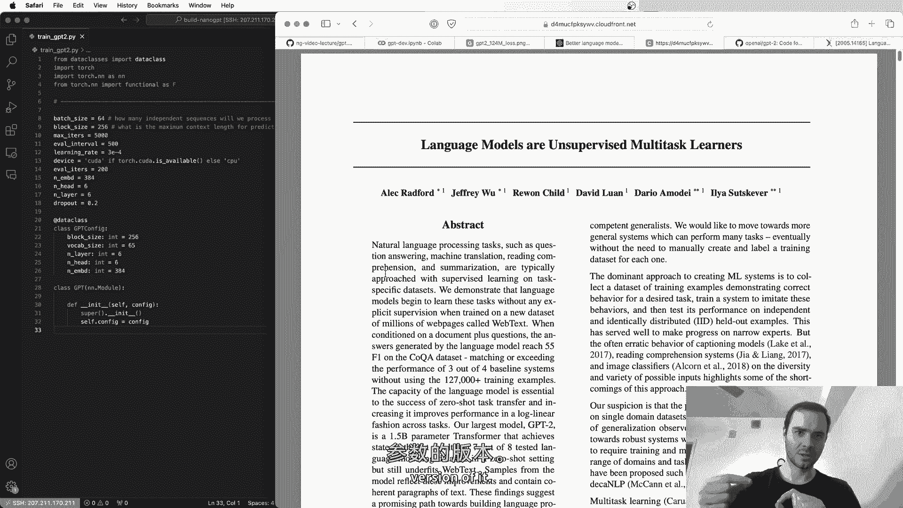

 So when opening I released GPT-2 this was 2019 and they released it with this blog post。

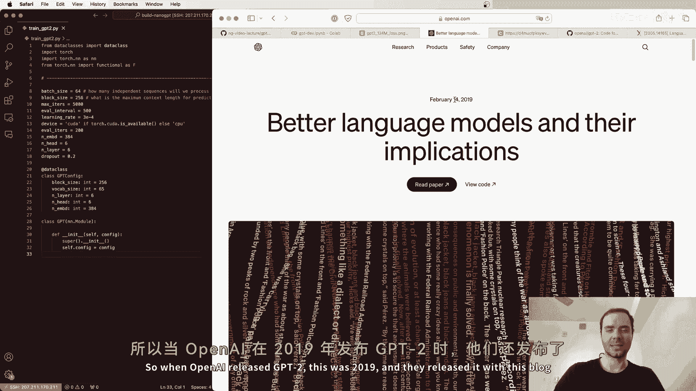

 On top of that they released this paper and on top of that they released this code on GitHub。

 So opening I/GPT-2。 Now when we talk about reproducing GPT-2 we have to be careful because in particular in this video we are going to be reproducing the 124 million parameter model。

 So the thing to realize is that there is always a miniseries when these releases are made。

 So there are the GPT-2 miniseries made up of models at different sizes and usually the biggest model is called the GPT-2。

 But basically the reason we do that is because you can put the model sizes on the x-axis of plots like this。

 And on the y-axis you put a lot of downstream metrics that you are interested in like translation。

 summarization， question answering and so on。 And you can chart out the scaling loss。

 So basically as the model size increases you are getting better and better at downstream metrics。

 And so in particular for GPT-2 if we scroll down in the paper there are four models in the GPT-2 miniseries starting at 124 million all the way up to 1558 million。

 Now the reason my numbers， the way I say them disagree with this table is that this table is wrong。

 If you actually go to the GPT-2 github repo they sort of say that there was an error in how they added up the parameters。

 But basically this is the 124 million parameter model， etc。

 So the 124 million parameter had 12 layers in the transformer and it had 768 channels in the transformer 768 dimensions。

 And I'm going to be assuming some familiarity with what these terms mean because I covered all of this in my previous video。

 let's build GPT-2。 Let's build GPT from scratch。 So I covered that in the previous video in this playlist。

 Now if we do everything correctly and everything works out well。

 by the end of this video we're going to see something like this。

 Where we're looking at the validation loss which basically measures how good we are at predicting the next token in a sequence on some validation data that the model has not seen during training。

 And we see that we go from doing that task not very well because we're initializing from scratch all the way to doing that task quite well by the end of the training。

 And hopefully we're going to beat the GPT-2 124M model。

 Now previously when they were working on this this is already five years ago。

 So this was probably a fairly complicated optimization at the time and the GPUs and the compute was a lot smaller。

 Today you can reproduce this model in roughly an hour or probably less even and it will cost you about ten bucks if you want to do this on the cloud compute as a computer that you can all rent。

 And if you pay ten dollars for that computer you wait about an hour or less。

 You can actually achieve a model that is as good as this model that opening I released。

 And one more thing to mention is unlike many other models。

 opening I did release the weights for GPT-2。 So those weights are all available in this repository。

 But the GPT-2 paper is not always as good with all of the details of training。

 So in addition to the GPT-2 paper we're going to be referencing the GPT-3 paper which is a lot more concrete in a lot of the high parameters and optimization settings and so on。

 And it's not a huge departure in the architecture from the GPT-2 version of the model。

 So we're going to be referencing both GPT-2 and GPT-3 as we try to reproduce GPT-2， 124M。

 So let's go。 So the first thing I would like to do is actually start at the end or at the target。

 So in other words let's load the GPT-2， 124M model as it was released by OpenAI and maybe take it for a spin。

 Let's sample some tokens from it。 Now the issue with that is when you go to the codebase of GPT-2 and you go into the source and you click in on the model that Pi。

 you'll realize that actually this is using TensorFlow。

 So the original GPT-2 code here was written in TensorFlow which is， you know， not， let's just say。

 not used as much anymore。 So we like to use PyTorch because it's a lot friendlier。

 easier and I just personally like it a lot more。 The problem with that is the initial code is in TensorFlow。

 We like to use PyTorch。 So instead to get the target we're going to use the hugging phase transformers code which I like a lot more。

 So when you go into the transformers source transformers models GPT-2 modeling GPT-2。py。

 you will see that they have the GPT-2 implementation of that transformer here in this file。

 And it's like medium readable but not fully readable。

 What it does is it did all the work of converting all those weights from TensorFlow to PyTorch friendly and so it's much easier to load and work with。

 So in particular we can look at the GPT-2 model here and we can load it using hugging phase transformers。

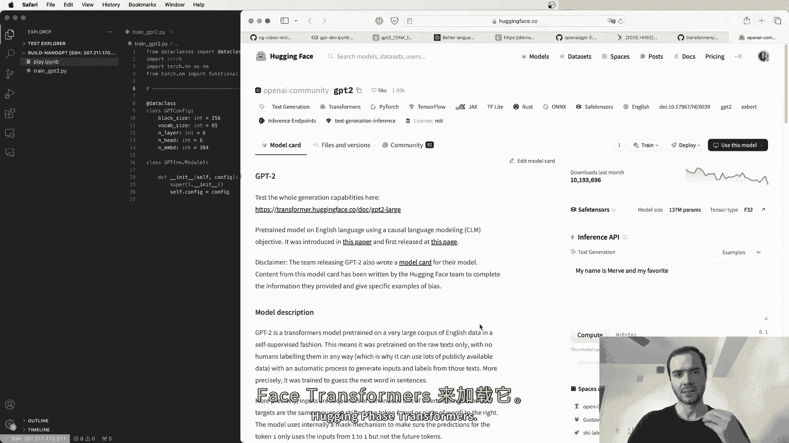

 So swinging over this is what that looks like。 From transformers import the GPT-2 L&M head model and then from pre-trained GPT-2。

 Now one awkward thing about this is that when you do GPT-2 as the model that we're loading this actually is the 124 million parameter model。

 If you want the actual the GPT-2 the 1。5 billion then you actually want to do dash-accel。

 So this is the 124M R target。 Now what we're doing is when we actually get this we're initializing the PyTorch and N module as defined here in this class。

 From it I want to get just the state dict which is just the raw tensors。

 So we just have the tensors of that file。 And by the way here this is a Jupyter notebook but this is Jupyter notebook running inside VS code。

 So I like to work with it all in a single sort of interface so I like to use VS code so this is the Jupyter notebook extension inside VS code。

 So we can get the state dict this is just a dict so we can print the key and the value which is the tensor and let's just look at the shapes。

 So these are sort of the different parameters inside the GPT-2 model and their shape。

 So the W weight for token embedding is of size 50257 by 768。

 Where this is coming from is that we have 50257 tokens in the GPT-2 vocabulary。

 And the tokens by the way these are exactly the tokens that we spoke about in the previous video on my tokenization series。

 So the previous videos just before this I go into a ton of detail on tokenization。

 GPT-2 tokenizer happens to have this many tokens。 For each token we have a 768 dimensional embedding that is the distributed representation that stands in for that token。

 So each token is a little string piece and then P768 numbers are the vector that represents that token。

 And so this is just our lookup table for tokens and then here we have the lookup table for the positions。

 So because GPT-2 has a maximum sequence of 1024 we have up to 1024 positions that each token can be attending to in the past。

 And every one of those positions in GPT-2 has a fixed vector of 768 that is learned by optimization。

 And so this is the position embedding and the token embedding。

 And then everything here is just the other weights and biases and everything else of this transformer。

 So when you just take for example the positional embeddings and flatten it out and take just 20 elements you can see that these are just parameters。

 These are weights， floats， just we can take and we can plot them。

 So these are the position embeddings。 And we get something like this and you can see that this has structure。

 And it has structure because what we have here really is every row in this visualization is a different position。

 a fixed absolute position in the range from 0 to 1024。

 And each row here is the representation of that position。

 And so it has structure because these positional embeddings end up learning these sinusoids and cosines that sort of like represent each of these positions。

 And each row here stands in for that position and is processed by the transformer to recover all the relative positions and sort of realize which token is where and attend to them depending on their position。

 not just their content。 So when we actually just look into an individual column inside these and I just grabbed three random columns。

 you'll see that for example here we are focusing on every single channel。

 And we're looking at what that channel is doing as a function of position from one from zero to 1023 really。

 And we can see that some of these channels basically like respond more or less to different parts of the position spectrum。

 So this green channel really likes to fire for everything after 200 up to 800 but not less but a lot less and has a sharp drop off here near zero。

 So who knows what these embeddings are doing and why they are the way they are。

 You can tell for example that because they're a bit more jagged and they're kind of noisy。

 you can tell that this model was not fully trained。 And the more trained this model was。

 the more you would expect to smooth this out。 And so this is telling you that this is a little bit of an under trained model。

 But in principle actually these curves don't even have to be smooth。

 This should just be totally random noise。 And in fact in the beginning of the optimization it is complete random noise because this position embedding table is initialized completely at random。

 So in the beginning you have jaggedness and the fact that you end up with something smooth is already kind of impressive that that just falls out of the optimization because in principle you shouldn't even be able to get any single graph out of this that makes sense。

 But we actually get something that looks a little bit noisy but for the most part looks sinusoidal like。

 In the original transformer paper the attention is all you need paper。

 The positional embeddings are actually initialized and fixed。

 and sinusoidal like features during the optimization。

 We can also look at any of the other matrices here so here I took the first layer of the transformer and looking at like one of its weights and just the first block of 300 by 300。

 And you see some structure but like again like who knows what any of this is。

 If you're into mechanistic interoperability you might get a real kick out of trying to figure out like what is going on what is this structure and what does this all mean but we're not going to be doing that in this video。

 But we definitely see that there's some interesting structure and that's kind of cool。

 But we're most interested in this we've loaded the weights of this model that was released by OpenAI and now using the hugging face transformers we cannot just get all the raw weights but we can also get the what they call pipeline and sample from it。

 So this is the prefix hello I'm a language model comma and then we're sampling 30 tokens and we're getting five sequences and I ran this and this is what it produced。

 Hello I'm a language model。 But what I'm really doing is making a human readable document。

 There are other languages but those are thought that thought。

 So you can read through these if you like but basically these are five different completions of the same prefix from this duty to 124 M。

 Now if I go here I took this example from here。

 And sadly even though we are fixing the seed we are getting different generations from the snippet than what they got。

 So presumably the code changed but what we see though at this stage that's important is that we are getting coherent text。

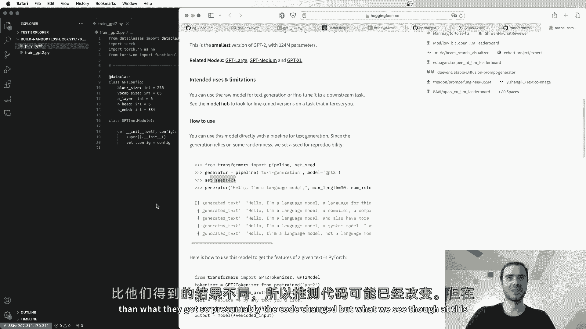

 So we've loaded the model successfully we can look at all its parameters and the keys tell us where in the model these come from。

 And we want to actually write our own GPT two class so that we have full understanding of what's happening there。

 We don't want to be working with something like the modeling GPT two。

py because it's just too complicated we want to write this from scratch ourselves。

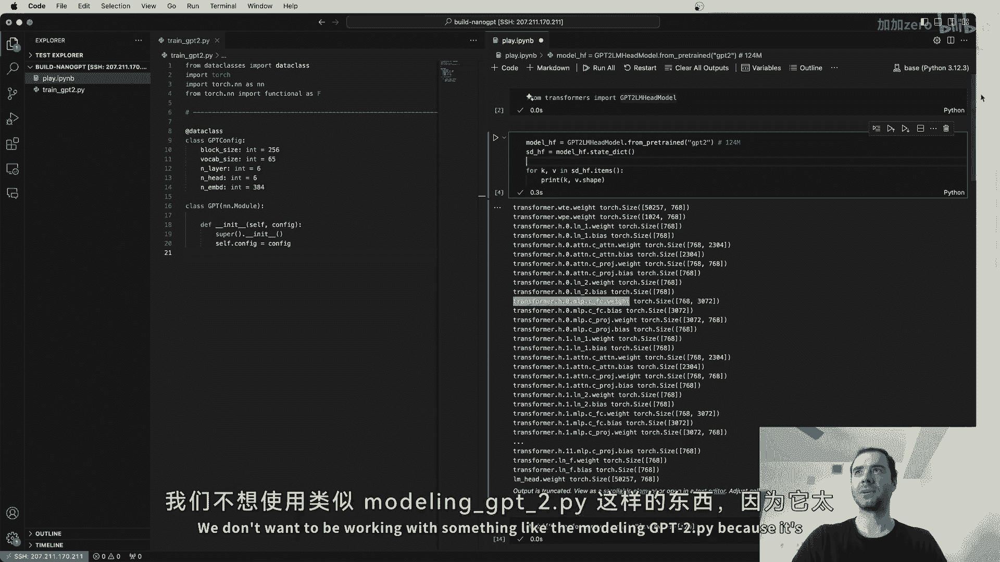

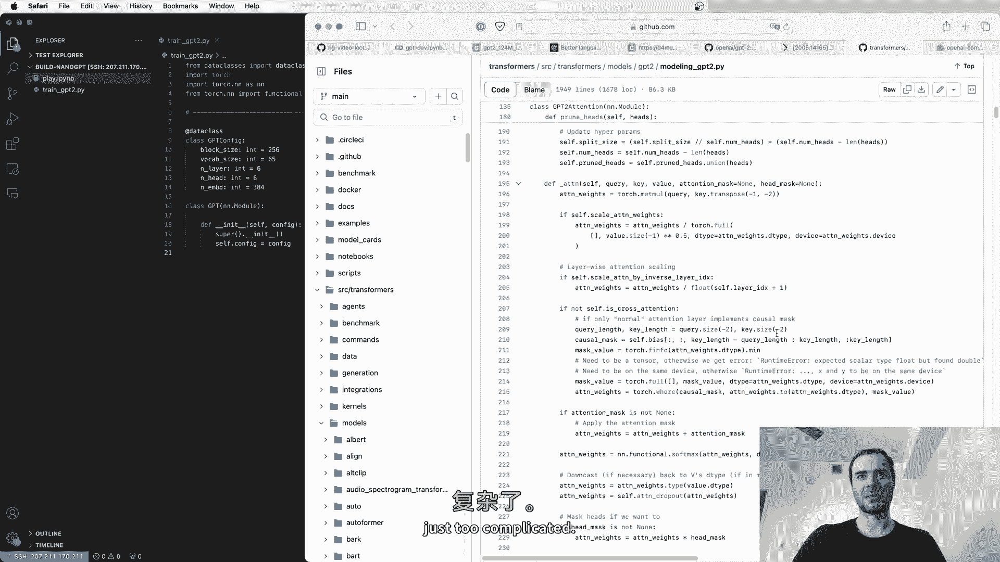

 So we're going to be implementing the GPT model here in parallel。

 And as our first task let's load the GPT two on 24 M into the class that we are going to develop here from scratch。

 That's going to give us confidence that we can load the opening model and therefore there's a setting of weights that exactly is the 124 model。

 But then of course what we're going to do is we're going to initialize the model from scratch instead and try to train it ourselves on a bunch of documents that we're going to get。

 And we're going to try to surpass that model。 So we're going to get different weights and everything's going to look different hopefully better even。

 But we're going to have a lot of confidence that because we can load the opening model we are in the same model family and model class and we just have to rediscover a good setting of the weights but from scratch。

 So let's now write the GPT two model and let's load the weights and make sure that we can also generate text that looks coherent。

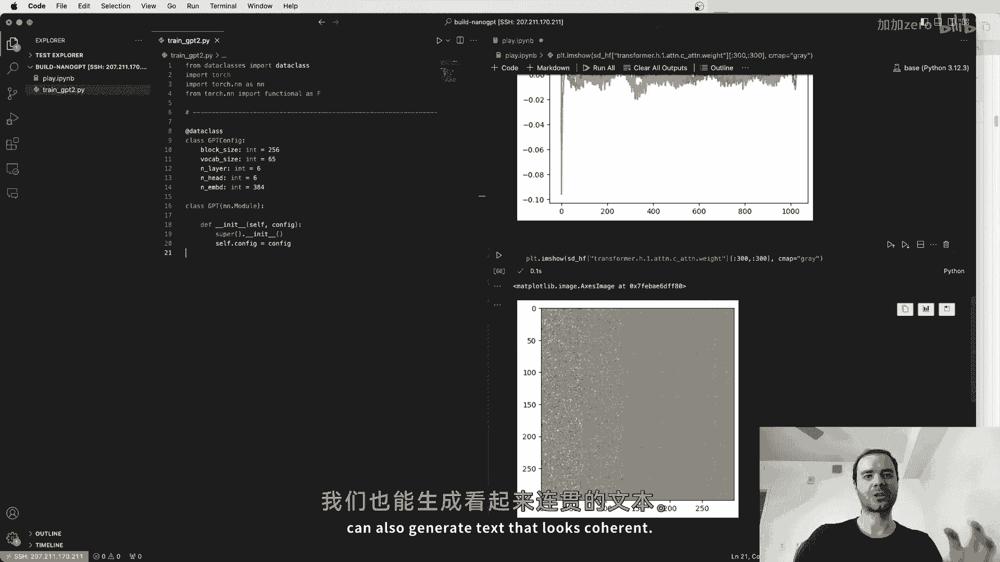

 Okay， so let's now swing over to the attention is on any paper that started everything and let's scroll over to the model architecture the original transformer。

 Now remember that GPT two is slightly modified from the original transformer in particular we do not have the encoder GPT two is a decoder only transformer as we call it。

 So this entire encoder here is missing。 And in addition to that this cross attention here that was using that encoder is also missing so we delete this entire part。

 Everything else stays almost the same but there are some differences that we're going to sort of look at here。

 So there are two main differences。 And then we go to the GPT two paper under two point three model。

 We notice that first there's a reshuffling of the layer norms so they change place and second。

 and additional layer normalization was added here to the final self attention block。

 So basically all the layer norms here， instead of being after the MLP or after the attention。

 they swing before it and an additional layer name gets added here right before the final classifier。

 So now let's implement some of the first sort of skeleton and modules here in our GPT and module。

 And in particular we're going to try to match up to this schema here that is used by hugging face transformers because that will make it much easier to load these weights from this state。

 So we want something that reflects this schema here。 So here's what I came up with。

 Basically we see that the main container here that has all the modules is called transformer。

 So I'm reflecting that within an end module dict。 And this is basically a module that allows you to index into the sub modules using keys just like a dictionary strings。

 Within it we have the weights of the token embeddings WTE and that's an embedding。

 And the weights of the position embeddings which is also just an embedding。 And if you remember。

 an embedding is really just a fancy little wrapper module around just a single array of numbers。

 A single block of numbers just like this。 It's a single tensor。

 And embedding is a glorified wrapper around a tensor that allows you to access its elements by indexing into the rows。

 Now in addition to that we see here that we have a dot H and then this is indexed using numbers instead of indexed using strings。

 So there's a dot H dot zero one two etc。 All the way up till dot H dot eleven。

 And that's because there are twelve layers here in this transformer。

 So to reflect that I'm creating also an H I think that probably stands for hidden。

 And instead of a module dict this is a model list so we can index it using integers exactly as we see here。

 And we can index it using a dot zero dot one two etc。

 And the module list has n layer blocks and the blocks are yet to be defined and then module in a bit。

 In addition to that following the GPT two paper we need an additional final layer norm that we're going to put in there。

 And then we have the final classifier the language model head which projects from 768 the number of embedding dimensions in this GPT。

 All the way to the vocab size which is about 50，257 and GPT two uses no bias for this final sort of projection。

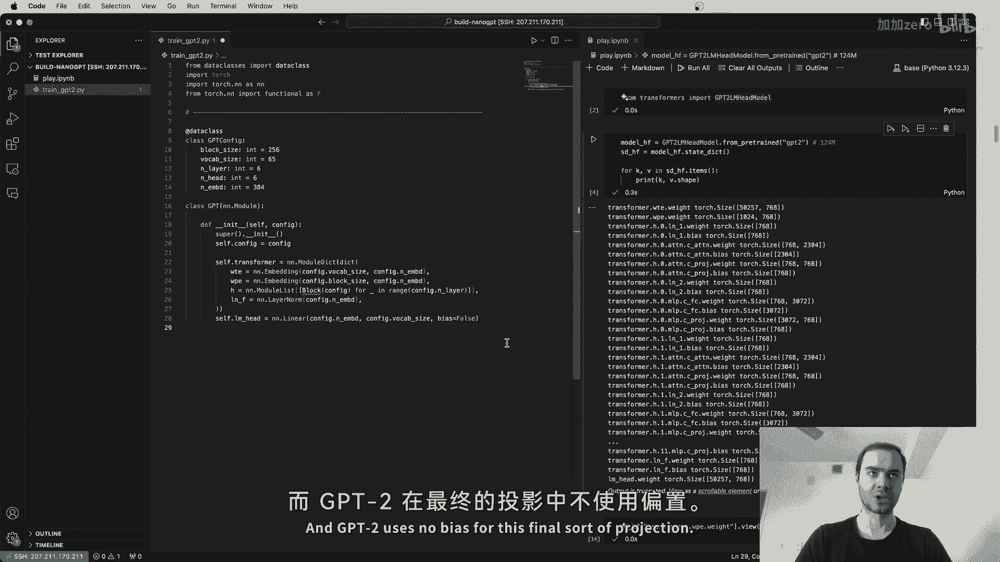

 So this is the skeleton and you can see that it reflects this so the WTE is the token embeddings。

 Here it's called output embedding but it's really the token embeddings。

 The PE is the positional encolings those two pieces of information as we saw previously are going to add and then going to the transformer。

 The dot H is the older blocks in gray and the LNF is this new layer that gets added here by the GPT two model。

 And L and head is this linear part here。

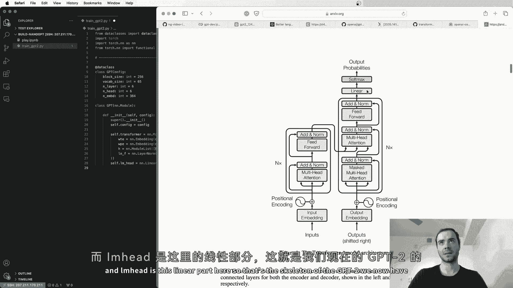

 So that's the skeleton of the GPT two。 We now have to implement the block。

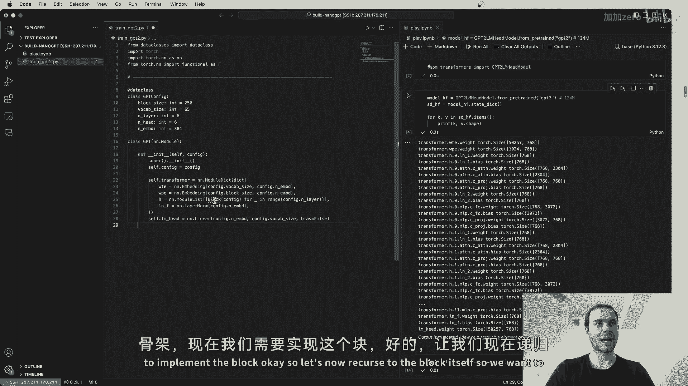

 Okay so let's now recurse to the block itself so we want to define the block。

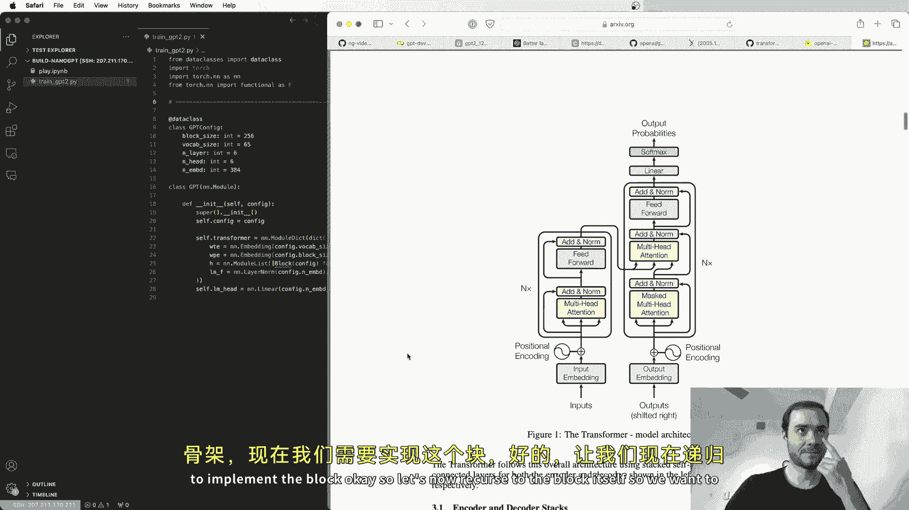

 So I'll start putting them here。 So the block I like to write it out like this。

 These are some of the initializations and then this is the actual forward passive what this block computes。

 And notice here that there's a change from the transformer again that is mentioned in the GPT two paper。

 So here the layer normalizations are after the application of attention or feed forward。

 In addition to that note that the normalizations are inside the residual stream。

 You see how feed forward is applied and this arrow goes through and through the normalization。

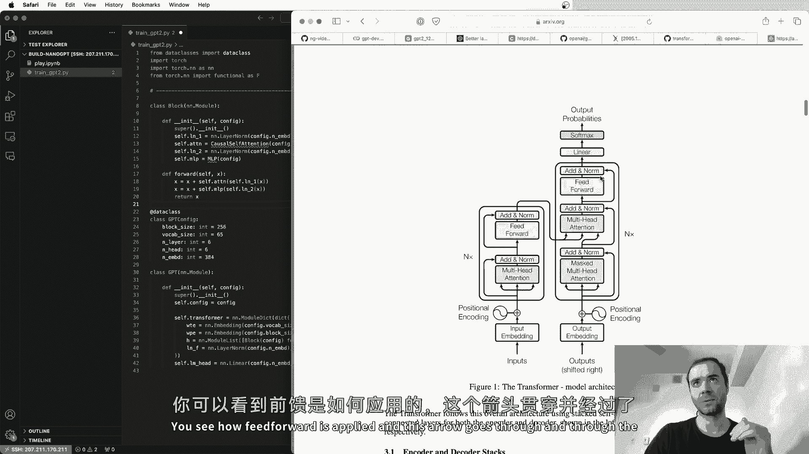

 So that means that your residual pathway has normalizations inside them。

 And this is not very good or desirable。 You actually prefer to have a single clean residual stream all the way from supervision all the way down to the inputs of the tokens。

 And this is very desirable and nice because the gradients that flow from the top if you remember from your micro grad。

 addition just distributes gradients during the backward stage to both of its branches equally。

 So addition is a branch in the gradients。 And so that means that the gradients from the top flow straight to the inputs。

 the tokens， through the residual pathways unchanged。

 But then in addition to that the gradient also flows through the blocks。

 And the blocks contribute their own contribution over time and kick in and change the optimization over time。

 But basically clean residual pathway is desirable from an optimization perspective。

 And then this is the pre normalization version where you see that our X first goes through the layer normalization and then the attention and then goes back out to go to the layer normalization number two and the multi-layer perceptron。

 Sometimes also refer to as a feed forward network or an FM and then that goes into the residual stream again。

 And the one more thing that is kind of interesting to note is that recall that attention is a communication operation。

 It is where all the tokens and there's one thousand twenty four tokens lined up in a sequence。

 And this is where the tokens communicate。 This is where they exchange information。

 So attention is a aggregation function。 It's a pooling function。 It's a weighted sum function。

 It is a reduce operation。 Whereas MLP， this MLP here happens at every single token individually。

 There's no information being collected or exchanged between the tokens。

 So the attention is the reduce and the MLP is the map。

 And what you end up with is that the transformers just ends up just being a repeated application of map reduce。

 If you want to think about it that way。 So this is where they communicate and this is where they think individually about the information that they gathered。

 And every one of these blocks it really refines the representation inside the residual stream。

 So this is our block。 It's likely modified from this picture。 Okay， so let's now move on to the MLP。

 So the MLP block I implemented as follows。 It is relatively straightforward。

 We basically have two linear projections here that are sandwiched in between the GALU nonlinearity。

 So， and in that GALU approximate is 10H。

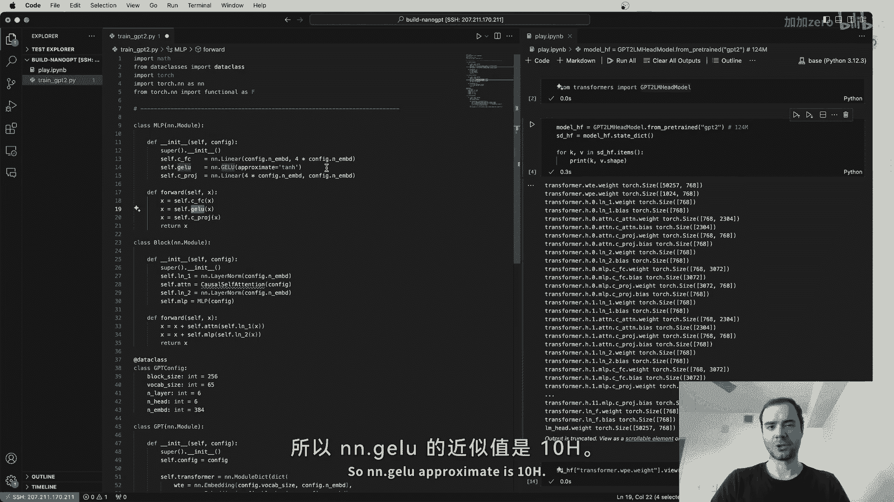

 Now when we swing on， swing over to the patch of documentation。

 this is in that GALU and it has this format。 And it has two versions。

 The original version of GALU which we'll step into in a bit and the approximate version of GALU which we can request using 10H。

 So as you can see just as a preview here GALU is a basically like a relu。

 Except there's no flat exactly flat tail here at exactly zero。

 But otherwise it looks very much like a slightly smoother relu。 It comes from this paper here。

 Gosh in error linear units。 And you can step through this paper and there's some mathematical kind of reasoning that leads to interpretation at least to the specific formulation。

 It has to do with stochastic real risers and the expectation of a modification to it have to drop out。

 So you can read through all of that if you'd like here。

 And there's a little bit of history as to why there is an approximate version of GALU。

 And that comes from this issue here as far as I can tell。

 And in this issue Daniel Hendrix mentions that at the time when they developed this nonlinearity。

 the IRF function which you need to evaluate the exact GALU was very slow and tensor flow。

 So they ended up basically developing this approximation。

 And this approximation then ended up being picked up by BERT and by GPT-2 etc。

 But today there's no real good reason to use the approximate version。

 You'd prefer to just use the exact version。 Because my expectations that there's no big difference anymore。

 And this is kind of like a historical kind of quirk。 But we are trying to reproduce GPT-2 exactly。

 GPT-2 used the 10H approximate version。 So we prefer to stick with that。

 Now one other reason to actually just intuitively use GALU instead of VARLU is previously in videos in the past。

 We've spoken about the dead relu neuron problem where in this tail of a relu if it's exactly flat at zero。

 Any activations that fall there will get exactly zero gradient。 There's no change。

 There's no adaptation。 There's no development of the network if any of these activations end in this flat region。

 But the GALU always contributes a local gradient。 And so there's always going to be a change。

 always going to be an adaptation。 And sort of smoothing it out ends up empirically working better in practice as demonstrated in this paper。

 And also as demonstrated by it being picked up by the BERT paper GPT-2 paper and so on。

 So for that reason we adopt this nonlinearity here in the 10 in the GPT-2 reproduction。

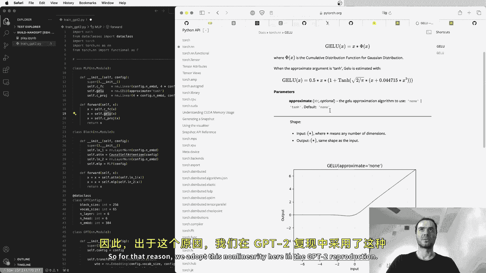

 Now in more modern networks also like LAMA3 and so on this nonlinearity also further changes to SWIGWOO and other variants like that。

 But for GPT-2 they use this approximate GALU。 Okay and finally we have the attention operation。

 So let me paste in my attention。 So I know this is a lot so I'm going to go through this a bit quickly。

 A bit slowly but not too slowly because we have covered this in the previous video and I would just punch you there。

 So this is the attention operation。

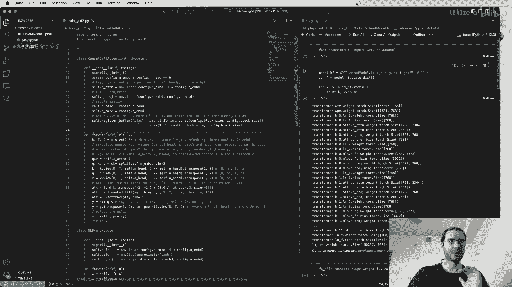

 Now in the previous video you will remember this is not just attention。

 This is multi-headed attention。 And so in the previous video we had this multi-headed attention module。

 And this implementation made it obvious that these heads are not actually that complicated。

 There's basically in parallel inside every attention block。

 There's multiple heads and they're all functioning in parallel and their outputs are just being concatenated。

 And that becomes the output of the multi-headed attention。

 So the heads are just kind of like parallel streams and their outputs get concatenated。

 And so it was very simple and made the head be kind of like fairly straightforward in terms of its implementation。

 What happens here is that instead of having two separate modules and indeed many more modules that get concatenated。

 all of that is just put into a single self-attention module。

 And instead I'm being very careful and doing a bunch of transpose split tensor gymnastics to make this very efficient impact torch。

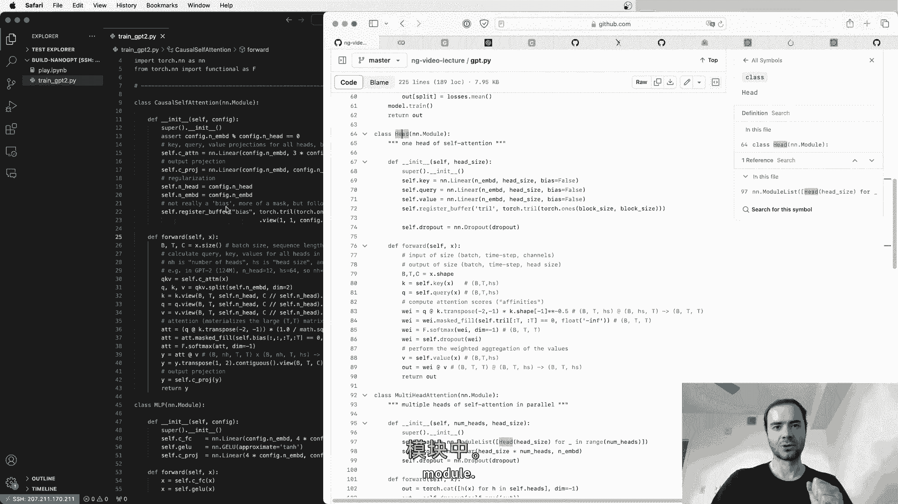

 But fundamentally and algorithmically nothing is different from the implementation we saw before in this give repository。

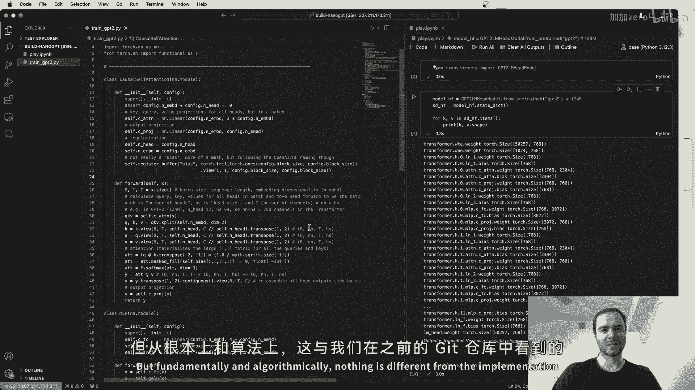

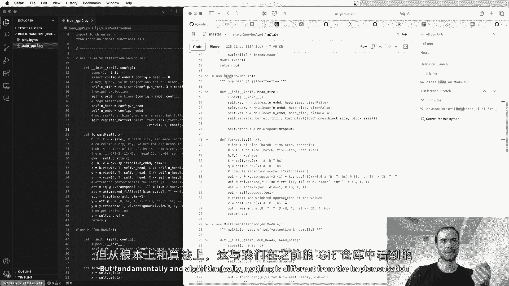

 So to remind you very briefly and I don't want to go into this in too many too much time。

 but we have these tokens lined up in a sequence and there's one thousand twenty of them。

 And then each token at this stage of the attention emits three vectors， the query key and the value。

 And first what happens here is that the queries and the keys have to multiply each other to get sort of the attention amount。

 Like how interesting they find each other。 So they have to interact multiplicatively。

 So we're doing here as we're calculating the qkv， we're splitting it and then there's a bunch of gymnastics as I mentioned here。

 And the way this works is that we're basically making the number of heads， an H。

 into a batch dimension。 And so it's a batch dimension just like B so that in these operations that follow。

 PyTorch treats B and H as batches and it applies all the operations on all of them in parallel in both the batch and the heads。

 And the operations that can apply are number one， the queries and the keys interact to give us our attention。

 This is the autoregressive masks that make sure that the tokens only attend to tokens before them and never to tokens in the future。

 The softmax here normalizes the attention so it sums to one always。

 And then recall from the previous video that doing the attention matrix multiplied with the values is basically a way to do a weighted sum of the values of the tokens that we found in terms of the values。

 And then the final transpose contiguous and view is just reassembling all of that again。

 And this actually performs the concatenation operation。

 So you can step through this slowly if you'd like。

 But it is equivalent mathematically to our previous implementation。

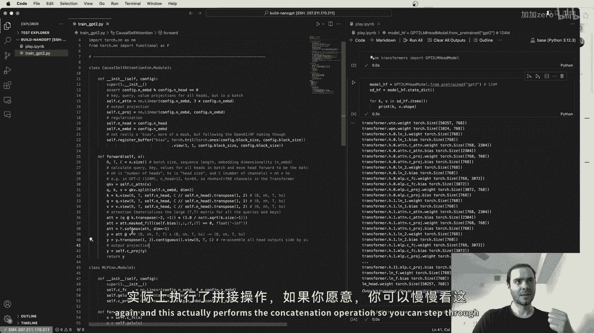

 It's just more efficient in PyTorch。 So that's why I chose this implementation instead。

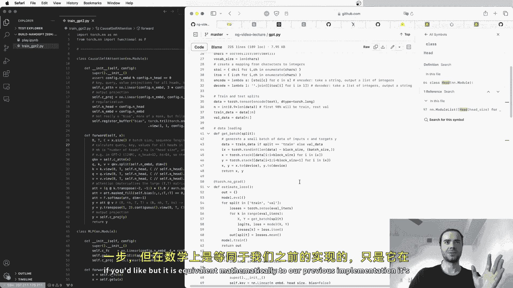

 Now in addition to that， I'm being careful with how I name my variables。 So for example。

 CATEN is the same as CATEN。 And so actually our keys should basically exactly follow the schema of the hugging face transformers code。

 And that will make it very easy for us to now port over all the weights from exactly this sort of naming conventions。

 Because all of our variables are named the same thing。

 But at this point we have finished the dgpt2 implementation。

 And what that allows us to do is we don't have to basically use this file from hugging face。

 which is fairly long。

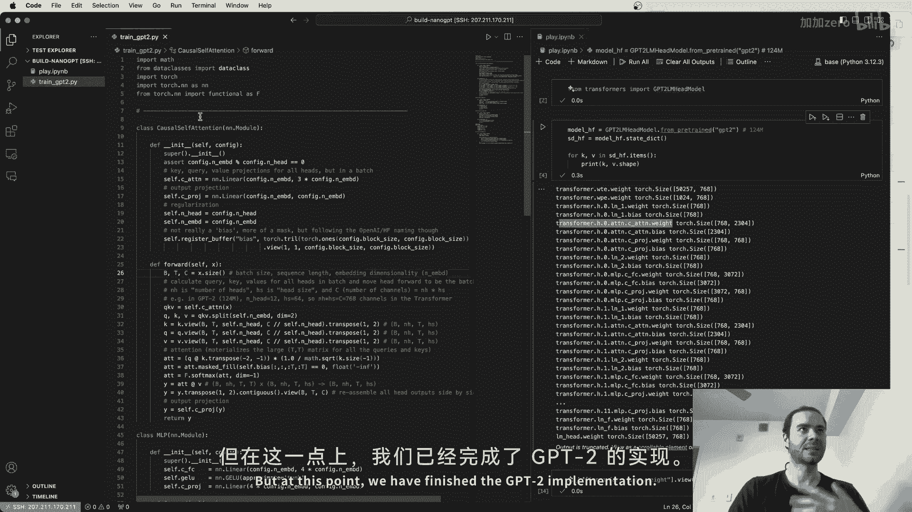

 This is 2000 lines of code。 Instead we just have less than 100 lines of code。

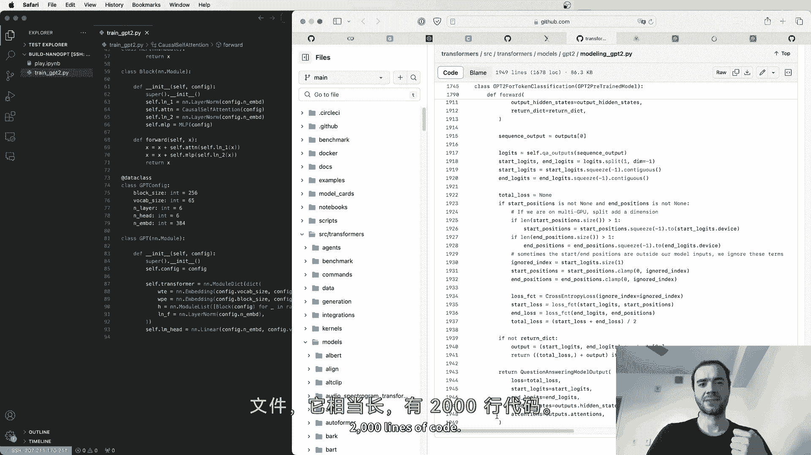

 And this is the complete gpt2 implementation。 So at this stage we should just be able to take over all the weights。

 set them， and then do generation。 So let's see what that looks like。 Okay。

 so here I've also changed the gpt config so that the numbers here。

 the hyperparameters agree with the gpt2， 124， and model。 So the maximum sequence length。

 which I call block size here， is 124。 The number of tokens is 5257。

 which if you watch my token as a video， know that this is 50，000 mergers， Bp mergers。

 256 byte tokens， the leaves of the bp3， and one special end of text token that delimits different documents and can start generation as well。

 And there are 12 layers， there are 12 heads in the attention and the dimension of the transformers was 768。

 So here's how we can now load the parameters from hugging face to our code here and initialize the gpt class with those parameters。

 So let me just copy paste a bunch of code here。 And I'm not going to go through this code too slow。

 too quickly， too slowly， because honestly it's not that interesting， it's not that exciting。

 we're just loading the weights， so it's kind of dry。 But as I mentioned。

 there are four models in this mini series of gpt2。

 This is some of the jupyter code code that we had here on the right， I'm just porting it over。

 These are the hyper parameters of the gpt2 models。

 We're creating the config object and creating our own model。

 And then what's happening here is we're creating the state dict。

 both for our model and for the hugging face model。

 And then what we're doing here is we're going over the hugging face model keys and we're copying over those tensors。

 And in the process， we are kind of ignoring a few of the buffers。 They're not parameters。

 they're buffers。 So for example， attention to bias， that's just used for the R aggressive mask。

 And so we are ignoring some of those masks。 And that's it。

 And then one additional kind of annoyance is that this comes from the tensor flow repo and I'm not sure how this is a little bit annoying。

 but some of the weights are transposed from what PyTorch would want。 And so manually。

 I hard coded the weights that should be transposed and then we transpose them if that is so。

 And then we return this model。 So the firm pre-trained is a constructor or a class method in Python that returns the GPT object if we just give it the model type。

 which in our case is GPT2， the smallest model that we're interested in。

 So this is the code and this is how you would use it。

 And we can pop open a terminal here in VS code and we can Python train GPT2。py and fingers crossed。

 Okay， so we didn't crash。 And so we can load the weights and the biases and everything else into our and then module。

 But now let's also get additional confidence that this is working and let's try to actually generate from this model。

 Okay， now before we can actually generate from this model， we have to be able to forward it。

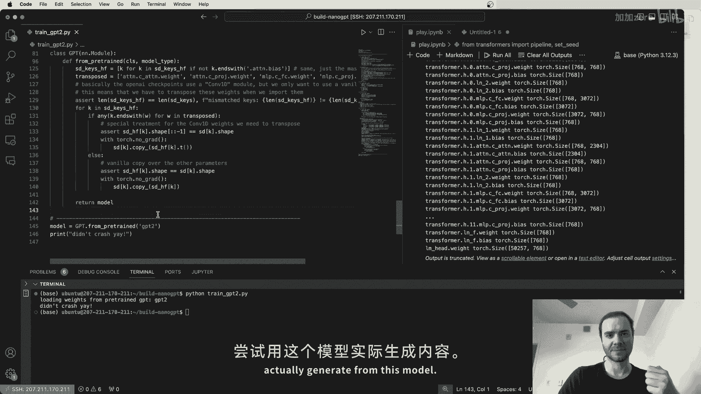

 We didn't actually write that code yet。 So here's the forward function。

 So the input to the forward is going to be our indices， our tokens， token indices。

 And they are always of shape B by T。 And so we have batch dimension of B。

 And then we have the time dimension of up to T。 And the T can be more than the block size。

 The block size is the maximum sequence length。 So B by T indices arranged a sort of like a two dimensional layout。

 And remember that basically every single row of this is of size up to block size。

 And this is T tokens that are in a sequence。

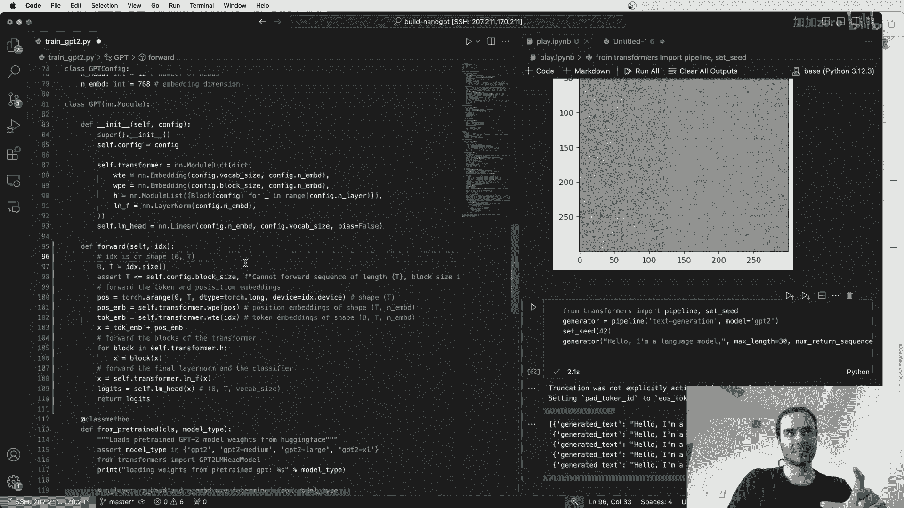

 And then we have B independent sequences stacked up in a batch so that this is efficient。

 Now here we are forwarding the position embeddings and the token embeddings。

 And this code should be very recognizable from the previous lecture。 So we basically use a range。

 which is kind of like a version of range but for PyTorch。

 And we're iterating from zero to T and creating this positions sort of indices。

 And then we are making sure that they're unseen devices IDX because we're not going to be training on only CPU。

 That's going to be too inefficient。 We want to be training on GPU and it's going to come in a bit。

 Then we have the position embeddings and token embeddings and the addition operation of those two。

 Now notice that the position embeddings are going to be identical for every single row of the input。

 And so there's broadcasting hidden inside this plus where we have to create an additional dimension here。

 And then these two add up because the same position embeddings apply to every single row of our examples stacked up in a batch。

 Then we forward the transformer blocks and finally the last layer norm and the LMD。

 So what comes out after forward is the logits。 And if the input was B by T indices。

 then at every single B by T we will calculate the logits for what token comes next in the sequence。

 So what is the token B T plus 1， the one on the right of this token。

 And book half size here is the number of possible tokens。

 And so therefore this is the tensor that we're going to obtain。

 And these logits are just a softmax away from coming probabilities。

 So this is the forward pass of the network and now we can get logits and so we're going to be able to generate from the model。

 Okay， so now we're going to try to set up the identical thing on the left here that matches hugging face on the right。

 So here we sampled from the pipeline and we sampled five times up to 30 tokens with a prefix of hello on the language model。

 And these are the completions that we achieved。 So we're going to try to replicate that on the left here。

 So number of term sequences is five max length is 30。

 So the first thing we do of course is we initialize our model。 Then we put it into evaluation mode。

 Now this is a good practice to put the model into eval when you're not going to be training it。

 You're just going to be using it。 And I don't actually know if this is doing anything right now for the following reason。

 Our model up above here contains no modules or layers that actually have a different behavior at training or evaluation time。

 So for example dropout， batch alarm and a bunch of other layers have this kind of behavior。

 But all of these layers that we've used here should be identical in both training and evaluation time。

 So potentially model that eval is nothing but then I'm not actually sure if this is the case and maybe pytorch internals do some clever things depending on the evaluation mode inside here。

 The next thing we're doing here is we are moving the entire model to CUDA。

 So we're moving this all of the tensors to GPU。 So I'm SSH'd here to a cloud box and I have a bunch of GPUs on this box。

 And here I'm moving the entire model and all of its members and all of its tensors and everything like that。

 Everything gets shipped off to basically a whole separate computer that is sitting on the GPU。

 And the GPU is connected to the CPU and they can communicate but it's basically a whole separate computer with its own computer architecture。

 And it's really a well catered to parallel processing tasks like those of running neural networks。

 So I'm doing this so that the model lives on the GPU。

 a whole separate computer and it's just going to make our code a lot more efficient because all of this stuff runs a lot more efficiently on the GPUs。

 So that's the model itself。 Now， the next thing we want to do is we want to start with this as the prefix when we do the generation。

 So let's actually create those prefix tokens。 So here's the code that I've written。

 We're going to import the tick token library from OpenAI and we're going to get the GPT-2 encoding。

 So that's the tokenizer for GPT-2。 And then we're going to encode this string and get a list of integers which are the tokens。

 Now these integers here should actually be fairly straightforward because we can just copy paste this string and we can sort of inspect what it is in tick tokenizer。

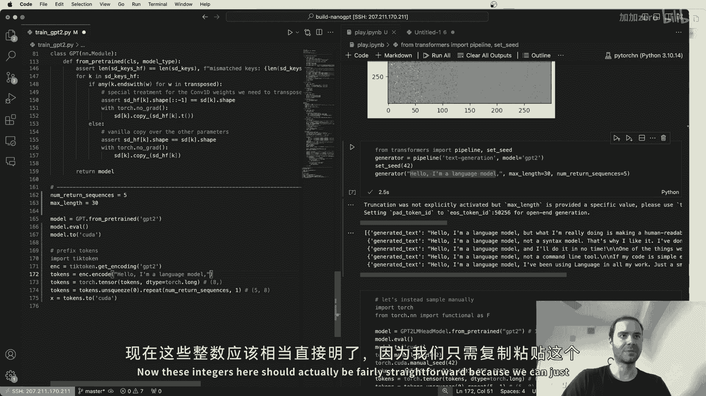

 So just spacing that in， these are the tokens that are going to come out。

 So this list of integers is what we expect tokens to become。 And as you recall， if you saw my video。

 of course， all the tokens， they're just little string chunks。 Right？

 So these are the chunkation of this string into GPT-2 tokens。

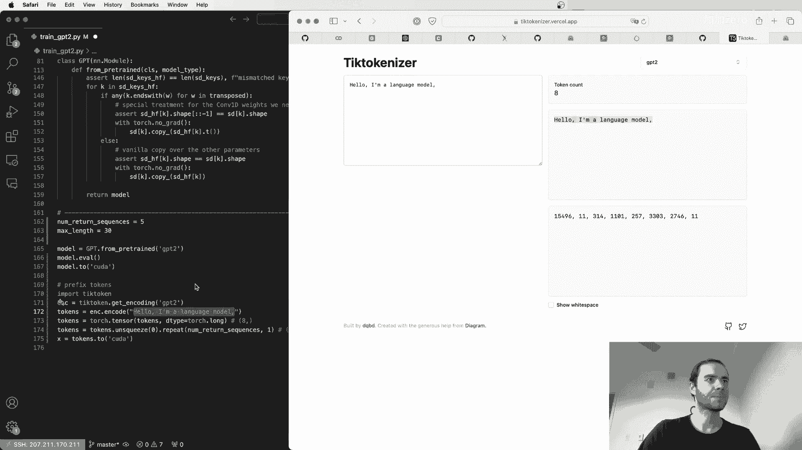

 So once we have those tokens， it's a list of integers， we can create a torch tensor out of it。

 In this case， it's eight tokens。 And then we're going to replicate these eight tokens four。

 five times to get five rows of eight tokens。 And that is our initial input X as I call it here。

 And it lives on the GPU as well。 So X now is this IDX that we can put into forward to get our logits so that we know what comes as the sixth token。

 sorry， as the ninth token in every one of these five rows。 Okay， and we are now ready to generate。

 So let me paste in one more code block here。 So what's happening here in this code block is we have these X。

 which is a size B by T， right？ So batch by time。 And we're going to be in every iteration of this loop。

 we're going to be adding a column of new indices into each one of these rows。 Right？

 And so these are the new indices and we're appending them to the sequence as we're sampling。

 So with each loop iteration， we get one more column into X。

 And all of the operations happening in the context manager of Torx。no。grad。

 this is just telling PyTorch that we're not going to be calling that backward on any of this。

 So it doesn't have to cache all the intermediate tensors。

 It's not going to have to prepare in any way for a potential backward later。

 And this saves a lot of space and also possibly some time。 So we get our logits。

 We get the logits at only the last location。 We throw away all the other logits。 We don't need them。

 We only care about the last column's logits。 So this is being wasteful。

 but this is just kind of like an inefficient implementation of sampling。

 So it's correct but inefficient。 So we get the last column of logits。

 pass it through softmax to get our probabilities。 Then here I'm doing top case sampling of 50。

 And I'm doing that because this is the hugging face default。

 So just looking at the hugging face dogs here of a pipeline。

 There's a bunch of quarks that go into hugging face。 And it's kind of a lot honestly。

 But I guess the important one that I noticed is that they're using top K by default， which is 50。

 And what that does is that's being used here as well。

 And what that does is basically we want to take our probabilities and we only want to keep the top 50 probabilities。

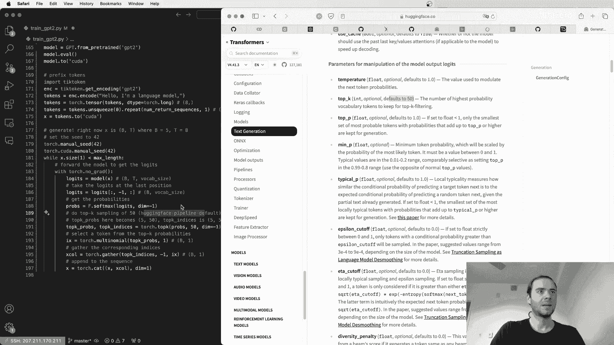

 And anything that is lower than the 50th probability， we just clamped to zero and renormalized。

 And so that way we are never sampling very rare tokens。

 The tokens we're going to be sampling are always in the top 50 of most likely tokens。

 And this helps keep the model kind of on track and it doesn't blabber on and it doesn't get lost and doesn't go off the rails as easily。

 And it kind of like sticks in the vicinity of likely tokens a lot better。

 So this is the way to do it in PyTorch and you can step through it if you like。

 I don't think it's super insightful so I'll speed through it。

 But roughly speaking we get this new column of tokens。

 We append them on X and basically the columns of X grow until this while loop gets tripped up。

 And then finally we have an entire X of size。 Five by 30 in this case in this example。

 And we can just basically print all those individual rows。 So I'm getting all the rows。

 I'm getting all the tokens that are sampled and I'm using the decode function from tick tokness or to get back the string which we can print。

 And so terminal， new terminal。 And let me Python train GPT to。 Okay。

 so these are the generations that we're getting。 Hello， I'm a language model， not a program。

 New line， new line， etc。 Hello， I'm a language model and one of the main things that bothers me when they create languages is how easy it becomes to create something that。

 I mean， so this will just like blabber on right in all these cases。

 Now one thing you will notice is that these generations are not the generations of fucking face here。

 And I can't find the discrepancy to be honest and I didn't fully go through all these options but probably there's something else hiding in addition to the top P。

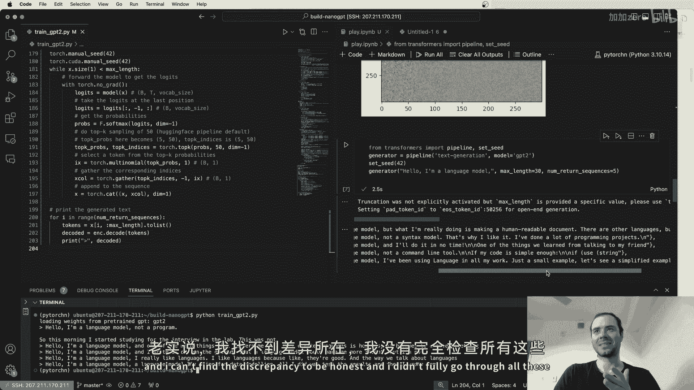

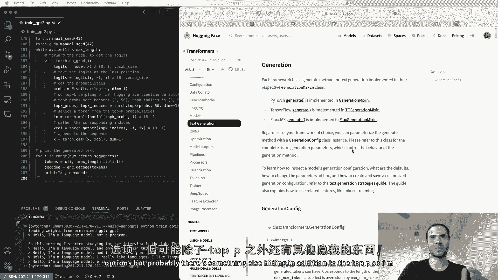

 So I'm not able to match it up but just for correctness down here below in the Jupyter notebook and using the hugging face model。

 So this is the hugging face model here。 I was， I replicated the code and if I do this and I run that。

 then I'm getting the same results。 So basically the model intervals are not wrong。

 It's just I'm not 100% sure what the pipeline does in hugging face and that's why we're not able to match them up。

 But otherwise the code is correct and we've loaded all the tensors correctly。

 So we're initializing the model correctly and everything here works。 So once very short。

 we've ported all the weights， we initialize the GPT to。

 This is the exact opening on GPT to and it can generate sequences and they look sensible。

 And now here of course we're initializing with GPT to model weights。

 But now we want to initialize from scratch from random numbers and we want to actually train the model that will give us sequences as good as or better than these ones in quality。

 And so that's what we turn to next。 So it turns out that using the random model is actually fairly straightforward because PyTorch already initializes our model randomly and by default。

 So when we create the GPT model in the constructor。

 this is all of these layers and modules have random initializers that are there by default。

 So when these linear layers get created and so on， there's default constructors。

 for example using the Javier initialization that we saw in the past to construct the weights of these layers。

 And so creating a random model instead of a GPT to model is actually fairly straightforward and we would just come here and instead we would create model equals GPT。

 And then we want to use the default config GPT config and the default config uses the 124m parameters。

 So this is the random model initialization and we can run it。 And we should be able to get results。

 Now the results here of course are total garbage-carbel and that's because it's a random model。

 And so we're just getting all these random token string pieces chunked up totally at random。

 So that's what we have right now。 Now one more thing I wanted to point out by the way is in case you do not have CUDA available because you don't have a GPU。

 you can still follow along with what we're doing here to some extent。

 And probably not to the very end because by the end we're going to be using multiple GPUs and actually doing a serious training run。

 But for now you can actually follow along decently okay。

 So one thing that I like to do in PyTorch is I like to auto detect the device that is available to you。

 So in particular you could do that like this。 So here we are trying to detect the device to run on that has the highest compute capability。

 You can think about it that way。 So by default we start with CPU which of course is available everywhere because every single computer will have a CPU。

 But then we can try to detect the heavy GPU if so use a CUDA。

 And then if you don't have a CUDA do you at least have MPS。 MPS is the backend for Apple Silicon。

 So if you have a MacBook that is fairly new you probably have Apple Silicon on the inside。

 And then that has a GPU that is actually fairly capable depending on which MacBook you have。

 And so you can use MPS which will be potentially faster than CPU。

 And so we can print the device here。 Now once we have the device we can actually use it in place of CUDA。

 So we just swap it in and notice that here when we call model on X if this X here is on CPU instead of GPU then it will work fine because here in the forward which is where PyTorch will come。

 When we created Pause we were careful to use the device of IDX to create this tensor as well。

 And so there won't be any mismatch where one tensor is on CPU and GPU and you can't combine those。

 But here we are carefully initializing on the correct device as indicated by the input to this model。

 So this will auto detect device。 For me this will be of course GPU。 So using device CUDA。

 But you can also run with as I mentioned another device。 And it's not going to be too much slower。

 So if I override device here。 If I override device = CPU then we'll swap print CUDA of course but now we're actually using CPU。

 One， two， three， four， five， six。 Okay about six seconds。

 And actually we're not using torch compile and stuff like that which will speed up everything a lot faster as well。

 But you can't follow along even on a CPU I think to a decent extent。 So that's a note on that。

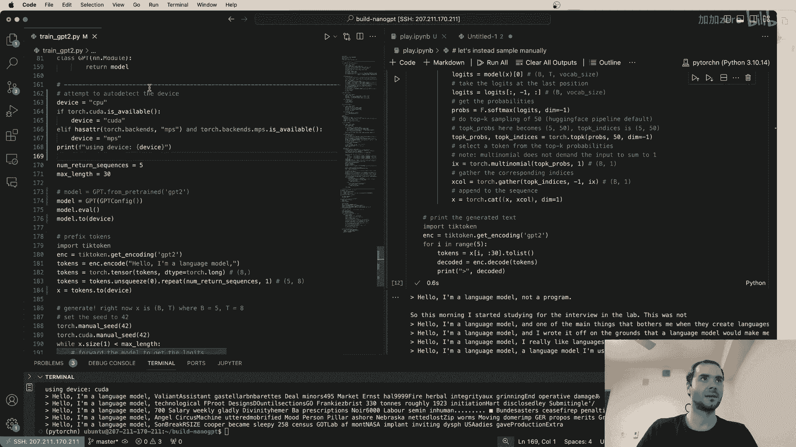

 Okay so I do want to loop around eventually into what it means to have different devices in PyTorch。

 And what this exactly that PyTorch does in the background for you when you do something like module。

to device， or where you take a torch tensor and do a 。to device。

 And what exactly happens and how that works。 But for now I'd like to get to training and I'd like to start training the model。

 And for now let's just say the device makes code go fast。

 And let's go into how we can actually train the model。

 So to train the model we're going to need some data set。

 And for me the best debugging simplest data set that I like to use is the tiny Shakespeare data set。

 And it's available at this URL so you can W get it or you can just search tiny Shakespeare data set。

 And so I have in my file system as just tell us input。txt。 So I already downloaded it。

 And here I'm reading the data set getting the first 1000 characters and printing the first 100。

 Now remember that GPT2 has roughly a compression ratio。

 The tokenizer has a compression ratio of roughly 3 to 1。

 So 1000 characters is roughly 300 tokens here that will come out of this in the slides that we're currently getting。

 So this is the first few characters。 And if you want to get a few more statistics on this we can do word count on input。

txt。 So we can see that this is 40，000 lines， about 200，000 words in this data set。

 and about 1 million bytes in this file。 And knowing that this file is only ASCII characters。

 There's no crazy Unicode here as far as I know。 And so every ASCII character is encoded with one byte。

 And so this is the same number roughly a million characters inside this data set。

 So this is the data set size by default， very small and minimal data set for debugging to get us off the ground。

 In order to tokenize this data set we're going to get tiktoken encoding for GPT2， encode the data。

 the first 1000 characters， and then I'm only going to print the first 24 tokens。

 So these are the tokens as a list of integers。 And if you can read GPT2 tokens you will see that 198 here you'll recognize that as the slashing character。

 So that is a new line。 And then here for example we have two new lines so that's 198 twice here。

 So this is just the tokenization of the first 24 tokens。

 So what we want to do now is we want to actually process these token sequences and feed them into a transformer。

 And in particular we want them， we want to rearrange these tokens into this IDX variable that we're going to be feeding into the transformer。

 So we don't want a single very long one dimensional sequence。

 We want an entire batch where each sequence is up to。

 it's basically t tokens and t cannot be larger than the maximum sequence length。

 And then we have these t long sequence of tokens and we have b independent examples of sequences。

 So how can we create a b by t tensor that we can feed into the forward out of these one dimensional sequences？

 So here's my favorite way to achieve this。 So if we take torch and then we create a tensor object out of this list of integers and just the first 24 tokens。

 My favorite way to do this is basically you do a dot view of。

 for example 4 by 6 which multiply to 24。 And so it's just a two dimensional rearrangement of these tokens。

 And you'll notice that when you view this one dimensional sequence as two dimensional 4 by 6 here。

 the first 6 tokens up to here end up being the first row。

 the next 6 tokens here end up being the second row and so on。

 And so basically it's just going to stack up every 6 tokens in this case as independent rows and it creates a batch of tokens in this case。

 And so for example if we are token 25 in the transformer when we feed this in and this becomes the IDX。

 this token is going to see these three tokens and it's going to try to predict that 198 comes next。

 So in this way we are able to create this two dimensional batch that's quite nice。

 Now in terms of the label that we're going to need for the target to calculate the loss function。

 how do we get that？ Well we could write some code inside the forward pass because we know that the next token in a sequence which is the label is just to the right of us。

 And you'll notice that actually for this token at the very end 13 we don't actually have the next correct token because we didn't load it。

 So we actually didn't get enough information here。

 So I'll show you my favorite way of basically getting these batches and I like to personally have not just the input to the transformer which I like to call X。

 But I also like to create the labels tensor which is of the exact same size as X but contains the targets at every single position。

 And so here's the way that I like to do that。 I like to make sure that I fetch +1 token because we need the ground truth for the very last token for 13。

 And then when we're creating the input we take everything up to the last token not including and view it as for my 6。

 And when we're creating targets we do the buffer but starting at index 1 not index 0 so we're skipping the first element and we view it in the exact same size。

 And then when I print this here's what happens where we see that basically as an example for this token 25 its target was 198 and that's now just stored at the exact same position in the target tensor which is 198。

 And also this last token 13 now has its label which is 198 and that's just because we loaded this +1 here。

 So basically this is the way I like to do it you take long sequences you view them in two dimensional terms so that you get batches of time。

 And then we make sure to load one additional token so we basically load a buffer of tokens of b times t +1 and then we sort of offset things and view them。

 And then we have two tensors one of them is the input to the transformer and the other exactly is the labels。

 And so let's now reorganize this code and create a very simple data loader object that tries to basically load these tokens and feed them to the transformer and calculate the loss。

 Okay so I reshuffled the code here accordingly so as you can see here I'm temporarily overriding to run on CPU。

 And importing to token and all of this should look familiar we're loading a thousand characters。

 I'm setting bt to just b4 and 32 right now just because we're debugging we just want to have a single batch that's very small。

 And all of this should now look familiar and follows what we did on the right。

 And then here we get the we create the model and get the logits。

 And so here as you see I already ran this only runs in a few seconds but because we have a batch of four by 32。

 Our logits are now size four by 32 by 50，257。 So those are the logits for what comes next at every position。

 And now we have the labels which are stored in Y。 So now is the time to calculate the loss and then do the backward pass and then the optimization。

 So let's first calculate the loss。 Okay so to calculate the loss we're going to adjust the forward function of this and in module in the model。

 And in particular we're not just going to be returning logits but also we're going to return the loss。

 And we're going to not just pass in the input in the cease but also the targets in Y。

 And now we will print not logits at shape anymore but we're actually going to print the loss function。

 And then syst。exit of zero so that we skip some of the sample in logic。

 So now let's swing up to the forward function which gets called there。

 Because now we also have these optional targets。 And when we get the targets we can also calculate the loss。

 And remember that we want to basically return logit's loss and loss by default is none but let's put this here。

 If targets is not none then we want to calculate the loss。

 And copilot is already getting excited here and calculating what looks to be correct loss。

 It is using the cross entropy loss as is documented here。

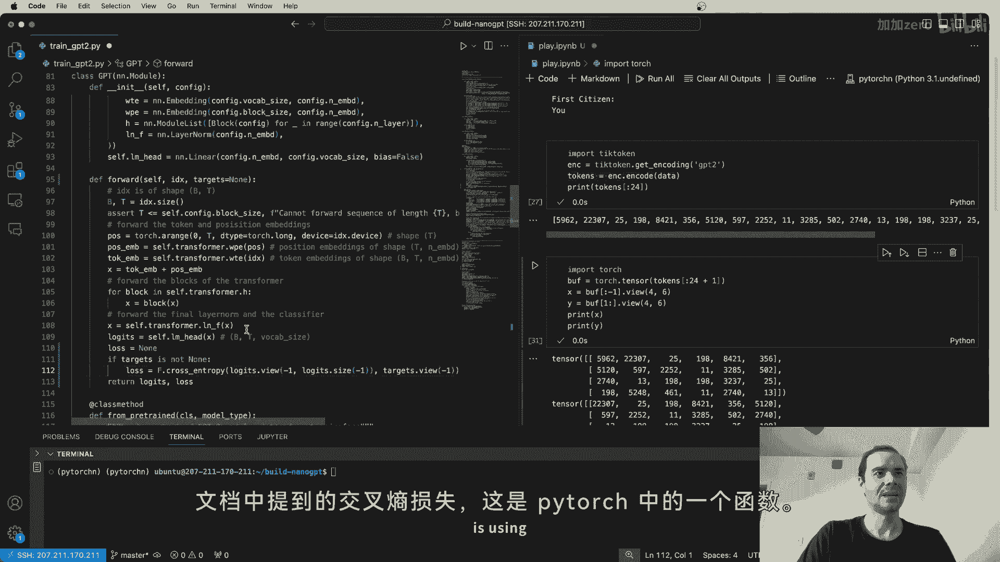

 So this is a function in PyTorch under the functional。

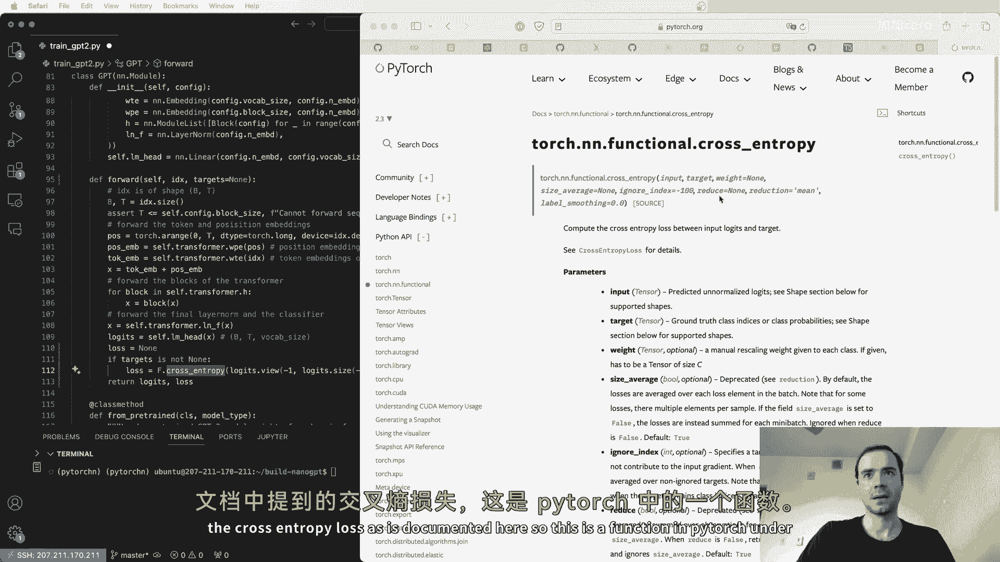

 Now what is actually happening here because it looks a little bit scary。 Basically the F。

 that cross entropy does not like multi dimensional inputs。 It can't take a B by T by vocab size。

 So what's happening here is that we are flattening out this three dimensional tensor into just two dimensions。

 The first dimension is going to be calculated automatically and it's going to be B times T。

 And then the last dimension is vocab size。 So basically this is flattening out this three dimensional tensor of logits to just be two dimensional B times T。

 All individual examples and vocab size in terms of the length of each row。

 And then it's also flattening out the targets which are also two dimensional at this stage。

 But we're going to just flatten them out so they're just a single tensor of B times T。

 And this can then pass into cross entropy to calculate a loss which we return。

 So this should basically at this point run because it's not too complicated。

 So let's run it and let's see if we should be printing the loss。

 And here we see that we printed 11 roughly。 And so。

 and notice that this is the tensor of a single element which is this number 11。

 Now we also want to be able to calculate a reasonable kind of starting point for a random linearized network。

 So we covered this in previous videos but our vocabulary size is 50，257。

 At initialization of the network you would hope that every vocab element is getting roughly a uniform probability。

 So that we're not favoring at initialization any token way too much。

 We're not confidently wrong at initialization。 So we're hoping that the probability of any arbitrary token is roughly one over 50。

257。 And now we can sanity check the loss。 Because remember that the cross entropy loss is just basically the negative log likelihood。

 So if we now take this probability and we take it through the natural logarithm and then we do the negative。

 that is the loss we expect at initialization and we covered this in previous videos。

 So I would expect something around 10。82 and we're seeing something around the level。

 So it's not way off。 This is roughly the probability I expect at initialization。

 So that tells me that the initialization or probability distribution is roughly diffuse。

 It's a good starting point and we can now perform the optimization and tell the network which elements should follow correctly in what order。

 So at this point we can do a loss。backward， calculate the gradients and do an optimization。

 So let's get to that。 Okay， so let's do the optimization now。 So here we have the loss。

 This is how we get the loss。 But now basically we want a load for loop here。 So for i in range。

 let's do 50 steps or something like that。 Let's create an optimizer object in PyTorch。

 And so here we are using the atom optimizer， which is an alternative to stochastic gradient descent optimizer S。

G。D。 that we're using。 S。G。T。 is a lot simpler。 Atom is a bit more involved。

 And actually specifically like the atom W variation because in my opinion it kind of just like fixes a bug。

 So atom W is a bug fix of atom is what I would say。 When we go to the documentation for atom W。

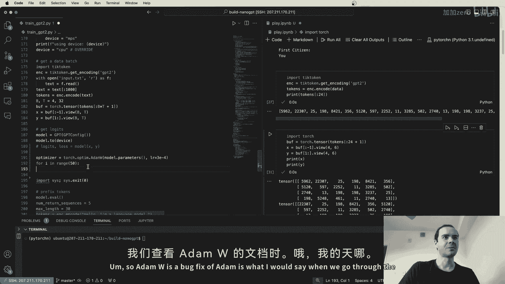

 Oh my gosh。 We see that it takes a bunch of parameters and it's a little bit more complicated than the S。

G。D。 we were looking at before。 Because in addition to basically updating the parameters with the gradient scaled by the learning rate。

 it keeps these buffers around and it keeps two buffers。 The M and the V。

 which it calls the first and the second moment。 So something that looks a bit like momentum is something that looks a bit like RMS prop if you're familiar with it。

 But you don't have to be。 It's just kind of like a normalization that happens on each gradient element individually。

 and speeds up the optimization， especially for language models。

 But I'm not going to go into the detail right here。

 We're going to treat it as a bit of a black box and it just optimizes the objective faster than S。G。

D。 which is what we've seen in the previous lectures。 So let's use it as a black box in our case。

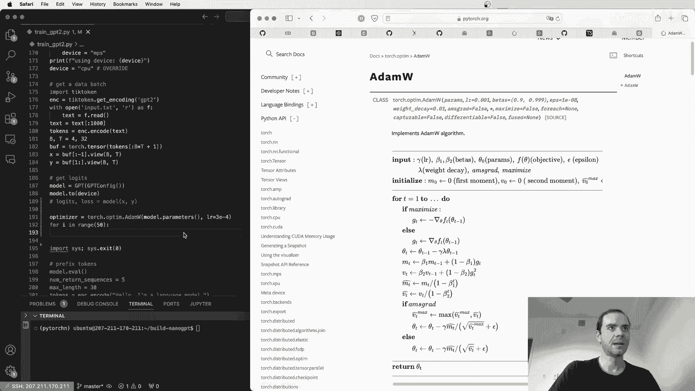

 Create the optimizer object and then go through the optimization。

 The first thing to always make sure the copilot did not forget to zero the gradients。

 So always remember that you have to start with a zero gradient。

 Then when you get your loss and you do a dot backward， dot backward adds to gradients。

 So it deposits gradients。 It always does a plus equals on whatever the gradients are。

 which is why you must set them to zero。 So this accumulates the gradient from this loss and then we call the step function on the optimizer to update the parameters and to decrease the loss。

 And then we print the step and the loss dot item is used here because loss is a tensor with a single element。

 Dot item will actually convert that to a single float and this float will not will live on the CPU。

 So this gets to some of the internals again of the devices but loss is a tensor with a single element and it lives on GPU for me because I'm using GPUs。

 When you call dot item， PyTorch behind the scenes will take that one dimensional tensor。

 ship it back to the CPU memory and convert it into a float that we can just print。

 So this is the optimization and this should probably just work。 Let's see what happens。 Actually。

 sorry， let me instead of using CPU override， let me delete that。

 So this is a bit faster for me and it runs on CUDA。 Oh。

 expected all tensors to be on the same device but found at least two devices， CUDA zero and CPU。

 So CUDA zero is the zero GPU because I actually have a GPU on this box。

 So the 0th GPU on my box and CPU。 And a model we have moved to device but when I was writing this code I actually introduced the bug because buff we never moved to device。

 And you have to be careful because you can't just do buff that to device。 It's not stateful。

 It doesn't convert it to be a device。 It instead returns pointer to a new memory which is on the device。

 So you see how we can just do model that to a device but it does not apply to tensors。

 You have to do buff equals。 Buff that to device and then this should work。

 So what do we expect to see？ We expect to see a reasonable loss in the beginning and then we continue to optimize just a single batch。

 And so we want to see that we can overfit this single batch。

 We can crush this little batch and we can perfectly predict it in the C's on just this little batch。

 And in these that is roughly what we're seeing here。 So we started off at roughly 10。82。

 11 in this case。 And then as we continue optimizing on this single batch without loading new examples。

 we are making sure that we can overfit a single batch。 And we are getting to very， very low loss。

 So the transformer is memorizing this single individual batch。

 And one more thing I didn't mention is the learning rate here is 3e negative four。

 which is a pretty good default for most optimizations that you went around at a very early debugging stage。

 So this is our simple inner loop and we are overfitting a single batch and this looks good。

 So now what comes next is we don't just want to overfit a single batch。

 We actually want to do an optimization。 So we actually need to iterate these xy batches and create a little data loader that makes sure that we're always getting a fresh batch and that we're actually optimizing a reasonable objective。

 So let's do that next。 Okay， so this is where I came up with and I wrote a little data loader light。

 So what this data loader does is we're importing the token up here。

 reading the entire text file from this single impa。txt tokenizing it。

 and then we're just printing the number of tokens in total。

 And the number of batches and a single epoch of iterating over this dataset。

 So how many unique batches do we output before we loop back around the beginning of the document and start reading it again。

 So we start off at position zero and then we simply walk the document in batches of b times t。

 So we take chunks of b times t and then always advance by b times t。

 And it's important to note that we're always advancing our position by exactly b times t。

 But when we're fetching the tokens， we're actually fetching from current position to b times t plus one。

 And we need that plus one because remember we need the target token for the last token in the current patch。

 And so that way we can do the x， y exactly as we did it before。 And if we are to run out of data。

 we'll just loop back around to zero。 So this is one way to write a very， very simple data loader。

 That simply just goes through the file in chunks。 And this could not for us for current purposes。

 And we're going to complexify it later。 And now we'd like to come back around here and we'd like to actually use our data loader。

 So the import tic to can has moved up。 And actually all of this is now useless。

 So instead we just want a train loader for the training data。

 And we want to use the same hyperparameters for four。 So batch size was four and time was 32。

 And then here we need to get the x， y for the current batch。

 So let's see if CoPALD gets it because this is simple enough。

 So we call the next batch and then we make sure that we have to move our tensors from CPU to the device。

 So here when I converted the tokens， notice that I didn't actually move these tokens to the GPU。

 I left them on the CPU， which is default。 And that's just because I'm trying not to waste too much memory on the GPU。

 In this case this is a tiny data set that it would fit。

 But it's fine to just ship it to GPU right now for our purposes right now。 So we get the next batch。

 we keep the data loader simple CPU class。 And then here we actually ship it to the GPU and do all the computation。

 And let's see if this runs。 So Python train dpt to dot pi。

 And what do we expect to see before this actually happens？

 What we expect to see is now we're actually getting the next batch。

 So we expect to not overfit a single batch。 And so I expect our loss to come down， but not too much。

 And that's because I still expected to come down because in the 50，257 tokens。

 many of those tokens never occur in our data set。 So there are some very easy gains to be made here in the optimization。

 By for example taking the biases of all the logits that never occur and driving them to negative infinity。

 And that would basically just it's just that all of these crazy unicodes or different languages。

 those tokens never occur。 So their probability should be very low。

 And so the gains that we should be seeing are along the lines of basically deleting the usage of tokens that never occur。

 That's probably most of the loss gain that we're going to see at this scale right now。

 But we shouldn't come to zero because we are only doing 50 iterations。

 And I don't think that's not to do an epoch right now。 So let's see what we've got。 We have 338。

000 tokens， which makes sense with our three to one compression ratio because there are one milling characters。

 So one epoch with the current setting of B and T will take 2，600 batches。

 And we're only doing 50 batches of optimization in here。

 So we start off in a familiar territory as expected and then we seem to come down to about 6。6。

 So basically I think seem to be working okay right now with respect to our expectations。

 So that's good。 Okay， next I want to actually fix a bug that we have in our code。

 It's not a major bug but it is a bug with respect to how GPT-2 training should happen。

 So the bug is the following。 We were not being careful enough when we were loading the weights from Hugging Face and we actually missed a little detail。

 So if we come here， notice that the shape of these two tensors is the same。

 So this one here is the token embedding at the bottom of the transformer。

 And this one here is the language modeling head at the top of the transformer。

 And both of these are basically two dimensional tensors and their shape is identical。

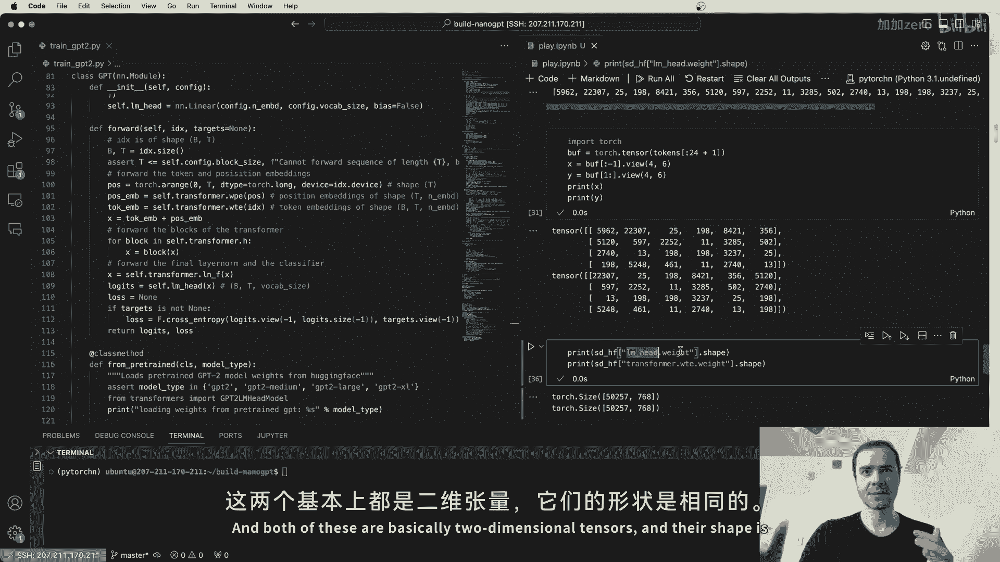

 So here， the first one is the output embedding， the token embedding。

 And the second one is this linear layer at the very top of the classifier layer。

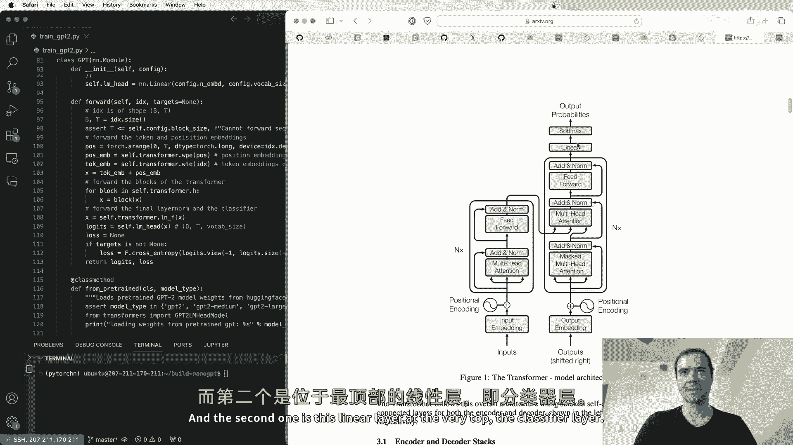

 Both of them are of shape 50，000 to 57 by 768。 This one here is giving us our token embeddings at the bottom。

 And this one here is taking the 768 channels of the transformer and trying to upscale that to 50。

257 to get the logis for the next token。 So they're both the same shape but more than that actually if you look at comparing their elements in PyTorch this is an element twice equality。

 So then we use 。all and we see that every single element is identical。 And more than that。

 we see that if we actually look at the data pointer。

 this is what this is a way in PyTorch to get the actual pointer to the data and the storage。

 We see that actually the pointer is identical。 So not only are these two separate tensors that happen to have the same shape and elements。

 they're actually pointing to the identical tensor。

 So what's happening here is that this is a common wait time scheme that actually comes from the original from the original attention is all in the paper and actually even the reference before it。

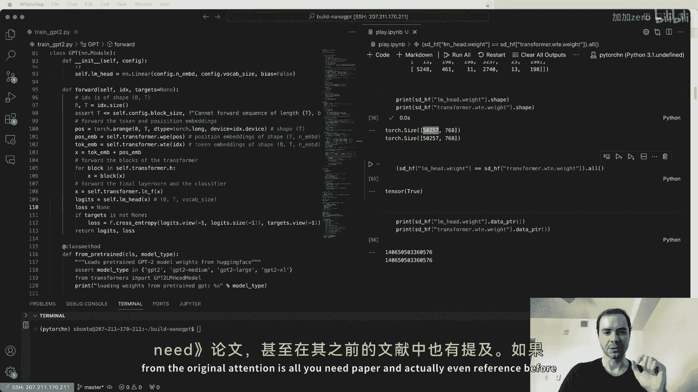

 So if we come here embeddings and softmax in the attention is all in the paper。

 they mention that in our model， we share the same wait matrix between the two embedding layers and the pre-payments。

 And the pre-softmax linear transformation similar to 30。

 So this is an awkward way to phrase that these two are shared and they're tied in their same matrix。

 And the 30 reference is this paper。 So this came out in 2017。

 And you can read the full paper but basically it argues for this wait time scheme。

 And I think intuitively the idea for why you might want to do this comes from this paragraph here。

 And basically you can observe that you actually want these two matrices to behave similar in the following sets。

 If two tokens are very similar semantically， like maybe one of them is all lowercase and the other one is all uppercase or it's the same token in the different language or something like that。

 If you have similarity between two tokens， presumably you would expect that they are nearby in the token embedding space。

 But in the exact same way， you'd expect that if you have two tokens that are similar semantically。

 you'd expect them to get the same probabilities at the output of a transformer because they are semantically similar。

 And so both positions in the transformer at the very bottom and at the top have this property that similar tokens should have similar embeddings or similar weights。

 And so this is what motivates their exploration here and they kind of， you know。

 I don't want to go through the entire paper and you can go through it。

 But this is what they observe。 They also observed that if you look at the output embeddings。

 they also behave like word embeddings。 If you just kind of try to use those weights as word embeddings。

 So they kind of observe this similarity。 They try to tie them and they observe that they can get much better performance in that way。

 And so this was adopted and the attention is on the paper。

 And then it was used again in GPT-2 as well。 So I couldn't find it in the transformers implementation。

 I'm not sure where they tie those embeddings， but I can't find it in the original GPT-2 code introduced by OpenAI。

 So this is OpenAI GPT-2 source model。 And here where they are forwarding this model。

 and this is a tensor flow， but that's okay。 We see that they get the WTE token embeddings。

 And then here is the encoder of the token embeddings and the position。 And then here at the bottom。

 they use the WTE again to do the logits。 So when they get the logits。

 it's a mat model of this output from the transformer and the WTE tensor is reused。

 And so the WTE tensor basically is used twice on the bottom of the transformer and on the top of the transformer。

 And in the backward pass， we'll get gradients contributions from both branches， right？

 And these gradients will add up on the WTE tensor。

 So we'll get a contribution from the classifier layer。 And then at the very end of the transformer。

 we'll get a contribution at the bottom of it flowing again into the WTE tensor。

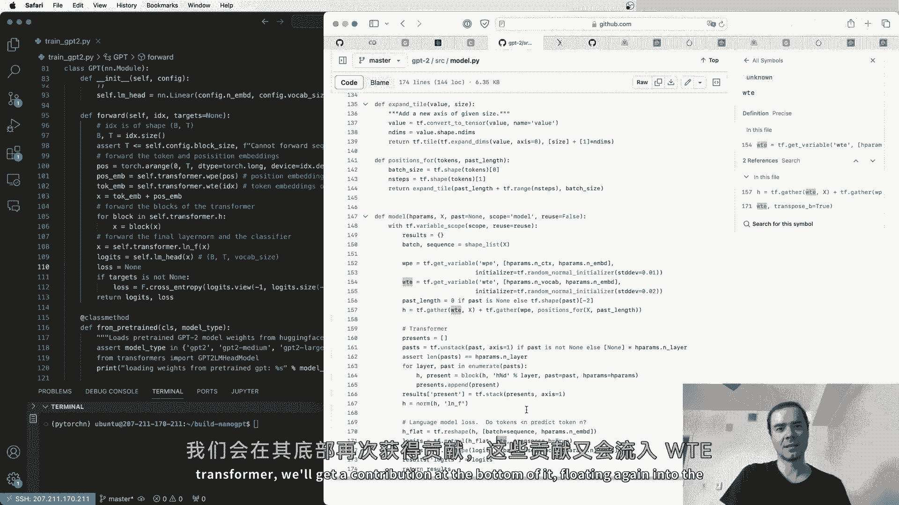

 So we are currently not sharing WTE in our code， but we want to do that。 So wait， sharing， scheme。

 And one way to do this， let's see if Quapal gets it。 Oh， it does。 Okay。 So this is one way to do it。

 Basically， relatively straightforward。 What we're doing here is we're taking the WTE。wait。

 And we're simply redirecting it to point to the element。 So this basically copies the data pointer。

 right？ It copies the reference。 And now the WTE。wait becomes orphaned， the old value of it。

 And pytorch will clean it up。 And so we are only locked with a single tensor。

 And it's going to be used twice in the forward pass。 And this is， to my knowledge。

 all that's required。 So we should be able to use this。 And this should probably train。

 We're just going to basically be using this exact same sensor twice。

 And we weren't being careful with tracking the likelihoods。

 But according to the paper and according to the results。

 you'd actually expect slightly better results doing this。 And in addition to that。

 one other reason that this is very， very nice for us is that this is a ton of parameters， right？

 What is the size of here？ It's 768 times 50，257。 So this is 40 million parameters。

 And this is a 124 million parameter model。 So 40 divided 124。

 So this is like 30% of the parameters are being saved using this wait time scheme。

 And so this might be one of the reasons that this is working slightly better。

 If you're not training the model long enough， because of the wait time。

 you don't have to train as many parameters。 And so you become more efficient in terms of the training process。

 Because you have fewer parameters and you're putting in this inductive bias that these two embeddings share similarities between tokens。

 So this is the wait time scheme。 And we've saved a ton of parameters。

 And we expect our model to work slightly better because of this scheme。 Okay， next。

 I would like us to be a bit more careful with the initialization and to try to follow the wait GPT-2 initialized their model。

 Now， unfortunately， the GPT-2 paper and the GPT-3 paper are not very explicit about initialization。

 So we kind of have to read between the lines。

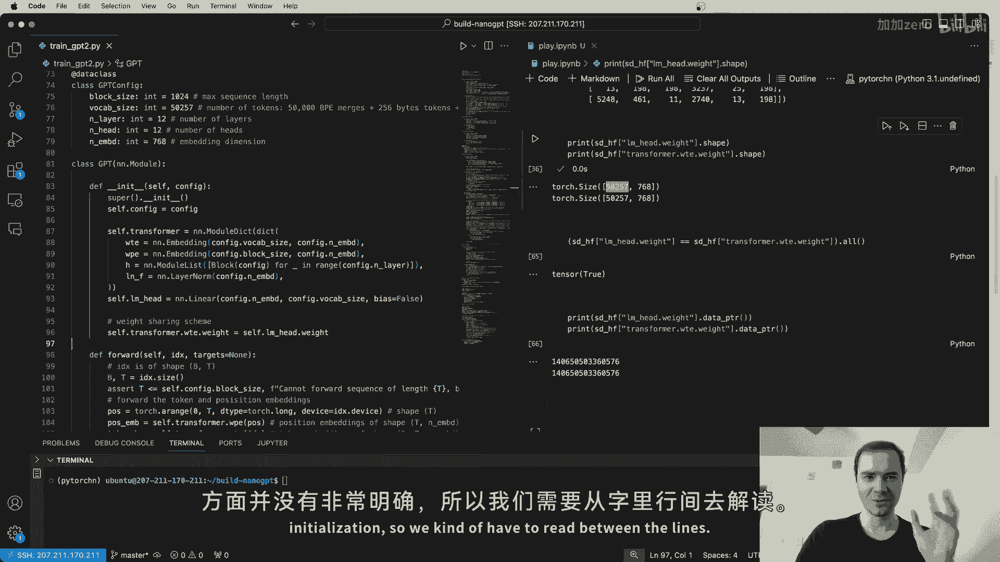

 And instead of going to the paper， which is quite vague。

 there's a bit of information in the code that open the app released。 So when we go to the model。py。

 we see that when they initialize their weights， they are using the standard deviation of 0。02。

 And that's how they， so this is a normal distribution for the weights and the standard deviation is 0。

02。 For the bias， they initialize that with zero。 And then when we scroll down here。

 why is this not scrolling？ The token embeddings are initialized at 0。

02 and position embeddings at 0。01 for some reason。

 So those are the initialization and we'd like to mirror that in GPT-2 in our module here。

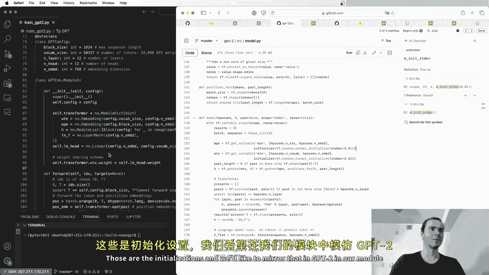

 So here's a snippet of code that I sort of came up with very quickly。

 So what's happening here is at the end of our initializer for the GPT module。

 we're calling the apply function of an end module。

 and that iterates all the sub-modules of this module and applies in it weights function on them。

 And so what's happening here is that we're iterating all the modules here。

 And if they are an end that linear module， then we're going to make sure to initialize the weight using a normal with the standard deviation of 0。

02。 So as a bias in this layer， we make sure to initialize that to zero。

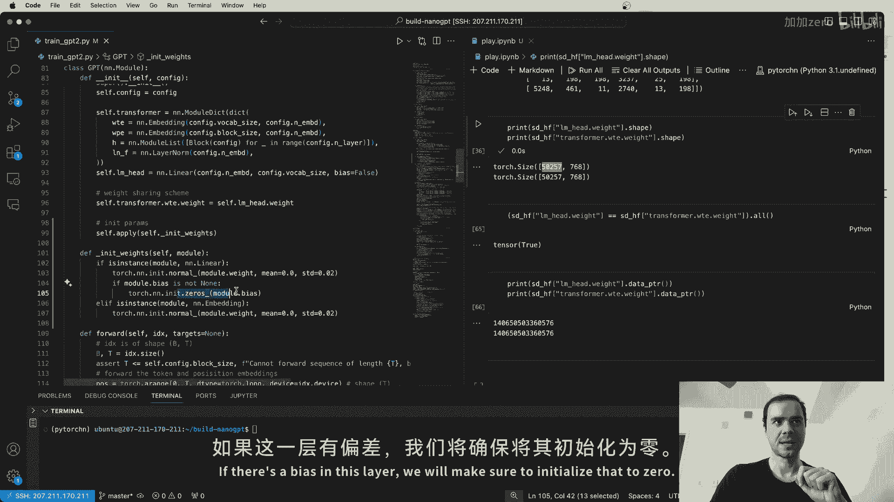

 Note that the zero initialization for the bias is not actually the pie-torch default。 By default。

 the bias here is initialized with a uniform。 So that's interesting。 So we make sure to use zero。

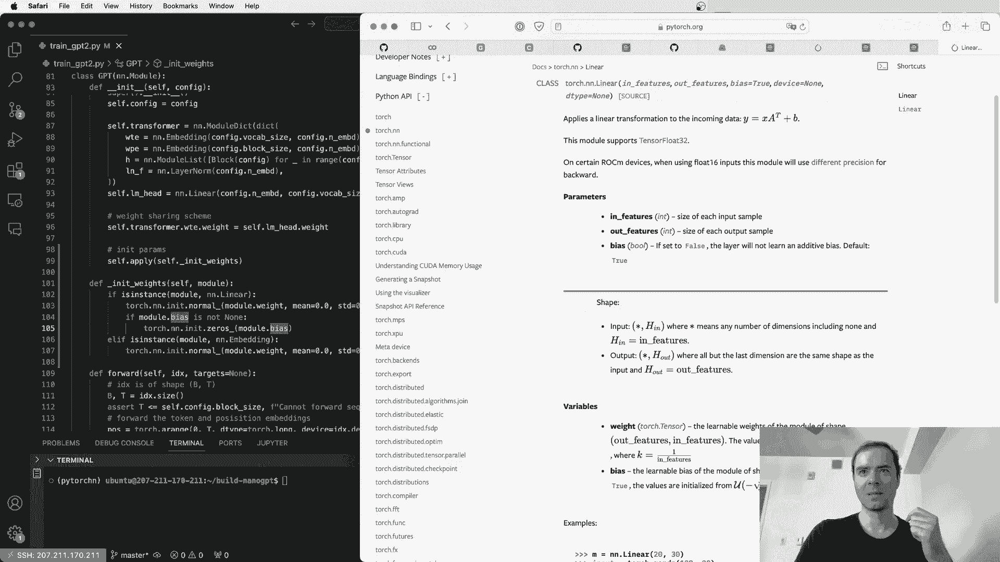

 And for the embedding， we're just going to use 0。02 and keep it the same。

 So we're not going to change it to 0。01 for positional because it's about the same。

 And then if you look through our model， the only other layer that requires initialization and that has parameters is the layer norm。

 And the pie-torch default initialization sets the scale in the layer norm to be 1 and the offset in the layer norm to be 0。

 So that's exactly what we want。 And so we're just going to keep it that way。

 And so this is the default initialization if we are following the。

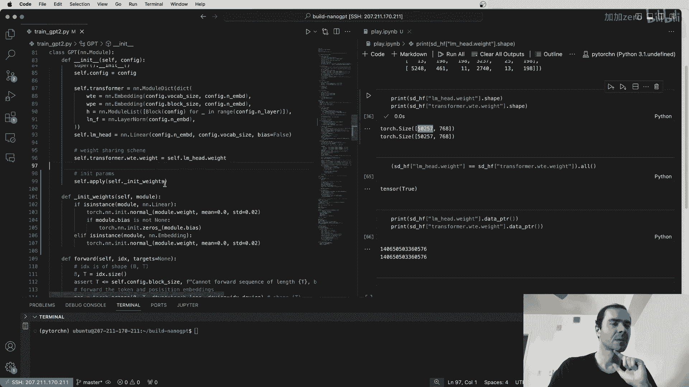

 Where is it？ The GPT-2 source code that they released。

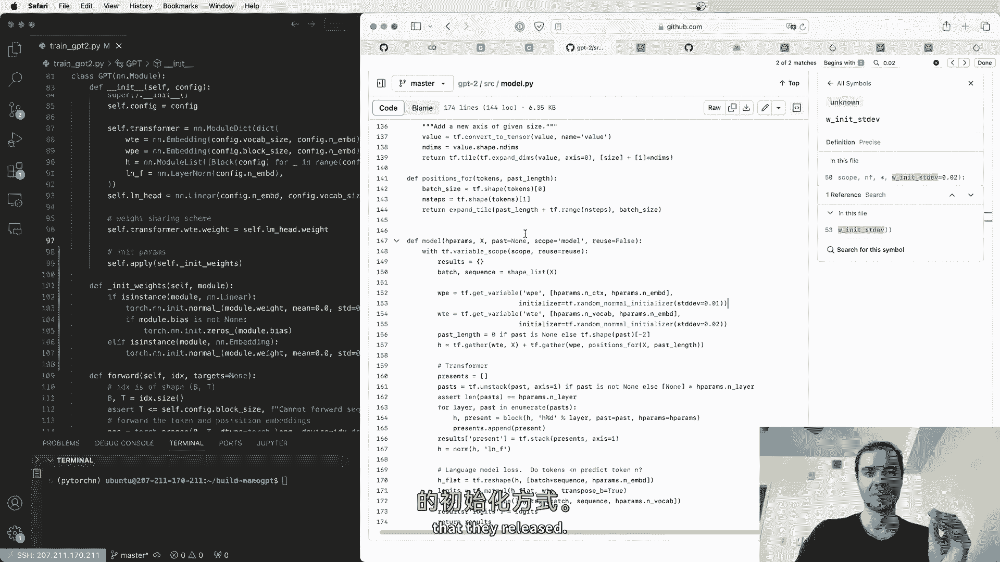

 I would like to point out by the way that typically the standard deviation here on this initialization。

 if you followed the heavier initialization， would be 1 over the square root of the number of features that are incoming into this layer。

 But if you'll notice， actually， 0。02 is basically consistent with that because the D model sizes inside these transformers from GPT-2 are roughly 768。

 1， 600， etc。

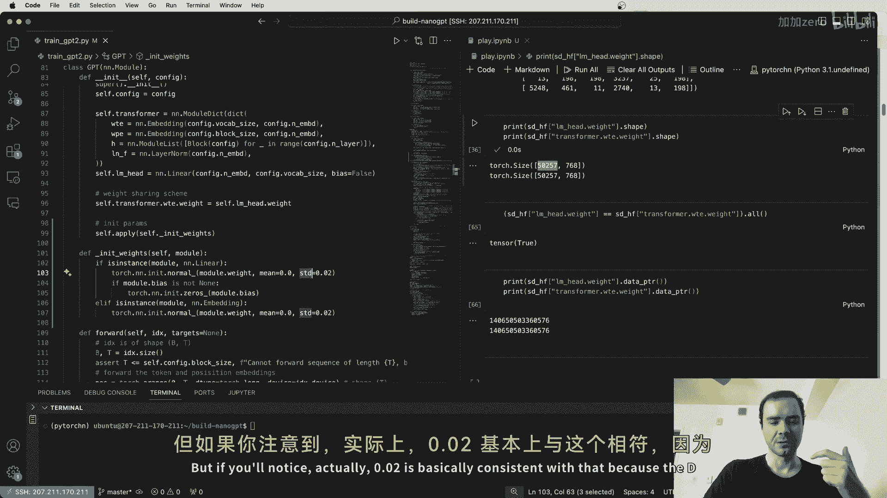

 So 1 over the square root of， for example， 768 gives us 0。03。 If we plug in 1，600， 1，600， we get 0。

02。 If we plug in 3 times that 0。014， etc。 So basically 0。

02 is roughly in the vicinity of reasonable values for these initializations anyway。

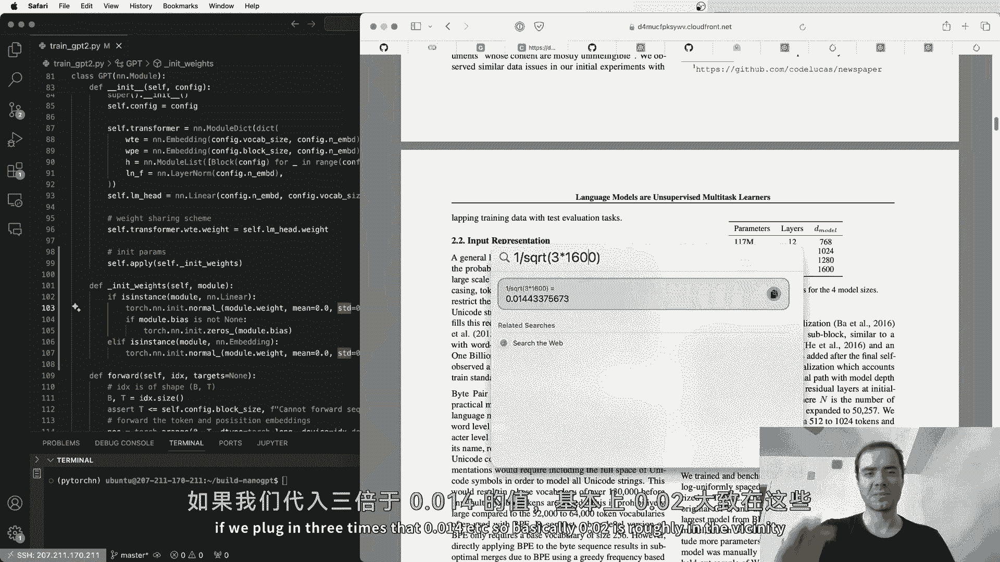

 So it's not completely crazy to be hard-coding 0。02 here。

 but you'd like typically something that grows with the model size instead。

 but we will keep this because that is the GPT-2 initialization per their source code。

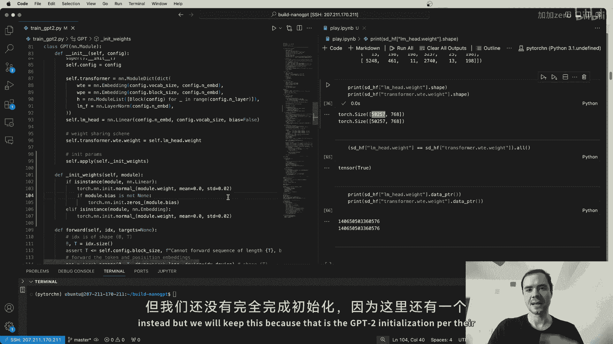

 But we are not fully done yet on initialization because there's one more caveat here。 So here。

 a modified initialization which accounts for the accumulation on the residual path with model depth is used。

 We scaled the weight of residual layers initialization by factored 1 over squared event。

 where n is the number of residual layers。

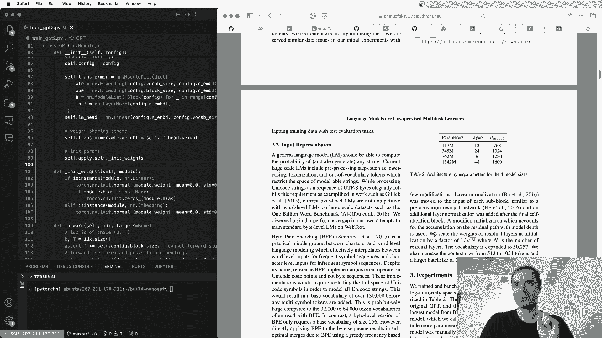

 So this is what GPT-2 paper says。 So we have not implemented that yet， and we can do so now。 Now。

 I'd like to actually kind of motivate a little bit what they mean here， I think。

 So here's roughly what they mean。 If you start out with 0s in your residual stream。

 remember that each residual stream is of this form where we continue adding to it。

 X is x plus something， some kind of contribution。 So every single block of the residual network contributes some amount and it gets added。

 And so what ends up happening is that the variance of the activations in the residual stream grows。

 So here's a small example。 If we start at 0 and then we for 100 times。

 we have sort of this residual stream of 768 zeros。 And then 100 times we add random。

 which is a normal distribution， 0 mean 1 standard deviation。 If we add to it。

 then by the end the residual stream has grown to have standard deviation of 10。

 And that's just because we're always adding these numbers。

 And so this scaling factor that they use here exactly compensates for that growth。

 So if we take n and we basically scale down everyone of these contributions into the residual stream by 1 over the square root of n。

 So 1 over the square root of n is n to the negative 0。5， right？ Because n to the 0。

5 is the square root and then 1 over the square root is n negative 0。5。 If we scale it in this way。

 then we see that we actually get 1。 So this is a way to control the growth of activations inside the residual stream in the forward pass。

 And so we'd like to initialize in the same way where these weights that are at the end of each block。

 so this C-proj layer， the GPT paper proposes to scale down those weights by 1 over the square root of the number of residual layers。

 So one crude way to implement this is the following。 I don't know if this is a PyTorch sanctioned。

 but it works for me。 It is we all do in the initialization。 See that's not special。

 NanogPT scale in it is 1。 So we're setting kind of like a flag for this module。

 There must be a better way in PyTorch， right？ But I don't know。 Okay。

 so we're basically attaching this flag and trying to make sure that it doesn't conflict with anything previously。

 And then when we come down here， this STD should be 0。02 by default。

 But then if it has a true module of this thing， then STD times equals。 。 what？ 。

 Copal does not get it correctly。 So we want 1 over the square root of the number of layers。

 So the number of residual layers here is twice times the saltout conflict layers。

 And then this times negative 0。5。 So we want to scale down that standard deviation。

 And this should be correct and implement that。 I should clarify by the way that the two times number of layers comes from the fact that every single one of our layers in the transformer。

 actually has two blocks that add to the residual pathway， right？

 We have the attention and then the MLP。 So that's where the two times comes from。

 And the other thing to mention is that what's slightly awkward but we're not going to fix it is that。

 because we are weight-sharing the WTE and the LMA。 In this iteration of our old sub-modules。

 we're going to actually come around to that tensor twice。

 So we're going to first initialize it as an embedding with 0。02。

 And then we're going to come back around it again in the linear and initialize it again using 0。02。

 And it's going to be 0。02 because the LMA is of course not scaled。 So it's not going to come here。

 It's just it's going to be basically initialized twice using the identical same initialization。

 But that's okay。 And then scrolling over here， I added some code here so that we have reproducibility to set the seeds。

 And now we should be able to Python train GPT2。py and let this running。 And as far as I know。

 this is the GPT2 initialization in the way we've implemented right now。

 So this looks reasonable to me。 Okay， so at this point we have the GPT2 model。

 We have some confidence that it's correctly implemented。

 We've initialized it properly and we have a data loader that's iterating through data batches and we can train。

 So now comes the fun part。 I'd like us to speed up the training by a lot。

 So we're getting our money's worth with respect to the hardware that we are using here。

 And we're going to speed up the training by quite a bit。

 Now you always want to start with what hardware do you have？ What does it offer？

 And are you fully utilizing it？ So in my case， if we go to NVIDIA SMI。

 we can see that I have eight GPUs。 And each one of those GPUs is an 8100 SXM 80 gigabytes。

 So this is the GPU that I have available to me in this box。

 Now when I use to spin up these kinds of boxes， by the way。

 my favorite place to go to is Lambda Labs。

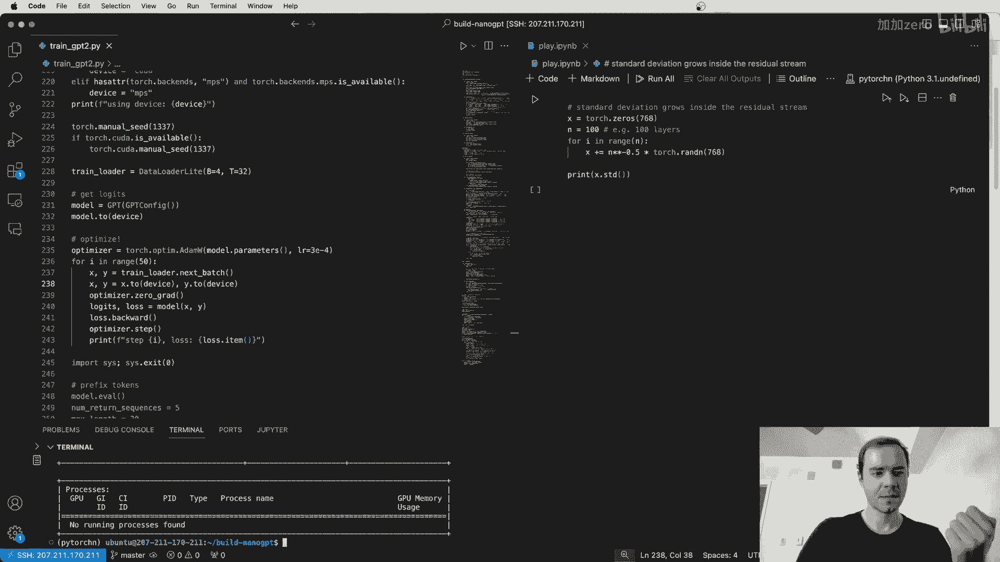

 They do sponsor my development and that of my projects。 But this is my favorite place to go。

 And this is where you can spin up one of these machines and you pay per hour。 And it's very。

 very simple。 So I like to spin them up and then connect the S code to it。 And that's how I develop。

 Now when we look at the 8100s that are available here。

 8100 80 gigabyte SXM is the GPU that I have here。 And we have a bunch of numbers here for how many calculations you can expect out of this GPU。

 So when I come over here and I break in right after here， so Python， True， and Jupy。

 So I'm breaking in right after we calculate the logits and the loss。

 And the interesting thing I'd like you to note is when I do logits。detive， this prints a torch。

float32。 So by default in PyTorch， when you create tensors。

 And this is the case for all the activations and for the parameters of the network and so on。

 By default， everything is in float32。 That means that every single number。

 activation or weight and so on， is using a float representation that has 32 bits。

 And that's actually quite a bit of memory。 And it turns out empirically that for deep learning as a computational workload。

 this is way too much。 And deep learning and the training of these networks can tolerate significantly lower precision。

 Not all computational workloads can't tolerate small precision。 So for example。

 if we go back to the data sheet。

 you'll see that actually these GPUs support up to FP64。 And this is quite useful。

 I understand for a lot of scientific computing applications。 And there they really need this。

 But we don't need that much precision for deep learning training。 So currently we are here， FP32。

 And with this code as it is right now， we expect to get at most 19。5 teraflabs of performance。

 That means we're doing 19。5 trillion operations， floating point operations。

 So this is floating point multiply at most likely。 And so these are the floating point operations。

 Now， notice that if we are willing to go down in precision。 So TF32 is a lower precision format。

 We're going to see in a second。 You can actually get an 8x improvement here。

 And if you're willing to go down to float 16 or B float 16。

 you can actually get times 16x performance all the way to 312 teraflabs。

 You see here that NVIDIA likes to cite numbers that have an asterisk here。

 This asterisk says with sparsity。 But we are not going to be using sparsity in our code。

 And I don't know that this is very widely used in the industry right now。

 So most people look at this number here without sparsity。

 And you'll notice that we could have got even more here。 But this is int 8。

 And int 8 is used for inference， not for training。 Because int 8 has a。

 It basically has uniform spacing。 And we actually require a float so that we get a better match to the normal distributions。

 that occur during training of neural networks， where both activations and weights are distributed。

 as a normal distribution。 And so floating points are really important to match that representation。

 So we're not typically using int 8 for training， but we are using it for inference。

 And if we bring down the precision， we can get a lot more teraflabs out of the tensor。

 course available in the GPUs。 We'll talk about that in a second。 But in addition to that。

 if all of these numbers have fewer bits of representation。

 it's going to be much easier to move them around。 And that's where we start to get into the memory bandwidth and the memory of the model。

 So not only do we have a finite capacity of the number of bits that our GPU can store。

 but in addition to that， there's a speed with which you can access this memory。

 And you have a certain memory bandwidth。 It's a very precious resource。 And in fact。

 many of the deep learning workloads for training are memory bound。

 And what that means is actually that the tensor course that do all these extremely fast。

 multiplications， most of the time they're waiting around， they're idle。

 Because we can't feed them with data fast enough。 We can't load the data fast enough for memory。

 So typical utilizations of your hardware， if you're getting 60% utilization。

 you're actually doing extremely well。 So half of the time in a well-tuned application。

 your tensor course are not doing multiplies， because the data is not available。

 So the memory bandwidth here is extremely important as well。

 And if we come down in the precision for all the floats， all the numbers， weights and activations。

 suddenly require less memory。 So we can store more and we can access it faster。

 So everything speeds up and it's amazing。 And now let's reap the benefits of it。

 And let's first look at the tensor float 32 format。 Okay， so first of all， what are tensor cores？

 Well， tensor core is just an instruction in the A100 architecture， right？

 So what it does is it does basically a little 4x4 matrix multiply。

 So this is just matrix multiplication here of 4x4 matrices。

 And there are multiple configurations as to what precision any of these matrices are。

 So in what precision the internal accumulate happens and then what is the output precision。

 and the precision etc。 So there's a few switches but it's basically a 4x4 multiply。

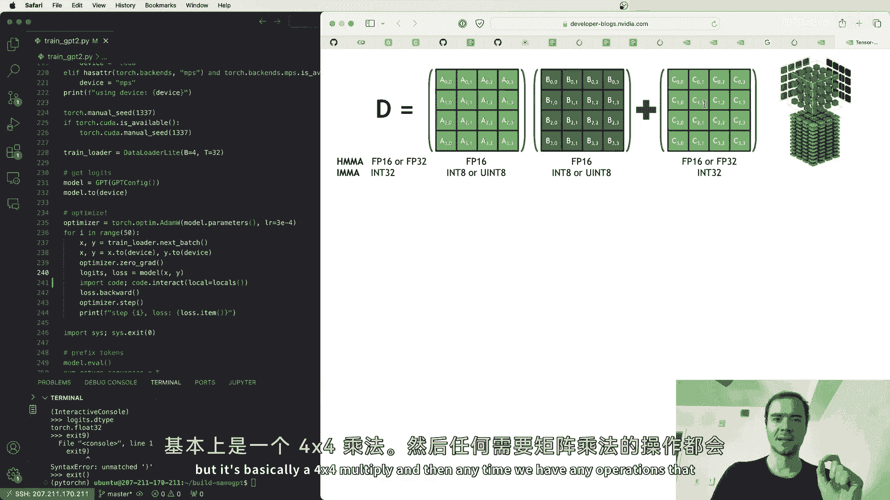

 And then any time we have any operations that require matrix multiplication。

 they get broken up into this instruction of 4x4 multiply。

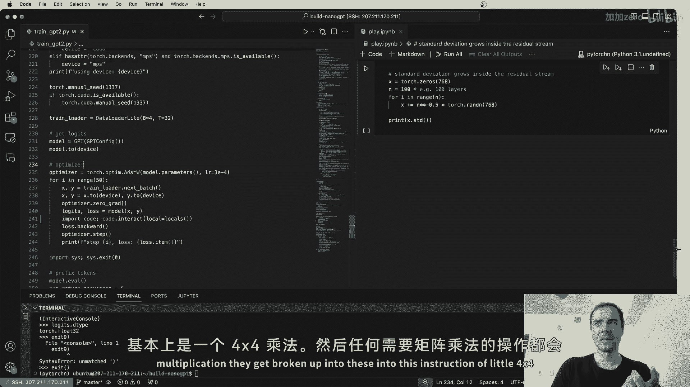

 And so everything gets broken up into this instruction because it's the fastest way to multiply matrices。

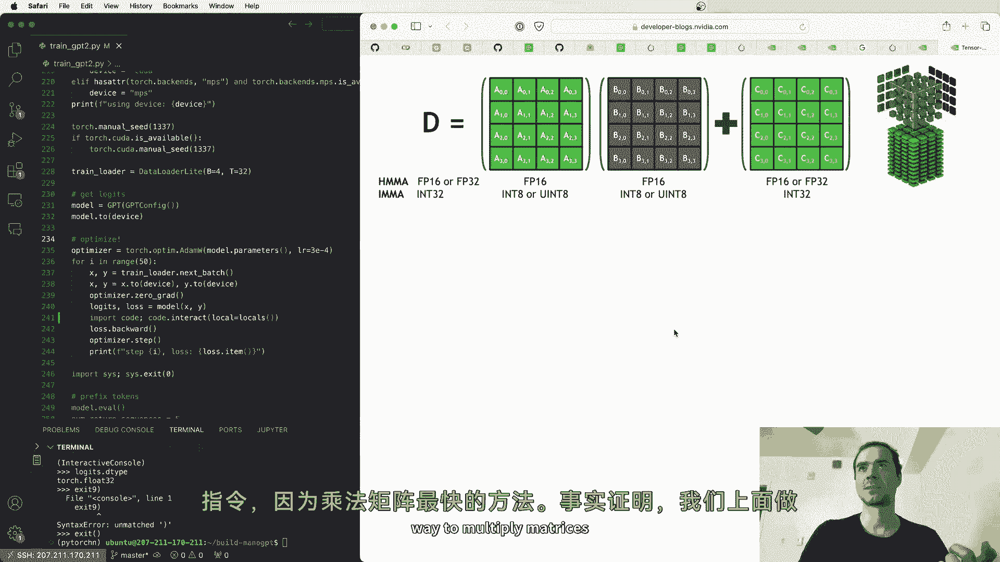

 And it turns out that most of the computational work that we're doing up above。

 all of it really is matrix multiplication。 Most of the work competitionally happens in the linear layers。

 Linear， linear， etc。 There's a few things sandwiched in between。

 There's some additions in residuals， there's some galude nonlinearities， there's some layer norms。

 etc。 But if you just time them， you'll see that these are nothing。

 Like basically the intrad transformer is just a bunch of matrix multiplications really。

 And especially at this small scale， 124 million perimeter model。

 actually the biggest matrix multiplication by far is the classifier layer at the top。

 That is a massive matrix multiply of going from 768 to 50，257。

 And that matrix multiply dominates anything else that happens in that network roughly speaking。

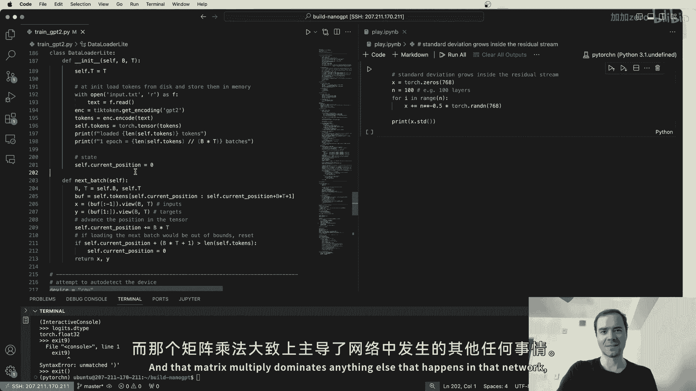

 So it's matrix multiplies that become a lot faster， which are hidden inside our linear layers。

 And they're accelerated through tensor cores。 Now the best reference I would say for tensor cores is basically just go to the。

 8100 architecture white paper。 And then it's pretty detailed， but I think people。

 it's like relatively readable mostly if you have to understand what's happening。

 So figure nine tensor float 32。 So this is the explanation basically for TF32 and what happens here。

 And you see that there's many configuration options here available。

 So the input operands and what precision are they in？

 The accumulator and what basically the internal representation within the instruction when you do the accumulate of this matrix multiplication。

 So the intermediate plus equals of the intermediate little vector multiplies here。

 That all happens in FV32。 And then this is an 8x improvement as I mentioned to the ops that we get。

 So TF32 specifically we're looking at this row here。

 And the way this works is normally FV32 has 32 bits。 TF32 is the exact same bits。

 We have one signed bit， we have 8 exponent bits。 Except the mantissa bits get cropped in the float。

 And so basically we end up with just 19 bits instead of 32 bits。

 Because the last 13 bits get truncated， they get dropped。

 And all this is internal to the instruction。 So none of it is visible to anything in our PyTorch。

 None of our PyTorch code will change。 All of the numbers will look identical。

 It's just that when you call the tensor core instruction internally in the hardware。

 it will crop out these 13 bits。 And that allows it to calculate this little matrix multiply significantly faster。

 8x faster。 Now of course this speed up comes at a cost。

 And the cost is that we are reducing the precision。 Our accumulator still in FV32。

 Our output is FV32。 Our inputs are FV32。 But internally things get truncated in the operands to perform the operation faster。

 And so our results are starting to be a bit more approximate。

 But empirically when you actually train with this， you basically can't tell the difference。

 So the reason I like TF32 is because if you can tolerate a little bit of a precision fudge。

 then this is pre。 None of your code sees this。 It's fully internal to the operation。

 And the operation to you just go 8x faster and it's a bit more approximate。

 And so it's a pretty sweet spot I would say in optimization。

 And let's see what that looks like first。

 So I've set up our codes to just time the iterations。 So import time。

 I changed the hyperparameters so that we have something a bit more that reflects kind of workload that we want to run。

 Because we want to do a fairly large run at the end of this。 So let's use batch size 16。

 And let's now use the actual GPT-2 maximum sequence length of 1024 tokens。

 So this is the configuration。 And then for 50 iterations， I'm just doing something very lazy here。

 I'm doing time that time to get the current time。 And then this is the optimization loop。

 And now I want to time how long this takes。 Now one issue with working with GPUs is that as your CPU runs。

 it's just scheduling work on GPU。 It's ordering some work。

 And so it sends a request and then it continues running。

 And so it can happen sometimes that we sort of speed through this。

 And we queue up a lot of kernels to run on the GPU。

 And then the CPU sort of like gets here and takes time at that time。

 But actually the GPU is still running because it takes a time to actually work through the work that was scheduled to run。

 And so you're just building up a queue for the GPU。 And so actually if you need to。

 you want to wait to start to go to the synchronize and this will wait for the GPU to finish all the work that was scheduled to run up above here。

 And then we can actually take the time。 So basically we're waiting for the GPU to stop this iteration。

 take the time and then we're going to just print it。 So here I'm going to run the training loop。

 And here on the right， I'm watching NVIDIA SMI。 So we start off at zero。 We're not using the GPU。

 And then my default PyTorch will use GPU zero。 So we see that it gets filled up。

 And we're using 35 gigabytes out of 80 gigabytes available。

 And then here on the left we see that because we cranked up the batch size。

 Now it's only 20 batches to do a single epoch on our tiny Shakespeare。

 And we see that we're seeing roughly 1000 milliseconds per iteration here。 Right？

 So the first iteration sometimes is slower。 And that's because PyTorch might be doing a lot of initialization here on the very first iteration。

 And so it's probably initializing all these tensors and buffers to hold all the gradients。

 And I'm not sure all the work that happens here。 But this could be a slower iteration。

 When you're timing your logic， you always want to be careful with that。

 But basically we're seeing 1000 milliseconds per iteration。

 And so this will run for roughly 50 seconds as we have it right now。

 So that's our baseline in float 32。 One more thing I wanted to mention is that if this doesn't fit into your GPU and you're getting out of memory errors。

 then start decreasing your batch size until things fit。 So instead of 16。

 try 8 or 4 or whatever you need to fit the batch into your GPU。 And if you have a bigger GPU。

 you can actually potentially get away with 32 and so on。 By default。

 you want to basically max out the batch size that fits on your GPU。

 And you want to keep it by numbers。 So use numbers that have lots of powers of two in them。

 So 16 is a good number， 8， 24， 32， 48。 These are nice numbers。

 But don't use something like 17 because that will run very inefficiently on the GPU。

 And we're going to see that a bit later as well。 So for now， let's just stick with 16， 1024。

 And the one thing that I added also here and I ran it again is I'm calculating tokens per second through it during training。

 Because we might end up changing the batch size around over time。

 But tokens per second is the objective measure that we actually really care about。

 How many tokens of data are we training on？ And what is the throughput of tokens that we're getting in our optimization？

 So right now we're processing and training on 163，000 tokens per second roughly。

 And that's a bit more objective metric。 Okay， so let's now enable TF32。

 Now luckily PyTorch makes this fairly easy for us。 And to enable TF32。

 you just need to do a single line。

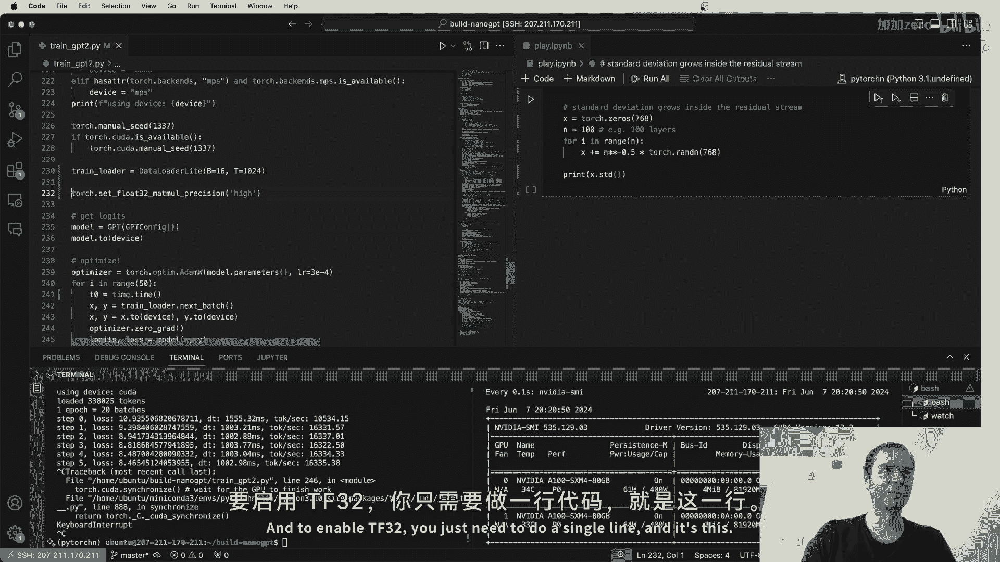

 And it's this。 And when we go to the PyTorch documentation here for this function。

 basically this tells PyTorch what kind of kernels to run。 And by default， I believe it is highest。

 Highest precision for Matmull。 And that means that everything happens in Flow32。

 just like it did before。 But if we set it too high as we do right now。

 matrix multiplications will now use TensorFlow32 when it's available。

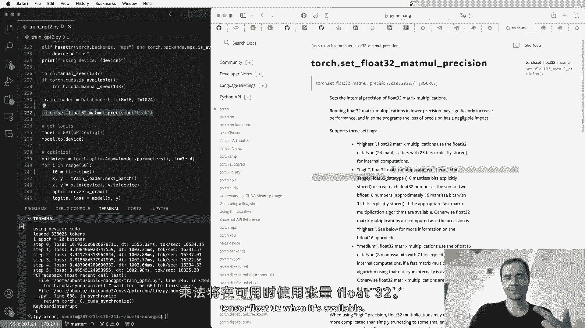

 My GPU is the A100， so it's an ampere series and therefore TF32 is available。

 If you're an older GPU， this might not be available for you。 But for my GPU it's available。

 And so what I expect PyTorch to do is that every single place where we see an end-out linear。

 inside there is a matrix multiplication。 And I expect that matrix multiplication now to be running on TensorCore。

 utilizing the TF32 precision。 So this is the single line of change that is， I believe， necessary。

 And let's rerun this。 Now we saw that in terms of the throughput that has promised to us。

 we're supposed to be getting 8x roughly。 So let's see what happens。 And that 8x came from here。

 right？

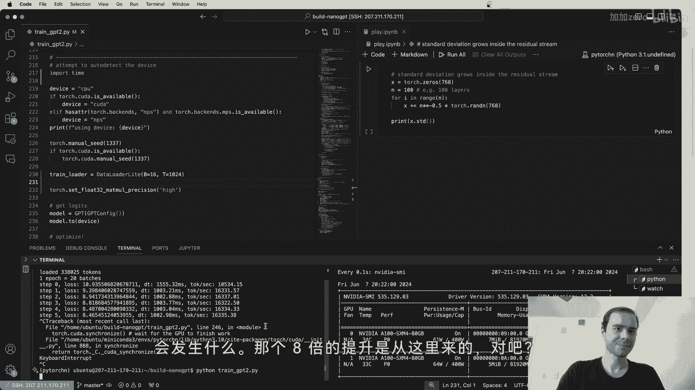

 8x。

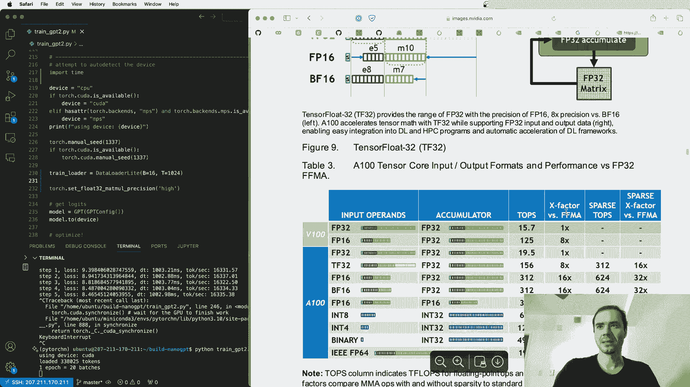

 And it also came from looking at it here。 156 T-flops instead of 19。5。 Okay。

 so what actually happened？ So we're seeing that our throughput roughly 3x， not 8x。 So we are going。

 we're from 1000 milliseconds， we're going down to 300 milliseconds。

 and our throughput is now about 50，000 tokens per second。 So we have a roughly 3x instead of 8x。

 So what happened？ And basically what's happening here is， again。

 a lot of these workloads are memory bound。 And so even though the TF32 offers in principle a lot faster throughput。

 all of these numbers everywhere are still float 32s。

 And it's float 32 numbers that are being shipped all over the place through the memory system。

 And it's just costing us way too much time to shuttle around all those data。

 And so even though we've made the multiply itself much faster， we are memory bound。

 and we're not actually seeing the full benefit that would come from this napkin map here。 That said。

 we are getting a 3x faster throughput。 And this is free。 Single line of code in PyTorch。

 All your variables are still float 32 everywhere。 It just runs faster。

 It's slightly more approximate， but we're not going to notice it basically。

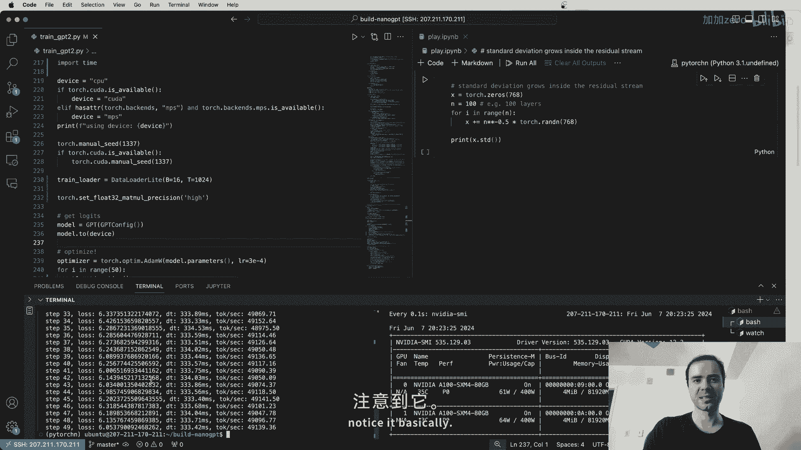

 So that's TF32。 Okay， so let's now continue。 So we've exercised this row。

 and we saw that we can crop out some of the precision inside the operation itself。

 But we saw that we're still memory bound。 We're still moving around all these floats， right。

 otherwise。 And we're paying that cost because of this。

 So let's now decrease the amount of stuff that we're going to be moving around。

 And we're going to do that by dropping down to Bflow 16。

 So we're only going to be maintaining 16 bits per float。 And we're going to use the Bflow 16。

 and I'll explain in a bit at B16 difference， and we're going to be in this row。

 So when we go back to the documentation here for the A100。

 we see here the precision that are available。 And this is the original F3。2。

 The TF32 crops out the precision。 And then here in Bf16， you see that it is very similar to TF32。

 but it's even more aggressive in cropping off the precision， the mantissa of this float。

 So the important thing with Bflow 16 is that the exponent bits， and the sign bit， of course。

 remain unchanged。 So if you're familiar with your float numbers。

 and I think this should probably be an entire video by itself。

 the exponent sets the range that you can represent of your numbers。

 And the precision is how much precision you have for your numbers。

 And so the range of numbers is identical， but we have fewer possibilities within that range。

 because we are truncating the mantissa， so we have less precision in that range。

 What that means is that things are actually fairly nice because we have the original range of numbers that are representable in float。

 But we just have less precision for it。 And the difference with Fb16 is that they actually touch and change the range。

 So Fb16 cannot represent the full range of Fb32。 It has a reduced range。

 And that's where you start to actually run into issues because now you need these gradients。

 scalars and things like that。 And I'm not going to go into the detail of that in this video because that's a whole video by itself。

 But Fb16 actually historically came first。 That was available in the Volta series before Ampere。

 And so Fb16 came first and everyone started to train Fb16。

 But everyone had to use all these gradient scaling operations which are kind of annoying。

 and it's an additional source of state and complexity。

 And the reason for that was because the exponent range was reduced in Fb16。

 So that's the IEEE Fb16 spec。 And then they came out with Bf16 and the Ampere。

 And they made it much simpler because we're just truncating Mntissa。

 We have the exact same range and we do not need gradient scalars。 So everything is much simpler。

 Now when we do use Bf16 though， we are impacting the numbers that we might be seeing in our PyTorch code。

 This change is not just local to the operation itself。

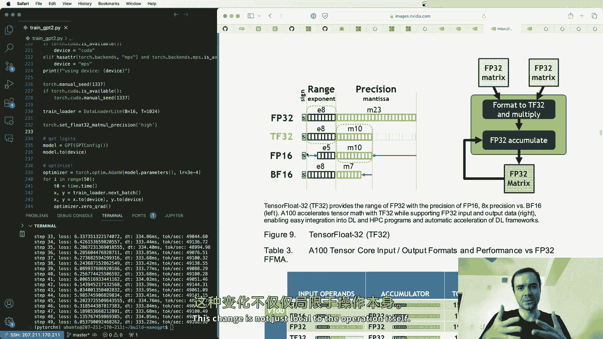

 So let's see how that works。 There's some documentation here that。

 so I think this is probably the best page to explain how to use mixed precision in PyTorch。

 Because there are many other tutorials and so on， even within PyTorch documentation。

 that are a lot more confusing。 And so I recommend specifically this one because there's five other copies that I would not recommend。

 And then when we come here， ignore everything about everything。

 Ignore everything about the gradient scalars and only look at Torx。autocast。

 And basically also this comes to a single line of code at the end。

 So this is the context manager that we want。 And we want to use that in our network。

 When you click into the Torx。autocasting， it has a bit more guideline for you。

 So it's telling you do not call Bf16 on any of your tensors。

 Just use autocast and only surround the forward pass of the model and the loss calculation。

 And that's the only two things that you should be surrounding。

 Leave the backward and the off-measure step alone。

 So that's the guidance that comes from the PyTorch team。 So we're going to follow that guidance。

 And for us， because the loss calculation is inside of the model forward pass for us。

 we are going to be doing this。 And then we don't want to be using Torx。

autocasting because if we do that， we need to start using gradient scalars as well。

 So we are going to be using Bf16。 This is only possible to do an ampere。

 But this means that the changes are extremely minimal。 Well， basically just this one line of code。

 Let me first break in to here before we actually run this。 So right after logits。

 I'd like to show you that different from the TF32 that we saw。

 this is actually going to impact our tensors。 So this logit tensor。

 if we now look at this and we look at the D type， we suddenly see that this is now Bf16。

 It's not flue 32 anymore。 So our activations have been changed。 The activations tensor is now Bf16。

 But not everything has changed。 Model。transformer。WTE。 This is the weight token embedding table。

 It has a dot weight inside it。 And the D type of this weight， this parameter， is still torchflow 32。

 So our parameters seem to still be in flow 32。 But our activations， the logits are now in Bf16。

 So clearly， this is why we get the mixed precision。 Some things PyTorch is keeping in flow 32。

 Some things PyTorch is converting to lower precision。

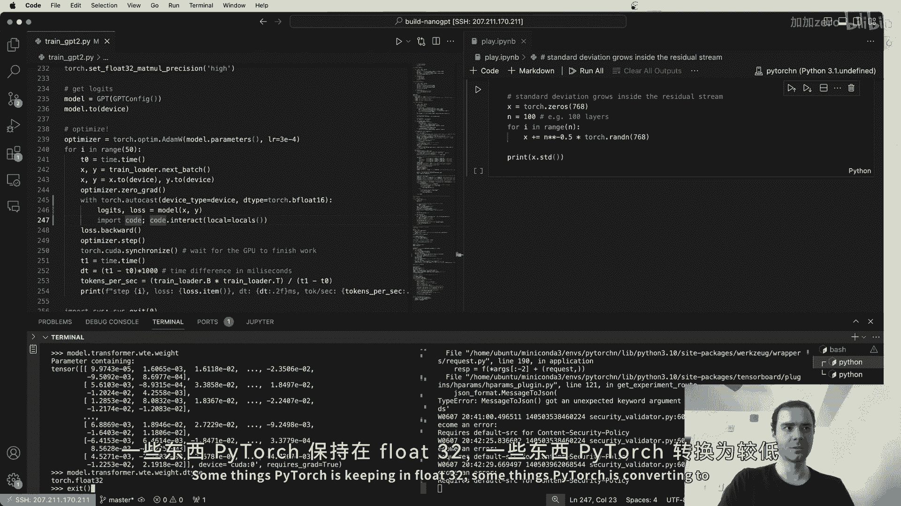

 And what gets converted， at what point， is not super clear。 I remember scrolling down。 is it here？

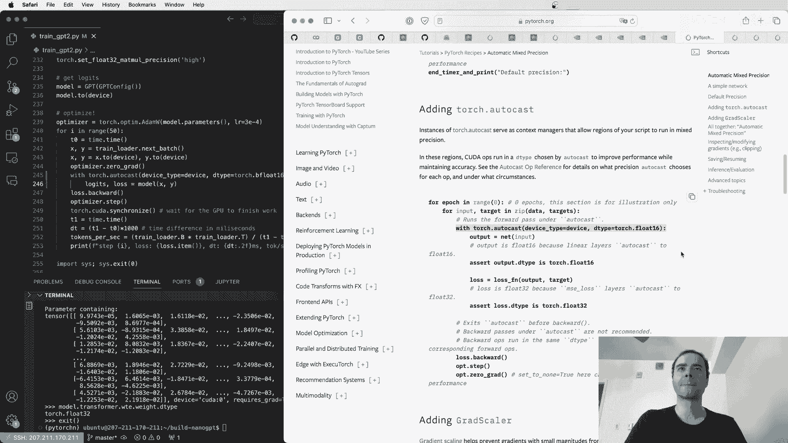

 Okay， I can't find it。 I thought it was here。 Okay， there we go。

 So there are a few docs on when you're using this AutoCast。 What gets converted to Bf16 and when？

 So， for example， only these matrix multiply-like operations get converted to Bf16。

 But a lot of operations remain in flow 32。 So in particular。

 a lot of normalizations like layer norms and things like that。

 Not all of those layers might be converted。 So only some layers selectively would be running Bf16。

 But things like softmax， layer norms， log softmax， so loss function calculations。

 A lot of those things might remain in flow 32 because they are more susceptible to precision changes。

 Major multiplies are fairly robust to precision changes。

 So some parts of the network are impacted more or less by the precision change。 So basically。

 only some parts of the model are running in reduced precision。

 Let's take it for a spin and let's actually see what kind of improvement we achieved here。 Okay。

 so we used to be 333 milliseconds。 We're now 300。 And we used to be somewhere around 50。

000 tokens per second。 We're now 55。 So we're definitely running faster， but maybe not a lot faster。

 And that's because there are still many， many bottlenecks in RGP2。 We're just getting started。

 But we have dropped down the precision as far as we can with my current GPU， which is A100。

 We're using PyTorch AutoCast。 Unfortunately， I don't actually exactly know what PyTorch AutoCast does。

 I don't actually know exactly what's in Bflow 16， what's in flow 32。

 We could go in and we could start to scrutinize it。

 But these are the kinds of rules that PyTorch has internally。 And unfortunately。

 they don't document it very well。 So we're not going to go into that in too much detail。

 But for now， we are training in Bflow 16。 We do not need a gradient scaler。

 And the reason things are running faster is because we are able to run tensor course in Bflow 16 now。

 That means we are in this row。 But we are also paying in precision for this。

 So we expect slightly less accurate results with respect to the original IP32。 But empirically。

 in many cases， this is a worth it kind of trade off。 Because it allows you to run faster。

 And you could， for example， train longer and make up for that precision decrease。

 So that Bflow 16 for now。 Okay， so as we can see， we are currently at about 300 milliseconds per iteration。

 And we're now going to reach for some really heavy weapons in the PyTorch arsenal。

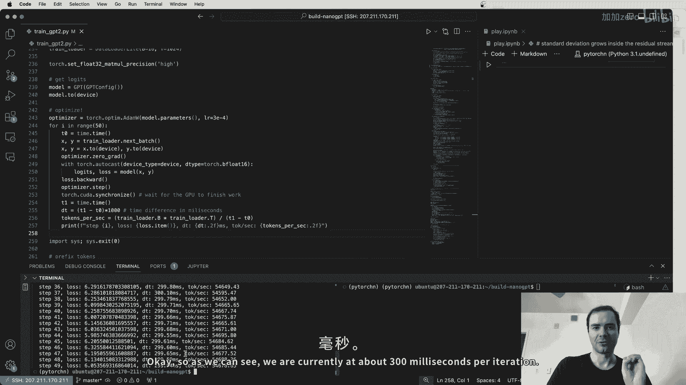

 And in particular， we're going to introduce Torch。compile。 So Torch。

compile is really quite incredible infrastructure from the PyTorch team。

 And it's basically a compiler for neural networks。 Like it's almost like GCC for C and C++ code。

 And this is just GCC of neural nets。

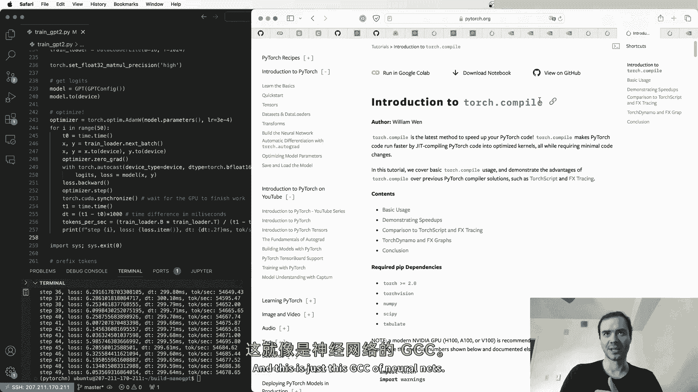

 So it came out a while ago and extremely simple to use。 The way to use Torch。compile is to do this。

 It's a single line of code to compile your model and return it。

 Now this line of code will cost you compilation time。 But as you might guess。

 it's going to make the code a lot faster。 So let's actually run that。

 Because this will take some time to run。 But currently remember we're 300 milliseconds。

 And we'll see what happens。 Now while this is running。

 I'd like to explain a little bit of what Torch。compile does under the hood。

 So feel free to read this page of PyTorch。 But basically there's no real good reason for you to not use Torch。

compile in your PyTorch。 I kind of feel like you should be using it almost by default if you're not。

 Unless you're debugging and you want your code to run really fast。

 And there's one line here in Torch。compile that I found that actually kind of like gets to why this is faster。

 Speedup comes from reducing Python overhead and GPU read writes。 So let me unpack that a little bit。

 Okay， here we are。 Okay， so we're going from 300 milliseconds。

 We're now running at 129 milliseconds。 So this is 300 divided 129， about 2。3x。

 improvement from a single line of code in PyTorch。 So quite incredible。 So what is happening。

 what's happening under the hood？ Well when you pass the model to Torch。compile。

 what we have here in this end module， this is really just the algorithmic description of what we'd like to happen in our network。

 And Torch。compile will analyze the entire thing and it will look at what operations you like to use。

 And with the benefit of knowing exactly what's going to happen。

 it doesn't have to run in what's called the eager mode。

 It doesn't have to just kind of like go layer by layer。

 like the Python interpreter normally would start at the forward。 And the Python interpreter will go。

 okay， let's do this operation。 And then let's do that operation。

 And it kind of materializes all the operations as it goes through。

 So these calculations are dispatched and run in this order。

 And the Python interpreter and this code doesn't know what kind of operations are going to happen later。

 But Torch。compile sees your entire code at the same time。

 And it's able to know what operations you intend to run and it will kind of optimize that process。

 The first thing we'll do is we'll take out the Python interpreter from the forward pass entirely。

 And it will kind of compile this entire neural net as a single object with no Python interpreter involved。

 So it knows exactly what's going to run and we'll just run that。

 And it's all going to be running in efficient code。

 The second thing that happens is this read/write that they mentioned very briefly。

 So a good example of that I think is the Galou nonlinearity that we've been looking at。

 So here we use the NN Galou。 Now this here is me basically just breaking up the NN Galou which you remember has this formula。

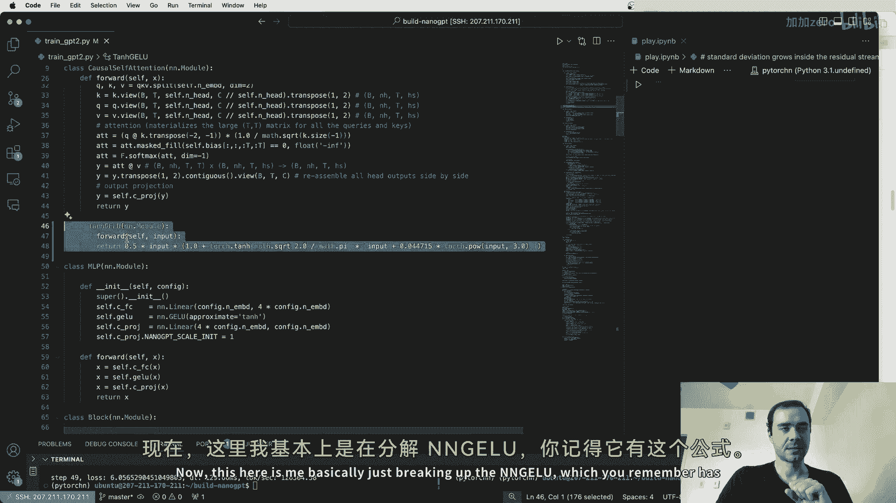

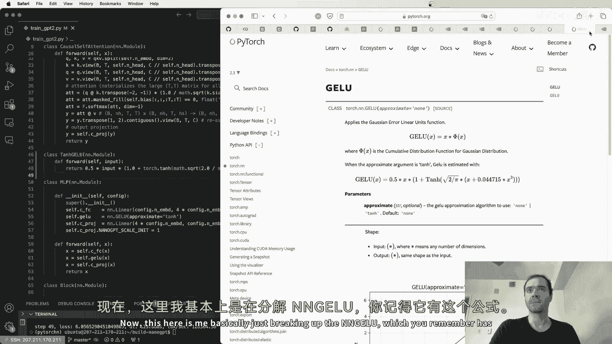

 So this here is the equivalent implementation to what's happening inside Galou。

 Algorithmicly it's identical。 Now by default if we just were using this instead of NN that Galou here。

 What would happen without Torch。compile？ Well the Python interpreter would make its way here。

 And then it would be okay well there's an input。 Well let me first let me raise this input to the third power。

 And it's going to dispatch a kernel that takes your input and raises to the third power。

 And that kernel will run。 And when this kernel runs what ends up happening is this input is stored in the memory of the GPU。

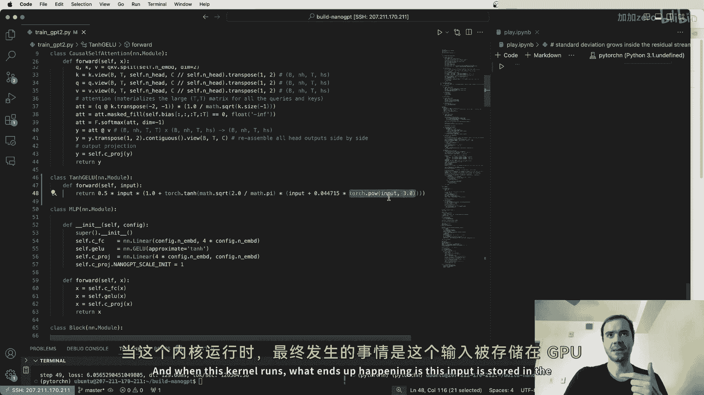

 So here's a helpful example of the layout of what's happening right。

 If your CPU this is in every single computer there's a few cores in there and you have your RAM。

 your memory。 And the CPU can talk to the memory and this is all well known。

 But now we've added the GPU。 And the GPU is a slightly different architecture of course they can communicate。

 And it's different in that it's got a lot more cores than the CPU。

 All of those cores are individually a lot simpler too。

 But it also has memory right this high bandwidth memory。 Sorry if I'm botching it。

 HBM I don't even know what that stands for。 I'm just realizing now。

 But this is the memory and it's very equivalent to RAM basically in the computer。

 And what's happening is that input is living in the memory。

 And when you do input cubed this has to travel to the GPU to the course and to all the caches and registers on the actual chip of this GPU。

 And it has to calculate all the elements to the third and then it saves the result back to the memory。

 And it's this travel time that actually causes a lot of issues。

 So here remember this memory bandwidth？ We can communicate about two terabytes per second which is a lot。

 But also we have to traverse this link and it's very slow。

 So here on the GPU we're on a chip and everything is super passed within the chip。

 But going to the memory is extremely expensive takes extremely long amount of time。

 And so we load the input， do the calculations and load back the output。

 And this round trip takes a lot of time。

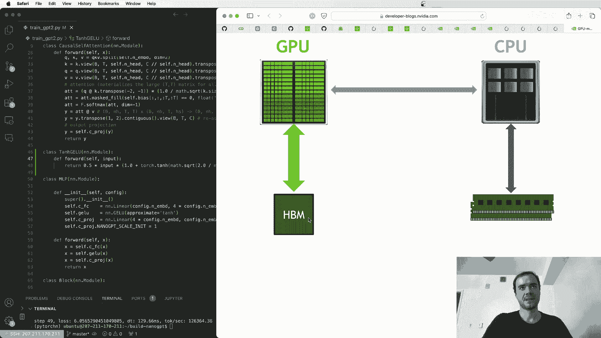

 And now right after we do that we multiply by this constant。

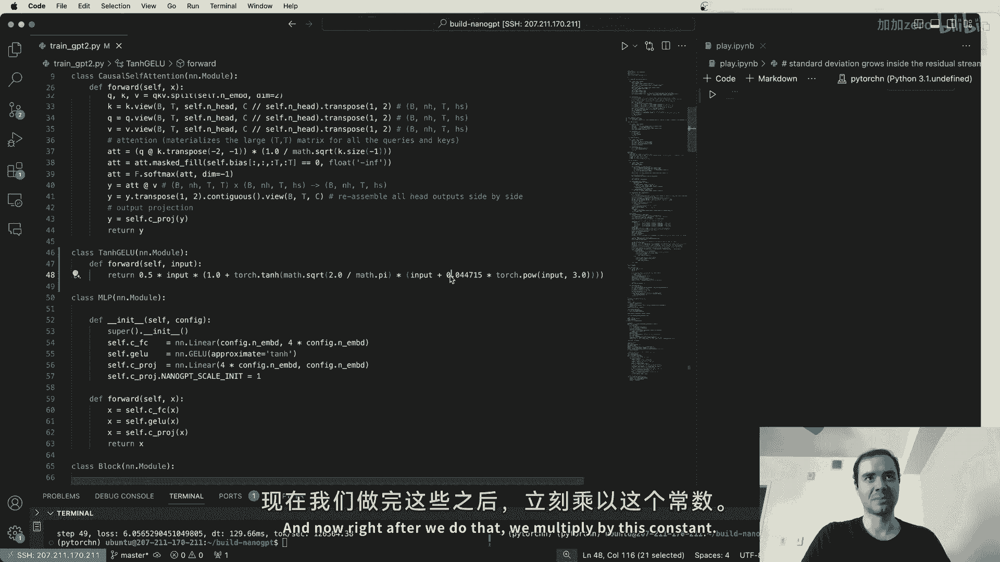

 So what happens then is we dispatch another kernel and then the result travels back all the elements get multiplied by constant。

 And then the result travel back to the memory。

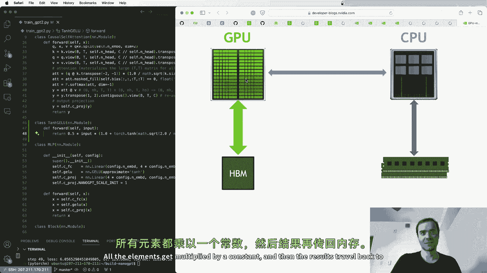

 And then we take the result and we add back input。

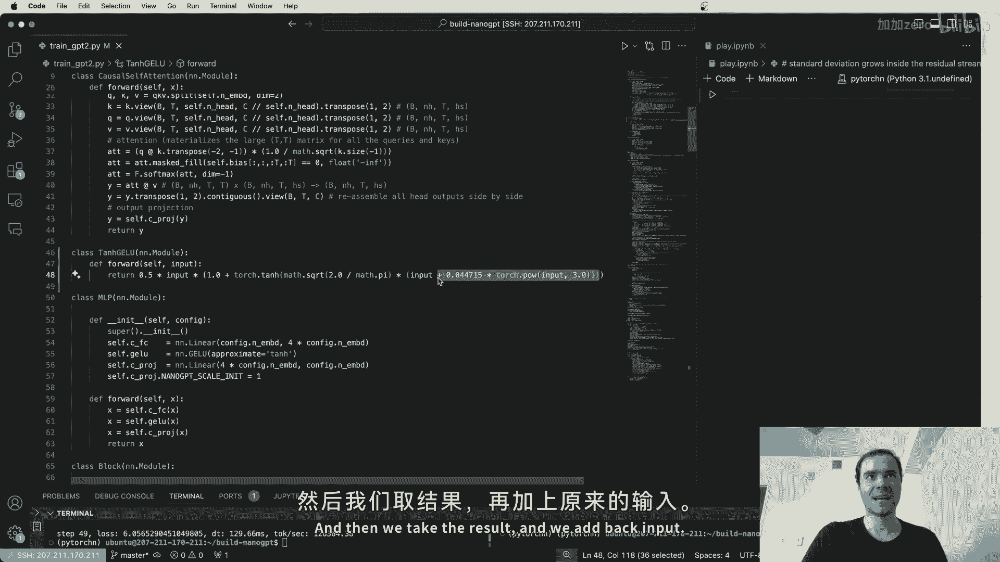

 And so this entire thing again travels to the GPU as the inputs and gets written back。

 So we're making all these round trips from the memory to actually where the computation happens。

 Because all the tensor cores and ALUs and everything like that is all stored on the chip in the GPU。

 So we're doing a ton of round trips。 And PyTorch without using Torch Compile doesn't know to optimize this because it doesn't know what kind of operations you're running later。

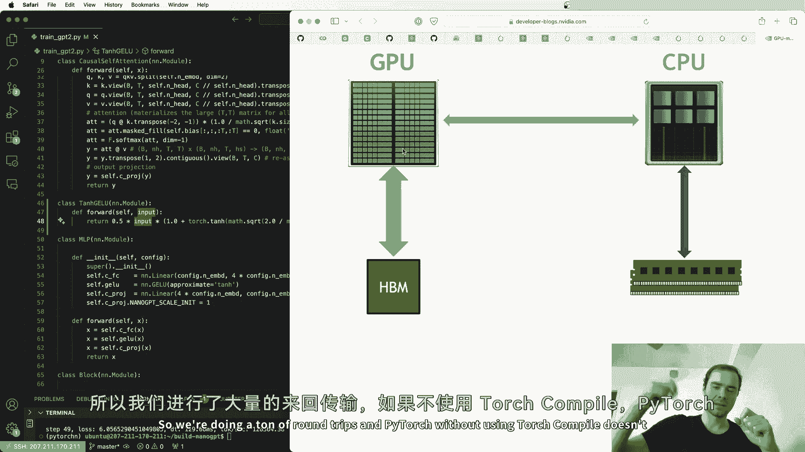

 You're just telling it raise the power to the third， then do this， then do that。

 And it will just do that in that sequence。 But Torch Compile sees your entire code。

 It will come here and it will realize wait all of these are element-wise operations。

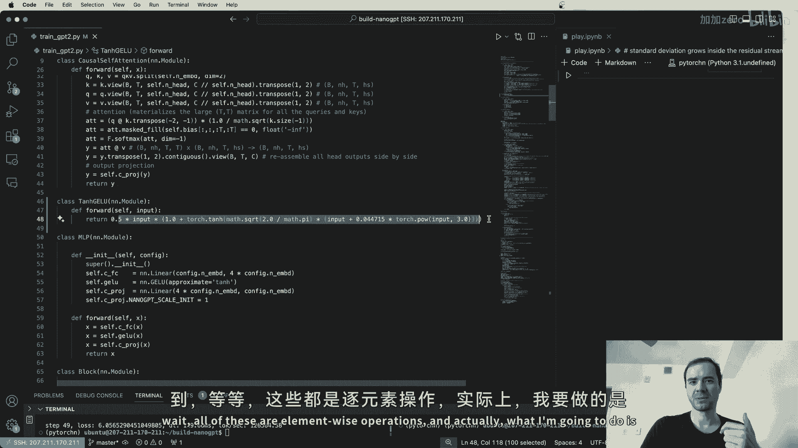

 And actually what I'm going to do is I'm going to do a single trip of input to the GPU。

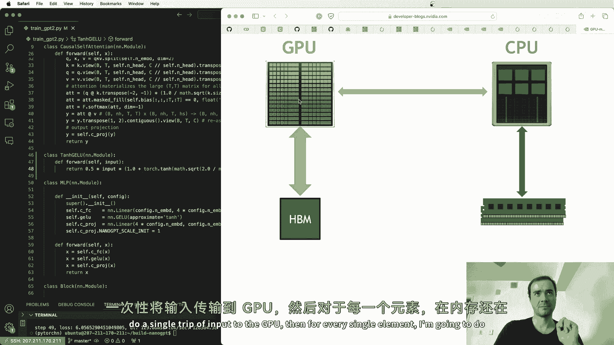

 Then for every single element I'm going to do all of these operations while that memory is on the GPU。

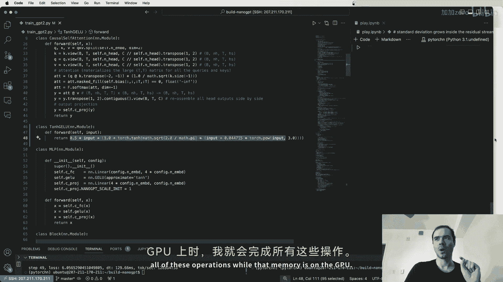

 Or chunks of it rather。 And then I'm going to write back a single time。

 So we're not going to have these round trips。 That's one example of what's called kernel fusion and is a major way in which everything is sped up。

 So basically if you have your benefit of concept and you know exactly what you're going to compute。

 you can optimize your round trips to the memory。 And you're not going to pay the memory bandwidth cost。

 And that's fundamentally what makes some of these operations a lot faster。

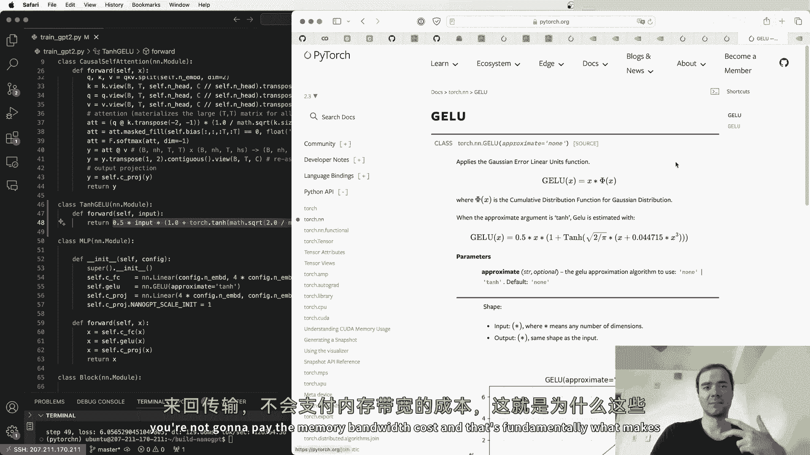

 And what they mean by read writes here。 So let me erase this because we are not using it。

 And yeah we should be using the torch compile and our code is now significantly faster。

 And we're doing about 125，000 tokens per second。 But we still have a long way to go。

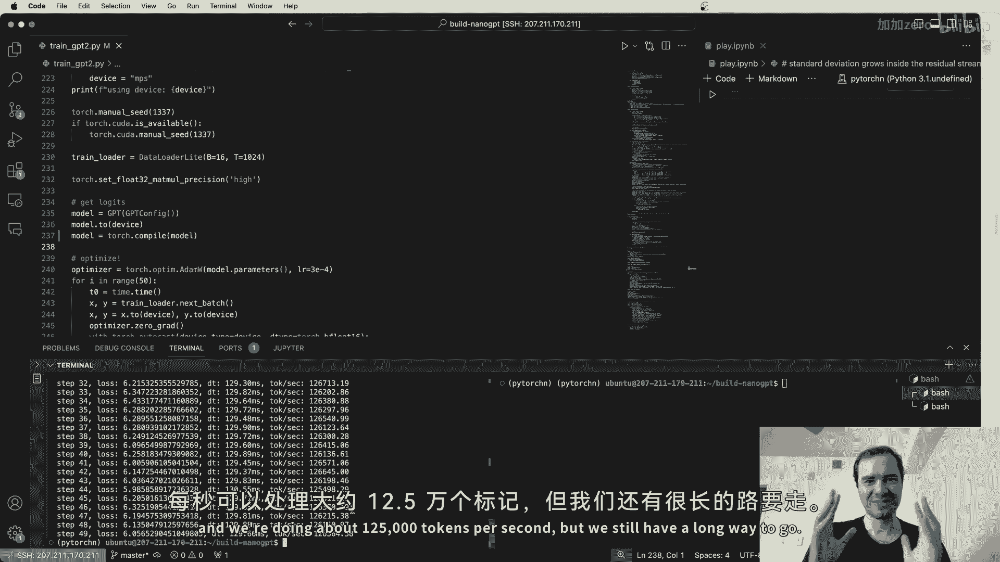

 Before we move on I wanted to supplement the discussion a little bit with a few more figures。

 Because this is a complicated topic but it's worth understanding on the high level what's happening here。

 And I could probably spend an entire video of like two hours on this but just the preview of that basically。

 So this chip here that is the GPU。 This chip is where older calculations happen mostly。

 But this chip also does have some memory in it。 But most of the memory by far is here in the high bandwidth memory。

 HBM， and is connected。 They're connected。 But these are two separate chips basically。

 Now here this is a zoom in of kind of this cartoon diagram of a GPU。

 And what we're seeing here is number one you see this HBM。

 I realize it's probably very small for you。 But on the sides here it says HBM。

 And so that's the length of the HBM。 Now the HBM is again off chip。

 On the chip there are a large number of these streaming multiprocessors。

 Every one of these is an SM。 There's 120 of them in total。

 And this is where a lot of the calculations happen。 And this is a zoom in of a single individual SM。

 It has these four quadrants and C for example tensor core。

 This is where a lot of the matrix multiply stuff happens。

 But there's all these other units to do all different kinds of calculations for FV64， FV32。

 and for integers and so on。 Now so we have all this logic here to the calculations。

 But in addition to that on the chip there is memory sprinkled throughout the chip。

 So L2 cache is some amount of memory that lives on the chip。

 And then on the SMs themselves there's L1 cache。 I realize it's probably very small for you but this blue bar is L1。

 And there's also registers。 And so there is memory stored here。

 But the way this memory is stored is very different from the way memory stored in HBM。

 This is a very different implementation using just in terms of like what the silicon looks like。

 It's a very different implementation。 So here you would be using transistors and capacitors。

 And here it's a very different implementation with SRAM and what that looks like。

 But long story short is there is memory inside the chip but it's not a lot of memory。

 That's the critical point。 So this is some example diagram of a slightly different GPU just like here。

 Where it shows that for example typical numbers for CPU D or M memory which is this thing here。

 You might have one terabyte of disk but it would be extremely expensive to access。

 Especially for a GPU you have to go through the CPU here。 Now next we have the HBM。

 So we have tens of gigabytes of HBM memory on a typical GPU here。

 But as I mentioned very expensive to access。 And then on the chip itself everything is extremely fast within the chip。

 But we only have a couple of 10 megabytes of memory collectively throughout the chip。

 And so there's just not enough space because the memory is very expensive on the chip。

 And so there's not a lot of it but it is lightning fast to access in relative terms。

 And so basically whenever we have these kernels the more accurate picture of what's happening here is that we take these inputs which live by default on the global memory。

 And now we need to perform some calculation。 So we start streaming the data from the global memory to the chip。

 We perform the calculations on the chip and then stream it back and store it back to the global memory。

 And so if we don't have torch compile we are streaming the data through the chip during the calculations and saving to the memory。

 And we're doing those round trips many many times。

 But if it's torch compiled then we start streaming the memory as before。

 But then while we're on the chip we have a chunk of the data that we're trying to process。

 So that chunk now lives on the chip。 While it's on the chip it's extremely fast to operate on。

 So if we have kernel fusion we can do all the operations right there in an element wise passion。

 And those are very cheap。 And then we do a single round trip back to the global memory。

 So operator fusion basically allows you to keep your chunk of data on the chip and do lots of calculations on it before you write it back。

 And that gives huge savings and that's why torch compile ends up being a lot faster or that's one of the major reasons。

 So again just a very brief intro to the memory hierarchy and roughly what torch compile does for you。

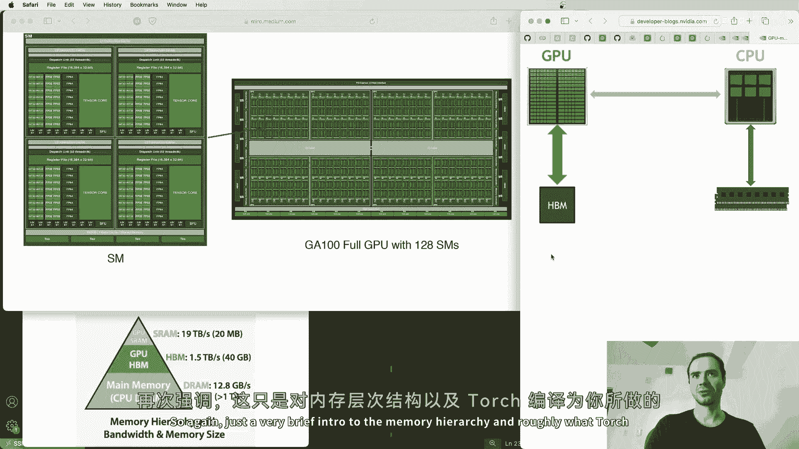

 Now torch compile is amazing but there are operations that torch compile will not find。

 And an amazing example of that is flash attention to which we turn next。

 So flash attention comes from this paper from Stanford in 2022。

 And it's this incredible algorithm for performing attention。 So and running it a lot faster。

 So flash attention will come here and we will take out these four lines。

 And flash attention implements these four lines really really quickly。

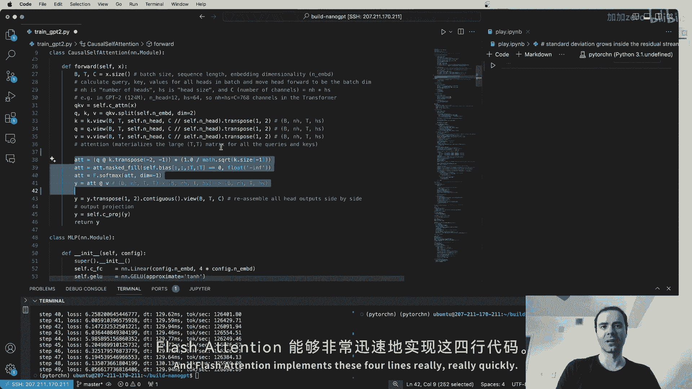

 And how does it do that？ Well flash attention is a kernel fusion operation。

 So you see here we have in this diagram they're showing PyTorch and you have these four operations。

 They're including dropout but we are not using dropout here。

 So we just have these four lines of code here。 And instead of those we are fusing them into a single fused kernel of flash attention。

 So it's a kernel fusion algorithm but it's a kernel fusion that torch compile cannot find。

 And the reason that it cannot find it is that it requires an algorithmic rewrite of how attention is actually implemented here in this case。

 And what's remarkable about it is that flash attention actually if you just count the number of flops。

 flash attention does more flops than this attention here。

 But flash attention is actually significantly faster。 In fact they site 7。

6 times faster potentially。 And that's because it is very mindful of the memory hierarchy as I described it just now。

 And so it's very mindful about what's in High Bandwidth memory， what's in the shared memory。

 And it is very careful with how it orchestrates to computation such that we have fewer reads and writes to the High Bandwidth memory。

 And so even though we're doing more flops the expensive part is they're load and store into HBM and that's what they avoid。

 And so in particular they do not ever materialize this end by end attention matrix。 This ADT here。

 A flash attention is designed such that this matrix never gets materialized at any point and it never gets read or written to the HBM。

 And this is a very large matrix right so because this is where all the queries and keys interact and we're sort of getting for each head。

 for each batch element we're getting a T by T matrix of attention which is a million numbers even for a single head at a single batch index。

 So basically this is a ton of memory and this is never materialized。

 And the way that this is achieved is that basically the fundamental algorithmic rewrite here relies on this online softmax trick which was proposed previously and I'll show you the paper in a bit。

 And the online softmax trick coming from a previous paper shows how you can incrementally evaluate a softmax without having to sort of realize all of the inputs to the softmax of the normalization。

 And you do that by having these intermediate variables M and L and there's an update to them that allows you to evaluate the softmax in an online manner。

 Now flash attention actually recently flash attention to came out as well so I have that paper up here as well that has additional gains to how it calculates flash attention。

 And the original paper that this is based on basically is this online normalization calculation for softmax and remarkably it came out of Nvidia and it came out of it like really early 2018。

 And this is four years before flash attention。 And this paper says that we propose a way to compute the classical softmax with fewer memory accesses and hypothesize that this reduction in memory accesses should improve softmax performance on actual hardware。

 And so they are extremely correct in this hypothesis but it's really fascinating to me that they're from Nvidia and that they had this realization but they didn't actually take it to the actual flash attention that had to come four years later from Stanford。

 So I don't fully understand the historical how this happened historically but they do basically propose this online update to the softmax right here。

 And this is fundamentally what they reuse here to calculate the softmax in a streaming manner。

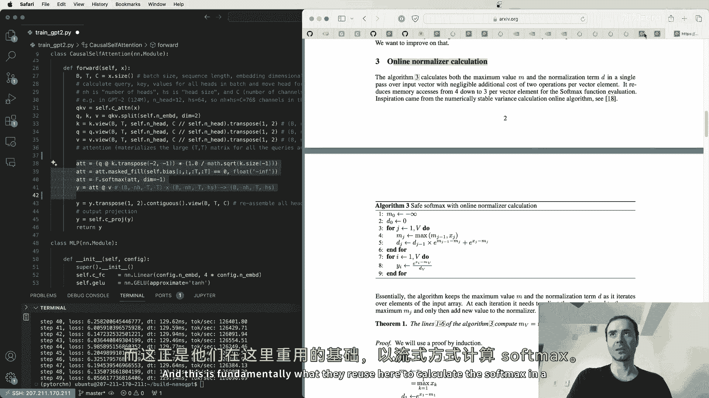

 And then they realize that they can actually fuse all the other operations with the online softmax calculation into a single fused kernel flash attention and that's what we are about to use。

 So a great example I think of being aware of memory hierarchy， the fact that flobs don't matter。

 the entire memory access pattern matters， and that torch compile is amazing but there are many optimizations that are still available to us that potentially torch compile cannot find。

 Maybe one day it could but right now it seems like a lot to ask。 So here's what we're going to do。

 we're going to use flash attention and the way to do that basically in PyTorch is we are going to comment out these four lines and we're going to replace them with a single line。

 And here we are calling this compound operation in PyTorch called scale。productattention。

 And PyTorch will call flash attention when you use it in this way。

 I'm not actually 100% sure why torch compile doesn't realize that these four lines should just call flash attention in this exact way。

 We have to do it again for it， which in my opinion is a little bit odd。 But here we are。

 So you have to use this compound up and let's wait for a few moments before torch compile gets around to it。

 And then let's remember that we achieved 6。05661， I have it here。

 that's the loss we are expecting to see。 And we took 130 milliseconds before this change。

 So we're expecting to see the exact same result by iteration 49 but we expect to see faster runtime。

 Because flash attention is just an algorithmic rewrite and it's a faster kernel but it doesn't actually change any of the computation and we should have the exact same optimization。

 So okay， so we're a lot faster。 We're at about 95 milliseconds and we achieve 6。058。 Okay。

 so they're basically identical up to a floating point fetch factor。

 So it's the identical computation but it's significantly faster going from 130 to roughly 96。

 And so this is 96 divided 130 ish so this may be 27% improvement。

 So really interesting and that is flash attention。 Okay。

 we are now getting to one of my favorite optimizations。

 And it is simultaneously the dumbest and the most brilliant optimization and it's always a little bit surprising to me。

 Anyway， so basically I mentioned a few minutes ago that there are some numbers that are nice and some numbers that are ugly。

 So 64 is a beautiful nice number。 128 is even nicer。 256 is beautiful。

 What makes these numbers beautiful is that there are many powers of two inside them。

 You can divide by two many times。 And examples of ugly numbers are like 13 and 17 and something like that。

 Prime numbers， numbers that are not even and so on。

 And so pretty much you always want to use nice numbers in all of your code that deals with neural networks or CUDA。

 Because everything in CUDA works in sort of like powers of two and lots of kernels are written in terms of powers of two。

 And there are lots of blocks of sizes 16 and 64 and so on。

 So everything is written in those terms and you always have special case handling for all kinds of logic that when your inputs are not made of nice numbers。

 So let's see what that looks like。 Basically scan your code and look for ugly numbers is roughly the heuristic。

 So three times is kind of ugly。 I'm not 100% sure maybe this can be improved but this is ugly and not ideal。

 Four times is nice。 So that's nice。 1024 is very nice。 That's a power of two。

 12 is a little bit suspicious。 Not too many powers of two。 768 is great。 50，000 to 57 is a really。

 really ugly number。 First of all it's odd。 And there's not too many powers of two in there。

 So this is a very ugly number and it's highly suspicious。

 And then when we scroll down all these numbers are nice and then here we have mostly nice numbers except for 25。

 So in this configuration of GPT-2 XL a number of heads is 25。 That's a really ugly number。

 That's an odd number and actually this did cause a lot of headaches for us recently when we were trying to optimize some kernels to run this fast。

 And required a bunch of special case handling。 So basically these numbers are。

 we have some ugly numbers and some of them are easier to fix than others。

 And in particular the vocab size being 50，000 to 57。 That's a very ugly number。

 very suspicious and we want to fix it。 Now when you fix these things one of the easy ways to do that is you basically increase the number until it's the nearest power of two that you like。

 So here's a much nicer number。 It's 50，000， 304。 And why is that？ Because 50，000。

 304 can be divided by 8 or by 16 or by 32， 64。 It can even be divided by 128 I think。

 So it's a very nice number。 So what we're going to do here is this is the GPT config and you see that we initialize vocab size to 50。

000， 257。 Let's override just that element to be 50，304。 Okay。 So everything else stays the same。

 We're just increasing our vocabulary size。 So we're adding。

 it's almost like we're adding fake tokens。 So that vocab size has powers of two inside it。

 Now actually what I'm doing here by the way is I'm increasing the amount of computation that our network will be doing。

 If you just count the flops on like do the math of how many flops we're doing。

 we're going to be doing more flops。 And we still have to think through whether this doesn't break anything。

 But if I just run this， let's see what we get。 Currently this ran in maybe 96。

5 milliseconds per step。 I'm just kind of like eyeballing it。

 And let's see what kind of result we're going to get。 While this is compiling。

 let's think through whether our code actually works。 Okay。

 When we increase the vocab size like this。 Let's look at where vocab size is actually used。

 So we swing up to the init and we see that it's used inside the embedding table， of course。

 So all the way at the bottom of the transformer and it's used at the classifier layer all the way at the top of the transformer。

 So in two places。 And let's take a look and we're running at 93。 So 93 milliseconds instead of 96。5。

 So we are seeing a roughly a whole percent improvement here by doing more calculations。

 And the reason for this is we fixed， we made an ugly number into a nice number。 Let's。

 I'm going to come into the explanation for that a little bit again。 But for now。

 let's just convince ourselves that we're not breaking anything when we do this。 So first of all。

 we've made the WTE， the embedding table for the tokens。 We've made it larger。

 It's almost like we introduced more tokens at the bottom。

 And these tokens are never used because the GPT tokenizer only has tokens up to 50，000 to 56。

 And so we'll never index into the rows that we've added。

 So we're wasting a little bit of space here by creating memory that's never going to be accessed。

 never going to be used， et cetera。 Now that's not fully correct because this WTE weight ends up being shared and ends up being used in the classifier here at the end。

 So what is that doing to the classifier？ I brought here。 Well。

 what that's doing is we're predicting additional dimensions of the classifier now。

 And we're predicting probabilities for tokens that will， of course。

 never be present in the training set。 And so therefore the network has to learn that these probabilities have to be driven to zero。

 And so the logits that the network produces have to drive those dimensions of the output to negative infinity。

 But that's no different from all the other tokens that are already in our dataset or rather that are not in our dataset。

 So Shakespeare only probably uses， let's say， 1，000 tokens out of 50，000 to 57 tokens。

 So most of the tokens are already being driven to zero probability by the optimization。

 We've just introduced a few more tokens now that in a similar manner will never be used and have to be driven to zero in probability。

 So functionally though nothing breaks。 We're using a bit more extra memory。

 But otherwise this is a harmless operation as far as I can tell。 But。

 and we're adding calculation but it's running faster。

 And it's running faster because as I mentioned in CUDA so many kernels use block tiles。

 And these block tiles are usually nice numbers， so powers of two。

 So calculations are done in like chunks of 64 or chunks of 32。

 And when you're desired calculation doesn't neatly fit into those block tiles。

 There are all kinds of boundary kernels that can kick in to like do the last part。

 So basically in a lot of kernels they will truncate up your input and they will do the nice part first。

 And then they have a whole second phase where they come back to anything that like remains。

 And then they process the remaining part。 And the kernels for that could be very inefficient。

 And so you're basically spinning up all this extra compute and it's extremely inefficient。

 So you might as well pad your inputs and make it fit nicely。

 And usually that empirically it's actually running faster。

 So this is another example of a 4% improvement that we've added。

 And this is something that also Torch Compile did not find for us。

 You would hope that Torch Compile at some point could figure an optimization like this out。

 But for now this is it。 And I also have to point out that we're using PyTorch nightly。

 So that's why we're only seeing 4%。 If you're using PyTorch 2。3。

1 or earlier you would actually see something like 30% improvement。 Just from this change from 50。

000 to 57 to 53。04。 So again one of my favorite examples also of having to understand the under the hood and how it all works。

 And to know what kinds of things to tinker with to push the performance of your code。

 Okay so at this point we have improved the performance by about 11x。

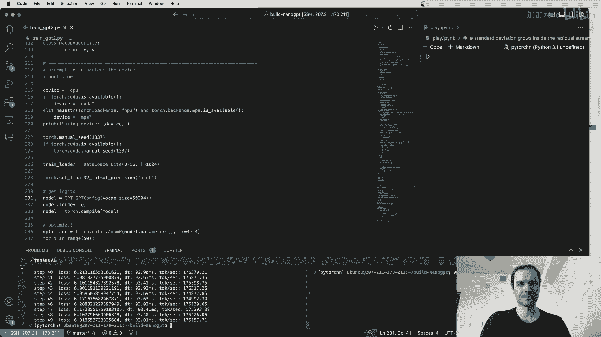

 Because we started at about 1000 milliseconds per step and we're now down to like 93 milliseconds。

 So that's quite good。 And we're doing a much better job of utilizing our GPU resources。

 So I'm going to now turn to more algorithmic changes and improvements to the actual optimization itself。

 And what we would like to do is we would like to follow the hyperparameters that are mentioned in the GPT2 or GPT3 paper。

 Now sadly GPT2 doesn't actually say too much。 It's very nice of them that they released the model weights and the code。

 But the paper itself is extremely vague as to the optimization details。

 The code itself that they released as well。 The code would be looking at this is just the inference code。

 So there's no training code here and very few hyperparameters。

 So this doesn't also tell us too much。 So for that we have to turn to the GPT3 paper。

 And in the appendix of the GPT3 paper they have a lot more hyperparameters here for us to use。

 And the GPT3 paper in general is a lot more detailed as to all the small details that go into the model training。

 But GPT3 models were never released。 So GPT2 we have the weights but no details。

 In GPT3 we have lots of details but no weights。 But roughly speaking GPT2 and GPT3 architectures are very very similar。

 And basically there are very few changes。 The context length was expanded from 1024 to 2048 and that's kind of like the major change。

 And some of the hyperparameters around the transformer have changed。

 But otherwise they're pretty much the same model。 It's just that GPT3 was trained for a lot longer on a bigger data set and has a lot more thorough evaluations。

 And the GPT3 model is 175 billion instead of 1。6 billion in the GPT2。

 So long story short we're going to go to GPT3 paper to follow along some of the hyperparameters。

 So to train all the versions of GPT3 we use Adam with beta 1 beta 2 of 0。9 and 0。95。

 So let's move over here and make sure that the beta is parameter which you can see here defaults to 0。

9 and 0。999 is actually set to 0。9 and 0。95。 And then the epsilon parameter you can see is the default is 1 -8 and this is also 1 -8。

 Let's just put it in so that we're explicit。 Now next up they say we clip the grad global norm of the gradient at 1。

0。 So what this is referring to is that once we calculate the gradients right after loss。backward。

 we basically have the gradients at all the parameter tensors。

 And what people like to do is basically clip them to have some kind of a maximum norm。

 So in PyTorch this is fairly easy to do。 It's one line of code here that we have to insert right after we calculate the gradients。

 And what this utility function is doing is it's calculating the global norm of the primers。

 So every single gradient on all the primers you square it and you add it all up and you take a big square root of that。

 And that's the norm of the parameter vector basically。

 It's the length of it if you'd like to look at it that way。

 And we are basically making sure that its length is no more than 1。0 and we're going to clip it。

 And the reason that people like to use this is that sometimes you can get unlucky during the optimization。

 Maybe it's a bad data batch or something like that。

 And if you get very unlucky in a batch you might get really high loss and really high loss could lead to a really high gradient。

 And this could basically shock your model and shock the optimization。

 So people like to use a gradient norm clipping to prevent the model from basically getting two bigger shocks in terms of the gradient magnitude and the upper bound in this way。

 It's a bit of a hacky solution。 It's about like a patch on top of deeper issues but people still do it fairly frequently。

 Now the clip grad norm returns the norm of the gradient which I like to always visualize because it is useful information and sometimes you can look at the norm of the gradient。

 And if it's well behaved things are good。 If it's climbing things are bad and they're destabilizing during training。

 Sometimes you could get a spike in the norm and that means there's some kind of an issue or instability。

 So the norm here will be a norm and let's do a 。4 f or something like that。

 And I believe this is just a float。 And so we should be able to print that。

 So that's global gradient clipping。 Now they go into the details of the learning rate scheduler。

 So they don't just use a fixed learning rate like we do here for three negative four but there's actually basically a cosine decay learning rate schedule。

 It's got a warm up and it's got a cosine decay to 10% over some horizon。

 And so we're going to implement this in a second。 I just like to see the norm printed here。 Okay。

 there we go。 So what happened here is the norm is actually really high in the beginning 30 or so。

 And you see that as we continue training it kind of like stabilizes at values below one。

 And this is not that crazy uncommon for the norm to be high in the very first few stages。

 Basically what's happening here is the model is completely random。

 And so there's a ton of learning happening very early in the network。

 But that learning is kind of like it's mostly learning the biases of the output tokens。

 And so it's a bit of an unstable time but the network usually stabilizes in the very few iterations。

 So this looks relatively reasonable to me except usually I would expect this looks a little bit funky。

 We go from 28 to 6 to 2 and then to 10。 It's not completely insane but it's just kind of a little bit funky。

 Okay， so let's now get to the learning rate scheduler。

 So the learning rate schedule that's used here in GPT-3 is what's called a cosine decay learning schedule with warmup。

 And the way this looks is that the learning rate is basically starts right at around zero。

 linearly ramps up over some amount of time and then comes down with this cosine sort of form。

 and comes down to some kind of a minimum learning rate that's up to you。

 So here the minimum learning rate is zero but here in the paper they said that they use cosine decay。

 for learning rate down to 10% of its value over the first 260 billion tokens and then training continues 10% after。

 And there's a linear warmup over the first 375 million tokens。

 So that's about the learning rate so let's now implement this。

 So I already implemented it here and the way this works is let me scroll down first here。

 I changed our training loop a little bit so this was a 4i in max steps。

 I just changed it to step now so that we have the notion of a step is a single optimization step in the 4 loop。

 And then here I get the LR for this step of the optimization using a new function I call get LR。

 And then in PyTorch to set the learning rate I think this is the way to set the learning rate。

 It's a little bit gnarly because you have to basically there's a notion of different parameter groups that could exist in the optimizer。

 and we actually have to iterate over them even though we currently have a single parameter group only。

 And you have to set the LR in this 4 loop kind of style is my impression right now。

 So we have this local for LR we set the learning rate and then on the bottom also printing it。

 So that's all the changes I made to this loop and then of course the get LR is my scheduler。

 Now it's worth pointing out that PyTorch actually has learning rate schedulers and you can use them and I believe there's a cosine learning rate schedule in PyTorch。

 I just don't really love using that code because honestly it's like five lines of code and I fully understand what's happening inside these lines。

 So I don't love to use abstractions where they're kind of incurable and then I don't know what they're doing。

 So personal style。 So the max learning rate here is let's say three negative four but we're going to see that in GPT three here。

 They have a table of what the maximum learning rate is for every model size。

 So for this one basically 12 12 layer 768 GPT three。

 So the GPT three small is roughly like a GPT two one 24m。

 We see that here they use a learning rate of six E negative four。 So we could actually go higher。

 In fact we may want to try to follow that and just set the max LR here at six。

 Then the maximum learning rate the middle learning rate is 10% of that per description in the paper。

 Some number of steps that we're going to warm up over and then the maximum steps of the optimization which I now use also in the for loop down here。

 And then you can go for this code if you like it's not it's not terribly inside floor interesting。

 I'm just modulating based on the iteration number which learning rate there should be。

 So this is the warm up region。 This is the region after the optimization and then this is the region sort of in between and this is where I calculate the cosine learning rate schedule。

 And you can step through this in detail if you'd like but this is basically implementing this curve。

 And I ran this already and this is what that looks like。

 So when we now run we start at some very low number。

 Now note that we don't start exactly at zero because that would be not useful to update with a learning rate of zero。

 That's why there's an it plus one so that on the zero iteration we are not using exactly zero we're using something very very low。

 Then we've linear warm up to maximum learning rate which in this case was three negative four when I ran it but now would be sixteen negative four。

 And then it starts to decay all the way down to three negative five which was at the time 10% of the original learning rate。

 Now one thing we are not following exactly is that they mentioned that。

 Let me see if I can find it again。 We're not exactly following what they did because they mentioned that their training horizon is 300 billion tokens。

 And they come down to 10% of the initial learning rate of at 260 billion and then they train after 260 with 10%。

 So basically their decay time is less than the max steps time where for us they're exactly equal。

 So it's not exactly faithful but it's an okay。 This is okay for us and for our purposes right now and we're just going to use this ourselves。

 I don't think it makes too big of a difference honestly。

 I should point out that what learning rate schedule you use is totally up to you。

 So we have two different types。 Cosine learning rate has been popularized a lot by GPT 200。

 GPT 3 but people have come up with all kinds of other learning rate schedules。

 And this is kind of like an active area of research as to which one is the most effective at training these networks。

 Okay next up。 The paper talks about the gradual batch size increase。

 So there's a ramp on the batch size that is linear and you start with very small batch size and you ramp up to a big batch size over time。

 We're going to actually skip this and we're not going to work with it。

 And the reason I don't love to use it is that it complicates a lot of the arithmetic because you are changing the number of tokens that you're processing at every single step of the optimization。

 And I like to keep that math very very simple。 Also my understanding is that this is not like a major improvement。

 And also my understanding is that this is not like an algorithmic optimization improvement。

 It's more of a systems and speed improvement。 And I'm actually speaking this is because in the early stages of the optimization。

 Again the model is in a very atypical setting and mostly what you're learning is that you're mostly learning to ignore the tokens that don't come up in your training set very often。

 You're learning very simple biases and that kind of a thing。

 And so every single example that you put through your network is basically just telling you use these tokens and don't use these tokens。

 And so the gradients from every single example are actually extremely highly correlated。

 They all look roughly the same in the original parts of the optimization because they're all just telling you that these tokens don't appear and these tokens do appear。

 And so because the gradients are all very similar and they're highly correlated then why are you doing bad sizes of like millions when if you do a bad size of 32K you're basically getting the exact same gradient early on in the training。

 And then later in the optimization once you've learned all the simple stuff that's where the actual work starts and that's where the gradients become more de-correlated per examples。

 And that's where they actually offer you sort of statistical power in some sense。

 So we're going to skip this just because it kind of complicates things。

 And we're going to go to data are sampled without replacement during training。

 So until an epoch boundary is reached。 So without replacement means that they're not sampling from some fixed pool and then take a sequence train on it but then also like return to sequence the pool。

 They are exhausting a pool。 So when they draw a sequence it's gone until the next epoch of training。

 So we're already doing that because our data loader iterates over chunks of data。

 So there's no replacement。 They don't become eligible to be drawn again until the next epoch。

 So we're basically already doing that。 All models use a weight decay of 0。

1 to provide a small amount of regularization。 So let's implement the weight decay。

 And you see here that I've already kind of made the changes。

 And in particular instead of creating the optimizer right here。

 I'm creating a new configure optimizer function inside the model and I'm passing in some of the hyper parameters instead。

 So let's look at the configure optimizer switch is supposed to return the optimizer object。 Okay。

 so it looks complicated but it's actually really simple and it's just we're just being very careful and there's a few settings here to go through。

 The most important thing with respect to this line is that you see there's a weight decay parameter here and I'm passing that into。

 well I'm passing that into something called Optim groups that eventually ends up going into the add and W optimizer。

 And the weight decay that's by default used in add and W here is 0。01。

 So it's 10 times lower than what's used in a GPT 3 paper here。

 So the weight decay basically ends up making its way into the add and W 3 optimizer groups。

 Now what else is going on here in this function？ So the two things that are happening here that are important is that I'm splitting up the parameters into those that should be weight decay and those that should not be weight decay。

 So in particular it is common to not weight decay biases and any other sort of one dimensional tensors。

 So the one dimensional tensors are in the node decay parameters and these are also things like layer norm。

 scales and biases。 It doesn't really make sense to weight decay those。

 You mostly want to weight decay the weights that participate in matrix multiplications and you want to potentially weight decay the embeddings。

 And we've covered in previous video why it makes sense to decay the weights because you can sort of think of it as a regularization because when you're pulling down all the weights you're forcing the optimization。

 to use more of the weights and you're not allowing any one of the weights individually to be way too large。

 You're forcing the network to kind of distribute the word across more channels because there's sort of like a pool of gravity on the weights themselves。

 So that's why we are separating it in those ways here。

 We're only decaying the embeddings and the matmole participating weights。

 We're printing the number of parameters that we're decaying and not。

 Most of the parameters will be decayed。 And then one more thing that we're doing here is I'm doing another optimization here。

 And previous Adam W did not have this option but later parts of PyTorch introduced it。

 And that's why I'm guarding it with an inspect that signature which is basically checking if this fused quad is present inside Adam W。

 And then if it is present I'm going to end up using it and passing it in here。

 Because some earlier versions do not have fused equals。 So here's Adam W fused equals。

 It did not used to exist and it was added later。

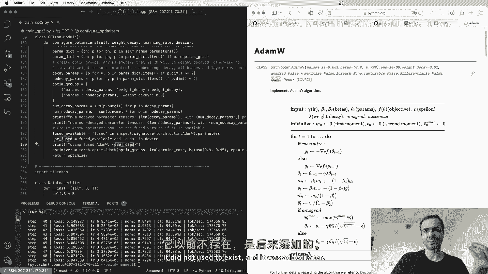

 And there's some docs here for what's happening。 And basically they say that by default they do not use fused because it is relatively new and we want to give it sufficient peak time。

 So by default they don't use fused but fused is a lot faster when it is available and when you're running on CUDA。

 And what that does is instead of iterating in a for loop over all the parameter tensors and updating them。

 that would launch a lot of kernels。 And so fused just means that it's it。

 All those kernels are fused into a single kernel。 You get rid of a lot of overhead and you a single time on all the primers call a kernel that updates them。

 And so it's just basically a kernel fusion for the Adam W update instead of iterating over all the tensors。

 So that's the configure optimizers function that I like to use。 And we can rerun。

 And we're not going to see any major differences from what we saw before but we are going to see some prints coming from here。

 So let's just take a look at what they look like。 So we see that number of decay tensors is 50 and it's most of the primers。

 A number of non-decade tensors is 98 and these are the biases in the layer norm parameters mostly。

 And that's there's only 100，000 of those。 So most of it is decayed。

 And we are using the fused implementation of Adam W which will be a lot faster。

 So if you have it available I would advise you to use it。

 I'm not actually 100% sure why they don't default to it。 It seems fairly benign and harmless。

 And also because we are using the fused implementation I think this is why we have dropped。

 Notice that the running time is to be 93 milliseconds per step and we're now down to 90 milliseconds per step because of using the fused Adam W optimizer。

 So in a single commit here we are introducing fused Adam getting improvements on the time and we're adding or changing the weight decay。

 But we're only weight decaying the two-dimensional parameters。

 the embeddings and the matrices that participated in linear。

 So that is this and we can take this out and yeah that is it for this line。

 One more quick note before we continue here。 I just want to point out that the relationship between weight decay。

 learning rate， batch size， the Adam parameters， beta 1， beta 2， the epsilon and so on。

 These are very complicated mathematical relationships in the optimization literature。

 And for the most part in this video I'm just trying to copy paste the settings that OpenAI used。

 But this is a complicated topic quite deep and yeah in this video I just want to copy the parameters because it's a whole different video to really talk about that in detail and give it a proper justice instead of just high level intuitions。

 Now the next thing that I want to move on to is that this paragraph here by the way we're going to turn back around to when we improve our data load。

 For now I want to swing back around to this table where you will notice that for different models we of course have different parameters for the transformer that dictate the size of the transformer network。

 We also have a different learning rate so we're seeing the pattern that the bigger networks are trained by slightly lower learning rates。

 And we also see this batch size where in a small network they use a smaller batch size and in the bigger networks they use a bigger batch size。

 Now the problem with for us is we can't just use 0。

5 million batch size because if I just try to come in here and I try to set this B， where is my B？

 B equals where do I call it？ Okay B equals 16。 If I try to set。

 well we have to be careful it's not 0。5 million because this is the batch size in the number of tokens。

 Every single one of our rows is 1024 tokens so 0。5 e6 1 million divide 1024。

 This would need about a 488 batch size so the problem is I can't come in here and set this to 488 because my GPU would explode。

 This would not fit for sure。 But we still want to use this batch size because again as I mentioned the batch size is correlated with all the other optimization high parameters and the learning rates and so on。

 So we want to have a faithful representation of all the hyperparameters and therefore we need to use a batch size of 0。

5 million roughly。 But the question is how do we use 0。5 million if we only have a small GPU？

 Well for that we need to use what's called gradient accumulation so we're going to turn to that next and it allows us to simulate in a serial way any arbitrary batch size that we set。

 And so we can do a batch size of 0。5 million which is have to run longer and we have to process multiple sequences and basically add up all the gradients from them to simulate a batch size of 0。

5 million。 So let's turn to that next。 Okay so I started the implementation right here just by adding these lines of code。

 And basically what I did is first I set the total batch size that we desire。 So this is exactly 0。

5 million and I used a nice number of power of two because two to the 19 is 52428。 So it's roughly 0。

5 million in some nice number。 Now our micro batch size as we call it now is 16。

 So this is going to be we still have B by T in the cease that go into the transformer and do forward backward but we're not going to do an update right we're going to do many forward backwards。

 We're going to end those gradients are all going to plus equals on the parameter gradients they're all going to add up。

 So we're going to do forward backward grad acoom steps number of times and then we're going to do a single update once all that is accumulated。

 So in particular our micro batch size is just now controlling how many tokens how many rows we're processing in a single go over forward backward。

 So here we are doing 16 times one 24。 We're doing 16。

 384 tokens per forward backward and we are supposed to be doing two to the 19。 Oops。

 am I doing two to the 19 in total。 So the grad acoom will be 32。

 So therefore grad acoom here will work out to 32 and we have to do 32 forward backward and then a single update。

 Now we see that we have about 100 milliseconds for a single forward backward。

 So doing 32 of them will be will make every step roughly three seconds just napkin math。

 So that's grad acoom steps but now we actually like to implement that。

 So we're going to swing over to our training loop because now this part here and this part here the forward and backward。

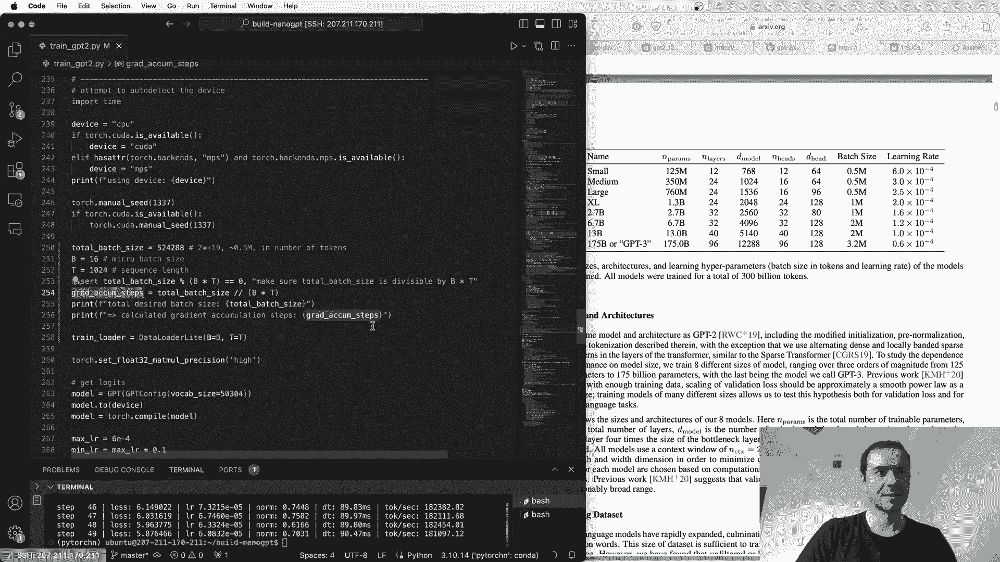

 We have to now repeat this 32 times before we do everything else that follows。

 So let's see how we can implement that。 So let's come over here and actually we do have to load a new batch every single time。

 So let me move that over here and now this is where we have the inner loop。

 So for micro step in range grad acoom steps we do this and remember that loss of backward always deposits gradients。

 So we're doing inside loss of backward。 There's always a plus equals on the gradients。

 So in every single loss of backward gradients will add up on the grade in testers。

 So we lost a backward and then we get all the gradients over there and then we normalize and everything else should just follow。

 So we're very close but actually there's like subtle and deep issue here and this is actually incorrect。

 So I invite you to think about why this is not yet sufficient and let me fix it then。

 Okay so I brought back the Jupyter notebook so we can think about this carefully in a simple toy setting and see what's happening。

 So let's create a very simple neural nut that takes a 16 vector of 16 numbers and returns a single number。

 And then here I'm creating some random examples X and some targets Y and then we are using the mean squared loss here to calculate the loss。

 So basically what this is is four individual examples and we're just doing simple regression with the mean squared loss over those four examples。

 Now when we calculate the loss and we lost that backward and look at the gradient this is the gradient that we achieve。

 Now the loss objective here notice that an MSC loss the default for the loss function is reduction is mean。

 So we're calculating the average mean loss the mean loss here over the four examples。

 So this is the exact loss objective and this is the average the one over four because there are four independent examples here。

 And then we have the four examples and their mean squared air the squared air and then this makes it the mean squared air。

 So therefore we are we calculate the squared air and then we normalize it to make it the mean over the examples and there's four examples here。

 So now when we come to the gradient accumulation version of it this this here is the gradient accumulation version of it where we have grad active steps of four and I reset the gradient。

 We've got as come steps of four and now I'm evaluating all the examples individually instead and calling the loss backward on them many times。

 And then we're looking at the gradient that we achieve from that。

 So basically now we forward our function， calculate the exact same loss。

 do it backward and we do that four times。 And when we look at the gradient you'll notice that the gradients don't match。

 So here we did a single batch of four and here we did four gradient accumulation steps of batch size one and the gradients are not the same。

 And basically the reason that they're not the same is exactly because this mean squared error gets lost this one quarter and this loss gets lost because what happens here is the loss objective for every one of the loops is just a mean squared error。

 And then one which in this case because there's a single example is just this term here。

 So that was the loss in the zero iteration， same in the first third and so on。

 And then when you do the loss that backward we're accumulating gradients。

 And what happens is that accumulation in the gradient is basically equivalent to doing a sum in the loss。

 So our loss actually here is this without the factor of one quarter outside of it。

 So we're missing the normalizer and therefore our gradients are all。

 And so the way to fix this or one of them is basically we can actually come here and we can say loss equals loss divide four。

 And what happens now is that we're introducing we're scaling our loss we're introducing one quarter in front of all of these places。

 So all the individual losses are not scaled by one quarter。

 And then when we backward all of these accumulate with a sum but now there's a one quarter inside every one of these components。

 And now our losses will be equivalent。 So when I run this you see that the gradients are now identical。

 So long story short with this simple example when you step through it you can see that basically the reason that this is not correct is because in the same way as here in the MSC loss。

 The loss that we're calculating here in the model is using a reduction of mean as well。

 So where's the loss？ So we have that cross entropy and by default the reduction here in cross entropy is also I don't know why they don't show it but it's the mean the mean loss at all the B by T elements。

 So there's a reduction by mean in there and if we're just doing this gradient accumulation here we're missing that。

 And so the way to fix this is to simply compensate for the number of gradient accumulation steps and we can in the same way divide this loss。

 So in particular here the number of steps that we're doing is loss equals loss divided by the gradient accumulation steps。

 So even a copilot gets the modification。 But in the same way exactly we are scaling down the loss so that when we do loss that backward which basically corresponds to a sum in the objective。

 We are summing up the already normalized loss and therefore when we sum up the losses divided by gradients steps we are recovering the additional normalizer。

 And so now these two will be now this will be equivalent to the original sort of optimization because the gradient will come out the same。

 Okay so I had to do a few more touch ups and I launched the optimization here。

 So in particular one thing we want to do because we want to print things nicely is well first of all we need to create like an accumulator over the loss。

 We can't just print the loss because we'd be printing only the final loss at the final micro step。

 So instead we have a loss of whom which I initialized at zero and then I accumulate a loss into it。

 And I'm using detached so that I'm detaching the tensor from the graph and I'm just trying to keep track of the values。

 So I'm making these leaf nodes when I add them。 So that's loss of whom and then we're printing that here instead of loss。

 And then in addition to that I have to account for the grad， and so this looks pretty good。

 Now if you'd like to verify that your optimization and the implementation here is correct and you're working on the side。

 Well now because we have the total back size and the gradient accumulation steps our setting of B is purely a performance optimization kind of setting。

 So if you have a big GPU you can actually increase this to 32 and you'll probably go a bit faster。

 If you have a very small GPU you can try eight or four but in any case you should be getting the exact same optimization and the same answers up to what a floating point error because the gradient accumulation kicks in and can handle everything serially as necessary。

 So that's it for gradient accumulation I think。 Okay so now is the time to bring out the heavy weapons。

 You've noticed that so far we've only been using a single GPU for training but actually I am paying for AGPs here。

 And so we should be putting all of them to work。 In particular they're all going to collaborate and optimize over tokens at the same time and communicate so that they're all kind of collaborating on the optimization。

 For this we are going to be using the distributed data parallel from PyTorch。

 There's also a legacy data parallel which I recommend you not use and that's kind of like legacy。

 The distributed data parallel works in a very simple way。

 We have AGPs so we're going to launch eight processes and each process is going to be assigned a GPU。

 And for each process the training loop and everything we've worked on so far is going to look pretty much the same。

 Each GPU as far as it's concerned is just working on exactly what we've built so far。

 But now secretly there's eight of them and they're all going to be processing slightly different parts of the data。

 And we're going to add one more part where once they all calculate their gradients there's one more part where we do an average of those gradients。

 And so that's how they're going to be collaborating on the computational workload here。

 So to use all eight of them we're not going to be launching our script anymore with just PyTorch train GPT2。

py。

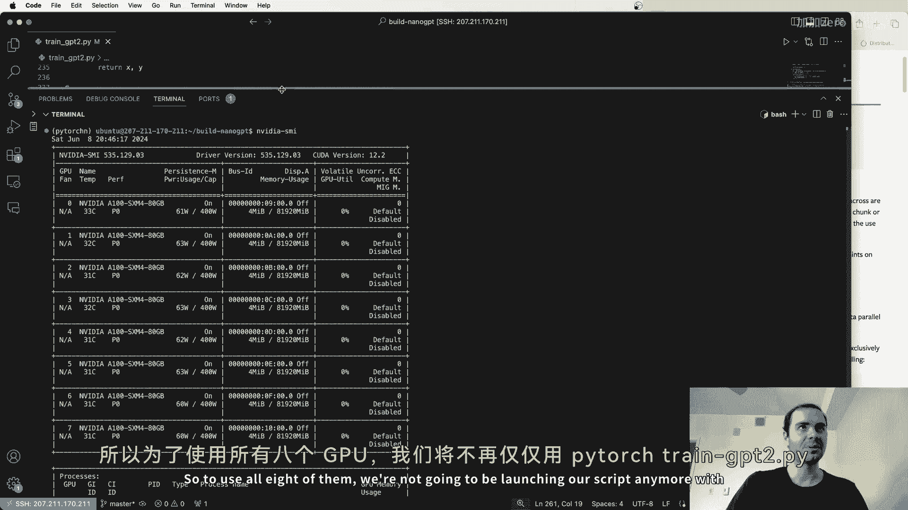

 We're going to be running it with a special command called Torchrun in PyTorch。

 We'll see them in a bit。 And Torchrun when it runs our Python script will actually make sure to run eight of them in parallel。

 And it creates these environmental variables where each of these processes can look up which basically which one of the processes it is。

 So for example Torchrun will set rank， local rank， in world size environmental variables。

 This is a bad way to detect whether DDP is running。 So if we're using Torchrun。

 if DDP is running then we have to make sure that good is available because I don't know that you can run this on CPU anymore or that that makes sense to do。

 This is some setup code here。 The important part is that there's a world size which for us will be eight。

 That's the total number of processes running。 There's a rank which is each process will basically run the exact same code at the exact same time roughly。

 But all the process， the only difference between these processes is that they all have a different DDP rank。

 So the GPU zero will have DDP rank of zero， GPU one will have rank of one， etc。

 So otherwise they're all running the exact same script。

 It's just that DDP rank will be a slightly different integer and that is the way for us to coordinate that they don't for example run on the same data。

 We want them to run on different parts of the data and so on。

 Now local rank is something that is only used in a multi node setting。

 We only have a single node with a GPU and so local rank is the rank of the GPU on a single node。

 So from zero to seven as an example。 But for us we're mostly going to be running a single box so the things we care about are rank and world size。

 This is eight and this will be whatever it is depending on the GPU that this particular instantiation of the script runs on。

 Now here we make sure that according to the local rank we are setting the device to be could a column and column indicates which GPU to use if there are more than one GPUs。

 So depending on the local rank of this process it's going to use just the appropriate GPU so there's no collisions on which GPU is being used by which process。

 And finally there's a Boolean variable that I like to create which is the DDP rank equals equals zero。

 So the master process is arbitrarily process number zero and it does a lot of the printing logging checkpointing etc。

 And the other processes are thought of mostly as a compute processes that are assisting。

 And so master process zero will have some additional work to do。

 All the other processes will will mostly just be doing forward backwards。

 And if we're not using DDP and none of these variables are set we revert back to single GPU training。

 So that means that we only have rank zero the world size is just one and we are the master process and we try to auto detect the device and this is world as normal。

 So so far all we've done is we've initialized DDP and in the case where we're running with Torchron which we'll see in a bit。

 There's going to be eight copies running in parallel each one of them will have a different rank。

 And now we have to make sure that everything happens correctly afterwards。

 So the tricky thing with running multiple processes is you always have to imagine that there's going to be eight processes running in parallel。

 So as you read the code now you have to imagine there's eight Python interpreters running down these lines of code。

 And the only difference between them is that they have a different DDP rank。

 So they all come here they all pick the exact same seed。

 They all make all of these calculations completely unaware of the other copies running roughly speaking。

 So they all make the exact same calculations and now we have to adjust these calculations to take into account that there's actually like a certain world size and certain ranks。

 So in particular these micro batches and sequence links these are all just per GPU。

 So now there's going to be non processes of them running in parallel。

 So we have to adjust this right because the gradicum steps now is going to be total by size divided by times T times DDP role size。

 Because each process will do B times T and there's this many of them。

 And so in addition to that we want to make sure that this fits nicely into total batch size。

 which for us it will be because 16 times 124 times 8 GPUs。 Is 131 K and so 524288。

 This means that our gradicum will be for with the current settings。 Right。

 So there's going to be 16 times 124 process in each GPU and then there's a GPU so we're going to be doing 131。

000 tokens in a single forward backward on the HPUs。

 So we want to make sure that this fits nicely so that we can derive a nice grading accumulation steps。

 And yeah let's just adjust the comments here。 TDP role size。 Okay。 So each GPU calculates this。

 Now this is where we start to get around to issues right so we are each process is going to come by a print and they're all going to print。

 So we're going to have eight copies of these prints。

 So one way to deal with this is exactly this master process variable that we have so if master process then guard this。

 And that's just so that we just print this a single time because otherwise all the processes when I've computed the exact same variables and there's no need to print this eight times。

 Before getting into the data loader and we're going to have to refactor it obviously。

 Maybe at this point is we should do some prints and just take it out for a spin and exit at this point so import sys。

 And sys。exit in print。 I am GPU DDP rank。 I am GPU DDP rank and print by。

 So now let's try to run this and just see how this works。

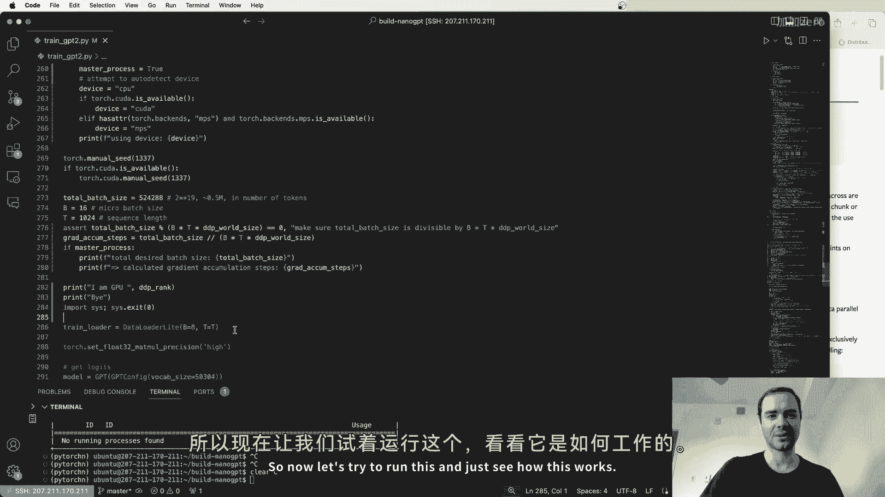

 So let's take it for a spin just so we see what it looks like。 So normally we used to launch Python。

 Change of D2。py like this。 Now we're going to run with tort run and this is what it looks like。

 So tort run standalone number processes for example is eight for us because we have a GPU and then change of D2。

py。 So this is what the command would look like and tort run again will run eight of these。

 So let's just see what happens。 So first it gets a little busy so there's a lot going on here。

 So first of all there's some warnings from distributed and I don't actually know that these mean anything。

 I think this is just like the code is setting up and the processes are coming online and we're seeing some preliminary failure to collect while the processes come up。

 I'm not 100% sure about that。 But we start to then get into actual prints。

 So all the processes went down and then the first print actually comes from process five just by chance。

 And then it printed so process five basically got here first。

 It said I'm process on GPU five by and then this these prints come from the master process。

 So process five just finished first for whatever reason it just depends on how the operating system scheduled the processes to run。

 Then GPU zero ended then GPU three and two。 And then probably process five or something like that has exited。

 And DDP really doesn't like that because we didn't properly dispose of the multi GPUs setting。

 And so process group has not been destroyed before we destruct。

 So it really doesn't like that and in actual application we would want to call the process group。

 So that we clean up DDP properly。 And so it doesn't like that too much。

 And then the last of the GPU is finished。 And that's it。

 So basically we can't guarantee when these processes are running it's totally arbitrary but they are running in parallel。

 We don't want that to be printing。 And next up let's erase this。

 Next up we want to make sure that when we create data a little light we need to now make it aware of this a multi process setting。

 Because we don't want all the processes to be loading the exact same data。

 We want every process to get its own chunk of data so that they're all working on different parts of the data set of course。

 So let's adjust that。 So one particularly simple and then the deep way to do this is we have to make sure that we pass in the rank and the size to the data loader。

 And then we come up here we see that we now take rank and processes and we save them。

 Now the current position will not be zero because what we want is we want to stride out all the processes。

 So one way to do this is we basically take cell that B times cell that T and then multiply it by the process rank。

 So process rank zero will start at zero。 But process rank one now starts at B times D。

 Process rank two is starts at two times B times D。 So that is the initialization。

 Now we still do this identically but now when we advance we don't advance by B times T。

 We advance by B times T times number of processes。

 So basically the total number of tokens that we're consuming is B times T times number processes and they all go off to a different rank。

 And the position has to advance by the entire chunk。

 And then here at B times T times cell that number of processes plus one would be to exceed number of tokens。

 Then we're going to loop。 And when we loop we want to of course loop in the exact same way。

 So we sort of like reset back。 So this is the simplest change that I can find for kind of a very simple distributed data loader like。

 And you can notice that if process rank is zero and then processes is one then the whole thing will be identical to what we had before。

 But now we can have actually multiple processes running and this should work fine。

 So that's the data loader。 Okay， so next up once they've all initialized the data loader。

 They come here and they all create a GPT model。 So we create eight GPT models on eight processes。

 But because the seeds are fixed here they all create the same identical model。

 They all move it to the device of their rank and they all compile the model。

 And because the models are identical there are eight identical compilations happening in parallel but that's okay。

 Now none of this changes because that is on a per step basis and we're currently working kind of within step because we need to just all the changes we're making are kind of like a within step changes。

 Now the important thing here is when we construct the model we actually have a bit of work to do here。

 Get logits is deprecated so create model。 We need to actually wrap the model into the distributed data parallel container。

 So this is how we wrap the model into the DDP container。

 And these are the docs for DDP and they're quite extensive。

 And there's a lot of caveats and a lot of things to be careful with because everything complexifies times 10 when multiple processes are involved。

 But roughly speaking this device ID I believe has to be passed in。

 Now unfortunately the docs for what device ID is is extremely unclear。

 So when you actually like come here。 This comment for what device ID is is roughly nonsensical。

 But I'm pretty sure it's supposed to be the DDP local rank so not the DDP rank the local rank。

 So this is what you pass in here。 This wraps the model and in particular what DDP does for you is in a forward pass it actually behaves identically。

 So my understanding of it is nothing should be changed in the forward pass。

 But in the backward pass as you are doing the backward pass in the simplest setting once the backward passes over on each independent GPU。

 Each independent GPU has the gradient for all the primers。

 And what DDP does for you is once the backward passes over it will call what's called all reduce。

 And it basically does an average across all the ranks of their gradients。

 And then it will deposit that average on every single rank。

 So every single single rank will end up with the average on it。

 And so basically that's the communication it just synchronizes and averages the gradients and that's what DDP offers you。

 Now DDP actually is a little bit more involved in that because as you are doing the backward pass through the layers in the transformer it actually can dispatch communications for the gradient while the backward passes still happening。

 So there's overlap of the communication of the gradients and the synchronization of them and the backward pass。

 And this is just more efficient and to do it that way。 So that's what DDP does for you。

 Forward is unchanged and backward is mostly unchanged and we're tacking on this average as we'll see in a bit。

 Okay， so now let's go to the optimization。 Nothing here changes。

 Let's go to the optimization here the inner loop and think through the synchronization of these gradients in the DDP。

 So basically by default what happens as I mentioned is when you do lost a backward here it will do the backward pass and then it will synchronize the gradients。

 The problem here is because of the gradient accumulation steps loop here。

 We don't actually want to do the synchronization after every single lost a backward because we are just depositing gradients and we're doing that serially。

 And we just want them adding up and we don't want to synchronize every single time。

 That would be extremely wasteful。 So basically we want to add them up and then on the very last step when microstep becomes gradicum steps-1 only at that last step that we want to actually do the overdoase to average of gradients。

 So to do that we come here and the official sanctioned way by the way is to do this no sync context manager。

 So PyTorch says this is a context manager to disable gradient synchronization across the DDP processes。

 So within this context gradients will be accumulated and basically when you do no sync there will be no communication。

 So they are telling us to do with DDP no sync do the gradient accumulation。

 accumulate grads and then they are asking us to do DDP again with another input and that backward。

 And I just really don't love this。 I just really don't like it。

 The fact that you have to copy paste your code here and use a context manager and it's just super ugly。

 So when I went to this source code here you can see that when you enter you simply toggle this variable。

 This required backward grad sync and this is being toggled around and changed。

 And this is the variable that basically if you step through it is being toggled to determine if the gradient is going to be synchronized。

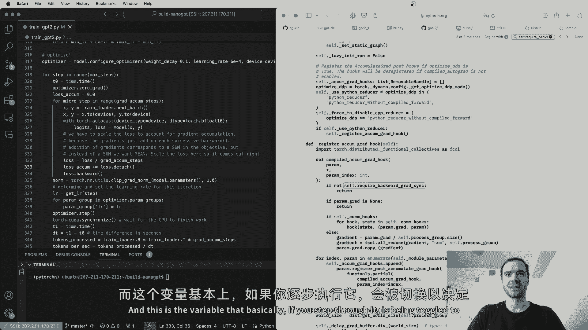

 So I actually just kind of like to use that directly。 So instead what I like to do is the following。

 Right here before the last backward if we are using DDP then then basically we only want to synchronize。

 We only want this variable to be true when it is the final iteration and all the other iterations inside the microsteps we want to be false。

 So I just toggle it like this。 So required backward grad sync should only turn on when the microstep is the last step。

 And so I'm toggling this variable directly and I hope that that impacts lost backward。

 And this is a naughty thing to do because they could probably change the DDP and this variable will go away。

 But for now I believe this works and it allows me to avoid the use of context managers and code duplication。

 I'm just toggling the variable and then lost backward will not synchronize most of the steps and it will synchronize the very last step。

 And so once this is over and we come out every single rank will suddenly magically have the average of all the gradients that are stored on all the ranks。

 So now we have to think through whether that is what we want and also if this suffices and whether how it works with the loss and what is lossacoom。

 So let's think through them。 And the problem I'm getting at is that we've averaged the gradients which is great but the lossacoom has not been impacted yet。

 And this is outside of the DDP container so that is not being averaged。

 And so here when we are printing lossacoom well presumably we're only going to be printing on the master process rank zero。

 And it's just going to be printing the losses that it saw on its process。

 And instead we wanted to print the loss over all the processes and the average of that loss because we did average of gradients so we want the average of loss as well。

 So simply here after this this is the code that I've used in the past。

 And instead of lossac we want lossacoom。 So if DDP again then this is a PyTorch distributed I imported what do I imported。

 Oh gosh。 So this file started to get out of control。

 So if so import torch distributed as this so this dot all reduce。

 And we're doing the average on lossacoom and so this lossacoom tensor exists on all the ranks when we call all reduce of average it creates the average of those numbers and it deposits that average on all the ranks。

 So all the ranks after this call will now contain lossacoom averaged up。

 And so when we print here on the master process the lossacoom is identical in all the other ranks as well。

 So here if master process we want to print like this。

 Okay and finally we have to be careful because we're not processing even more tokens so times DDP world size。

 That's number of tokens that we've processed up above。 And everything else should be fine。

 The only other thing to be careful with is as I mentioned you want to destroy the process group so that we are nice to nickel and it's not going to to to DDP and it's not going to complain to us when we exit here。

 So that should be it。 Let's try to take it for a spin。

 Okay so I launched the script and it should be printing here imminently。

 We're now training with 8 GPUs at the same time。 So the gradient accumulation steps is not 32 it is now divide 8 and it's just 4。

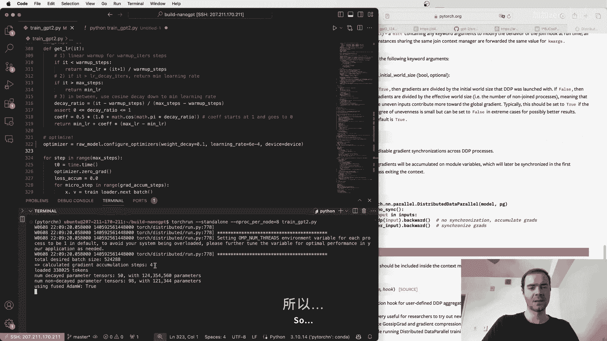

 So otherwise this is what the optimization looks like。

 And wow we're going really fast so we're processing 1。5 million tokens per second now。

 So these are some serious numbers。 And the tiny Shakespeare data set is so tiny that we're just doing like so many epochs over it most likely。

 But this is roughly what it looks like。 One thing that I had to fix by the way is that this was a model that configures optimizers which now doesn't work because model now is a DDP model。

 So instead this has to become raw model that configures optimizers where raw model is something I create here。

 So right after I wrapped a model into DDP I have to create the raw model which in the case of DDP is a model that module is where it stores the raw and a module of GPT2 as we have it。

 And that which contains the configure optimizers function that we want to call。

 So that's one thing that I had to fix。 Otherwise this seems to run。

 Now one thing you'll notice is that when you actually compare this run and the numbers in it to just running a single GPU。

 You'll notice that this is single GPU run with 32 radacum。 The numbers won't exactly match up。

 And it's kind of a boring reason for why that happens。

 The reason for that is that in the data loader we're basically just iterating through batches in a slightly different way。

 Because now we're looking for an entire page of data。 And if that page for all the GPUs。

 if that chunk exceeds the number of tokens we just loop。

 And so actually the single GPU and the GPU process will end up resetting in a slightly different manner。

 And so our batches are slightly different and so we get slightly different numbers。

 But one way to convince yourself that this is okay。

 It just makes the total batch size much smaller and the B and a T。

 And then so I think I used 4 times 1。24 times 8。 So I used 32。768 as a total batch size。

 And then so I made sure that the single GPU will do 8 great even simulation steps and then the multi GPU。

 And then you're reducing the boundary effects of the data loader and you'll see that the numbers match up。

 So one story short， we're now going really really fast。

 The optimization is mostly consistent with GPT 2 and 3 hybrid parameters。

 And we have outgrown our tiny Shakespeare file and we want to upgrade it。

 So let's move to next to that next。 So let's now take a look at what datasets were used by GPT 2 and GPT 3。

 So GPT 2 used this webtext dataset that was never released。

 There's an attempt at reproducing it called open webtext。

 So basically roughly speaking what they say here in the paper is that this created all outbound links from Reddit。

 And then with at least three karma。 And that was kind of like their starting point and they collected all the web pages and all the text in them。

 And so this was 45 million links and this ended up being 40 gigabytes of text。

 So that's roughly what GPT 2 says about its dataset。 So basically outbound links from Reddit。

 Now when we go over to GPT 3 there's a training dataset section and that's where they start to talk about common crawl。

 Which is a lot more used。 Actually I think you can GPT 2 talk about common crawl。

 But basically it's not a very high quality dataset all by itself because it's extremely noisy。

 This is a completely random subset of the internet and it's much worse than you think。

 So people go into great lengths to filter common crawl because there's good stuff in it。

 But most of it is just like ad spam， random tables and numbers and stock tickers。

 And it's just a total mess。 So that's why people like to train on these data mixtures that they curate and are careful with。

 So a large chunk of these data mixtures typically will be common crawl。

 Like for example 50% of the tokens will be common crawl。

 But then here in GPT 3 they're also using web text to from before。

 They're not using web text to get outbound but they're also adding for example books and they're anything Wikipedia。

 There's many other things you can decide to add。 Now this dataset for GPT 3 was also never released。

 So today some of the datasets that I'm familiar with that are quite good and will be representative of something along these lines。

 Our number one the red pajama dataset or more specifically for example the slim pajama subset of the red pajama dataset。

 Which is a clean and de-duplicated version of it。 And in the other sense again it's a bunch of common crawl。

 C4 which is also as far as I know more common crawl but processed differently。

 And then we have github， books， archive， Wikipedia， stack is change。

 These are the kinds of datasets that would go into these data mixtures。

 Now specifically the one that I like that came out recently is called fine web dataset。

 So this is an attempt to basically collect really high quality common crawl data and filter it in this case to 15 trilane tokens。

 And then in addition to that more recently hugging face released this fine web edu subset which is 1。

3 trillion of educational and 5。4 trillion of high educational content。

 So basically they're trying to filter common crawl to very high quality educational subsets。

 And this is the one that we will use。 There's a long webpage here on fine web and they go into a ton of detail about how they process the data which is really fascinating reading by the way。

 And I would definitely recommend if you're interested into data mixtures and so on and how data gets processed at these scales。

 I'll look at this page。 And more specifically we'll be working with the fine web edu I think。

 And it's basically educational content from the internet。

 They show that training on educational content in their metrics works really really well。

 And we're going to use this sample 10 billion tokens subsample of it because we're not going to be training on trillions of tokens。

 We're just going to train on 10 billion sample off the fine web edu because empirically in my previous few experiments。

 This actually suffices to really get close to GPT two performance and it's simple enough to work with。

 And so let's work with the sample 10 bt。 So our goal will be to download it process it and make sure that our data loader can work with it。

 So let's get to that。

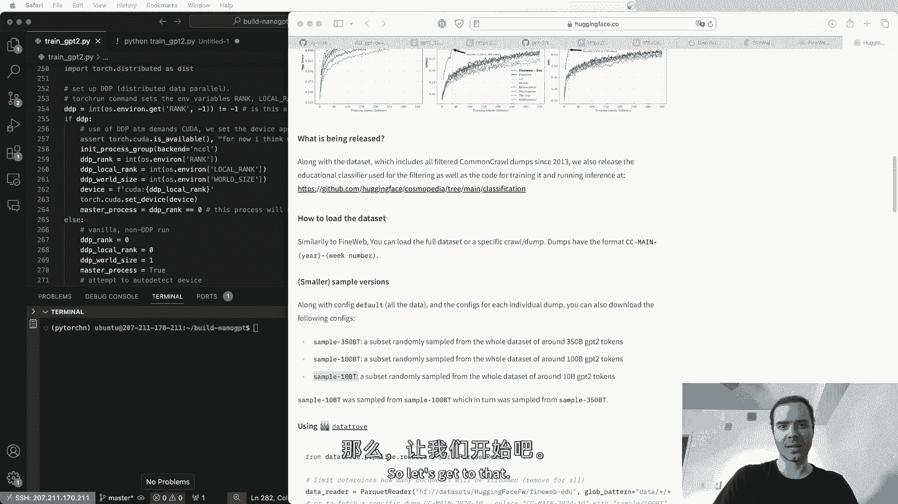

 Okay， so I introduced another file here that will basically download fine web edu from hugging face datasets。

 It will pre process and pre tokenize all of the data and it will save data shards to a folder on a local disk。

 And so while this is running， just wanted to briefly mention that you can kind of look through the dataset viewer here just to get a sense of what's in here。

 And it's kind of interesting。 I mean， it basically looks like it's working fairly well。

 Like it's talking about nuclear energy in France。 It's talking about Mexican America， some Mac， Pi。

 J's， etc。 So actually it seems like their filters are working pretty well。 The filters here。

 by the way， were applied automatically using llama 370 B， I believe。 And so basically。

 LLMs are judging which content is educational and that ends up making it through the filter。

 So that's pretty cool。 Now in terms of the script itself。

 I'm not going to go through the full script because it's not as interesting and not as LLM centric。

 But when you run this basically， number one， we're going to load the dataset。

 which this is all hugging face code， running this。

 And then we're going to need to pip install datasets。 So it's downloading the dataset。

 then it is tokenizing all of the documents inside this dataset。 Now when we tokenize the documents。

 you'll notice that to tokenize a single document， we first start the tokens with the end of text token。

 And this is a special token in the GPT2 tokenizer as you know， so 50。

256 is the ID of the end of text。 And this is what begins a document。

 even though it's called end of text。 But this is the first token that begins a document。

 Then we extend with all of the tokens of that document。 Then we create a NumPy array out of that。

 We make sure that all the tokens are between。 oh。

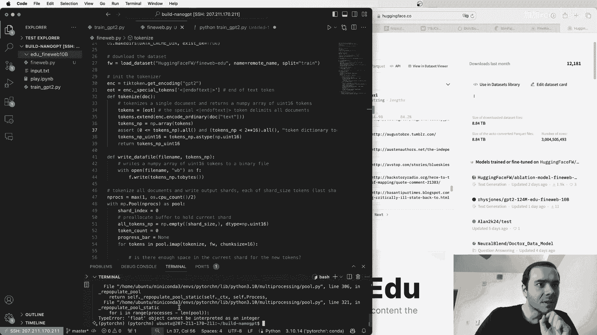

 Okay， let me debug this。 Okay， so apologies for that。

 It just had to do with me using a float division in Python and it must be integer division so that this is an int and everything is nice。

 Okay， but basically the tokenization here is relatively straightforward。 Returns tokens in MP。UN16。

 We're using UN。16 to save a little bit of space because 2 to the 16 minus 1 is 65，000。

 So the GPT2 max token ID is well below that。 And then here there's a bunch of multi-processing code and it's honestly not that exciting so I'm not going to step through it。

 But we're loading the dataset， we're tokenizing it and we're saving everything to shards and the shards are NumPy files。

 So just storing a NumPy array which is very very similar to Torx tensors。 And the first shard。

 0 0 0 is a validation shard and all the other shards are training shards。

 And as I mentioned they all have 100 million tokens in them exactly。

 And that just makes it easier to work with us to shard the files because if we just have a single massive file sometimes it can be hard to work with on the disk。

 And so sharding it is just kind of massive from that perspective。 And yeah。

 so we'll just let this run。 This will be probably 30ish minutes or so and then we're going to come back to actually train on this data。

 And we're going to be actually doing some legit pre-training in this case。 This is a good data set。

 we're doing lots of tokens per second。 We have HEPUs。

 the code is ready and so we're actually going to be doing a serious training run。

 So let's get back in a minute。 Okay， so we're back。 So if we LSE do find web。

 we see that there's now 100 shards in it。 And that makes sense because each shard is 100 million tokens。

 so 100 shards of that is 10 billion tokens in total。 Now swinging over to the main file。

 I made some adjustments to our data loader again。 And that's because we're not running with Shakespeare anymore。

 we want to use the find web shards。 And so you'll see some code here that additionally basically can load these shards。

 We load the un16 NumPy file， we convert it to a torch。long tensor。

 which is what a lot of the layers up top expect by default。

 And then here we're just enumerating all the shards。 I also added a split to data loader light。

 so we can load the split training， but also the split value， the zero split。

 And then we can load the shards and then here we also have not just a current position now。

 but also the current shard。 So we have a position inside a shard and then when we run out of tokens in a single shard。

 we first advanced the shard and loop if we need to。

 And then we get the tokens and readjust the position。

 So this data loader will now iterate all the shards as well。

 So I changed that and then the other thing that I did while the data is processing is our train loader now has split train of course。

 And down here I set up some numbers。 So we are doing two to the 19 tokens per step。

 And we want to do roughly 10 billion tokens because that's how many unique tokens we have。

 So if we did 10 billion tokens， then divide that by two to the 19， we see that this is 19，073 steps。

 So that's where that's from。 And then the GPT three paper says that they warm up the learning rate over 375 million tokens。

 So I came here and 375 e6 tokens divide two to the 19 is 715 steps。

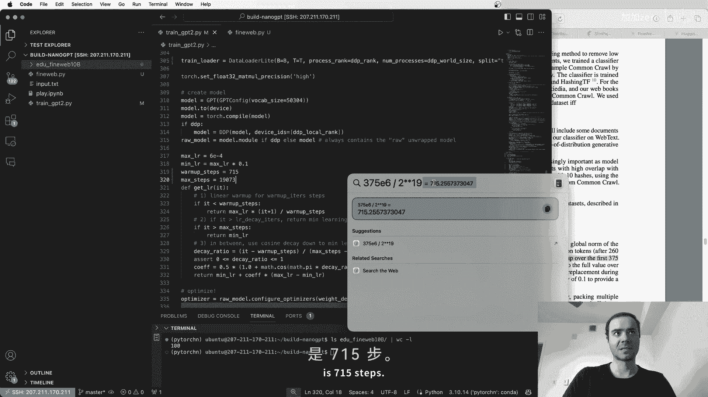

 So that's why warm up steps is set to 715。 So this will exactly match the warm up schedule that GPT three used。

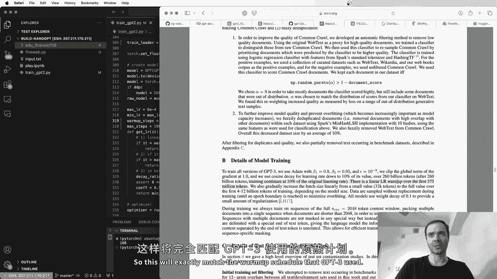

 And I think 715 by the way is very mild and this could be made significantly more aggressive。

 Probably even like a hundred is good enough。 But it's okay。

 Let's leave it for now so that we have the exact hyper parameters of GPT three。

 So I fix that and then that's pretty much it。 We can run。

 So we have our script here and we can launch。 And actually sorry。 Let me do one more thing。

 Excuse me。 For my GPU， I can actually fit more back size and I believe I can fit 64 on my GPU as a micro back size。

 So let me try that。 I could be misremembering。 But that means 64 times one 24 per GPU and then we have a GPU。

 So that means we would not even be doing great in accumulation of this fit because this just multiplies out to the full total back size。

 So no greener accumulation。 And that would run pretty quickly if that fits。

 I mean if this works then this is basically a seriously trading run。 We're not logging。

 We're not evaluating the validation split。 We're not running any evaluations yet。

 So it's not we haven't crossed our teas and dotted our eyes。

 But if we let this run for a while we're going to actually get a pretty good model。

 And the model that might even be on par with or better than GPT two on 24 M。 Okay。

 So it looks like everything is growing great。 We're processing 1。5 million tokens per second。

 Everything here looks good。 We're doing 330 milliseconds per iteration and we have to do a total of。

 Where are we printing out 1973？ So 19。073 times 0。33 is this many seconds。 This many minutes。

 So this will run for 1。7 hours。 So one and a half hour run like this。

 And we don't even have to use great accumulation which is nice。

 And you might not have that luxury in your GPU。 In that case just start decreasing the batch size until things fit。

 But keep it to nice numbers。 So that's pretty exciting。

 We're currently warming up the learning rate so you see that it's still very low。 1 in negative 4。

 So this will ramp up over the next few steps all the way to 6E negative 4 here。 Very cool。

 So now what I'd like to do is let's cross the T's and dot our I's。

 Let's evaluate on the validation split。 And let's try to figure out how we can run E valves。

 how we can do logging， how we can visualize our losses and all the good stuff。

 So let's get to that before we actually do the run。 Okay。

 So I adjusted the code so that we're evaluating on the validation split。

 So creating the validator just by passing in split equals val。

 That will basically create a data loader just for the validation shard。

 The other thing I did is in the data loader， I introduced a new function reset。

 which is called an init and it basically reset the data loader。

 And that is very useful because when we come to the main training now。

 So this is the code I've added。 And basically every 100th iteration， including the 0th iteration。

 we put the model into evaluation mode。 We reset the validator and then no gradients involved。

 We're going to basically accumulate the gradients over say 20 steps and then average it all up and print out the validation loss。

 And so that basically is the exact same logic as the training roughly。

 but there's no loss that backward。 It's only inference。 We're just measuring the loss。

 We're adding it up。 Everything else otherwise applies and is exactly as we've seen it before。

 And so this will print the validation loss every 100th iteration。

 including the very first iteration。 So that's nice。 That will tell us some amount。

 some a little bit about how much we're overfitting。 That said， like we have roughly infinity data。

 So we're mostly expecting our train and val loss to be about the same。

 But the other reason I'm kind of interested in this is because we can take the GPT 2。

 124M as OpenAI released it。 And we can initialize from it and we can basically see what kind of loss it achieves on the validation loss as well。

 And that gives us kind of an indication as to how much that model would generalize to 124M。

 But it's not a sorry to find web EDU validation split。 That said。

 it's not a super fair comparison to GPT 2 because it was trained on a very different data distribution。

 But it's still kind of like an interesting data point。 And in any case。

 you would always want to have a validation split in a training run like this。

 So that you can make sure that you are not overfitting。

 And this is especially a concern if we were to make more epochs in our training there。

 So for example， right now we're just doing a single epoch。

 But if we get to a point where we want to train on a 10 epochs or something like that。

 we would be really careful with maybe we are memorizing that data too much。

 If we have a big enough model and our validation split would be one way to tell whether that is happening。

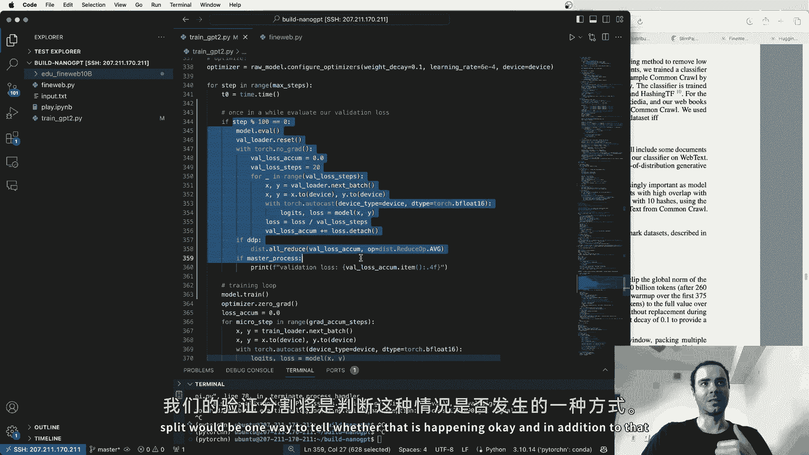

 Okay， and in addition to that， if you remember at the bottom of our script。

 we had all of this orphaned code for sampling from way back when。

 So I deleted that code and I moved it up to here。 So once in a while we simply evaluate validation。

 Once in a while we sample， we generate samples。 And then we do that only every 100 steps and we train on every single step。

 So that's how I have a structure right now。 And I've been running this for 1000 iterations。

 So here are some samples on the ration 1000。 Hello。

 I'm a language model and I'm not able to get more creative。

 From a language model and languages you're learning about here is or is the beginning of a computer。

 Okay， so this is all like pretty， it's still a garble。

 But we're only at a ration 1000 and we've only just barely reached the maximum learning rate。

 So this is still a learning。 We're about to get some more samples coming up in 100。 Okay。 Okay。

 this is， you know， the model is still a still a young baby。 Okay。

 so basically all of this sampling code that I've put here。

 everything should be familiar with to you and came from before。

 The only thing that I did is I created a generator object in PyTorch so that I have a direct control over the sampling of the random numbers。

 Because I don't want to impact the RNG state of the random number generator that is the global one used for training。

 I want this to be completely outside of the training loop。

 And so I'm using a special sampling RNG and then I make sure to seed it that every single rank has a different seed。

 And then I pass in here where we sort of consume random numbers in multinomial where the sampling happens。

 I make sure to pass in the generator object there。 Otherwise this is identical。

 Now the other thing is you'll notice that we're running a bit slower。

 That's because I actually had to disable torch。compile to get this to sample。

 And so we're running a bit slower。 So for some reason it works with no torch compile but when I torch compile my model I get a really scary error from PyTorch and I have no idea to resolve it right now。

 So probably by the time you see this code released or something like that， maybe it's fixed。

 But for now I'm just going to do in false。 And I'm going to bring back torch compile and you're not going to get samples。

 And I think I'll fix this later。 By the way I will be releasing all this code。

 And actually I've been very careful about making Git commits every time we add something。

 And so I'm going to release the entire repo that starts completely from scratch all the way to now and after this as well。

 And so everything should be exactly documented in the Git commit history。

 And so I think that would be nice。 So hopefully by the time you go to GitHub this is removed and it's working and I will fix the bug。

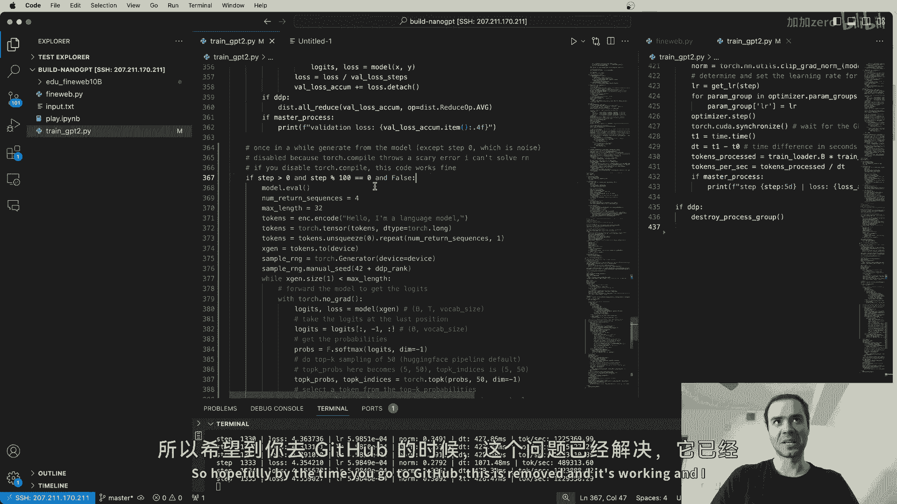

 Okay so I have the optimization running here。 And it's stepping and we're on step 6。

000 or so so we're about 30% through training。 Now while this is training I would like to introduce one evaluation that we're going to use to supplement the validation set。

 And that is the Hellesfag eval。 So Hellesfag comes from this paper back in 2019 so it's a 5 year old eval now。

 And the way Hellesfag works is that it's basically a sentence completion dataset。

 So it's a multiple choice。 For every one of these questions we have basically a shared context like a woman is outside with a bucket and a dog。

 The dog is running around trying to avoid bath。 She， A。

 raises the bucket off with soap and blow dry the dog's head。 B。

 uses a hose to keep it from getting soapy。 C， gets the dog wet and it runs away again。 Or D。

 gets into a bathtub with the dog。 And so basically the idea is that these multiple choices are constructed so that one of them is a natural continuation of the sentence and the others are not。

 And the others might not make sense like uses the hose to keep it from getting soapy。

 That makes no sense。 And so what happens is that models that are not trained very well are not able to tell these apart but models that have a lot of world knowledge and can tell which and can tell a lot about the world will be able to create these completions。

 And these sentences are sourced from activity net and from Wookieow。

 And at the bottom of the paper there's kind of like a cool chart of the kinds of domains in Wookieow。

 So there's a lot of sentences from computers and electronics and homes and garden。

 And it has kind of a broad coverage of the kinds of things you need to know about the world in order to find the most likely completion and the identity of that completion。

 One more thing that's kind of interesting about the last work is the way it was constructed is that the incorrect options are deliberately adversarially sourced。

 So they're not just random sentences。 They're actually sentences generated by language models。

 And they're generated in such a way that language models basically find them difficult but humans find them easy。

 And so they mentioned that humans have a 95% accuracy on this set but at the time the state of the art language models had only 48%。

 And so at the time this was a good benchmark。 Now you can read the details of this paper to learn more。

 The thing to point out though is that this is five years ago and since then what happened to Halaswag is that it's been totally just solved。

 And so now the language models here are 96%， so basically the last 4% is probably errors in the data set or the questions are really really hard。

 And so basically this data set is kind of crushed with respect to language models but back then the best of the language models was only at about 50%。

 But this is how far things got。 But still the reason people like Halaswag and it's not used by the way in GPT-2 but in GPT-3 there is Halaswag evil。

 And lots of people use Halaswag。 And so for GPT-3 we have results here that are cited。

 So we know what percent accuracy GPT-3 attains at all these different model check points for Halaswag evil。

 And the reason people like it is because Halaswag is a smooth evil and it is an evil that offers "early signal"。

 So "early signal" means that even small language models are going to start at the random chance of 25% but they're going to slowly improve and you're going to see 25。

 26， 27， etc。 And you can see slow improvement even when the models are very small and it's very early。

 So it's smooth， it has "early signal" and it's been around for a long time。

 So that's why people kind of like this evil。 Now the way that we're going to evaluate this is as follows。

 As I mentioned we have a shared context and this is kind of like a multiple choice task。

 But instead of giving the model a multiple choice question and asking it for A， B， C or D。

 we can't do that because these models when they are so small， as we are seeing here。

 the models can't actually do multiple choice。 They don't understand the concept of associating a label to one of the options of multiple choice。

 They don't understand that。 So we have to give it to them in a native form and the native form is a token completion。

 So here we do， we construct a batch of four rows and T tokens， whatever that T happens to be。

 Then the shared context that is basically the context for the four choices。

 the tokens of that are shared across all of the rows。

 And then we have the four options so we kind of like lay them out。

 And then only one of the options is correct， in this case label three， option three。

 And so this is the correct option and option one two for our concurrent。

 Now these options might be of different lengths。 So what we do is we sort of like take the longest length and that's the size of the batch B by T。

 And then some of these here are going to be padded dimensions。 So they're going to be unused。

 And so we need the tokens， we need the correct label and we need a mask that tells us which tokens are active。

 And the mask is then zero for these padded areas。 So that's how we construct these batches。

 And then in order to get the language model to predict a， b， c or d。

 the way this works is basically we're just going to look at the tokens。 They're probabilities。

 And we're going to pick the option that gets the lowest or the highest average probability for the token set for the tokens。

 Because that is the most likely completion according to the language model。

 So we're just going to look at the probabilities here and average them up across the options and pick the one with the highest probability roughly speaking。

 So this is how we're going to do hella swag。 And this is I believe also how GPT three did it。

 This is how GPT three did it as far as I know。 But you should note that some of the other emails or you might see hella swag may not do it this way。

 They may do it in a multiple choice format where you sort of give the context a single time and then the four completions。

 And so the model is able to see all the four options before it picks the best possible option。

 And that's actually an easier task for a model because you get to see the other options when you're picking your choice。

 But unfortunately models at our size can't do that。

 Only models at a bigger size are able to do that。 And so our models are actually slightly handicapped in this way that they are not going to see the other options。

 They're only going to see one option at a time and they just have to assign probabilities and the correct option has to win out in this metric。

 All right， so let's now implement this very briefly and incorporate it into our script。

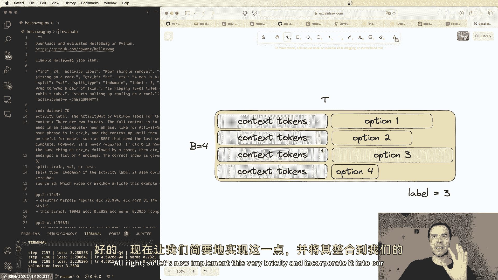

 Okay， so what I've done here is I've introduced a new file called hella swag。

py that you can take a look into。 And I'm not going to step through all of it because this is not exactly like deep code。

 Deep code。 It's kind of like a little bit tedious， honestly。

 because what's happening is I'm downloading hella spark from GitHub and I'm rendering all of its examples and there are a total of 10。

000 examples。 I am rendering them into this format。

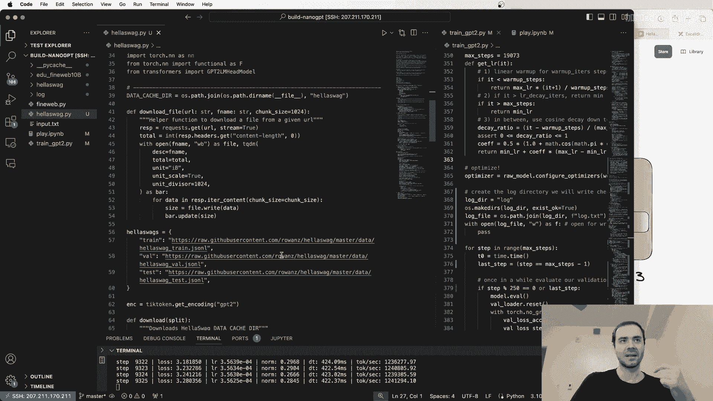

 And so here at the end of this render example function， you can see that I'm returning the tokens。

 The tokens of this four by T array of tokens， the mask。

 which tells us which parts are the options and everything else is zero。

 And the label that is the correct label。 And so that allows us to then iterate the examples and render them。

 And I have an evaluate function here， which can load a GPT to from a face and it runs the eval here。

 And basically just calculates just as I described。

 it predicts the option that has the lowest or the highest probability。

 And the way to do that actually is we can basically evaluate the cross entropy loss。

 So we're basically valuing the loss of predicting the next token in the sequence。

 And then we're looking at the row that has the lowest average loss。

 And that's the option that we pick as the prediction。

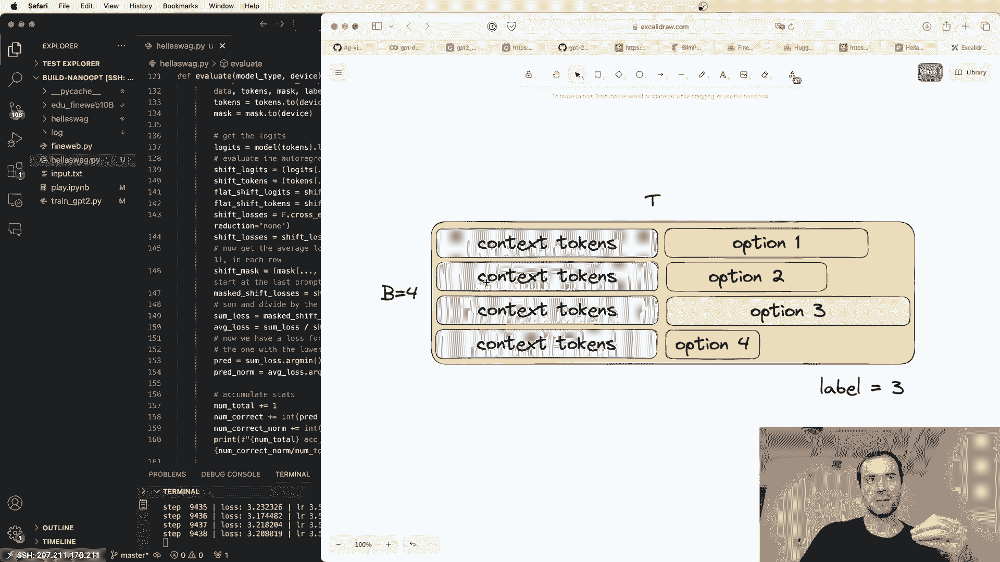

 And then we do some stats and prints and stuff like that。

 So that is a way to evaluate the loss of now。 If you go up here， I'm showing that for GPT to 124M。

 if you run this script， you're going to see that the loss of gets 29。55%。

 So that's the performance we get here。 Now remember that random chances 25% so we haven't gone too far。

 And GPT to XL， which is the biggest V GPT to gets all the way up to 49% roughly。

 So these are pretty low values considering that today's state of the art is more like 95%。

 So these are definitely older models by now。 And then there's one more thing called a Luther harness。

 which is a very common piece of infrastructure for running emails for language models。

 And they get slightly different numbers。 And I'm not 100% sure what the discrepancy is for these。

 It could be that they actually do the multiple choice instead of just the completions。

 And that could be the discrepancy。 But I'm not 100% sure about that。 I'd have to take a look。

 But for now， our script reports 29。55。 And so that is the number that we'd like to beat if we were training a GP to 124M from scratch and ourselves。

 So now I'm going to go into actually incorporating this eval into our main training script。

 And basically because we want to evaluate it in a periodic manner so that we can track Haloswag and how it evolves over time。

 And see when and if we cross this 29。55 sort of region。

 So let's now walk through some of the changes to train GPT to that pipe。

 The first thing I did here is actually made use compile optional kind of and I disabled it by default。

 And the problem with that is the problem with compile is that unfortunately it does make our code faster。

 But it actually breaks the evaluation code and the sampling code。

 It gives me a very gnarly message and I don't know why。

 So hopefully by the time you get to the code base when I put it up on GitHub。

 we're going to fix that by then。 But for now I'm running without torch compile which is why you see this be a bit slower。

 So we're running without torch compile。 I also created a log directory log where we can place our log。

txt which will record the train loss， validation loss and the Haloswag accuracies。

 So a very simple text file and we're going to open for writing so that it sort of starts empty and then we're going to append to it。

 I created a simple variable that helps tell us when we have a last step。

 And then basically periodically inside this loop every 250th iteration or at the last step we're going to evaluate the validation loss。

 And then every 250th iteration we are going to evaluate Haloswag but only if we are not using compile because compile breaks it。

 So I'm going to come back to this code for evaluating Haloswag in a second。

 And then every 250th iteration as well we're also going to sample from the model。

 And so you should recognize this as our ancient code from way back when we started the video and we're just sampling from the model。

 And then finally here these are if we're not after we validate sample and evaluate Haloswag we actually do a training step here。

 And so this is one step of training and you should be pretty familiar with all of what this does。

 And at the end here once we get our training loss we write it to the file。

 So the only thing that changed that I really added is this entire section for Haloswag eval。

 And the way this works is I'm trying to get all the GPUs to collaborate on the Haloswag。

 And so we're iterating all the examples and then each process only picks the examples that assign to it。

 So we sort of take i and mod it by the world size and we have to make it equal to rank otherwise we continue。

 And then we render an example， put it on a GPU， we get the logits。

 then I created a helper function that helps us basically predict the option with the lowest loss。

 So this comes here the prediction and then if it's correct we sort of keep count。

 And then if multiple processes were collaborating on all this then we need to synchronize their stats。

 And so the way one way to do that is to package up our statistics here into tensors。

 which we can then call this。alverduson and sum。 And then here we sort of unwrap them from tensors so that we just have ints。

 And then here the master process will print and log the Haloswag accuracy。

 So that's kind of it and that's what I'm running right here。

 So you see this optimization here and we just had a generation。 And this is step 10。

000 out of about 20，000 right so we are halfway done。

 And these are kinds of samples that we are getting at this stage so let's take a look。

 Hello I'm a language model so I'd like to use it to generate some kinds of output。

 I'm a language model and I'm a developer for a lot of companies。 I'm a language model。

 Let's see if I can find any fun one。 I don't know you can go through this yourself but certainly the predictions are getting less and less random。

 It seems like the model is a little bit more self-aware and using language that is a bit more specific to it being a language model。

 Hello I'm a language model and like how the language is used to communicate I'm a language model and are going to be speaking English and German。

 Okay I don't know。 So let's just wait until this optimization finishes and we'll see what kind of samples we get。

 And we're also going to look at the train， the val and the hellosware accuracy and see how we're doing with respect to GPT2。

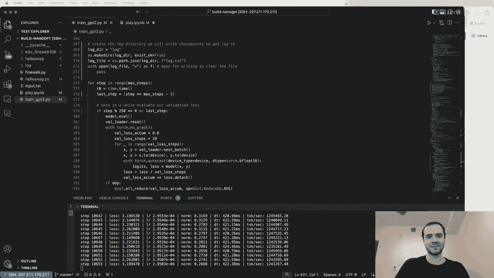

 Okay good morning。 So focusing for a moment on the Jupyter Notebook here on the right I created a new cell that basically allows us to visualize the train。

 val and hella。 And the helloscore。 And you can step through this it basically like parses the log file that we are writing。

 And a lot of this is just like boring matplotlib code but basically this is what our optimization looks like。

 So we ran for 19，073 steps which is roughly 10 billion tokens which is whoops oh my gosh。

 Which is one epoch of the sample 10b of find what BDO。

 On the left we have the loss and in the blue we have the training loss。

 In orange we have the validation loss and red as a horizontal line。 We have the opening of GPT2。

 124M model checkpoint when it's just evaluated on the validation set of this fine web BDO。

 So you can see that we are surpassing this orange is below the red so we're surpassing the validation set of this data set。

 And like I mentioned the data set distribution is very different from what GPT2 trained on。

 So this is not exactly a fair comparison but it's a good cross check to look at。

 Now we would ideally like something that is withheld and comparable and somewhat standard。

 And so for us that is helloscoreg。 And so on here we see the helloscoreg progress we made from 25% all the way here。

 In red we see the opening of GPT2， 124M model in red。

 So it achieves this helloscoreg here and the GPT3 model 124M which was trained on 300 billion tokens achieves green。

 So that's over here。 So you see that we basically surpass the GPT2 120 program model right here which is really nice。

 Now interestingly we were able to do so with only training on 10 billion tokens while GPT2 was trained on 100 billion tokens。

 So for some reason we were able to get away with significantly fewer tokens for training。

 There are many possibilities to us to why we could match or surpass this accuracy with only 10 billion training。

 So number one it could be that opening of GPT2 was trained on a much wider data distribution。

 So in particular fine web EDU is all English it's not multilingual and there's not that much math in code。

 And so math and code and multilingual could have been stealing capacity from the original GPT2 model and basically that could be partially the reason why this is not working out。

 There's many other reasons。 So for example the helloscoreg eval is fairly old maybe five years or so。

 It is possible that aspects of helloscoreg in some way or even identically have made it into the training set of fine web。

 We don't know for sure but if that was the case then we are basically looking at the training curve instead of the validation curve。

 So long story short this is not a perfect eval and there's some caveats here but at least we have some confidence that we're not doing something completely wrong。

 And it's probably the case that when people try to create these data sets they try to make sure that test sets that are very common are not part of the training set。

 For example when hugging face created the fine web EDU they use helloswag as an eval so I would hope that they make sure that they deduplicate and that there's no helloswag in the training set but we can't be sure。

 The other thing I wanted to address briefly is look at this LOSCER this looks really really wrong here。

 I don't actually know 100% what this is and I suspect it's because the 10 billion sample of fine web EDU was not properly shuffled。

 And there's some issue here with the data that I don't fully understand yet and there's some weird periodicity to it。

 And because we are in a very lazy way sort of serializing all the tokens and just iterating on them from scratch without doing any permutations or any random sampling ourselves。

 I think we're inheriting some of the ordering that they have in the dataset。

 So this is not ideal but hopefully by the time you get to this repo some of these things by the way will hopefully be fixed。

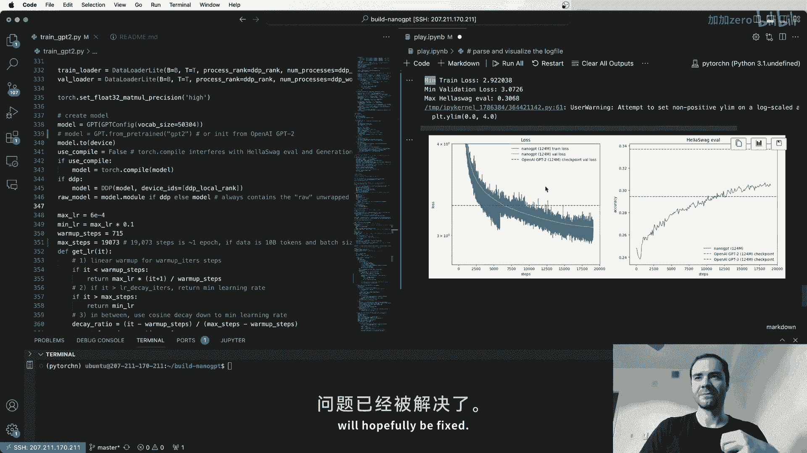

 And I will release this build nano GPT repo and right now it looks a little ugly and preliminary so hopefully by the time you get here it's nicer。

 But down here I'm going to show Arata and I'm going to talk about some of the things that happened after the video and I expect that we will have fixed the small issue。

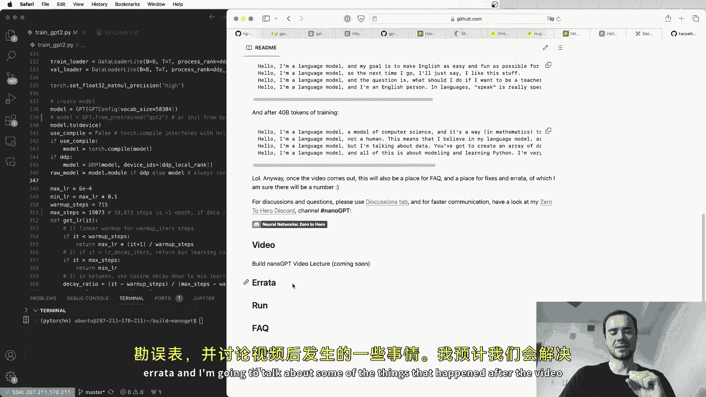

 But for now basically this shows that our training is not completely wrong and it shows that we're able to surpass the accuracy with only 10x the token budget。

 And possibly it could be also that the dataset might have improved。

 So the original GPT-2 dataset was webtext。 It's possible that not a lot of care and attention wanted to the dataset。

 This was very early in LMS。 Whereas now there's a lot more scrutiny on good practices around deduplication。

 filtering， quality filtering and so on。 And it's possible that the data set were training on just a higher quality per token and that could be giving us a boost as well。

 So a number of caveats to think about but for now we're pretty happy with this。 And yeah。

 now the next thing I was interested in is as you see it's a morning now so there was an overnight and I wanted to basically see how far I could push the result。

 So to do an overnight run I basically did instead of one epoch which took roughly two hours。

 I just did it times four so that that would take eight hours while I was sleeping。

 And so we did four epochs or roughly 40 billion tokens of training and I was trying to see how far we could get。

 And so this was the only change in I rerun the script and when I point and read the log file at the 40B this is what the curve looked like。

 Okay， so to narrate this number one we are seeing this issue here with the periodicity through the different epochs and something really weird with the FindWeb EDU dataset and that is to be determined。

 But otherwise we are seeing that the heliswag actually went up by a lot and we almost made it to the GPT-3-124M accuracy up here。

 But not quite so it's too bad that I didn't sleep slightly longer and I think if this was a five epoch run we may have gotten here。

 Now one thing to point out is that if you're doing multi epoch runs we're not actually being very careful in our data loader and we're not。

 This data loader goes through the data in exactly the same format and exactly the same order and this is kind of suboptimal and you would want to look into extensions where you actually permute the data randomly。

 And then you permute the documents around in every single shard on every single new epoch and potentially even permute the shards。

 And that would go a long way into decreasing the pre-allicity and it's also better for the optimization so that you're not seeing things in the identical format and you're introducing some of the randomness in how the documents follow each other。

 Because you have to remember that in every single row these documents follow each other and then there's the end of text open and then the next document。

 So the documents are currently glued together in the exact same identical manner but we actually want to break break up the documents and shuffle them around because the order of the documents shouldn't matter and they shouldn't。

 Basically we want to break up that dependence because it's kind of a spurious correlation and so our data litter is not currently doing that and that's one improvement you could think of making。

 The other thing to point out is we're almost matching GPT-3 accuracy with only 40 billion tokens GPT-3 trained on 300 billion tokens。

 So again we're seeing about a 10x improvement here with respect to learning efficiency。

 The other thing I wanted to and I don't actually know exactly what to attribute this to other than some of the things that I already mentioned previously for the previous one。

 The other thing I wanted to briefly mention is the max LR here。

 I saw some people already play with this a little bit in a previous related repository and it turns out that you can actually almost like 3X this so it's possible that the maximum learning rate can be a lot higher。

 And for some reason the GPT-3 hyperparameters that we are inheriting are actually extremely conservative and you can actually get away with higher learning rate and it would train faster。

 So a lot of these hyperparameters are quite tunable and feel free to play with them and they're probably not set precisely correctly and it's possible that you can get away with doing this basically。

 And if you wanted to exactly be faithful to GPT-3 you would also want to make the following difference。

 You want to come here and the sequence length of GPT-3 is 2X。 It's 2048 instead of 1024。

 So you would come here changes to 2048 for T and then if you want the exact same number of tokens half a million per iteration or per step you want to then decrease this to 32。

 So they still multiply to half an L。 So that would give your model sequence length equal to that GPT-3 and in that case basically the models would be roughly identical as far as I'm aware because again GPT-2 and GPT-3 are very very similar models。

 Now we can also look at some of the samples here from the model that was trained overnight。

 So this is the optimization and you see that here we stepped all the way to 7600 to 90 also or so and these are the Hellersmag which was 33。

24 and these are some of the samples from the model。

 And you can see that if you read through this and pause the video briefly you can see that there are a lot more coherent。

 So and they're actually addressing the fact that it's a language model almost。

 So hello I'm a language model and I try to be as accurate as possible。

 I'm a language model not a programming language。 I know how to communicate。 I use Python。

 I don't know if you pause this and look at it and then compare it to the one to the model that was only trained for 10 billion。

 You will see that these are a lot more coherent and you can play with this yourself。

 One more thing I added to the code by the way is this chunk of code here。

 So basically right after we evaluate the validation loss if we are the master process in addition to logging the validation loss every 5000 steps were also going to save the checkpoint。

 Which is really just the state dictionary of the model。

 And so checkpointing is nice just because you can save the model and later you can use it in some way。

 If you wanted to resume the optimization then in addition to saving the model we have to also save the optimizer state dict。

 Because remember that the optimizer has a few additional buffers because of Adam。

 So it's got the M and B and you need to also resume the optimizer properly。

 So you need to be careful with the RNG seeds， random number generators and so on。

 So if you wanted to exactly be able to resume optimization you have to think through the state of the training process。

 But if you just want to save the model this is how you would do it。

 And one nice reason why you might want to do this is because you may want to evaluate the model a lot more carefully。

 So here we are only kind of like winging the L。S。Y。G。 value。

 But you may want to use something nicer like for example the Luther evaluation hardness。

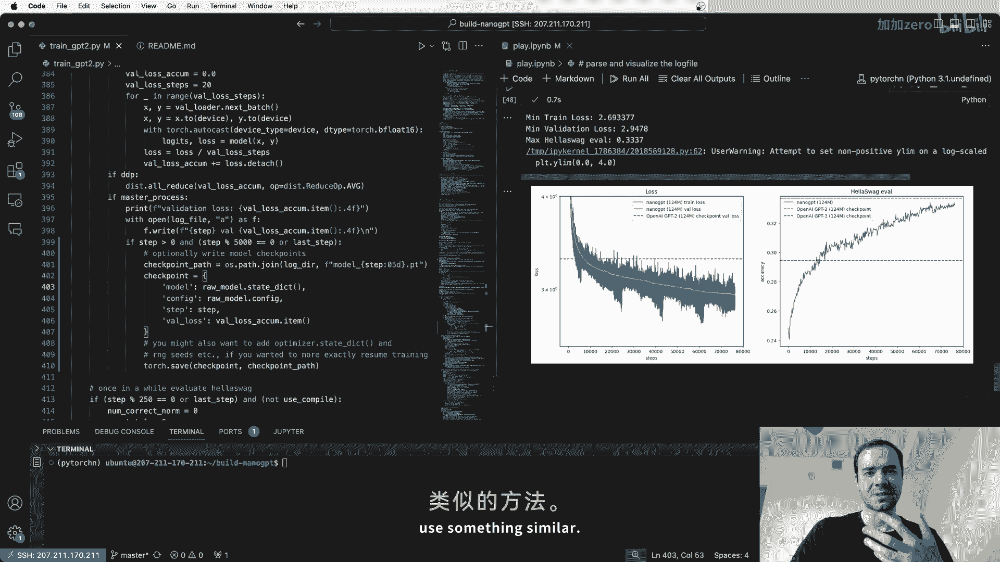

 So this is a way to also evaluate language models。

 And so it's possible that you may want to use a different infrastructure to more thoroughly evaluate the models on different evaluations。

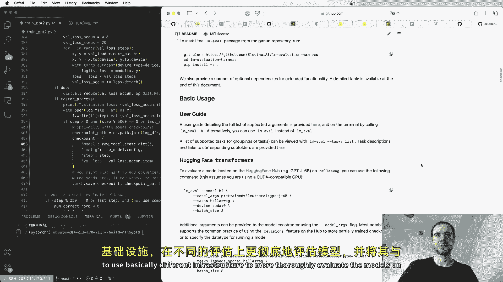

 and compare it to the opening RGP-T2 model on many other tasks like math code or different languages and so on。

 So this is a nice functionality to have as well。

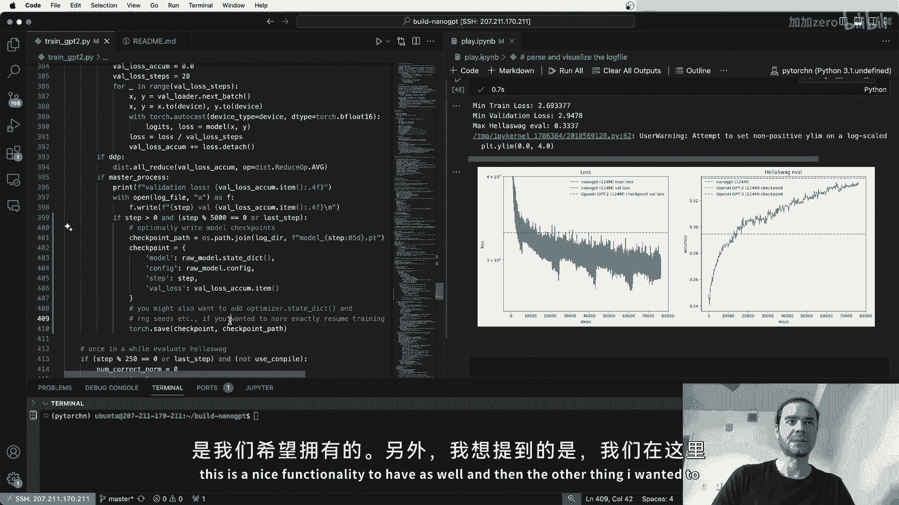

 And then the other thing I wanted to mention is that everything we've built here this is only the pre-training step。

 So the GPT here is a dreams document。 It just predicts the next open。

 You can't talk to it like you can talk to chat GPT。

 If you wanted to talk to the model we have to fine tune it into the chat format。

 And it's not actually like that complicated。 If you're looking at supervised fine tuning or SFT。

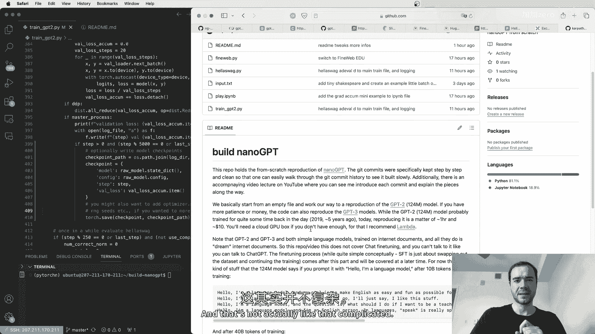

 Really what that means is we're just swapping out a dataset into a dataset that is a lot more conversational。

 and there's a user-assistant user-assistant kind of structure。

 And we just fine tune on it and then we basically fill in the user tokens and we sample the assistant tokens。

 It's not a lot more deeper than that but basically we swap out the dataset and continue training。

 But for now we're going to stop at pre-training。

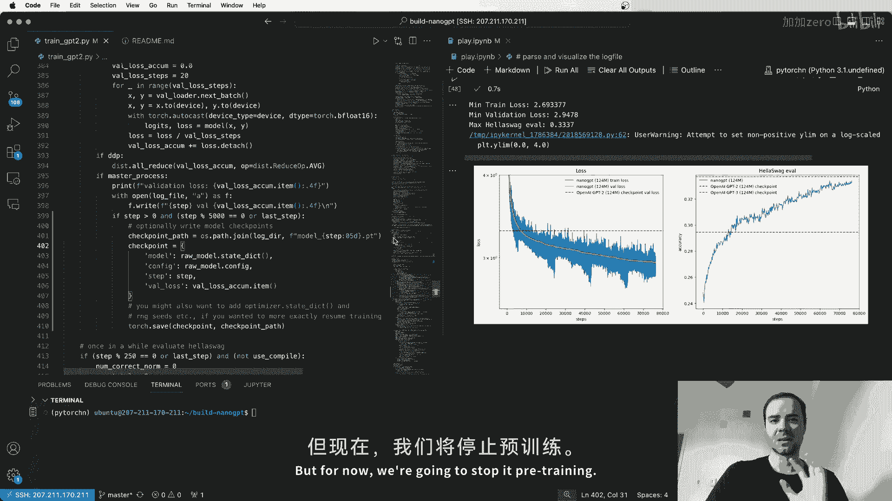

 One more thing that I wanted to briefly show you is that of course what we built up today was building towards NANDA GPT。

 which is this repository from earlier。 But also there's actually another NANDA GPT implementation and it's hiding in a more recent project that I've been working on called LLAN。

C。 And LLAN。C is a pure C CUDA implementation of GPT2 or GPT3 training。

 And it just directly uses CUDA and is written as C CUDA。

 Now the NANDA GPT here acts as reference code in PyTorch to the C implementation。

 So we're trying to exactly match up the two but we're hoping that the C CUDA is faster。

 And of course currently that seems to be the case because it is a direct optimized implementation。

 So traingpt2。py in LLAN。C is basically the NANDA GPT。

 And when you scroll through this file you'll find a lot of things that very much look like things that we've built up in this lecture。

 And then when you look at traingpt2。cu this is the C CUDA implementation。

 So there's a lot of MPI called GPU CUDA CC++ and you have to be familiar with that。

 But when this is built up we can actually run the two set by side。

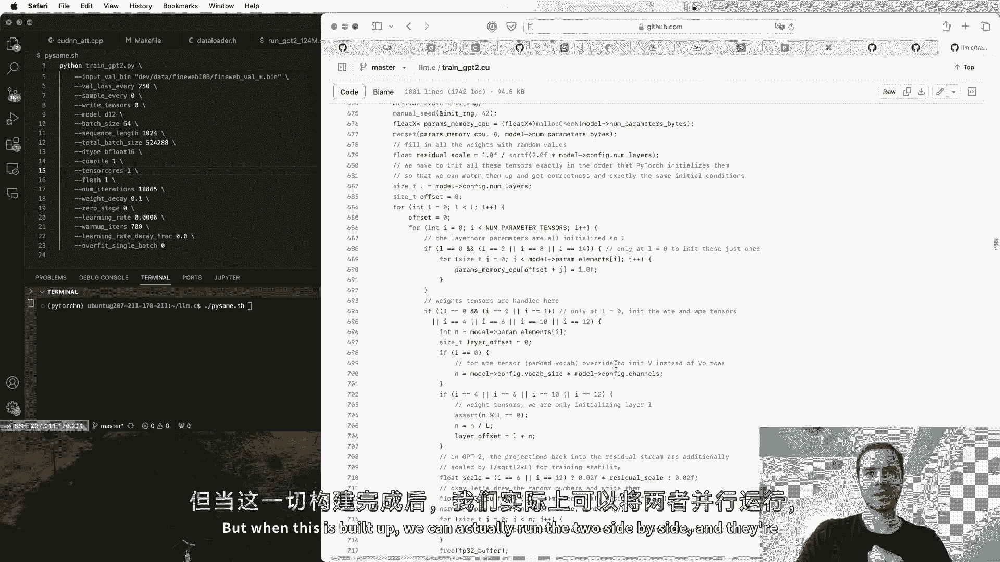

 And they're going to produce the exact same results but LLAN。C actually runs faster。

 So let's see that。 So on the left I have PyTorch， NANDA GPT looking thing。

 On the right I have the LLAN C call and here I'm going to launch the two。

 Both of these are going to be running on a single GPU。 And here I'm putting the LLAN。

C on GPU1 and this one will grab GPU0 by default。 And then we can see here that LLAN。

C compiled and then allocate space and it's stepping。

 So basically meanwhile PyTorch is still compiling because Torp compile is a bit slower here than the LLAN。

C and BCCC C CUDA compile。 And so this program has already started running and we're still waiting here for Torp compile。

 Now of course this is a very specific implementation to GPT 2 and 3。

 PyTorch is a very general neural network framework so they're not exactly comparable。

 But if you're only interested in training GPT 2 and 3 LLAN。C is very fast。 It takes less space。

 it's faster to start and it's faster per step。

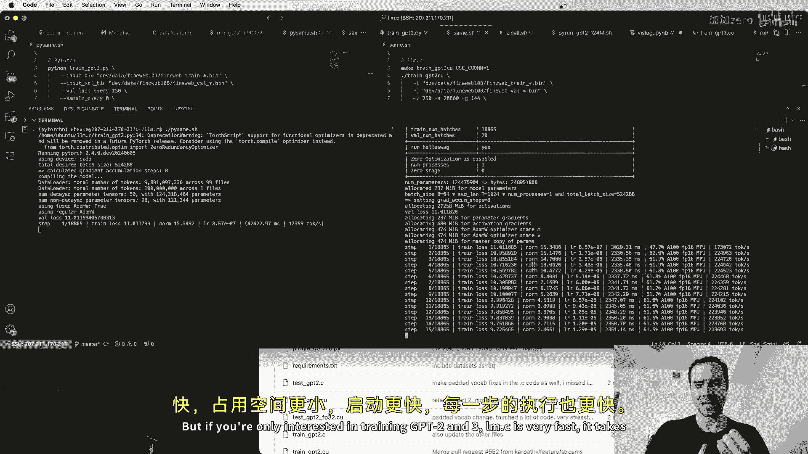

 And so PyTorch started stepping here and as you can see we're running at about 223。

000 tokens per second here and about 185，000 tokens per second here。

 So quite a bit slower but I don't have full confidence that I exactly squeezed out all the juice from the PyTorch implementation。

 But the important thing here is notice that if I line up the steps you will see that the losses and the norms that are printed between these two are identical。

 So on the left we have the PyTorch and on the right this C CUDA implementation and they're the same except this one runs faster。

 So that's kind of， I want to show you also briefly LLAN。

C and this is a parallel implementation and it's also something that you may want to play with or look at and it's kind of interesting。

 Okay so at this point I should probably start wrapping up the video because I think it's getting way longer than anticipated。

 But we did cover a lot of ground and we built everything from scratch。

 So as a brief summary we were looking at the GPT2 and GPT3 papers。

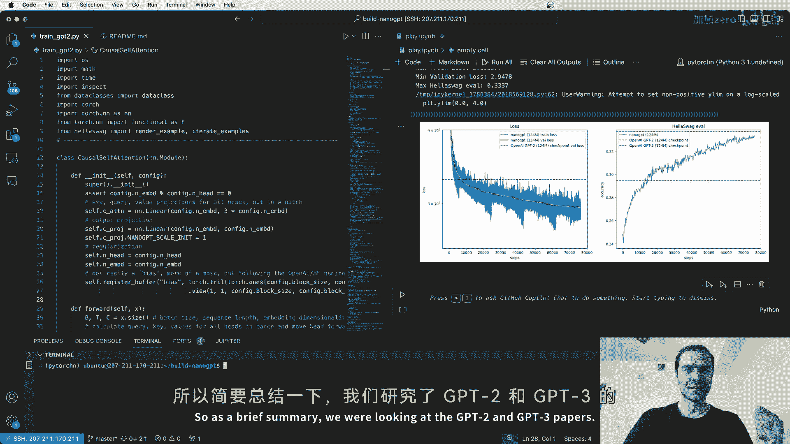

 We were looking at how you set up these training runs and all the considerations involved。

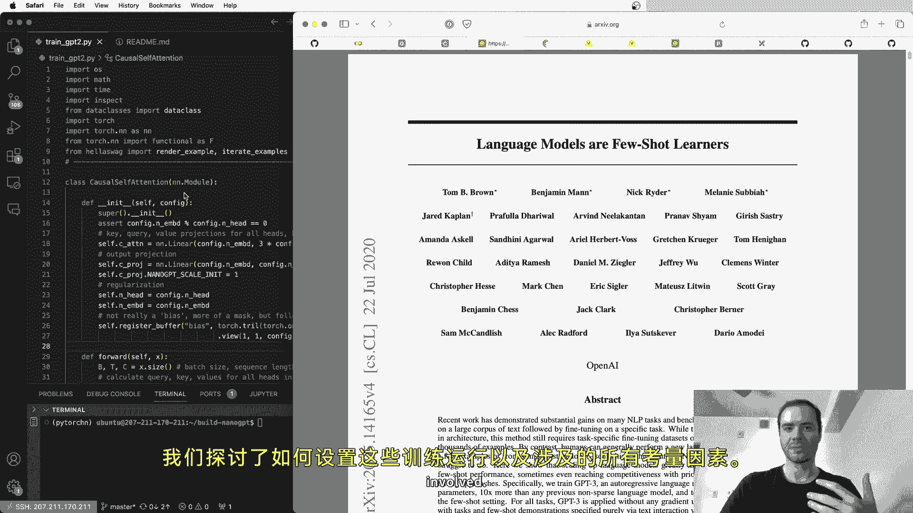

 We wrote everything from scratch and then we saw that over the duration of either a two hour training run or an overnight run。

 We can actually match the 124 million parameter checkpoints of GPT2 and GPT3 to a very large extent。

 In principle the code that we wrote would be able to train even bigger models if you have the patients or the computing resources。

 And so you could potentially think about training some of the bigger checkpoints as well。

 There are a few remaining issues to address。 What's happening with the loss here which I suspect has to do with the final web EDU data sampling。

 Why can't we turn on Torch Compile？ It currently breaks generation and hella swag。

 What's up with that？ In the data loader we should probably be permuting our data when we reach epoch boundaries。

 So there's a few more issues like that and I expect to be documenting some of those over time in the build manage GPT repository here。

 Which I'm going to be releasing with this video。 If you have any questions or like to talk about anything that we covered please go to the discussions tab so we can talk here。

 Or please go to issues or pull requests depending on what you'd like to contribute。

 Or also have a look at the zero to hero discord and I'm going to be hanging out here on the manage GPT。

 Otherwise for now I'm pretty happy about where we got and I hope you enjoyed the video and I will see you later。

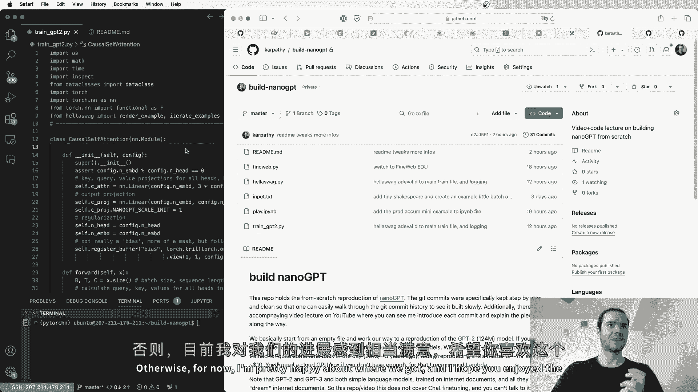

 I will see you later。

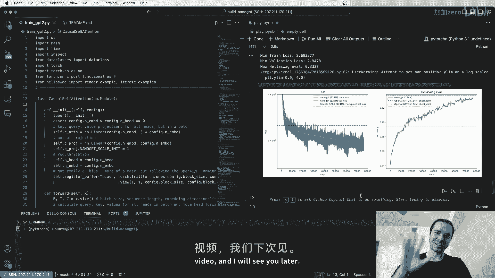