# 第二十三章：将线积分减少为普通积分及相关减少

## 介绍

尽管在路径 P 上进行线积分的最容易评估当被积函数可以表达为梯度并且积分变成 P 端点处函数值的差异时，但我们在这里考虑将线积分减少为普通积分的过程。我们还描述了如何将表面通量积分转换为平面区域上的二维积分。

## 主题

23.1 将线积分化为普通积分

23.2 例子

23.3 实用评论

23.4 多重积分和面积积分

## 23.1 将线积分化为普通积分

我们寻求沿路径 P 的点积**w**(x, y, z)**dl**的积分。

要做到这一点，我们首先需要描述路径；（假设我们无法将**w**识别为梯度。）

一般来说，有三种定义路径的方式；最有利于计算积分的是**参数表示形式**。

或者路径可以**定性地**定义（例如：“它是以点(a, b, c)为中心的圆，半径为 d”），或者可以通过**方程（二维情况）**或**两个方程（三维情况）**定义。

当路径定性定义时，您必须自己提供参数表示形式。 

通常我们将注意力集中在相对简单的路径上，这些路径由圆弧、直线或圆锥曲线（椭圆、抛物线或双曲线）的部分组成，并且有这些的标准参数表示形式。

当路径由两个方程定义时，您可以尝试将这些方程解为变量 x、y 和 z（或者可能是球坐标的变量等）中的两个，以第三个作为参数。这个任务的难度取决于方程的性质，我们不会在这里进一步讨论它。

我们在这里假设我们从一个**参数表示形式**开始。这意味着我们有一个参数 s（通常代表时间 t 或者可以经常选择为变量 x、y 或 z 之一）和公式，给出 x、y 和 z 作为 P 上 s 的函数。这可以写为 (s)，或者为(x(s), y(s), z(s))，如 x(s)**i** + y(s)**j** + z(s)**k**，或者我们可以给出这三个分量的表达式。

一个例子是螺旋线

x (s) = cos s, y(s) = sin s, z(s) = s

在当前符号中，s 是一个任意参数，**不是**路径上的弧长。

曲线 P 也将有一个开始参数值 s[0]和一个结束参数值 s[1]。

矢量**w**可以假定为关于 x、y 和 z 的函数，我们可以通过使用 x、y 和 z 的定义作为它的函数来将其转换为关于 s 的函数。

我们的计划是将**w**(x, y, z)**dl**简化为从 s[0]到 s[1]的某个 ds 的积分，我们这样做如下

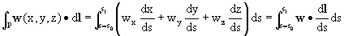

现在**w**(x, y, z)**dl**可以写成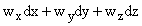，我们可以用类似的替换来替换 dx 为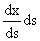，y 和 z 也做类似的替换。这里的中间表达式是一个普通的积分，也是这里所寻求的简化。

**那么我们如何构建它呢？**

我们执行以下过程：

**步骤 1：用 s 的形式表示 x，y 和 z。也就是说，写出 P 的参数表示。**

**步骤 2：分别对 x，y 和 z 关于参数 s 进行微分。**

**步骤 3：将得到的向量与 w(x(s), y(x), z(s))的点积。**

**步骤 4：对 s 从 s[0]积分到 s[1]得到的函数进行积分。**

## 23.2 例子

**例子 1**

我们首先计算我们的螺旋线的弧长从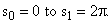开始

P 的参数方程为 x = cos s，y = sin s，z = s。因此我们得到

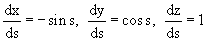

要计算弧长，我们想要对 P 的每个无穷小部分的长度 dl 求和。

由于我们正在积分 d**l**，其中**T**是指向 P 的切线方向的单位向量，即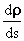的方向，我们可以通过将其与单位向量**T**的点积来找到 dl，该单位向量遵循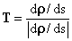。

我们发现 P 上的弧长由以下给出

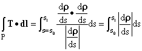

这里的被积函数是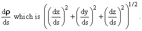的绝对值

这里是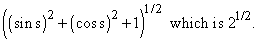

这个螺旋线的积分值和弧长因此为。

**例子 2**

计算淘气孩子将一块质量为 M 的石头从窗户扔出并落在窗户下方 30 英尺处时重力所做的功。这里的功由石头的路径上的线积分**F**d**l**给出。由于**F** = -Mg**k**，最终普通积分 ds 中的被积函数变为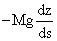，重力所做的功为

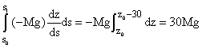

无论路径如何，这里的积分值都是适当单位下的，因为力是梯度，积分因此是路径无关的。

## 23.3 实用评论

虽然这里的简化过程很直接，但有许多细节需要处理，很容易走错。

标准错误通常是粗心大意的错误：在步骤之间丢失一个因子，以及在对**w**进行点积之前未区分的参数表达式，以及错误地阅读或解释问题，切换加法和乘法等。

当您的路径 P 以两个方程的解或定性描述的方式呈现给您时会发生什么？

为了将路径积分化为关于一个变量的单一积分，您几乎总是必须能够将路径上的位置（路径上的 x，y 和 z 的值或路径上某些其他坐标集）表示为该变量的函数。这通常要求您能够根据给定的信息使用您的变量作为参数产生路径的参数表示。

当路径由直线段或圆弧组成时，您应该准备好根据直线段的起点和终点以及圆弧的中心半径和终点角度来参数化表示它们。

从（a，b）到（c，d）的直线段可以表示为

x = a + s(c - a)

y = b + s(d - b)

对于 0 < s < 1。

**练习：23.1 在三维中陈述类似的结果。**

半径为 u，以（b，c）为中心的圆可以用参数表示为

x = b + u cos s

y = c + u sin s

**练习 23.2 这里 s 的适当限制是什么？**

当路径由方程定义，并且您能够解出它们以找到所有变量，以某一个变量或某些其他参数为单位，您可以处理该问题，就好像从一开始信息就以参数形式给出一样。

否则，您始终可以通过数字方式找到曲线上的许多点，并使用我们即将描述的方法对产生的积分进行数值近似。

当然，执行这种积分的最简单方法是观察到向量**w**或其显著部分是标量函数的梯度。然后，积分简化为在端点处的评估，我们根本不必担心路径。

**练习：**

**23.3 在给定的 w = (x，y²，z³)下，计算沿上面的螺旋路径的 w 与 dl 的点积。**

**23.4 在从（1，0，0）到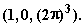的直线路径上计算相同的积分。**

**23.5 计算围绕以点（5，0，0）为中心的 xy 平面上的单位圆的线积分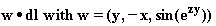。（提示：使用斯托克斯定理。）**

**23.6 您想要找到由 ax² + by² = c 定义的椭圆的弧长。将其边界用参数形式表示，设置积分并执行它。**

## 23.4 多重积分和面积积分

当给定**定义在区域上的积分**时，将其化为**多重积分**的标准程序是将其转化为多重积分。

多重积分是涉及两个或更多个普通积分的表达式，其中一个的积分限制可能取决于下一个的积分变量的值，因此积分可能必须按特定顺序执行。

要将面积积分减少为一对多重积分，必须执行以下步骤：

1\. **选择一组方便的变量**。这可以包括矩形变量或极坐标或任何其他变量。您选择它们使得积分被积函数或将需要的积分限制（最好两者都）尽可能简单; 并选择您打算在这些变量中定义积分的顺序。当您没有线索时，您可以从明显的变量 x 和 y 开始。

2\. 适当地**表达积分的上下限**，以便您要积分的区域由您的积分限制内的点表示。

3\. 用您的变量 u 和 v 以及 du 和 dv**表达面积元素**dA。

4\. 用您的变量**表达被积函数**。

5\. **积分**您生成的每个普通积分，必要时按适当顺序进行。

**例子：我们希望在整个 xy 平面上对函数 exp(-r²)进行积分。**

一种方法是用普通的 x、y 坐标。

然后在每个变量中，积分的限制都是从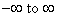到。

(这是一个不恰当的积分，因为限制是无限的，而我们实际上只定义了有限区域上的积分。但是，这里的被积函数对于任何变量的大值都表现得非常好，因此我们可以忽略这一事实，并想象我们将积分截断到巨大的有限值。这不会显著改变答案。)

面积元素 dA 在矩形坐标中为 dxdy。

被积函数可以表达为 exp(-x²-y²)。

我们的任务是评估两个因子的乘积，每个因子都是对所有有限值的 exp(-x²)积分 dx。

答案是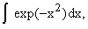的平方，其中积分限制为-R 和 R，R 非常大。

**我们也可以在极坐标中执行此积分。**

这里 r 从 0 到无穷大，从 0 到 2。

面积元素是线元素 dr 和 rd 的乘积，因此我们有 dA = rdrd。

被积函数是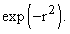

这里的积分是微不足道的，并且产生值 2-0 或仅为 2。

我们剩下的积分是从 0 到无穷大的 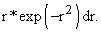 如果我们设 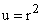，那么我们有 du = 2rdr，积分项 dr 变为 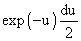 并且在 u 上的积分限仍然是 0 和无穷大。因此，这个积分的值是 ，而这里两个积分的乘积只是 。

注意，我们刚刚证明了这种类型积分的积分是 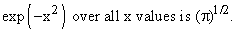

**在评估这种类型积分所需的步骤中，第二步和第三步值得进一步讨论。**

第三个是，在你的坐标系中表达面积元素，在下一章的 24.2 节 中将会讨论。

第二个是，在变量的正确限制条件上找到正确的积分区域，以匹配你想要积分的区域，在 31.5 节 中有详细讨论。

下面的小程序允许你选择限制条件，并查看平面上的结果区域。了解其感觉的一个好方法是首先设置限制条件，先对一个变量进行积分，然后再对另一个变量进行积分，然后尝试通过相反的顺序进行积分来匹配它。你甚至可以尝试通过指定极坐标变量或反之亦然来匹配在直角坐标系中给定的区域。一般来说，人们在第一次尝试时通常会搞砸，所以练习一下可能是值得的。

<applet code="IntegrationBounds" codebase="../applets/" archive="integrationBounds.jar,mk_lib.jar,parser_math.jar,jcbwt363.jar" width="760" height="450"></applet>
