# 第二十五章：数值积分

## 介绍

我们可以很容易地设置一个电子表格来评估给定积分 f 在从 a 到 b 的大量点，并形成黎曼和。一个对称的做法是“梯形法则”，它通过在给定区间的两端具有相同高度的梯形的面积来近似条带中的面积。我们探讨了这个规则和更准确的外推。其中一个被称为辛普森法则。

## 主题

25.1  梯形法则

25.2  辛普森法则

25.3  外推和更好的逼近

25.4  线积分的数值评估

25.5  在电子表格上执行通量（表面）积分

## 25.1 梯形法则

我们面临的问题是在有限区间[a, b]内找到**由方程 y = f(x)描述的曲线与 x 轴之间的面积。**

我们采用了定义积分的方法。当 f 在区间内连续时，我们将其分成 N 个子区间，每个宽度为，我们将其称为 d，（我们假设 b > a），并评估 f 在每个区间的端点，从 a + jd 到 N 为止。

**当 f 只有分段连续时，您应该先将区间分成 f 连续的子区间，然后按照我们在每个区间中讨论的方式继续。**

**梯形法则**包括将每个子区间的面积近似为其宽度 d 乘以其端点处 f 值的平均值。对于第 j 个区间，这是

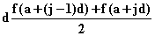

**现在我们来回答这个问题：为什么要这样做？**

**是否比起选择一个随机点 x'在第 j 个区间中计算 d * f(x')作为该区间对面积的贡献来说，使用这个梯形法则更好？**

要对这个问题得到部分答案，请考虑**一个宽度为 d、中心在 x[j]处的区间**，为了方便起见，我们将 x[j]设为 0。

然后区间开始于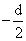，并在结束。

现在假设我们可以在 x 周围用幂级数展开我们的被积函数 f，结果是

f(x) = f(0) + ax + bx² + cx³ + ex⁴ + ...

在这个区间内这个函数的实际面积将是

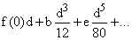

（这里的因子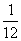的产生如下：端点和各有相同的贡献，每个为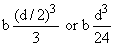。）

因子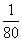的产生方式类似。**请注意，在这里 ax 和其他奇数次幂项在这里根本不贡献，因为它们是奇数的，它们的贡献会相互抵消。）**

**我们描述的梯形法则提供了对于这个区域的以下建议答案**

**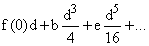**

**f(0)的贡献完全正确，b 的贡献是三倍于此，而 e 的贡献是五倍于此。**

**请注意，这里任何关于 0 对称的估计都将准确得到奇数（a、c 等）项。**

特别地，我们可以使用**"中点法"**，它将面积近似为 f(0)d，这样就能准确获得 a、c 等贡献，但完全得不到 b、e 等项的贡献。

导致 a 和 c 项相互抵消的对称性是梯形法在此处拥有的巨大优势，它与中点法共享此优势。

**考虑一下，如果我们将 d 减小一半**（或任何其他因子 z）。由于这种对称性，**梯形法或中点法中的误差会在每个区间中减少 8 倍，但现在有两个区间，而不是一个。**

因此，必须**加倍此错误以便在原始区间上进行比较**，而且**梯形法或中点法中的实际误差在任何一个来自 b 项的区间中会减少四分之一，甚至在 e 和其他项中会减少更多。**

**练习：**

**25.1 设置一个电子表格，将给定区间 a 到 b 分成 N 个等分区间，评估给定函数，比如 sin x，在每个 N + 1 个区间端点，并计算结果积分的梯形法评估。**

**25.2 制作一个具有同时计算 N = 1、2、4、8、16 和 32 的能力的电子表格。（您可以通过从 32 开始并输入指令=if(mod(j,2^k)=0,2*prev column entry,0)来将它们放在一起，其中 j 是子区间端点的索引，k 是列索引。每增加 1 次 k，梯形区间的数量就会减少一半。）**

## 25.2 辛普森法则

在上一节的符号表示中，函数 f 在介于和之间的实际面积将是

另一方面，我们描述的梯形法则对于这个区域提供了以下建议答案

而"中点法"将面积近似为 f(0)d。

这意味着**如果我们将中点法的两部分与梯形法的一部分混合在一起，我们将完全正确地得到二次 b 项**，而误差的主导项将来自 e 项，其量级将为 d⁴。

**刚才描述的积分近似法则称为辛普森法则，在介于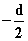和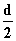之间的区间中采用以下形式**

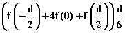

**请注意，在这个公式中，f 在间隔为  的位置进行评估**。如果我们在这里给参数  一个新名称，称之为 h，那么辛普森法则的公式变为

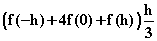

它代表了对由 f 在从 -h 到 h 的区间内定义的曲线下面积的逼近；一个其误差与 h 的四次方成正比的逼近。

值得注意的是，当应用于一系列小子间隔时，这些各种规则的外观是什么样子的。

梯形法则给予所有中间点的评估相等的权重 d，因为每个点都是一个子间隔的左端点和右端点，它**从每个端点获得  的权重。**

另一方面，最后两个评估只是一个子间隔的末端，**这些获得权重为 。**

中点法则给予奇数次评估 d 或 2h 相等的权重。

**辛普森法则给出的权重形成模式 1 4 2 4 2 ... 4 1 乘以 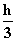，因为中点获得权重 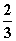，而梯形法则除以 3 解释了其余部分。**

|  | 端点 a | 第一个间隔的中点 a + h | 第一个间隔的末端 a + 2h | 第二个间隔的中点 a + 3h | 第二个间隔的末端 a + 4h | 等。 |
| --- | --- | --- | --- | --- | --- | --- |
| 梯形法则项 | hf(a) | 0 | 2hf(a + 2h) | 0 | 2hf(a + 4h) | 等。 |
| 中点法则项 | 0 | 2hf(a + h) | 0 | 2hf(a + 3h) | 0 | 等。 |
| 辛普森法则项 | 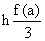 | 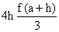 | 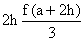 | 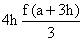 |  | 等。 |

注意，在为 f 生成辛普森法则中产生误差的幂级数中，主导项是 ex⁴ 项，**如果我们将间隔减半，这将导致误差减少 16 倍。**

<applet code="NumericalIntegration" codebase="../applets/" archive="numericalIntegration.jar,mk_lib.jar,parser_math.jar,jcbwt363.jar" width="760" height="450"></applet>

## 25.3 外推和更好的逼近

我们在讨论数值微分时看到，当我们有一系列数字，这些数字是对一个数字 A 的逼近，**其误差从项到项按给定因子 r 减少时，我们可以外推这个序列，以获得一个更快收敛的序列。**

一般的外推规则是：**为了消除按因子 z 减少的误差，将当前结果乘以 z 减去前一个结果，然后将此差异除以 z - 1。**

例如，如果我们查看梯形法则提供的答案，对于值 16d、8d、4d、2d、d，我们得到一个近似答案序列，其误差可以预期每次减少大约 4 倍。如果我们将这些答案表示为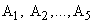，并查看序列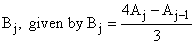，（对于 j = 2 到 5），那么在每个 B 中下降为 4 倍的 A 项将在每个 B 中抵消掉，我们只会留下更高阶的项。

如果我们在这里将这个过程应用于梯形法则，我们得到了先前定义的辛普森法则近似。

**练习 25.3** **验证这个说法。**

但我们知道辛普森法则中领先的项每次减少 16 倍，我们可以用同样的方法来玩它们。

我们可以形成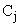，由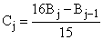定义，对于 j = 3 到 5，并得到一个“超级辛普森法则近似”，其中（在幂级数展开中）领先的项每次减少 64。

我们可以再继续这样做两次：得到对于 j = 4 和 5 的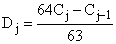，以及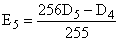，这大约是我们用 16 个区间进行近似的最好的结果。

**练习：**

**25.4 使用练习 25.2 的结果来计算 A 到 E。在你知道值的积分上比较它们的准确性。（例如 sin x 从 x = 0 到 1。）**

请注意，虽然这些方法非常好，但在 sin x 上特别有效。**

**25.5 你能找到一个这种积分方法很糟糕的函数吗？你可以怎么改进它？**

## 25.4 线积分的数值评估

假设我们面对一条线积分，这是沿着欧几里得空间中某条路径的积分，其中向量场**v**为**ds**。

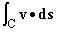

我们可以设置一个电子表格来评估这样的积分，而几乎没有困难。

在本节中，我们描述了如何实现这一点，并试图怂恿你自己在电子表格上做一些类似的事情。

顺便说一句，一旦你拥有这样的东西，你就可以用极少的努力修改路径、被积函数或者网格大小，因此可以使用你的产品来评估你所遇到的任何线积分。

线积分与普通积分相比更复杂，主要是因为你不仅需要处理被积函数，还需要处理路径，而对于普通的被积函数，路径是实线的一个区间，由其两个端点完全确定，你只需要处理被积函数。

我们所做的取决于积分的路径 C 如何定义。

最简单的情况，我们在这里解决的是当我们把 C 给出作为一个**参数曲线**时发生的情况。 

这意味着我们有一个参数，让我们称之为 t，并且对于每个坐标 x、y、z 等，我们有 t 的函数形式，并且 t 值的区间定义了曲线。

我们的计划是将 t 区间分成许多小片段，并在这些片段的边界处计算 x(t)、y(t)、z(t) 和 vx, y(t), ...)、vy, y(t), ...)、...。

换句话说，我们将为 x、y 和 z（在三维空间中）的每个计算分配一列；并且为矢量场 **v** 在点 (x(t), y(t), z(t)) 处的每个分量进行计算。然后，我们使用一列来描述来自一个子区间（比如 t 到 t + d 之间）的积分贡献。

**我们用什么来估计这个贡献？**

t 是 x(t) 在该区间内的变化乘以该区间端点上 v[x] 的平均值，再加上 y 和 z 上相同的情况。我们只在这里写下 x 的贡献，即

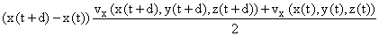

在最后一列，我们将这些贡献加起来，覆盖各个区间，这就是我们的积分。这是线积分的梯形法则。

**一旦完成了这个步骤，我们如何改变路径？** 修改 x(t)、y(t) 和 z(t) 列，以使用不同的 t 函数。

**我们如何改变被积函数 v？** 改变它的列。

**我们如何改变区间大小参数 d？** 只需改变它。

**我们究竟要如何做到这一点？**

我喜欢把前五行留给注释和数据输入。

在 B2 中，我会放入起始 t 值，在 B3 中放入 d 的值。

在顶行，我会给出对曲线和矢量场的文字描述。

所以我会从第 6 行开始计算。

这里是我会放在 t 列（A 列）的内容。

A6=B2

A7=A6+B3

A8=2*A7-A6

并且我会把 A8 复制到 A9-A1005（或者更远，如果你愿意）。

在 x、y 和 z 列中放入

B6=x(A6)（当然，你必须放入这个函数是什么）

C6= y(A6)

D6=z(A6)

并将这些复制到 B7-B1005，等等。

在 **v** 列中，放入 **v** 的各个分量的值

E6=vx

F6=vy

G6=vz

并将其复制下去。

接下来设置

H6=(B7-B6)*(E(7)+E(6))/2

并将其复制到 I6 和 J6 的位置，并向下延伸。

设置

K6=H6+I6+J6

并且

L7=L6+K6

并将这些复制下去，**你就完成了**。

如果最终的 t 值出现在 Ak，则积分答案将在 Lk 中。

你可以调整 d，并且可以像普通积分一样进行外推。

这里使用的方法是梯形法则的路径积分版本。

通过一点诡计，你可以推断出这一点积分版本的辛普森法则，并且也可以推断出它。

你可以通过对一个 d 值、2d 值和 4d 值进行积分来检查准确性（确保适当调整端点，以检查准确性）。

在没有外推的情况下，当你将 d 减小一半时，答案的差异应该减少 4 倍；用细分的结果的 减去较粗糙的结果的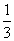 或较粗糙的结果应该会改善到 Simpson 的结果。

依此类推。

## 25.5 在电子表格上进行通量（表面）积分

当表面 S 以参数形式描述时，也就是说，给定函数 x(s, t)，y(s, t)和 z(s, t)，以及 s 和 t 的值域，你可以使用电子表格来计算任何可定义在电子表格上的向量函数**w**（即与表面法线的点积）的通量积分。

你可以利用电子表格的能力，在二维的大范围位置复制单个指令，行和列。

假设你想要先对 s 进行积分，然后再对 t 进行积分，你将从 t[1]到 t[2]进行积分，并从 s1 到 s2 进行积分。假设你想将每个范围分成 N，N = 100 个片段。

这个计划如下：你设置 s 值、t 值的数组，然后是 x、y 和 z 值，然后是 w[x]、w[y]和 w[z]值的数组，最后是一个积分的数组；这些数组中的每一个都将是 N + 1 乘以 N + 1 的大小，但最多只需要构造 3 或 4 个条目。其余的都是复制。

设置一个 t 值的数组，将 t[1]分配给第一列中使用的第一行，然后在其下一行中将(previous + (t[2] - t[1]) / N)，以及在(previous to previous)之下的(2 * previous - (previous to previous))。将其复制到接下来的 98 行。然后将下一列的条目设置为“=左侧条目”，将其复制到接下来的 98 列和行。

这应该在每一行中给出一个单一的恒定 t 值，但在每一列中给出不同的值。

接下来设置两列来计算每个 t 值的 s1 和 s2。

通过在第一列中放置=s[1]、第一行中的 s[1] + (s2 - s1) / N（在 N 上使用美元符号）以及下一列中的(2 * 左侧 - 左侧左侧)来设置一个 s 值的数组。

然后将这个复制到 98 行，并将第三列复制到 98 行。

再次设置相同大小的 x、y、z 和 w[x]、w[y]和 w[z]数组，方法是将 x(s0, t[0])放在 x 数组的左上角条目中，并将其复制到整个数组中。其他 5 个数组也可以类似地完成。

要计算积分，你可以将每个“区间对”ds 和 dt 的贡献相加，即

w[x] * (dy[s]dz[t] - dy[t]dz[s]) + w[y] * (dz[s]dx[t] - dz[t]dx[s]) + w[z] * (dx[s]dy[t] - dx[t]dy[s])

要再次计算每个 2x2 矩形中的积分，你只需要计算顶部左侧的一个，然后再次复制到一个 100 乘 100 的数组中。

这可以一次完成或每个项都完成一次。积分将是整个数组上的这些的总和。

对于一对区间，你需要做什么来获得 w[x]或 dy[s]或 dz[t]？

假设区间的角落是（s，t），（s + d，t），（s，t + d'）和（s + d，t + d'）。

然后，二维中梯形法则的类比给出

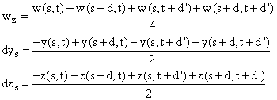

尽管创建这个最后一个数组很混乱，但实际上只需要在一个正方形中完成并复制，而且只需要完成一次，并且可以在其他数组具有相同起始点的情况下重复使用。

请注意，要更改 s 和 t 的域，只需更改前两个数组；要更改参数化，只需更改 x、y 和 z 数组，要更改计算其通量积分的向量**w**，只需更改其三个数组。

通过对最后一个数组进行不同的求和，可以获得对表面子集的积分。

这里是一个例子

t[1] =1，t[2] = 2，s[1] = t²，s[2] = t³，

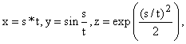

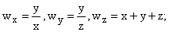

请注意，更改 t[1]、t[2]、s[1]、s[2]、x、y、z、w[x]、w[y]或 w[z]每次只需要更改一个条目，然后将其复制到整个相应的数组中。（或在适当的地方。对于 t[1]和 t[2]，您无需复制任何内容，对于 s[1]和 s[2]，那是一列。）

很容易推断这些结果：您可以将 N 更改为 50，并对最后一个数组的左上角进行求和，将 N 更改为 25，并对该数组的左上角进行求和。

此积分的结果为 N = 100 时为 132.2450414，N = 50 时为 132.1941481，N = 25 时为 131.9909671。

在 50 和 100 之间，这些之间的差异大约是 25 和 50 之间的 4 倍。将更好的乘以，减去更差的乘以得到 132.262006 和 132.261875。假设剩余误差按 16 的倍数下降，给出 132.2620145 的估计，这可能准确到 6 位小数。

这可以通过扩大数组并尝试 N = 200 来验证，这只需要复制，并形成一个新的总和。

**练习：**

**25.6 创建刚才描述的电子表格，并验证或证伪上述说法。**

**25.7 您能得到描述的积分的最佳估计是什么？**

**25.8 将 s 和 t 更改为从 0 到和 2，使 x、y 和 z 等于球坐标中的值，并让 w 为向量（x，y，0）。通过这种方法找到积分的合理精度。**
