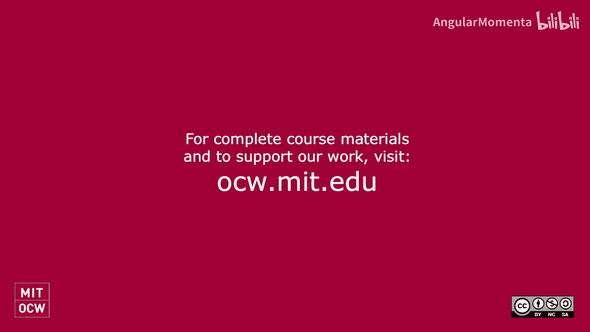

**计算音乐学与分析：0：面向OCW学习者的课程概览** 🎵

在本节课中，我们将对麻省理工学院的“21M.383 计算音乐理论与分析”课程进行概览，了解其核心目标与内容结构。

大家好，开放课件学习者。我是迈克尔·卡斯伯特，麻省理工学院“21M.383 计算音乐理论与分析”课程的教授。很高兴大家将加入这门课程的学习。能够与来自世界各地的学习者一起，探索计算机如何帮助理解音乐，特别是音乐理论，这非常棒。

这段录音是在课程结束大约一年后录制的，旨在欢迎大家，并在课程学习过程中提供一些说明。

首先需要告知大家的是，课程第一天我们遇到了一些技术问题。因此，大家会看到讲座是从几分钟后才正式开始的。并且，视频质量，特别是幻灯片演示和实时编码部分的质量，未能达到我们期望的标准。因此，我将在课程中穿插重新录制一些内容。当大家看到我以现在这样的形象出现时，说明这段内容是专门为开放课件平台录制的。我将会不时地以这种方式与大家交流。

现在，祝大家学习愉快。

---

**总结**

本节课中，我们一起了解了“21M.383 计算音乐理论与分析”课程的概况，认识了主讲教授，并知晓了课程视频中存在的一些技术问题及相应的补充说明。这为后续正式内容的学习做好了准备。