#  002：计算机如何“听”音乐 🎵

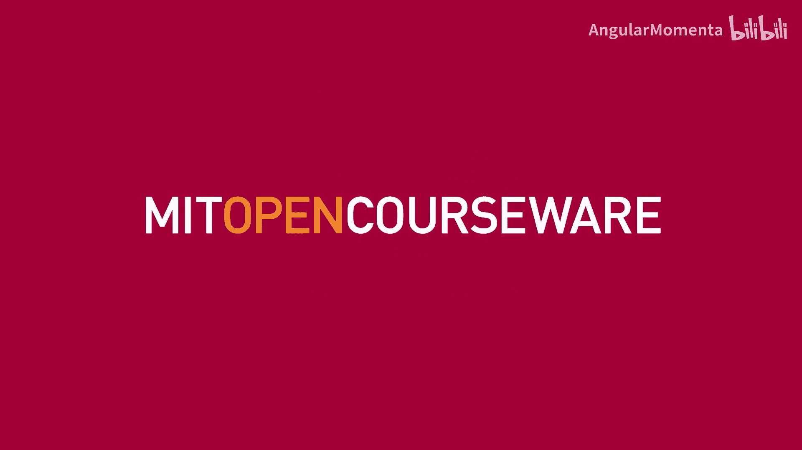

在本节课中，我们将探讨计算音乐理论的核心问题：计算机如何“听”音乐？我们将从宏观问题入手，逐步深入到具体的技术挑战，并介绍本课程将使用的工具和方法。

## 概述：从“听”到“理解”

你已经看到，这门课涉及的技术问题比标准课程更多。这意味着，如果你是为了一门计算课程而来，那么你来对地方了。这是21M.383计算音乐理论与分析课程。我是Michael Cuthbert，这门课的教授，也是音乐与戏剧艺术系的教授，主要从事计算分析方面的工作。

在深入了解大家之前，我想先提出本学期的核心问题。我们将在周五和下周三互相认识，这对我很重要。但在第一堂课上，我认为大家来这里是为了在互相了解之前，先确定这是否是你想待的地方。

## 核心问题：计算机如何“听”音乐？

整个学期将要探讨的大问题是：**计算机如何听音乐？** 这到底意味着什么？

我可以给你一个现成的答案：计算机通过连接到模数转换器的麦克风来听音乐，转换器连接到微处理器，通过专门的编解码器将声音量化为波形文件或AAC等格式，然后存储在磁性或固态硬盘上，或者存储在云端（也就是别人的磁盘上）。

然而，这并不是一个非常有用的答案。我认为我们更想知道的是：计算机在“听”音乐，但它们真的在“聆听”吗？“听”和“聆听”在不同语境下含义不同，后者具有更高的优先级，并暗示着更深层次的理解。就像父母可能会对孩子说：“我知道你听见了，但你真的听进去了吗？”我们内心就有这种区分。

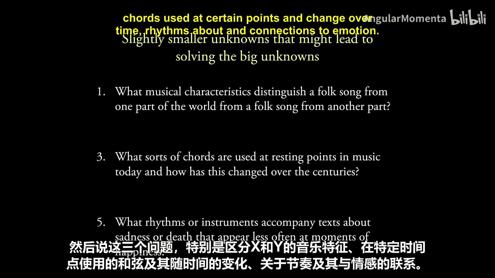

我们想知道的是：当计算机听音乐时，它们可能拥有或编码了什么样的理解？如果你对计算机拥有自主性这个概念感到不适，这也没关系。我真正关心这个问题的原因是：**通过理解计算机如何听，可能会改变我们自己的聆听方式**。它可能为我们打开新的、我们之前不了解的音乐作品。最重要的是，它可能回答关于我们作为聆听音乐的人类，其本质是什么的问题。

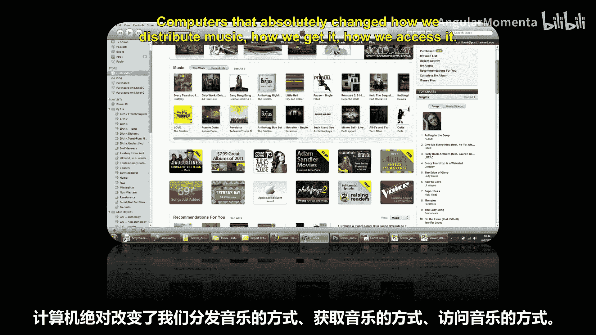

## 六大未知问题

这里有六个我想知道答案的宏观未知问题。如果你在周五交上其中任何一个问题的正确答案，你就可以得到A+并且不用上课了。但我自己也不知道答案。

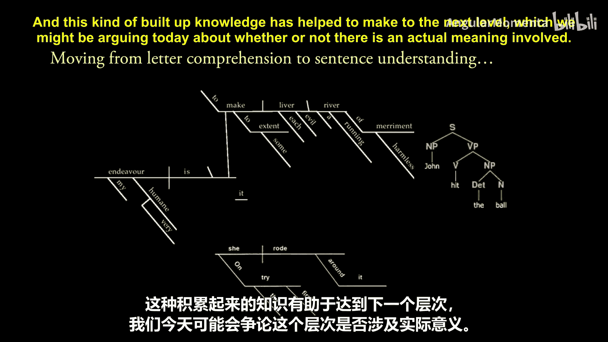

1.  **我们为什么听音乐？** 我们不会整天去闻气味，但音乐似乎是一种不同的、我们不会整天进行的享受活动。
2.  **人们如何选择自己喜欢的音乐风格？**
3.  **个人或整个文化的音乐品味如何随时间变化？** 我们中的一些人来自不同文化，拥有不同的音乐品味。
4.  **伟大、平庸和糟糕的音乐作品之间有什么区别？** 这些术语真的存在吗？
5.  **是什么让一首音乐优美或丑陋？**
6.  **物理反应：为什么听到某些音乐时我想跳舞或移动，而听到另一些时我只想坐着哭泣？**

然而，一个每周两次、为期一学期的课程，不太可能给出这些问题的最终答案。

## 可探索的具体问题

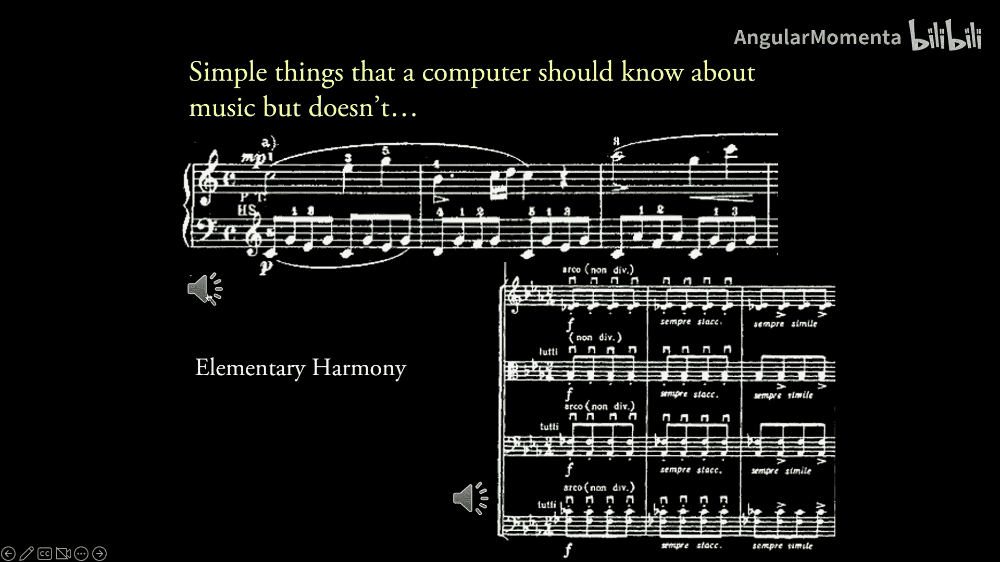

因此，我喜欢将这些大问题分解成稍小一些的未知问题，它们有助于回答上述大问题，并且我们可能能够开始取得进展。

以下是五个可能帮助我们回答大问题的具体问题：

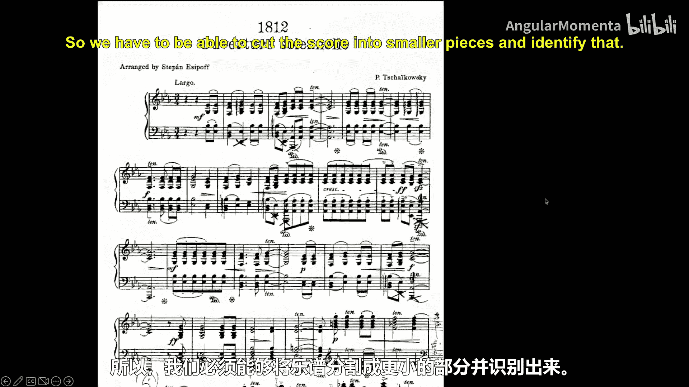

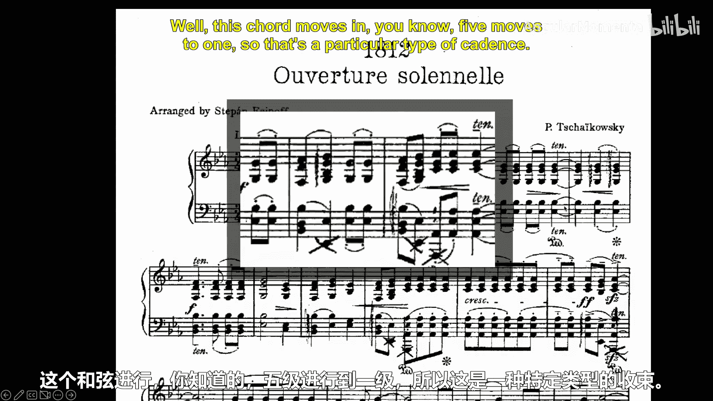

1.  **哪些特定的音乐特征能区分世界不同地区的民歌？**
2.  **乐队的外貌、服装、年龄、种族构成如何影响听众的构成？** 以我现在的穿着，我不太可能成为重金属明星，这意味着什么？
3.  **当今音乐中，哪些和弦用于放松、休止或停止？** 这在不同的世纪、世界不同地区有何不同？
4.  **畅销歌曲的歌词与获奖歌曲的歌词有什么共同点或不同点？** 我知道大型唱片公司有人试图回答这个问题，因为这涉及金钱。
5.  **哪些节奏或乐器伴随着关于悲伤或死亡的文本出现，而在表达幸福的时刻较少出现？** 这与“为什么有些音乐让我哭泣”有关。

我将保留其中三个问题，去掉两个。这三个问题——区分X和Y的音乐特征、特定点使用的和弦及其随时间的变化、节奏与情感的联系——都是可能通过乐谱表征（无论是现代手写谱还是古代乐谱）来帮助回答的问题。

## 计算机在音乐方面的能力

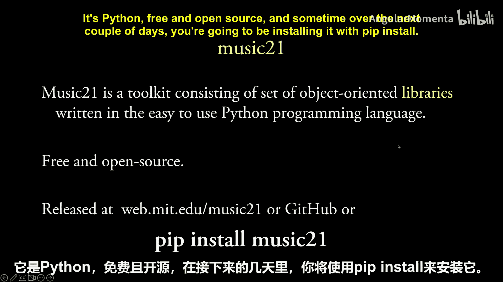

让我们回顾一下计算机在音乐方面擅长做什么。在制作方面，我们用电脑制作大量音乐、混音、重新编辑。计算机彻底改变了我们分发、获取和访问音乐的方式。很酷的应用程序和算法（例如在本校开发的那些）可以告诉你，酒吧里某个醉汉唱的是什么歌。

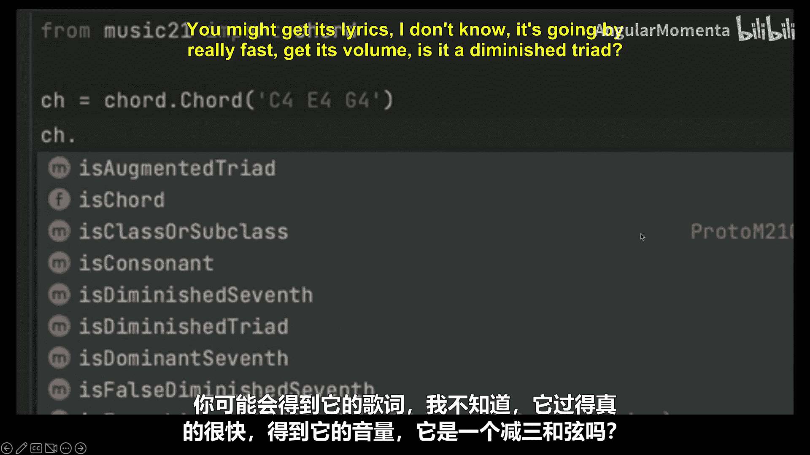

但是，在如何使用计算机分析乐谱方面，直到大约十五年前，自七八十年代以来几乎没有什么变化。现在情况正在改变，但让我说说文本分析与音乐分析的不同之处。

如果你加载一段文本，我们可以将其视为一个字符串。现有的算法可以识别空格、拆分单词、处理外来变音符号、转换为ASCII、识别什么是标点符号。如果有字体渲染，你还能知道什么在基线以下、什么是大写字母等等。文本的这种低级信息，真的有助于构建下一级的文本信息，比如句子图解，从字母理解到句子层面的理解。这种积累的知识有助于达到更高级别，我们今天可能还在争论其中是否涉及真正的意义。

## 为乐谱构建技术

那么，我们能为乐谱构建这些技术吗？也许可以，但今天还不行。

我希望这门课的学生在5、6、7、10年后（希望更短，不希望是30、50年），你们在课上学到的东西能帮助达到那种理解水平。我认为，这是一门非常独特的课程。当今世界上大概只有另外三门类似的计算音乐理论课程，其他都是博士或研究生研讨会。由于麻省理工学院在融合艺术与编程、深厚的音乐知识以及解决问题的协作文化方面的独特能力，我们可以在本科阶段开设这门课。如果你是研究生，我们可以和你一起做更多事情。

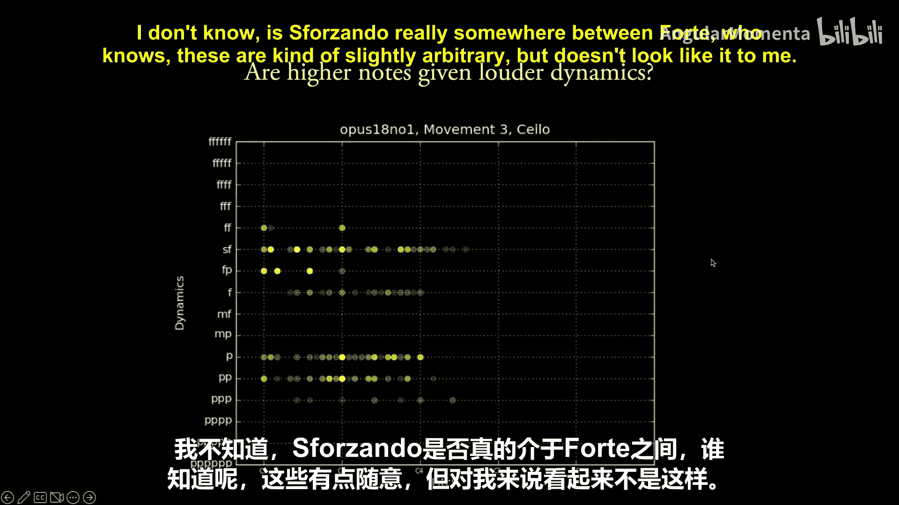

## 计算机处理乐谱需要的基础

那么，我们需要构建哪些技术呢？以下是一些计算机处理乐谱必须知道的基础事项：

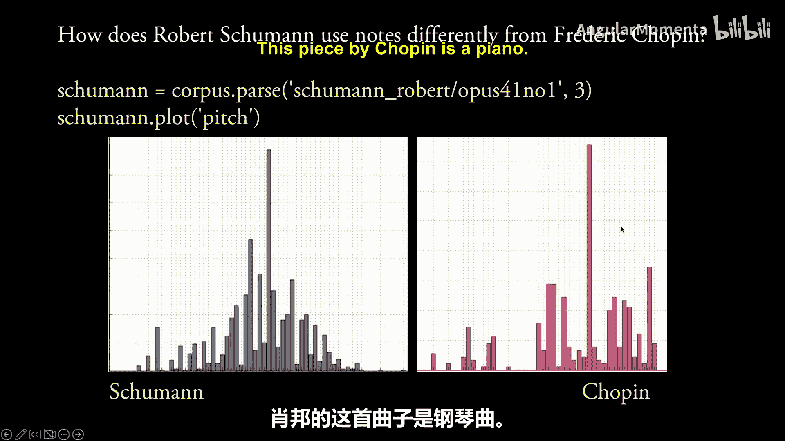

*   **音高系统**：从D，E，F，G开始，下一个音是什么？不是H。即使是拥有H音的德国人也不会那么接。
*   **节拍与拍号**：看看这个。3/4拍。这需要计算。所以我们需要节拍的概念。
*   **协和与不协和**：从那里开始构建，我们需要知道这两个乐谱中哪个更协和，哪个更不协和。我们需要从乐谱中提取协和与不协和的概念。

因此，我们需要从一些中等问题中退一步，去看更小的事情。例如，假设这是柴可夫斯基的《1812序曲》。如果我们想理解调性关系如何运作，如何从一个调转到另一个调，以及这如何构建曲式和张力、作品的力量。为了做到这一点，我们需要知道所有转调的位置。我们必须能够将乐谱切割成更小的片段并识别它们。那么，如何识别转调呢？你可能会说，它以一个调的终止式开始，以另一个调的终止式结束。所以现在我们需要能够识别终止式。我们需要能做到这一点的东西。这个和弦从五级进行到一级，这是一种特定类型的终止式。当我说五级进行到一级时，人们会在脑海中听到罗马数字并可视化它，因为这是我们将要大量使用的音乐知识水平。因此，为了判断一个和弦是五级和弦、一级和弦，或者它到底是什么和弦（是大三和弦还是小三和弦），我们需要和弦、音符和音高的表征。

## 音乐21工具包

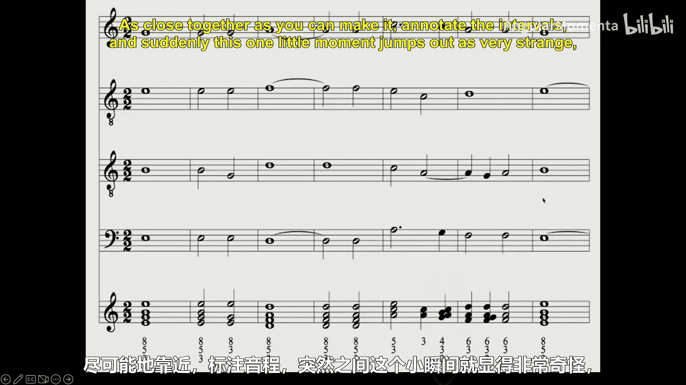

本课程开始时，我们将要做的就是重新创建其中一些工具，然后看看其他人做了什么，并在此基础上更进一步。

我们没有所有这些工具的事实有点令人惊讶，因为已经有很多资金和工作投入，将某种乐谱表征（无论是记谱法、MIDI还是其他形式）转换成能在扬声器上很好播放的东西。或者，如果你用过NoteFlight、Finale、Sibelius、Dorico、Flat.io等，你知道我们可以将音符的表征转换成某种乐谱。我认为那是一种输出，就像打印机。然后，尤其是在研究实验室，有很多工作是关于接收声音并将其转换为对搜索等有用的数字表征。但是，一旦你的计算机中已经有了乐谱的数字表征，你用它做什么？如何分析它？如何操作它？这方面的研究要少得多。这就像我们花了所有时间建造打印机和扫描仪，却花了少得多的时间建造我们实际的CPU（中央处理器）。

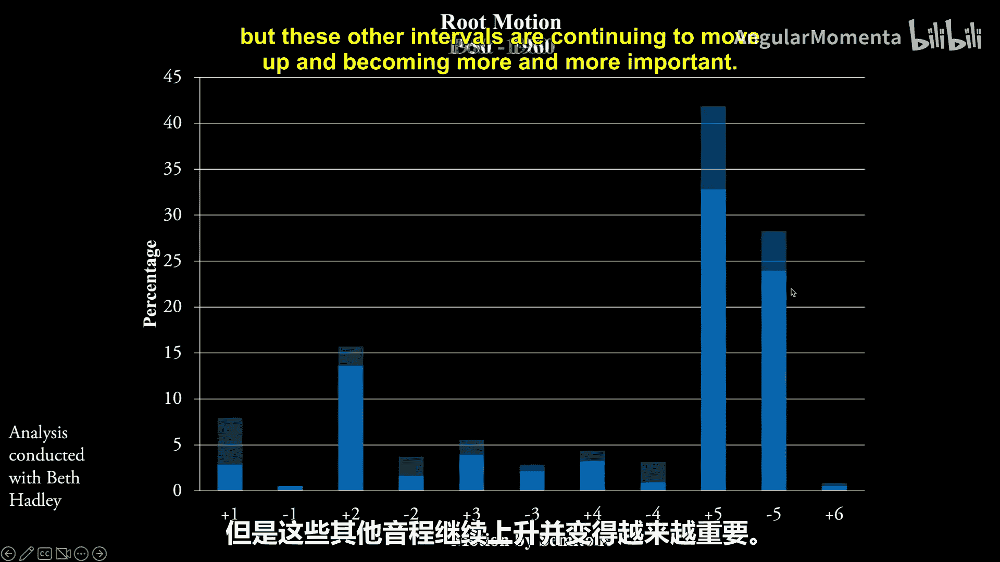

本课程中我们将大量使用的一个工具包是我和麻省理工学院的许多其他人用来进行这类操作的工具包。我认为可以公平地说，它是世界上用于处理乐谱最常用的工具包。它是Python的，免费且开源，有时在接下来几天里，你会用`pip install`安装它。

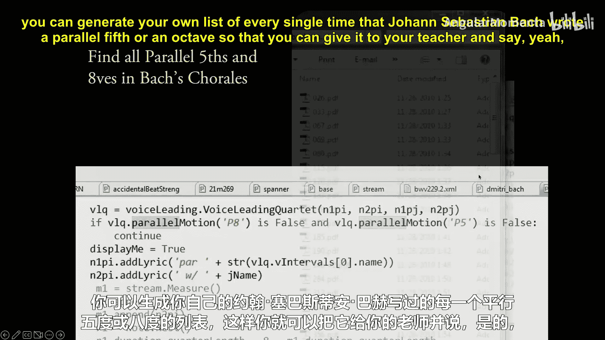

## 音乐21的工作原理

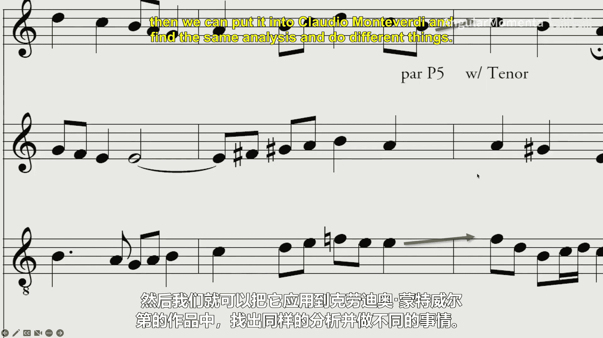

音乐21的理念是，首先我们将编码许多关于音乐的基础概念，这样当你有一个和弦时，你将拥有如何表征音高（例如中央C、E、G）的表征，然后一旦你有了那个和弦，你可能能够做的所有不同的事情——你可能会得到它的歌词（不知道，它过得很快）、它的音量、它是不是减三和弦等等。希望任何好的计算机程序看到C、E、G都会返回“不是减三和弦”。

写一个能判断C-E-G是否是减三和弦的计算机程序所花的时间，你们都能瞬间听出来。那么为什么让计算机做事情呢？这是为了让我们能够以比耳朵更快的速度“听”音乐。这是一个音乐21中的代码示例，其他工具包中也有类似代码，它将读取J.S.巴赫的第11号康塔塔第6乐章，编码为一个名为MusicXML的文件，将其存储为一个变量，从中提取中音部，获取第13至20小节作为摘录，进行特定分析（根据节拍重音的强度放置星号）并显示。任何音乐分析师在我做这件事所花的时间内，都可以自己完成。但是，是什么让计算机真正强大的三个字母介词？以F结尾。哦，是“for”。所以，我们只需放入一个for循环，突然之间，我们就能查看巴赫写的每一首康塔塔，获取其中音部的第13-20小节，做同样的事情。当然，为什么只做那个摘录？为什么只做中音部？让我们获取每一首康塔塔，循环嵌套循环。先别过度优化，先看看你是否能在喝杯咖啡的时间内完成这件事。

在你的计算机科学入门课上，你早期会经常思考这是O(n²)、O(n³)还是O(n log n)等等。我们在这里也会不时讨论这些术语，但在第一部分，我们将构建能在我们可接受的时间内工作的工具。你会经常听到我用这个术语：当我们有一个非常大的研究问题时，比如关于15世纪的音乐风格，我们会说人们已经等了500年才得到这个答案，10分钟不算太糟。然后，之后你可以回去把它变成一个3分钟的问题。

## 可探索的问题示例

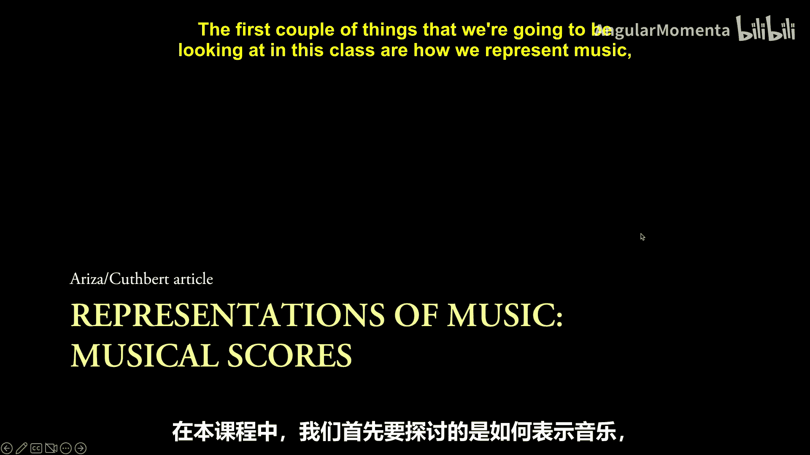

这些工具包旨在解决的一些问题包括：

*   **高音更响吗？** 我们许多人感知高音更响，它们是否被赋予了更强的力度？我们可以绘制音高（知道八度编号，中央C是C4，这是当今美国标准表征）与力度的关系图。大提琴的音高不会那么高。我不知道“sportslando”真的是介于“forte”之间吗？谁知道呢。这看起来有点随意，但对我来说不像。这是一张小图，我们可能想在几千首作品上做这个，运行一些回归线，做所有我们能做的事情，但我们可以开始回答这些问题了。
*   **罗伯特·舒曼和弗里德里克·肖邦使用音符的方式有何不同？** 绘制舒曼的音高使用情况，我可以看到它是一条非常漂亮的钟形曲线，很棒。另一方面，肖邦的看起来像一座没有规划法律的城市。当肖邦喜欢一个升G时，它不是任何一个升G，就是这个升G，他会一直弹下去。这些是你可以做到的一些方式。舒曼的这首特定作品是弦乐四重奏，肖邦的这首是钢琴曲。当你有一个弦乐四重奏时，当然会有更多乐器演奏中间音区的音符。所以，我曾经这样做过一次，我以为我比较了同类事物，结果发现我比较了苹果和橘子。因此，我们也要多思考用户错误以及我们如何制作东西。
*   **音乐可视化**是我们要做的一大部分。这类可视化图表可以让理解一首作品变得非常容易。你也可以使用3D图表，它们根本无助于理解任何东西，但如果你需要吸引捐赠者和资金，它们看起来真的很酷，所以需要时就做，否则我实在看不懂。
*   **结合不同领域**，例如地理信息和音乐特征绘图。这是我发现的一个有趣的事情：比较大音程（接近西方七度但显然不完全相同，因为不同文化使用不同音程）的分布，观察民歌的差异，你可以看到在中国向北移动以及向内陆移动时，民歌中非八度的大音程有所增加。我们将在学期中的某个时间点看一篇非常酷的论文，它展示了特定的山脉如何将两侧截然不同的民歌分隔开。
*   **寻找作曲家的指纹**：也许存在这些微小的瞬间。在这首大约1500年的作品中，有一个瞬间感觉可能出现在现代作品中，就像你用手砸钢琴一样。在这里很难看清，但有了计算机，我们可以将所有音符放入单一和弦中，将它们简化到密集排列（每个人都记得音乐理论课上的“尽可能紧密地排列在一起”），标注音程。突然之间，这一个微小的瞬间就凸显为非常奇怪。然后你可以回去弄清楚音乐是如何创造这个的。
*   **随时间变化的音乐**：在整个学期中，我们将研究音乐随时间的变化。我们还将研究由本课程学生或在开发音乐21的实验室工作过的人所做的各种事情。Beth Hadley是这个项目的毕业生，她做了这项分析，观察了许多20世纪50年代和60年代的摇滚流行歌曲，发现低音经常向上或向下移动五个半音（这大致对应着从一级到四级或五级到一级的进行），偶尔向上移动两个半音（在一级-四级-五级-一级进行中，四级到五级是绿色）。你可以看到这如何占据主导地位。在大多数数据集中，它说1980年后，应该说1980年至2000年的数据集。你可以看到，如果我们来回切换，五度和四度仍然是主要的东西，但这些其他音程继续上升并变得越来越重要。我很想看到一项分析，我们现在有2000年之后又一个完整的20年（到学期结束时是22.25年）的音乐，看看这个趋势是继续还是停止了。
*   **寻找平行五度**：你们中有人上过某种理论课。那么，谁在这个班里写过平行五度？实际上有？哇，有些人从未写过平行五度，这太神奇了。或者你总是故意写来惹恼你的老师。所以，下次你被指出时，你可以生成自己的列表，列出约翰·塞巴斯蒂安·巴赫写的每一个平行五度或八度，这样你就可以给你的老师说：“是的，那是一个平行五度，但和巴赫写的一模一样。”一旦你写了一个程序，对特定的音乐语料库（音乐集合）进行特定类型的分析，就很容易交换其中一个或另一个。所以，一旦你有了一个能在巴赫作品中找到所有平行五度的程序，我们就可以把它放到克劳迪奥·蒙特威尔第的作品中，进行同样的分析并做不同的事情。因此，我们的大多数工具（我会说不是全部）可以用于任何语料库，任何语料库也可以应用于多个工具。所以，在这里，通过使用计算机，你可以获得平方级的效率提升，如果你想手工完成的话。

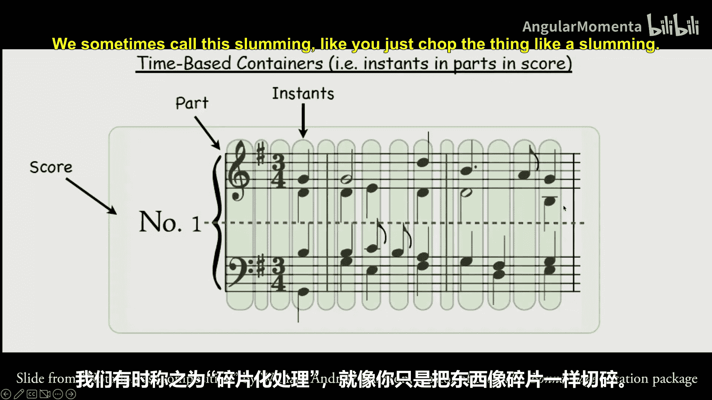

## 计算机作为分析工具

我主要接受的是音乐学家的训练，即音乐史学家，首先被训练用手工做事，观察历史和背景，得出结论。然后我做了很多计算机方面的工作，有一段时间这两者有些分离。我正努力将它们越来越紧密地结合在一起，这样当我们回答一个特定问题时，我们会思考这些大问题中的哪一个，我们可能得出了什么更大的答案。

这是一个我在早期开发中写的特定演示程序。我想，哦，很酷，我有（你们会看到为什么巴赫经常出现）巴赫的所有作品，我知道巴赫当他写一首小调作品时，通常会如何结束？是的，这种辟卡迪三度，所以通常当他在小调时，他以大调结束。我想在他所有的康塔塔创作中找到每一个例外。很容易找到所有这些地方。然后我很高兴地发现正好有八个例外。我认为这有点意思，直到有一天我有点无聊，开始看这些作品是什么，这些奇怪的数字对应哪些作品。我看了第一个，作品248号（巴赫作品目录编号），我看到，哦，那个错了。计算机没弄对。我没有展开所有的反复。所以作品的最后一小节是“D.C. al Fine”（从头反复至Fine处结束）。所以回到那里，实际的结尾在中间，那是大调。所以那个排除了。我看了其他作品，我看到它们被一些人称为“孤儿康塔塔”。它们是J.S.巴赫的儿子C.P.E.巴赫说他父亲写的并出版了，但我们没有其他证据证明他父亲写了它们。这种情况只发生在那些合集中。所以一些人一直在争论也许这些作品不是真的巴赫写的，或者它们被大量编辑过。这似乎为我们提供了一些证据，表明那可能是真的。

所以，永远记住，计算机不能替代分析，它是一种工具，让你可能已经有的分析性问题更高效。这就是为什么。

## 音乐的表征

本课程中我们首先要看的是如何表征音乐，有哪些类型的乐谱等等。我们将探讨为什么你可能选择一种表征而不是另一种。我们首先要看的事情之一是将音乐视为一系列盒子，或俄罗斯套娃，随便我们怎么称呼，盒子里有盒子。所以我们有一个乐谱在那个盒子里，我们有一些声部在那些盒子里，我们可能有小节，我们可能有声部（一个小节内两个不同的独立声部）等等。所以我们称那种为基于声部的容器。你甚至可以把乐谱放进一个更大的盒子里，比如作品号或一个合集里的所有作品。

然后我们可能有的第二个盒子是，在某个时间点发生的所有事情。所以这里发生的所有事情，这里发生的所有事情，这里发生的所有事情。我们将研究并尝试识别何时一种表征可能更好，何时另一种表征可能更好。以及你如何编写工具来从一种表征转换到另一种表征，从基于盒子的转换到基于瞬间的。你会看到我们有时称之为“salami slice”（意大利香肠切片），就像这样，把东西像香肠一样切片。

## 语料库的代表性

一个非常重要的时刻。我之前提到过书，就是要确保我们得出的结论适用于更多现存的音乐，而这只有在我们拥有大量音乐并且这些音乐能代表创作音乐的人群时才可能。

这里列出了一些我最喜欢的作曲家：贝多芬、约瑟夫·布洛涅·圣乔治骑士、凯特·赛珀（本音乐系的朋友）、艾米·比奇、瓦格纳、J.S.巴赫、斯科特·乔普林、莉迪亚·莉莉乌卡拉尼女王（我在夏威夷度过了一段时间，她是非常重要的作曲家）、山田耕作、莫扎特、多莉·帕顿和披头士乐队。这些都是我非常愿意研究的人。

所以我去开始做这项工作，当然，我不想编码所有这些音乐。所以我用别人已经编码好的。这让我可以研究这个音乐子集。这是之前列出的那些人的非常有代表性的子集吗？不，根本不是。我们有贝多芬、巴赫、瓦格纳、莫扎特。都是伟大的作曲家，早已去世的白人男性，版权已过期。然后还有仍在版权期内的一组——披头士乐队，不知怎么总是无处不在，你几乎总能得到他们的作品。所以这就是音乐语料库研究（对大量乐谱集合的研究）在我开始时的状态。谢天谢地，情况正在变得好一点。我们现在有了斯科特·乔普林（如果你不知道他的名字，他写了《艺人》、《枫叶拉格》等，你会听到他的音乐然后说“哦，我知道那音乐”）的完整钢琴拉格泰姆作品集。我们开始收录个体，个人和团体开始创建这样的合集，比如这个包含几百首由女性和非白人作曲家创作的作品的合集。

我希望这门课在某个时候，我们都能为改善这种情况贡献一点力量，努力让最终在我们的表征中所代表的东西，看起来像我们想要生活的世界。

## 课程安排与要求

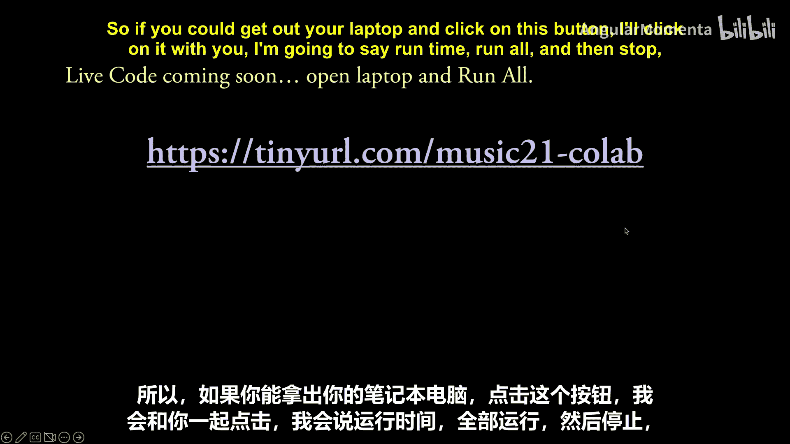

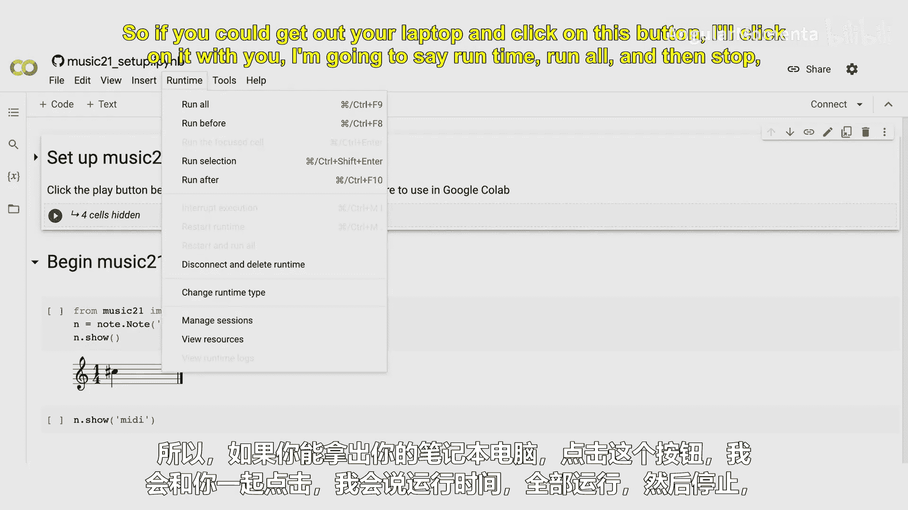

你们面前某处有教学大纲，去拿吧。我们不会逐行讲解。事实上，我甚至还没有给你们更详细的每日安排，因为这部分取决于今天有多少人来上课。人很多，大家都还算舒服（那边有点挤，但我们会想办法解决）。

你们会很高兴，这门课不需要买任何东西，除非你之前没有其中一些东西。我们将使用音乐21用户指南作为教科书，可能会学到第25章左右（我总是说1到30章，但可能到不了，也不能超过30章太多，因为后面还没写完，如果你想的话，可以作为项目的一部分写一些）。

为了让我能支持你、帮助你，你需要一台Windows或Mac OS笔记本电脑。我们将安装最新版本的Music 21（我相信是8.1版）。我眼睛下面的黑眼圈就是因为计划在今天之前发布9.0版，但还没出来。它有一些我们将要使用的新功能，我可能会在一两周内发布，你们是我的重点，然后我们会装上。所以Music 21版本8运行在Python 3.8上，版本9运行在3.10上，所以安装Python 3.10（或3.11），你会很高兴的。可能还需要一些五线谱纸和铅笔，因为在某些时候（除非你用平板电脑）很难在笔记本电脑上做笔记，我们有时会用到五线谱。

有四本推荐书籍，我很喜欢它们，但它们都是电子书。你可能考虑购买至少前两本，它们相当便宜，但我们真的不需要讨论这个。

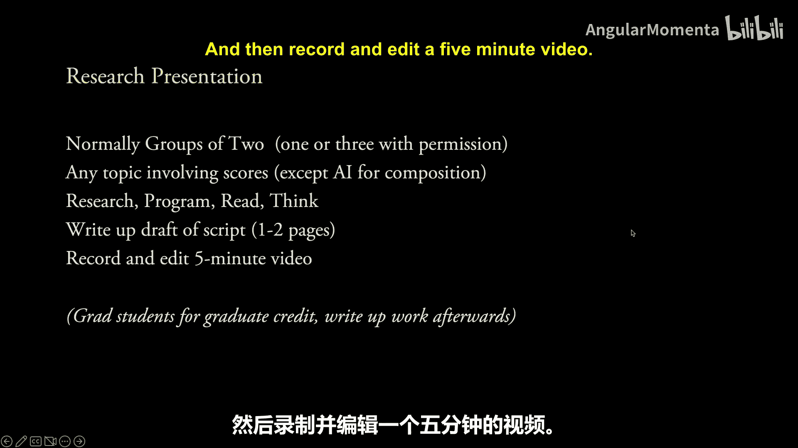

## 典型一周安排

我们进度很好。典型的一周安排是：在周三介绍一个特别的新主题（这只是学期中的情况），然后你们会得到一些阅读材料。其中一些可能需要在周五前完成，我们会尽量让周三到周五的时间更多地用于阅读和思考。假设主题是“容器”（我们刚刚谈过这个），如何将其表征为容器，有哪些不同的方式。我们就像现在这样引入一个新主题并思考它。在周五，我们会深入一些具体困难的事情，讨论为什么这种表征有效，那种不行，为什么你可能做出这种选择，我们会在课堂上做一些相关练习。通常在周五，你们会得到一个习题集。所以你们会在周末做那个。但在周末，你们还会得到一些异步内容。

事情是这样的：没人真正关心你课程的历史，但我还是要说一下。我们开始这门课时，是每周两次，每次一个半小时。然后新冠疫情爆发，很多事情转到线上，我做了很多视频录制，部分原因是我妻子和我在一个一居室的房子里同时上课，没有地方让我们教。所以我们做了一些异步内容。很多异步内容我很高兴你们永远不必再看了。你们当时都经历过，对吧？但其中一些实际上比课堂更好。因为有时候，偶尔，有些事情我可以用一种特定的技巧教你们，如果在课堂上，我会说“很好，现在你们知道怎么做了，我们继续，这是另一个技巧，我们继续”，而你们没有任何机会练习任何一个。所以有些事情用《芝麻街》风格是有用的：这是一个特定的事情，我花大约五分钟讲解，然后你们练习十分钟，然后另一个五分钟讲解，再练习十分钟，不知不觉中，你们有了一小时的讲座，却完成了大约三小时的习题集，而且是一题一题做的。那些内容还在。本学期大约有七次这样的情况。我保证，如果我不认为那是更好的方式，我就不会那样做。所以你们会在那里做一些工作，在周三上课前至少四五个小时完成，这样我可以快速抽查，这是在线做事情的一个好处，提交习题集。

然后我们会“解锁”工具。这是什么意思？意味着如果你正在做某事，比如我们在做和弦相关的事情，我会要求你们找出解决和弦某些难题的算法。你们将要做的很多事情，世界上已经有人解决了。我希望这不会太令人失望。我们在大多数课程中所做的大部分事情，比如结构工程学，都有人说已经解决了。我们是在学习自己动手做。到那时，我们将向你们展示一些已经存在的工具，它们将对你们“解锁”。也就是说，你们可以继续使用自己构建的工具，或者使用标准化的和弦操作工具。

然后我们会介绍下一个主题，并继续下去。这确实意味着你们有时会同时进行两个主题。我希望这不会太混乱。我会尽量让它尽可能清晰。

## 期末项目

那么，在学期末我们要做什么呢？是期末项目。我们班有点大，我可能会允许任何想要三人一组的人这样做，因为这里人数不少，但通常两人一组效果非常好。单人组真的很难，我发现超过三人的小组几乎总是有问题。我们将做一个期末项目。我过去常说任何关于计算音乐或音乐理论与分析或作曲类型的主题，只要涉及乐谱在计算机中的表征。现在我有一个例外：很多用于作曲的AI深度学习项目往往不如做这些项目的学生在本课程中做的其他项目成功，所以本学期我将不允许这样做，以尝试找出如何能在这方面做得更好一点。这只是我从经验中学习。

你们将花时间研究一个你们正在做的主题，编程所需的工具，阅读关于你们可能犯的错误，并进行思考。然后，我希望你们制作一个关于你们项目的视频，时长五分钟。我知道我是个严厉的教授，我本可以要求十分钟，那样会容易得多。但五分钟，你们必须，你们知道，保持警觉。所以，在那之前几天，我只想要你们脚本的草稿。我不在乎它有多乱，我只是想看到我不会在晚上11点半接到 frantic 电话说我们的软件都不工作了之类的。然后录制并编辑一个五分钟的视频。

## 课堂实践：使用音乐21

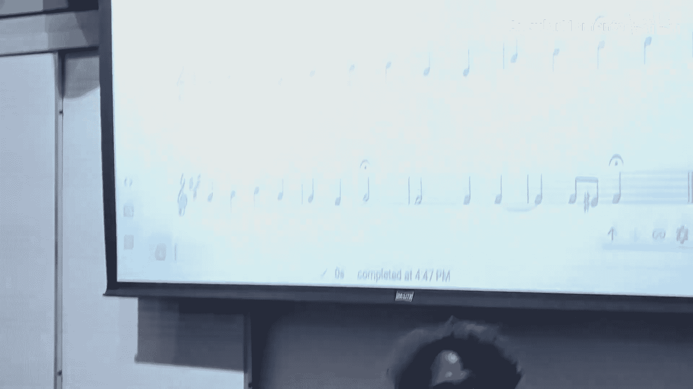

让我们回到实时编码。让我们开始做一些我们能做的事情。如果你不介意污染你的代码库，我已经导入了`from music21 import *`，应该已经在那里了。你们知道这个。谁没用过Jupyter notebook或类似的东西？请举手。好的，所以不需要做太多。我们输入一个新的代码单元格，把它移下来。所以，输入一个新的代码单元格，让我们确保如果我输入`Chord`并按Shift+Enter，会出来类似的东西。

很好，让我们获取一首巴赫的特定作品，我们在本课程中会经常使用它。我今年会少用一点，因为我们现在有更多替代选择。我们不想延续“巴赫就是一切”的刻板印象。但这首我们会常用。所以我们将变量`bach`赋值为来自music21语料库的某些东西，调用方法`parse`。我们可以直接输入`BWV66.6`。我不是魔鬼崇拜者什么的，666恰好是巴赫写过的最短的康塔塔，所以对我们来说是一个很好的例子。按Shift+Enter。这应该会加载。如果有什么不工作，这是作弊的时候，看看你的邻居，也许你打错了什么，或者拍拍他们。我们都在课堂上，我们都在这里只是为了互相帮助，对吧？你们会这样做的，你们周围的人很好。

那么，让我们显示它。第一次运行`show`总是比以后每次慢很多，希望不会花太长时间。你应该会在某处看到一个乐谱。现在你只会得到乐谱的第一页，这就是为什么我用这首，因为它只有一页长，很快你就会得到整个乐谱。

那么，让我们获取那个中音部。我们会说`alto = b.parts[‘Alto’]`是一种获取方式。然后，`alto.show()`看看有什么。中音部总是有点……像这样。你也可以通过数字获取声部，所以，谁知道在康塔塔中，四个声部从高到低是什么？女高音、女中音、男高音、男低音，很好。所以如果我们按数字顺序做，我们想获取中音部，那是第几个声部？2？1？是的，Python是零索引的。所以你会得到什么。那是第一部分，好的，好的猜测，好的，错误的猜测。我喜欢，我喜欢伟大的错误猜测，甚至比第一次就猜对更好。你会发现的一件事是，如果某物是计算机术语，我们就保持原样。所以我们不倾向于在管弦乐队中编号乐器：“嘿，17号乐器，做这个。”不。所以当我们那样做时，我们保持计算机术语，让它，你知道，零索引。然而，当我们处理音乐家可能知道的事情时，我们倾向于使用音乐家的方式。所以让我们获取女高音声部。这里是第0部分。让我们获取第4到第6小节。所以`.measures(4, 6).show()`。在Python中，由于零索引的方式，这应该会得到第五小节到第六小节。然而，小节编号是音乐家谈论的东西。是的，你们听说过。很好。当我问一个反问句时，比如“小节编号，我们知道音乐家……”，总是通过无畏地喊出来节省课堂时间。所以，既然音乐家知道第4小节是什么，我们就那样使用第4小节。所以是第4到第6小节。

很好，让我们开始操作乐谱。假设第4到第6小节，或者第5到第7小节。谢谢你。那是小节，那是音乐家认为的第4小节。所以在这首特定作品中，让我们回到作品开头。鼠标指着的这个小节是什么？是的，音乐家会说“弱起小节”。我们必须给它一个编号。所以我们喜欢什么编号？0。所以可以有一个第0小节。如果有弱起小节，第1小节将永远是音乐家认为的第1小节。所以让我们玩点别的。让我们随便玩玩乐谱。我们取女高音声部，获取第5小节。你也会看到我们的一些显示功能不知道如何显示正确的编号。如果你在MuseScore 4上，它现在会显示实际的正确编号。但让我们获取……让我们把那个F做标记。所以，如果我获取音符，我将按数字索引获取。所以我们将获取第5小节并获取上面的特定数字。那个F是第几个音符？喊出来。2，在这种情况下。音乐家不倾向于谈论……我猜我们确实说第二个音符。是的，那真的很令人困惑。所以在这种情况下，基本上，当我们使用方括号表示法时，我会把这个弄大一点。这有帮助吗？是的，我们会认为这里。所以我们会说`c`（我应该叫它`cSharp`，但那样你只会得到该行其余部分的注释），所以我们只叫它`c`，即使它是升C。`c.style.color = ‘red’`。然后显示整个女高音声部，我们在这里得到一些东西。我是半色盲，那里真的有一个红音符吗？好的，好的，好的。它在哪里？所以在这里，我们会为摄像机强调它。试图用激光指着它变得更红。现在，是的，这有点好玩，玩玩东西。

我们可能真正想做的一些事情。让我们取整首作品。我们叫它`bach`，对吧？索引得到了乐谱对象，让我们分析它的调。`analyze`是一个方法，所以我们这样调用它：括号。如果你跟着做了80%，但只是希望我稍微慢一点，然后你就能跟上，那会很有趣，因为大多数时候我们会比这慢。这只是学期开始的有趣部分。如果你从未见过括号或方括号，这可能是一门明年或下学期在做了更多编程之后要上的课，这可能更多是针对在家观看的摄像机前的人们。让我们确保我们只需要一点编程就能继续前进。好的，所以整首作品是升F小调。我们现在做什么？我试图早点强调，但我们要让这成为课堂上的一个避风港。我们总是检查我们的“胡说八道”计量表，对吧？这首作品是升F小调。看着这首作品，这有任何合理性吗？让我们看看低音部。更容易些。那看起来像A。我的意思是，它是三个升号，也许。也许。在结尾。我确定。升A，升C，哦，看起来它以升A大调结束。但也许作品的其余部分是小调，然后这只是终止式。所以对我来说，它通过了初步检查，可能是其他东西。但我们可以做的另一件事是，让我们分析一下小节。哎呀，我们得到`b.measures(0, 2)`。所以我们只获取弱起小节和前两个小节。我们分析这个开头的调。A大调。那感觉更符合开头。所以我们知道整首作品是升F小调，或者至少计算机这么认为。如果计算机是对的，而它开头是大调，我们接下来可能玩的一个合乎逻辑的事情是：它在哪里改变了？我们能做那个吗？我们能分析转调在哪里吗？我们不会做那个。让我们做点简单的事情。所以我们说音符，我用来获取特定音符。所以让我们看看有多少……音符在这首作品里。任何其他语言会是`.length`，`notes`，有多少音符？猜一下。0？这首作品里没有音符。我们从凯奇的《4分33秒》开始，以巴赫的《4分33秒》结束。现在，为什么没有音符？因为`bach`是一个乐谱。这都是关于表征的。我们目前在盒子里有盒子。乐谱没有音符。声部里有音符吗？不，声部里没有音符。声部有小节。小节里有音符。所以我们需要做的是：拿着盒子，让我们递归运行，像圣诞节的孩子一样，打开每一个盒子，找到里面的每一个音符。所以我们可以说，我们可以拿一个乐谱，我们可以说打开每一个盒子，对每一个盒子，给我音符，165。通过初步检查。让我们向上滚动。别让任何人去数这个。那看起来大约有165个音符，也是。是的，数量级对了。如果它说100万个音符，那就有问题了。如果它说0个音符，你知道有问题。所以我们总是在继续之前尝试做这种初步检查。

我要做的最后一件事，因为我在看时间。我作为教授只有一个好习惯：我真的对拖堂过敏。所以我们不会做这个，但我们会做……只是为了好玩。`bach.chordify().show()`。现在我们已将所有内容切换到“意大利香肠切片”模式。

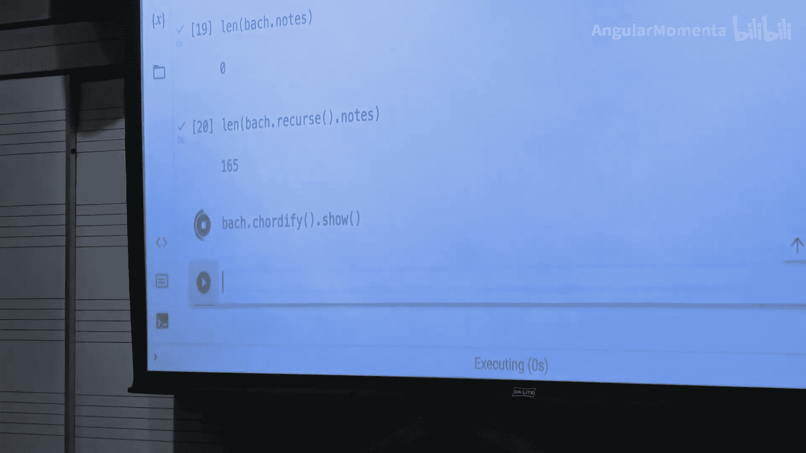

## 总结与展望

这些是我们将要做的部分事情。希望那很好，Cuthbert教授。现在这里是真正邪恶的Cuthbert教授：你们将忘记刚刚被给予的每一个工具。`analyze(‘key’)`对你们不可用。我会称之为“锁定”。它被锁在这个小柜子里。当你们写出自己相当不错的调性分析算法时，你们可以解锁这个。你们的可能更好，我可能会要求许可：“嘿，我们能用那个吗？”这是一个相当不错的，但你们可能写出更好的。当你们写出自己的和弦化算法时，`chordify`将对你们开放。我们会给你们一些提取特定小节的工具，那需要很多工作，但就我们的智力发展而言，这听起来有点无聊。但想出能够将乐谱和弦化的工具，我们会看到由此产生多少困难的事情。

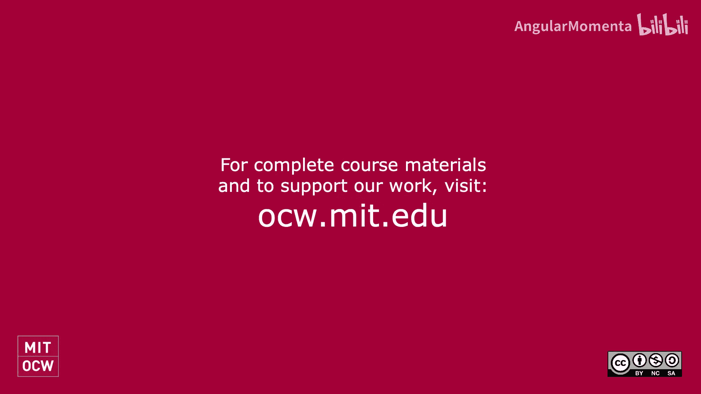

时间差不多了。所以我们会在其他课上讨论。正如我周五所说，我想认识你们，想让你们能够更多地交谈，而不仅仅是今天这样滔滔不绝地讲我们本学期可能做什么，我很高兴你们在这里。人数看起来很棒。你们周五都回来，确保你们都注册了，我很高兴班上有每个人。