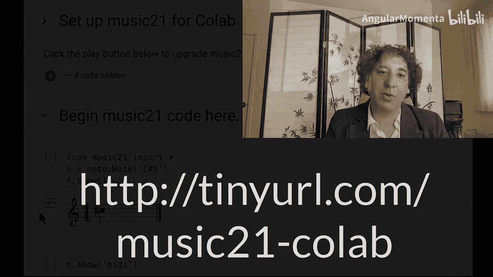
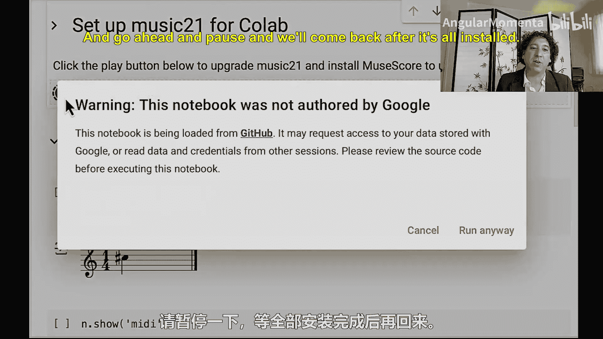
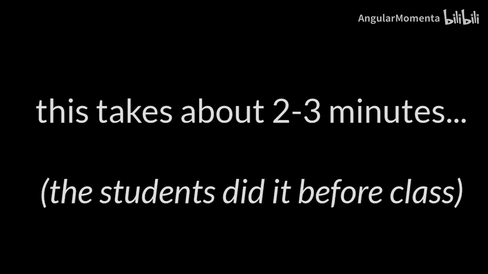
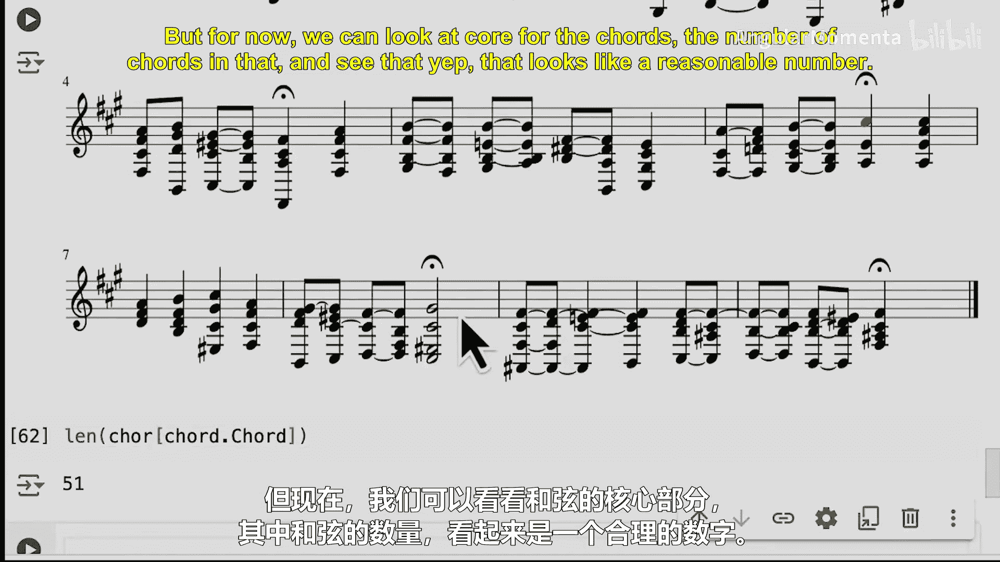

#  003：面向OCW学习者的music21编程入门教程 🎵


在本节课中，我们将学习如何使用Python的music21工具包进行基础的乐谱加载、查看和简单分析。我们将通过一个巴赫的众赞歌实例，逐步了解如何操作乐谱数据。


---



## 概述

我们将从设置在线编程环境开始，然后学习如何加载一个乐谱、提取特定声部、查看小节与音符，并对音乐进行简单的调性分析。课程的核心是让初学者理解如何通过代码与音乐数据进行交互。





## 环境设置与乐谱加载

首先，我们需要一个无需本地安装即可运行Python和music21的环境。我们将使用Google Colab。

以下是设置步骤：
1.  访问提供的Colab笔记本链接。
2.  点击“播放”按钮运行第一个代码单元。这会安装最新版本的music21及相关软件。
3.  安装完成后，即可在后续单元中编写和运行代码。

环境准备就绪后，我们开始编写代码。首先，需要导入music21工具包。

```python
from music21 import *
```

现在，我们可以加载一首乐曲。我们将使用巴赫的众赞歌BWV 66.6。

```python
bach = corpus.parse('bach/bwv66.6')
```

我们可以使用`.show()`方法来查看整首乐谱。

```python
bach.show()
```

## 操作乐谱的各个部分

上一节我们加载并查看了整首乐谱，本节中我们来看看如何提取和操作乐谱中的特定部分，例如单个声部或小节。

乐谱由多个声部（Part）组成。我们可以通过声部名称或索引来获取它们。

以下是获取声部的方法：
*   **通过名称获取**：`bach.parts[‘Alto’]`
*   **通过索引获取**：`bach.parts[0]` （索引从0开始）

例如，获取女高音（Soprano）声部并查看其前几小节：

```python
sopr = bach.parts[‘Soprano’] # 或 bach.parts[0]
sopr.measures(3, 5).show() # 显示第3到第5小节（包含）
```

我们还可以深入到具体的小节和音符。例如，获取女高音声部第5小节的第3个音符（索引为2），并将其颜色改为红色。

```python
note_c = sopr.measure(5).notes[2]
note_c.style.color = ‘red’
sopr.show() # 再次显示，可以看到该音符已变为红色
```

## 基础音乐分析

在学会了如何访问乐谱中的元素后，我们可以开始进行一些简单的音乐分析。首先，让我们分析整首乐曲的调性。

使用`.analyze(‘key’)`方法可以估算乐曲的调性。

```python
estimated_key = bach.analyze(‘key’)
print(estimated_key) # 例如：F# minor
```

**重要提示**：计算机分析的结果需要经过音乐直觉的“嗅觉测试”。例如，虽然分析结果可能是升F小调，但乐曲开头听起来可能更像A大调。我们可以针对乐曲的特定段落进行分析验证。

```python
opening_measures = bach.measures(0, 2) # 获取前奏及第1-2小节
opening_key = opening_measures.analyze(‘key’)
print(opening_key) # 可能输出：A major
```

## 遍历与统计乐谱元素

有时我们需要统计乐谱中的元素数量，例如音符总数。由于乐谱是分层结构（乐谱>声部>小节>音符），直接统计需要特殊方法。

如果我们错误地尝试`len(bach.notes)`，可能会得到0，因为乐谱对象本身不直接包含音符。

以下是两种正确的统计方法：
1.  **手动深入路径**：`len(bach.parts[0].measure(2).notes)` （仅统计特定声部特定小节的音符）
2.  **使用递归遍历**：`len(bach.recurse().notes)` （递归打开所有层级，找到所有音符对象）



```python
total_notes = len(bach.recurse().notes)
print(f”乐曲中大约有 {total_notes} 个音符。”)
```

## 和弦识别与课程学习模式介绍

最后，我们尝试一个更高级的功能：从旋律中识别和弦。这可以通过`.chordify()`方法实现，它将各声部垂直对齐的音符组合成和弦。

```python
chordified_score = bach.chordify()
chordified_score.show()
print(f”识别出的和弦数量：{len(chordified_score.recurse().chords)}”)
```

需要指出的是，初始的和弦识别结果可能包含大量经过音等，听起来不够理想。在本课程中，我们将学习如何优化这些分析。

**本课程的特殊学习模式**：许多分析功能（如`chordify`, `analyze`）在开始时会被“锁定”。学生需要通过完成作业或课堂练习，自己设计算法来实现这些功能的核心思想。在理解其原理后，才能“解锁”并使用music21内置的优化版本。这种模式旨在从零开始构建知识体系。

## 总结

本节课中我们一起学习了使用music21进行计算机辅助音乐分析的第一步。我们涵盖了从环境搭建、乐谱加载、声部与音符操作，到基础的调性分析和元素统计。记住，计算机分析是一个工具，其结果需要结合音乐家的听觉与知识进行判断。对于OCW学习者，建议尝试寻找学习伙伴共同探讨，这能更好地还原线下课程的协作体验。


很高兴你能选择探索计算机音乐理论与分析这个迷人的领域，期待在后续课程中与你再见。😊