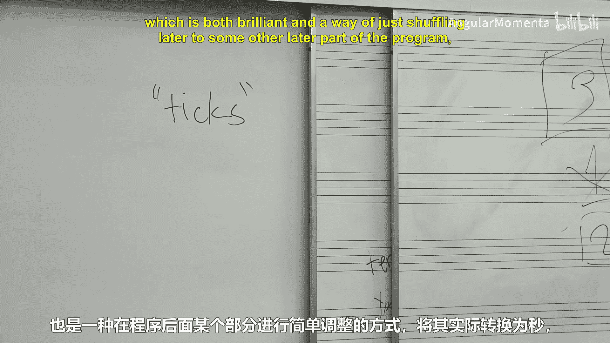

#  004：音符、音高与时长表示法 🎵

在本节课中，我们将探讨音乐计算中一个基础但至关重要的问题：如何定义和表示音乐的基本元素，特别是音符、音高和时长。我们将从一些看似简单的问题出发，揭示其背后复杂的定义和表示挑战，并学习如何将这些概念转化为计算机能够理解和处理的形式。

---

## 音符的定义 🤔

上一节我们引入了课程主题，本节中我们来看看“音符”这个最基本的概念。什么是音符？我们通常凭直觉理解它，但为了向计算机解释，我们需要一个精确的定义。

以下是课堂上同学们提出的一些定义：
*   一个具有音高和时长的东西。
*   一个“击打某物”的实例的表示。
*   任何具有音高的事物。
*   一个被构想出的单一音高和单一时长。

然而，这些定义在面对具体例子时都可能遇到挑战。例如，一个持续滑动的音包含无数个音高，一个和弦由多个音高同时发声构成，而一个拍手声可能没有明确的音高。这些情况迫使我们思考：**一个定义的有效性高度依赖于我们使用它的目的**。在计算音乐学中，没有一种表示法能完美应对所有情况，我们需要根据具体任务选择合适的表示方法。

---

## 时长的表示法 ⏱️

既然我们讨论了音符定义的复杂性，接下来我们聚焦于音乐时长在计算机中的表示。我们假设使用Python语言进行思考。

我们可以用多种方式来量化一个音符的持续时间：

*   **秒（Seconds）**: 使用浮点数（`float`）表示，例如 `1.5` 秒。这是物理时间的直接度量。
*   **拍（Beats）**: 与乐曲的速度（Tempo）相关。例如，在速度为60 BPM（每分钟60拍）时，一拍等于1秒。
*   **相对于小节的比例（Fraction of Measure）**: 例如，一个音符占据小节的2/3。这与“拍”的概念紧密相关，但并非总是等同。
*   **音符类型及其修饰符（Note Type and Modifiers）**: 例如“八分音符”、“附点四分音符”、“三连音中的八分音符”。这更接近乐谱的思维。我们可以用字符串（如 `"quarter"`）或带有属性的对象来表示。
*   **刻（Ticks）**: 一种将时间离散化的方法，定义每四分音符包含多少刻（TPQ, Ticks Per Quarter-note）或每秒多少刻。MIDI文件格式就广泛使用刻作为时间单位。

那么，哪种表示法最有用呢？答案依然是：**取决于上下文**。
*   音频工程师关心**秒**。
*   乐谱排版员关心**音符类型和拍号**。
*   许多音乐计算软件（如我们将使用的Music21）内部使用**“四分音符长度”（Quarter Length, QL）** 作为基准单位，其他时长都表示为它的倍数（例如，一个八分音符的QL是0.5）。

---

## 单位转换与算法 🧮

不同的表示法之间需要转换。例如，如何将基于乐谱的时长（如“1.5个四分音符长度”）转换为实际的秒数？这引出了我们第一个简单的算法。

要将“四分音符长度”（QL）转换为秒，我们需要知道两个关键参数：
1.  **速度（Tempo）**: 通常以“每分钟拍数”（BPM）表示，是一个浮点数。
2.  **拍号（Time Signature）**: 它定义了“每四分音符有多少拍”（beats per quarter note）。这是一个需要从拍号推导出的值。

**公式**如下：
`秒数 = QL * (60 / Tempo_BPM) * Beats_Per_Quarter_Note`

但是，从拍号（如 `4/4`, `6/8`, `2/2`）推导 `Beats_Per_Quarter_Note` 本身就是一个算法。例如：
*   `4/4`： 通常1个四分音符 = 1拍，所以比例为 `1`。
*   `6/8`： 通常将附点四分音符视为1拍，而1个四分音符是2/3拍，所以比例为 `2/3`。
*   `2/2`（Cut Time）： 二分音符为一拍，四分音符为半拍，所以比例为 `0.5`。

一个常见的启发式算法是：如果拍号分子能被3整除（且分母通常是8），则按复合拍子计算，否则按单拍子计算。但总有例外（如 `3/4`），这体现了音乐规则中文化语境和例外情况的重要性。

另一个有趣的算法是计算附点音符的时长。一个带有 **n** 个附点的音符，其时长是原始音符的 `(2^(n+1) - 1) / 2^n` 倍。例如：
*   0个附点： `(2^1 -1)/2^0 = 1/1 = 1` （原时长）
*   1个附点： `(2^2 -1)/2^1 = 3/2 = 1.5`
*   2个附点： `(2^3 -1)/2^2 = 7/4 = 1.75`

---

## 总结 📚

本节课中我们一起学习了计算音乐学的基础第一步：定义和表示音乐数据。
1.  **音符的定义是情境性的**，没有绝对正确的答案，取决于我们想要用计算机做什么分析。
2.  **音乐时长有多种表示方式**（秒、拍、音符类型、刻等），各有其适用的场景。
3.  在不同表示法之间进行**转换需要算法**，这些算法封装了我们的音乐知识（如拍号的含义、速度的转换）。
4.  为计算机编程处理音乐时，**为事物命名、考虑边界情况（如奇怪的拍号、复杂的连音符）和编写测试用例**至关重要。

这些思考为我们后续使用工具（如Music21）进行实际的音乐分析打下了坚实的基础。在接下来的课程中，我们将把这些概念付诸实践。