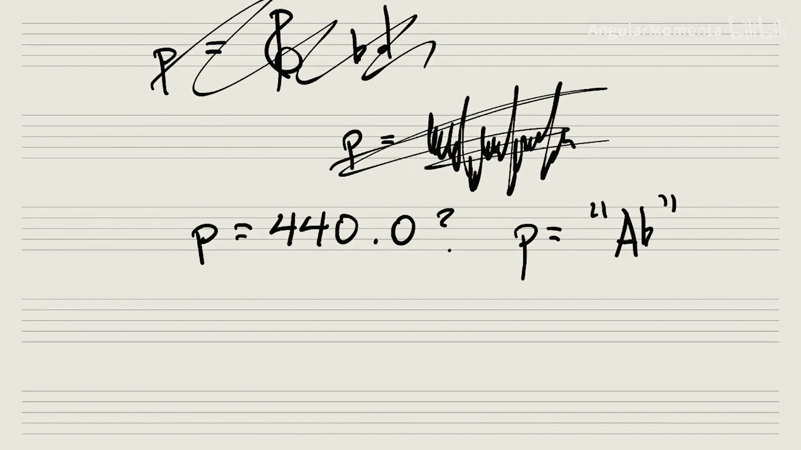

#  005：音高表示法入门 🎵

在本节课中，我们将要学习如何在计算机上表示音乐对象，特别是最基础的元素之一：音高。

## 概述

我们首先需要思考的核心问题是：如何在计算机上表示音乐对象。让我们从最基础的元素之一——音高——开始。

## 音高表示的基本思路

在基于乐谱的课程中，我们可能用乐谱来表示音高，并在上面书写音符。但这在计算机上并不直接可行。

那么，我们如何将音高转化为计算机可以处理的形式呢？一种方法是获取一个频率值，并将其赋值给一个变量。然而，具体如何操作并不明确。也许我们可以将一个代表特定频率的数字赋值给一个变量，或者用一个代表音高的字符串来赋值。

## 思考练习

以下是关于如何初步在计算机上表示音高的一个简单练习。

首先，请花五分钟时间（不要超过），简要记下你最初会如何非常简单地（naively）在计算机上表示音高。

## 总结

本节课中，我们一起探讨了在计算机上表示音乐对象的起点——音高表示法。我们思考了从乐谱到计算机变量的转换思路，并完成了一个初步的构思练习。理解这个基础是后续构建更复杂音乐分析模型的关键。