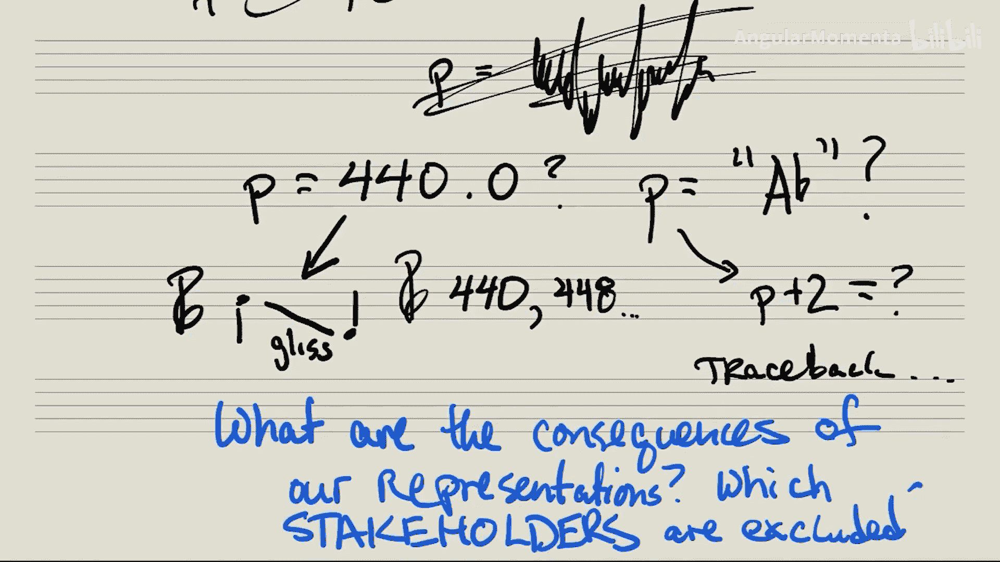

**计算音乐学与分析：1.1：音高表征：优势、劣势与利益相关方** 🎵

在本节课中，我们将探讨音高在计算机中的不同表征方式，并分析每种方式的优缺点及其对不同利益相关方的影响。

大家好。希望你已经花了几分钟思考过如何表征音高。现在，我们将回到正题。

那么，我们选择的音高表征方式会带来什么后果？这就是我们现在要研究的内容。

假设我们决定使用**数值表征**，例如 `P = 440`。我们该如何用它来表示像滑音（Glissando）这样的连续音高呢？由于我们只有一个数字，或者仅从演奏者的角度思考，我们如何将一个像440这样的数字，转换成演奏者能在五线谱上看到并演奏出来的东西？难道我们只是拥有一长串数字吗？

也许**字符串表征**（如“A4”）会稍好一些。但我们又该如何操作它呢？`P + 2` 意味着什么？我们是否会遇到一大堆Python错误，以至于永远无法以这种方式进行运算？

因此，在第一个小组讨论中，我们将思考：选择特定表征方式会带来什么后果？换句话说，哪些应用能通过某种表征方式实现，而另一种却不能？

另一种表述方式是：根据我们选择的表征方式，哪些利益相关方被包含在内，哪些被排除在外？

接下来，请思考三种在计算机中表征音高的不同方式。然后，针对每一种方式，思考以下问题：
*   这种方式擅长做什么？
*   这种方式不擅长做什么？
*   涉及哪些利益相关方？利益相关方可能是音乐家、程序员、唱片制作人，或者更具体的群体，如摇滚乐手与古典乐手等。
*   你所选择的表征方式，包含了哪些利益相关方，又排除了哪些？

---

本节课中，我们一起学习了音高表征的重要性。我们认识到，不同的表征方式（如数值、字符串）各有其优势和局限，它们影响着我们能进行的计算分析，也决定了哪些音乐从业者或参与者能有效地使用这些系统。理解这些是进行有效计算音乐分析的基础。