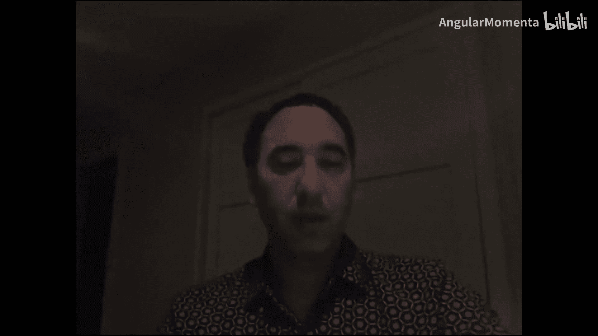
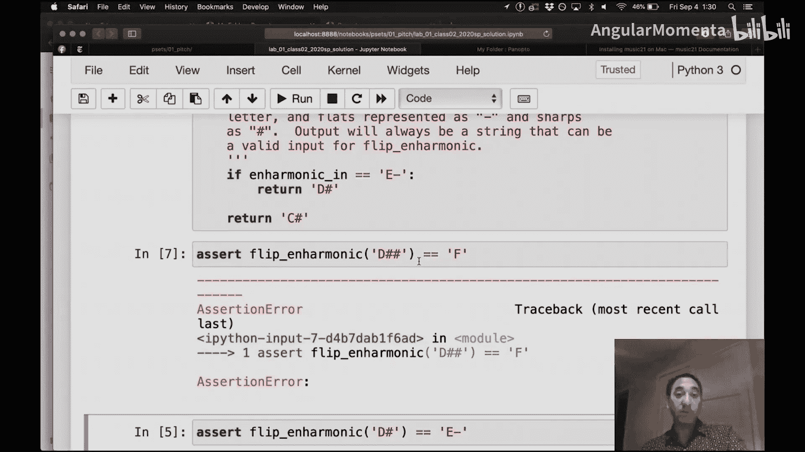
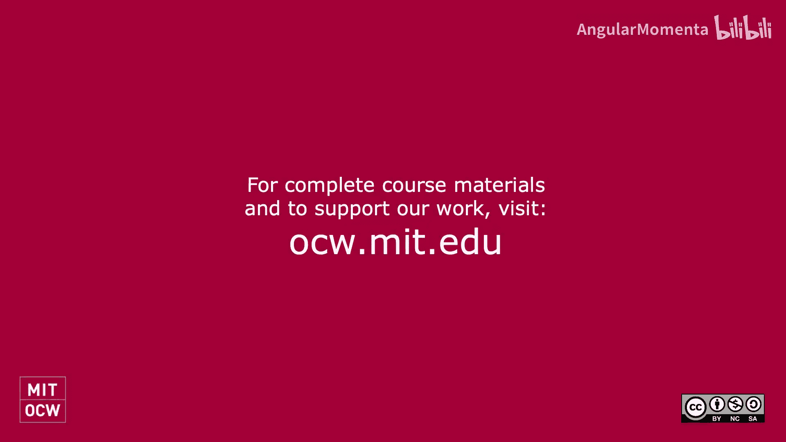

#  007：如何着手解决问题集 🎵




在本节课中，我们将学习如何着手完成本课程的问题集。我们将了解问题集的典型结构、如何理解题目要求、如何编写和测试代码，以及如何通过思考边界情况来完善你的解决方案。

---

## 概述

问题集是课程的重要组成部分，旨在帮助你应用所学的计算音乐理论。通常，你会收到一个明确的任务描述，需要编写一个程序（或“例程”）来完成特定功能。本节将引导你理解问题集的结构，并提供一个有效的解决框架。

## 问题集的结构

上一节我们介绍了课程背景，本节中我们来看看一个典型问题集包含哪些部分。

以下是问题集通常包含的几个要素：

1.  **任务描述**：清晰说明你需要实现的功能。例如：“编写一个例程，接收一个代表音高的字符串（用减号‘-’表示降号，用井号‘#’表示升号），并返回该音高的一个等音音高字符串。”
2.  **输入输出规范**：明确说明输入数据的格式、有效性以及输出的要求。例如：“你只会收到有效的输入。如果有多个有效的等音音高，你可以返回任意一个，但最多到重升或重降。”
3.  **函数签名**：给出你需要编写的函数名称、参数及其类型。例如：`def enharmonic(pitch: str) -> str:`。
4.  **文档要求**：强调代码需要良好的文档和可读的变量名，因为代码是写给人看的，而不仅仅是给计算机执行的。
5.  **示例测试用例**：有时会提供一两个简单的测试用例来帮助你起步，例如：`assert enharmonic(‘G#’) == ‘Ab’`。

## 如何开始解决问题

理解了问题集的结构后，我们现在来看看具体的解决步骤。

首先，仔细阅读任务描述和规范。用你自己的话复述一遍任务，确保完全理解。例如：“这个函数接收一个音高字符串，返回它的一个等音音高。”

接着，你可以从一个非常简单的实现开始。即使你不擅长编程，也可以先写一个能处理少数情况的版本。例如：

```python
def enharmonic(pitch: str) -> str:
    if pitch == ‘C#’:
        return ‘Db’
    elif pitch == ‘D#’:
        return ‘Eb’
    else:
        return ‘C#’ # 这是一个占位符，显然不总是正确
```

然后，运行提供的测试用例（如果有的话），检查你的代码是否能通过。

## 思考与完善方案

初步实现后，最关键的一步是主动思考和完善你的方案。

教授通常不会提供所有复杂的测试用例。作为课程思考过程的一部分，你需要自己考虑各种“边界情况”。例如：

*   输入 `‘E#’` 应该返回什么？（它等于 `‘F’`）
*   输入 `‘B#’` 呢？（它等于 `‘C’`）
*   如何处理重升（如 `‘F##’`）或重降（如 `‘B–’`）？
*   你的代码是否能处理所有有效的音高表示？

通过思考这些情况，你会发现自己最初代码的不足，从而需要重构或重写它。编写自己的测试代码来验证这些边界情况是一个非常好的习惯。

## 总结





本节课中我们一起学习了如何着手解决计算音乐学的问题集。我们了解了问题集的典型结构，从理解题目、编写初步代码，到通过思考边界案例来测试和完善解决方案。记住，编写清晰、文档齐全的代码与找到正确答案同样重要。主动思考“教授可能会用哪些测试来挑战我的代码”是获得高分的关键。