#  008：乐谱与音乐表示法入门 🎵

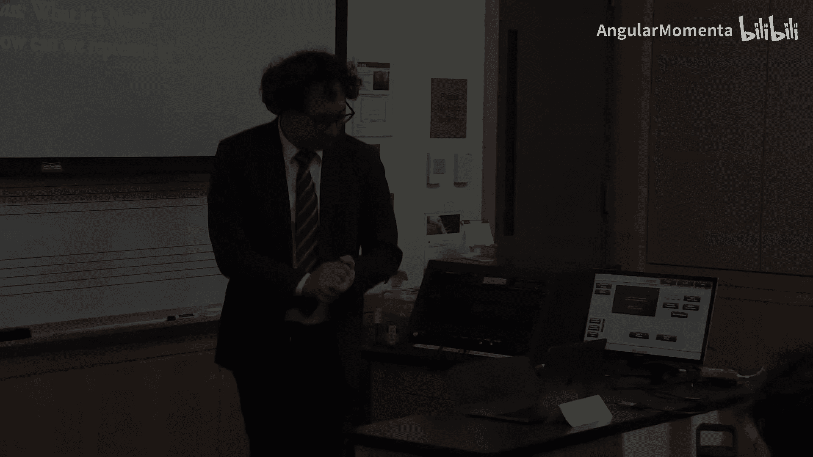

在本节课中，我们将要学习如何为计算机表示音乐。我们将探讨“音符”这一基本概念的复杂性，回顾不同的音乐记谱法，并思考如何在有限的数字空间（如字节）内高效地编码音乐信息。我们还将了解两种主要的计算机音乐表示模型，并讨论它们各自的优缺点。

## 回顾：什么是音符？ 🎶

上一节我们介绍了课程的基本框架，本节中我们来看看“音符”这个看似简单、实则复杂的概念。在周五的课程中，我们深入讨论了“什么是音符”这个问题。让我们花点时间回顾一下，因为上周五有些同学不在场。

当我们谈论“什么是音符”时，有哪些复杂之处？请快速举手或直接说出来。

*   **音高和时值**：一个音符是否需要音高？是否需要时值？
*   **连音与连奏**：你无法判断音符是连奏的。更准确地说，你无法判断那是一个长音符还是四个用连线连接起来的音符。这取决于我们是将乐谱本身还是将我们听到的声音作为定义音符的领域。
*   **装饰音**：我们讨论过颤音和震音。在标准乐谱中，写一个震音需要多少个音符？答案是1个。写一个颤音需要多少个音符？答案是2个。那么一个震音实际包含多少个音符呢？非常多，尽可能多的音符。

所以，这些不同的表现形式让“音符”的定义变得复杂。今天我们将不只讨论“什么是音符”，还要探讨如何为计算机表示一个音符或其他音乐元素。

## 编码挑战：在一个字节内表示音符 🔢

现在，我们来做一个思维练习。你有一个字节。一个字节有多少位？8位。很好。你有8个可以放置1或0的位置。

我想让你尝试编码一个音符。在一种常见的定义中，音高和时值是音符的两个基本组成部分。请尝试**在一个字节内编码一个音符**。

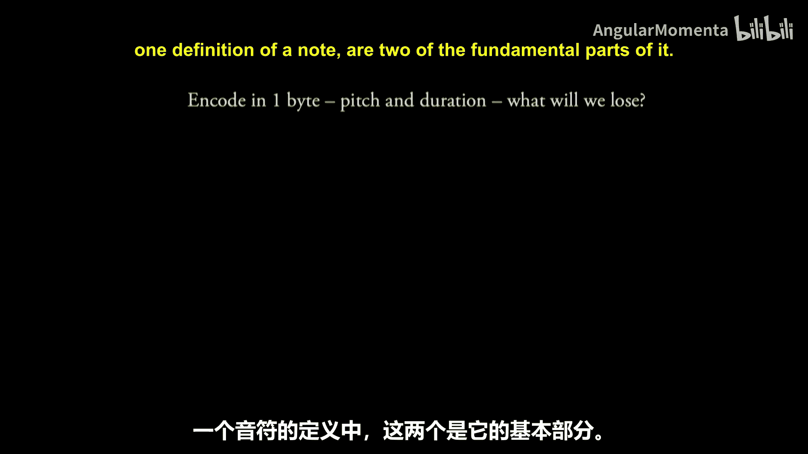

然后，讨论一下你为了做到这一点，不得不决定**不表示哪些信息**。我希望你们两人一组进行讨论，时间大约三分钟。

---

好的，让我们集中起来。我们从字母表中间开始，上次是后面。哪一组同学的名字在字母表末尾？我们没有Z。从Y开始？Vanessa和Adam，你们先来。你们决定编码什么？又决定在哪些方面做出妥协？

> 我们认为保留音高信息比时值信息更重要。

所以，这是一个选择。尽管我提到了这两样东西，但也许其中一样比另一样更重要。很好。

按字母表倒序，接下来是Vincent和Jake。你们呢？

> 我们首先认为音高组是最重要的，所以我们决定优先编码12个离散的半音（西方音高）。

好的，所以我们决定限制在西方音高，这已经是一个妥协，失去了所有美妙的微分音。我们说需要12个。那么编码12个不同的东西需要多少位？我们用手指数一下。我看到很多人伸出4根手指。为什么是4？有人解释一下吗？

> 2的4次方是16，而2的3次方是8。8小于12，16大于等于12。因此我们需要4位。

所以我们需要4位来表示音高。这是“音级”吗？每个人都知道这个术语吗？这不是所有音乐理论第一学期都教的术语。它大致是指将C编码为0，C#或Db编码为1，D编码为2，等等。我们不太关心C##或Ebb。所以我们将用4位来表示音级。

其他组有做类似事情的吗？Jason和… 好的，相当多组。我们看看Phil和Angelica这组。你们用剩下的位做了什么？

> 我们决定编码时值。

那么用剩下的位可以编码多少种时值？16种。你们选择了编码哪些时值？我们继续听听Lila和John这组。

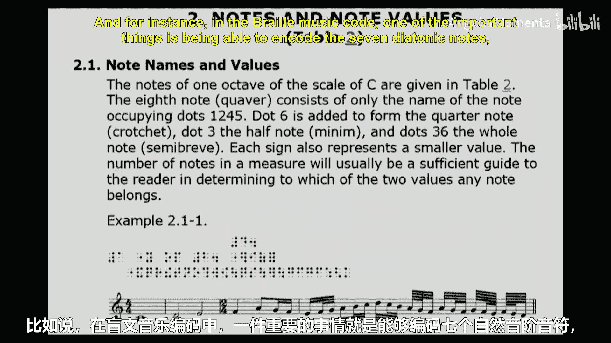

> 我们可以编码全音符、二分音符、四分音符、附点四分音符等等。

解释得再详细点。你们可以有全音符、二分音符、四分音符和八分音符作为基础。那么如果只到这里，需要多少位？只需要2位，因为2的2次方是4。然后，如果还想编码是否有附点，那需要另加1位吗？所以总共是3位。如果我们说再加一个，凑成16种时值，会有什么问题？我们能把它塞进2位（4种可能）里吗？不能。所以一旦你决定要能编码十六分音符，你不如继续编码三十二分音符、六十四分音符。我们想编码一百二十八分音符或二全音符吗？两者都不常见。所以我们在一些非常不常见的东西上稍微浪费了一些空间，但我们得到了附点。

另一种方法是只以十六分音符为基础。然后你可以有十六分音符的倍数。所以基数是十六分音符。然后，如果你有数字2或1，你会得到… 也许0代表一个十六分音符？或者你可能会想要能够表示零时值。如果0是一个十六分音符，那么1就是两个十六分音符（一个八分音符）。然后你可以处理附点之类的东西。用这种方式，你可以编码最多包含16个十六分音符的东西，也就是一个全音符。这是非常棒的方法。但这确实意味着我们要花相当多的精力来处理一些有点不寻常的情况。

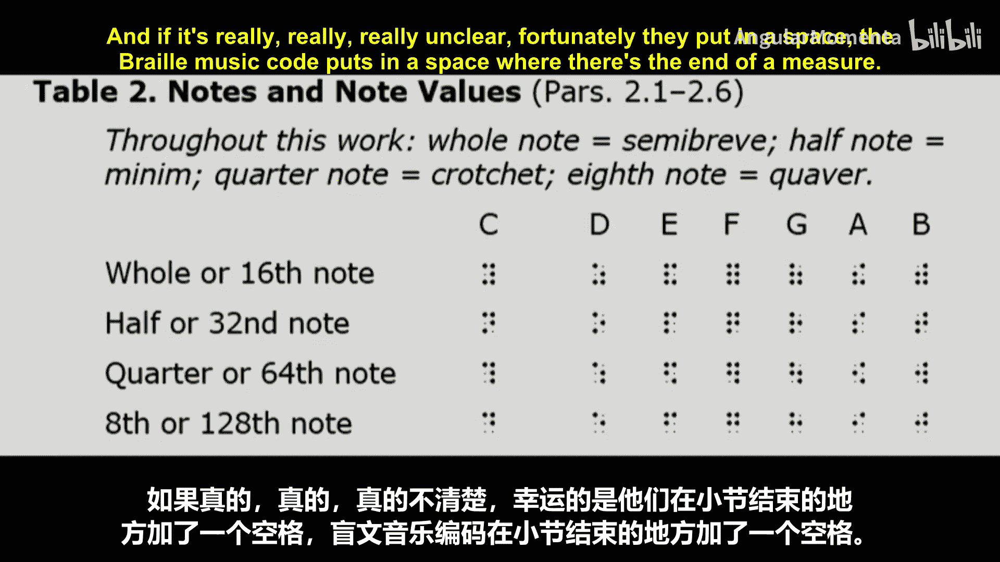

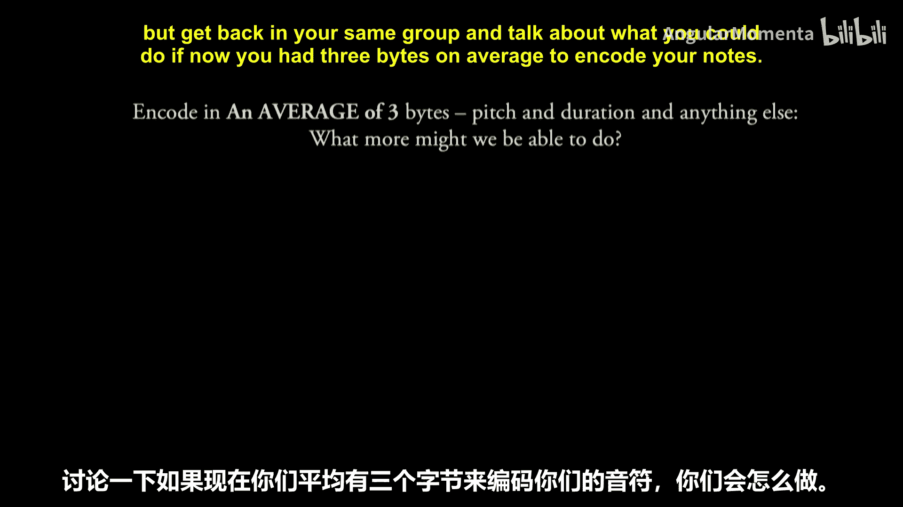

还有人有其他我们没怎么谈到的方法吗？

> 我们认为编码八度信息也很重要。所以我们用了6位来编码64个MIDI音符编号，然后用2位编码时值。

64个MIDI音符，覆盖了钢琴88个键中的大部分。你们决定只做两端的，把中间的省略了？好的。然后用2位表示时值。所以我们可能得到全音符、二分音符、四分音符、八分音符。没有更多了。很好。

超级棒，这是一个很好的思维练习。我们为什么要这样做？因为有些人使用… 这是最近最令人困惑的幻灯片之一。

## 高效编码的动机与历史 🕰️

有许多人对甚至不是一个字节，而是6位的编码非常感兴趣。例如，在**盲文音乐代码**中，一个重要的事情是能够编码七个自然音阶音符，因为自然音阶音符往往更常用。也许在其他地方，有东西告诉你调号。这样，七个自然音阶音符和8种时值用6位表示。他们是怎么做到的？他们如何得到8种时值？他们进行了复用。他们说，如果你在一个一百二十八分音符上，你不太可能跳到一个全音符。因此，在上下文中，你可以利用“全音符后紧接着六十四分音符非常罕见”这一事实。如果实在非常不清楚，幸运的是，盲文音乐代码在小节结束处留了一个空格。所以如果你真的不清楚，比如“我想知道这些是否都是一百二十八分音符？不，不，小节结束了。好吧，它们可能是长音符。”

所以，这是你可能考虑高效编码的原因之一。在那里丢失了很多信息。

我不想在这上面花太多时间，但请回到你们相同的小组，讨论一下如果现在**平均有3个字节**来编码你的音符，你能做什么。这样，如果我们有一个典型的乐谱（我让你们思考一下典型乐谱是什么样子），有时你可以用多一点，有时用少一点。所以讨论一下，不需要像这样想出一个完整的表示法，只需要想想你可能会添加哪些东西。

---

好的，让我们回来。我们用这巨大的3字节空间做了哪些以前做不到的事情？我们按顺序来，你可以说“过”，但我们从第二排开始，从左到右。

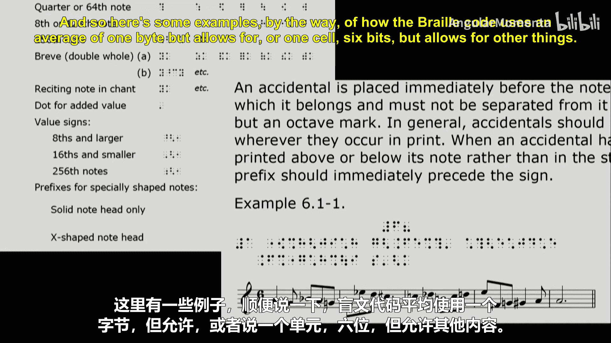

> 我们不再省略八度信息了。

好的，很好，大家都不再省略八度了。

> 附点。

好的，我们把附点加进去了，很好。

> 更好的发音法。

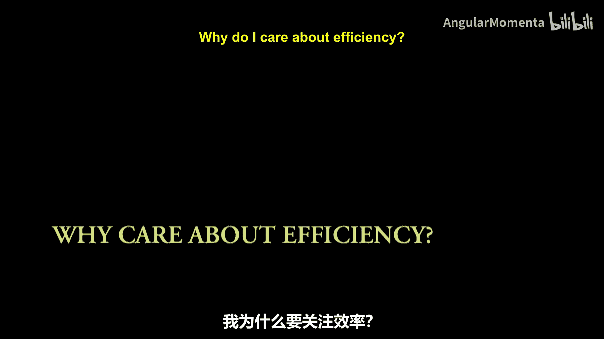

发音法。哦，是的，每个音符都需要发音法吗？不需要。所以这就是“平均”可能起作用的地方。你可能需要某种标志，某种条件，表明还有更多信息要来，然后你可以使用额外的空间。很好的发音法，还有其他吗？

> 力度或音量。

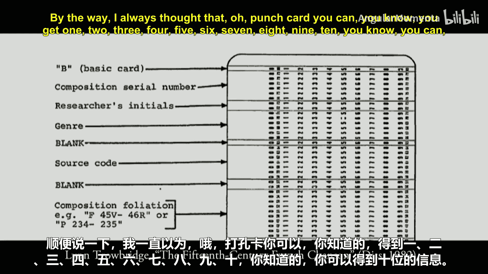

顺便说一下，万一我什么时候忘了提，计算机音乐领域的很多人把力度或音量称为“速度”。这确实告诉你，他们首先想到的是钢琴，因为这是你击键的速度。在单簧管上，你吹得多快并不会让它更响。但速度、力度、音量，好的，继续。

> 可以做类似你刚才说的事情，比如如果一个音符的音域或时值非常极端，那么你就说“这是不寻常的，有后续信息”。

是的，所以这些可能是小标志。大家觉得标志看起来… 是的，标志看起来更好。好的。

还有其他选择吗？继续。

> 我认为… 也许是拍号。

哦。它可以用… 编码。音乐的一半已经完成了。是的，信息不一定与它们存储在一起。实际上，我做了… 我把这个幻灯片上有的而另一个幻灯片没有的东西放进去，因为… 我想也许拍号可以放进去。调号。其他放在乐曲开头的东西，乐曲开头还有什么？大声说出来：调号、拍号、速度、曲名、元数据。曲名。元数据，非常重要。谁写的？元数据，是的，很好。

快速过一下前排。如果你们有什么想补充的，我们继续。

> 连音。

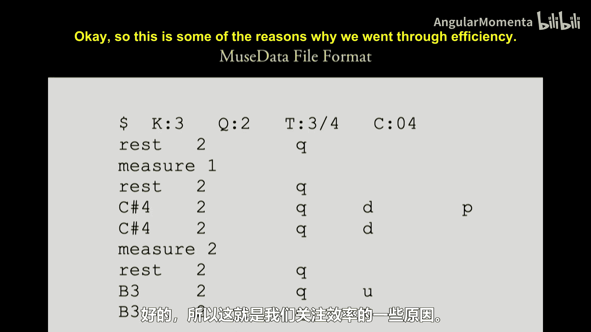

好的。那让你可以构建很多东西。Jordan和Misha，有什么吗？

> 震音。

震音，是的。我在想… 如果不是三连音，它的泛化是什么？有人知道四连音或二连音的术语吗？更常见的是英式发音的“二连音”。好的，还有其他吗？

我们为什么想要？这里有一些例子，说明盲文代码如何使用平均1个字节（或者说1个单元，6位），但允许其他东西。所以如果你有临时记号，我们可以添加特定的标记来表示“嘿，接下来还有别的东西，查一下这个扩展标记是什么意思”。或者有时有一个符号可以用来表示“嘿，你可能认为我全是三十二分音符，我可能会跳到十六分音符，但实际上，我要一直跳到二分音符之类的东西”。所以有一些警示符号，连音线之类的东西也可以放进去。

## 从高效到丰富：如果我们有更多空间呢？ 💾

再想一下，如果你**每个音符平均有大约1兆字节**，你能做什么以前做不到的事情？那是100万字节。人们一直在思考这个问题，你可能已经做过了，甚至没有意识到。你今天可能已经使用了每音符1兆字节的编码。我知道John用过。就是… 有点像不同的朋友… 音符输出的特征，或者是否有立体声。立体声/单声道声音。是的，你得到了保真度，音符的精确音频波形。你可以编码确切的… 当你直接能听到时，为什么需要编码这是升C百分比？你还可以在不损失保真度的情况下编码… 单声道的事情，你编码的是特定乐器的精确演奏方式，你失去了通用性，因为你编码的是特定作品的一次表演，而不是每一次表演。但也许你可以用1兆字节加上平均3个字节，同时存储音符本来应该是什么。这样，我们就能两全其美。

## 为什么关心效率？历史视角 📜

我为什么关心效率？部分原因是我们正处于一个可以开始存储大量音符信息的阶段。如今，我们大多数人对流媒体高清或4K视频，或者一小时消耗吉字节（之前我说百万，是十亿）数据看电影的概念已经习以为常。那么，如果我们能在音符中多存储一点东西，为什么还要在意呢？这几乎完全基于历史。这是最早的音乐作品编码之一，来自1982年的论文。但这可以追溯到60年代等等。我们是从穿孔卡片开始的。打孔卡片需要很长时间。所以你的编码越高效，需要的卡片就越少。这对我们今天仍有影响。顺便说一下，我总以为，哦，穿孔卡片，你可以得到10字节的信息。但事实证明，如果你在一张穿孔卡片上打太多孔，当你把它放进读卡器时，它会卡住。所以实际上，你在穿孔卡片的每一行能打的孔（1的数量）是有限的。

但我们仍然必须处理一些在计算机可能只有4KB或16KB内存的时代所做的选择。所以，如果你想存储… 16KB，16000字节。如果你每音符存储10字节，你只能存储1600个音符，无法完成整首曲子。但如果你能把它压缩到2字节… 所以我们有很多非常紧凑的表示法。它们仍然存在，我们只是随着时间的推移才觉得可以稍微扩展一点。

这是你在这门课中看到的第一个文件，第一个编码格式，我相信，除了我在课堂上临时编的那些奇怪的东西。这叫做 **MuseData**。这是最早将大量音乐编码的主要项目之一，由惠普家族的Walter Hewlett创建。让我们试着猜猜这里面的一些东西可能是什么意思。我们从最明显的开始。你认为这是什么意思？

> 休止符。

好的。显然，我们已经进入了一个可以负担得起用4个字节写出“rest”而不仅仅是放一个“R”的时代。所以这告诉你，这比当时发生的其他事情要晚一些。其他人，猜猜别的可能是什么？

> 可能是“Q”代表四分音符。

让我们看看，我们可能会找到一些能帮助我们理解的东西。我来点简单的。“M”代表小节，“1”代表1，“2”代表2，对吧？有什么能让你认为“Q”在一个小节里可能是正确的东西吗？

> 拍号 3/4。

好的。每个人的记谱老师总是告诉你，在页面上写拍号时永远不要用斜杠。但在计算机领域，我们总是用，因为我们没有更好的分隔方式。很好的线索。

我认为这些是… 音符。好的。有趣的是，他们最终编码了两次时值。这一个，我试着做了长时间的… 你认为那是什么？显然有可能得到。所以你有一个四分音符，同时还有东西说一个四分音符占2个… 某种单位，也许是“tick”之类的。所以你编码了两次，一次是… 这个“2”（每个四分音符占2个某种单位）和这个“Q”有什么区别？

> 一个是印刷在页面上的，一个是实际演奏的。页面上写的和实际演奏的，这样你就不需要在视觉和时间长度之间转换。

这在几乎所有现代存储方式中仍然是一个功能。这对于你以后在阅读中会遇到的一些非常奇怪的情况也很有帮助，作曲家使用的时值含义与其通常的含义略有不同。

好的，这就是我们讨论效率的一些原因。在第二个问题集（你们周五会拿到，将以小组形式完成）中，你们将需要为某种音乐事物（除了我即将谈到的普通西方音乐记谱法之外的事物）创建自己的表示系统。你们将需要做出与60年代和70年代先驱者们相同的选择、决定，可能还有错误，并希望从中了解沿途需要做出哪些权衡。

## 普通西方音乐记谱法 🎼

我们将稍微打乱幻灯片顺序。这一张应该是关于课堂上称为**普通西方音乐记谱法**的内容，通常缩写为省略一个词或一个字母，比如Common Western Music Notation, Common Music Notation, Common Western Notation等等。这是一个我认为大多数人会认为是普通西方音乐记谱法的例子。它使用音符、谱表、谱号等。从左到右表示从早到晚。从上到下表示从高到低，所以这里有一堆高音，那里有一堆低音。不，除了我们说只有在特定的谱表内才是更高和更低。然后我们有划分，并转移到其他系统等等。所以，这些是普通西方音乐记谱法中标准的东西。

这是Joseph Bologne, Chevalier de Saint-Georges的作品。这是Clara Schumann的作品，她的钢琴三重奏。我们看到一些被认为是普通西方音乐记谱法的东西，包括连音线、延音线、装饰音、符杠等等。

普通西方音乐记谱法可以用多种方式表示一首乐曲。这是Wolfgang Mozart歌剧《唐璜》中的一首咏叹调。我们有每个系统的顶部：声乐部分，意大利语翻译成英语。两行钢琴谱表。然后是**完全相同的音乐**，以某种方式。这里是她的部分，除了英语被非常有帮助地换成了德语，她漂亮的高音谱号被非常方便地换成了女高音谱号，以便我们所有人阅读，因为她是女高音。钢琴部分被替换了，换成了… 猜猜看？

> 管弦乐队。

是的，所以我们有弦乐，还有其他东西在进行。其中一个问题是：当我们有同一首乐曲的多种表示时，如何从一种翻译到另一种？有没有办法从这个精确的时刻到那个精确的时刻？什么样的关系会使这成为可能？

## 普通西方音乐记谱法的边界与挑战 ⚠️

回到Clara Schumann的钢琴三重奏，有些东西违反了普通西方音乐记谱法的特定规范。这些东西是什么？比如这里的装饰音。一个四分音符占一个单位，一个二分音符占两个某种单位，一个八分音符占半个单位，一个装饰音占多少？通常不占时间。所以从某种意义上说，这是非常正确的。绝对正确。但从另一种意义上说，它也不正确。所以如果我有一个4/4拍，我放一个附点二分音符，然后我放一个装饰音，它占那个的一半，所以是四分之一。我仍然有足够的空间放… 那个数量的空间。从后面能看清吗？那是附点。这种表示法有什么问题？装饰音实际上也占用了实际的时间… 所以装饰音从它旁边的音符那里“偷”时间，或者有时从前一个音符那里偷。所以，在4/4拍小节里你能放多少个装饰音？这是个陷阱问题。16个？不，你想放多少就放多少，因为装饰音只是偷时间。例如，这里我们是6/8拍。所以我们有两个附点八分音符拍子。这里有一个附点四分音符，这里有一个等值的附点四分音符。我们可以在那里挤进5个装饰音，7个，8个，没关系。但概念上你在哪里演奏它？如果我们有这样一个概念：在普通西方音乐中，同时发生的一切都是垂直对齐的（我希望你们的理论老师教过你们，这通常是最重要的规则），我们如何知道在哪里对齐这些装饰音？这是一个违反。

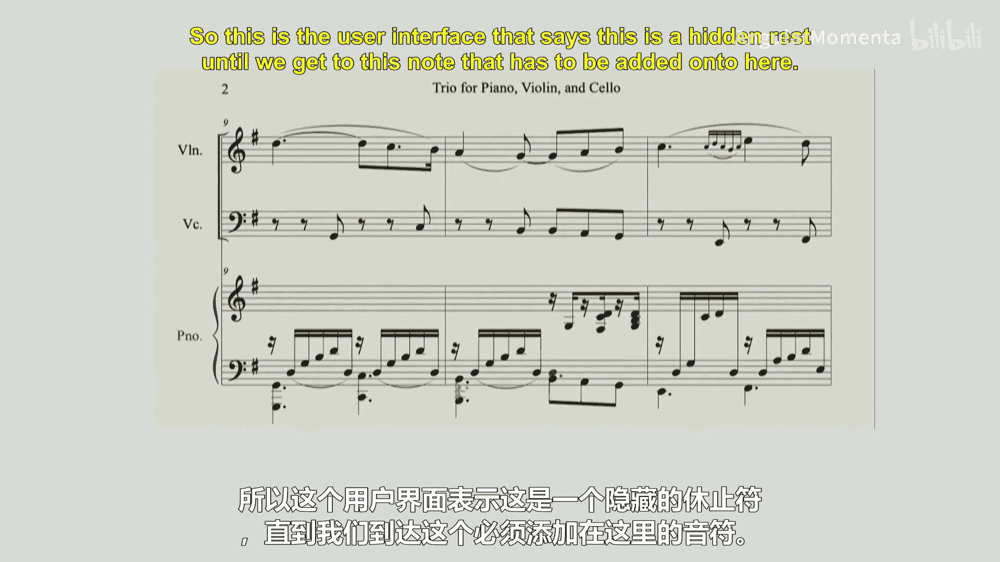

普通西方音乐记谱法的界限并没有严格定义。这是大约1700年（1687年）左右非常常见的音乐类型。Elizabeth-Claude Jacquet de la Guerre，非常有趣的作品，有很多看起来像普通西方音乐记谱法的东西，直到你开始看到… 这是什么？这些是什么？所有普通西方音乐记谱法的符号，但以不同的方式使用。这些是**无节拍前奏曲**。所以某些部分应该按时值演奏，而其他部分，大多数人认为这些告诉你“想弹多久就弹多久”。我猜有些人可能认为要在那些音符上即兴发挥一些东西。但这是普通西方音乐记谱法，对计算机来说就成了问题。当一切都是手写时，对计算机有什么问题？有很多歧义。你能看出来，好吧，这个在走，那是A，那是E，那是C，那要么是D要么是E。我们可以想象一个难以辨认的音符。你的表示法有办法记录这个吗？

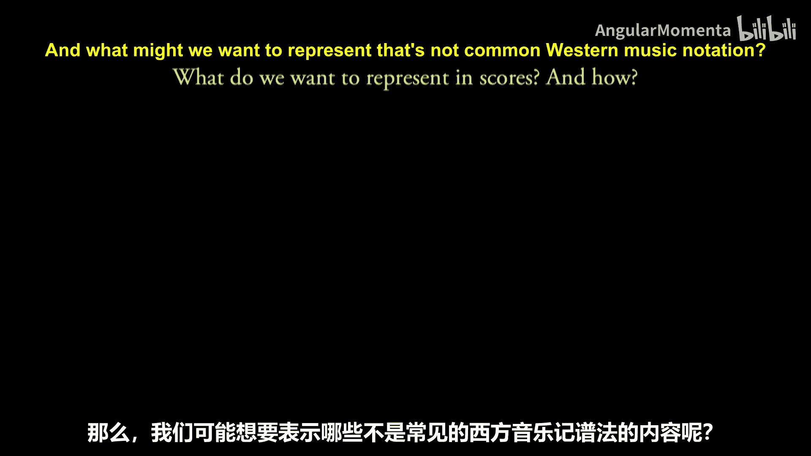

手写乐谱也往往包含许多违反普通音乐记谱法的东西。我曾见过一份贝多芬手稿，他一直在两行谱表上写，然后很明显下面部分只是要重复他刚才写的。所以继续写，下次画下一个系统时，他需要另一个谱表。哦，上面有一个空谱表。所以就用了它。所以你可以在同一件事物中在时间上向前或向后跳。它们很小。几乎每一位重要作曲家都对普通音乐记谱法做了自己的调整。这是20世纪作曲家Igor Stravinsky的作品。晚年，他开始问：当有些乐器演奏得不多时，我们为什么要浪费整个谱表把它们写出来？如果你在它们进入时开始谱表，在它们结束时结束，就很容易看出哪里在休止。有点像那样。

普通西方音乐记谱法的局限在某些作品中显现出来。我想这是我大一作曲课作业，当时我想成为作曲家，我用了一些看起来像普通音符的东西，但后来… 在这一点上，我不想计算速度是多少，所以“保持大约2秒”。保持这个大约2秒，然后到达这一点。这部分应该… 所以我们就展示一下，结束得像一个六十四分音符。这是普通西方音乐记谱法的一部分吗？50年前不是，但现在有很多乐谱这样做。

今天创作的许多音乐都在将普通西方音乐记谱法拉伸到极限。这是Kate Soper的作品，她几年前是普利策奖决赛选手，在史密斯学院任教。这是她歌剧《Ipsa Dixit》的一部分。她自己说过，人声在演唱和说话之间来回切换，并使用这些其他符号告诉你嘴巴张开和闭合多少。小提琴部分有点奇怪。很多奇怪的东西。我在想谱表本身。这是小提琴常用的谱号吗？小提琴用打击乐谱号？4条线。你认为那四条线代表什么？小提琴有什么四个？琴弦。在哪根弦上演奏？你会想出音符的。

这是Brian Ferneyhough的作品，他是“新复杂性”作曲团体的一员。如果我们只看第一小节，几乎没有什么违反我们在理论课上学到的普通西方音乐记谱法原则的东西，但他们往往将其推向极致。例如，第一小节，我们在原本放四个十六分音符（两个八分音符）的地方，放七个十六分音符。对于其中大多数，我们会在前20个或2个音符的位置放21个三十二分音符。然后在那里面，我们可以有三连音，这样三连音几乎可以无限嵌套，而且我们的拍号没有理由必须是2的幂。所以人们在这方面做了很多尝试。

教授，别再说奇怪的音乐了。这都是陌生的新音乐。伟大的过去，像莫扎特这样的人不会做这样的事情。所以我们回到莫扎特。这又是《唐璜》，第一幕结尾非常酷的时刻。如果你不知道这部歌剧：他们去参加一个非常豪华的舞会。有点像今天去一个有多个房间、多个DJ的俱乐部。所以在这个大舞会上，一个房间里是3/4拍的庄严小步舞曲，当时的上流社会喜欢他们的3/4拍舞蹈。另一个房间里是2/4拍的舞蹈，中产阶级喜欢那些。然后对于农民之类的人，我们会有他们喜欢的3/8、6/8拍舞蹈。同时进行。小节线。当你说“让我们从第22小节开始”时，你会说“抱歉，是我的第22小节还是她的第22小节？”因为你没有小节是通用的概念。

我想这是… 拉威尔还是德彪西？我想是德彪西，非常常见。一切看起来都很好，直到… 这是什么意思？我们在高音谱号，但我们有一个低音谱号，只为了这一个音符。这里也是。不，你能看出这是什么意思。最好不要为了一个音符再写一整行谱表，对吧？但你可以在同一谱表上同时有两个谱号。你还可以从巴赫的作品中找到例子，同一谱表上有两个拍号，或者中途改变拍号。那是什么意思？

所以几乎每位作曲家都在某些方面突破了传统音乐记谱法的界限。

再跳回Clara Schumann一次。有些东西对我们来说可能非常明显，但很难编码成对计算机这样愚蠢的设备完全明确的形式。比如，我们在小节中。这个从这里开始。你们都是音乐家。你们都知道。这条线一直延续到这里。所以这里和这里是空的。但你如何教会计算机进行那种抽象，即连线可以从一个谱表移动到另一个谱表，因此不需要填满？

## 超越西方：其他音乐表示法 🌍

那么，普通西方音乐记谱法在哪里结束，其他东西从哪里开始？我们可能想表示哪些不是普通西方音乐记谱法的东西？这是我有时研究的一种东西。这是大约17世纪初或末的教堂音乐。看起来很像我们的，只是音符形状有点不同。普通西方音乐记谱法，只是有点小改动，也许不确定，但相差不远。

我们所有的记谱法都可以追溯到过去，或者源于某些决定。让我们从这个开始：这是西方音乐记谱法。这是西欧最早的音乐记谱法，大约9世纪。这是圣诞节弥撒的圣咏。这些东西的作用是告诉你**有多少个音符**。在这个例子中，1, 2, 3，它们… 从低开始，走高，再下来。不一样，大约相同的高音，同样我们有上下。大多数这些是上下。这里我们有1, 2, 3个音符向下，三个音符向下。高度没有任何意义。这是音乐。我们可能想表示这个吗？我们可能想如何表示？人们总是在想，我们有成千上万页这种记谱法的音乐。知道要唱多少个音符以及它们是向上还是向下，但不知道是什么音符，对某人有什么帮助？所以很多人希望我们昨天见过面，会更明显一点。

这是大约1420年的一首作品，Baude Cordier的歌曲“Belle, bonne, sage”，呈心形。所以关于作品的形状，当我们在创建表示法时，这是我们想要表示的东西吗？大约同一时期。一首形状不是心形而是竖琴的作品。很难说它基本上是当时的音乐记谱法，不过是侧着的，但我们写在弦上，所以我们需要两倍的弦，而且我们不在间上写任何东西。

回到更现代的音乐，一些绝对违反几乎每一条普通西方音乐记谱法原则，但使用其中一些元素的作品。这是Cornelius Cardew的《 treatise》，它使用了许多记谱符号，许多看起来像音乐记谱法的东西。但这取决于你如何诠释。每个团体演奏得都相当不同。如果你要有一个图形乐谱，使用音乐记谱元素，但它们没有任何意义，也许… 一个音乐乐谱不一定需要任何元素。Earle Brown的《December 1952》。是的，十二月，那是什么，1962年。

这些都是西方产生的东西。日本、中国，世界上许多文化都发展了自己的记谱系统。然后还有一些记谱系统是为了研究物理性而创建的，比如这里的因纽特喉歌，不使用任何可能带有西方文化包袱的东西。所以我们开始记谱… 实际的频谱图。这是一种音乐记谱形式吗？我们如何做到这一点？再来一个。平板…

只是让大家感受一下世界上可能存在的一些记谱法。

除了人们随着时间的推移创建的记谱法之外，还有发明的记谱法，这些记谱法在某些时候被发现非常有用。这叫做**TUBS**（时间单位方块系统）。如果有人学过。它大约在1970年代发明，我稍后会查确切时间。概念有点像我用位做的：你可以指定你想要记谱的最小单位是什么，并指定某人何时演奏，或者如果你需要指定他们可能演奏的不同东西，你可以放在方块里。这已经成为一个非常有用和被使用的系统，特别是在西非音乐的记谱中。

许多记谱法表示法被创建出来，其中许多并不成功。这是唱盘手记谱系统，因为没有什么比在酒吧里边旋转边读乐谱更酷了，对吧？但它是一种记谱某人做了什么以便后来复制的方法。

但不是所有的记谱和表示系统最终都非常成功。我认为这个超级酷。我不知道为什么我开了个玩笑。它真的很创新。这个网站已经宕机大约六年了。所以我猜它没有流行起来。

最早的有影响力的机械记谱表示系统之一是自动钢琴卷，或者我们现在就叫它钢琴卷，其中音符在谱表上的实际打孔成为编码音符的一个非常重要的部分，所以我们再次得到了高低（高度转向侧面）和左右（时间）的概念。随着卷轴前进，有一个光标（钢琴卷里有个技术名称，我记不起来了）在读取那一刻应该发生什么，或者正在发生什么。通常还有其他控制方式（通常在侧面）来控制整个钢琴的力度，但通常不编码任何单个音符的力度。不过，经常写在侧面的是歌曲的歌词，有点像你开车时，写着“慢行，人行横道”倒着写，这样你学会那样读，以便你可以跟着钢琴唱。非常酷的多媒体。

## 计算机表示法：两种主要模型 💻

好的，所以我们思考了很多关于普通西方音乐记谱法的一般性术语。现在，我想思考一下计算机表示法。我不知道为什么我没写“计算机表示法”这个词。再次说明，这些幻灯片是我从一个名为“Bebop”的作曲包借来的，名字正是那首心形作品。

我们在第一天非常快速地讨论过这个。但我想稍微放慢一点。人们通常选择编码普通西方音乐记谱法的两种主要方式是：

1.  **基于容器的（盒子式）**：你有一个大盒子，可能是整个乐谱，某种东西，然后你有更小的盒子，可能是声部。在这些里面，你有小节。通常，声部成为里面的东西，然后一直向下到音符。
2.  **基于时间切片的容器**：音乐时间中某个特定时刻发生的一切都在它自己的槽中。有些人不会… 把这些放在三个不同的槽里，因为这四个东西发生在四个不同的槽里，因为所有这些在音乐时间0同时发生。谱号、调号、拍号、第一个音符。除了我们必须在乐谱上按一定顺序写它们，但它们都出现在乐谱的最开始。

我想开始讨论为什么你可能想使用其中一种，以及为什么它们都是糟糕的选择。你做出的每一个选择在某个时候都会是糟糕的选择。

### 基于声部的表示法的问题

思考基于声部的表示法。你可以立即看到某些问题。有人知道“Ossia”谱表是做什么用的吗？解释一下。

> 我认为我们一直很棒，但我想现在听到更多声音。有人听过这个术语吗？Ossia staff？不，现在。它是一个小谱表。不，不，钢琴家和小提琴家经常看到，尤其是当你… 开始演奏非常难的部分时。不。看。替代演奏方式。是的，这是演奏那个小节的替代方式。

这是一个假设的例子，因为我不认为这会是演奏这个的替代方式。但通常，如果某些音对某些人来说太高，尤其是歌手，歌手经常看到Ossia，因为如果某个音不在你的音域内，就写一个不同的声部。所以你会有一个只出现一分钟的谱表。我们说过，我们的顶层可能是声部，在那之下，对于钢琴作品，你可能有声部，然后谱表1和谱表2。但这里我们有一个谱表突然出现。如果一切都在一个盒子里，而最低层的盒子之一是小节，你就有这些问题。

当你想表示一个渐强从开头持续到下一个… 时，你该怎么做？如何在计算上解决这个问题？当一切都必须在盒子里，把盒子想象成数组或列表。

> 可以有一个标志，在一个盒子里开始某件事。

是的，所以一切都可以有一个开始和结束，或者某些东西可能… 也许一个音符不需要有开始和结束，但你可以有开始和结束的标志。所以有一些解决方法。其他可能性？

> 也许把它们放在更高的层级，比如它们不属于小节内部，可能属于声部内部。

是的，所以你可以向上移动一层。这很好。当你这样做时，通常很有效。但然后你会有第二个问题出现。别担心，这个问题无论如何都会出现，尤其是当莫扎特把他的三个乐队带到页面上时。但你有… 也许这里是你的声部，你有你的小节等等。现在你想提升… 那个跨越两个小节的渐强，你想把它提升到下一个层级。假设这些是某种数组。我们放逗号。然后你可能会有问题，也许你把它放在这里，也许放在那里。但突然，数组不再是顺序的了。换句话说，某些东西可以出现在不按顺序的点上，所以我们有时称之为“前后光标”，即我们在某个点，但需要向后看或向前看才能看到那时发生了什么。但这也是一个非常好的解决方案。而且它经常发生。所以两个很好的解决方案。还有其他吗？它甚至不必那么好。这些就像是行业中最标准的两种方法。我本可以种下更好的。好的，很好。我应该说，这是三种伟大的行业标准方法中的两种。你们中可能有人会想出第三种方法并发明新东西。永远不要对MIT学生说没有更多可能性了。

### 基于时间的表示法的问题

这是我们之前讨论过的一个问题：装饰音，它们在拍号中不占任何单位，但当然需要时间来演奏，并在页面上占据空间，它们是如何刻印的？它们最终成为时间方法的一大难题。

所以，你可以说：“嘿，我不是风笛手，所以我不使用装饰音。”风笛手一直使用装饰音。“所以我可以做基于时间的系统。”或者其他人可以说：“看，我的作品从头到尾都是强音，我永远不会有渐强。我不需要担心。我可以用声部系统。”

这门课不仅仅是计算表示，还是计算音乐理论与分析。最终，我们将深入我们的表示法并对它们进行音乐分析，对吧？

我们经常喜欢做某些事情。第一节课我们说过，谁写过平行五度？几乎每个人都举手了。这就是我们所说的声部进行，我们观察某个时刻的某些和弦或声部如何移动到另一个时刻的东西。有人有教授对此皱眉吗？知道… 重叠。我有时称之为“下方声部跳到了上方声部刚刚离开的位置之上”。在某些音乐风格中，这不是很地道。

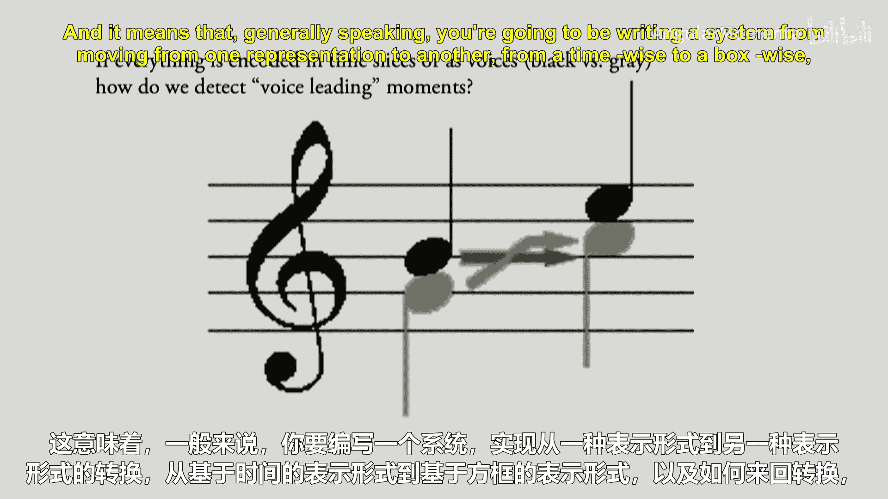

那么，我们如何分析？在盒子系统（容器系统）中，我们如何找到重叠？我们可能有一个容器给这个声部或小节。然后会有一个容器给上面的音符（一个声部），一个容器给下面的音符。我们需要知道在这个时刻… 在这个时刻，这个音符是否跨越了其他容器中之前的音符。所以我们必须能够在容器之间来回跳转。这样做不太好。

对于时间切片，我们想看看这里发生的一切，然后看看这里发生的一切。然后问题变成了：是的，但是第一个切片中的这个音符如何与第二个相关？所以对于声部进行问题，结论是：**两个系统都不好用**。它们都有问题。它们都有大的概念性困难，使得声部进行成为任何更深层次分析发生之前始终需要解决的难题之一。这意味着一般来说，你将编写一个系统来从一种表示法转换到另一种，从时间式到盒子式，以及如何来回转换，并让你的系统能够拥有多种表示法。这是主要问题之一。

## 术语：本体论 🧠

今天最后一个小话题，我想我们已经讲完幻灯片了，所以我可以把这个放上来。只是一些你们会遇到术语。实际上，两件小事。我总是确保，因为我不喜欢让任何人晚走。我想讲完那里的最后一项。

你们将在周五交完问题集1后拿到问题集2。它也将是一个为期一周的作业。有一篇阅读材料要补充。大约15页左右，但20页，不过大部分是图片。你们会在Canvas上找到。这是Nicholas Cook的一篇文章，他是计算和计算音乐学领域的主要人物之一。这是该领域的基础文本之一。所以我想读一下。它有点… 现在大概18、19年了，所以有点过时了，你会看到一些编码方式、写计算机代码的方式现在有点古老了。但它所说的仍然非常非常好。所以你们会在网上找到，我们会讨论，有一些问题要开始思考，你们不需要写出答案，但也许草拟一两个答案，以便周五能够积极参与。

如果你们没有读过很多学术文章，或者这是你们第一次阅读为学者写的文章，我有一个大约六分钟的可选视频，关于我如何阅读这些文章，也许即使你们是这方面的专家，看看教授如何不从头到尾一口气读完也可能有用。所以如果你们想要，可能特别有用。

我们还有大约四分钟讲最后一个话题，针对你们可能想看的提纲中的一件事。我通常会把提纲给你们以后看。但关于不同的音乐表示法，我们将要使用的一些不同术语。

有人上过不止一两门哲学课并遇到过这个术语吗？哲学课。那在CS课（计算机科学）呢？有人见过吗？我现在不要求定义，除非你想做。好的。

**本体论**，从某种意义上说是对本质、意义的研究，对“意味着什么”的一般性研究。哲学和计算机科学对本体论有两个稍有不同的定义。所以你们将开始看到“本体论”这个词出现在很多表示法中。它与表示有关，对于哲学。我的意思是，真的非常哲学。你们会得到很多关于“是什么让某物不再是某物”的界限。我们今天和上一节课做了很多哲学的、本体论的讨论，对吧？我们试图找到什么的界限？一个音符。是的，我们写了那个。那么，有哪些东西？什么时候一个音符是1个音符，1个是音符，2个音符，1个是音符，6个音符？我们玩过那个。什么时候普通西方音乐记谱法不再是？我有点… 你们知道，就像温水煮青蛙的把戏，慢慢地、慢慢地移出，直到最后，就像“等等，教授，那是一整页的想法，对吧？”但我们非常、非常慢地到达那里。我们如何划一条分界线？因为这是一个哲学定义。然后，我们将在这门课中使用那个，因为这也是一门人文学科。我们在思考那些类型的事情。某物的界限是什么？什么是音符？如果一首音乐是其中的每一个音符和每一个时值，你能弄错多少个音符仍然可以说你在演奏… 贝多芬的… 多少… 奏鸣曲？10%？5%？一个音符错了，这就不是那首曲子。

这些是哲学定义所做的一些事情。我们不会讲到这里的下半部分。但就以计算机科学的用法结束，这也非常酷且相关。那就是：一个表示法中使用的所有**对象**、**名称**、**关系**是什么？

所以，一个计算机文件系统的本体论可能会说，有文档和文件夹。文档可以放进文件夹吗？可以。文件夹可以放进文档吗？不可以。文档可以放进文档吗？不可以。文件夹可以放进文件夹吗？可以。所以我们开始创建某种东西的表示法。一个文档可以出现在硬盘的两个地方吗？不同的操作系统。可以，不可以，有办法做到。所以这些都是构成系统中使用的对象和表示法的所有决定。

我们周五将再次开始，讨论一些我们已经创建的本体论，一些关系，以及一些不同的方式，开始重新回到编程。我们在课堂上已经有一段时间没怎么做了。我们可能表示音符与音高、时值以及许多其他事物之间关系的一些方式。

---

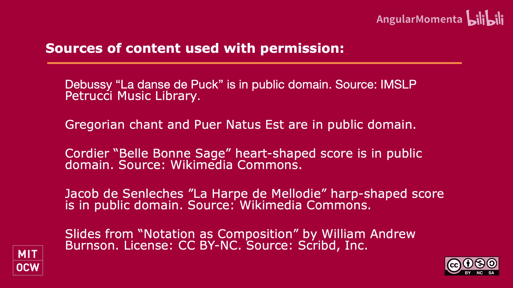

本节课中，我们一起学习了音乐表示的复杂性，从高效编码的历史需求到普通西方音乐记谱法的边界与挑战。我们探讨了两种主要的计算机音乐表示模型（基于容器和基于时间切片），并分析了它们各自的优缺点。最后，我们引入了“本体论”这一重要概念，为后续深入分析音乐表示的结构和关系奠定了基础。