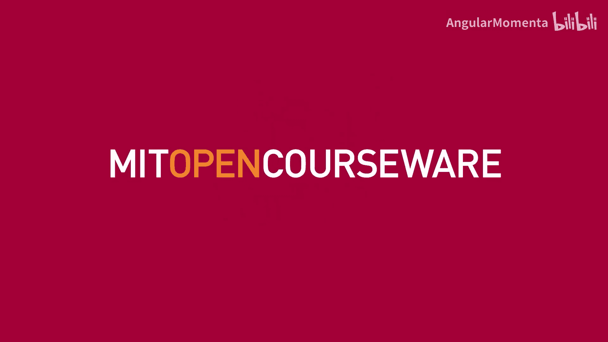
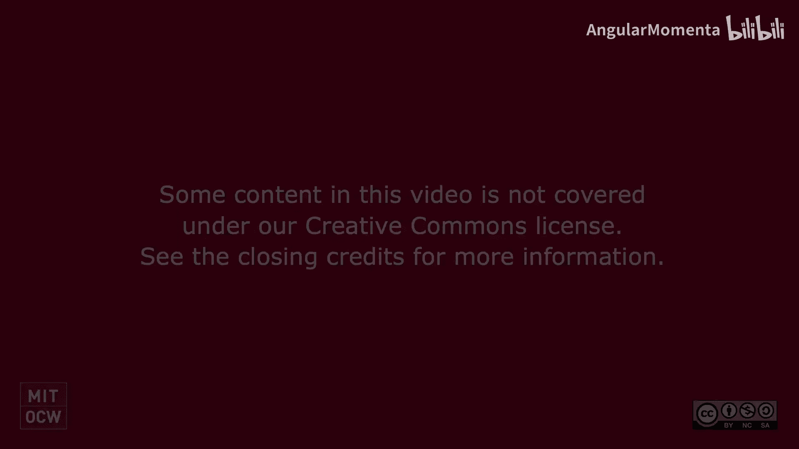
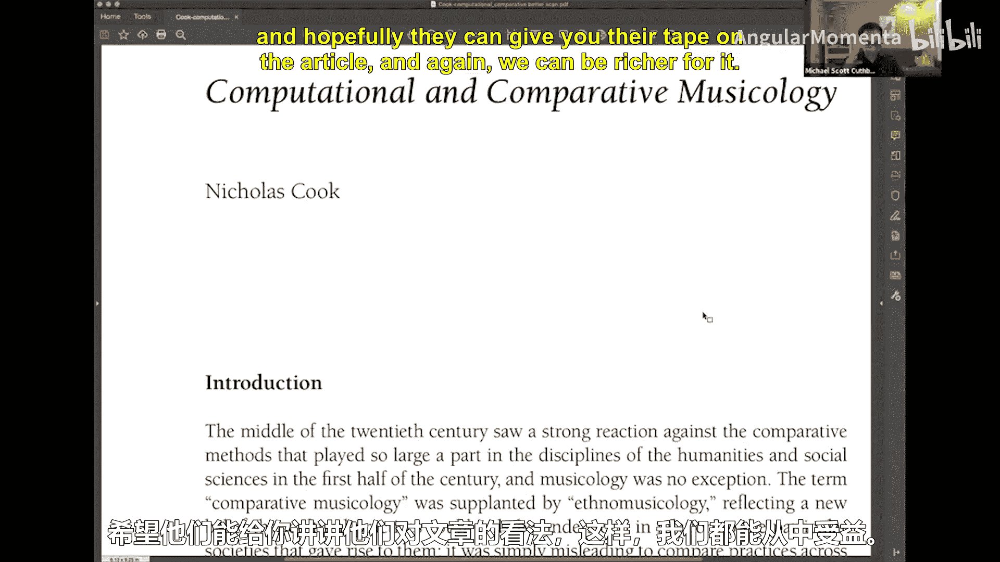
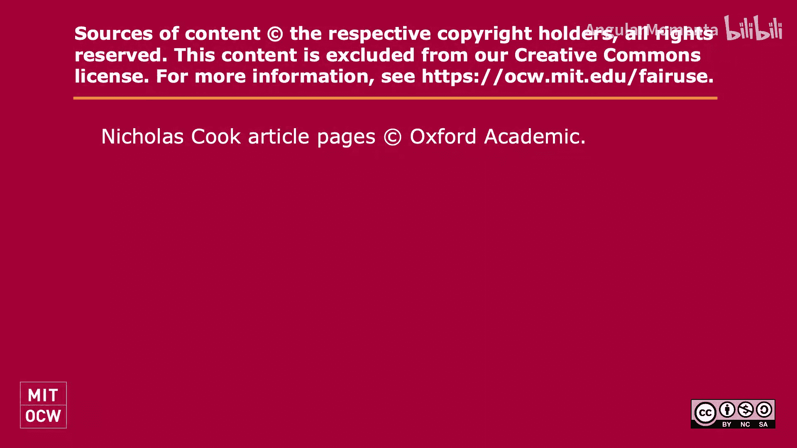

#  009：如何高效阅读学术文章 📚

在本节课中，我们将学习一套系统性的方法来阅读和理解学术文章。掌握这个方法能帮助你快速抓住文章核心，判断其价值，并决定是否需要深入研读。

## 概述

阅读学术文章是学术研究的基本功。对于初学者而言，面对一篇结构严谨、术语密集的文章可能会感到无从下手。本节将介绍一种高效的阅读策略，帮助你从标题、摘要到结论，层层递进地理解文章主旨，而不必逐字逐句地通读全文。

## 阅读步骤详解

以下是阅读一篇新学术文章时可以遵循的步骤。

### 审视标题与出处

首先，花点时间审视文章的标题和出处。标题通常概括了文章的核心议题。同时，了解文章的发表背景（例如，发表于2004年，面向学术界）有助于你理解其写作风格和目标读者。如果文章内容与标题严重不符，你可以考虑放弃阅读（尽管在课程中，指定的文章必须阅读）。

### 重点关注加粗部分与引言

对于阅读速度不快或需要快速把握要点的读者，可以先关注文章中的加粗部分（如章节标题、关键词）。**最重要的是，仔细阅读引言部分**。一篇优秀的文章会在引言中阐明研究问题、方法、主要发现和全文结构。即使时间紧迫，仔细阅读两遍引言也比快速通读全文更有效。

### 浏览图表与章节标题

接下来，浏览文章中的图片、图表和章节标题。图表是信息的直观呈现，能帮助你快速理解文章讨论的具体内容。通过章节标题，你可以把握文章的整体框架。例如，如果引言提到“音乐表征”，而后续章节标题是“表征的问题”和“案例研究”，你就能预判文章将分为问题分析和实例验证两大部分。

### 阅读每部分的首尾段落

在明确了文章结构后，阅读每个主要部分（如“问题分析”部分）的第一段和最后一段。开头段落通常会提出该部分的核心论点，结尾段落则进行小结或引出下一部分。这种阅读方式能让你高效地把握论证脉络，无需担心“剧透”文章的最终结论。

### 精读结论与参考文献

然后，直接跳到文章的结论部分。结论会总结全文的核心发现和贡献。有些文章会明确标出“结论”小节。阅读结论后，你应能清楚地回答：“这篇文章的主要论点是什么？”

完成以上步骤后，如果确定文章与你的研究高度相关，再返回去仔细阅读全文并做笔记。此时，你可以关注文中的细节、数据和脚注。如果文章涉及一个你陌生的领域，浏览**参考文献**列表也很有帮助。频繁被引用的作者通常是该领域的关键学者。

## 总结

本节课我们一起学习了一套高效的学术文章阅读方法。其核心在于**先把握整体，再深入细节**：从标题和引言入手，通过浏览图表与结构快速定位核心内容，优先阅读结论以明确文章价值，最后再决定是否精读全文。此外，与他人交流阅读心得也是深化理解的好方法。掌握这一策略，你将能更自信、更高效地应对大量的学术文献。