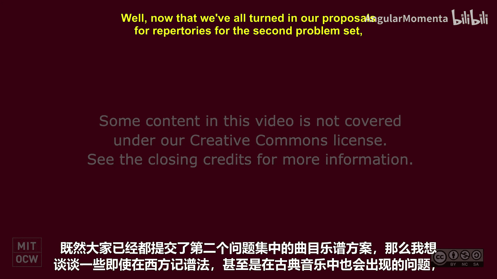
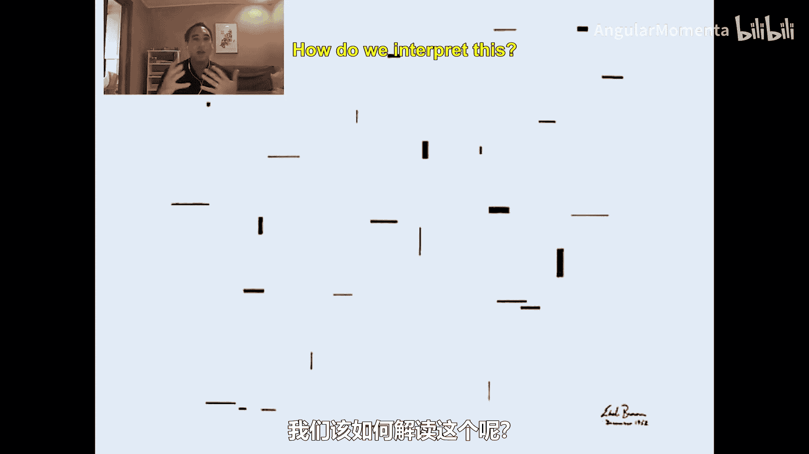

#  010：音乐表现概论 🎵

在本节课中，我们将探讨音乐记谱与表现中存在的复杂问题。从古典乐谱到现代实验性作品，我们将看到即使是看似标准的西方记谱法，在转化为计算机可理解的表现形式时，也会面临诸多挑战。

上一节我们讨论了音乐表现的基本概念，本节中我们来看看在实际乐谱中会遇到哪些具体问题。

## 古典音乐记谱的复杂性

我们首先来看一首克拉拉·舒曼的钢琴三重奏。它看起来似乎没有太多表现上的难题，但稍后我们会深入观察，发现其中的细节。

以下是一段来自莫扎特《唐璜》的乐谱片段。请注意，这并非总谱，而是一份钢琴缩编谱。它将歌手唐·奥塔维奥和整个管弦乐队的部分缩减到了少数几行谱表上。

这是同一段落的另一个版本，但这次是完整的管弦乐总谱，并且使用了不同的语言（之前是意大利语和英语，现在是意大利语和德语）。如何表现这两个版本之间的差异与联系，本身就是一个尚未完全解决的难题。

## 二十世纪及以后的记谱挑战

当我们进入二十世纪和二十一世纪，问题变得更加复杂。

这是一份伊戈尔·斯特拉文斯基的晚期乐谱。它在许多方面相当标准，使用了音符等元素，但谱号的处理方式特殊：如果谱号延续到下一行谱表，会用线条连接起来。最明显的是，当某个乐器不演奏时，它的谱表会被直接移除。

或者像这样一份我大学时期的乐谱：不演奏的声部谱表会被移除。此外，在某些地方，音符之间的时值并非用标准的符头表示，而是直接标注时间长度。一些加速的音符（例如这里的这些）也没有精确地标记为四分音符、八分音符或六十四分音符，而是处于它们之间的某种连续状态。

许多当代的优秀作品，例如凯特·索珀的这首曲子，使用了扩展的记谱技术。在这里，实心圆圈代表闭口，开口信号则用其他符号表示，还有纯语音的符号。小提琴声部你可能注意到，它用的不是高音谱号，而是四线打击乐谱号，每条线代表在特定琴弦上演奏。

还有许多作品，例如布莱恩·费尼霍夫的《先验练习曲》，要求我们使用超越常见记谱法的格式。例如，在开头部分，我们有一个三连音代替了 **21/20**，而它又代替了 **7/4**。或者在结尾，有一个小节，其拍号的**分母不是2的幂**。我们如何表现这样的内容？

## 古典音乐中隐藏的难题

我们不必深入到20世纪音乐就会遇到类似问题。以下是莫扎特《唐璜》的另一段落，其中有三个不同的乐队在舞台和乐池中同时演奏，它们使用**三个不同的拍号（3/8, 2/4, 3/4）**来代表不同社会阶层人物的舞蹈节奏。小节线并不对齐，我们甚至该如何计算这样作品的小节数？

在一段看似正常的德彪西的段落中，有这样一个瞬间（感谢唐纳德·伯德指出）：**同一行谱表上同时存在两个不同的谱号**。这该如何表现？

## 早期音乐记谱的多样性

如果我们回到开头的克拉拉·舒曼的例子，可以看到实际上有些东西极难表现。为什么这里有一个休止符，而前面没有？这部分小节意味着什么？对人来说，很明显这个声部移动到了这里，但对计算机来说如何明确？还有，这些跨越不同谱表的音符具体属于哪个声部？我们如何表现跨谱表的连音线？如何表现装饰音中实际使用的时间？

当我们追溯更早的时代，问题会进一步扩大。这份我认为是17世纪的教堂音乐手稿，与常见的西方音乐记谱只有些许不同，但它使用了不同的符号来表示音符，并且省略了空心音符的一个层级。

当我们追溯到非常久远的年代，例如这份我认为是9世纪的圣诞弥撒开场圣咏手稿，上面的符号只告诉我们音符进行的方向，而非精确的音高。我们是否想要编码这样的信息？

这是一份15世纪初的美丽手稿，形状是一颗心，因为作曲家的名字“Baude Cordier”中的“Cor”意为心脏。我们是否想要表现原始乐谱的图形布局，更不用说这些以**比例记谱法**或其他特殊格式记录的音符？

这是同一时期的另一个例子，竖琴的琴弦变成了谱线，但音符只出现在谱线上。因此，整个记谱在某种程度上被放大了两倍。我们该如何处理这种情况？

## 图形记谱与开放诠释

我们该如何处理像科尼利厄斯·卡迪尤的论著这样的作品？其中，记谱符号被用来给予表演者（歌手）灵感，指导他们如何表演。这里有一份乐谱，但每次表演都不同。

这是厄尔·布朗1952年12月的作品《folio》的另一份乐谱。我们如何解读它？又如何存储对这首作品的不同诠释？

## 非西方与电子音乐的挑战

我已经在课堂上提到，非西方音乐和流行音乐也有它们自己的难点和有趣之处，机器音乐、电子音乐也是如此。例如在这个钢琴卷帘窗的例子中，音符之间精确的差异和距离可以被编码。

## 总结

本节课中我们一起学习了音乐表现所面临的广泛挑战。从古典乐谱中声部交叉、拍号错位等细节，到现代音乐中非标准拍号、图形记谱和开放诠释，再到早期音乐的方向性符号和特殊布局，我们看到了将丰富多样的音乐实践转化为计算机可处理形式时存在的巨大复杂性。我希望这能让大家对音乐表现的丰富多样性有所了解，并期待看到你们如何构建自己的音乐表现方案。