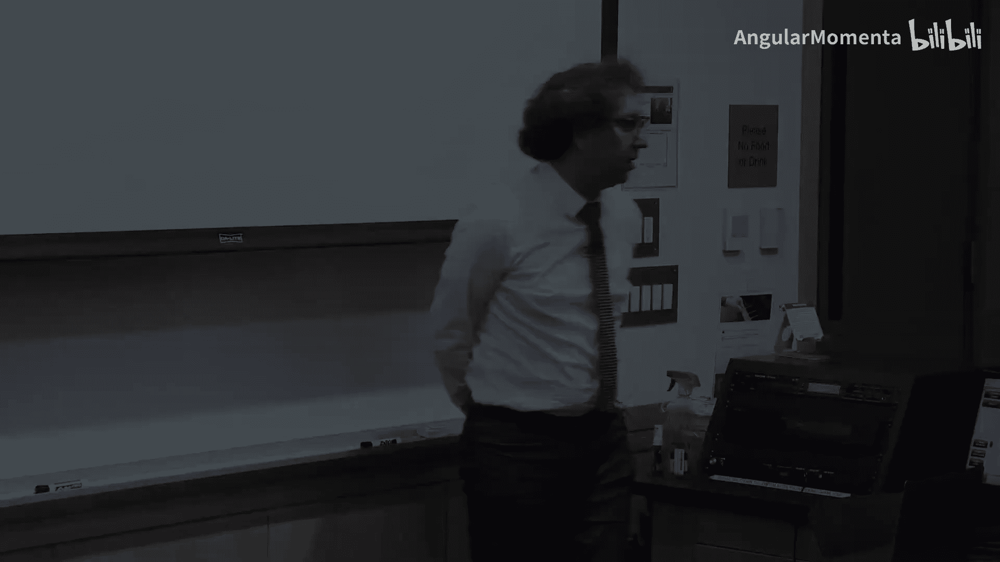
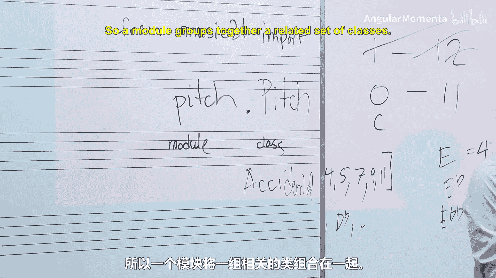
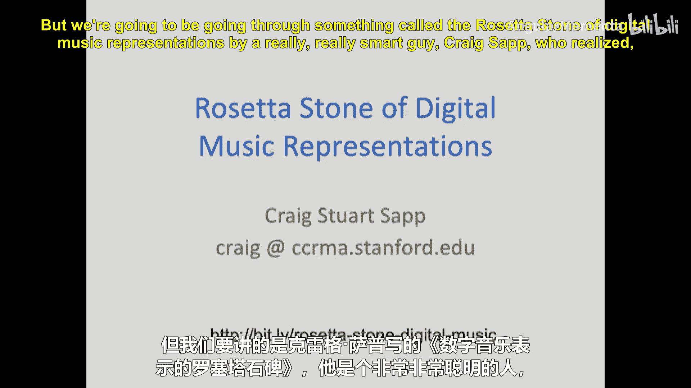
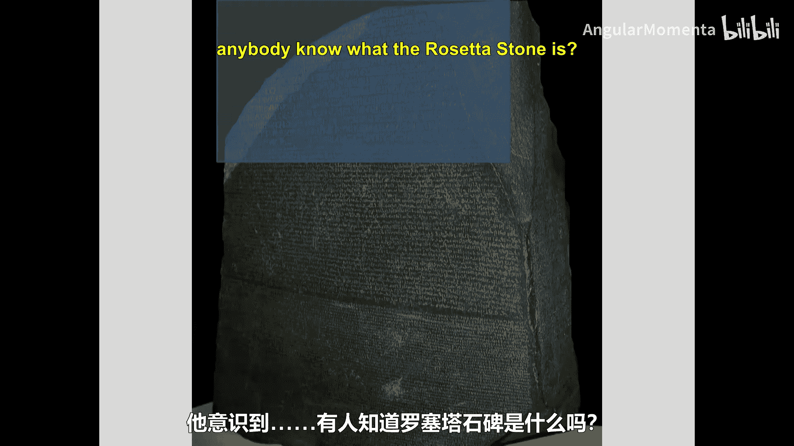
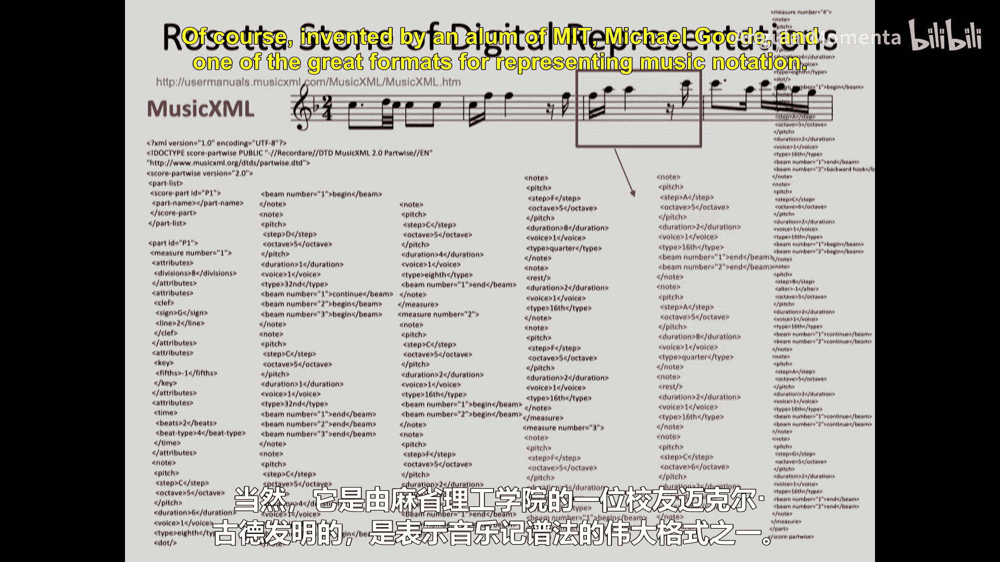
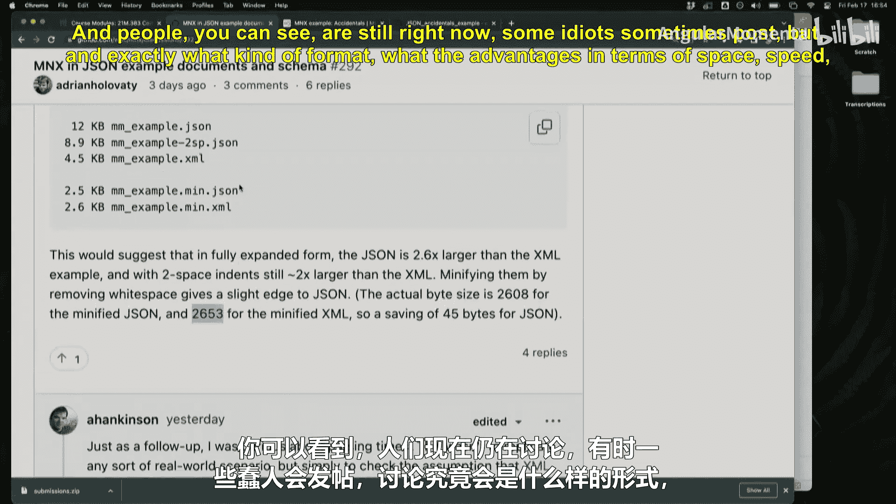
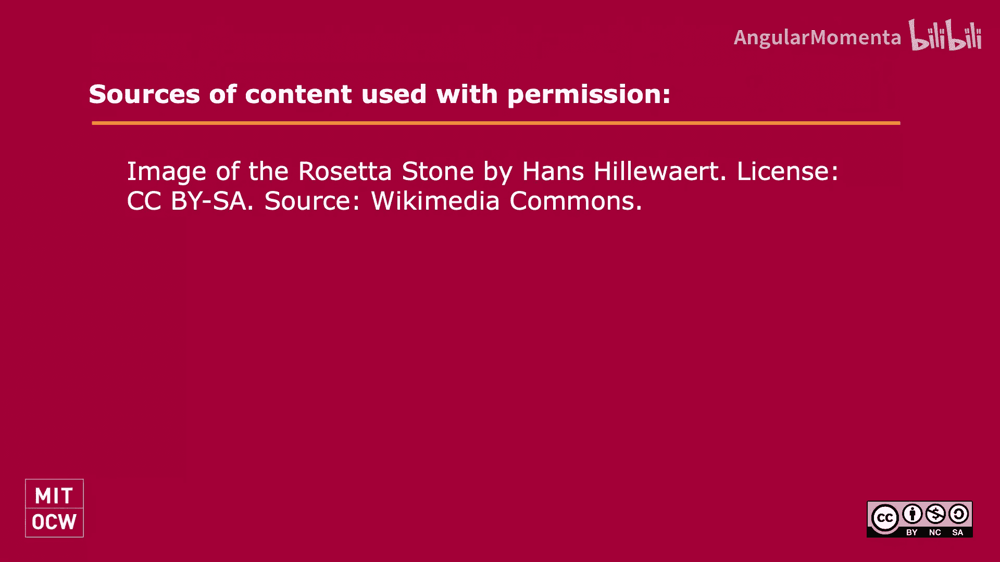

#  011：音乐表达（二）🎵




在本节课中，我们将继续探讨如何表示比单个音符更大的音乐结构，即乐谱的表示。我们将从回顾上一节关于音高和音级的概念开始，然后深入探讨音乐表示中的核心概念——本体论，并学习如何为不同类型的音乐设计表示系统。

## 概述与回顾

上一节我们介绍了音符、音高和时值的基本表示。本节中，我们来看看如何表示更大的音乐结构，即完整的乐谱。

首先，快速回顾一下上次作业的情况。总的来说，大家完成得非常出色。你们在音高名称、表示法、操作和转调方面表现得很扎实。即使是作业中最具挑战性的部分——音程的转位，大部分人也完成得很好。

不过，作业中也暴露出一些值得注意的细节和“边界情况”。

## 音高与音级的细节问题

音级总共有多少个？答案是 **12** 个，编号从 **0** 到 **11**。那么，音级 **0** 对应哪个音？是 **C**。音级 **4** 呢？是 **E**。但也可以是 **E♭**、**E𝄫** 等等。这里的关键在于处理等音记谱。

许多人在代码中使用了类似这样的数组来表示大调音阶的音级：
```python
[0, 2, 4, 5, 7, 9, 11]
```
然后通过加减升降号的数量来调整。但需要记住，在计算后，必须使用模运算（`mod 12`）确保结果在 **0** 到 **11** 的范围内。例如，如果 **B** 是 **11**，那么 **B♯** 应该是 `(11 + 1) mod 12 = 0`，而不是 **12**。

## 音集与转位

另一个挑战是判断两个音集是否可以通过转位相互转换。例如，考虑以下两个音集：
*   音集 1: `[C, D]` （音级 0, 2）
*   音集 2: `[C, C♯]` （音级 0, 1）

它们能通过转位相互转换吗？不能。一个快速判断的方法是检查两个音集的音程向量是否为彼此的负数。音集1的音程是**大二度（全音）**，音集2的音程是**小二度（半音）**，显然不同。

更复杂的情况是音集包含的音符数量不同。例如，一个三和弦和一个七和弦，用我们目前学到的工具是无法相互转换的。在编写算法时，首先要检查两个音集的大小是否相同。

还有一个极端的边界情况：空集。空集可以通过任何操作转换成另一个空集，但无法转换成非空集。处理这类情况时，程序需要避免崩溃。



思考这些边界情况非常重要，在未来的作业中，我们鼓励大家进行协作讨论。

## 音高表示法的不同利益相关者

除了作业，我们还讨论了音高的不同表示方法及其利益相关者。不同的人或系统可能偏好完全不同的表示法：

*   **音频编辑/声音分析师**：可能更关心**频率值**（如 440.0 Hz）。
*   **阅读乐谱的音乐家**：更习惯**音名和升降号**（如 A♭）。
*   **吉他手（使用指板谱）**：可能将乐谱信息首先翻译为**把位和指法**。
*   **不熟悉乐理的音乐创作者**：他们可能有内在的音乐认知模型，但缺乏描述它的词汇。
*   **数字音频工作站或神经网络**：作为非人类“利益相关者”，它们可能更偏好**消除等音记谱**的简化表示，以便于处理。

这些不同的需求说明了为什么不存在一种“唯一正确”的音乐表示法。

## 引入 Music21 库

从现在开始，你们可以在作业中使用 Music21 库了。这意味着你可以这样导入：
```python
from music21 import pitch
```
这里，`pitch`（小写）是一个**模块**，它包含了诸如 `Pitch`（大写，这是一个**类**）和 `Accidental` 等相关类。模块用于组织相关的类。

## 音乐表示的本体论

现在，我们进入本节课的核心：如何表示更大的音乐结构。这引出了**本体论**的概念。在哲学上，本体论探讨事物的本质。在计算机科学中，它指的是我们对某个领域（如音乐）的概念化模型，主要包括：
1.  **对象**：系统中包含哪些事物？
2.  **关系**：这些对象之间如何关联？
3.  **命名**：我们如何称呼这些对象和关系？（命名是编程中最难的事情之一。）

那么，在音乐中，哪些东西可以被视为“对象”呢？以下是一些例子：
*   音符、休止符
*   小节、乐句、乐段
*   演奏法记号（如断奏）、力度记号、速度记号
*   乐器、演奏者姓名
*   拍子、音色
*   整个乐谱

注意，这些通常是“名词性”的事物，而像“转调”、“演奏”这样的“动词性”过程通常不被视为基础对象。

## 对象间的关系：分类学与部分学

对象之间主要有两种关系：

**1. 分类学关系**
这是一种 **“是一个”** 的关系。例如：
*   小步舞曲**是一种**舞蹈。
*   快板**是一种**速度。
*   断奏**是一种**演奏法。
*   二分音符**是一种**音符。

在编程中，这通常用**类**和**子类**的关系来表示。但需要注意的是，分类的方向可能因视角而异。例如，整数可以看作是小数部分为零的浮点数（数学视角），也可以看作是与浮点数不同的另一种数字类型（编程效率视角）。

**2. 部分学关系**
这是一种 **“有一部分”** 的关系。例如：
*   二分音符**有一个**时值。
*   八分音符**可能有一根**符尾，或者**可能有一条**符杠。
*   奏鸣曲式**有一个**呈示部，呈示部**有**第一主题群和第二主题群。

这里就产生了有趣的建模选择。例如，对于八分音符，你是设计一个“有符尾的八分音符”类和一个“有符杠的八分音符”类，还是设计一个“八分音符”类，它包含一个“是否有符杠”的属性？全音符可以有符杠吗？虽然视觉上通常没有，但在概念上，是否要允许这种可能性？这些选择没有绝对的对错，取决于你的系统想要如何概念化音乐世界。

## 实践任务：设计音乐表示法

这将是你们**作业二**的核心内容。你们需要选择一种**非通用西方记谱法**的音乐形式（甚至可以是与音乐相关的系统，如根据棋局生成音乐），然后为其设计一个表示系统。

你需要思考并描述：
*   系统的**本体论**：包含哪些对象？
*   对象间的**分类学**和**部分学**关系是怎样的？

在开始设计前，本周末我们将学习历史上出现过的多种乐谱表示格式（如 **ABC 记谱法**、**MusicXML** 等），通过“罗塞塔石碑”项目对比同一段旋律在不同格式中的编码方式。这将帮助你们理解不同的设计选择。





特别要注意的是，在数字时代，乐谱的**呈现方式**（如手机屏幕、平板电脑、纸质打印）变得多样化，这就要求表示格式能够支持**重排流式布局**。目前，音乐表示领域正在积极讨论下一代格式应该是什么样子。你们的作业正是参与这一前沿思考的实践。

## 总结



本节课中，我们一起学习了：
1.  回顾了音高、音级表示中的细节和边界情况。
2.  探讨了不同“利益相关者”对音高表示法的不同需求。
3.  引入了 **Music21** 库的使用。
4.  深入探讨了音乐表示中的核心——**本体论**，包括**对象**、**关系**（分类学与部分学）和**命名**。
5.  布置了**作业二**，要求你们为一种非通用西方记谱法的音乐设计表示系统，这是对音乐计算本质的一次实践探索。





记住，设计表示法的关键在于清晰地概念化那些**尚未被充分解决**的部分，而不是重复发明轮子。期待看到你们创造性的设计！