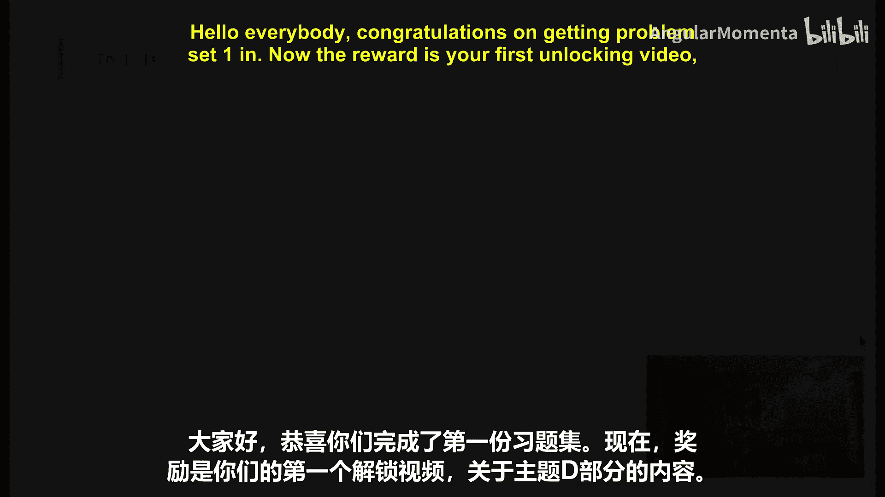
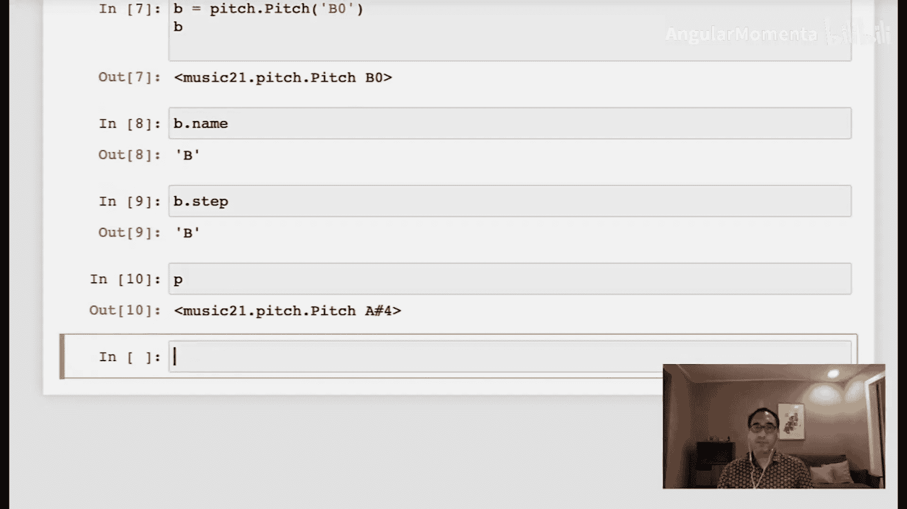
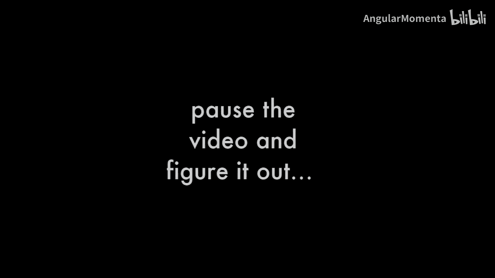
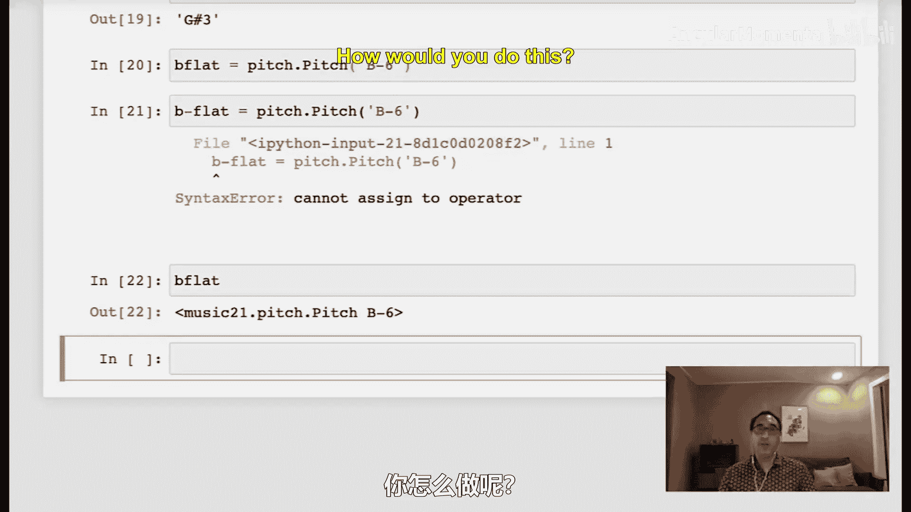
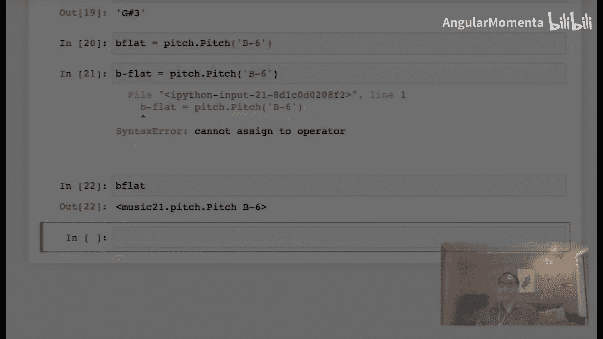
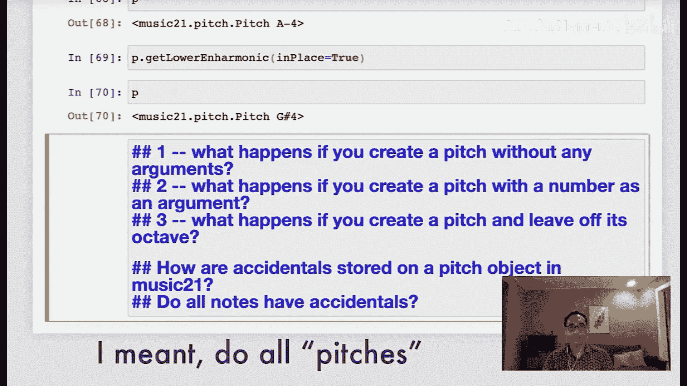
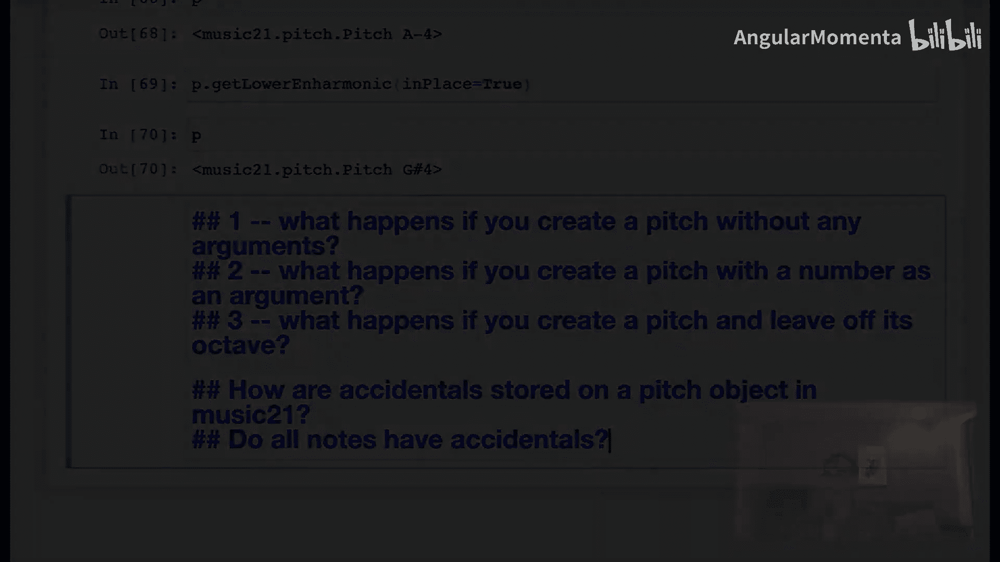
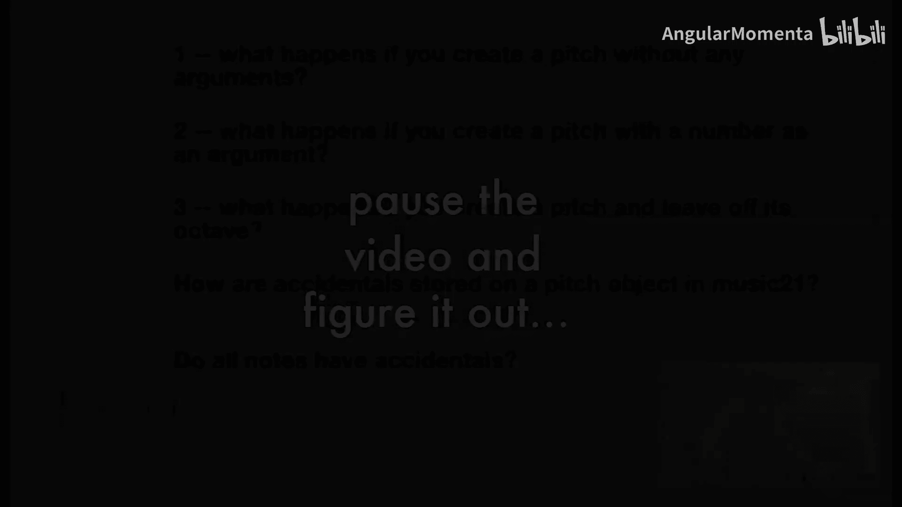
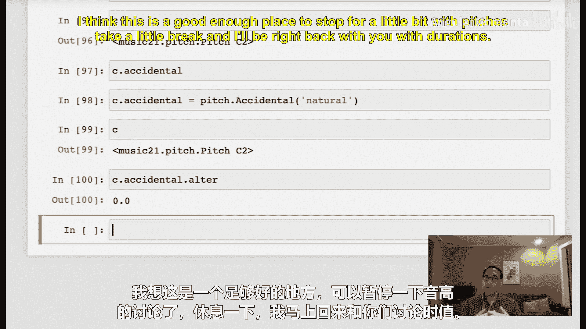

#  012：解锁 music21 中的音高 🎵




在本节课中，我们将学习如何使用 `music21` 库中的 `Pitch` 对象来表示和操作音高。我们将探索其属性、方法以及如何创建和修改音高对象。

---

## 导入 Pitch 模块

首先，我们需要从 `music21` 库中导入 `pitch` 模块。`pitch` 模块包含 `Pitch` 对象，我们将使用它来创建音高。

```python
from music21 import pitch
```

---

## 创建 Pitch 对象

我们可以使用 `pitch.Pitch()` 来创建一个音高对象。例如，创建一个 A#4 音高：

```python
p = pitch.Pitch('A#4')
```

在 Jupyter 环境中，输入变量名 `p` 可以直接查看其表示。在终端中，可以使用 `print(p)` 来查看。

---

## 音高对象的属性





音高对象有多个属性，我们可以直接访问它们。以下是两个重要的属性：

*   **`name`**：返回包含变音记号的完整音名（例如 `'A#'`）。
*   **`step`**：返回音高的基本音级字母（例如 `'A'`），不包含变音记号。

让我们看看它们的区别：

```python
print(p.name)  # 输出：'A#'
print(p.step)  # 输出：'A'
```

---

## 修改音高属性

`music21` 中的对象通常是可变的。我们可以直接修改其属性。例如，将音高改为 G#4：





```python
p.name = 'G#'
print(p)  # 输出：G#4
```

注意，修改 `name` 属性时，如果未指定八度，它会保持原有的八度值。

---

## 获取带八度的完整音名

要获取包含八度的完整音名，可以使用 `nameWithOctave` 属性：

```python
print(p.nameWithOctave)  # 输出：'G#4'
```

---

## 创建不同八度和变音记号的音高

创建音高时，可以同时指定音名和八度。例如，创建一个 B♭6：

```python
b_flat = pitch.Pitch('B-6')
print(b_flat.nameWithOctave)  # 输出：'B-6'
```

注意，变量名中不能使用连字符（`-`），因为它会被解释为减号。

要创建一个 B♮（B自然音）在负八度，可以分两步操作：

```python
really_low_b = pitch.Pitch('B')
really_low_b.octave = -6
print(really_low_b.nameWithOctave)  # 输出：'B-6'
```

---

## MIDI 编号与音高空间

音高对象可以返回其 MIDI 编号和音高空间值。对于大多数音高，这两个值是相同的。

```python
middle_c = pitch.Pitch('C4')
print(middle_c.midi)  # 输出：60
print(middle_c.ps)    # 输出：60.0
```

`ps` 代表音高空间，它可以是小数，允许表示微分音。而 `midi` 属性会被限制在 0 到 127 的整数范围内。

```python
p.ps = 70.5
print(p.name)  # 输出：'B~'
print(p.midi)  # 输出：70
```

---

## 其他有趣的功能

音高对象还支持一些其他功能，例如获取不同语言的音名，或计算其谐波。

```python
# 获取西班牙语和德语音名
print(p.getSpanishName())  # 输出可能因音高而异
print(p.getGermanName())



# 获取下方谐波
a_flat = pitch.Pitch('A-4')
lower_harmonic = a_flat.getLowerHarmonic()
print(lower_harmonic.name)  # 输出：'G#'





# 获取上方谐波
higher_harmonic = a_flat.getHigherHarmonic()
print(higher_harmonic.name)  # 输出：'B---' (B三倍降)
```

默认情况下，`getLowerHarmonic` 和 `getHigherHarmonic` 等方法不会改变原对象。如果想原地修改，可以设置 `inPlace=True` 参数。

```python
a_flat.getLowerHarmonic(inPlace=True)
print(a_flat.name)  # 输出已变为 'G#'
```

---

## 探索性问题

现在，请花几分钟时间自己探索系统，并思考以下问题：

1.  如果不带任何参数创建音高对象，会发生什么？
2.  如果用一个数字作为参数创建音高对象，会发生什么？
3.  如果创建音高时省略八度，会发生什么？
4.  在 `music21` 中，变音记号是如何存储在音高对象上的？
5.  是否所有音高都有变音记号？

---

## 问题解答

让我们逐一解答上述问题。

**1. 不带参数创建音高：**
```python
p_default = pitch.Pitch()
print(p_default.nameWithOctave)  # 输出：'C4'
print(p_default.midi)            # 输出：60
```
它会创建一个中央 C（C4）。

**2. 用数字参数创建音高：**
```python
p_num = pitch.Pitch(61)
print(p_num.nameWithOctave)      # 输出：'C#4'
```
数字被解释为 MIDI 编号，系统会生成对应的音高（默认选择升号表示）。

**3. 创建音高时省略八度：**
```python
c_sharp_no_octave = pitch.Pitch('C#')
print(c_sharp_no_octave)         # 输出：C# (无八度显示)
print(c_sharp_no_octave.midi)    # 输出：61
```
音高会被创建，但没有明确的八度显示。其 MIDI 编号存在，系统通常会将其置于中央 C 附近的八度内进行计算。

**4. 变音记号的存储方式：**
变音记号本身是一个 `Accidental` 对象，作为音高对象的一个属性。
```python
b_sharp = pitch.Pitch('B#')
acc = b_sharp.accidental
print(type(acc))         # 输出：<class 'music21.pitch.Accidental'>
print(acc.alter)         # 输出：1.0 (表示升高一个半音)
print(acc.name)          # 输出：'sharp'
```
你可以修改这个变音记号对象。
```python
acc.name = 'flat'
print(b_sharp.name)      # 输出：'B-'
```

**5. 是否所有音高都有变音记号？**
不是。自然音（无升、降号）的音高，其 `.accidental` 属性为 `None`。
```python
c_natural = pitch.Pitch('C2')
print(c_natural.accidental)  # 输出：None
```
但你可以显式地为其添加一个“自然”变音记号。
```python
c_natural.accidental = pitch.Accidental('natural')
print(c_natural.accidental.alter)  # 输出：0.0
```

---

## 总结




本节课中，我们一起学习了 `music21` 库中 `Pitch` 对象的基本用法。我们掌握了如何创建音高、访问和修改其属性（如 `name`、`step`、`octave`、`midi`、`ps`），了解了变音记号的存储方式，并探索了一些实用方法。这些工具将帮助我们更高效地处理音乐中的音高信息，为后续的学习和问题求解打下基础。接下来，我们将继续学习关于时值（Duration）的内容。