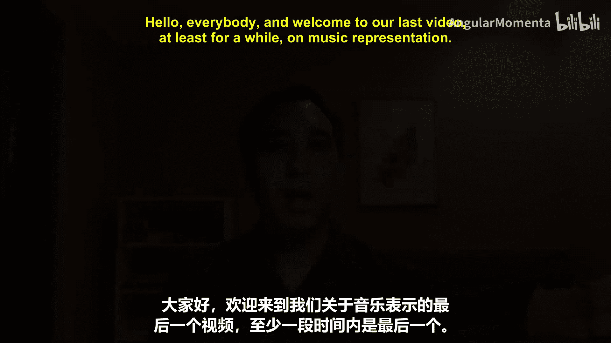
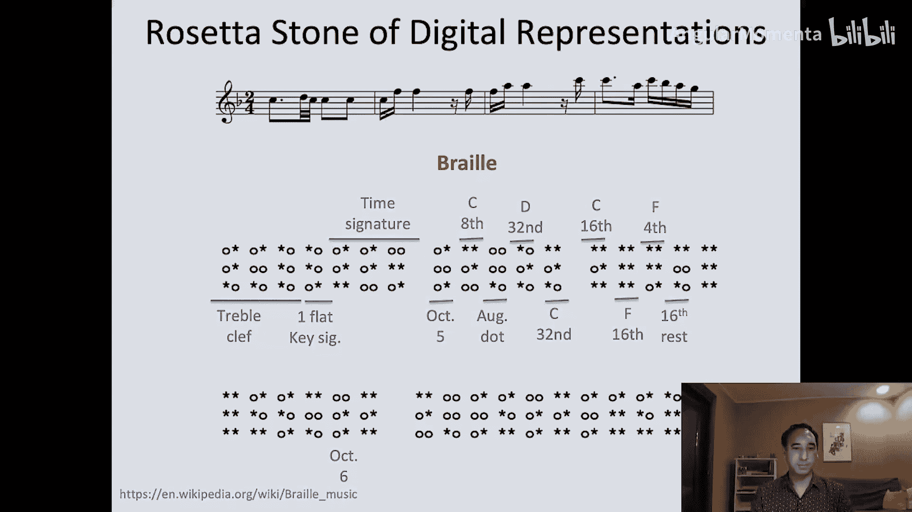

#  013：克雷格·萨普的罗塞塔石碑 🗿

在本节课中，我们将学习克雷格·萨普的“罗塞塔石碑”项目。该项目将同一段旋律编码在近二十种不同的数字音乐表示格式中，为我们提供了一个绝佳的窗口，来比较和理解各种音乐编码方式的异同。

## 概述

罗塞塔石碑是1799年发现的一块石碑，其上用三种文字（两种古埃及文字和古希腊文）刻写了同一段内容。由于当时人们能读懂古希腊文，这块石碑成为了破译古埃及象形文字的关键。

克雷格·萨普的“罗塞塔石碑”项目借鉴了这一思想。他选取了一段包含多种音乐元素（如不同八度、调号、拍号、符杠信息）的旋律，并将其编码在众多不同的数字格式中。通过并排比较这些编码，我们可以直观地理解每种格式如何表示音乐信息。

## 示例旋律与格式解析

以下是项目中使用的示例旋律，它包含了调号、拍号、不同八度的音符以及符杠信息。

接下来，我们将逐一查看这段旋律在不同格式中的表示方式。

### 早期与特定用途格式

以下是几种历史上重要或用于特定领域的音乐编码格式。

*   **Plaine & Easie Code**：一种早期编码。例如，`b- tocipher`可能表示G音，`B-2/4`表示降B音和拍号，带点的八分音符用特定符号表示，数字`3`可能表示三十二分音符，括号`[ ]`可能表示符杠连接。
*   **ABC Notation**：主要用于民谣记谱。例如，`K:F`表示F大调，`L:1/16`表示以十六分音符为基本单位。高八度的C用`c‘`表示。
*   **Dm’s Code**：一种已不常用的格式。数字可能代表音高，字母如`T`可能代表三十二分音符。
*   **Guido Music Notation**：使用反斜杠`\`来指示音乐元素。谱号、调号、拍号都被编码在内，小节线明确标出。下划线`_`可能表示休止符。

### 现代与通用格式

上一节我们看了一些早期或特定领域的格式，本节中我们来看看一些更现代、更通用的音乐表示格式。

*   **MuseData**：这是Music XML的灵感来源之一。它采用固定位置编码，即在等宽字体下，每一列都有特定含义。例如，第8列可能表示时值。它将时值编码为三十二分音符的数量，并同时记录其外观（如是否带点）。左右方括号`[ ]`用于指示符杠的起始和结束。
*   **Humdrum**：这是我们课程中遇到过的格式。它使用`L`和`J`来表示符杠的起止。通过重复字母来表示不同的八度，例如`c`、`cc`、`ccc`。
*   **LilyPond**：它实际上是Scheme编程语言（Lisp的一种变体）的一组宏。因此，你可以在LilyPond中编写代码。它同样使用反斜杠`\`来开始较大的音乐元素，并明确编码拍号、小节线等的外观。
*   **MIDI相关格式**：
    *   **MIDI (二进制)**：这是一种二进制格式。例如，`0x90`表示音符关闭（结束前一个音符），`0x80`表示音符开启，后面的十六进制数如`0x4D`代表音高（F音），`0x40`（十进制64）代表击键力度。时值通过时间增量来表示。
    *   **标准MIDI文件**：为了便于阅读，Craig Sapp将部分十六进制数翻译成了字符。我们可以看到文件中包含了谱号（clef）、指法（fingering）、字体变化等信息。它主要编码页面上的每个图形形状，常用于音乐扫描仪。
*   **Music XML**：正如迈克尔·古德介绍的那样，这是一种非常详细的格式，占用空间较大。它诞生于2000年左右，当时硬盘空间已不再是主要限制。它明确地描述了音乐的显示方式。
*   **MEI**：另一种XML格式，与Music XML类似。主要用于音乐学院编码西方 Common Practice 时期的乐谱，并能编码中世纪音乐等使用不同记谱法的音乐，有其特定的细分市场。
*   **SCORE**：可能是有史以来最精美、最强大的音乐排版软件之一。用户输入相对简洁的指令（如用斜杠分隔音符），它会生成内部语法来精确定义页面上每个音符的位置。专业制谱师喜欢使用SCORE进行微调。

### 紧凑与特殊编码格式

之前我们介绍了许多文本或XML格式，本节中我们来看看两种更为紧凑或特殊的编码方式。

*   **NIFF**：这种格式将部分十六进制数翻译成字母以便阅读。文件中包含了谱号、指法、字体变化等信息。它主要编码页面上的每个图形形状，常用于音乐扫描仪。
*   **Braille Music Code**：这不是数字格式，而是盲文音乐编码，由路易斯·布莱叶在发明文字盲文的同时创建。它非常高效，通常能将音符和时值信息编码进一个六点的盲文单元格中，便于盲人音乐家快速用手指阅读。虽然盲人阅读时不一定需要谱号信息，但为了与明眼音乐家交流，盲文乐谱仍会编码谱号、调号等信息。

## 总结

本节课中，我们一起学习了克雷格·萨普的“罗塞塔石碑”项目。通过将同一段旋律用多种不同的数字格式（如 **Plaine & Easie Code**、**ABC**、**Humdrum**、**Music XML**、**MIDI**、**盲文乐谱**等）进行编码和对比，我们直观地理解了各种音乐表示方法的特点、优缺点及其适用场景。这为我们后续选择和使用合适的音乐数据处理工具奠定了坚实的基础。

如果你想了解更多关于罗塞塔石碑和这些音乐编码的信息，可以参考克雷格·萨普提供的完整幻灯片。