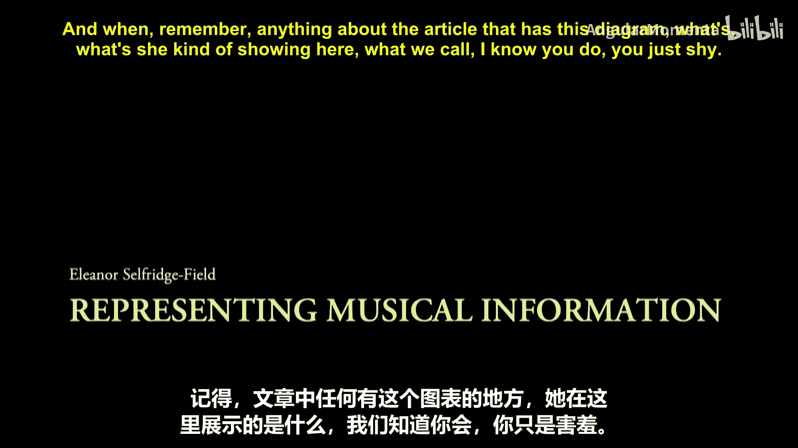
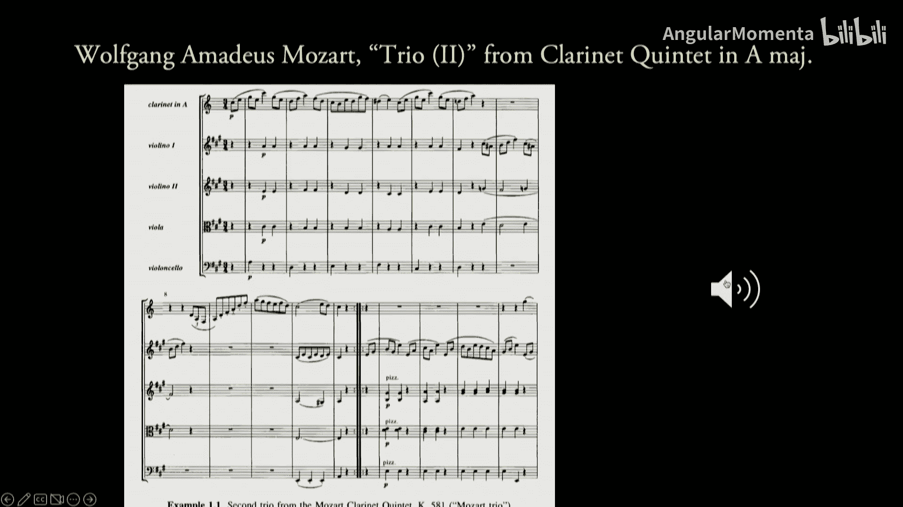
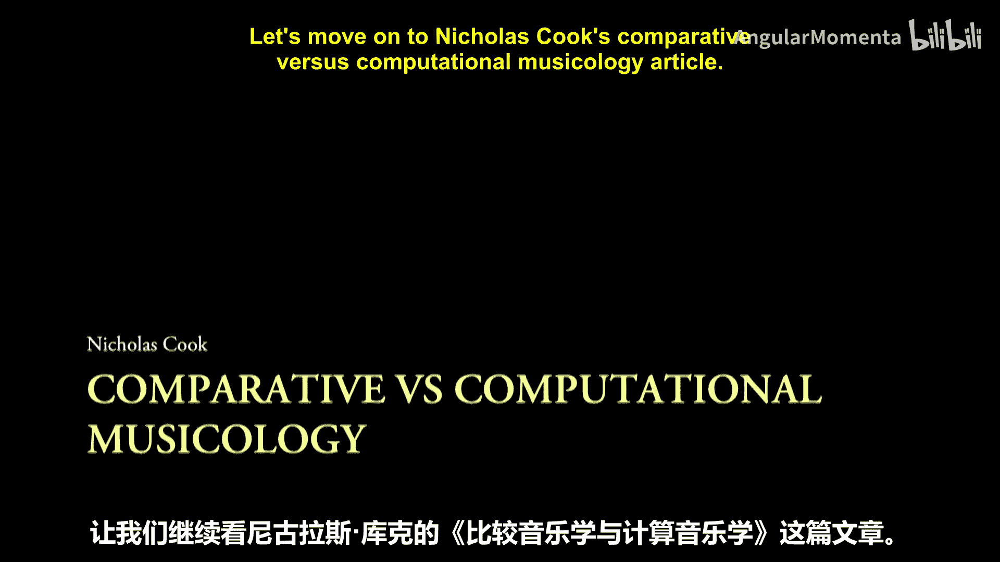
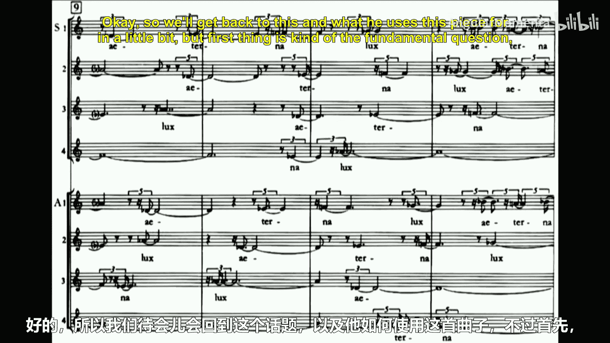
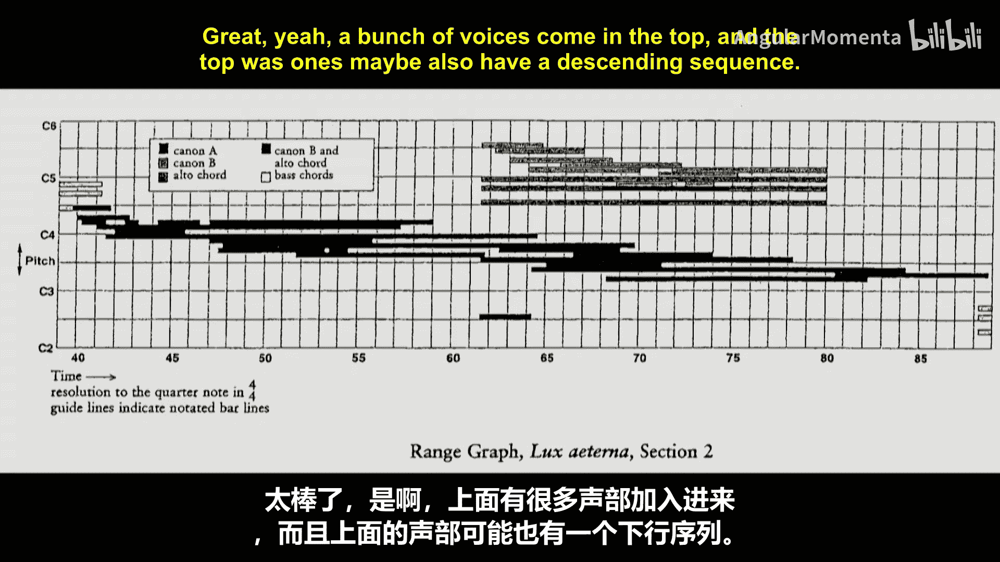
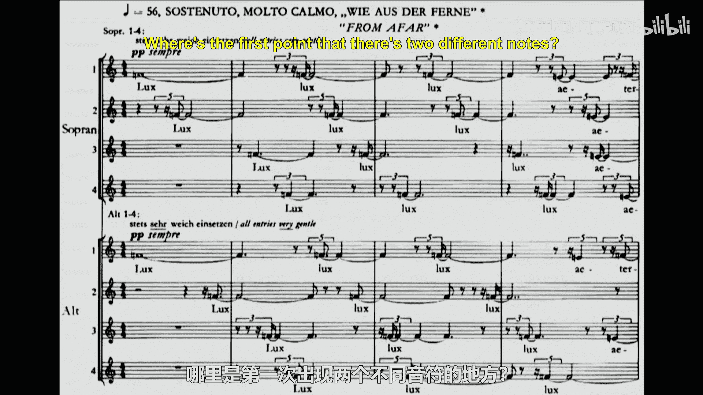
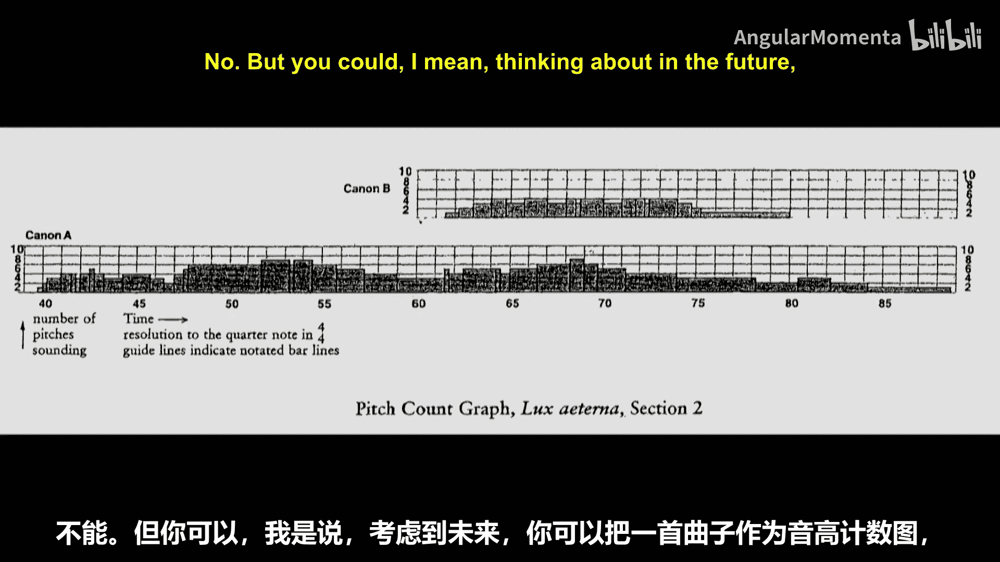
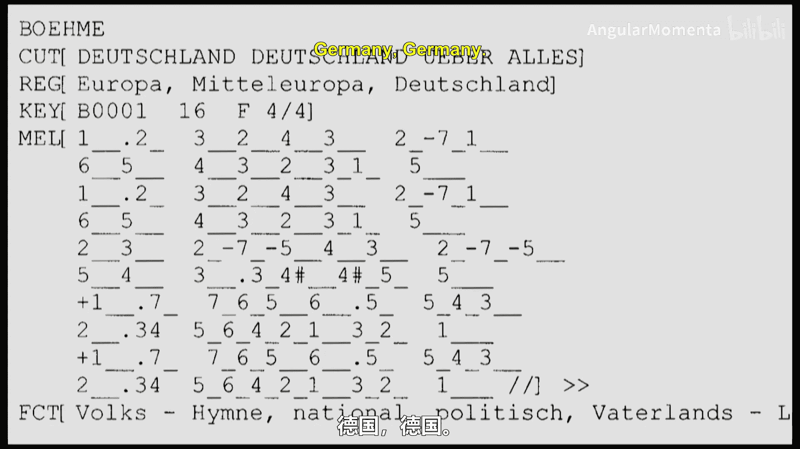
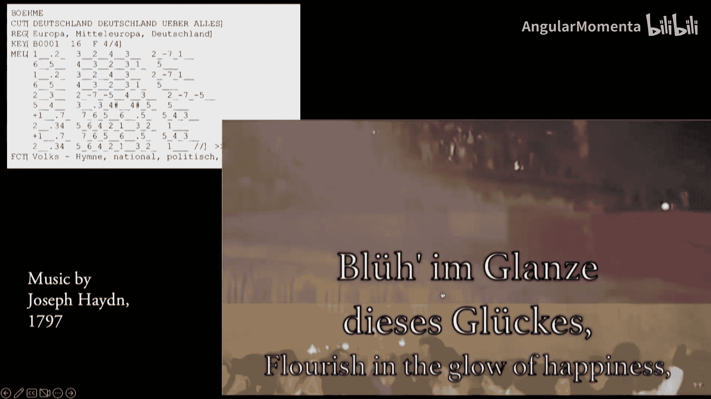
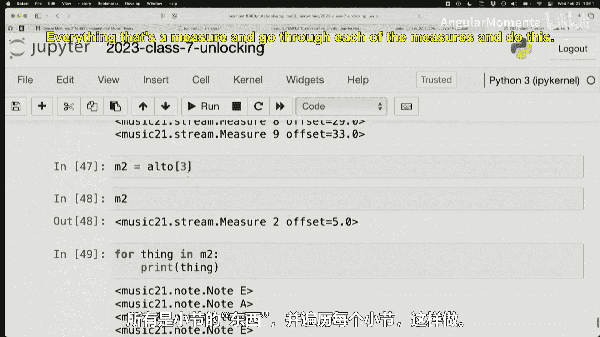

#  014：音乐表现（四）与层级结构（一）




在本节课中，我们将探讨音乐表现的不同维度，并开始理解音乐数据在计算机中的层级结构。我们将回顾两位重要学者——Eleanor Selfridge-Field和Nicholas Cook——关于音乐表现的核心观点，并通过实际编程练习来初步接触音乐数据的组织方式。

## 音乐表现的三个语境

上一节我们讨论了音乐表现的基本概念，本节中我们来看看Eleanor Selfridge-Field在其文章中提出的核心框架。她认为音乐表现发生在三个不同的语境（或领域）中。

以下是这三个语境：
*   **图形语境**：音乐在视觉上的呈现方式，例如乐谱上的符号、线条和形状。
*   **声音语境**：音乐作为物理声波被感知和体验的方式。
*   **逻辑/语义语境**：音乐符号所代表的概念、规则和意义。

这三个语境帮助我们区分“看到音符的图形”和“理解音符的时值”之间的差异。例如，一个音符的“时值”属性，在图形语境中可能表现为符杆和符尾的形状，而在逻辑语境中则代表与节拍、速度相关的抽象时间量。

## Selfridge-Field的“音符组件”图

Selfridge-Field文章中的一个著名图表，深入剖析了一个音符由哪些参数构成。这个图表成为了该领域的标志性图示之一。



它展示了音符是一个由多个组件构成的复合体，例如音高、时值、力度等。这种将音乐对象分解为基本属性的思维方式，对计算音乐学产生了革命性影响，因为它直接对应了计算机中“对象”和“属性”的概念。





## 表现形式的“好”与“坏”

接下来，我们转向Nicholas Cook关于比较音乐学与计算音乐学的文章。他提出了一个关键观点：**不存在绝对“好”或“坏”的音乐表现形式**。





一种表现形式的好坏，完全取决于你用它来做什么。Cook用多个例子阐述了这一点。



以下是两个具体的例子：
*   **用于分析的图表**：一幅显示乐曲音高范围的图表，对于分析作品的结构和紧张度变化（例如在卢克斯·埃特纳的作品中寻找音域最宽、最不协和的时刻）是极好的工具。然而，演奏者几乎无法根据这幅图表来演奏原曲。
*   **用于比较的编码**：像**Humdrum**的**kern**格式这样的编码，将乐谱数据转为文本，便于进行跨作品的大规模模式比较和计算分析。但这种格式对于人类阅读和演奏来说并不直观。

这个观点提醒我们，在设计或选择一种音乐表现系统时，必须首先明确其目标用途。

## 比较音乐学与计算音乐学

Cook文章的标题将“比较音乐学”与“计算音乐学”并置。我们需要理解这两者之间的联系与警示。

比较音乐学是早期民族音乐学的一种方法，侧重于跨文化地比较音乐现象。然而，这种方法常因隐含的文化优越感（例如，以西方艺术音乐为标准衡量其他音乐）而受到批评，并逐渐被强调深入理解特定文化语境的现代民族音乐学所取代。

计算音乐学的兴起，使得大规模、自动化地比较音乐数据成为可能。这既复活了比较研究的某些方面，也带来了重复历史偏见的风险。Cook的文章警示我们，必须对输入计算机的数据和所提的问题保持高度警惕，避免“垃圾进，垃圾出”。

## 初探Music21中的音乐层级结构





现在，让我们从理论讨论转向实践，开始用Python的Music21库来探索音乐数据是如何被组织起来的。我们将初步接触音乐数据的层级结构。

首先，我们解锁必要的模块并创建一个音符对象：

```python
from music21 import note
n = note.Note("C#5") # 创建一个升C5音符
```

一个音符对象包含`pitch`（音高）和`duration`（时值）等属性。我们可以分别访问和修改它们：

```python
print(n.pitch.name) # 输出音高名称
n.duration.type = 'half' # 将音符时值改为二分音符
```

接着，我们解锁更复杂的结构，并加载一首完整的乐曲：

```python
from music21 import corpus, stream
bach = corpus.parse('bwv66.6') # 加载巴赫的众赞歌BWV 66.6
bach.show() # 尝试显示乐谱
```

在Music21中，一首乐曲（`Score`）是一个流（`Stream`），它包含多个部分。我们可以像遍历列表一样遍历它：

```python
for thing in bach:
    print(thing) # 打印巴赫作品中的每个顶层元素（如元数据、声部）
```

为了找到所有的音符，我们需要深入层级：从`Score`到`Part`（声部），再到`Measure`（小节），最后到`Note`（音符）。这可以通过嵌套循环和类型检查来实现：

```python
for part in bach:
    if isinstance(part, stream.Part):
        for measure in part:
            if isinstance(measure, stream.Measure):
                for element in measure:
                    if isinstance(element, note.Note):
                        print(element) # 打印找到的每一个音符
```

这种方法虽然繁琐，但清晰地揭示了音乐数据的树状层级结构。在后续课程中，我们将学习更简洁的方法来遍历和访问这些数据。

## 总结




本节课中我们一起学习了音乐表现的多个维度。我们回顾了Selfridge-Field提出的图形、声音和逻辑三个表现语境，以及Cook关于表现形式取决于用途的核心观点。我们还审视了计算音乐学与比较音乐学之间的历史联系与潜在风险。最后，我们通过Music21库进行了初步实践，了解了音乐数据从乐谱、声部、小节到音符的层级组织结构，为后续更深入的计算分析打下了基础。