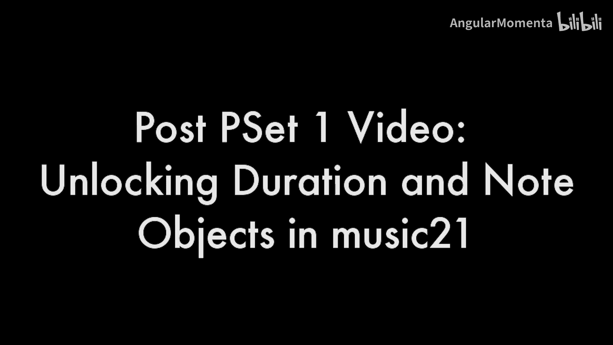
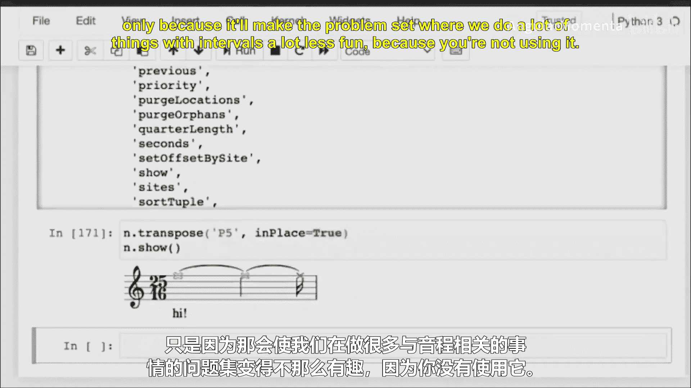
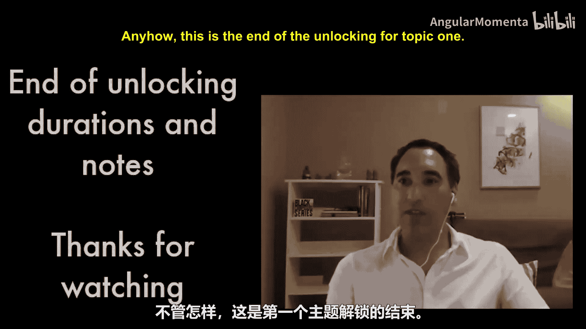
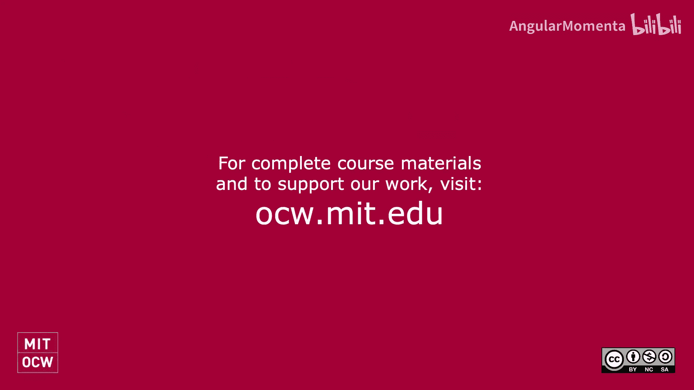

#  015：在music21中解锁时长与音符对象 🎵




在本节课中，我们将学习如何使用music21库处理音乐的时长（Duration）和音符（Note）对象。我们将从时长模块开始，逐步深入到音符对象的创建与属性设置。

## 概述

上一节我们介绍了音高（Pitch）对象。本节我们将解锁时长（Duration）和音符（Note）对象。时长对象用于表示音符的时值，而音符对象则结合了音高和时长，是音乐表示的核心单元。

## 解锁时长对象

首先，我们从music21库中导入时长模块。

```python
from music21 import duration
```

导入的`duration`是一个模块。在Python中，模块通常以小写字母命名。我们可以通过检查模块内容来确认这一点。在模块内部，通常有一个与模块同名的对象。例如，`duration`模块中包含一个`Duration`对象。

创建一个时长对象，并指定其值为3.0。

```python
d = duration.Duration(3.0)
```

在music21中，数值表示的是四分音符的数量。因此，3.0代表三个四分音符的时长。我们可以获取该时长的全名。

```python
print(d.fullName)  # 输出：dotted half
```

时长对象具有`type`属性，表示音符类型（如全音符、二分音符等），以及`quarterLength`属性，表示以四分音符为单位的长度。

```python
print(d.type)         # 输出：half
print(d.quarterLength) # 输出：3.0
```

我们也可以用另一种方式创建时长对象，例如指定类型为全音符并添加四个附点。

```python
d2 = duration.Duration(type='whole', dots=4)
print(d2.quarterLength) # 输出：7.75
```

以下是创建连音（例如三连音）的方法。

```python
d3 = duration.Duration('8th')
d3.appendTuplet(duration.Tuplet(3, 2)) # 创建一个三连音，实际演奏时值为原时长的2/3
print(d3.quarterLength) # 输出：0.166666... (即1/6)
```

连音信息存储在`tuplets`属性中，它是一个元组（不可变列表），因为一个时长上可以叠加多个连音。

```python
print(d3.tuplets) # 输出：一个包含Tuplet对象的元组
t = d3.tuplets[0]
print(t.tupletMultiplier()) # 输出：0.666666... (即2/3)
```

music21支持从全音符到1024分音符的多种时值类型。类型名称使用特定的缩写，例如八分音符是`eighth`，十六分音符是`16th`。

```python
print(duration.Duration(type='breve').type)    # 输出：breve (二全音符)
print(duration.Duration(type='1024th').type)   # 输出：1024th
```

## 处理复杂时值

有时，一个听觉上的音符可能对应乐谱上的多个音符，例如一个八分音符连同一个三十二分音符。

```python
dl = duration.Duration([duration.Duration('eighth'), duration.Duration('32nd')])
print(dl.quarterLength) # 输出：0.15625 (即1/8 + 1/32)
```

这个时长对象包含多个组件。一个音符的“长度”取决于我们使用的上下文。在音响或录音语境中，它是一个音符；但在记谱语境中，它可能需要被表示为两个相连的音符。本课程的一个重要部分就是学习如何在不同的音乐表示法之间进行转换。

你可以使用`dir()`函数查看对象的属性和方法，或在Jupyter Notebook中使用`?`获取文档。

```python
dir(d)
# 或
d?
```

## 解锁音符对象

现在我们已经解锁了音高和时长，接下来解锁音符对象。音符对象是music21中表示单个乐音的核心。

有多种方式可以创建音符。在music21中，一个音符（Note）对象包含一个音高（Pitch）对象和一个时长（Duration）对象。

```python
from music21 import note
n = note.Note("C#4") # 创建一个音符，默认时长为四分音符
print(n.name)        # 输出：C#
print(n.octave)      # 输出：4
```

音符对象包含一个`pitch`属性，它是一个Pitch对象，你可以修改它。

```python
n.pitch.octave = 5
n.pitch.nameWithOctave # 输出：C#5
```

音符对象也包含一个`duration`属性，默认是四分音符。你可以修改它。

```python
n.duration.quarterLength = 3.5
print(n.fullName) # 输出：C-sharp in octave 5 double dotted half note
```

一个很酷的功能是，你可以用`show()`方法在乐谱中显示这个音符（音符对象可以，但纯音高或时长对象不行）。

```python
n.show()
```

你还可以修改音符的许多其他属性。

```python
n.notehead = 'x'  # 将符头改为“x”形
n.style.color = 'red' # 将音符颜色改为红色
```

对于无法用单个标准音符表示的复杂时值（如6.25个四分音符），music21会自动计算如何在五线谱上表示它。

```python
n2 = note.Note("D5")
n2.duration.quarterLength = 6.25
n2.show() # 将显示为多个相连的音符
```

此外，你还可以为音符添加歌词等附加信息。

```python
n2.lyric = "Hello"
```

音符对象有很多属性和方法，我们将在后续课程中深入学习。请自由探索，但请注意，任何以`transpose`开头的方法暂时不要使用，以免影响后续关于音程的习题乐趣。

## 总结







本节课我们一起学习了music21中的时长（Duration）和音符（Note）对象。我们了解了如何创建和修改时长，包括处理连音和复杂时值。然后，我们学习了如何创建音符对象，它结合了音高和时长，并探索了其多种属性，如修改音高、时长、符头、颜色以及添加歌词。这些对象是进行音乐计算和分析的基础。在接下来的课程中，我们将利用这些知识进行更复杂的音乐操作。