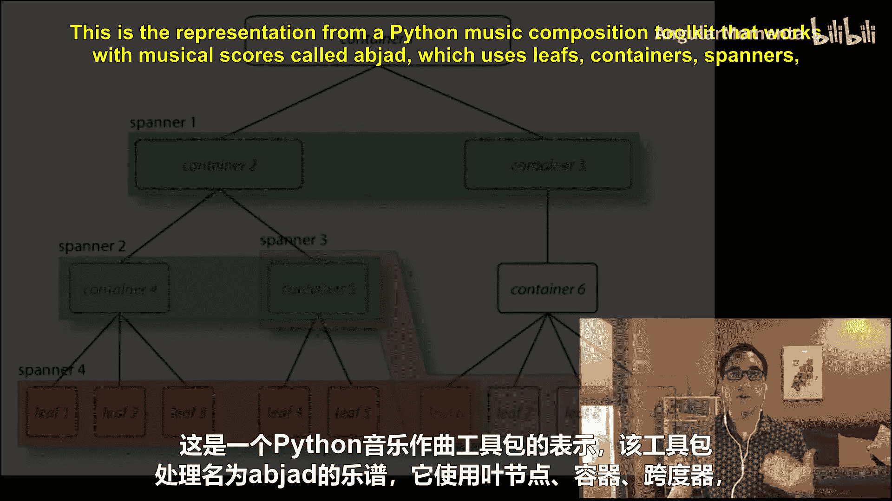
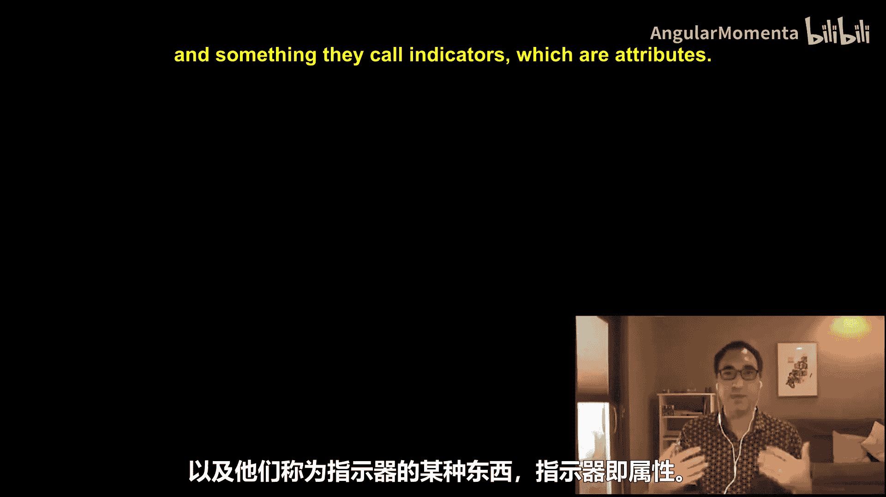

#  016：容器类型 🎵

在本节课中，我们将要学习音乐21库中一个核心的组织概念：流（Stream）。流是一种容器，用于组织和存储音乐中的各种元素，如音符、和弦等。理解流的层级结构是使用音乐21进行音乐分析和处理的基础。


## 概述：容器、元素与跨度器

几乎所有处理乐谱的计算音乐系统，都包含容器的概念。容器内部包含被称为“叶子”或“元素”的基本对象。在音乐21中，这些基本对象通常被称为“元素”或“音乐21对象”。除了容器和元素，还存在第三个概念，我们稍后会讨论，称为“跨度器”。

下图展示了另一个名为Abjad的Python音乐作曲工具包中的表示方式，它使用了叶子、容器、跨度器以及被称为“指示器”的概念（在音乐21中，指示器相当于元素的属性）。





## 音乐21中的流

上一节我们介绍了容器和元素的通用概念，本节中我们来看看它们在音乐21中的具体实现——流。

在音乐21中，`Stream`类是所有容器的基类。流可以包含其他流或音乐元素，从而形成一个层级结构。以下是一些关键的容器类型：

以下是音乐21中主要的容器类型：

*   **Score**：最高层级的容器，代表整首乐曲，通常包含多个`Part`。
*   **Part**：代表一个声部或乐器轨，包含多个`Measure`。
*   **Measure**：代表一个小节，包含音符、和弦等音乐元素。
*   **Voice**：在某些复杂乐谱中，一个声部（Part）内可能包含多个`Voice`，用于表示同时进行的独立旋律线。

## 核心概念与操作

### 1. 流的层级与访问

流中的元素可以通过索引或迭代来访问。因为流可以嵌套，所以你需要知道如何在不同层级间导航。

```python
# 示例：访问流中的元素
from music21 import stream, note

# 创建一个简单的流并添加音符
s = stream.Stream()
n1 = note.Note("C4")
n2 = note.Note("D4")
s.append(n1)
s.append(n2)

# 通过索引访问
first_element = s[0]
# 迭代所有元素
for element in s:
    print(element)
```

### 2. 元素与属性


流中的每个元素（如`Note`、`Chord`）都是一个对象，拥有自己的属性（如音高`pitch`、时值`duration`）。这些属性相当于Abjad系统中的“指示器”。


```python
# 示例：访问元素的属性
print(n1.pitch)  # 输出音高
print(n1.duration.quarterLength)  # 输出时值（以四分音符为单位）
```

### 3. 跨度器

跨度器是一种特殊的对象，它不存储在容器内的特定位置，而是与一个或多个元素关联，表示跨越这些元素的音乐指示，例如连音线、渐强渐弱记号等。这是我们将要在后续课程中深入探讨的概念。

## 总结

本节课中我们一起学习了音乐21中流的层级结构。我们了解到`Stream`作为核心容器，可以组织`Score`、`Part`、`Measure`等构成完整的乐谱。我们探讨了如何访问流中的元素及其属性，并简要介绍了跨度器的概念。掌握这些基础知识是使用音乐21进行更复杂音乐计算和分析的关键第一步。