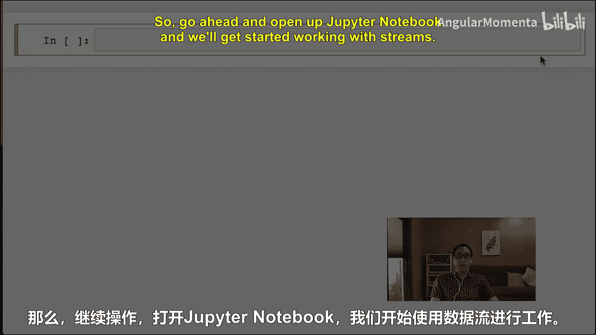
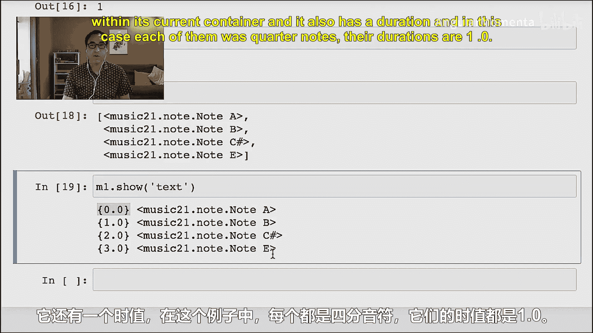
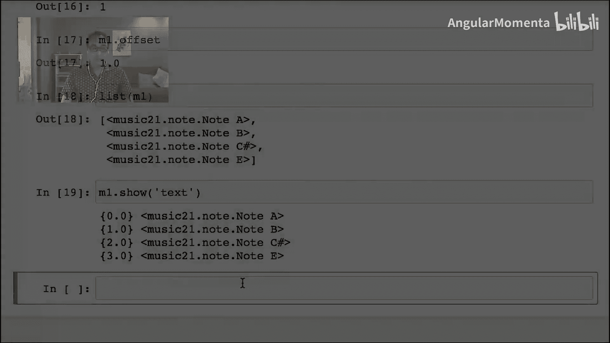
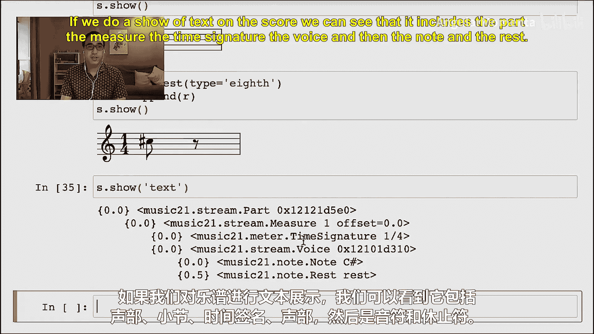
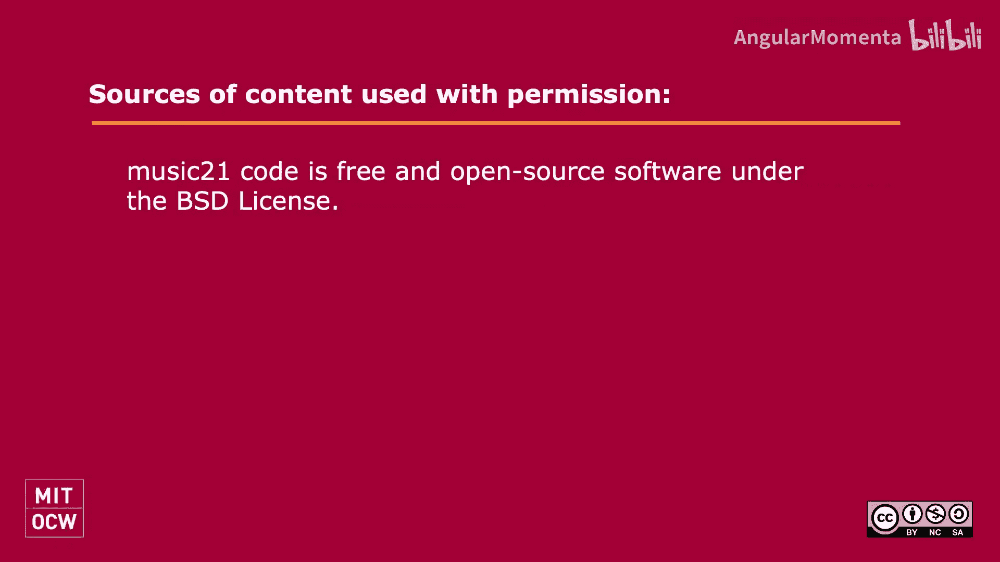

#  017：music21 流、语料库与节拍特征 🎵




在本节课中，我们将学习如何使用 `music21` 库的两个核心功能：**流（Streams）** 和**语料库（Corpus）**。我们将学习如何加载已有的音乐作品，如何从零开始构建自己的音乐结构，并理解音乐元素在流中的组织方式。

## 流与语料库简介

上一节我们介绍了音乐的基本表示方法。本节中，我们来看看 `music21` 中用于组织和操作音乐数据的两个关键概念：**流**和**语料库**。流是一种容器，可以容纳音符、小节、声部等音乐元素。语料库则是一个预置的音乐作品集合，方便我们进行学习和分析。

首先，我们需要导入必要的模块并加载一个示例作品。

```python
from music21 import stream
from music21 import corpus

bach_score = corpus.parse(‘bwv66.6’)
```

执行上述代码后，我们得到了一个 `bach_score` 对象。通过 `bach_score.show()` 命令，我们可以在乐谱软件中查看这首巴赫的众赞歌。它是一个包含四个声部（女高音、女低音、男高音、男低音）的乐谱。

## 探索流的结构

我们刚刚加载了一个乐谱。现在，我们来深入探索这个“流”的内部结构。在 `music21` 中，乐谱（Score）是一种特定类型的流，它可以包含多个声部（Part）。

我们可以像操作列表一样访问流中的元素。例如，要获取第一个声部（女高音），我们可以这样做：

```python
soprano_part = bach_score[1]  # 索引1对应第一个声部
print(type(soprano_part))
soprano_part.show()
```

声部本身也是一个流，它内部主要包含的是**小节（Measure）**对象。这符合“分声部（partwise）”的思维方式。我们可以继续深入，查看第一个小节：

```python
first_measure = soprano_part[1]  # 索引1对应第一个完整小节（跳过前奏小节）
print(first_measure)
print(first_measure.offset)
```

这里需要注意一个关键概念：**偏移量（Offset）**。在 `music21` 中，偏移量通常以四分音符长度为单位，表示一个元素在其**直接容器**中的起始位置。例如，第一个完整小节在声部中的偏移量是 `1.0`（即一个四分音符后开始）。而该小节内的第一个音符，在小节这个容器内的偏移量则是 `0.0`。

要查看一个流中所有元素及其偏移量的文本表示，可以使用 `.show(‘text’)` 方法。

```python
first_measure.show(‘text’)
```

## 从零构建音乐流

上一节我们学习了如何解析现有的音乐流。本节中，我们来看看如何从零开始，自己构建一个音乐流结构。这能帮助我们更深刻地理解流的层级关系。



我们将创建一个包含一个音符和一个休止符的简单乐谱。步骤如下：

1.  创建基本音乐元素（音符、休止符、拍号）。
2.  将这些元素放入合适的容器中（声部、小节）。
3.  将容器组合成最终的乐谱。



以下是构建过程的代码示例：

```python
from music21 import note, meter

# 1. 创建音乐元素
n = note.Note(“C4”)
r = note.Rest()
ts = meter.TimeSignature(‘1/4’)

# 2. 创建声部（Voice），并插入元素
v = stream.Voice()
v.insert(0, n)  # 在偏移量0处插入音符C4
v.append(r)     # 在声部末尾追加休止符

# 3. 创建小节（Measure），并插入拍号和声部
m = stream.Measure()
m.insert(0, ts)
m.insert(0, v)

# 4. 创建声部（Part），并插入小节
p = stream.Part()
p.append(m)

# 5. 创建乐谱（Score），并插入声部
s = stream.Score()
s.insert(0, p)

# 显示最终结果
s.show()
s.show(‘text’)
```

**重要提示**：当向乐谱中添加多个声部时，必须使用 `s.insert(0, part)`，因为所有声部在乐谱中的时间偏移量都是0，它们是同时进行的。如果错误地使用 `append()`，声部会变成先后顺序。

## 总结





本节课中我们一起学习了 `music21` 的核心容器——**流（Stream）**。我们掌握了如何从语料库加载现有作品并逐层探索其结构，也学会了如何从零开始，通过将音符、拍号等元素逐级放入声部、小节和乐谱中来构建自己的音乐流。理解**偏移量**的概念和流的**层级嵌套关系**是熟练使用 `music21` 进行音乐分析的关键。