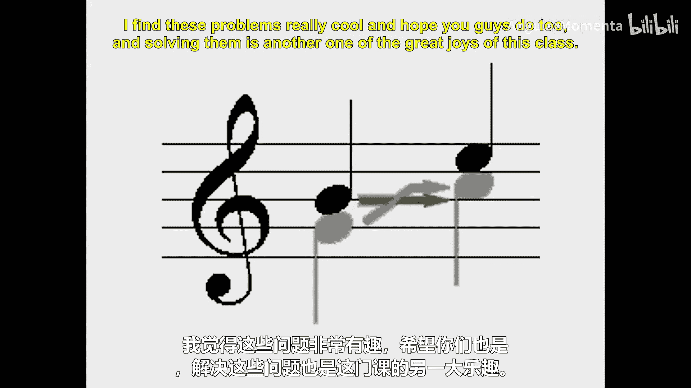
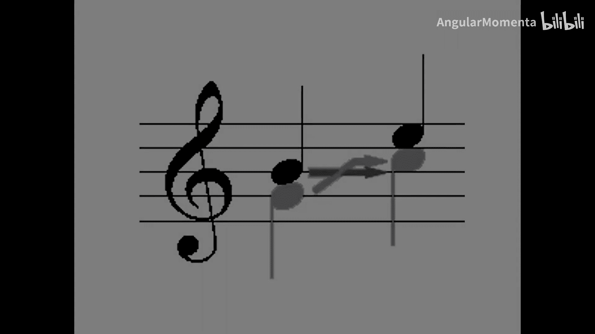

#  018：声部分立与时间维度复调音乐表征 🎼

在本节课中，我们将探讨音乐乐谱的两种基本表征方式：声部分立（Part-wise）和时间维度（Time-wise）。理解这两种方法对于分析任何包含多个声部或同时进行的独立旋律的音乐至关重要。

## 概述

音乐乐谱可以看作是一系列嵌套的容器。我们可以从整体结构（总谱）开始，逐步深入到各个声部、小节乃至更细的层次。另一种方式则是关注音乐在时间轴上的每一个“瞬间”，观察所有声部在同一时刻发生的事件。这两种视角各有优劣，适用于不同的分析场景。

## 声部分立表征（Part-wise）

声部分立表征将音乐视为一系列独立的声部线条。在这种视角下，我们首先关注总谱，然后将其分解为各个声部。例如，在一部三小时的歌剧中，我们会先处理整个短笛声部，从第一小节到最后一小节，然后再处理长笛声部，依此类推。

以下是声部分立表征的典型结构：
*   **总谱**：包含整部作品。
*   **声部**：总谱下的独立旋律线条（如短笛、长笛）。
*   **小节**：声部下的时间单位。
*   **声部内声层**：更细分的旋律层次（可选）。

这种结构使得追踪一个声部从始至终的完整旋律线变得非常容易，非常适合进行针对单一旋律线的分析。

## 时间维度表征（Time-wise）

与声部分立不同，时间维度表征关注音乐在时间轴上的每一个“切片”。它观察在某个特定时刻，所有声部中同时发生的事件。

在这种表征中：
*   我们首先列出所有在乐曲开头瞬间发声的音符（例如，所有女高音、女中音、男高音、男低音的音符）。
*   然后，我们移动到下一个有事件发生的瞬间，记录所有声部在该时刻的音符。
*   如果一个音符（如一个二分音符）从上一个瞬间持续到当前瞬间，它可能不会在“新事件”列表中重复出现，但会被理解为仍在持续。

这种方法能清晰地展示每个“攻击点”（音符起始时刻）的和声构成，便于程序化地分析每个瞬间的音乐状态。然而，它使得追踪跨越时间的旋律线变得困难。

在音乐信息检索领域，创建这种时间切片的过程常被称为 **`量化`** 或形象地称为 **“萨拉米切片”**。

## 两种表征的优缺点比较

那么，哪种方式更好？答案是两者各有千秋。

**声部分立表征的优点与挑战：**
*   **优点**：便于追踪从始至终的完整声部线条。
*   **挑战**：难以编码某些音乐现象。例如，一个“可选奏法”（Ossia）乐段——演奏者可以选择演奏的替代段落。在声部分立模型中，这个可选段落属于哪个声部？是否需要创建隐藏小节来容纳它？这给编码带来了困难。

**时间维度表征的优点与挑战：**
*   **优点**：能清晰展示特定时刻的和声，避免了“可选奏法”的编码难题。
*   **挑战**：难以处理装饰音（如颤音、倚音）的精确时序定位。例如，一连串的装饰音是附着在它们之前的音符还是之后的音符上？在时间切片中为其找到准确位置颇具挑战。

## 结合分析：以声部进行为例

有些音乐分析需要同时考虑横向（时间）和纵向（和声）关系，例如**声部进行**分析。一个常见的严格和声写作错误是“声部交叉”，即一个声部的音高超过了前一时刻另一声部确立的音高边界。

*   在**声部分立**视图中，你只能分别看到两个声部各自的进行（如B到E，G到C），但难以察觉它们之间的交叉关系。
*   在**时间维度**视图中，你看到的是瞬间的和声（如G和B，然后是C和E），但难以判断音高G具体进行到了哪个音（C还是E），即难以追踪横向的声部线条。

因此，要发现这类问题，我们经常需要在脑海中或计算模型中**同时保持**两种表征，或者在它们之间进行转换。

## 总结

本节课我们一起学习了音乐乐谱的两种核心表征方式：**声部分立**和**时间维度**。声部分立表征擅长处理纵向的、独立的旋律线条分析，而时间维度表征则擅长捕捉横向的、瞬间的和声状态。每种方法都有其适用的场景和固有的挑战。在实际的音乐计算分析中，根据具体任务在两种视角间灵活转换或结合使用，是解决复杂音乐问题的关键。探索并解决这些表征带来的问题，正是本课程的魅力所在。