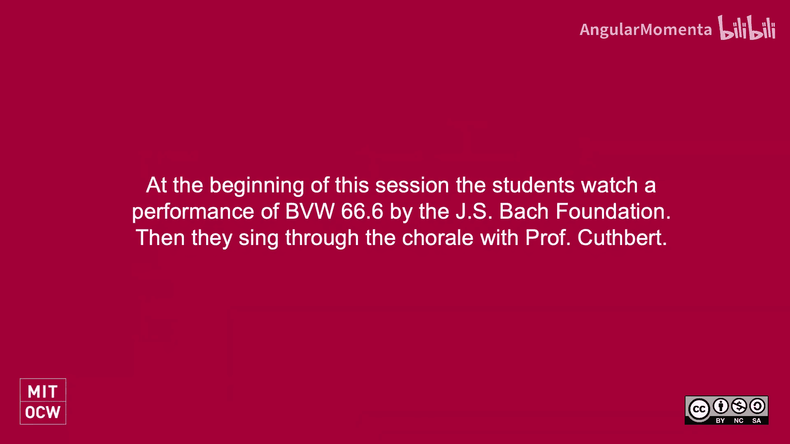
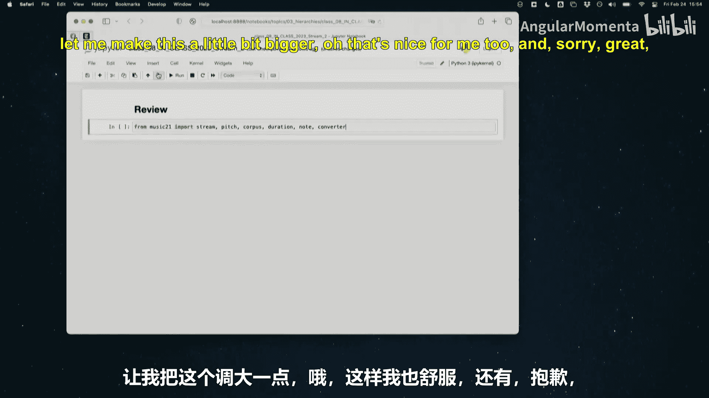
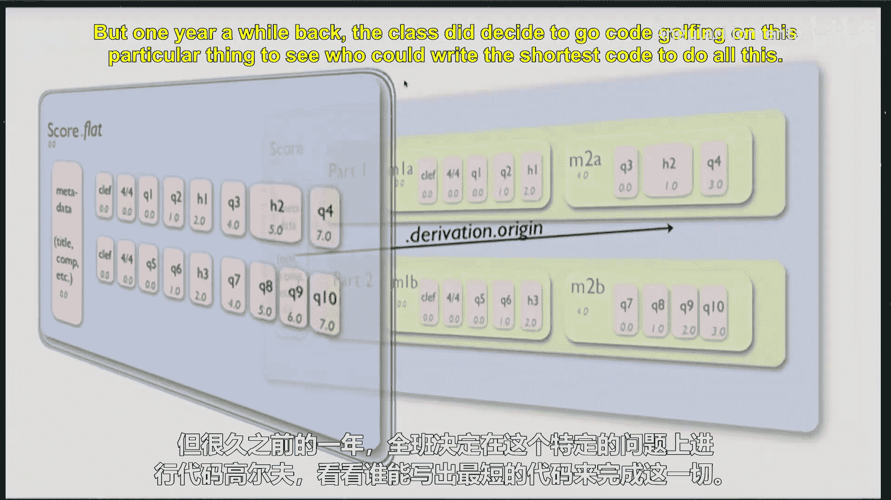
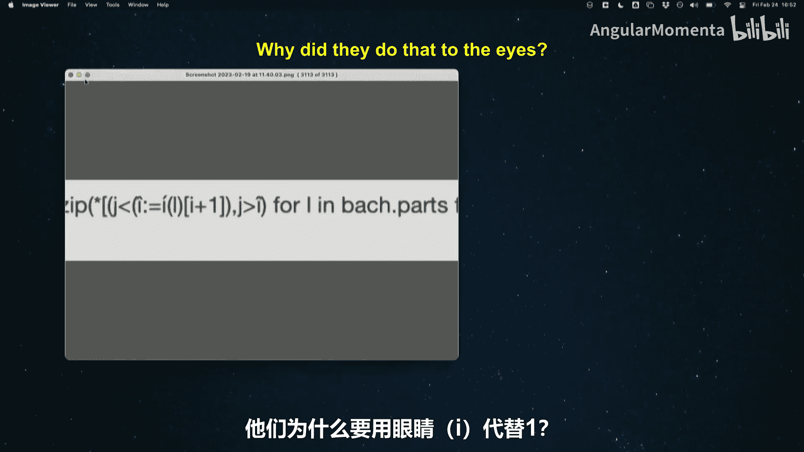
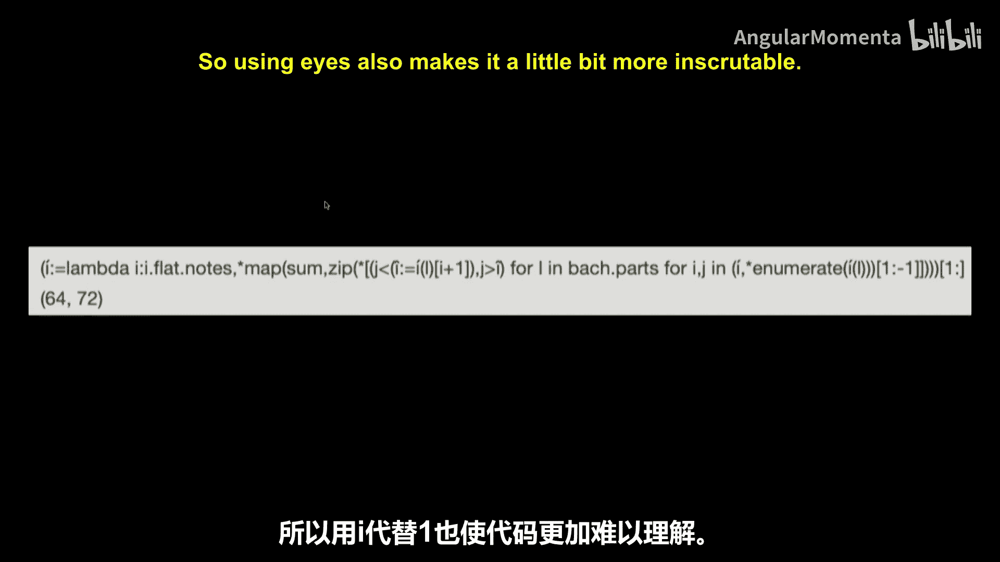

#  019：流与递归 🎵





在本节课中，我们将深入学习 Music21 中流的层级结构，并探索两种遍历这些结构的方法：递归遍历和扁平化遍历。我们将通过回顾上节课的内容，并引入新的概念来帮助你更有效地访问和处理音乐数据。

## 概述

上节课我们介绍了 Music21 的基本对象和层级结构。本节课，我们将重点学习如何遍历复杂的嵌套结构，特别是通过 `recurse()` 和 `flatten()` 方法。我们还将通过一个实践练习——分析巴赫众赞歌中上行与下行音符的数量——来巩固这些概念。

## 回顾：Music21 对象与层级

上一节我们介绍了 Music21 的核心对象。本节中，我们来看看如何访问它们。

我们使用 `corpus.parse` 来加载乐谱，例如巴赫的 BWV 66.6：

```python
bach = corpus.parse('bwv66.6')
```

一个乐谱对象包含嵌套的层级结构：
*   **Score（乐谱）**：顶层容器。
*   **Part（声部）**：乐谱中包含的各个声部（如女高音、女中音）。
*   **Measure（小节）**：声部中的小节。
*   **Note（音符）**：小节中的音符和其他元素（如休止符）。

有时结构中还会有 `Voice`（声部）或 `Opus`（作品集）等层级。

为了访问最底层的音符，我们之前使用了嵌套循环：

```python
for thing in bach:
    if isinstance(thing, stream.Part):
        for thing_in_part in thing:
            if isinstance(thing_in_part, stream.Measure):
                for note in thing_in_part:
                    print(note)
```

这种方法逐层深入，但代码较为冗长。

## 流的列表特性与偏移量

一个流（Stream）在很多方面类似于 Python 列表。

以下是列表的一些常见操作：
*   添加元素
*   删除或弹出元素
*   通过索引修改元素
*   获取长度
*   进行迭代（用于循环）
*   切片

流支持大部分类似操作。例如，我们可以获取一个特定的声部和小节：

```python
alto_part = bach[1] # 索引1对应第二个声部（女中音）
measure_3 = alto_part[2] # 索引2对应第三个小节
```

然而，流与列表有一个关键区别：**偏移量（Offset）**。偏移量定义了元素在其父容器中的位置，以四分音符长度为单位。在流中，多个元素可以共享同一个偏移量（例如和弦中的音符），这与列表中每个索引只能对应一个元素不同。

我们可以查看流中元素的偏移量：

```python
for element in measure_3:
    print(element, element.offset)
```

当我们尝试在流的特定位置插入一个音符时，是根据偏移量而非列表索引来定位的。

## 遍历流：递归与扁平化

上一节我们看到了手动遍历的复杂性，本节中我们来看看两种更强大的自动化方法。

### 深度优先搜索：`recurse()`

`recurse()` 方法对流的层级结构执行**深度优先搜索（DFS）**。它会尽可能深地遍历每个分支，然后再回溯到上一层继续。

```python
for element in bach.recurse():
    print(element, element.offset)
```

这将按深度优先的顺序打印出乐谱中每一个元素（元数据、声部、小节、音符等）及其在其**直接父容器**中的偏移量。

### 扁平化：`flatten()`

`flatten()` 方法则提供了另一种视角。它会创建一个新的流，其中包含原流中所有的“叶子”元素（如音符、休止符），但移除了所有中间容器结构（如声部、小节）。在这个新流中，所有元素的偏移量都是相对于**整个乐谱开头**计算的。

```python
flat_bach = bach.flatten()
for element in flat_bach:
    print(element, element.offset)
```

此外，`flatten()` 本质上执行的是**广度优先搜索（BFS）**，它会先处理同一层级的所有元素，再进入下一层级。

### 如何选择？

*   使用 `recurse()`：当你需要**保持层级上下文**（例如，需要知道某个音符属于哪个声部或小节）时。
*   使用 `flatten()`：当你只关心**事件的绝对时间顺序**，而不需要层级信息时。

一个重要的点是：通过 `flatten()` 得到的流中的元素，与原始流中的元素是**同一个对象**。`flatten()` 会修改对象的内部站点信息。你可以通过 `derivation.origin` 属性找到元素的原始来源。

## 实践练习：分析巴赫众赞歌

现在，让我们应用所学知识。我们将分析巴赫的 BWV 66.6，统计其中**上行音程**和**下行音程**的数量。

**思考步骤：**
1.  你需要遍历乐谱中的每一个音符。
2.  比较连续两个音符的音高。
3.  判断音程是上行（后一个音高更高）、下行（后一个音高更低）还是同度（音高相同）。
4.  选择使用 `recurse()` 还是 `flatten()` 来实现会更方便？为什么？

你可以尝试将这个分析扩展到 `corpus` 中的其他作品。

## 关于代码的提示

*   **可读性**：请编写清晰、易读的代码，使用有意义的变量名。
*   **完整性检查**：编写代码后，务必通过查看乐谱或使用 `show()` 方法等方式，验证你的结果是否合理。
*   **查阅文档**：对于更高级的操作（如从流中移除元素），请参考 Music21 用户指南中关于“流”的章节。

## 总结

本节课中我们一起学习了：
1.  回顾了 Music21 的层级结构：Score -> Part -> Measure -> Note。
2.  理解了流的“偏移量”概念及其与列表索引的区别。
3.  掌握了两种遍历流的核心方法：
    *   `recurse()`：进行深度优先搜索，保留层级上下文。
    *   `flatten()`：进行广度优先搜索，提供扁平化的时间线视图，偏移量相对于乐谱开头。
4.  通过分析巴赫众赞歌中音程走向的实践，应用了这些遍历方法。








理解这些遍历技巧是使用 Music21 进行复杂音乐分析的基础。