#  020：音乐信息检索（MIR）- 从声音到乐谱与音乐理论 🎵

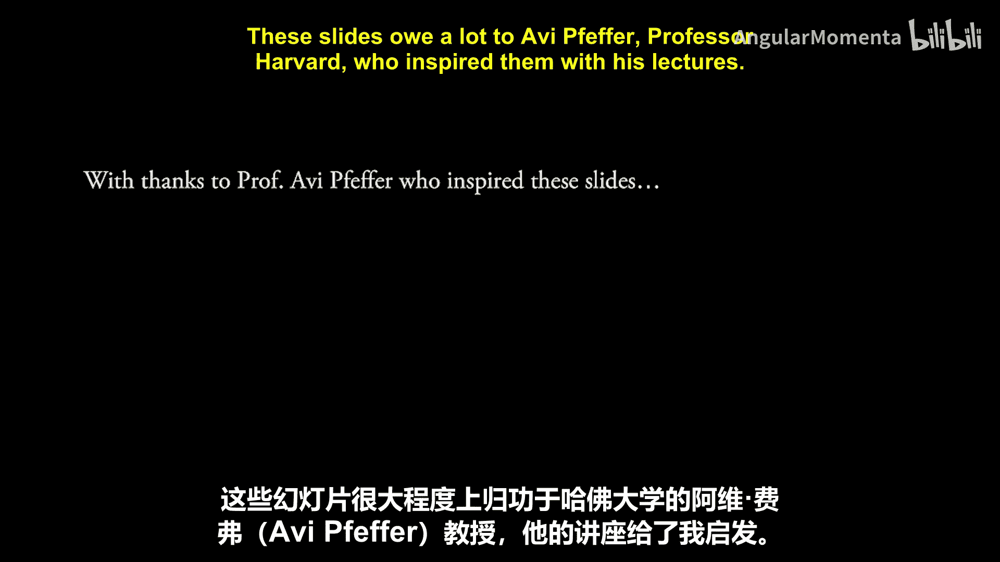

在本节课中，我们将学习音乐信息检索（MIR）的核心问题，即如何将现实世界中的声音转换为乐谱，并探讨这一过程如何与音乐理论和音乐学相互关联。

## 核心问题：从声音到乐谱

我们主要探讨的问题是：如何将现实世界中产生的声音，转换为打印出来或显示在屏幕上的乐谱。为了实现这一目标，需要哪些技术以及需要解决哪些问题。

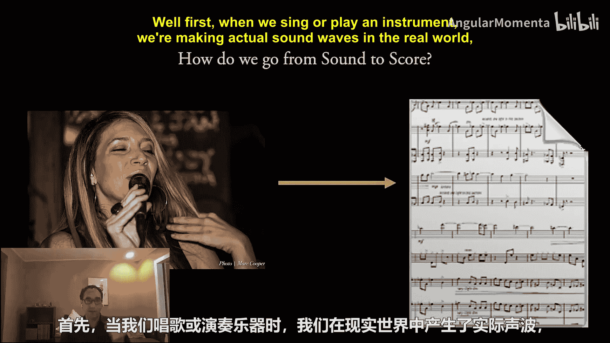

## 从声音到信号的转换

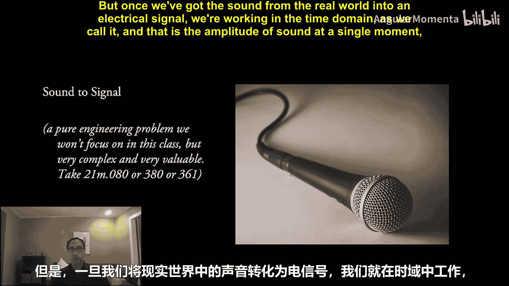

首先，当我们唱歌或演奏乐器时，我们是在现实世界中产生实际的声波。因此，我们需要解决如何最准确地将声音转换为信号的问题。这涉及到麦克风和其他设备，这是一个纯粹的工程问题，本课程不会重点讨论。

## 从时域到频域

一旦我们将现实世界的声音转换为电信号，我们就进入了所谓的“时域”工作。时域表示的是单个瞬间声音的振幅（正向、反向、正或负）。我们通常以接近CD质量的采样率（每秒44,100次）进行录制，振幅测量为16位有符号整数。

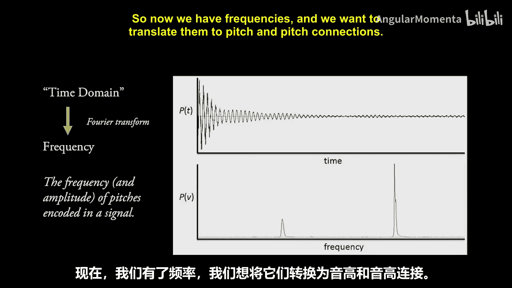

此时的声音波形可能类似下图，例如一个乐器（如钢琴）的起音和衰减过程。

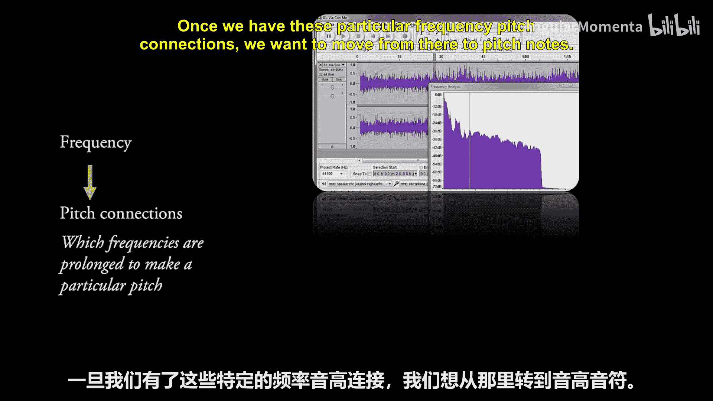

这里的关键问题是：如何从时域转换到频域？如何从信号中解码并理解，例如“在这个声音中，有两个主要频率在同时发声”？为此，我们使用**傅里叶变换**。**快速傅里叶变换算法**是在这个领域工作的必备知识。

## 从频率到音高关联

现在，我们有了频率数据，需要将其转换为音高及其关联。这不仅仅是识别某个频率（例如440赫兹是A4音），更重要的是，判断哪些持续出现的频率构成了一个特定的音高。例如，即使在我说话时，也有特定频率出现，但它们不一定构成乐音；长笛的起音部分也不一定是我们想要的音高。因此，我们需要识别哪些频率是相互关联以构成音高的。

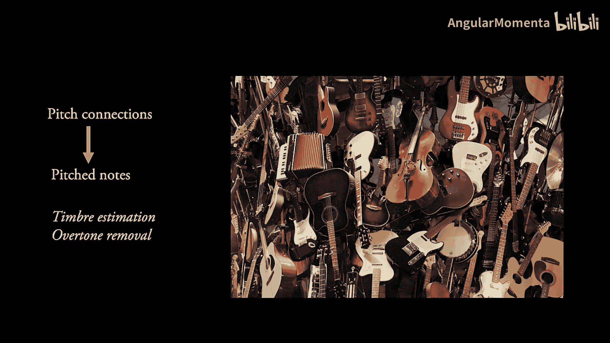

## 从音高关联到音符音高

一旦我们确定了这些特定的频率-音高关联，下一步就是从中提取出具体的音符音高。以钢琴为例，我们可能检测到两个频率，但这代表两个独立的音高吗？还是其中一个只是房间的混响？对于其他乐器，你可能听到七个频率，其中六个较高且音量很轻，你可能会认为那是该乐器的泛音列。

因此，从音高关联到音符音高的过程，涉及到对**音色**的估计。乐器的音色是什么？预期的泛音列是怎样的？我们如何移除它们？移除后，我们是否仍然得到和弦中的多个音高？

## 从音符音高到时值与速度

确定了我们感兴趣的音乐音高后，下一步是理解这些音高的**持续时间**和乐曲的**速度**。

我们可以使用特定的算法来估计持续时间。一种简单的方法是将毫秒级的时长与最常见的音符（如四分音符）对应起来，从而估计速度。或者，我们可以反过来，根据所有音高尝试估计一个速度，基于那些似乎是节拍的、反复出现的起始点，然后据此计算出每个音符的持续时间（如四分音符、二分音符、三拍长等）。

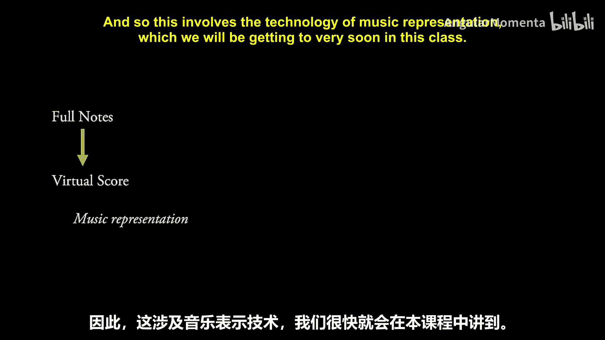

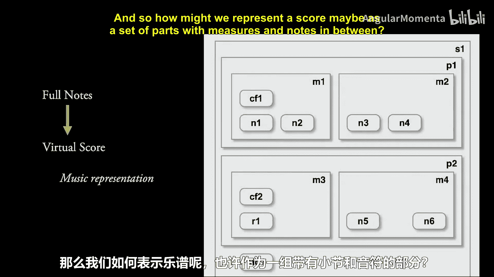

MIR领域的研究者通常如何操作？实际上，我们通常会创建一个**反馈循环**，同时尝试两种方法：对速度的估计会推导出持续时间，这些持续时间可能被接受或拒绝；而对持续时间的估计又会推导出对速度的估计。这涉及到**节拍跟踪**和**自相似性检测**等技术。

## 构建完整音符与虚拟乐谱

结合音高、持续时间和速度，我们可以创建所谓的**完整音符**，即结合了音高和时值的音符对象。

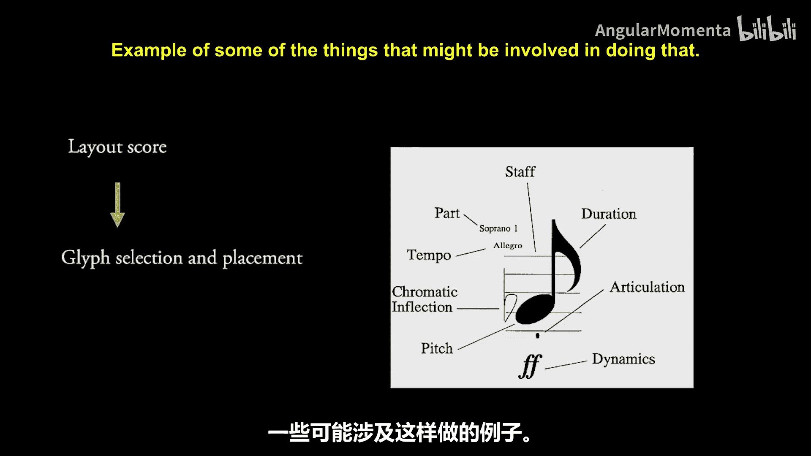

从所有这些完整音符中，我们可以构建一个**虚拟乐谱**。这个乐谱纯粹表示为音符和其他可能在此刻被估计的事件的集合（例如渐强、渐弱，或某些音符是连奏的）。我们将这些都作为对象保存在内存中。这涉及到**音乐表示技术**，我们将在本课程中很快接触到。例如，我们可能将乐谱表示为一组包含小节和音符的声部。

## 从虚拟乐谱到排版与渲染

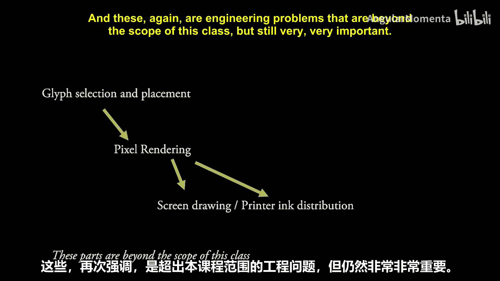

从虚拟乐谱出发，我们需要确定它如何在页面或屏幕上显示。因此，我们进行**布局估计**，并创建一个**排版乐谱**。此时，音符不再仅仅是数组或列表中的元素，而是页面上有实际位置的对象。这同样涉及到一些我们将在课程中学习的技术。

下图展示了一个布局估计非常差的例子。

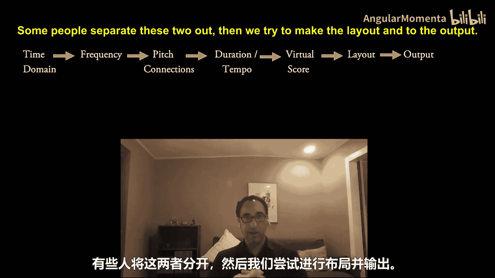

在排版乐谱中，我们选择合适的**字形**并确定它们在页面上的放置位置。

一旦我们有了排版乐谱、字形选择和布局，我们就进入**像素渲染**阶段。此时，我们处理的是独立的像素点，不再与任何语义含义直接关联，只是决定某个XY坐标点是黑色、白色还是其他颜色。这需要特定的技术，如屏幕绘制（老式的阴极射线管、LED显示屏等），或实际打印到页面上。这些同样是超出本课程范围的工程问题，但非常重要。

## 过程总结

让我们再次总结一下整个流程：
1.  从**时域**转换到**频率**。
2.  从**频率**转换到**音高关联**。
3.  估计**持续时间**和**速度**。
4.  创建**完整音符**。
5.  构建**虚拟乐谱**（或逻辑乐谱）。
6.  进行**布局**并**输出**。

## 音乐理论与音乐学的双向互动

在上述流程的每一个环节，我们都可以引入音乐理论或音乐学知识，并且可以从该环节获取的数据中学习音乐理论或音乐学的各个方面。

**例如：**
*   在**持续时间/速度**层面，我们可以分析这首曲子最常用的节奏型是什么，并据此为独奏者创建一个伴奏鼓点轨道。
*   在**频率到音高关联**层面，我们可以根据被移除的泛音来理解使用了哪些乐器，它们是否在自然音域内演奏，并可能据此估计录音的年代或乐曲的创作年代。

这些都是音乐理论和音乐学可以从MIR过程中获取数据的环节。

但还有另一个较少被讨论的方面，也是本课程学员可以贡献巨大潜力的地方，那就是**从音乐理论或音乐学知识出发，利用我们对音乐理论、历史或研究的了解，来增强上述各个环节中算法的质量**。

**例如：**
*   在**音高关联**层面，我们可以查看元数据，发现这是莫扎特的作品（卒于1791年）。如果频率/泛音估计算法认为最可能的乐器是电吉他，这很可能是不对的。我们可以提示算法尝试早期钢琴（fortepiano）的泛音配置文件，从而得到更准确的结果。
*   在**频率检测**层面，我们可以运用音乐理论：如果算法检测到的所有音符都属于E大调，然后突然出现一个A#音，这看起来有点可疑。而算法可能有一个备选音符A（自然音），其可能性只低了5%。从音乐理论角度看，我们更可能检测错了音符，应该选择A音。

**最令人兴奋的是**，当流程的某些部分既从音乐理论/音乐学算法中获取信息，又反过来增强这些算法时，就形成了良性循环。例如，我们根据频率、音高、持续时间推断出这首曲子的风格属于摇摆乐时代。然后，这个信息可以帮助后续的虚拟乐谱构建环节：既然风格是摇摆乐，那么在表示那些三连音节奏型时，应该采用符合其音乐概念的记谱方式。

我们不仅可以向前推进流程，还可以在**虚拟乐谱**层面进行反馈。例如，算法开始将乐谱布局为3/4拍，但音乐学/音乐理论算法指出，这些节奏型对于3/4拍来说极不寻常。这时，我们可以带着“这极不可能”的判断，回溯并重新运行前面的某些步骤，尝试生成一个不同的、更合理的结果。

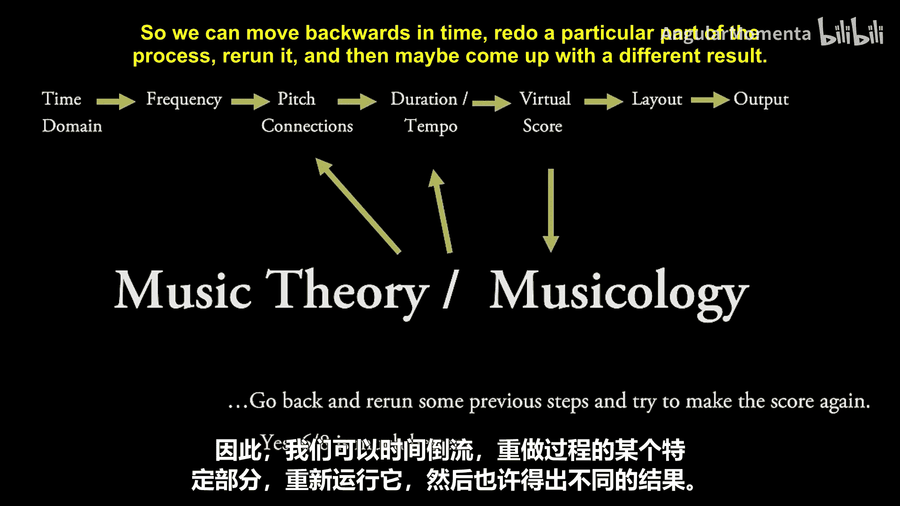

## 总结

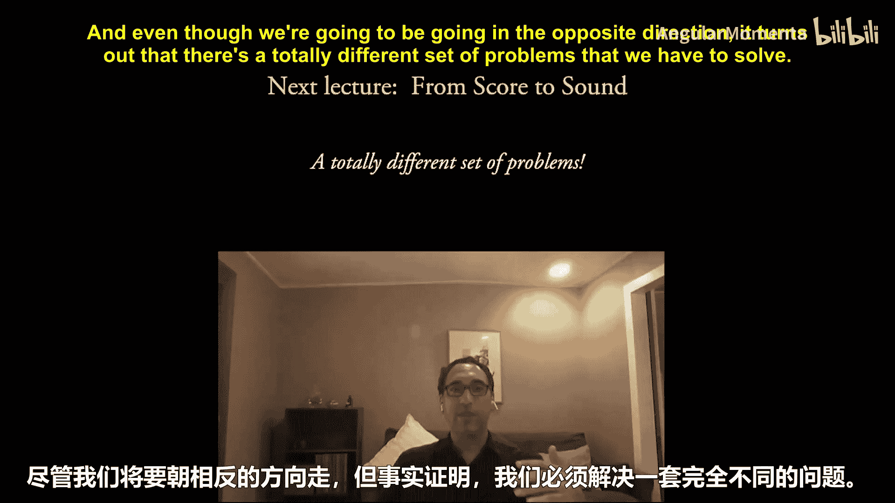

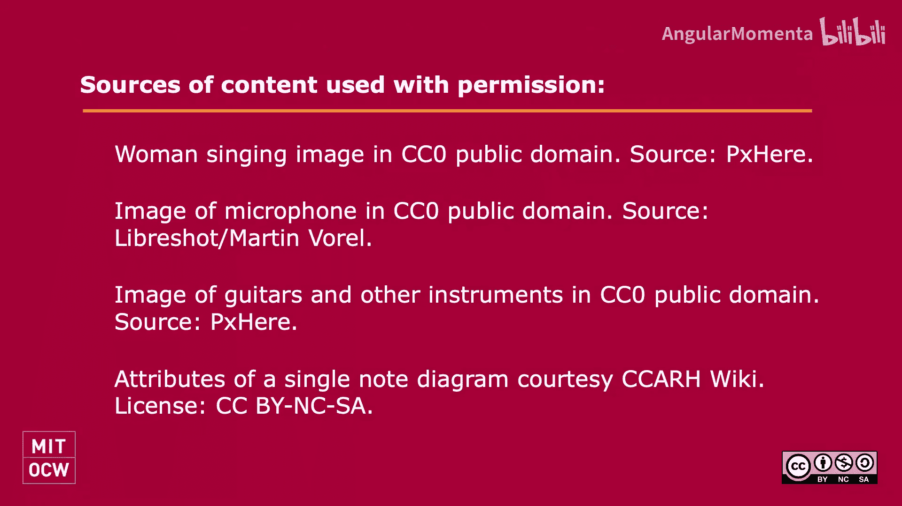

本节课中，我们一起学习了音乐信息检索（MIR）中将声音转换为乐谱的完整流程，涵盖了从时域信号到最终乐谱渲染的各个关键技术步骤。更重要的是，我们探讨了音乐理论与音乐学如何与这一技术流程进行双向、动态的互动：既可以从MIR数据中提取音乐学洞见，也可以利用先验的音乐知识来指导和优化MIR算法，从而提升整个系统的准确性和音乐合理性。