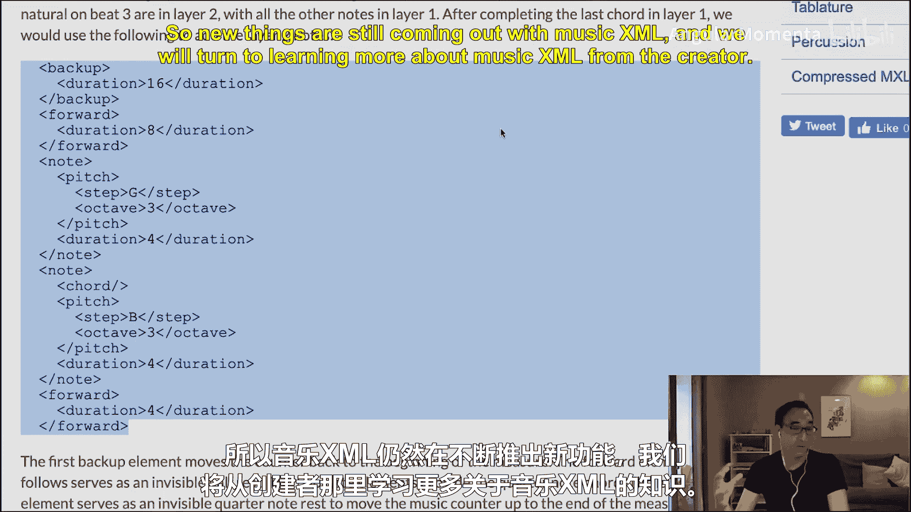

#  021：MusicXML 简介 🎵


在本节课中，我们将学习 MusicXML，这是西方通用乐谱最常用的数字表示格式。我们将了解其基本结构、核心概念以及如何表示音符、和弦、多声部等音乐元素。

---

## 概述

MusicXML 由 Michael Good 在 2000 年左右创建，是一种基于 XML 的乐谱表示格式。它类似于 HTML，使用标签、属性和内容来描述音乐信息。与 Music21 等工具类似，MusicXML 旨在精确表示乐谱的视觉与听觉两方面。

---

## MusicXML 的基本结构

MusicXML 使用标签来组织数据。每个标签用尖括号包围，可以包含内容或其他标签，也可以拥有属性。

例如，一个简单的 MusicXML 文档结构如下：
```xml
<score-partwise>
  <part-list>
    <score-part id="P1">
      <part-name>Piano</part-name>
    </score-part>
  </part-list>
  <part id="P1">
    <measure number="1">
      <attributes>
        <divisions>1</divisions>
        <key>
          <fifths>0</fifths>
        </key>
        <time>
          <beats>4</beats>
          <beat-type>4</beat-type>
        </time>
        <clef>
          <sign>G</sign>
          <line>2</line>
        </clef>
      </attributes>
      <note>
        <pitch>
          <step>C</step>
          <octave>4</octave>
        </pitch>
        <duration>4</duration>
        <type>whole</type>
      </note>
    </measure>
  </part>
</score-partwise>
```

---

## 音符的表示

在 MusicXML 中，音符通过 `<note>` 标签表示。每个音符包含音高、时长和类型等信息。

以下是音符的核心组成部分：
*   **音高 (`<pitch>`)**：由 `<step>`（音名，如 C、D、E）和 `<octave>`（八度编号）定义。
*   **时长 (`<duration>`)**：表示音符的绝对时长，其单位由 `<divisions>` 标签定义。
*   **类型 (`<type>`)**：表示音符的视觉类型（如全音符、四分音符）。

例如，一个中央 C 的全音符可以表示为：
```xml
<note>
  <pitch>
    <step>C</step>
    <octave>4</octave>
  </pitch>
  <duration>4</duration>
  <type>whole</type>
</note>
```

---

## 时长与 divisions 标签

`<duration>` 标签的值并不直接对应四分音符的数量，而是依赖于 `<divisions>` 标签的定义。`<divisions>` 指定了一个四分音符应被分成多少份。

例如：
*   如果 `divisions = 1`，那么 `duration = 4` 表示一个全音符（4个四分音符）。
*   如果需要表示八分音符，`divisions` 至少应为 2，这样 `duration = 1` 就表示一个八分音符（半个四分音符）。

实践中，`divisions` 的值通常设置得较高（如 16384），以便精确表示三连音、五连音等复杂节奏。

---

## 调号、拍号与谱号

MusicXML 使用特定的标签来表示乐谱的基本属性：

*   **调号 (`<key>`)**：使用 `<fifths>` 标签表示距离 C 大调的五度圈数。例如：
    *   `0` 表示 C 大调。
    *   `2` 表示 D 大调（两个升号）。
    *   `-1` 表示 F 大调（一个降号）。
*   **拍号 (`<time>`)**：使用 `<beats>`（拍数）和 `<beat-type>`（拍子类型）表示。例如 `4/4` 拍表示为：
    ```xml
    <time>
      <beats>4</beats>
      <beat-type>4</beat-type>
    </time>
    ```
*   **谱号 (`<clef>`)**：使用 `<sign>`（谱号类型，如 G、F、C）和 `<line>`（谱号所在的线）表示。例如高音谱号表示为：
    ```xml
    <clef>
      <sign>G</sign>
      <line>2</line>
    </clef>
    ```

---

## 连音线与歌词

MusicXML 可以表示连音线和歌词，这些元素丰富了乐谱的表达能力。

以下是相关元素的说明：
*   **连音线 (`<tie>` 和 `<tied>`)**：`<tie>` 表示概念上的连音（声音的延续），而 `<tied>` 表示乐谱上的连音线绘制。两者可以独立存在。
*   **歌词 (`<lyric>`)**：使用 `<syllabic>` 和 `<text>` 标签表示歌词的音节和文本。例如：
    ```xml
    <lyric>
      <syllabic>end</syllabic>
      <text>miA</text>
    </lyric>
    ```

---

## 和弦与多声部

在 MusicXML 中，和弦通过在同一 `<note>` 序列中使用 `<chord/>` 标签来表示。多声部则使用 `<voice>` 标签和 `<backup>` 标签来管理不同声部的时序。

以下是具体表示方法：
*   **和弦**：第一个音符正常定义，后续音符添加空的 `<chord/>` 标签表示它们与前一音符同时发声。
    ```xml
    <note>... <!-- 第一个音符 C --> </note>
    <note>
      <chord/>
      <pitch>... <!-- 音符 E --> </pitch>
      ...
    </note>
    <note>
      <chord/>
      <pitch>... <!-- 音符 G --> </pitch>
      ...
    </note>
    ```
*   **多声部**：使用 `<voice>` 标签区分声部，并使用 `<backup>` 标签将指针移回小节开始处，以便写入另一个声部。
    ```xml
    <note>... <!-- 声部1的音符 --> </note>
    <backup>
      <duration>...</duration> <!-- 退回小节开头 -->
    </backup>
    <note>
      <voice>2</voice>
      ... <!-- 声部2的音符 -->
    </note>
    <forward>
      <duration>...</duration> <!-- 前进到小节末尾 -->
    </forward>
    ```

---

## 压缩格式：MXL

由于 MusicXML 是文本格式，可能文件较大。因此存在压缩格式 **MXL**（文件扩展名为 `.mxl`），它实际上是使用 Gzip 压缩的 MusicXML 文件。这种格式可以包含乐谱、转置版本以及所有分谱，便于存储和传输。

---

## 总结




本节课我们一起学习了 MusicXML 的基本概念和结构。我们了解了如何使用标签表示音符、时长、调号、拍号等核心元素，并探讨了连音线、歌词、和弦以及多声部的表示方法。最后，我们还介绍了 MusicXML 的压缩格式 MXL。MusicXML 是一种强大且通用的乐谱表示格式，虽然略显冗长，但为音乐数据的交换和处理提供了标准化的解决方案。