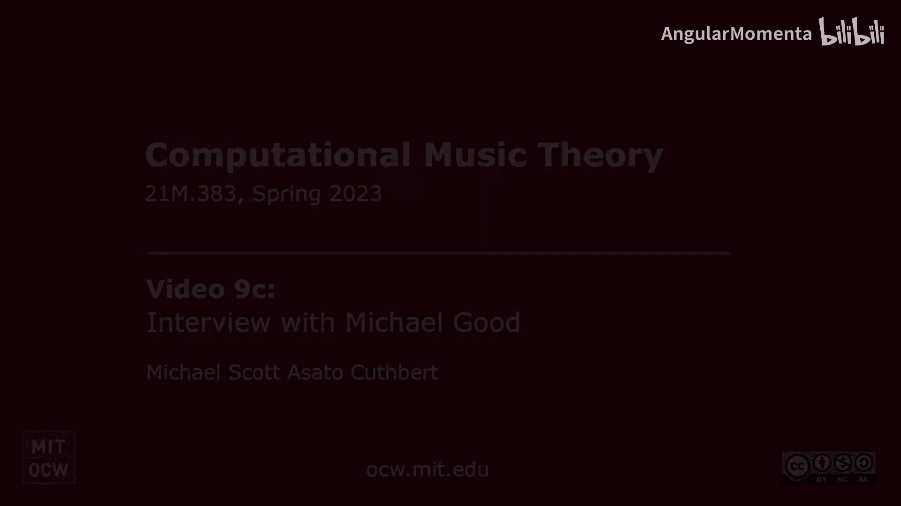

#  022：迈克尔·古德关于 MusicXML 的访谈 🎵

在本节课中，我们将学习 MusicXML 格式的起源、发展及其在音乐技术领域的重要性。通过创始人迈克尔·古德的访谈，我们将了解这一标准格式如何解决音乐软件间的数据交换问题，并探讨其持续成功的原因。

---

## 访谈内容整理

### 背景与动机

2000年，迈克尔·古德在 SAP 公司工作，并担任麻省理工学院媒体实验室的代表。当时，数字乐谱开始兴起，但存在一个严重问题：不同乐谱软件（如 Finale 和 Sibelius）之间无法有效交换数据。用户下载的数字乐谱通常只能在其特定的播放器中打开，这限制了音乐的流通和使用。

迈克尔意识到，如果没有一个能在不同应用程序间交换乐谱的标准格式，数字音乐市场将难以发展。他设想创建一个类似 **MIDI**（用于乐器）或 **HTML**（用于网页）的通用交换格式。

### 构思与验证

为了验证自己的想法，迈克尔咨询了他的论文导师、麻省理工学院媒体实验室的巴里·维科教授。巴里教授认为这个想法可行。随后，迈克尔前往斯坦福大学，与 **Musedata** 项目的沃尔特·休利特和埃勒·塞尔弗里奇-菲尔德，以及 **Humdrum** 工具包的开发者大卫·赫伦进行了交流。这些讨论帮助他完善了初步构想。

最终，MusicXML 的第一个版本是基于 **Musedata** 的 **XML** 实现。选择 XML 是因为当时 SAP 公司正使用 XML 在不同系统间进行通信。迈克尔认为，利用这种得到整个计算机行业支持的标准技术来交换音乐记谱数据是合理的。

**核心概念**：MusicXML 的设计目标非常明确——**优化应用程序间的数据交换**，而不是作为任何特定应用程序的原生文件格式。

### 推动行业采纳

迈克尔深知，要让 MusicXML 获得成功，必须得到主流乐谱软件（Finale 或 Sibelius）的支持。他给自己设定了一个目标：在两年内实现与其中任一软件的**双向通信**（既能导入也能导出）。

经过评估，他发现 Finale 的插件开发工具包比 Sibelius 的更完善，因此他开发了一个能够实现双向通信的 Finale 插件。

真正的转折点来自于与苏格兰开发者格雷厄姆·琼斯的合作。格雷厄姆开发了当时最好的乐谱扫描软件 **SharpEye**，但其扫描结果只能通过 **MIDI** 导出，导致大量识别信息在导入乐谱软件时丢失。

迈克尔联系了格雷厄姆，提议让 SharpEye 支持 MusicXML 导出。这样，用户就能将高质量的扫描结果直接导入 Finale。格雷厄姆采纳了这个建议，编写了 MusicXML 导出功能。

当 MakeMusic 公司（Finale 的开发商）看到 SharpEye 通过 MusicXML 提供的互操作性比他们自己内置的或 Sibelius 的解决方案更好时，他们开始对 MusicXML 产生兴趣，并在 **Finale 2003 for Windows** 中集成了该插件。

一旦 Finale 提供了原生支持，MusicXML 的推广便进入了快车道。迈克尔花费了11年时间积极向开发者推广这一格式。如今，支持 MusicXML 的应用程序已超过 **250** 个。

### 成功的关键因素

迈克尔认为，MusicXML 的成功始于连接了两个不同领域的领先产品：**Finale**（乐谱创作）和 **SharpEye**（乐谱扫描）。这种组合解决了实际痛点，形成了“滚雪球”效应。

行业领导者最初对标准格式持怀疑态度，担心失去用户锁定优势。因此，MusicXML 被刻意设计为**不偏向任何特定软件的实现方式**，而是**对乐谱本身进行建模**。这避免了陷入“Finale 风格”或“Sibelius 风格”的争论。

当迈克尔向 MakeMusic 公司展示已经可以双向工作的插件时，时任 CEO 约翰·保尔森意识到无法阻止这一趋势，于是决定拥抱它，这最终为公司带来了巨大利益。

### 发展与未来

迈克尔最初创立了自己的公司 **Recordare** 来开发和推广 MusicXML。2011年，MakeMusic 收购了 Recordare 的资产，迈克尔自此成为 MakeMusic 的员工。

为了确保格式的中立性和持续发展，在乔·伯科维茨的长期推动下，MusicXML 和 Steinberg 公司的 **SMuFL**（标准音乐字体布局）标准一同转移到了 **万维网联盟** 进行维护，并成立了独立的 **音乐记谱社区组**。

目前，社区组正在开发下一代格式 **MNX**，旨在解决 MusicXML 作为交换格式的局限性，并尝试为更简单的、基于 Web 的应用程序提供一个更好的**原生格式**。同时，**MusicXML 4.0** 也在开发中，以持续改进现有用例。

迈克尔强调，不同的格式适用于不同的任务：
*   **MusicXML** 专为**应用程序间交换**优化。
*   **MNX** 目标是为**原生编辑和简单应用**设计。
*   **MEI** 等格式则为**音乐学**等特定领域优化。

### 给学生的建议

作为一名麻省理工学院的毕业生，迈克尔结合自身经历，为热爱计算机和音乐的学生提供了以下建议：

**保持音乐表演实践**：作为成年人，如果想保持高质量的表演机会，选择声乐或弦乐可能比管乐更容易，因为社区合唱团和管弦乐团更多。迈克尔本人就在30岁时转向演唱，并与妻子一起参与歌剧合唱。

**认识行业规模**：音乐科技是一个相对较小的产业。迈克尔职业生涯的前20年主要从事人机交互工作，因为当时计算机音乐产业尚未成型。进入这个行业需要决心和努力。

**积极行动与展示**：
1.  **动手实践**：开展项目，并将成果展示出来。
2.  **参与开源**：为开源项目做贡献是积累经验和知名度的好方法。
3.  **建立人脉**：参加行业展会（如 **NAMM Show**），主动联系你感兴趣的公司。即使作为学生，也可以通过公司邀请等方式获得入场机会。
4.  **利用资源**：MusicXML 官网列出了所有支持该格式的软件，这是一个寻找相关公司和机会的实用列表。

**选择适合自己的道路**：每个人的路径都不同。迈克尔选择创业，但这需要一定的经济保障（他坦言得益于配偶的支持）。大多数人可以从加入现有公司或团队开始。

---

## 总结

本节课中，我们一起学习了 MusicXML 的诞生故事。我们了解到，它源于解决数字乐谱**互操作性**问题的实际需求，通过连接**扫描**与**制谱**两个关键环节获得初步成功。其设计哲学是**中立地建模音乐本身**，而非特定软件的实现，这为其广泛采纳奠定了基础。如今，它由 **W3C** 社区维护，并与 **MNX** 等新格式共同演进，以满足未来需求。迈克尔·古德的经历也告诉我们，将技术与艺术结合，需要持续的热情、积极的实践和不断的 networking。