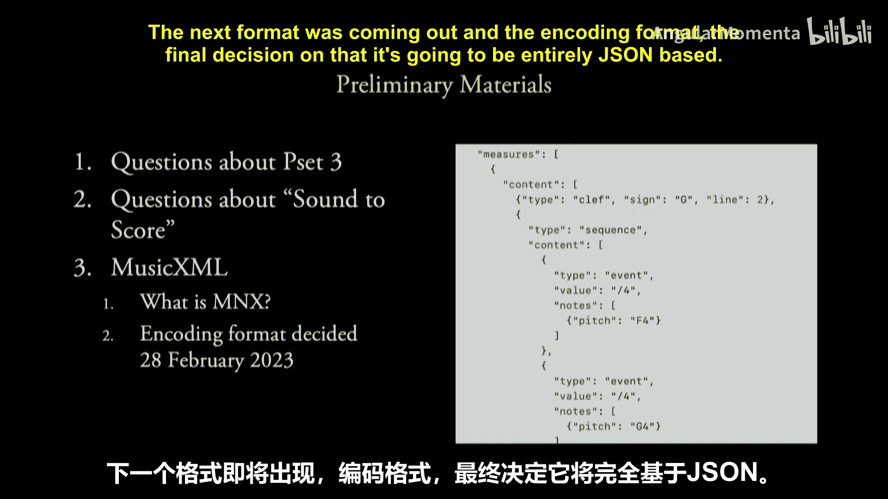
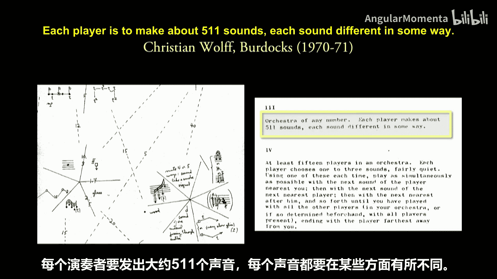
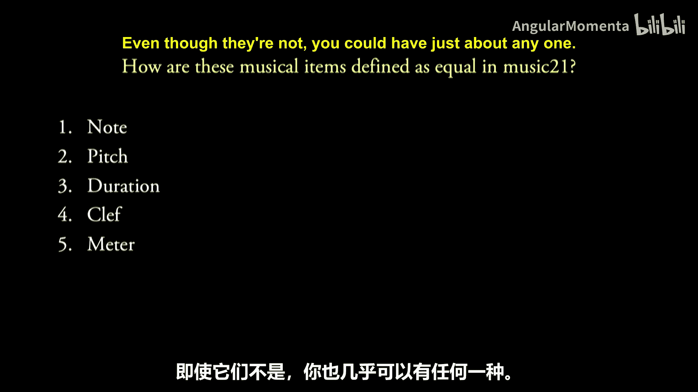
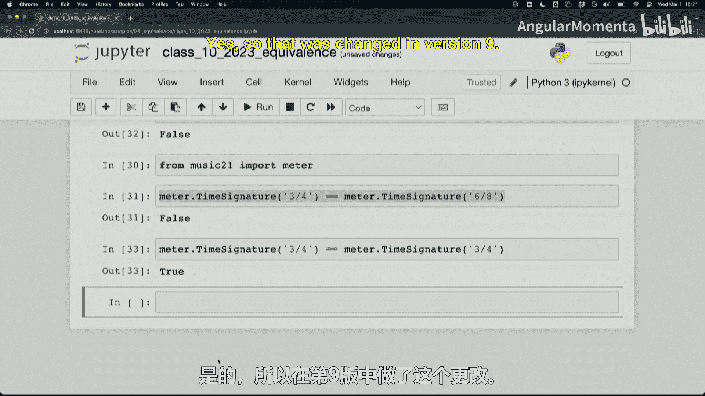
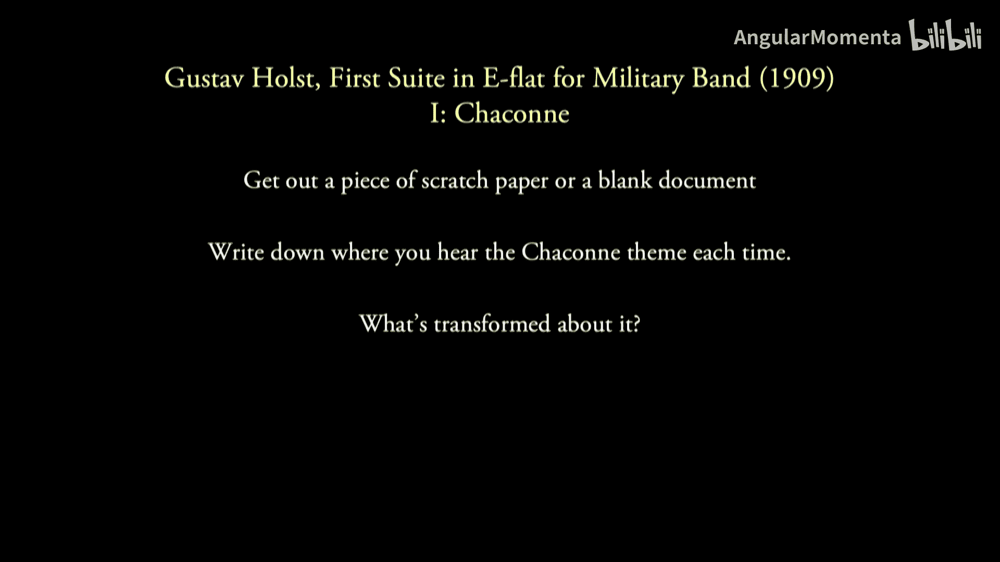
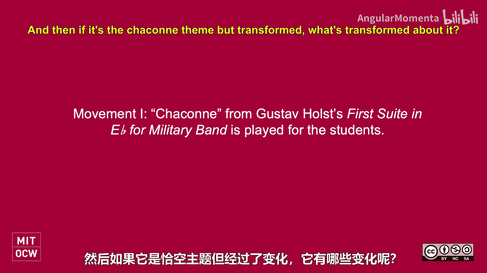
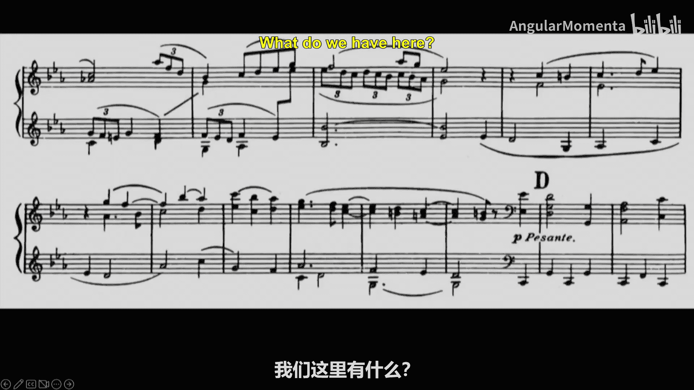
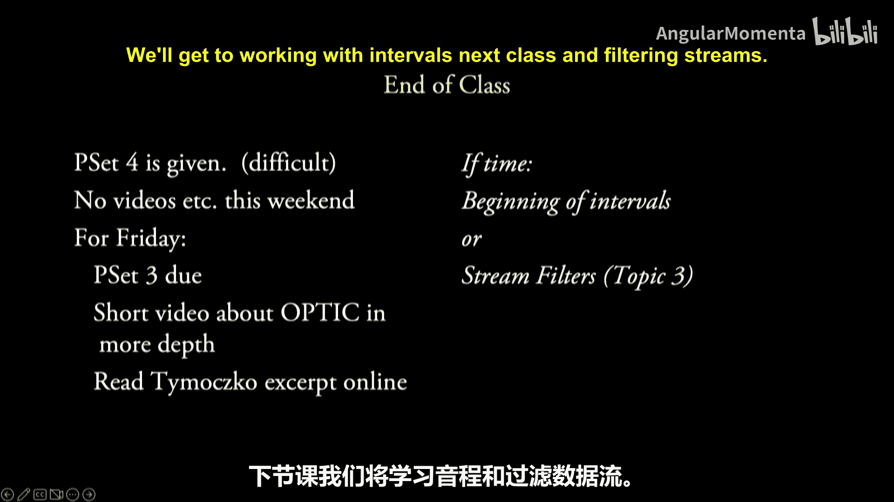

#  023：等价与区间（一）；层级结构（四）


在本节课中，我们将要学习音乐中的“等价”概念，探讨在何种情况下我们可以认为两个音乐元素是“相同”的，并介绍几种常见的音乐等价类。我们还将初步接触区间概念，为后续分析打下基础。

## 概述

音乐分析中，我们经常需要判断两个音符、和弦或乐句是否“相同”。然而，“相同”的定义并非一成不变，它高度依赖于具体的分析目标和上下文。本节课将引导我们思考音乐等价性的多种维度，并理解在计算分析中如何定义和运用这些等价关系。

## 音乐中的“相等”意味着什么？



首先，让我们思考一个基本问题：两个音符在什么情况下可以被认为是相等的？

在编程中，我们通常使用 `==` 运算符来检查两个对象是否相等。但在音乐中，情况要复杂得多。例如，考虑音符 C4 和另一个 C4。如果它们的音高、时值都相同，我们可能认为它们相等。但如果其中一个带有歌词“Hello”，另一个带有歌词“Bonjour”，它们还相等吗？在音乐21库中，**歌词并不影响音符的相等性判断**。

更复杂的情况是**等音变换**，例如 B♯3 和 C4。在十二平均律中，它们具有相同的 MIDI 编号（均为 60），听起来音高相同。然而，在乐谱上，它们有不同的记谱方式（拼写）和不同的八度标记（B♯3 属于八度 3，C4 属于八度 4）。音乐21默认认为它们**不相等**，因为它们的音名和八度信息不同。



这引出了我们的核心观点：**“相等”的定义是相对的，取决于分析时所关注的音乐属性**。我们可以根据需求，自定义“相等”的判断标准。例如，如果我们只关心绝对音高，可以定义两个音符在 MIDI 编号相同时即为相等。

```python
# 示例：自定义基于MIDI编号的音符相等性判断
def new_eq(self, other):
    return self.pitch.midi == other.pitch.midi



import music21
music21.note.Note.__eq__ = new_eq
```

## 多样的音乐等价类

在实际音乐作品（如霍尔斯特的《行星》组曲）中，一个主题会以多种形式出现：改变配器、改变动态、改变音区、甚至进行倒影变形。我们依然能识别出这是“同一个”主题，这说明存在多种“等价”关系。



以下是音乐分析中常见的几种等价类，它们构成了不同层次的抽象：





1.  **O - 八度等价**：忽略八度差异。例如，C4、C5、C3 被视为同一音高级别的成员。
2.  **P - 排列等价**：忽略和弦内音符的排列顺序。例如，C-E-G 和 E-G-C 被视为同一个 C 大三和弦。
3.  **T - 移调等价**：忽略整体的调性平移。例如，一个 C 大调的旋律与一个 G 大调的旋律被视为具有相同的音程结构。
4.  **I - 倒影等价**：将音高进行镜像反转后视为相关。在某些（尤其是后调性）音乐中，一个旋律与其倒影形式被认为属于同一个集合。
5.  **C - 基数等价**：只关注音高数量，忽略具体是哪些音高。例如，任何三个音的组合都被归为“三音组”类别。
6.  **拼写/等音等价**：忽略记谱上的等音差异（如 B♯ 与 C）。在纯粹的音高集合分析中，这通常是默认假设。



**关键在于，这些等价类并非总是同时适用。** 在不同的音乐风格和分析任务中，我们需要选择性地应用它们。例如，在和声分析中，我们可能同时应用 O（八度）和 P（排列）等价；而在分析一首严格的对位作品时，音符的精确顺序（P）可能至关重要，不能忽略。

## 等价类与音乐分析实践

上一节我们介绍了多种音乐等价类，本节中我们来看看它们如何与具体的音乐理论概念结合。

以三和弦为例：
*   **大三和弦**（如 C-E-G）和**小三和弦**（如 A-C-E）在**倒影等价（I）** 下是相关联的。一个大三和弦的音程结构是“大三度+小三度”，将其倒影后，会得到“小三度+大三度”的结构，这正是小三和弦的结构。因此，它们拥有相同的音程含量。
*   **增三和弦**（如 C-E-G♯）和**减三和弦**（如 C-E♭-G♭）则不存在这种简单的倒影等价关系，它们的音程构成是不同的。

这个例子说明，等价类的应用能帮助我们洞察音乐结构深层的联系与对称性。

## 总结




本节课中我们一起学习了音乐中“等价”概念的复杂性与多维性。我们认识到，在计算音乐分析中，不存在一个普适的“相等”定义，而需要根据分析目的灵活定义。我们介绍了几种核心的音乐等价类（O、P、T、I、C 及等音等价），并理解了它们在不同音乐上下文中的应用与限制。掌握这些概念是进行自动化音乐分析、模式识别和高级音乐信息检索的重要基础。在接下来的课程中，我们将学习如何利用这些等价概念来处理音程和分析音乐层级结构。