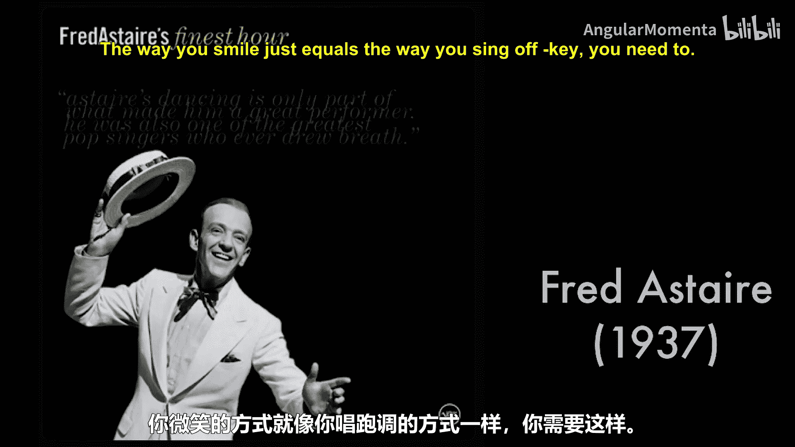
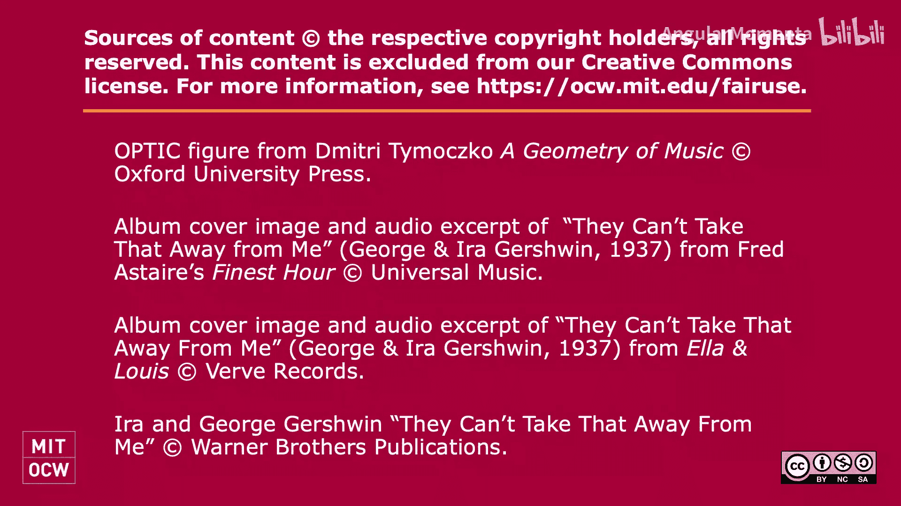

#  024：等价类与OPTIC

在本节课中，我们将学习音乐结构比较中的核心概念——等价关系。我们将探讨“相等”在音乐中并不意味着“完全相同”，并介绍Dmitri Tymoczko提出的OPTIC五种等价类型。理解这些概念对于使用计算机识别和分析音乐模式至关重要。

## 等价关系的基本概念

上一节我们介绍了课程主题，本节中我们来看看“相等”在音乐中的特殊含义。在音乐理论中，两个结构“相等”通常意味着它们在某种特定关系下被视为相同，而非在所有细节上都完全一致。这与我们日常生活中的平等观念类似：平等对待他人并不意味着认为所有人都完全相同。

## 音乐中的等价关系示例

为了具体理解，让我们通过钢琴演示几种不同的音乐等价关系。以下是几种常见的音乐等价情境：

*   **排列等价**：在讨论和弦时，音符的排列顺序通常不影响和弦的身份。例如，C-E-G、E-G-C和G-C-E在功能和声语境下都被视为同一个C大三和弦。
*   **八度等价**：不同八度的同一个音名通常被视为“相同”的音高类别。例如，C2、C3、C4都被归为“C”这个音级。然而，在要求演奏特定八度的旋律时，这种等价关系就不适用了。
*   **拼写等价**：在平均律体系中，等音（如升F和降G）在音高上是相同的。但在需要明确和声功能的乐理练习中，正确的拼写至关重要。
*   **移调等价**：一段旋律移动到另一个调上演奏，我们仍认为它是“同一首”曲子。例如，在不同调上演奏的《玛丽有只小羊羔》。
*   **倒影等价**：将一个旋律或音程进行上下翻转。在某些现代音乐理论分析中，原形与其倒影形式可能被视为相关。例如，15世纪著名的《武装的人》旋律就常被用作倒影创作的基础。

此外，还存在其他可能的等价关系，例如**基数等价**（在钢琴上，弹奏一个音或重复弹奏同一个音，在听感上可能被视为相同），以及**律制等价**（在不同调律系统下，构成“大三和弦”的音程可能有细微差别，但我们仍将其识别为同一类和弦）。

## OPTIC：五种等价关系

Dmitri Tymoczko在其著作中系统性地总结了音乐分析中常见的五种等价关系，合称为OPTIC：

以下是OPTIC五种等价关系的具体内容：

1.  **八度等价**：忽略音高的八度差异。
2.  **排列等价**：忽略和弦或集合中音符的排列顺序。
3.  **移调等价**：允许整个结构在音高空间中进行平移。
4.  **倒影等价**：将结构围绕一个轴进行镜像翻转。
5.  **基数等价**：忽略集合中元素重复的次数。

## 计算实现与思考

当我们使用Python和Music21这样的工具进行音乐计算时，理解这些等价关系至关重要。每个计算对象（如音符、和弦）通常只内置了一种“相等”的定义（通过`==`运算符实现）。我们需要思考：
*   这种内置的相等判断基于哪种等价关系？
*   这个设计选择是否合理？
*   对于不同的分析任务，我们是否需要定义新的等价关系？

例如，在代码中判断两个和弦是否“相等”时，我们必须明确是基于音符的精确匹配、忽略八度的音级匹配，还是忽略排列顺序的音高集合匹配。

本节课中我们一起学习了音乐结构比较中的核心思想——“相等”的多样性。我们探讨了从排列、八度到移调、倒影等多种等价关系，并介绍了OPTIC这一系统分类。理解这些概念是使用计算工具进行有效音乐模式识别和分析的基础。在接下来的阅读和练习中，请思考如何在具体情境中选择和应用合适的等价关系。